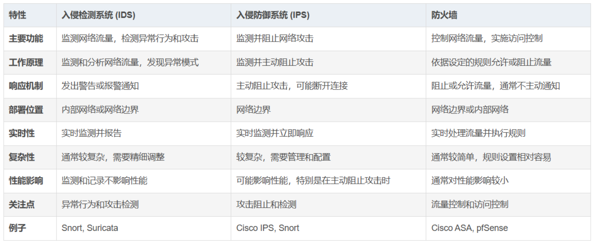

# 8 计算机网络中的安全

## 8.1 什么是网络安全

安全通信的性质：

1. **机密性**：仅有发送方和希望的接收方能够理解传输报文的内容。对报文**加密**
2. **报文完整性**：通信的内容在传输过程中未被改变（恶意篡改或意外改动）
3. **端点鉴别**：发送方和接收方都应该能证实通信过程所涉及的另一方，以确信通信的另一方确实具有其所声称的身份 
4. **运行安全性**

## 8.2 密码学原理

报文的最初形式称为**明文**，用户 A 使用**加密算法**加密其明文报文，生成的加密报文称为**密文**，并提供一个**密钥** $K_A$ 作为加密算法的输入。加密算法以密钥和明文报文 $m$ 为输入，生成的密文作为输出。$K_A(m)$ 表示 明文报文 $m$ 的密文形式。用户 B 为**解密算法**提供密钥 $K_B$，将密文和 B 的密钥作为输入，输出初始明文

- 对称密钥系统：A 和 B 的密钥是相同且秘密的
- 公开密钥系统：使用一对密钥，一个密钥公开可知（A 和 B 都知道），另一个密钥只有 A 或 B 知道

### 8.2.1 对称密钥密码体制

### 8.2.2 公开密钥加密

**公钥**：$K_B^+$，**私钥**：$K_B^-$。$K_B^-(K_B^+(m)) = K_B^+(K_B^-(m)) = m$

**RSA**：

1. 公钥和私钥的选择：
   - 选择两个大素数 $p$ 和 $q$，值越大破解 RSA 越困难，加密解密的时间越长
   - 计算 $n=pq$ 和 $z=(p-1)(q-1)$
   - 选择小于 $n$ 的一个数 $e$，且使 $e$ 和 $z$ 互素
   - 求一个数 $d$，使 $ed-1$ 可以被 $z$ 整除，即 $ed mod z = 1$
   - 公钥 $K_B^+$ 是一对数 $(n,e)$，其私钥 $K_B^-$  是一对数 $(n,d)$

2. 加密和解密算法

   - A 发送一个由整数 $m$ 表示的比特组合（$m<n$），A 执行 $m^e$，计算 $m^e$ 被 n 除的整数余数，即，A 的明文报文 m 的加密值 $c = m^e \mod n$，将 $c$ 发送给 B

   - B 解密时计算 $m = c^d \mod n$

RSA算法的工作原理

- 模算数运算的一个重要性质：$(a\mod n)^d \mod n = a^d \mod n$
- $(m^e \mod n)^d \mod n = m^{ed} \mod n$​
- 数论中的结论：对于素数 $p$ 和 $q$，且有 $n=pq$ 和 $z=(p-1)(q-1)$，则 $x^y \mod n = x^{(y \mod z)} \mod n$
- $m^{ed} \mod n = m^{(ed \mod z)} \mod z$，因为 $ed \mod z = 1$，则有 $m^{ed} \mod n = m^1 \mod n =m$

## 8.3 报文完整性和数字签名

报文鉴别

### 8.3.1 密码散列函数

密码散列函数：以 $m$ 为输入，计算得到一个称为散列的固定长度的字符串 $H(m)$​

性质：找到任意两个不同的报文 x 和 y 使得 $H(x)=H(y)$​，在计算上是不可能的

### 8.3.2 报文鉴别码

### 8.3.3 数字签名

1. B 生成一个数字签名：用私钥 $K_B^-$ 加密报文 m，$K_B^-(m)$，A 用公钥 $K^+_B$ 解密

## 8.4 端点鉴别

1. 鉴别协议 ap2.0

   - 如果 A 有一个总是用于通信的周知网络地址，则 B 能够试图通过验证携带鉴别报文的 IP 数据报的源地址是否与 A 的周知 IP 地址相匹配来进行鉴别

   - 安全问题：生成一个 lP 数据报，并在 IP 数据报中填入我们希望的任意源地址，再通过链路层协议把生成的数据报发送到第一跳路由器

2. 鉴别协议 ap3.0

   - 使用秘密口令。口令是鉴别者和被鉴别者之间的一个共享秘密
   - 安全问题：窃听通信，得知口令

3. 鉴别协议 ap3.1

   - 加密口令。
   - 安全问题：回放攻击。窃听通信并记录口令的加密版本

4. 鉴别协议 ap4.0

   - **不重数**：在一个协议的生存期中只使用一次的数 
   - A 向 B 发送报文，B 选择一个不重数 R，然后把这个值发给 A
   - A 用和 B 共享的对称密钥 $K_{A-B}$ 加密不重数，且将加密后的不重数 $K_{A-B}(R)$ 发回给 B，不重数用于确定 A 是活跃的
   - B 解密收到的报文，解密得到的不重数相等，则可鉴别 A 的身份

## 8.5 安全电子邮件

### 8.5.1 安全电子邮件概述

### 8.5.2 PGP

## 8.6 使 TCP 连接安全：TLS

### 8.6.1 宏观描述

### 8.6.2 更完整的描述

## 8.7 网络层安全性：IPsec 和虚拟专用网

**IP 安全协议：IPsec**

### 8.7.1 IPsec 和虚拟专用网

VPN

### 8.7.2 AH 协议和 ESP 协议

当某源 IPsec 实体向一个目的实体发送安全数据报时，它可以使用 AH 协议或 ESP 协议

1. **鉴别首部（AH）协议**：提供源鉴别和数据完整性服务，不提供机密性服务
2. **封装安全性载荷（ESP）协议**：提供了源鉴别、数据完整性和机密性服务 

### 8.7.3 安全关联

### 8.7.4 IPsec 数据报

### 8.7.5 IKE：IPsec 中的密钥管理

## 8.8 实现安全的无线局域网和 4G/5G 蜂窝网络

### 8.8.1 802. 11 无线局域网中的鉴别和密钥协商

### 8.8.2 4G/5G 蜂窝网络中的鉴别和密钥协商

## 8.9 运行安全性：防火墙和入侵检测系统

### 8.9.1 防火墙

防火墙：一个硬件和软件的结合体。 将一个机构的内部网络与整个因特网隔离开，允许一些数据分组通过而阳止另一些分组通过。防火墙允许网络管理员控制外部和被管理网络内部资源之间的访问，这种控制是通过管理流入和流出这些资源的流量实现的

防火墙具有3个目标：从外部到内部和从内部到外部的所有流量都通过防火墙；仅被授权的流量允许通过；防火墙自身免于渗透

防火墙分为3类：**传统分组过滤器**、**状态过滤器**、**应用程序网关**

1. **传统分组过滤器**：
   - 一个机构通常都有一个将其内部网络与其 ISP 相连的网关路由器。所有离开和进入内部网络的流量都要经过这个路由器。这个路由器正是进行**分组过滤**之处
   - 分组过滤器独立地检查每个数据报，然后基于管理员特定的规则决定该数据报应当允许通过还是应当丢弃。
   - 过滤决定通常基于下列因素：
     - IP 源或目的地址
     - 在 IP 数据报中的协议类型字段：TCP、UDP、ICMP、OSPF
     - TCP或UDP的源和目的端口
     - TCP标志比特：SYN、ACK 等
     - ICMP 报文类型
     - 数据报离开和进入网络的不同规则
     - 对不同路由器接口的不同规则
2.  **状态分组过滤器**：
   - 在传统的分组过滤器中，根据每个分组分离地做出过滤决定。状态过滤器实际跟踪 TCP 连接，并使用这种知识作出过滤决定
3. **应用程序网关**：
   - 分组级过滤使得一个机构可以根据 IP 的内容和 TCP/UDP 首部执行粗粒度过滤
   - 应用程序网关除了看 IP/TCP/UDP 首部外，还基于应用数据来做策略决定
   - 一个应用程序网关是一个应用程序特定的服务器，所有应用程序数据都必须通过它。多个应用程序网关可以在同一主机上运行，但是每一个网关都是有自己的进程的单独服务器

### 8.9.2 入侵检测系统

当观察到潜在恶意流量时能产生告警的设备称为**入侵检测系统（IDS）**

滤除可疑流量的设备称为**入侵防止系统（IPS）**

IDS、IPS 与防火墙的区别

