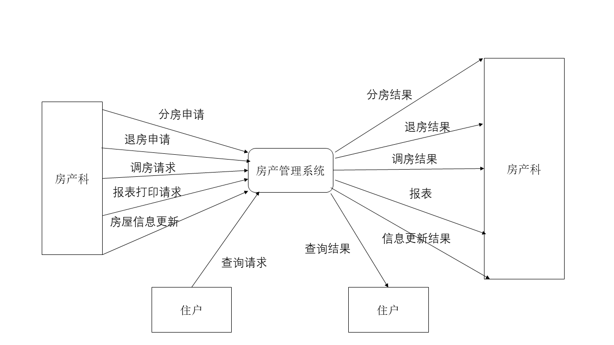
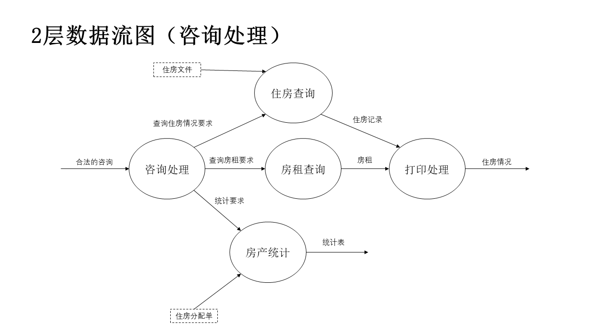
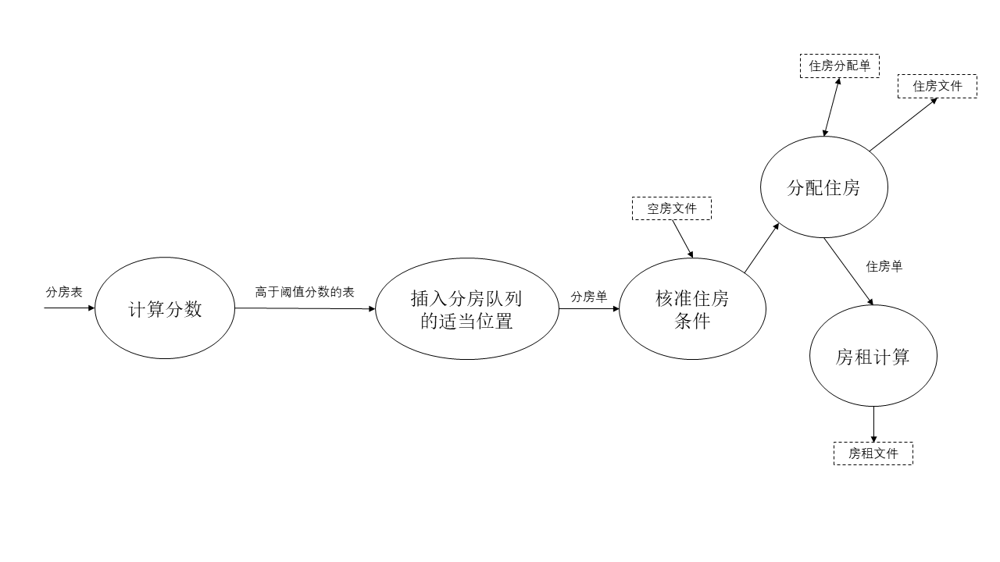
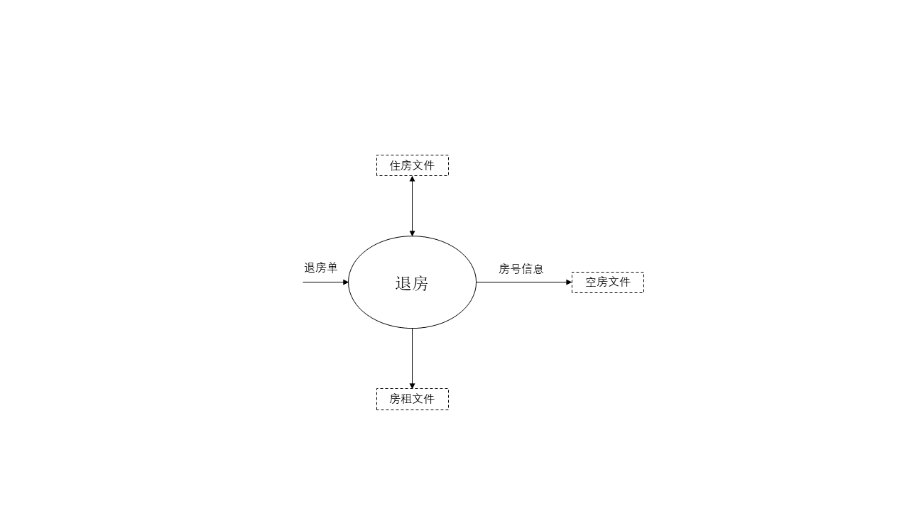

某大学拟开发一个用计算机进行房产管理的系统，要求系统具有分房、调房、退房和咨询统计等功能。

房产科把用户申请表输入系统后，系统首先检查申请表的合法性，对不合法的申请表系统会拒绝接受；对合法的申请表则根据其类型分别进行处理。

如果是分房申请：

- 根据申请者的情况（年龄、工龄、职称、职务、家庭人口等）计算其分数，当分数高于阈值分数时，按分数高低将申请表插到分房队列的适当位置。

- 每月最后一天进行一次分房活动：从空房文件中读出空房信息（房号、面积、等级、单位面积房租等）；把好房优先分配给排在前面的符合该等级住房条件的申请者，从空房文件中删除这个房号的信息，从分房队列中删除该申请者；把此房号的信息和住房信息一起写入住房文件中，输出住房分配单给住户，同时计算房租写入房租文件中。

如果是退房申请，则从住房文件和房租文件中删除有关信息，再把此房号的信息写到空房文件中。

如果是调房申请，则根据申请者的情况确定其住房等级，然后在空房文件中查找属于该等级的空房，退掉原住房，再进行与分房类似的处理。

住户可向系统询问分房的阈值分数，居住某类房屋的条件，某房号的单位面积房租等信息。房产科可要求系统打印出住房情况的统计表，或更改某类房屋的居住条件、单位面积房租等信息。

- 根据上面的需求，基于数据流图构造系统的逻辑模型。
- 对模型逐层进行精化，直到无须分解为止。并主动补充模糊的需求。
- 说明需求分解到这样的模型停下来的依据是什么？
- 从需求模型出发，基于利用数据流图的转换方法，构造概要设计的草图。
- 根据模块独立性启发式准则，从设计草图得到最后的设计。
- 说明依据模块独立性启发式准则进行结构优化时，参考了哪些准则，进行了怎样的优化？

