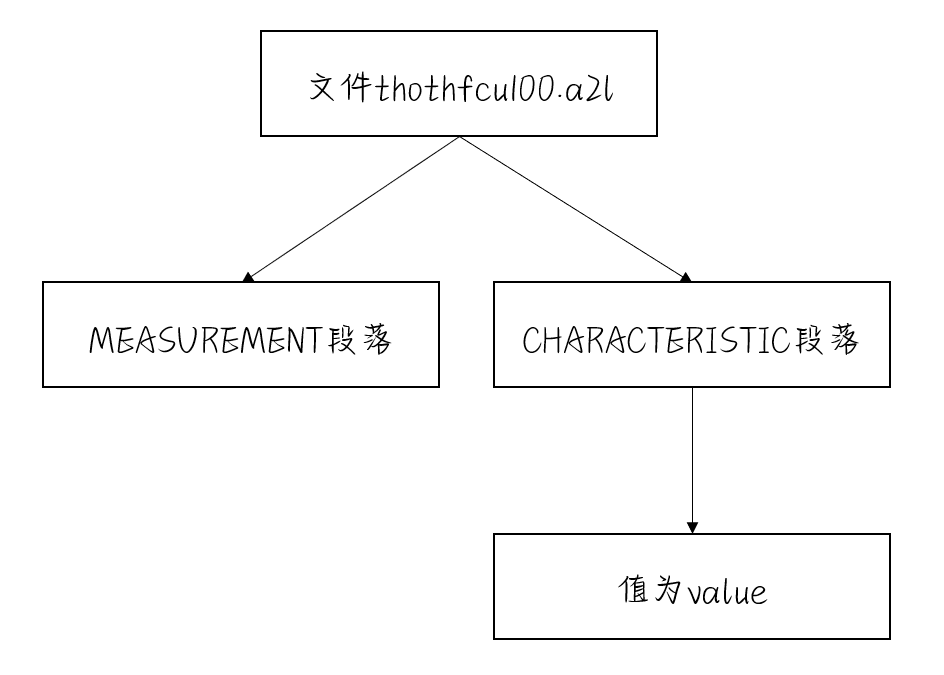

附件 `thothfcu100.a2l` 是一个用于嵌入式系统标定的数据文件，文件用段落的方式存储了变量的属性，现要求实现一段代码，对文件进行分析。

1. 要求使用Jackson方法完成设计
2. 给定的文件中，仅处理 MEASUREMENT 段落和 CHARACTERISTIC且值为value 段落中的内容
3. 设计一个数据结构，使用者可以方便地通过变量的名字，访问变量的各种属性
4. 跟据你的设计实现代码 C/C++均可。
5. 你的设计是否兼容功能变化，比如需求改为处理所有CHARACTERISTIC段落的内容，你的设计需要做怎样的改变呢？说明需要修改的地方？
6. 针对原始需求是否存在比你最初的设计更好的方案，容易地兼容变化呢？

## 1. 使用Jackson方法完成设计




## 2. 数据结构设计

为了满足实验要求，我们定义了一个名为 `VariableAttributes` 的结构体，用于存储单个变量的所有相关信息。这个结构体包含以下字段：

- `sectionName`：区分数据来源于 `CHARACTERISTIC` 还是 `MEASUREMENT` 部分。
- `variableName`：变量的名称，作为查询的关键字。
- `attributes`：一个哈希表，其中键为整数，值为字符串，用于存储变量的各种属性，如 ECU 地址、记录布局等。

此外，我们使用了一个名为 `Database` 的哈希表作为主数据库，用于存储所有解析的变量数据。这里，键是段落名称（如"CHARACTERISTIC"或"MEASUREMENT"），而值是一个包含`VariableAttributes`结构的向量，这样可以根据段落分类存储和访问所有变量。

## 3. 代码设计

### 3.1 解析功能的实现

`parseA2lFile`函数是解析A2L文件的核心。该函数打开指定的A2L文件，并逐行读取内容。对于每个找到的`CHARACTERISTIC`或`MEASUREMENT`段落，函数会创建一个`VariableAttributes`对象，填充必要的信息，并将其添加到相应的列表中。

### 3.2 用户交互

在`main`函数中，程序循环等待用户输入想要查询的段落名称和变量名称。根据输入的段落名称，程序会在相应的列表中查找匹配的变量名称，并输出所有相关的属性。

具体实现在thothfcu100.cpp文件中

运行结果如下：


## 4. 兼容功能变化

只需将 `if (line == "   /begin CHARACTERISTIC")` 这个判断条件中的内容修改为以下：

```C++
if (line == "    /begin CHARACTERISTIC" || line == "    /begin CHARACTERISTIC      ")
{
    getline(file, line);
    VariableAttributes currentCharacteristic;
    currentCharacteristic.sectionName = "CHARACTERISTIC";
    currentCharacteristic.variableName = line.substr(40, line.length() - 40);
    for (int i = 1;; i++)
    {
        getline(file, line);
        if (line == "    /end CHARACTERISTIC")
        {
            break;
        }
        else if (line == "      /begin AXIS_DESCR                 " || line == "      /end AXIS_DESCR")
        {
            continue;
        }
        else
        {
            currentCharacteristic.attributes[i] = line.substr(40, line.length());
        }
    }
    characteristics.push_back(currentCharacteristic);
}
```

运行结果如下：


## 5. 更好的方案

### 5.1 抽象化的解析器设计

当前解析器直接在文件读取循环中处理所有逻辑，这使得函数过于庞大且功能集中。将解析逻辑分解为独立的函数或类，每个负责处理特定类型的段落，可以使代码更加模块化，更易于管理和扩展。例如，可以有独立的函数来处理`CHARACTERISTIC`和`MEASUREMENT`段落的解析。

### 5.2 面向对象的数据模型

当前的`VariableAttributes`结构通过一个通用的属性字典来存储所有属性。这种设计虽然具有一定的灵活性，但在访问特定属性时可能需要执行类型转换，且容易出错。改为使用面向对象的方法，为每种类型的段落定义专门的类，可以提高类型安全性和代码清晰度。例如，为`CHARACTERISTIC`和`MEASUREMENT`定义不同的类，每个类有其特定的属性和方法。