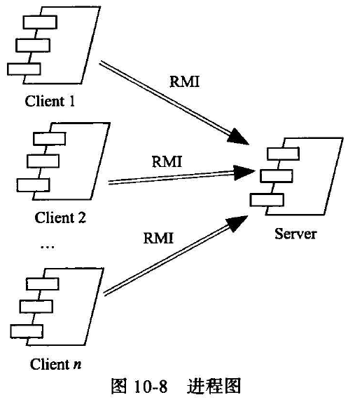
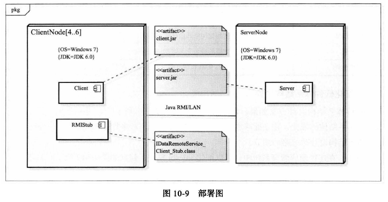
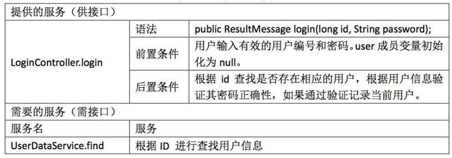

# 第十章 软件体系结构设计与构建

## 10.1 体系结构设计过程

1. 分析关键需求和项目约束
2. 选择体系结构风格
3. 进行软件体系结构逻辑（抽象）设计
4. 依赖逻辑设计进行软件体系结构物理（实现）设计
5. 完善软件体系结构设计
6. 定义构件接口
7. 迭代过程 3-6

### 10.1.1 分析关键需求和项目约束

- 明确体系结构设计有哪些输入要素：软件需求规格说明和项目约束
- 软件需求规格说明中的关键性需求
  - 概要功能需求
  - 非功能性需求：质量、性能、约束、接口
- 项目约束：开发团队、市场大小、项目预算、项目进度、项目风险、开发环境、开发技术
- 体系结构设计必须落实所有的功能性需求和非功能性需求，并且必须满足项目的约束条件。在所有的需求和约束中，如果有些对项目特别关键，就需要设计时格外注意。

### 10.1.2 选择体系结构风格

- 体系结构风格封装了已重复验证、可复用并且语义内聚的一组设计机制，是成功软件设计经验的总结
- 依据：风格的特点是否能与关键需求和项目约束相兼容

### 10.1.3 软件体系结构逻辑设计

- 依据概要功能需求与体系结构风格建立初始设计
  - 将需求分配到子系统和模块
- 使用非功能性需求与项目约束评价和改进初始设计
  - 能够满足项目约束：
    - 分层风格能促进并行开发，从而缩短开发时间
    - 分层风格可以使用Java 技术，而不使用Web 技术
  - 无法满足安全需求(Security !~Security3) 和网络分布约束(IC2)，所以需要改进：
    - 为使其满足安全需求，可以增加用户登录与验证功能
    - 为满足网络分布约束，需要将模块分布到客户端和服务器端组成的网络上

### 10.1.4 包设计原则

1. 共同重用原则（CRP）：一个包中的所有类应该是能够共同重用的
   - **一个包中的所有类应该是能够共同重用的**
   2. 包应重点突出，用户应使用包中的所有类
   2. 根据常见重用对类进行分组：避免给用户不必要的依赖
   2. 遵循CRP通常会导致软件包拆分：获得更多，更小，更专注的包
   2. 减少重新使用者的工作

2. 共同封闭原则（CCP）：包中所有类对于同一类性质的变化应该是共同封闭的，一个变化若对一个包产生影响，则对该包中的所有类产生影响，而对于其他包不造成任何影响
   - **一起修改的类应该放在一起**
3. 重用发布等价原则（REP）：重用的颗粒度就是发布的颗粒度
   - 为重用器分组组件(类)
   2. 单个类通常是不可重用的：几个协作类组成一个包
   3. 包中的类应构成可重用和可释放的模块：模块提供一致的功能
   4. 减少重新使用者的工作
   5. 和相关联的类一起发布，而不是单独进行发布
4. 无环依赖原则（ADP）：在包的依赖关系图中不能存在环。必须是有向无环图。
5. 稳定依赖原则（SDP）：朝着稳定（别人的修改不影响我）的方向进行依赖
   - Ca：输入耦合度，包外部依赖本包的类个数
   2. Ce：输出耦合度，包内部依赖于包外部的类的个数
   3. 不稳定性：$I = \frac{Ce}{Ce + Ca}$，$I$ 越小越稳定

6. 稳定抽象原则（SAP）：包的抽象程度应该和其稳定程度一致
   - 稳定的包应该是抽象的包
   2. 不稳定的包应该是具体的包
   - 包的抽象性用抽象类的数目和包中所有类的数目进行计算
   3. Na：包中抽象类个数，Nc：包中所有类个数，抽象度 $A = \frac{Na}{Nc}$

7. 包设计过程：
   - 先**共同封闭原则**对把可能一同变化的类组织成包进行发布
   - 随着系统的不断增长，我们开始关注创建可重用的元素，于是开始使用**共同重用准则**和**重用发布等价准则**来指导包的组合
   - 最后使用**无环依赖原则**、**稳定依赖原则**、**稳定抽象原则**对包图进行度量，去掉不好的依赖

### 10.1.5 软件体系结构实现（依赖逻辑设计进行软件体系结构物理（实现）设计）

**1、开发包（构件）设计**

**2、运行时的进程**

进程图主要是表明运行时的进程，以及各进程间如何进行通信的

**3、物理部署**

UML 部署图描述了一个运行时的物理硬件节点，以及在这个节点上运行的软件构件的静态视图。部署图主要表明的是构件在物理节点上如何分布的，同时也表明节点之间的物理连接。

### 10.1.6 完善软件体系结构设计

1、完善软件体系结构设计

2、细化软件体系结构设计

数据定义：接口的数据对象、关键类的重要数据结构

1. POJO：Java实体
   - 实体是一个可以代表一个临时的业务实体的对象，比如一个账单或者用户
   2. 没有逻辑业务方法(行为)
   3. 实体必须在使用它们的会话或事务之间持久存在。
   4. 实体是存储在文件或者数据库中的
   5. 实体是一个Beans
2. VO：值对象，逻辑层向展示层传递
   - 价值对象(VO)包含一个或多个公共领域中实体的属性。
   2. 在层之间传递值对象，而不是实体。
   3. **应该考虑实现Serializable**
   4. 值对象可以更新和创建实体。
   5. 实体可以创建价值对象。

### 10.1.7 定义构件接口

1. 根据分配的需求确定模块对外接口

   

2. 初步设计关键类

3. 编写接口规范

**逻辑层接口定义**：

- 设计逻辑层接口符合包设计原则
- 逻辑层接口实际上需要实现的是展示层怎么调用逻辑层，而这是刺激响应序列所描述的东西
- 因此逻辑层接口来源于需求，刺激响应序列，刺激对应于一个输入参数，而响应则是一个返回结果
- 一般一组刺激响应抽象成一个接口
- VO，PO是持久化对象，逻辑层想展示层提供数据VO，数据层想逻辑层提供给数据PO，接收方不可改变数据
- 接口实际上是层与层间的协议，能够实现并行开发

**数据层接口**：

- 数据层接口来源于逻辑层代码，包括其中的增删改查操作

- 需要什么，才提供什么；不需要的就不写了

  - 逻辑层接口更偏向需求，数据层接口则是代码需要
  - 这边只需要一个addsales的操作，其他的数据层接口就不用写了
  - 不同模块的数据层接口可能会重复(毕竟哦都是增删改查)，但是这个是必要的

## 10.2 体系结构的原型构建

### 10.2.1 包的创建

包是用于将系统组织成层次结构的机制，可以根据构件的设计来创建项目的包。

### 10.2.2 重要文件的创建

可选数据：文件系统、文件配置、文件

### 10.2.3 定义构件之间的接口

### 10.2.4 关键需求的实现

1. 实现一些关键**功能需求**
2. 对原型的**非功能性指标**进行估算和验证。如果出现不符合非功能性需求和项目约束的情况，我们还需要重新对体系结构设计进行调整。

## 10.3 体系结构集成与测试

### 10.3.1 集成的策略

1. 大爆炸式集成
2. 增量式
   - **自顶向下式**
     - 自顶向下集成是对分层次的架构，先集成和测试上层的模块，下层的模块使用伪装的具有相同接口的桩（stub）
     - 优点：
       - 按深度优先可以首先实现和验证一个完整的功能需求
       - 只需最顶端一个驱动（driver）
       - 利于故障定位
     - 缺点：
       - 桩的开发量大
       - 底层验证被推迟，且底层组件测试不充分
   - **自底向上式**
     - 从最底层的模块集成测试起，测试的时候上层的模块使用伪装的相同接口的驱动来替换
     - 优点：
       - 对底层组件行为较早验证
       - 底层组件开发可以并行
       - 桩的工作量少
       - 利千故障定位
     - 缺点：
       - 驱动的开发工作量大
       - 对高层的验证被推迟，设计上的高层错误不能被及时发现
   - 三明治式
   - 持续集成

### 10.3.2 桩、驱动与集成测试用例

1. 桩程序：（模仿的是下层模块，用来测试上层）
   - 为了完成程序的编译和连接而使用的暂时代码
   - 对外模拟和代替承担模块接口的关键类
   - 比真实程序简单的多，使用最为简单的逻辑

2. 驱动程序：（模仿的是上层模块，用来测试下层）
   - 利用下层提供的接口，来实现其模仿的模块的功能

3. 集成与构建
   - 集成测试：编写驱动程序，在桩程序帮助下进行集成测试

## 10.4 软件体系结构设计文档描述

## 10.5 体系结构评审

## 10.6 项目实践