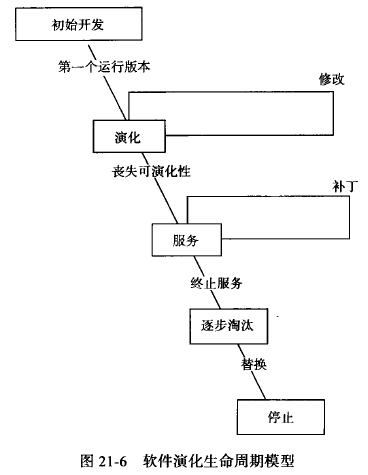

# 第21章 软件维护与演化

## 21.1 软件维护

### 21.1.1 软件可修改性与软件维护

1. 软件维护是在交付之后修改软件系统或其部件的活动过程，以修正缺陷、提高性能或其他属性、适应变化的环境。

2. 软件维护的重要性：
   - 主要是为了保证产品的正常运转而进行使用帮助、故障解决和磨损处理等工作。
   2. 软件维护是在交付之后修改软件系统或其部件的活动过程，以修正缺陷、提高性能或其他属性、适应变化的环境。问题、环境发生了改变，软件产品中存在缺陷。
   3. 软件的维护主要是“修改”。软件不会磨损，软件维护只需要完成少量的使用帮助、故障解决和磨损处理等工作，软件特性上是易于修改的，软件只有持续修改才能保持价值。

### 21.1.2 软件维护的类型

1. 软件变更的常见情景

   - 问题发生了改变

   - 环境发生了改变

   - 软件产品中存在缺陷

2. 软件维护类型划分
   - 完善性维护
   - 适应性维护
   - 修正性维护
   - 预防性维护

### 21.1.3 软件维护的高代价性

- 变更的频繁性
- 维护的困难性
  - 程序理解
  - 影响分析

### 21.1.4 开发可维护的软件

开发阶段更充分的准备可以减轻后期维护的压力和困难

- 考虑软件的可变更性
  - 分析需求的易变性
  - 为变更进行设计
- 为降低维护困难而开发
  - 编写详细的技术文档并保持及时更新
  - 保证代码的可读性
  - 维护需求跟踪链
  - 维护回归测试基线

### 21.1.5 软件维护过程与活动

1. 问题 / 修改的标识、分类：进行变更管理
2. 分析：为后续的修改确定一个基本的规划
3. 设计：依据变更分析的结果和已有系统的信息，完成对系统设计的变更
4. 实现：根据变更的设计，完成代码实现
5. 回归 / 系统测试：确保对变更的修改不会带来连锁的负面效应，要保证系统仍然能够满足其他未被修改的需求
6. 验收测试：由用户、客户或客户指定的第三方来验证系统是否满足用户的变更请求
7. 移交：将修正的系统发布用于安装和运营

## 21.2 软件演化

### 21.2.1 演化与维护

演化与维护是等价的词汇，经常被替换使用，描述了软件交付之后的软件修改活动

维护是只有需求变更所导致修改，演化则是需求变更和需求增量导致的修改

### 21.2.2 软件演化定律

- 持续变化：一个大型软件系统要么进行不断的变化，要么用处会越来越少
- 不断增加的复杂度：随着软件系统的发展，它的复杂性会不断增加，除非进行一定的工作来维持或降低复杂度
- 质量降低：系统的质量将出现下滑，除非进行一定的工作来适应环境变化

### 21.2.3 软件演化生命周期模型与演化活动

人们将软件从**生产到报废**的生命周期分割为不同阶段，每段阶段有明确的典型输入/输出、主要活动和执行人，各个阶段形成明确、连续的顺次过程，这些阶段划分就被称为软件生命周期模型

1. 初始开发

2. 演化

3. 服务

4. 逐步淘汰

5. 停止

## 21.3 软件维护与演化的常见技术

### 21.3.1 遗留软件

### 21.3.2 逆向工程

### 21.3.3 再工程