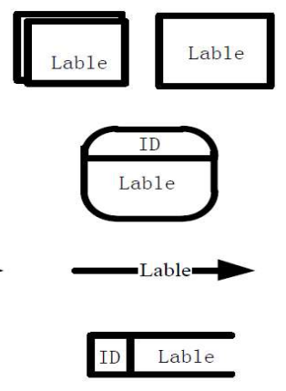

[TOC]

# 第六章 需求分析方法

## 6.1 需求分析基础

### 6.1.1 需求分析的原因

需求分析的任务：
（1）建立分析模型，达成开发者和用户对需求信息的共同理解
（2）依据共同的理解，发挥 创造性，创建软件系统解决方案

### 6.1.2 需求分析模型

1、模型：模型是对事物的抽象

2、建模：

- 抽象
- 分解

3、需求分析模型的特点及常见需求分析模型

需求分析模型是专门用来描述软件解决方案的模型技术。因为软件解决方案介于用户描述与软件内部构造之间，所以需求分析模型也是介于用户概念和软件内部实体之间的模型形式。

- 常见的需求分析模型

## 6.2 结构化分析

### 6.2.1 结构化分析方法（SA）

- SA 方法采用“抽象”和“分解”两个基本手段， 用抽象模型的概念，按照软件内部数据传递、变 换关系，由顶向下逐层分解，直到找到满足功能 需要的所有可实现的软件元素为止。

- SA 方法采用“分解”的方式来理解一个复杂系统， “分解”需要有描述手段，数据流程图就是作为 描述信息流程和分解的手段而引入的。
- 结构化分析思想
  - 自顶向下分解
  - 各种图（三种不容类型的图，都实现结构化思想）
    - 数据流图
    - 实体关系图

- 结构化分析的简单过程

  

### 6.2.2 数据流图（DFD）

（1）数据流图将系统看做是过程的集合，其中一些由人来执行，另一些由软件系统来执行
（2）过程的执行就是对数据的处理：它接收输入，进行数据转换，输出结果
（3）数据流图主要是展示了数据在通过系统如何进行了变化
（4）可能需要和软件系统外的实体尤其是人进行交互
（5）数据的变化包括：被转换、被存储、被分布

表示法：

| DeMarco-Yourdon                                              | Gane-Sarson                                                  |
| ------------------------------------------------------------ | ------------------------------------------------------------ |
|  |  |

1、基本元素：

- 外部实体
  - 数据的产生或者消耗者
  - 数据必须是从一个地方来到另一个地方去
  - 外部实体是待构建软件系统之外的人、组织、设备或者其他软件系统，它们不受系统控制，开发者不能以任何方式操纵它们。
- 过程
  - 施加于数据的动作或者行为，它使得数据发生变化，包括被转换、被存储或者被分布
  - 将数据从输入转换到输出
- 数据流：数据的运动，它是系统与其环境之间或者系统内两个过程之间的通信形式
- 数据存储：软件系统需要在内部收集、保存，以供日后使用的数据集合

2、语法规则

（1）过程是对数据的处理，必须有输入，也必须有输出，输入数据集应该和输出数据集存在差异
（2）数据流是必须和过程产生关联的，它要么是过程的数据输入，要么是过程的数据输出
（3）所有的对象都应该有一个可以唯一标示自己的名称

3、分层结构

- 上下文图

  - 系统功能的最高抽象。上下文图仅存在一个过程，表示整个系统
  - 适合于描述系统的应用环境、定义系统的边界

- 0层图

  - 0层图通常被用作整个系统的功能概图。

    - 为了概述整个系统的功能，建立0层图时需要分析需求获取的信息，归纳出系统的主要功能
    - 将系统的主要功能描述为几个比较高层的抽象过程，并在0层图中加以标书
    - 有部分重要的数据存储会在0层图中得到表述

- N层图

  - 父过程：被分解的过程

  2. 子图：分解后产生的揭示更多细节的图

  3. 原始DFD图：所有过程无法再次分解的图。

  4. 子图的接口流：父过程的输入输出，往往从空白的区域引出。

  5. 子图中过程的编号需要用父过程中的编号作为前缀。

  6. 注意：低于0层图的子图上通常不显示外部实体

- 过程分解的平衡原则

### 6.2.3 实体关系图（ERD）

1. 独立于处理检查数据对象
2. 关注数据域（数据说明）
3. 指示数据对象如何相互关联
4. 能够弥补**过程建模在数据说明方面的缺陷**，是描述数据的定义、结构和关系等特性的技术。

1、实体关系图的组成元素

>实体是需要在系统中收集和存储的现实世界事物的类别描述。

1. 实体并不是孤立存在的，相互交互相互影响
2. 参与关系的每个实体都针对关系拥有最大基数和最小基数
3. 最大基数：对关系中任意的其他实体实例，该实体可能参与关系的最大数量。最大基数为1，表示为One，否则为Many
4. 最小基数：对关系中任意的其他实体实例，该实体可能参与关系的最小数量。实体在关系中的最小基数被标记为Optional,最小基数为1时，实体在关系中的最小基数被标记为mandatory

2、Data Objects and Attributes 属性

1. 数据对象包含一组作为对象的方面、质量、特征或描述符的属性
2. 属性可以对尸体进行描述的特征。

3、Relationship 关系

1. 连通性
   + 系统必须记住的事实，不能或不能计算或推导出来
   + 关系的几个实例可以存在
   + 实体可以以多种方式关联

4、建立实体关系图的步骤

1. 第1级-对所有数据对象（实体）及其相互之间的“连接”建模
2. 第2级-对所有实体和关系建模
3. 第3级-对所有实体、关系和属性建模，以提供进一步的深度

键（Key）：实体的⼀个或者多个属性能够唯⼀确定和标示每个实例，这些属性或者属性 组合就被称为实体的标示符，或者键（Key）

