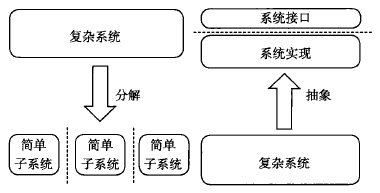
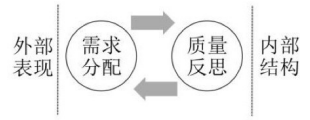

[TOC]

# 第八章 软件设计基础

1. 软件设计是指关于软件对象的设计，是一种设计活动。软件设计既指软件对象实现的规格说明，又指这个规格说明产生的过程。
2. 软件设计活动以需求开发的制品（需求规格说明和分析模型）为基础，构建软件设计方案描述和原型，为后期的构造活动提供规划或蓝图。
3. 软件设计兼具工程性和艺术性，由于软件系统的可变性，软件设计具有演化性，也因为软件设计的过程实际上就是一系列决策发生的过程，软件设计具有决策性。

## 8.1 软件设计思想的发展

## 8.2 软件设计的核心思想

1. 软件设计方法的核心问题：控制系统复杂度

2. 分解与抽象是软件设计的核心思想，两者都是由层次性的，彼此之间可以嵌套使用。
   - 分解：横向上将系统分割为几个相对简单的子系统与子系统之间的关系
   - 抽象：在纵向上聚焦各子系统的接口（这里的**接口**与**实现**相对），可以分离接口和实现，使得人们更好的关注软件系统本质，降低复杂度。

设计复杂度 = 事物复杂度+载体与事物的适配复杂度

## 8.3 理解软件设计

### 8.3.1 设计与软件设计

### 8.3.2 工程设计与艺术设计

### 8.3.3 理性主义和经验主义

### 8.3.4 软件设计的演化

### 8.3.5 软件设计的决策

### 8.3.6 软件设计的约束满足和多样性

## 8.4 软件设计的分层

1. 一种是分为软件体系结构和软件详细设计
2. 另一种是分为高层设计、中层设计和低层设计
   - 高层设计：基于反映软件高层抽象的构件设计，描述系统的高层结构、关注点和设计决策
   - 中层设计：更加关注组成构件的模块的设计、导入/导出、过程之间调用关系或者类之间的写作
   - 低层设计：深入模块和类的内部，关注具体的数据结构、算法、类型、语句和控制结构等

### 8.4.1 低层设计

1. 基本的语言单位（类型与语句），组织起来，建立高质量的数据结构+算法
2. 常见设计场景：数组的使用，链表的使用，内存的使用，遍历算法，递归算法
3. 经典场景：堆栈，队列，树，排序算法，查找算法 ...
4. 数据结构与算法审美：
   - 简洁、结构清晰，坚固（可靠、⾼效、易读）
   - 数据结构与算法课程

5. 低层设计的本质：屏蔽程序中复杂数据结构与算法的实现细节

6. 代码设计：对一个方法/函数的内部代码进行设计

7. 模块划分：将系统分成简单片段；名字和使用方法称为模块的抽象与接口；模块内部的程序片段为精化与实现

### 8.4.2 中层设计

1. 模块划分隐藏一些程序片段（数据结构+算法）的细节，暴露接口于外界
2. 模块化的目标：完全独立性

3. 模块化的问题与困难
4. 中层设计总结— — 设计目标：模块化；信息隐藏；OO原则

5. 中低层设计的问题：
   - 过于依赖细节：连接与依赖，接口与实现
   - 忽略的关键因素:
     - 无法有效抽象部件的整体特性
     - 总体结构质量属性

### 8.4.3 高层设计

1. 部件承载了系统主要的计算与状态
2. 连接件承载部件之间的交互
3. 部件与连接件都是抽象的类型定义（就像类定义），它们的实例（就像类的对象实例）组织构成软件系统的整体结构，配置将它们的实例连接起来
4. 连接件是一个与部件平等的单位

5. 敏捷视点

## 8.6 软件设计的方法和模型

### 8.6.1 软件设计的方法

1、结构化设计：采取自下向上和逐步求精的思想，按照功能对系统进行分解

2、面向对象设计：源自于数据抽象和职责驱动，利用封装、继承、多态等方法，提高软件的可扩展性和可复用性

3、以数据为中心设计：开始于系统操纵的数据结构而不是它所表现的功能

4、基于构件的设计：重点在于构件的提供、开发和继承，以提高系统的可复用性

5、形式化方法设计：通过数学方法来对复杂系统进行建模

### 8.6.2 软件设计的模型

- 静态模型：通过**快照**的方式对**系统中时间不变的属性**进行描述。通常描述的是状态，而不是行为
- 动态模型：描述**系统行为和状态转移**

1. 在结构化设计中
   - 静态模型：实体关系图
   - 动态模型：数据流图和结构图（Structure Chart）
2. 在面向对象设计中
   - 静态模型：类图、对象图、构件图、部署图
   - 动态模型：交互图（顺序图和通信图）、状态图、活动图

## 8.7 软件设计描述

### 8.7.1 设计视图和设计图

### 8.7.2 设计视角和设计关注

### 8.7.3 需求和涉众

### 8.7.4 设计理由

### 8.7.5 设计描述的模板

### 8.7.6 软件设计文档书写要点

## 8.8 项目实践
