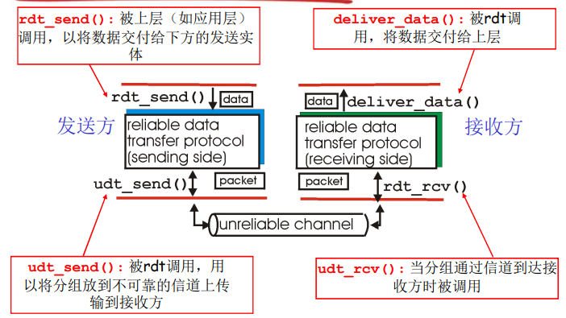
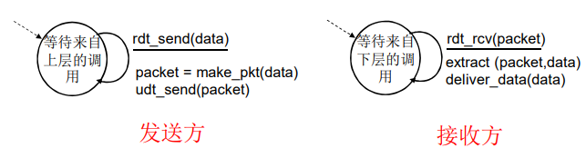
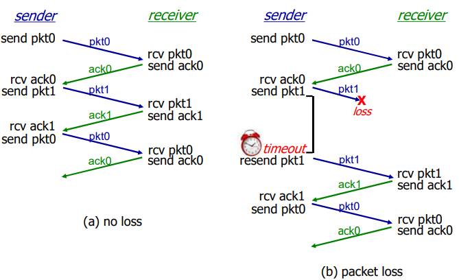
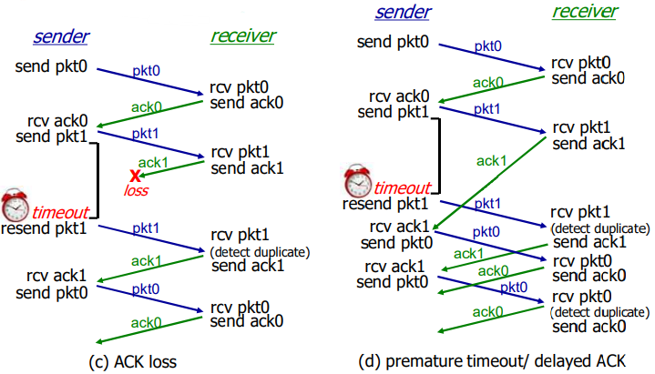
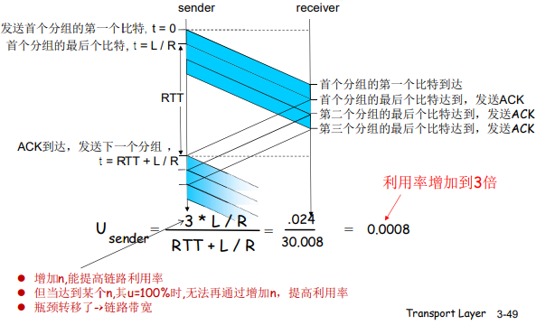
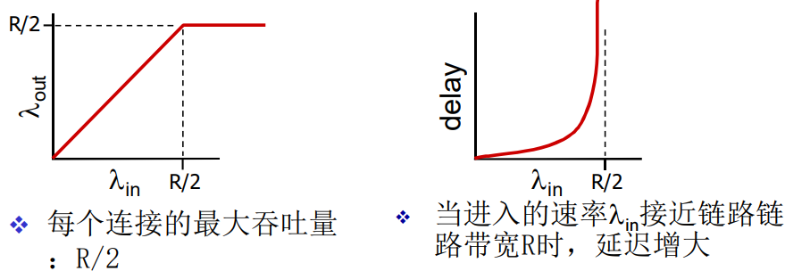
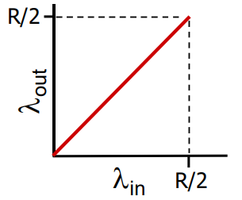
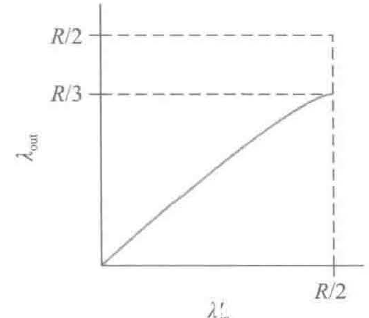
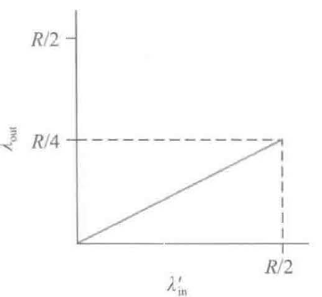
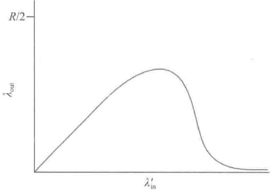

[TOC]

# 第三章 运输层

## 3.1 概述和运输层服务

1. 运输层协议：为运行在不同主机上的应用进程提供**逻辑通信**
2. 运输层协议运行在端系统
   - 发送端：运输层将应用层报文分成运输层报文段，传递给网络层
   - 接收端：网络层将报文段上交给运输层处理，数据给接收应用进程使用
3. TCP 和 UDP

### 3.1.1 运输层和网络层的关系

- 网络层：主机间
- 运输层：进程间
  - 依赖于网络层
  - 对网络层的服务进行增强

### 3.1.2 因特网运输层概述

1. 可靠的、保序的传输：TCP
   - 多路复用、多路分解
   - 拥塞控制
   - 流量控制
   - 建立连接
2. 不可靠、不保序的传输：UDP
   - 多路复用、多路分解
   - 没有为尽力而为的 IP 服务添加更多的其他额外服务

## 3.2 多路复用与多路分解

1. **多路分解**：将运输层报文段中的数据交付到正确的套接字的工作
2. **多路分解**：在源主机从不同套接字中收集数据块，并为每个数据块封装上首部信息从而生成报文段，然后将报文段传递到网络层，以上所有工作

3. 多路分解的工作原理：
   - 主机上的每个套接字能分配一个端口号，当报文段到达主机，运输层检查报文段中的端口号，并将其定向到相应的套接字
   - 主机收到 IP 数据报
     - 每个数据报有源 IP 地址和目标地址
     - 每个数据段承载一个运输层报文段
     - 每个报文段有一个**源端口号字段**和**目的端口号字段**

### 3.2.1 无连接（UDP）的多路复用与多路分解

1. 创建套接字
2. 接收端：UDP 套接字用二元组标识（目标 IP 地址和目的端口号）
3. 当主机接收到 UDP 报文段：
   - 检查报文段的目标端口号
   - 用该端口号将报文段定向到相应的套接字
4. 如果两个不同源 IP 地址 / 源端口号的 UDP 报文段，但有相同的目的 IP 地址和目的端口号，则被定向到相同的目的进程

### 3.2.2 面向连接（TCP）的多路复用与多路分解

1. TCP 套接字由一个四元组标识（源 IP 地址、源端口号、目的 IP 地址、目的端口号）
2. 当一个 TCP 报文段从网络到达一台主机，该主机使用全部 4 个值来将报文段定向（分解）到相应的套接字
3. 两个具有不同源 IP 地址或源端口号的到达 TCP 报文段将被定向到两个不同的套接字，除非 TCP 报文段携带了初始创建连接的请求
4. 服务器主机可以支持多个并行的 TCP 套接字，每个套接字与一个进程联系，并由四元组标识

## 3.3 无连接运输：UDP

有些应用更适合用 UDP 的原因：

- 关于发送什么数据以及何时发送的应用层控制更为精细
- 无须建立连接。UDP 在开始传输数据前不需要握手，即无建立连接的时延
- 无连接状态。TCP 需要在端系统中维护连接状态，包括接收 / 发送缓存、拥塞控制参数和序号与确认号的参数。UDP 不维护且不跟踪
- 分组首部开销小。UDP 8 字节，TCP 20 字节

### 3.3.1 UDP 报文段结构

### 3.3.2 UDP 检验和

1. 作用：检验和用于确定当 UDP 报文段从源到达目的地移动时，其中的比特是否发生了改变

2. 发送方：
   - 对报文段中的所有 16 比特字的和进行反码运算
   - 求和时遇到的任何溢出都被回卷
   - 得到的结果放在 UDP 报文段中的检验和字段
3. 接收方：
   - 计算接收到的报文段的检验和
   - 检查计算出的检验和与检验和字段的内容是否相等
     - 不相等：差错
     - 相等：没有检测到差错，可能有

## 3.4 可靠数据传输（rdt）原理

1. 可靠数据传输在应用层、传输层和数据链路层都很重要
2. 信道的不可靠特点决定了可靠数据传输协议（rdt）的复杂性
3. 渐增式地开发可靠数据传输协议（rdt）的发送方和接收方

4. 只考虑单向数据传输

### 3.4.1 构造可靠数据传输协议

**1、经完全可靠信道的可靠数据传输：rdt1.0**

1. 底层信道完全可靠的情况

2. 发送方和接收方的**有限状态机**（FSM）如下

   

   - rdt的发送端只通过 rdt_send(data) 事件接受来自较高层的数据，产生一个包含该数据的分组（make_pkt(data)），并将分组发送到信道中
   - 接收端 rdt 通过 rdt_rcv(packet) 事件从底层信道接收一个分组，从分组中取出数据（extract(packet, data)），并将数据上传给较高层（deliver_data(data)）

**2、经具有比特差错信道的可靠数据传输：rdt2.0**

1. **自动重传请求（ARQ）协议**：肯定确认和否定确认

   - 差错检测：使接收方检测到何时出现了比特差错
   - 接收方反馈：（肯定确认（ACK）和否定确认（NAK））
   - 重传

2. 发送方和接收方的有限状态机（FSM）如下：

   

3. 处理受损 ACK 和 NAK

   - 增加足够的检验和比特

   - 重传：冗余分组
     - 在数据分组中添加一新字段，让发送方对其数据分组编号，即**序号**，接收方检测序号
     - 停等协议：发送方发送一个分组，然后等待接收方的应答

4. rdt 2.1

   - 发送方
     - 在分组中加入序列号，两个序列号（0，1）就足够了
     - 必须检测 ACK / NAK 是否出错
     - 状态数变成了两倍

   

   

   - 接收方

     - 必须检测接收到的分组是否是重复的
     - 接收方并不知道发送方是否正确收到了其 ACK / NAK

     

5. rdt2.2：无 NAK 的协议

   - 接收方对最后正确接收的分组发 ACK，以替代 NAK

   - 当收到重复的 ACK（如：再次收到 ack0）时，发送方与收到 NAK 采取相同的动作：重传当前分组

     

**3、经具有比特差错的丢包信道的可靠数据传输：rdt3.0（比特交替协议）**

1. 发送方等待ACK一段合理的时间
   - 发送端超时重传：如果到时没有收到 ACK -> 重传
   - 需要一个倒计数定时器

2. 发送方 FSM

   

3. 运行

   

   

   - 过早超时（延迟的ACK）也能够正常工作；但是效率较低，一半的分组和确认是重复的
   - 设置一个合理的超时时间也是比较重要的

### 3.4.2 流水线可靠数据传输协议

流水线技术：

- 必须增加序号的范围
- 在发送方/接收方要有缓存分组
- 解决流水线的差错恢复有两种基本方法：**回退 N 步（GBN）**和**选择重传（SR）**

滑动窗口协议：

- 发送方依序按流水线方式发送分组，接收方接收分组，按序向上提交。

- 发送方对于已发送未收到确认的分组，必须缓存，必要时重发。

- 发送方可以连续发送多个未收到确认的分组（取决于缓存能力）。

- 接收方对未按序到达的分组，必须缓存或者丢弃并确认（取决于缓存能力）。

- 发送窗口（Ws）：发送方可以发送未被确认分组的最大数量；

  接收窗口（Wr）：接收方可以缓存的正确到达的分组的最大数量；

### 3.4.3 回退 N 步（滑动窗口协议）

1. 允许发送方发送多个分组而不需等待确认，不能超过 N

2. 发送窗口WS≥1 ，接收窗口Wr=1。发送端缓存能力高，可以在没有得到确认前发送多个分组。接收端缓存能力很低，只能接收1个按序到达的分组，不能缓存未按序到达的分组。

3. **基序号（base）**：最早未确认分组的序号，**下一个序号（nsxtseqnum）**：最小的未使用序号

4. **窗口长度** N：[base, nextseqnum - 1] 段内已经发送但未被确认的分组
5. GBN发送方响应的3类事件：
   - 上层的调用：窗口未满，用下一个序号编号并发送分组，否则拒绝发送新的数据
   - 收到 1 个 ACK：GBN 采用**累积确认**方式，即发送方收到 ACK n 时，表明接收方正确接收序号 n 以及序号小于 n 的所有分组
   - 超时事件：发送方只使用一个计时器，对“基序号”指向的分组计时。如超时，重发当前发送窗口中所有已发送但未确认的分组，即“回退N步”，因为接收方Wr=1，无缓存能力

6. GBN的接收方操作：

   Wr=1，只能接收“基序号”所指向的分组。如接收方正确接收到序号为基序号，则发送一个 ACK n，接收窗口滑动到序号 n+1 的位置。接收到的序号不是 n 或者分组差错等，则发送ACK n-1

在差错较低的情况下，信道利用率会得到很大提高。如果信道误码率或者丢包率较高，导致大量重发，信道传输能力降低。

GBN适合低误码率、低丢包率、带宽高时延积信道，且对接收方缓存能力要求低。

### 3.4.4 选择重传

选择重传（SR）通过让发送方仅重传那些未被接收确认（出错或者丢失）的分组，避免了不必要的重传。

发送窗口 WS＞1，接收窗口 Wr＞1。很多 SR 协议 WS 、Wr 大小相等。发送端缓存能力高。接收端缓存能力高。

1. SR发送方响应事件：
   - 上层调用，请求发送数据：检查“下一个序号”，位于发送窗口内则发送，否则缓存或者返回给上层。
   - 计时器超时。发送方对每个分组进行计时，超时则重发该分组。
   - 收到 ACK。SR 协议对 n 进行判断。如 n 在当前窗口内，则标记已接收（刚好是基序号，窗口向右滑动到最小未被确认序号处）；其他情形不做响应。

2. SR接收方主要操作：
   - 正确接收到序号在接收窗口范围内的分组 PTK n，发送 ACK n，窗口滑动。
   - 正确接收到序号在接收窗口左侧的分组 PTK n，这些分组在之前已经正确接收并提交，丢弃 PTK n，并发送 ACK n，窗口不滑动。
   - 其他情况，直接丢弃分组，不做任何响应。

## 3.5 面向连接的运输：TCP

### 3.5.1 TCP 连接

1. TCP 面向连接连接：进程发送数据前必须握手
2. **全双工服务**：在同一连接中数据流双向流动
3. **点对点**：单个发送方和接收方

4. 三次握手：客户首先发送一个特殊的TCP 报文段，服务器用另一个特殊的TCP 报文段来响应， 最后，客户再用第三个特殊报文段作为响应。前两个报文段不承载“有效载荷＂，也就是不包含应用层数据； 而第三个报文段可以承载有效载荷。
5. TCP 引导数据到连接的**发送缓存**里，发送缓存是发起三次握手期间设置的缓存之一
6. 最大报文段长度（MSS）：MSS 通常根据最初确定的由本地发送主机发送的最大链路层帧长度来设置
7. TCP 为每块客户数据配上一个 TCP 首部，从而形成多个 TCP 报文段

### 3.5.2 TCP 报文段结构

- 首部包括**源端口号**和**目的端口号**，被用于多路复用／分解来自或送到上层应用的数据
- **检验和字段**
- 32 比特的**序号字段** + 32 比特的**确认号字段**：实现可靠数据传输服务
- 16 比特的**接收窗口字段**：流量控制。
- 4 比特的**首部长度字段**：指示了以 32 比特的字为单位的 TCP 首部长度
- 可选与变长的**选项字段**：协商 MSS 或在高速网络环境下用作窗口调节因子

- 6 比特的**标志字段**：

  - ACK 比特：指示确认字段中的值是有效的
  - RST 、SYN 和 FIN 比特：连接建立和拆除

  - 在明确拥塞通告中使用了 CWR 和 ECE 比特
  - 当 PSH 比特被置位时，就指示接收方应立即将数据交给上层
  - URG 比特：指示报文段里存在被发送端的上层实体置为“紧急”的数据。紧急数据的最后一个字节由 16 比特的**紧急数据指针字段**指出

- 序号和确认号

  - 序号：报文段首字节的在字节流的编号

  - 确认号：期望从另一方收到的下一个字节的序号。**累积确认**

### 3.5.3 往返时间的估计与超时

1. 估计往返时间

   - TCP 如何估计发送方与接收方之间的往返时间？
     - 报文段的样本 RTT（表示为 SampleRTT）就是从某报文段被发出（即交给 IP）到对该报文段的确认被收到之间的时间量
     - 如果有重传，忽略此次测量
     - SampleRTT 会变化，因此估计的 RTT 应该比较平滑。对几个最近的测量值求平均

   - TCP 维持一个 SampleRTT 均值（EstimatedRTT）：$\text{EstimatedRTT} = (1-\alpha) \cdot \text{EstimatedRTT} + \alpha \cdot \text{SampleRTT}$
     - EstimatedRTT 的新值是由以前的 EstimatedRTT 值于 SampleRTT 新值加权组合而成，$\alpha$ 推荐 = 0.125
     - **指数加权移动平均（EWMA）**
   - RTT 偏差 DevRTT，用于估算 SampleRTT 一般会偏离 EstimatedRTT的程度：$\text{DevRTT} = (1-\beta) \cdot \text{DevRTT} + \beta \cdot |\text{SampleRTT} - \text{EstimatedRTT}|$
     - DevRTT 是一个 SampleRTT 与 EstimatedRTT 之间差值的 EWMA
     - $\beta$ 推荐 = 0.25

2. 设置和管理重传超时间隔

   - $\text{TimeoutInterval} = \text{EstimatedRTT} + 4 \cdot \text{DevRTT}$

   - 推荐的初始 TimeoutInterval 值为 1 秒

### 3.5.4 可靠数据传输

TCP 在 IP 不可靠的尽力而为服务之上创建了一种**可靠数据传输服务**

### 3.5.5 流量控制

1. 消除发送方使接收方缓存溢出的可能性

2. TCP 通过让发送方维护一个称为**接收窗口**的变量来提供流量控制

   - 接收窗口用于给发送方一个指示——该接收方还有多少可用的缓存空间
   - 因为 TCP 是全双工通信，在连接两端的发送方都各自维护一个接收窗口

3. 主机 A 向主机 B 发送大文件，主机 B 为该连接分配了一个接收缓存，并用**RevBuffer** 来表示其大小

   - **LastByteRead**：主机 B 上的应用进程从缓存读出的数据流的最后一个字节的编号
   - **LastByteRcvd**：从网络中到达的并且已放入主机 B 接收缓存中的数据流的最后一个字节的编号
   - $\text{LastByteRcvd}-\text{LastByteRead} \leq \text{RevBuffer}$
   - 接收窗口用 rwnd 表示，根据缓存可用空间的数扯来设置：$\text{rwnd} = \text{RevBuffer} - [\text{LastByteRcvd}-\text{LastByteRead}]$

   - 主机B 通过把当前的 rwnd 值放入它发给主机 A 的报文段接收窗口字段中，通知主机 A 它在该连接的缓存中还有多少可用空间

   - 主机 A 轮流跟踪两个变量， LastByteSent 和 LastByteAcked。LastByteSent - LastByteAcked = 主机 A 发送到连接中但未被确认的数据量。$\text{LastByteSent}-\text{LastByteAcked} \leq \text{rwnd}$

### 3.5.6 TCP 连接管理（3次握手）

1. 第一步： 客户端的 TCP 首先向服务器端的 TCP 发送一个特殊的 TCP 报文段。该报文段中不包含应用层数据。但是在报文段的首部中的一个标志位
   （即 SYN 比特）被置为1 。因此，这个特殊报文段被称为 SYN 报文段。另外，客户会随机地选择一个初始序号（clienl_isn），并将此编号放置于该起始的 TCP SYN 报文段的序号字段中。该报文段会被封装在一个 IP 数据报中，并发送给服务器。
2. 第二步： 一旦包含 TCP SYN 报文段的 IP 数据报到达服务器主机，服务器会从该数据报中提取出 TCP SYN 报文段，为该 TCP 连接分配 TCP 缓存和变扯， 并向该客户 TCP 发送允许连接的报文段。这个允许连接的报文段也不包含应用层数据。但是，在报文段的首部却包含 3 个重要的信息。首先，SYN 比特被置为 1 。其次，该 TCP 报文段首部的确认号字段被置为 clienl_isn + 1 。最后，服务器选择自己的初始序号（server_isn），并将其放置到 TCP 报文段首部的序号字段中。该允许连接的报文段被称为 SYNACK 报文段
3. 第三步：在收到 SYNACK 报文段后，客户也要给该连接分配缓存和变量。客户主机则向服务器发送另外一个报文段，这最后一个报文段对服务器允许连接的报文段进行了确认（该客户通过将值 server_isn + 1 放置到 TCP 报文段首部的确认字段中来完成此项工作）。因为连接已经建立了，所以该 SYN 比特被置为0 。该三次握手的第三个阶段可以在报文段负载中携带客户到服务器的数据。

## 3.6 拥塞控制原理

拥塞的表现：分组丢失（路由器缓冲区溢出）、分组经历长延迟（在路由器的队列中排队）

### 3.6.1 拥塞的原因与代价

1. 情况1：2个发送端，2个接收端和 1 台具有无穷大缓存的路由器
   - 输出链路带宽：R，发送端提供流量的速率 $\lambda_{in}$ 字节 / 秒
   - 没有重传
   - 

2. 情况2：两个发送方和一台具有有限缓存的路由器

   - 应用层输入 = 应用层输出：$\lambda_{in} = \lambda_{out}$​

   - 运输层向网络中发送报文段 $\lambda_{in}'$ 包括重传：$\lambda_{in}' \geq \lambda_{in}$（$\lambda_{in}'$ 供给载荷）

   - 理想情况：发送端知道什么时候路由器的缓冲是可用的，不会产生丢包，且 $\lambda_{in}' = \lambda_{in}$

     

   - 情况2：发送方仅当在确定了一个分组已经丢失时才重传

     

   - 现实情况：发送方也许会提前发生超时并重传在队列中已被推迟但还未丢失的分组

     - 代价2：发送方在遇到大时延时所进行的不必要重传会引起路由器利用其链路带宽来转发不必要的分组副本

     

3. 情况3：4 个发送方和具有有限缓存的多台路由器及多跳路径

   - 对于较小的 $\lambda_{in}$， $\lambda_{in}$ 的增大会导致 $\lambda_{out}$ 的增大

   - 当 $\lambda_{in}$ 较大时，在重载的极限情况下， A-C 端到端吞吐量将趋近于0

     

   - 代价3：当一个分组沿一条路径被丢弃时，每个上游路由器用于转发该分组到丢弃该分组而使用的传输容量最终被浪费掉了

### 3.6.2 拥塞控制方法

1. 端到端拥塞控制：

   - 网络层没有为运输层拥塞控制提供显式支持
   - 端系统根据延迟和丢失事件推断是否有拥塞
   - TCP采用的方法：减小其窗口长度

2. 网络辅助的拥塞控制：

   - 路由器向发送方提供关于网络中拥塞状态的显式反馈信息

   - 简单地用一个比特来指示链路中的拥塞情况

   - 显式地通知发送方它（路由器）能在输出链路上支持的最大主机发送速率

   **阻塞分组**

## 3.7 TCP 拥塞控制

### 3.7.1 经典的 TCP 拥塞控制

让每一个发送方根据所感知到的网络拥塞程度来限制其能向连接发送流量的速率

1. TCP 发送方是如何限制向其连接发送流量？

   - 运行在发送方的 TCP 拥塞控制机制跟踪一个额外的变量，即**拥塞窗口 cwnd**，它对一个 TCP 发送方能向网络中发送流量的速率进行了限制，$\text{LastByteSent}-\text{LastByteAcked} \leq min\{\text{cwnd}, \text{rwnd}\}$

   - 发送速率 = cwnd / RTT 字节／秒。通过调节 cwnd 的值，发送方因此能调整它向连接发送数据的速率。

2. TCP 发送方如何感知在它与目的地之间的路径上出现了拥塞？

   - 超时 / 收到来自接收方的3个冗余ACK

3. TCP 发送方怎样确定它应当发送的速率？
   - 一个丢失的报文段表意味着拥塞，因此当丢失报文段时应当降低 TCP 发送方的速率
   - 一个确认报文段指示该网络正在向接收方交付发送方的报文段，因此，当对先前未确认报文段的确认到达时，能够增加发送方的速率
   - 带宽探测

**1、慢启动**

1. 在慢启动状态， cwnd 的值以1 个 MSS 开始并且每当传输的报文段首次被确认就增加 1 个 MSS
   - 原因：cwnd 的值通常初始置为一个 MSS 的较小值，使得初始发送速率大约为 MSS / RTT 
   - 可用带宽可能比 MSS / RTT 大得多，TCP 发送方希望迅速找到可用带宽的数量

2. 结束慢启动
   - 如果存在一个由超时指示的丢包事件（即拥塞），TCP 发送方将 cwnd 设置为 1 并重新开始慢启动过程。并将第二个状态变量的值 ssthresh（慢启动阈值）设置为 cwnd / 2
   - 当 cwnd 的值等于 ssthresh 时，结束慢启动并且 TCP 转移到拥塞避免模式
   - 如果检测到 3 个冗余 ACK, 这时 TCP 执行一种快速重传并进入快速恢复状态

**2、拥塞避免**

1. 一且进入拥塞避免状态， cwnd 的值大约是上次遇到拥塞时的值的一半。因此，TCP 无法每过一个 RTT 再将 cwnd 的值翻番，每个 RTT 只将 cwnd 的值增加一个 MSS
   - 对于TCP 发送方无论何时到达一个新的确认，就将 cwnd 增加一个
     MSS（MSS / cwnd）字节
   - 何时应当结束拥塞避免的线性增长：
     - 收到 3 个冗余 ACK 时，TCP 将cwnd 的值减半，将ssthresh 的值记录为 cwnd 的值的一半
     - 超时，cwnd 的值被设置为 1 个 MSS

**3、快速恢复**

在快速恢复中，对于引起 TCP 进入快速恢复状态的缺失报文段，每当收到冗余的 ACK 、cwnd 的值增加一个 MSS。最终，当对丢失报文段的一个 ACK 到达时， TCP 在降低 cwnd 后进入拥塞避免状态。

- 超时：快速恢复在执行如同在慢启动和拥塞避免中相同的操作后，迁移到慢启动状态
- 丢包：cwnd 的值被设置为 1 个 MSS，且 ssthresh 的值设置为 cwnd 值的一半

**加性增、乘性减**（AIMD）

总结：

