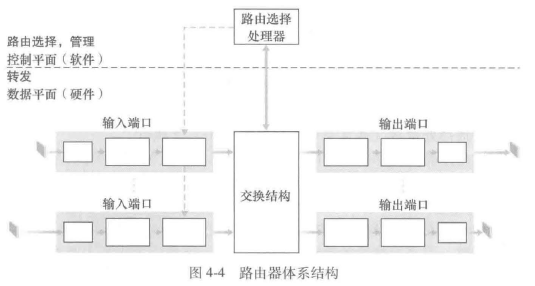
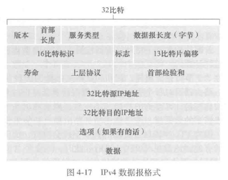
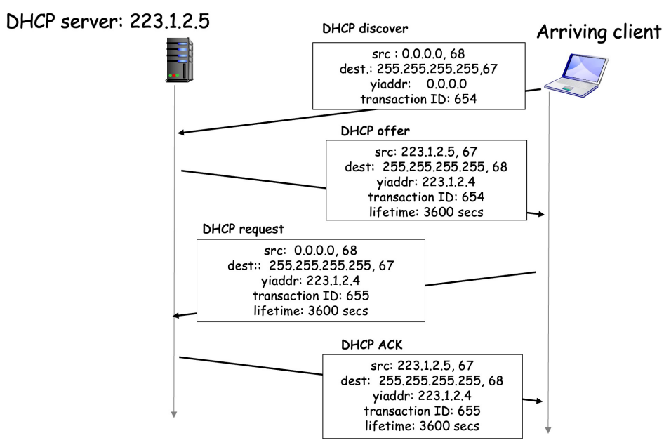

# 第四章 网络层：数据平面

## 4.1 网络层概述

一个简单网络，每台路由器的数据平面：从其输入链路向其输出链路转发数据报；控制平面：协调这些本地的每路由器转发操作，使得数据报沿着源和目的地主机之间的路由器路径最终进行端到端传送

### 4.1.1 转发和路由选择：数据平面和控制平面

1. 两种重要的网络层功能：
   - 转发：将分组从一个输入链路接口转移到适当的输出链路接口的路由器本地操作。硬件实现、网络平面。
     - 每台网络路由器中有一个关键元素是它的转发表（forwarding table）。路由器检查到达分组首部的一个或多个字段值，进而使用这些首部值在其转发表中索引，通过这种方法来转发分组。这些值对应存储在转发表项中的值，指出了该分组将被转发的路由器的输出链路接口
   - 路由选择：**路由选择算法**：确定分组从源到目的地所采取的端到端路径的网络范围处理过程。软件实现、控制平面
2. 控制平面：
   - 传统方法：路由选择算法运行在每台路由器中，并且在每台路由器中都包含转发和路由选择两种功能
   - SDN 方法：每台路由器都有一个与其他路由器的路由选择组件通信的路由选择组件。路由选择设备仅执行转发，而远程控制器计算并分发转发表

### 4.1.2 网络服务模型

尽力而为服务

## 4.2 路由器工作原理

1. 路由器的4个组件

   - **输入端口**：
     - 执行终结入物理链路的物理层功能
     - 与位于入链路远端的数据链路层交互操作来执行数据链路层功能
     - 执行查找功能，通过查询转发表决定路巾器的输出端口，到达的分组通过路由器的交换结构转发到输出端口
   - **交换结构**：将路由器的输入端口连接到它的输出端口
   - **输出端口**：存储从交换结构接收的分组，并通过执行必要的链路层和物理层功能在输出链路上传输这些分组
   - **路由选择处理器**：执行控制平面功能
     - 传统的路由器：执行路由选择协议，维护路由选择表与关联链路状态信息，并为该路由器计算转发表
     - SDN 路由器：负责与远程控制器通信，目的是接收由远程控制器计算的转发表项，并在该
       路由器的输入端口安装这些表项
     - 执行网络管理功能

   ### 4.2.1 输入端口处理和基于目的地转发

**最长前缀匹配规则**：当给定目标地址查找转发表时，采用最长地址前缀匹配的目标地址表项

在路由器中经常采用 TCAM 硬件来完成

### 4.2.2 交换

1. **经内存交换**
   - 在 CPU 的直接控制下完成
   - 分组从输入端口处被复制到处理器内存中
   - 路由选择处理器从其首部提取目的地址，在转发表中查找适当的输出端口，并将该分组复制到输出端口的缓存中
   - 如果内存带宽为每秒可写进内存或从内存读出最多 B 个分组，则总的转发吞吐量（分组
     从输入端口被传送到输出端口的总速率）必然小于 B/2
   - 一次只能转发一个分组

2. **经总线交换**
   - 输入端口经一根共享总线将分组直接传送到输出端口，不需要路由选择处理器的干预
   - 让输入端口为分组预先计划一个交换机内部标签（首部），指示本地输出端口，使分组在总线上传送和传输到输出端口
   - 该分组能由所有输出端口收到，但只有与该标签匹配的端口才能保存该分组
   - 然后标签在输出端口被去除，因为其仅用于交换机内部来跨越总线
   - 如果多个分组同时到达路由器，每个位于不同的输出端口，除了一个分组外所有其他分组必须等待，因为一次只有一个分组能够跨越总线
   - **总线竞争**：因为每个分组必须跨过单一总线，故路由器的交换带宽受总线速率的限制
   - 一次处理一个分组

3. **经互联网络交换**

   - 纵横式交换机是由 2N 条总线组成的互联网络，它连接 N 个输入端口与 N 个输出端口
     - 交叉点通过交换结构控制器能够在任何时候开启和闭合
     - 当某分组到达端口 A，需要转发到端口 Y 时，交换机控制器闭合总线 A 和 Y 交叉部位的交叉点，然后端口 A 在其总线上发送该分组，该分组仅由总线 Y 接收

   - 纵横式网络能够并行转发多个分组
   - 纵横式交换机是非阻塞的，即只要没有其他分组当前被转发到该输出端口，转发到输出端口的分组就不会被到达输出端口的分组阻塞
   - 如果来自两个不同输入端口的两个分组的目的地为相同的输出端口，则一个分组必须在输入端等待，因为在某个时刻经给定总线仅能够发送一个分组
   - 高级设计：多级交换元素，以使来自不同输入端口的分组通过交换结构同时朝着相同的输出端口前行

### 4.2.3 输出端口处理

选择和取出排队的分组进行传输，执行所需的链路层和物理层传输功能

### 4.2.4 何处出现排队

假设交换速率 $R_{switch}$ 是 $R_{line}$ 的 N 倍（N：输入端口的数量）

当多个输入端口同时向输出端口发送时，缓冲该分组

排队带来延迟，由于输出端口缓存溢出则丢弃

1. 输入排队：**队列首部阻塞（HOL）**

2. 输出排队：**主动队列管理（AQM）**：**随机早期检测（RED）**算法；**分组调度器**

3. 多少缓存才够用：

   

### 4.2.5 分组调度

1. **先进先出（FIFO）**：按照分组到达输出链路队列的相同次序来选择分组在链路上传输

2. **优先权排队**：到达输出链路的分组被分类放入输出队列中的优先权类

   - 每个优先权类通常都有自己的队列
   - 当选择一个分组传输时，优先权排队规则将从队列为非空的最高优先权类中选择传输一个分组
   - 在同一优先权类的分组之间的选择通常以 FlFO 方式完成

3. **循环和加权公平排队**

   1. 循环排队规则：
      - 分类，但不存在严格的服务优先权
      - 循环调度器在这些类之间轮流提供服务
      - **保持工作排队**规则：在有（任何类的）分组排队等待传输时，不允许链路保持空闲。当寻找给定类的分组但是没有找到时，保持工作的循环规则将立即检查循环序列中的下一个类

   2. **加权公平排队（WFQ）**：
      - 类似循环调度，使用保持工作排队规则
      - 每个类 $i$ 被分配一个权 $w_i$，在类 $i$ 有分组要发送的任何时间间隔中，类 $i$ 将确保接收到的服务部分等于 $w_i / (\sum w_j)$​，式中分母中的和是通过计算所有有分组排队等待传输的类别得到的
      - 对于一条传输速率为 R 的链路，类 $i$ 能获得至少为 $R \cdot w_i / (\sum w_j)$ 的吞吐量

   

## 4.3 网际协议：IPv4 、寻址、IPv6 及其他

### 4.3.1 IPv4 数据报格式

- 版本号
- 首部长度
- 服务类型
- 数据报长度
- 标识、标志、片偏移
- 寿命
- 协议
- 首部检验和
- 源和目的 IP 地址
- 选项
- 数据（有效载荷）

### 4.3.4 IPv4 编址

1. IP 地址：32 比特，按**点分十进制记法**，如 193.32.216.9

2. 接口：主机 / 路由器和物理链路的连接处

3. 一个 IP 地址和一个接口相关联

4. **子网**：
   - 一个子网内的节点（主机或者路由器）它们的 IP 地址的高位部分相同，这些节点构成的网络的一部分叫做**子网**
   - IP 编址：子网部分（高位） + 主机部分，如 223.1.1.0/24，/24 称为**子网掩码**
   - 无需路由器介入，子网内各主机可以在物理上相互直接到达
   - 为了确定子网，分开主机和路由器的每个接口，产生几个隔离的网络岛，使用接口端接这些隔离的网络的端点。这些隔离的网络中的每一个都叫作一个子网

5. **无类别域间路由选择（CIDR）**：当使用子网寻址时， 32 比特的 IP 地址被划分为两部分，并且也具有点分十进制数形式 a. b. c. d/x，其中 x 指示了地址的第一部分中的比特数

   - 形式为 a. b. c. d/x 的地址的 x 最高比特构成了 IP 地址的网络部分，并且经常被称为该地址的**前缀** / **网络前缀**

   - 一个地址的剩余 32-x 比特可认为是用于区分该组织内部设备的，其中的所有设备具有相同的网络前缀

**如何获得一个 IP 地址**

1. 获取一块地址

2. 获取主机地址：**动态主机配置协议（DHCP）**

   - 允许主机自动获取一个 IP 地址

   - 可以使主机每次与网络连接时能得到一个相同的 IP 地址，或者某主机将被分配一个**临时的 IP 地址**。每次与网络连接时该地址也许是不同的

   - 允许一台主机得知其他信息，例如它的子网掩码、它的第一跳路由器地址（常称为默认网关）
     与它的本地 DNS 服务器的地址

   - 客户-服务器协议

     

   - 4个过程：

     - **DHCP 服务器发现**。主机使用 **DHCP 发现报文**发现一个要与其交互的 DHCP 服务器。

       DHCP 客户生成包含 DHCP 发现报文的 IP 数据报，其中使用广播目的地址255.255.255.255 并且使用“本主机”源 IP 地址 0.0.0.0。DHCP 客户将该 IP 数据报传递给链路层、链路层然后将该帧广播到所有与该子网连接的节点

     - **DHCP 服务器提供**。DHCP 服务器收到一个 DHCP 发现报文时，用 **DHCP 提供报文**向客户做出响应，该报文向该子网的所有节点广播，仍然使用 255.255.255.255

       每台服务器提供的报文包含收到的发现报文的事务 ID 、向客户推荐的 IP 地址、网络掩码以及 **IP 地址租用期**

     - **DHCP 请求**。新到达的客户从一个或多个服务器提供中选择一个，并向选中的服务器提供用 **DHCP 请求报文**进行响应，回显配置的参数

     - **DHCP ACK**。服务器用 **DHCP ACK 报文**对 DHCP 请求报文进行响应，证实所要求的参数

### 4.3.3 网络地址转换（NAT）

- 动机：本地网络只有一个有效IP地址
  - 不需要从 ISP 分配一块地址，可用一个IP地址用于所有的（局域网）设备——省钱
  - 可以在局域网改变设备的地址情况下而无须通知外界
  - 可以改变ISP（地址变化）而不需要改变内部的设备地址
  - 局域网内部的设备没有明确的地址，对外是不可见的——安全

- 外出数据包：替换源地址和端口号为 NAT IP 地址和新的端口号，目标 IP 和端口不变
- 使用 **NAT 转换表**：记住每个转换替换对
- 进入数据包：从 NAT 转换表中检索出家庭网络浏览器使用的适当 IP 地址和目的端口号，替换目标 IP 地址和端口号

### 4.3.4 IPv6

1. IPv6 数据报格式

   

2. 从 IPv4 到 IPv6 迁移

   - **建隧道**：

     - 假定两个IPv6 节点要使用 IPv6 数据报进行交互，但它们是经由中间 IPv4 路由器互联的。我们将两台 IPv6 路由器之间的中间 IPv4 路由器的集合称为一个**隧道**

     - 借助于隧道，在隧道发送端的 IPv6 节点可将整个 IPv6 数据报放到一个 IPv4 数据报的数据（有效载荷）字段中。于是，该 IPv4 数据报的地址设为指向隧道接收端的 IPv6 节点再发送给隧道中的第一个节点

     - 隧道中的中间 IPv4 路由器在它们之间为该数据报提供路由，就像对待其他数据报一样，完全不知道该 IPv4 数据报本身就含有一个完整的 IPv6 数据报

     - 隧道接收端的 IPv6 节点最终收到该IPv4 数据报（它是该IPv4 数据报的目的地），并确定该 IPv4 数据报含有一个 IPv6 数据报（通过观察在IPv4 数据报中的协议号字段是41，指示该 IPv4 有效载荷是IPv6 数据报），从中取出 IPv6 数据报，然后再为该 IPv6 数据报提供路由，就好像它是从一个直接相连的 IPv6 邻居那里接收到该 IPv6 数据报一样

       
