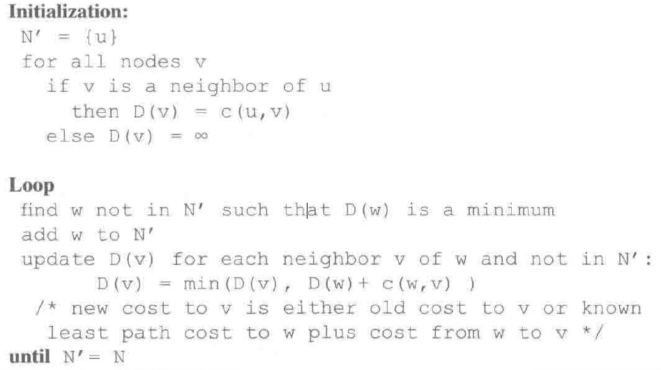
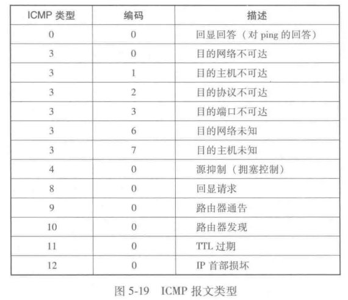
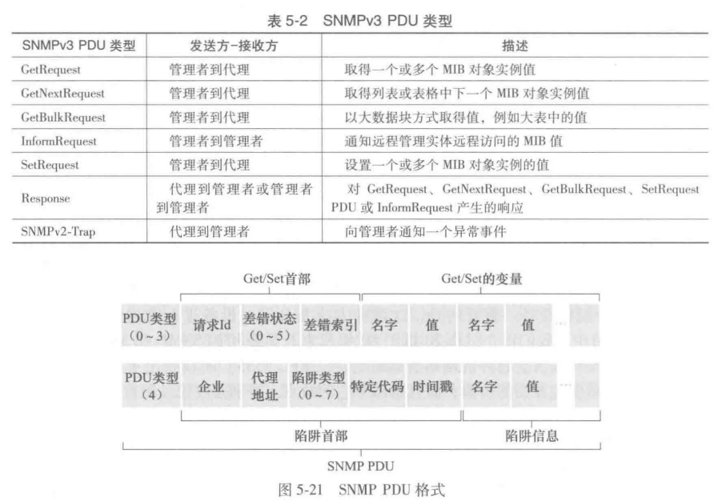

# 第五章 网络层：控制平面

1. 数据平面：转发
2. 控制平面：路由。
   - 控制沿着从源主机到目的主机的端到端路径间的路由器如何转发数据报
   - 控制网络层组件和服务如何配置和管理

## 5.1 概述

2 种构建网络控制平面功能的方法

- **每路由器控制**（传统）：每台路由器有一个路由选择组件，计算转发表的值
- **逻辑集中式控制（SDN）**：一个不同的（远程的）控制器与每台路由器中的一个控制代理（CA）交互，配置和管理转发表
  - CA 功能少，按控制器命令行事

## 5.2 路由选择算法

1. 路由选择算法：从发送方到接收方的过程中确定一条通过路由器网络的好的路径（等价于路由）。好的路径通常指最低开销路径
2. 网络图：G = (N, E)
   - 节点：路由
   - 边：路由器之间的物理链路
   - 边的值：开销：物理长度 / 链路速度 / 钱
   - 无向图，**邻居**，开销 c(x, y)
   - 最低开销路径 → 最短路径
3. 路由选择算法的分类
   1. 集中 / 分散
      - **集中式路由选择算法**
        - 以所有节点之间的连通性及所有链路的开销为输入
        - 具有全局状态信息的算法常被称作**链路状态（LS）算法**
      - **分散式路由选择算法**
        - 路由器以迭代、分布式的方式计算出最低开销路径。没有节点拥有关于所有网络链路开销的完整信息
        - 每个节点仅有与其直接相连链路的开销知识，通过迭代计算过程以及与相邻节点的信息交换， 一个节点逐渐计算出到达某目的节点或一组目的节点的最低开销路径。
        - **距离向量（DV）算法**：每个节点维护到网络中所有其他节点的开销（距离）估计的向量
   2. 静态 / 动态
      - **静态路由选择算法**：路由随时间的变化非常缓慢
      - **动态路由选择算法**：随着网络流量负载或拓扑发生变化而改变路由选择路径
   3. 负载敏感 / 负载迟钝
      - **负载敏感算法**：链路开销会动态地变化以反映出底层链路的当前拥塞水平。如果当前拥塞的一条链路与高开销相联系，则路由选择算法趋向于绕开该拥塞链路来选择路由
      - **负载迟钝算法**：某条链路的开销不明确地反映其当前（或最近）的拥塞水平

### 5.2.1 链路状态路由选择算法

1. 让每个节点向网络中所有其他节点广播链路状态分组，其中每个链路状态分组包含它所连接的链路的标识和开销（**链路状态广播算法**）

2. Dijkstra 算法：迭代算法

   - $D(v)$：到算法的本次迭代，从源节点到目的节点 v 的最低开销路径的开销
   - $p(v)$：从源到 v 沿着当前最低开销路径的前一节点（v 的邻居）

   - $N'$：节点子集；如果从源到 v 的最低开销路径已确知，v 在 $N'$ 中

3. 源节点 u 的链路状态（LS）算法

   

4. 复杂度：所有迭代中需要搜寻的节点总数为 $n(n+1)/2$，最差情况下复杂度为 $O(n^2)$
5. 振荡

### 5.2.2 距离向量路由选择算法

1. 迭代的、异步的和分布式的算法
2. Bellman-Ford 方程：$d_x(y) = \min_v \{ c(x,y)+d_v(y) \}$
   - $d_x(y)$​ 是从节点 x 到节点 y 的最低开销路径的开销
   - $\min_v$ 是对于 x 的所有邻居
3. 每个节点 x 以 $D_x(y)$ 开始，对在 N 中的所有节点 y，估计从 x 到 y 的最低开销路径的开销。令 $D_x(y) = [D_x(y):y \in N]$ 是节点 x 的距离向量，该向量是从 x 到 N 中的所有其他节点 y 的开销估计向量。每个节点 x 维护下列路由选择信息：
   - 对于每个邻居 v，从 x 到直接相连邻居 v 的开销为 $c(x,y)$
   - 节点 x 的距离向量，即 $D_x(y) = [D_x(y):y \in N]$，包含了从 x 到 N 中的所有目的地 y 的开销估计值
   - 它的每个邻居的距离向量，即对 x 的每个邻居 v，$D_v = [D_V(y):y \in N]$
   - 当节点 x 从它的任何一个邻居 w 接收到一个新的距离向量，它保存 w 的距离向量，然后使用 Bellman-Ford 方程更新它自己的距离向量
   - 如果节点 x 的距离向量因这个更新步骤而改变，节点 x 接下来将向它的每个邻居发送其更新后的距离向量，这继而让所有邻居更新它们自己的距离向量

4. 链路开销改变与链路故障：**路由选择环路**
   - 坏消息的传播速度非常慢：无穷计数问题

5. 增加毒性逆转：解决上述问题
6. LS 与 DV 路由选择算法的比较

## 5.3 因特网中自治系统内部的路由选择： OSPF

1. **自治系统（AS）**解决的问题：
   - 规模：减少大型网络中的路由计算的复杂性
   - 管理自治：ISP
2. 自治系统内部路由选择协议：在一个自治系统内运行的路由选择算法
3. **开放最短路优先（OSPF）**：用于 AS 内部路由选择
   - 路由选择协议规范是公众可用的（open）
   - 链路状态协议，使用洪泛链路状态信息和 Dijkstra 最低开销路径算法
     - 一台路由器构建了一幅关于整个自治系统的完整拓扑图，在本地运行 Dijkstra 算法，以确定一个以自身为根节点到所有子网的最短路径树
   - 路由器向自治系统内所有其他路由器广播路由选择信息。每当一条链路的状态发生变化时，路由器就会广播链路状态信息。未发生变化，也要周期性地广播链路状态
   - OSPF 通告：包含在 OSPF 报文中，直接由 IP 承载
   - 优点：
     - 安全。能够鉴别 OSPF 路由器之间的交换，防止恶意入侵者将不正确的信息注入路由器表内
     - 多条相同开销的路径。当存在多条相等开销的路径时，OSPF 允许使用多条路径
     - 对单播与多播路由选择的综合支持
     - 支持在单个 AS 中的层次结构。能层次化地配置多个区域，每个区域都运行自己的 OSPF 链路状态路由选择算法

## 5.4 ISP之间的路由选择：BGP

1. 分组跨越多个 AS 进行路由，需要**自治系统间路由选择协议**：**边界网关协议（BGP）**
2. 分布式、异步

### 5.4.1 BGP 的作用

1. 在 BGP 中，分组是路由到 CIDR 化的前缀，其中每个前缀表示一个子网或一个子网的集合
2. 一台路由器的转发表将具有形式为 $(x,I)$ 的表项，其中 x 是一个前缀（例如 13.8.16. 68/22），I 是该路由器的接口之一的接口号
3. BGP 提供给每台路由器完成以下任务的手段：
   - 从邻居 AS 获得前缀的可达性信息
   - 确定到该前缀的“最好的“路由

### 5.4.2 通告 BGP 路由信息

1. **网关路由器**：位于 AS 边缘的路由器，直接连接到在其他 AS 中的一台或多台路由器

   **内部路由器**：仅连接在它自己 AS 中的主机和路由器

2. 如何向所有路由器通过对于前缀 x 的可达性信息

   - 通过路由器，使用 179 端口的半永久 TCP 连接。每条直接连接以及所有通过该连接发送的BGP 报文，称为 **BGP 连接**
   - 跨越两个 AS 的 BGP 连接称为**外部 BGP（eBGP）**连接
     在相同 AS 中的两台路由器之间的 BGP 会话称为**内部 BGP（iBGP）**连接

### 5.4.3 确定最好的路由

- 路由器通过 BGP 连接通告前缀时，前缀中包括 **BGP 属性**，前缀及其属性称为**路由**（route）

- 两个重要的属性：AS-PATH、NEXT-HOP

  - AS-PATH：包含通告已经通过的 AS 的列表。为了生成  AS-PATH 值，当一个前缀通过某 AS 时，该 AS 将其 ASN 加入 AS -PATH 中的现有列表。检测和防止通告环路。如果一台路由器在路径列表中看到包含了它自己的 AS，它将拒绝该通告

  - NEXT-HOP：AS-PATH 起始的路由器接口的 lP 地址 

- 每条 BGP 路由包含3个组件：NEXT-HOP；ASPATH；目的地前缀

1. 热土豆路由选择（BCP 路由选择算法）：（从所有可能的路由中）选择的路由到开始该路由 NEXT-HOP 路由器具有最小开销

​	热土豆路由选择试图减小在它自己 AS 中的开销，而忽略在其 AS 之外的端到端开销的其他部分 

2. 路由器选择算法
   - 路由被指派一个**本地偏好**值作为其属性之一
   - 从余下的路由中（所有都具有相同的最高本地偏好值），选择具有最短 AS-PATH 的路由
   - 从余下的路由中（所有都具有相同的最高本地偏好值和相同的 AS-PATH 长度），使用热土豆路由选择，即选择具有最靠近 NEXT-HOP 路由器的路由
   - 如果仍留下多条路由，该路由器使用 BGP 标识符来选择路由

### 5.4.4 IP 任播

### 5.4.5 路由选择策略

- ABC：主干提供商网络，WXY：接入 ISP
- X：**多宿接入 ISP**、**桩网络**：进入 / 离开 ISP 的所有流量的源 /目的地

- 策略强制让X：
  - X不想路由从B通过X到C的分组
  - 因而X就不通告给B，它实际上可以路由到C

### 5.4.6 拼装在一起：在因特网中呈现

## 5.5 SDN 控制平面

SDN 体系结构具有 4 个关键特征：

- **基于流的转发**：SDN 控制的交换机的分组转发工作，能够基于运输层、网络层或链路层首部中任意数扯的首部字段值进行
- **数据平面与控制平面分离**：数据平面由网络交换机组成，控制平面由服务器以及决定和管理交换机流表的软件组成
- **网络控制功能**：位于数据平面交换机外部。软件在服务器上执行
  - 控制平面自身由两个组件组成：一个 SDN 控制器 + 若干网络控制应用程序
    - 控制器维护准确的网络状态信息；为运行在控制平面中的网络控制应用程序提供这些
      信息；提供方法，这些应用程序通过这些方法能够监视、编程和控制下面的网络设备
- **可编程的网络**：使用由 SDN 控制器提供的 API 来定义和控制网络设备中的数据平面

### 5.5.1 SDN 控制平面： SDN 控制器和 SDN 网络控制应用程序

1. SDN 控制器
   - 通信层：SDN 控制器和受控网络设备之间的通信。OpenFlow 协议
   - 网络范围状态管理层。控制器具有有关网络的主机、链路、交换机和其他 SDN 控制设备的最新状态信息
   - 对于网络控制应用程序层的接口。通过它的“北向“接口与网络控制应用程序交互。该 API 允许网络控制应用程序在状态管理层之间读写网络状态和流表

### 5.5.2 OpenFlow 协议

从控制器流向受控交换机的重要报文如下：

- 配置：允许控制器查询并设置交换机的配置参数
- 修改状态：由控制器所使用，以增加／删除或修改交换机流表中的表项，并且设置交换机端口特性
- 读状态：该报文被控制器用于从交换机的流表和端口收集统计数据和计数器值
- 发送分组：该报文被控制器用于在受控交换机从特定的端口发送出一个特定的报文

从受控交换机流向控制器的重要报文如下：
- 流删除：该报文通知控制器已删除一个流表项
- 端口状态：向控制器通知端口状态的变化
- 分组入：一个分组到达交换机端口 ，并且不能与任何流表项匹配，那么这个分组将被发送给控制器进行额外处理 匹配的分组也可能发送给控制器，作为匹配时所采取的一个操作分组入报文被用于向控制器发送这样的分组

### 5.5.3 数据平面和控制平面交互的例子

### 5.5.4 SDN 的过去与未来

## 5.6 ICMP：因特网控制报文协议

1. 被主机和路由器用来彼此沟通网络层的信息
   - 差错报告
   - Echo 请求和回复（ping）
2. lCMP 处在网络层，但体系结构位于 IP 之上：ICMP 报文由 IP 分组承载
3. ICMP 报文有一个类型字段和一个编码字段，并且包含引起该 lCMP 报文首次生成的 IP 数据报的首部和前 8 字节（以便发送方能确定引发该差错的数据报）

4. ping 程序发送一个 ICMP 类型 8 编码 0 的报文到指定主机。看到回显请求，目的主机发回一个类型 0 编码 0 的 ICMP 回显回答
5. 源抑制报文：执行拥塞控制

## 5.7 网络管理、SNMP 和 NETCONF / YANG

### 5.7.1 网络管理框架

网络管理的关键组件：

- 管理服务器。应用程序，运行在网络运营中心（NOC），需要**网络管理员**
  - 执行网络管理活动
  - 控制网络管理信息与命令的收集、处理、分析和／或显示 
  - 发起配置、监视和控制网络的被管设备的操作
- 被管设备。驻留在被管网络上的某种网络设备（主机、路由器、交换机、中间盒、调制解调器、温度计等）。本身将有许多可管理的组件，以及这些硬件和软件组件的配置参数
- 数据（状态）：与被关设备关联
  - 配置数据：由网络管理员显式配置的设备信息（分配 / 配置的 IP 地址或接口速率）
  - 运行数据：指设备在运行过程中获取的信息（OSPF 协议中的直接邻居列表）
  - 设备统计：设备操作员更新的状态指示器和计数（接口上丢弃分组的数量 或设备的冷却风扇速度）
  - 查询远程设备数据、写入设备数据来控制、维护数据副本
- 网络管理代理：运行在被管设备上的软件进程，与管理服务器通信，在管理服务器的命令和控制下在被管设备上执行本地操作
- 网络管理协议：运行在管理服务器和被管设备之间。允许管理服务器查询被管设备的状态，并经过其代理间接地在这些设备上执行操作。代理能够使用网络管理协议向管理服务器通知异常事件（如组件故障或超过了性能阈值）

运营商商通常采用 3 种方式来管理网络，涉及组件如下：

- 命令行接口（CLI）
- SNMP / MIB。通过简单网络管理协议（SNMP）查询／设置设备的管理信息库（MIB）
- NETCONF / YANG

### 5.7.2 简单网络管理协议和管理信息库

简单网络管理协议（SNMP）：

- 应用层协议，用于在管理服务器和代表管理服务器执行的代理之间传递网络管理控制和信息报文
- 功能：
  - 请求响应模式，请求通常用于查询（检索）或修改（设置）与某被管设备关联的 MIB 对象值
  - 代理向管理服务器发送的一种非请求报文——**陷阱报文**，通知管理服务器一个异常情况导致了 MIB 对象值的改变

- 报文功能：
  - GetRequest、GetNextRequest 和 GetBulkRequest PDU：请求位于该代理所在的被管设备中的一个或多个 MIB 对象值
  - 管理服务器使用 SetRequest PDU 来设置位于被管设备中的一个或多个 MIB 对象的值
  - 管理服务器使用 InformRequest PDU 来通知另一个 MIB 信息管理服务器
  - Response PDU 响应来自该服务器的请求报文，返回所请求的信息
  - 陷阱报文

### 5.7.3 NETCONF 和 YANG