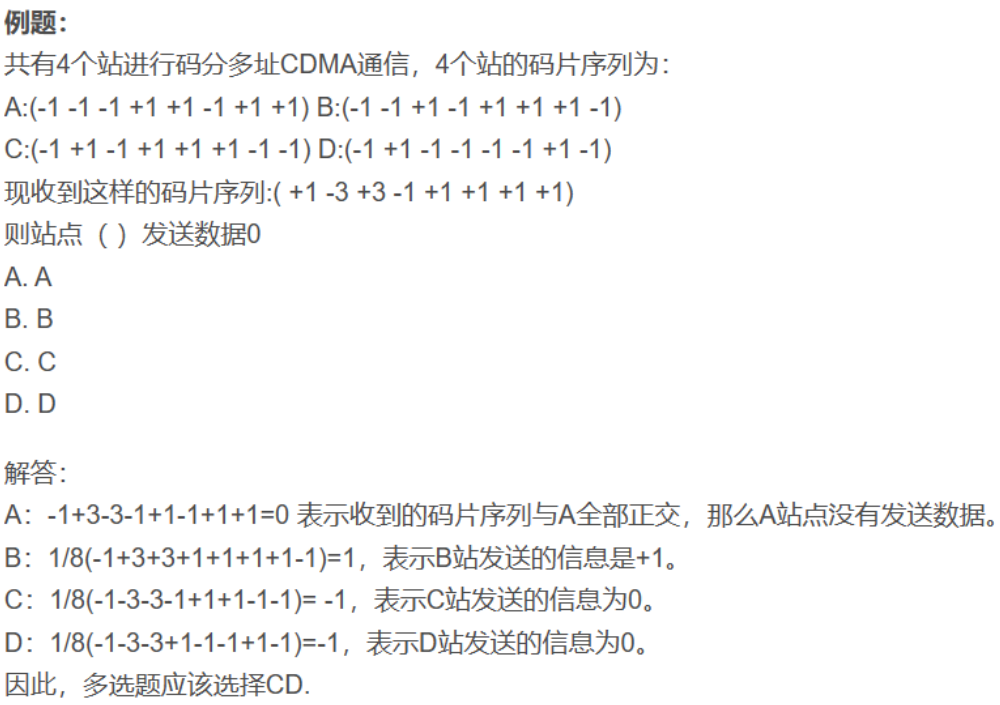

# 第七章 无线网络和移动网络

## 7.1 概述

1. **无线主机**：运行应用程序的端系统设备
2. **无线链路**：主机通过**无线通信链路**连接到一个基站或者到另一台无线主机。不同的无线链路技术具有不同的传输速率，能够传输不同的距离。无线链路标准的两种主要特性：链路速率和覆盖区域
3. **基站**：是无线网络基础设施中的一个关键部分，负责向与之关联的无线主机发送数据并从主机那里接收数据。基站通常负责协调与之相关联的多个无线主机的传输。（蜂窝塔、接入点）相关联指：主机位于基站的无线通信覆盖范围内；主机使用基站中继它和更大网络之间的数据
4. **基础设施模式**：与基站关联的主机以基础设施模式运行，因为所有传统的网络服务都由网络向通过基站相连的主机提供
5. **自组织网络**：在自组织网络中，无线主机没有这样的基础设施与之相连。在没有这样的基础设施的情况下，主机本身必须提供诸如路由选择、地址分配以及类似于 DNS 的名字转换等服务
6. **切换**：当一台移动主机超出一个基站的裂盖范围而到达另一个基站的覆盖范围后，它将接入更大网络的连接点
7. 网络基础设施：这是无线主机希望与之进行通信的更大网络

1. **单跳，基于基础设施**。具有与较大的有线网络连接的基站，该基站与无线主机之间的所有通信都经过一个无线跳
2. **单跳，无基础设施**。不存在与无线网络相连的基站，在这种单跳网络中的节点之一可以协调其他节点的传输
3. **多跳，基于基础设施**。一个基站表现为以有线方式与较大网络相连，某些无线节点为了经该基站通信，可能不得不通过其他无线节点中继它们的通信。**无线网状网络**
4. **多跳，无基础设施**。在这些网络中没有基站，节点为了到达目的地可能必须在几个其他无线节点之间中继报文。移动自组织网络（MANET）、车载自组织网络（VANET）

## 7.2 无线链路和网络特征

1. 递减的信号强度（**路径损耗**）
2. 来自其他源的干扰
3. **多径传播**：电磁波的一部分受物体和地面反射，在发送方和接收方之间走了不同长度的路径。这使得接收方收到的信号变得模糊。发送方和接收方之间的移动物体可导致多路径传播随时间而改变

4. **信噪比（SNR）**：主机接收到一个电磁信号，而该信号是发送方传输的初始信号的退化形式和环境中的背景噪声的结合，其中的信号退化是由于衰减和我们前面讨论过的多径传播和其他一些因素所引起的。信噪比即收到的信号和噪声强度的相对测量，单位为分贝（dB）

5. **隐藏终端问题**：假设站点 A 正在向站点 B 传输，同时假定站点 C 向站点 B 传输，A 和 C 所处的位置使它们的信号强度不足以使它们相互检测到对方的传输，但它们的传输足以强到在站点 B 处互相干扰

   

**CDMA**（码分多址）：属于信道划分协议族

1. 要发送的每个比特都通过乘以一个信号（编码）的比特来进行编码，这个信号的变化速率（**码片速率**）比初始数据比特序列速率快得多。设 $d_i$ 为 第 $i$ 个比特时隙中的数据比特值，把具有 0 比特值的数据比特表示为 -1，每个比特时隙细分为 M 个微时隙。发送方使用的 CDMA 编码由 M 个值的序列 $c_m$ 组成，$m=1,2,...,M$，每个取值为 +1 或 -1。

   - 对于 $d_i$ 比特传输时间的第 $m$ 个微时隙，CDMA 编码器的输出 $Z_{i,m}$ 是 $d_i$ 乘以分配的 CDMA 编码的第 m 个比特 $c_m$：$Z_{i,m} = d_i \cdot c_m$​
   - 在简单的情况下，对没有干扰的发送方，接收方将收到编码的比特 $Z_{i,m}$，并恢复初始的数据比特 $d_i$：$d_i = \frac{1}{M}\sum_{m=1}^M Z_{i,m} \cdot c_m$

   

## 7.3 WiFi：802. 11 无线局域网

### 7.3.1 802. 11 无线局域网体系结构

802.11 体系结构的基本构件模块是**基本服务集**（BSS），BSS 包含一个或多个无线站点以及一个被称为**接入点**的中央**基站**。每个无线站点在能够发送或者接受网络层数据之前，必须与一个AP相关联

**信道与关联**

当某网络管理员安装 AP 时，该管理员为该接入点分配一个单字或双字的**服务集标识符**（SSID）和一个**信道号**

**WiFi 丛林**是一个任意的物理位置，无线站点能从两个或多个 AP 中收到很强的信号。当进入 WiFi 丛林后，为了获得因特网接入，无线站点需要加入其中一个子网并需要与其中的一个 AP 相**关联**，即无线站点在自身和该 AP 之间创建一条虚拟线路，仅有关联的 AP 才向无线站点发送数据帧，并且无线站点也仅通过该关联 AP 向因特网发送数据帧。

无线站点如何得知哪个 AP 位于该丛林？

802.11 标准要求每个 AP 周期性地发送信标帧，每个信标帧包括该 AP 的 SSTD 和 MAC 地址，无线站点为了得知正在发送信标帧的 AP，扫描信道并监听信标帧，该过程称为**被动扫描**

**主动扫描**：无线主机通过向位于无线主机范围内的所有 AP 广播探测帧，AP 用一个探测响应帧确认该探测请求帧

### 7.3.2 802. 11 MAC 协议

带碰撞避免的 CSMA，**CSMA/CA**：碰撞避免和链路层确认机制

1. **链路层确认**：处理无线局域网中某站点发送一个帧时，该帧会由于多种原因不能无损地到达目的站
   - 目的站点收到一个通过 CRC 校验的帧后，等待一个**短帧间间隔（SIFS）**，然后发回一个确认帧。如果发送站点在给定的时间内未收到确认帧，它假定出现了错误并重传该帧，使用 CSMA/CA 协议访问该信道。如果在若干固定次重传后仍未收到确认，传输站将放弃发送并丢弃该帧
2. 假设一个站点由一个帧要发送
   1. 如果某站点最初监听到信道空闲，它将在一个**分布式帧间间隔（DIFS）**后发送该帧
   2. 否则，该站点选取一个随机回退值并且在侦听到信道空闲时递减该值 当侦听到信道忙时，计数值保持不变
   3. 当计数值减为 0 时，该站点发送整个数据帧并等待确认
   4. 如果收到确认，传输站知道它的帧已被目的站正确接收了。如果该站点要发送另一帧，它将从第 2 步开始 CSMA/ CA 协议。如果未收到确认，传输站将重新进入第 2 步中的回退阶段，并从一个更大的范围内选取随机值
   5. 选择重新进入第二步，而不是直接进入 DIFS 是防止一直占用信道

### 7.3.3 IEEE 802. 11 帧

### 7.3.4 在相同的 IP 子网中的移动性

### 7.3.5 802. 11 中的高级特色

### 7.3.6 个人域网络：蓝牙

## 7.4 蜂窝网络：4G 和 5G

**蜂窝网络**：蜂窝网络覆盖的区域被划分成许多地理覆盖区域，称为**小区**。每个小区都有一个**基站**，向小区内的移动设备发送信号，并从其接收信号

### 7.4.1 4G LTE 蜂窝网络：架构和部件

4G 长期演化标准（**4G LTE**）

1. **移动设备**（用户设备 UE）：是一个网络端点，有一个 IP 地址和一个**国际移动用户身份（IMSI）**，存储在其 SIM 卡上
2. **基站**：管理无线电资源和其覆盖区域内的移动设备，协调无线电接入网中的设备认证和资源分配，创建从移动设备到网关的特定设备的 IP 隧道，并在它们之间进行交互，以处理小区之间的设备移动性 
3. **归属用户服务器（HSS）**。控制平面部件，是一个数据库，存储关于移动设备的信息
4. **服务网关（S-GW）**、**PDN 网关（PGW）**等其他网络路由器。
   - 服务网关和分组数据网络网关是位于移动设备与因特网之间的数据路径上的两台路由器
   - PDN 网关还为移动设备提供 NAT IP 地址，实现 NAT 功能
5. **移动性管理实体（MME）**：控制平面部件
   - **身份验证**：在收到来自移动设备的附加请求后，本地 MME 与移动设备归属网络中的 HSS 联系。然后，移动设备的归属 HSS 向本地 MME 返回足够的加密信息，以向移动设备证明归属 HSS 通过该 MME 执行真实性，并让移动设备向 MME 证明确实是与该 IMSI 关联的移动设备
   - **路径设置**：设置隧道且用于数据转发
   - **小区位置跟踪**：当设备在蜂窝小区间移动时，基站将更新设备位置的 MME

### 7.4.2 LTE 协议栈

### 7.4.3 LTE 无线电接入网

### 7.4.5 全球蜂窝网络：网络的网络

### 7.4.6 5G 蜂窝网络

## 7.5 移动性管理原理

### 7.5.1 设备移动性：网络层视角

### 7.5.2 归属网络和在被访网络漫游

### 7.5.3 去往/来自移动设备的直接和间接路由

在移动网络架构中可能使用什么方法来允许通信者发送的数据报到达移动设备呢？

1. 利用现有 IP 地址的基础设施
2. **到移动设备的间接路由**：通信者将数据报定位到移动设备的永久地址，并将数据报发送到网络中，不需要知道移动设备是在其归属网络中还是在被访网络中；因此，移动性对通信者来说是完全透明的
3. **到移动设备的直接路由**：
   - **三角路由选择问题**：即使在通信者与移动节点之间存在一条更有效的路由，发往移动节点的数据报也先要发给归属代理，然后再发送到外部网络
   - 通信者首先发现移动设备所在的被访网络，这是通过在移动设备的归屈网络中查询 HSS 来完成的，然后通信者将数据报从其网络直接通过隧道发送到移动设备的被访网络的网关路由器

## 7.6 实践中的移动性管理

### 7.6.1 4G/5G 网络的移动性管理

将移动设备从源从站切换到目标基站的步骤

1. 当前（源）基站选择目标基站，并向目标基站发送切换请求消息
2. 目标基站检查自己是否有资源来支持移动设备及其业务质量要求
   - 如果是，则在其无线电接入网上为该设备预分配信道资源（例如，时隙）和其他资源
   - 这种资源预分配将移动设备从前面讨论的耗时基站关联协议中解放出来，允许尽可能快地执行切换。目标基站向源基站确认一个切换请求确认报文，该报文包含移动设备需要与新基站关联的目标基站的所有信息
3. 源基站接收到切换请求确认报文，并将目标基站的身份信息和信道接入信息告知移动设备
4. 源基站将它接收到的任何隧道化的数据报转发给目标基站，目标基站随后将这些数据报转发给移动设备
5. 目标基站通知 MME 它（目标基站）将是为移动设备服务的新基站。MME 依次向服务网关和目标基站发出信号，以重新配置服务网关到基站隧道，使其在目标基站而不是源基站终止
6. 目标基站向源基站确认隧道已被重新配置，从而允许源基站释放与该移动设备关联的资源

### 7.6.2 移动 IP

## 7.7 无线和移动性：对高层协议的影响

