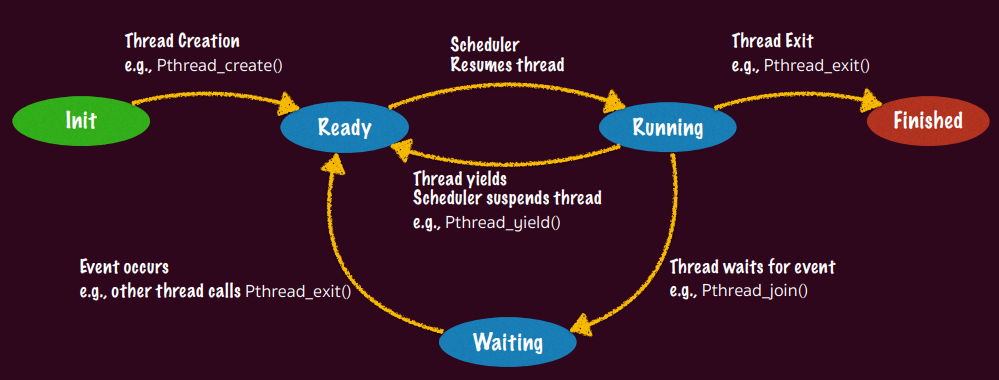
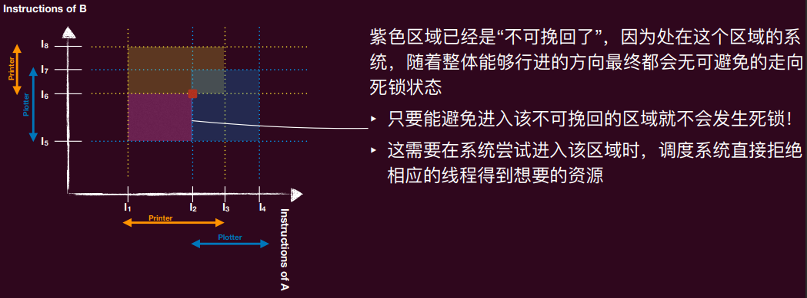

[TOC]

# 3. 多处理器编程

1. 阿姆达尔定律（Amdahl’s Law）：定义并行加速比 $\text{speedup} = \frac{1-\text{thread excution time}}{n-\text{thread execution time}}$
   - 让程序中可以被并行化的指令部分的比例为 $p$，而程序不可并行化的部分为 $1-p$（注：不是所有逻辑都是可以并行化，如果存在前后依赖的话就难以并行化）
   - 在有 n 个并行执行流的情况下，程序的加速比（相比于单个执行流）为 $\text{speedup} = \frac{1}{1-p+\frac{p}{n}}$​
     - 即使有无限多的CPU，受限于可以并行化的部分比例，也不可能无限加速

2. 并发是操作系统的核心之一
   - 操作系统的很多内部数据结构（如进程列表、页表、文件系统结构）都得考虑数据竞争的可能

## 3.1 多线程编程入门

1. 并发的基本单位是**线程**
   - 线程：共享内存的执行流
     - 拥有独立的“上下文”和栈帧列表，共享全局变量、堆空间
     - 线程就是代表着程序的“执行”单位，操作系统可以随时运行、暂停、和恢复执行它
     - 有了线程，我们可以“线性的”写多个执行流，然后他们可以“并发”的执行，这个抽象使得我们更容易掌控并发
2. 多线程编程模型
   - 从状态机的角度来看，多个线程就是多个共享内存的状态机
     - 初始状态为线程创建时刻的状态， 状态迁移为调度器任意选择一个线程执行一步
3. Posix基本线程 API
   - `Pthread_create(pthread_t * thread, const pthread_attr_t * attr, void * (*start_routine)(void*), void * arg)`：创建一个线程thread，其将以实参（arg）运行函数(start_routine）。 attr是这个线程的属性，默认为NULL，可以通过pthread_attr_init函数来初始化属性
     如栈大小、优先级等
   - `Pthread_exit(void *retval)`：在线程调用这个函数时，结束自己这个线程，并向Pthread_join自己的线程返回值retval。（注：即使不调用该函数，start_routine结束时改线程也结束，并并向Pthread_join自己的线程返回return语句的值）
   - `Pthread_join(pthread_t thread, void **retval)`：（阻塞自己）等待线程thread结束，thread返回的值将被放到retval所指定的内存
   - `Pthread_yield`：放弃当前CPU的使用 （现在已经Deprecated了，推荐使用sched_yield）
   - `Pthread_detach(pthread_t thread)`：使线程thread不被别的进程join，即使主进程结束也不被杀死，例子：pthread_detach(pthread_self()); —> 是自己“脱缰

4. 线程的生存周期：线程的一生经历初始化、就绪、运行、等待和结束的周期

   

   - 只有在运行阶段，其Context才会在CPU上，其余都在内核栈上，当线程处于就绪阶段时其TCB在OS维护
     的ready列表上等待调度，当线程处于等待阶段时，其TCB在OS维护的同步等待列表上等待同步事件发生

   - 不确定的线程调度，以及可能“被迫”改变的线程状态，会使得程序非常容易出现BUG，并且这些BUG往往很微妙、难以捉摸
   - 出现这些bug的根本原因：原子化丧失、顺序化丧失、全局一致化丧失

## 3.2 原子性丧失

1. 原子性：一个原子性的操作即是一个在其“更高”的层面上无法感知到它的实现是由多个部分组成的，一般来说，其具有两个属性：

   - All or nothing： 一个原子性操作要么会按照预想那样一次全部执行完毕，
     要么一点也不做，不会给外界暴露中间态

   - Isolation：一个原子性的操作共享变量时中途不会被其他操作干扰

2. 原子性的丧失：

   - 单处理器多线程：线程在运行时可能被中断，切换到另一个线程执行
   - 多处理器多线程：线程根本就是并行执行的

3. 实现原子性：

   - lock(&lk)
   - unlock(&lk)
     - 实现临界区（critical section）之间的绝对串行化
     - 程序的其他部分依然可以并行执行
   - 操作系统需要维护一个“并发”队列，worker thread 选择队列中的进程进入临界区

## 3.3 顺序性丧失

1. 顺序性：程序语句按照既定的顺序执行
   - 不影响语义的前提下，指令是否按顺序执行并不重要，因为编译器回通过reorder instructions来优化程序
   - 这些优化在单线程下没问题，但多线程下会出现很多问题
2. 顺序性丧失
3. 控制执行顺序：
   - 在代码中插入 “优化不能穿越” 的 barrier
     - `asm volatile ("" ::: “memory");`
     - Barrier 的含义是告诉编译器这里“可以读写任何内存”
   - 使用volatile变量，标记其每次load/store为不可优化：`bool volatile flag`
   - **锁**

## 3.5 全局一致性丧失

1. 顺序一致性模型（Sequential Consistency）

   - 不同核心看到的访存操作顺序完全一致，这个顺序称为**全局顺序**

   - 在这个全局顺序中，每个核心自己的读写操作可见顺序必须与其程序顺序保持一致

2. 宽松内存模型（Relaxed Memory Model）

   - 不保证任何不同地址且无依赖的访存操作之间的顺序，也即读读，读写，写读与写写操作之间都可以乱序全局可见


# 4. 互斥*

1. **临界区**（critical section）：访问共享资源的一段代码，资源通常是一个变量或数据结构
2. **竞态条件**（race condition）：出现在多个执行线程大致同时进入临界区时，它们都试图更新共享的数据结构，导致非预期的结果
   - 当程序含有一个或多个竞态条件，程序的输出会因运行而异，具体取决于哪些线程在何时运行，因此结果是不确定的（non-deterministic）
3. 安全性（Safety）和活性（Liveness）

   - **安全性**要求执行中的任何有限步骤内都保持这个性质

   - **活性**要求只要在最终能满足要求即可，一个隐含的要求是执行中不能发生“不可挽回”的步骤
4. 临界区的解决方案需满足的条件
   - **互斥**（Mutual Exclusion）：临界区内最多只能有一个线程
   - **行进**（Progress）：如果当前临界区内没有线程，并且有线程想要进入临界区，那么最终某个想要进入临界区的线程会进入该临界区（liveness）
   - **有界等待**（bounded waiting）：如果某个线程想要进入临界区，那么其等待的期限有限，不可一直排队等待（Fairness / No starvation）
     - 如果这个上限没有被指定，那么这就是一个Liveness property，其最终会进入
     - 如果这个上限被指定具体数字，那么这就是一个Safety property
   - **性能**（performance）：进入和退出该临界区的两个操作应该相对于在该临界区内做的计算而言尽可能的小
   - **经验法则**：设计并发算法时优先考虑安全性

## 4.1 锁（Locks）

1. **锁**：变量，保存了锁在某一时刻的状态
   - 可用的（available / unlocked / free）：没有线程持有锁
   - 被占用的（acquired / locked / held）：一个线程持有锁，处于临界区
2. 锁提供两个配对操作：
   - `lock()` / `acquire()`：调用这两个函数尝试获取锁，如果锁可用则线程获得并进入临界区，否则不会返回（线程卡住）
   - `unlock()` / `release()`：调用这两个函数锁变得可用，之前因获得锁操作失败卡在那的线程中的一个会进入临界区
3. 锁为程序员提供了最小程度的调度控制，通过给临界区加锁，保证临界区内只有一个活跃变量（互斥）

**如何实现这样的锁？**下列有几种尝试

1. **关中断**：

   - 单处理器系统中通过禁用中断来实现对临界区的独占访问。具体来说，当一个线程要进入临界区时，它会执行一条禁用中断的指令，这样就不会有其他任何中断（如I/O中断）打断当前线程的执行。这保证了线程在执行临界区代码时，不会被打断，从而实现了互斥。unlock()就是再次打开中断

   - 存在的问题：

     - 如果临界区代码进入死循环，整个系统也会卡死

     - 中断关闭时间过长会导致很多重要的外界响应丢失（错过磁盘I/O的完成事件）

     - 关中断是特权指令，用户态的应用是无法执行的，只有操作系统有这个权限

     - 在多处理器系统中无效，因为每个处理器有独立的寄存器组，中断是每个处理器的内部状态

2. **通过软件（Lock标志）**：

   - 使用一个标志表达此时锁的状态（如0和1）
   - 这种方法有两个关键的假设：

     - 读取并测试变量是原子的：即flag == 1的操作是原子的
     - 设置变量是原子的：即flag = 1和flag = 0的操作是原子的
   - 存在的问题：在单处理器系统中，这两个假设是合理的，但是在现代多处理器系统中，这些假设并不成立。这种方法会出现竞态条件的问题，具体来说，两个线程有可能同时发现flag为0，然后同时设置flag为1，从而同时进入临界区，这违背了互斥的要求。

3. **互斥的 test**：

   - 每个线程使用不同的标志来判定是否进入临界区，从而避免多个线程同时进入临界区

     ```c
     // for thread 1
     void lock() { 
         while (flag == 0); // 自旋等待，直到flag为1
     }
     
     void unlock() { 
         flag = 0;  // 设置flag为0，表示释放锁
     }
     
     // for thread 2
     void lock() { 
         while (flag == 1); // 自旋等待，直到flag为0
     }
     
     void unlock() { 
         flag = 1;  // 设置flag为1，表示释放锁
     }
     ```

   - 存在的问题：这种方法强制线程严格轮流进入临界区。例如，如果线程2始终不进入临界区，那么线程1最多只能进入一次临界区。这违背了 liveness 的性质，无法“行进”

4. **Peterson 算法**

   - 主要思想：对“互斥test”的改进，除了测试 flag 以外，看看是否有别的线程进入临界区

   - intents[]：一个数组，用于记录是否有其他线程要进入临界区。
     flag：全局变量，进行判定，当两个线程都有进入意图之后解决冲突

   - ```c
     int intents[2] = {0, 0}; // 进入意图
     int flag = 0;  // 当前谁可以获得锁 (线程0或1)
     
     int self = i; //当前的线程ID，0，1中的一个
     
     void lock(int self) {  
         intents[self] = 1;  // 标记自己想要进入临界区、
         flag = self; //轮转到下一位
         while (intents[(self + 1) % 2] == 1 && (flag == self)); // 如果另一个线程也想进来，并且当前轮到自己，则等待
     }
     
     void unlock(int self) { 
         intents[self] = 0; // 标记自己不再想要进入临界区
     }
     ```

   - 正确性分析：Peterson算法满足互斥、行进和有界等待三个条件。

     1. **互斥性（Mutual Exclusion）：**
        - 在任何时刻，最多只有一个线程可以进入临界区。因为只有一个线程能够使其条件`while (intents[(self + 1) % 2] == 1 && flag == self)`为false，从而跳出循环进入临界区。

     2. **进展性（Progress）：**
        - 如果没有线程在临界区，并且有线程想要进入临界区，则最终某个线程会进入临界区。

     3. **有界等待（Bounded Waiting）：**
        - 由于轮转机制，每个线程都有机会进入临界区，不会出现某个线程无限等待的情况。

   - 优缺点

     - Peterson算法简单且有效，能够在软件层面实现互斥。

     - 只适用于两个线程的情况。在多线程环境下，算法需要扩展，复杂度会增加。
     - 在现代多处理器系统中，由于缓存一致性问题和编译器优化，Peterson算法可能无法保证正确性。

     在现代计算机体系结构下，由于多处理器以及乱序指令流的存在，需要硬件的支持，例如内存屏障（Memory Barrier），以确保内存操作的顺序性。典型的编译器和硬件平台提供了相应的指令来实现这一点。


## 4.2 硬件支持的锁

1. 在现代计算机系统中，由于多处理器环境的存在，软件实现的锁（如Peterson算法）在保证互斥性方面存在局限性。硬件支持的锁通过提供原子操作，可以更高效地实现互斥。

2. 原子的 Test-And-Set（TAS）指令

3. **自旋锁（Spin Lock）**的实现

   ```c
   int flag = 0; // 锁的状态变量
   
   void lock() {
       int expected;
       do {
           expected = 0;
           asm volatile (
               "lock cmpxchg %2, %1" // 使用原子的Test-And-Set指令
               : "+a" (expected)
               : "m" (flag),
                 "r" (1)
               : "memory", "cc"
           );
       } while (expected != 0); // 如果锁已被占用，则继续自旋
   }
   
   void unlock() {
       asm volatile (
           "mov %1, %0" // 释放锁
           : "=m" (flag)
           : "r" (0)
           : "memory"
       );
   }
   ```

   - 尝试获取锁：

     - 线程通过 `cmpxchg` 指令尝试获取锁，如果 flag 为0，则设置为1并获得锁。

     - ```assembly
       "lock cmpxchg %2, %1"
       : "+a" (expected)
       : "m" (flag),
         "r" (1)
       : "memory", "cc"
       ```

       - `"lock cmpxchg %2, %1"`：`cmpxchg`是x86指令，用于比较并交换。`lock`前缀确保该指令在多处理器环境中是原子的。
         - `%2`：表示要比较的新值`1`。
         - `%1`：表示目标操作数`flag`。
       - `"+a" (expected)`：`+a`表示使用`eax`寄存器来存储`expected`的值，并且这个操作数是输入输出操作数（既是输入也是输出）。
       - `"m" (flag)`：`flag`是内存操作数。
       - `"r" (1)`：使用寄存器存储值`1`。
       - `: "memory", "cc"`：表示该指令会修改内存和条件码寄存器。

     - 如果 flag 不为0，则继续自旋等待。

   - 释放锁：

     ```assembly
     "mov %1, %0"
     : "=m" (flag)
     : "r" (0)
     : "memory"
     ```

     - `"mov %1, %0"`：`mov`是x86指令，用于将值`0`移动到`flag`。
       - `%1`：表示源操作数`0`。
       - `%0`：表示目标操作数`flag`。
     - `"=m" (flag)`：`flag`是输出操作数，表示内存位置。
     - `"r" (0)`：使用寄存器存储值`0`。
     - `: "memory"`：表示该指令会修改内存。

4. 优缺点：
   - 自旋锁在锁竞争激烈时可能导致大量的CPU资源浪费。
   - 需要硬件支持原子操作。


# 5. 互斥：进阶

1. 自旋锁的一个改进：

   - 当一个线程在自旋等待（忙等待）时，它不一定能够最终进入临界区。因为如果一直有其他线程要进入临界区，并且这些其他线程一直被优先调度进入临界区，那这个线程就可能会一直等在那里（违背了有界等待）

   - 解决方法：**排队自旋锁（Ticket Lock）**

   - 核心思想：每个尝试进入临界区的线程都会拿一个“号”，然后按照顺序等待自己的“号”被叫到，这样可以确保所有线程按顺序进入临界区，避免长时间的忙等待。

   - 实现代码：

     ```c
     typedef struct lock_ticket {
         int ticket; // 当前发放的最大票号
         int turn;   // 当前应该进入的票号
     } lock_t;
     
     lock_t flag;
     
     void lock_init() {
         flag.ticket = 0;
         flag.turn = 0;
     }
     
     // 加锁函数通过原子的“fetch_and_add”操作实现，该操作可以保证多个线程同时访问时的正确性。
     void lock() {
         int myturn = 1; 
         // atomic fetch-and-add
         // equal to myturn = __sync_fetch_and_add(&flag.ticket, 1);
         // 将1加到flag.ticket，并返回flag.ticket的“旧”值给myturn
         asm volatile (
             "lock xaddl %0, %1" 
             : "+r" (myturn), "+m" (flag.ticket) 
             : 
             : "memory", "cc"
         ); 
         while (flag.turn != myturn) 
             ; // spin
     }
     
     // 解锁函数通过原子的“fetch_and_add”操作更新flag.turn，允许下一个等待的线程进入临界区。
     void unlock() {
         int value = 1; 
         asm volatile (
             "lock xaddl %0, %1" 
             : "+r" (value),
             : "+m" (flag.turn) 
             : 
             : "memory", "cc"
         );
     }
     ```

   - 适用于临界区较短的情况，如果临界区较长，仍然会导致性能问题

2. **更细粒度的锁**

   - 并不是所有线程都“彼此”需要互斥，我们应该给需要彼此互斥的线程集他们独有的“锁”，更细粒度的锁可以提高并发性能

   - 不是用一把大锁来保护所有共享资源，对参数所指向的锁进行加锁和解锁操作

   - 代码实现

     ```c
     typedef struct {
         int ticket; // 当前发放的最大票号
         int turn;   // 当前应该进入的票号
     } lock_t;
     
     void lock_init(lock_t *flag) {
         flag->ticket = 0;
         flag->turn = 0;
     }
     
     void lock(lock_t *flag) {
         int myturn = 1;
         // atomic fetch-and-add
         // equal to myturn = __sync_fetch_and_add(&flag->ticket, 1);
         // 将1加到flag.ticket，并返回flag.ticket的“旧”值给myturn
         asm volatile (
             "lock xaddl %0, %1"
             : "+r" (myturn), "+m" (flag->ticket)
             :
             : "memory", "cc"
         );
         while (flag->turn != myturn)
             ; // spin
     }
     
     void unlock(lock_t *flag) {
         int value = 1;
         asm volatile (
             "lock xaddl %0, %1"
             : "+r" (value),
             : "+m" (flag->turn)
             :
             : "memory", "cc"
         );
     }
     ```

## 5.1 在内核中实现自旋锁的问题

1. 内核中的自旋锁
   - 内核中有很多需要访问共享资源的情况，因此使用互斥锁的情况非常普遍
   - 内核可能会在各个部分用到自旋锁，除了系统调用程序外，还有中断处理程序中也可能用到
2. 问题：
   - 一个线程通过系统调用访问一个共享变量，并且内核在访问这个共享变量时加了锁。
   - 在这个过程中，一个中断发生了，CPU强制转向中断处理程序。
   - 中断处理程序也需要访问同一个共享变量，因此尝试获取锁，但是发现锁已经被持有了，于是进入自旋等待。
   - 中断处理程序的优先级通常很高，高于系统调用。因此，中断处理程序会一直等待一个不可能发生的事情（因为锁已经被持有，并且没有机会释放）。

3. 解决方法

   1. 错误的尝试：在自旋锁之前关中断，释放锁的时候开中断。如果在自旋之前就已经关中断了，解锁就打开中断就会破快在这次自旋之前的中断状态

   2. 需要保存自旋之前的中断状态，然后在解锁时恢复这个状态

      - 代码实现：

        ```c
        typedef struct {
            const char *name;
            int status;
            struct cpu *cpu;
        } spinlock_t;
        
        void spin_lock(spinlock_t *lk) {
            // Disable interrupts to avoid deadlock.
            push_off();
            // This is a deadlock.
            if (holding(lk)) {
                panic("acquire %s", lk->name);
            }
            // This our main body of spin lock.
            int got;
            do {
                got = atomic_xchg(&lk->status, LOCKED);
            } while (got != UNLOCKED);
            lk->cpu = mycpu;
        }
        
        void spin_unlock(spinlock_t *lk) {
            if (!holding(lk)) {
                panic("release %s", lk->name);
            }
            lk->cpu = NULL;
            atomic_xchg(&lk->status, UNLOCKED);
            pop_off();
        }
        
        void push_off(void) {
            // Record previous state of interrupt
            int old = ienabled();
        
            struct cpu *c = mycpu;
        
            // Disable the interrupt
            iset(false);
            
            if (c->noff == 0) {
                c->intena = old;
            }
            c->noff += 1;
        }
        
        void pop_off(void) {
            struct cpu *c = mycpu;
            // Never enable interrupt when holding a lock.
            if (ienabled()) {
                panic("pop_off - interruptible");
            }
            if (c->noff < 1) {
                panic("pop_off");
            }
            c->noff -= 1;
            if (c->noff == 0 && c->intena) {
                iset(true);
            }
        }
        ```

        - push_off函数：
          - 记录并关闭当前中断状态。
          - 记录关闭中断的次数，确保可以正确恢复。
        - pop_off函数：
          - 确保中断在锁释放前不会被重新启用。
          - 递减关闭中断的次数，并在计数为零时恢复之前的中断状态。

## 5.2 应用程序里的使用互斥锁问题

1. 自旋锁本身存在的问题：性能问题：除了进入临界区的线程，其他处理器上的线程都在空转

   - 如果临界区执行时间过长，其他线程浪费的CPU越多
   - 如果发生中断将临界区的线程切出去了，计算资源浪费更加严重

2. 解决方案一：直接 yield：用 sched_yield() 让线程主动让出cpu，让其他线程获得CPU使用

   ```c
   void yield_lock(spinlock_t *lk) {
       while (xchg(&lk->locked, 1)) {
           // 使用系统调用sched_yield()让出CPU
           syscall(SYS_yield); // 在抽象机器上等同于yield()
       }
   }
   
   void yield_unlock(spinlock_t *lk) {
       xchg(&lk->locked, 0);
   }
   ```

   - 问题：
     - yield操作只是暂时让出CPU，但线程仍然处于“就绪”状态，随时可以被再次调度。
     - 在锁竞争激烈的情况下，线程可能会反复被调度并让出CPU，导致大量不必要的上下文切换（context switches）

3. 解决方案二：用户使用和释放锁应该和OS调度程序配合，使用更高级的同步机制，如互斥锁（mutex）和条件变量（condition variable）。这些机制允许线程在无法获取锁时进入阻塞状态，而不是继续处于就绪状态，从而避免频繁的上下文切换。

   - `mutex_lock(&lk)`：试图获得 lk，如果失败，利用系统调用阻塞该线程

   - `mutex_unlock(&lk)`：释放锁，如果等待该锁的队列里有线程就利用系统调用选择一个唤醒

   - 需要对一个锁维持一个与其相关的队列

   - 代码一：

     ```c
     void mutex_lock(spinlock_t* lk) { 
         int got; 
         do { 
             got = atomic_xchg(lk->status, LOCKED); 
             if (got != UNLOCKED) { 
                 // 将当前线程加入等待队列，并标记为阻塞，释放CPU 
                 wait(lk->wait_list); 
             } else { 
                 break; 
             } 
         } while (1); 
     }
     
     void mutex_unlock(spinlock_t* lk) { 
         atomic_xchg(lk->status, UNLOCKED); 
         if (!is_empty(lk->wait_list)) { 
             // 从等待队列中取出一个线程，标记为就绪 
             wakeup(lk->wait_list); 
         } 
     }
     ```

     在上述实现中，存在一个潜在的问题：唤醒操作可能丢失。例如，考虑如下的执行顺序：

     1. 线程1尝试获取锁，发现锁被持有，于是进入等待队列。
     2. 线程2释放锁，发现等待队列不为空，于是唤醒等待队列中的一个线程（此时线程1被唤醒）。
     3. 在线程1尚未获得CPU执行权之前，另一个线程3尝试获取锁并成功。
     4. 线程3再次释放锁，检查等待队列发现为空（因为线程1已经被唤醒但尚未执行），于是没有进行任何操作。

     这种情况下，线程1可能会错过唤醒信号，因为在它实际执行之前，等待队列已经被检查为空。这种情况会导致线程1永远处于阻塞状态，形成死锁。

   - 对上述问题的解决方法：Linux提供了一种高效的用户态互斥锁机制——futex（Fast Userspace muTEX），可以解决上述问题。

     ```c
     #define UNLOCK 0
     #define ONE_HOLD 1
     #define WAITERS 2
     
     void mutex_lock(spinlock_t* lk) { 
         //return old value of state,
     	//and if lk == UNLOCK, set state = ONE_HOLD — uncontested!
         int c = cmpxchg(lk, UNLOCKED, ONE_HOLD); 
     
         if (c != UNLOCKED) { 
             //previous state is either ONE_HOLD or WAITERS
             do {  
                 if (c == WAITERS || cmpxchg(lk, ONE_HOLD, WAITERS) != 0)  
                     // if previous state is either ONE_HOLD
     				// now it has one more waiter!
     				// AND it is possible the lock is released now!
                     futex_wait(lk, WAITERS); 
             } 
             // repeating check whether the lock is released!
             while ((c = cmpxchg(lk, UNLOCKED, WAITERS)) != 0);  
         }
         else {
             return; //the fast path lock!
     	}
     }
     
     void mutex_unlock(spinlock_t* lk){ 
         //state can only be ONE_HOLD or WAITERS
         if (atomic_dec(lk) != ONE_HOLD) { 
             //has more than one waiters
             lk = UNLOCKED; 
             futex_wake(lk); 
         } else {
             //No Waiters!
             return; //the fast path unlock!
     	}
     }
     ```

     - 正确性：
       - **互斥性**：
         - `mutex_lock`函数只会在成功获取锁后返回，确保只有一个线程可以进入临界区。
         - 获取锁的线程会将锁状态原子性地设置为`ONE_HOLD`，其他线程将锁状态设置为`WAITERS`，确保互斥访问。
       - **等待和唤醒**：
         - `futex_wait`确保了线程在等待时不会错过唤醒信号。
         - `futex_wake`确保至少有一个等待的线程能够被唤醒。

4. Posix 的实现方案：通过pthread库提供的函数来实现，这些函数包括初始化、加锁、解锁和销毁互斥锁。

   ```c
   #include <pthread.h>
   
   pthread_mutex_t mutex;
   int pthread_mutex_init(pthread_mutex_t *restrict mutex, const pthread_mutexattr_t *restrict attr); // 初始化互斥锁
   int pthread_mutex_lock(pthread_mutex_t *mutex); // 尝试获取互斥锁。如果互斥锁已经被其他线程持有，该函数会阻塞直到互斥锁可用。
   int pthread_mutex_unlock(pthread_mutex_t *mutex); // 释放互斥锁。如果有其他线程在等待互斥锁，该函数会唤醒其中一个线程。
   int pthread_mutex_destroy(pthread_mutex_t *mutex); // 毁互斥锁，释放其占用的资源。在互斥锁不再使用时调用。
   ```

## 5.3 并发数据结构

线程安全的数据结构（并发数据结构）：一个数据结构可以被多个线程并发的访问，在访问和更新该数据结构时上锁

```c
#include <pthread.h>

typedef struct __counter_t {
    int value;
    pthread_mutex_t lock;
} counter_t;

void init(counter_t *c) {
    c->value = 0;
    pthread_mutex_init(&c->lock, NULL);
}

void increment(counter_t *c) {
    pthread_mutex_lock(&c->lock);
    c->value++;
    pthread_mutex_unlock(&c->lock);
}

void decrement(counter_t *c) {
    pthread_mutex_lock(&c->lock);
    c->value--;
    pthread_mutex_unlock(&c->lock);
}

int get(counter_t *c) {
    pthread_mutex_lock(&c->lock);
    int rc = c->value;
    pthread_mutex_unlock(&c->lock);
    return rc;
}
```

**层次化锁**：分层锁的思想是使用多个锁来保护不同层次的资源，从而提高并发性。例如，可以使用局部锁来保护每个CPU的局部数据，使用全局锁来保护共享数据。

**层级化的并发解决方案**

- 硬件提供了基本的原子指令
- 操作系统提供的并发原语

- 库函数提供的并发控制API
- 用户使用这些原语构建正确和高效的并发程序


# 6. 同步：基础

1. 并发的困难：语句执行顺序不确定；两个线程同时进入临界区
2. 同步：线程受控制，控制并发，使两个或两个以上随时间变化的量在变化过程中保持一定的相对关系
3. 简单的互斥（使用锁）不能控制线程的执行顺序

## 6.1 生产者=消费者问题

1. **有界缓冲区**：一个或多个线程共享一个数据缓冲区问题，该缓冲区容量有上限
2. 线程分为：
   - **生产者**：生产数据。缓冲区有空位：放入数据
   - **消费者**：消费数据。缓冲区有数据：取走数据

3. 问题简化：生产=打印左括号；消费=打印右括号。缓冲区：括号的嵌套深度depth

4. 解决尝试1：用互斥锁保护共享变量depth，每次访问共享变量 `depth` 时都加锁和解锁，以保证 `depth` 的原子性。

   ```c
   void produce() { 
       while(1) { 
       retry:  
           mutex_lock(&lk); 
           int ready = (depth < n);  
           mutex_unlock(&lk); 
           if (!ready) goto retry; 
   
           mutex_lock(&lk); 
           printf(“(”); 
           depth++;  
           mutex_unlock(&lk); 
       } 
   }
   
   void consume(){ 
       while(1){ 
       retry: 
           mutex_lock(&lk); 
           int ready = (depth > 0); 
           mutex_unlock(&lk); 
           if (!ready) goto retry; 
   
           mutex_lock(&lk); 
           printf(")"); 
           depth--; 
           mutex_unlock(&lk); 
       } 
   }
   ```

   **问题**：

   - `mutex_unlock(&lk);` 和 `if (!ready)` 之间可能会被打扰（即 `depth` 可能被其他线程修改）。
   - 这意味着，尽管 `ready` 为 `true`，但 `depth < n` 不一定成立。

5. 解决尝试2：解锁被推迟到确定状态后的判断之后，以避免 `depth` 被其他线程修改的问题。

   ```c
   void produce() { 
       while(1) { 
       retry:  
           mutex_lock(&lk); 
           int ready = (depth < n);  
           if (!ready){ 
               mutex_unlock(&lk); 
               goto retry; 
           } 
   
           printf(“(”); 
           depth++;  
           mutex_unlock(&lk); 
       } 
   }
   
   void consume(){ 
       while(1){ 
       retry: 
           mutex_lock(&lk); 
           int ready = (depth > 0); 
           if (!ready) { 
               mutex_unlock(&lk); 
               goto retry; 
           } 
   
           printf(")"); 
           depth--; 
           mutex_unlock(&lk); 
       } 
   }
   ```

   **问题**：这种方法虽然正确，但会带来性能问题，因为线程会频繁自旋等待。

6. 解决尝试3：利用操作系统的调度进行阻塞和唤醒。通过 `wait` 和 `wakeup` 操作使线程在无法进行生产或消费时阻塞，从而避免了自旋等待。

   ```c
   void produce() { 
       while(1) { 
       retry:  
           mutex_lock(&lk); 
           int ready = (depth < n);  
           if (!ready){ 
               mutex_unlock(&lk); 
               wait(&producer_waiting_list); 
               goto retry; 
           } 
   
           printf(“(”); 
           depth++;  
           wakeup(&consumer_waiting_list); 
           mutex_unlock(&lk); 
       } 
   }
   
   void consume(){ 
       while(1){ 
       retry: 
           mutex_lock(&lk); 
           int ready = (depth > 0); 
           if (!ready) { 
               mutex_unlock(&lk); 
               wait(&consumer_waiting_list); 
               goto retry; 
           } 
   
           printf(")"); 
           depth--; 
           wakeup(&producer_waiting_list); 
           mutex_unlock(&lk); 
       } 
   }
   ```

   **问题**：唤醒操作可能会丢失

7. 解决尝试4：使用 `futex` 操作，解决了唤醒丢失的问题，通过原子操作确保状态的一致性。

   ```c
   int cnd1 = 0;  // 生产者能够生产的条件 
   int cnd2 = 0;  // 消费者能够消费的条件 
   
   void produce() { 
       while(1) { 
       retry:  
           mutex_lock(&lk); 
           int ready = (depth < n);  
           if (!ready){ 
               int val = cnd1; 
               mutex_unlock(&lk); 
               futex_wait(&cnd1, val); 
               goto retry; 
           } 
   
           printf(“(”); 
           depth++;  
           atomic_add(&cnd2, 1); 
           futex_wake(&cnd2); 
           mutex_unlock(&lk); 
       } 
   }
   
   void consume(){ 
       while(1){ 
       retry: 
           mutex_lock(&lk); 
           int ready = (depth > 0); 
           if (!ready) { 
               int val = cnd2; 
               mutex_unlock(&lk); 
               futex_wait(&cnd2, val); 
               goto retry; 
           } 
   
           printf(")"); 
           depth--; 
           atomic_add(&cnd1, 1); 
           futex_wake(&cnd1); 
           mutex_unlock(&lk); 
       } 
   }
   ```

8. **条件变量**：用于标记某个用于同步条件的变量

   - `cond_wait(cond_t *cv, mutex_t *lk)`：

     - 调用之前默认假设已经持有锁 `lk`。
     - 调用之后原子的阻塞线程并释放锁。
     - 被唤醒时重新获取锁 `lk`。

   - `cond_signal(cond_t *cv)`：

     - 唤醒一个等待在条件变量 `cv` 上的阻塞线程。
     - 如果没有线程阻塞在这个条件变量上，则什么也不做。

   - POSIX 规定了相应的 API

     - ```c
       #include <pthread.h> 
       
       pthread_cond_t cv; 
       int pthread_cond_init(pthread_cond_t *cv, NULL); 
       int pthread_cond_destroy(pthread_cond_t *cv); 
       int pthread_cond_wait(pthread_cond_t *cv, pthread_mutex_t *mutex); 
       int pthread_cond_signal(pthread_cond_t *cv);
       ```

   - 代码实现：

     ```c
     typedef struct conditional_variable { 
         unsigned value; 
     } cond_t;
     
     void cond_wait(cond_t *cv, mutex_t *lk) 
     { 
         int val = atomic_load(&cv->value); 
         mutex_unlock(lk); 
         futex_wait(&cv->value, val); 
         mutex_lock(lk); 
     }
     
     void cond_signal(cond_t *cv) 
     { 
         atomic_fetch_add(&cv->value, 1); 
         futex_wake(&cv->value); 
     }
     
     void cond_wait(cond_t *cv, mutex_t *lk) 
     { 
         int val = atomic_load(&cv->value); 
         mutex_unlock(lk); 
         futex_wait(&cv->value, val); 
         mutex_lock(lk); 
     }
     
     void cond_signal(cond_t *cv) 
     { 
         atomic_fetch_add(&cv->value, 1); 
         futex_wake(&cv->value); 
     }
     ```

9. **条件变量解决生产者-消费者问题**

   - 代码实现

     ```c
     cond_t cv_p = COND_INIT();   
     cond_t cv_c = COND_INIT();  
     mutex_t lk = MUTEX_INIT(); 
     
     void produce() { 
         while(1) { 
             mutex_lock(&lk); 
             if (!(depth < n)) { 
                 cond_wait(&cv_p, &lk); 
             } 
             printf("("); 
             depth++;  
             cond_signal(&cv_c); 
             mutex_unlock(&lk); 
         } 
     }
     
     void consume() { 
         while(1) { 
             mutex_lock(&lk); 
             if (!(depth > 0)) { 
                 cond_wait(&cv_c, &lk); 
             } 
             printf(")"); 
             depth--;  
             cond_signal(&cv_p); 
             mutex_unlock(&lk); 
         } 
     }
     ```

     - 生产者 `produce`：如果缓冲区满了，则等待 `cv_p`，否则生产数据并发信号唤醒消费者 `cv_c`。

     - 消费者 `consume`：如果缓冲区为空，则等待 `cv_c`，否则消费数据并发信号唤醒生产者 `cv_p`。

   - **问题**：考虑以下情况：一个生产者，两个消费者。当缓冲区为空时，两个消费者等待。当生产者生产数据并唤醒一个消费者时，另一个消费者可能会抢先进入临界区并消费数据。结果是唤醒的消费者在进入临界区时发现没有数据可消费，出现错误

10. **Hansen/Mesa语义**：由于调用Signal通知某个线程，和那个线程wait被唤醒不是原子的

    - 解决办法：唤醒后重新尝试判断条件是否满足，使用 while 循环来确保条件变量唤醒后重新检查条件

    - 代码实现

      ```c
      void produce() { 
          while(1) { 
              mutex_lock(&lk); 
              while (!(depth < n)) { 
                  cond_wait(&cv_p, &lk); 
              } 
              printf("("); 
              depth++;  
              cond_signal(&cv_c); 
              mutex_unlock(&lk); 
          } 
      }
      
      void consume() { 
          while(1) { 
              mutex_lock(&lk); 
              while (!(depth > 0)) { 
                  cond_wait(&cv_c, &lk); 
              } 
              printf(")"); 
              depth--;  
              cond_signal(&cv_p); 
              mutex_unlock(&lk); 
          } 
      }
      ```

11. **Hoare语义**：

    - `cond_signal` 和 `cond_wait` 之间是原子的。
    - 信号程序将互斥锁转移到被唤醒的程序，并阻塞自己，保证被唤醒线程所等待的条件是保持的。

12. **对比**：

    - Hansen/Mesa语义实现简单，不保证安全性。
    - Hoare语义实现复杂，保证安全性和条件的保持

13. 使用一个条件变量：

    ```c
    void produce() { 
        while(1) { 
            mutex_lock(&lk); 
            while (!(depth < n)) { 
                cond_wait(&cv, &lk); 
            } 
            printf("("); 
            depth++;  
            cond_signal(&cv); 
            mutex_unlock(&lk); 
        } 
    }
    
    void consume() { 
        while(1) { 
            mutex_lock(&lk); 
            while (!(depth > 0)) { 
                cond_wait(&cv, &lk); 
            } 
            printf(")"); 
            depth--;  
            cond_signal(&cv); 
            mutex_unlock(&lk); 
        } 
    }
    ```

    存在的问题：考虑以下情形：

    1. 有三个线程：消费者 $C_1$、消费者 $C_2$ 和生产者 $P_1$。
    2. $C_1$ 和 $C_2$ 首先依次进入临界区，发现数据为空，都会阻塞等待。
    3. 然后 $P_1$ 进入临界区，生产一个 item 后唤醒一个线程，例如 $C_1$。
    4. 在 $C_1$ 被唤醒之前，$P_1$ 再次进入临界区，发现没有空间（假设缓冲区为1），于是阻塞自己。
    5. 此时 $C_1$ 醒来并进入临界区，消费这个数据之后，试图唤醒其他线程，但唤醒谁没有保障（因为都是同一个条件变量）。
    6. 如果唤醒的是 $C_2$，那么 $C_2$ 进入临界区，发现数据为空，阻塞等待。然后 $P_1$ 尝试进入临界区，发现没有空间，也阻塞等待。这样所有线程都处于阻塞状态，没有人可以唤醒其他线程，导致死锁。

14. 解决方案：使用 `cond_broadcast`，一次唤醒所有线程，那些需要被正确唤醒的自然会醒来做相应的事情，而那些不该唤醒的线程会再度进入等待状态：

    ```c
    void produce() { 
        while(1) { 
            mutex_lock(&lk); 
            while (!(depth < n)) { 
                cond_wait(&cv, &lk); 
            } 
            printf("("); 
            depth++;  
            cond_broadcast(&cv); 
            mutex_unlock(&lk); 
        } 
    }
    
    void consume() { 
        while(1) { 
            mutex_lock(&lk); 
            while (!(depth > 0)) { 
                cond_wait(&cv, &lk); 
            } 
            printf(")"); 
            depth--;  
            cond_broadcast(&cv); 
            mutex_unlock(&lk); 
        } 
    }
    ```

15. **条件变量的使用经验法则**

    1. 除了条件变量外，还需要有共享的状态用于判定是否可以“生产”或“消费”。
    2. 使用互斥锁来保护共享状态以及条件变量的操作。
    3. 在执行 `wait/signal/broadcast` 时需要持有互斥锁。
    4. 每次从 `wait` 中唤醒后，要重新进行条件检查（使用 `while` 循环）。
    5. 针对不同的条件使用不同的条件变量，除非使用 `broadcast`。

## 6.2 条件变量的应用

1. **计算中的依赖关系**
   1. **计算依赖图**：
       - `wait` 和 `signal` 是非常强大的并发原语。
       - 可以利用 `wait` 和 `signal` 将程序算法并行化。
       - 通过定义计算图 `G = (V, E)`，其中 `V` 是计算事件集，`(u, v) ∈ E` 表示计算事件 `u` 依赖于计算事件 `v`。
       - `u` 和 `v` 只能串行执行，而没有依赖关系的节点可以并行计算。

   2. **并行化方案**：
       - 对于每个节点（线程），设置同步条件：只有当所有前置计算完成后，节点才能进行计算。
       - 完成计算后，对依赖该节点的节点进行 `signal` 或 `broadcast`。


2. **动态规划算法**

   1. **分析问题结构**：
       - 例如 [rod-cutting]：一个切割长度 + 剩余长度的最优解。
       - 递归定义问题的最优解：`rn = max(1 ≤ i ≤ n)(pi + rn−i)`。
       - 计算最优解值，通常使用自底向上的方法。


      2. **拓扑序与并行化**：
         - 在单线程下，计算子问题图的拓扑序，然后依次执行。
         - 在多线程情况下，可以并行执行所有这些线程，只需利用条件变量按照依赖图控制线程顺序。

3. **Edit Distance问题**

   1. **问题定义**：
       - 给定两个字符串，计算它们之间的编辑距离（有多相似）（最少的转化步骤，包括删除、插入和替换）。
       - 递归定义编辑距离：
           ```c
           dist(i, j) = i if j = 0
                        j if i = 0
                        min(dist(i, j − 1) + 1,
                            dist(i − 1, j) + 1,
                            dist(i − 1, j − 1) + I[A[i] = B[j]]) otherwise
           ```

   2. **并行化解决方案**：

         - 每条斜边的节点可以在上一轮斜边对应的节点完成后继续执行。

         - 考虑性能成本，线程太多会增加调度成本，线程太少并发度低。

4. **并发算法设计框架**

   - **通用框架**：

     - 生产者线程：负责调度，根据当前完成的计算节点和依赖关系，调度可以运行的线程，放入 ready 列表准备运行（线程池）。

     - 消费者线程：执行计算，结束后通知调度线程，告知条件可能发生变化，可以重新计算下一批可运行的线程。

   - **代码实现**：

        ```c
        void T_worker() { 
            while (1) { 
                consume().run(); 
            } 
        } 
        void T_scheduler() { 
            while (!jobs.empty()) { 
                for (auto j : jobs.find_ready()) { 
                    produce(j); 
                } 
            } 
        }
        ```

## 6.3 信号量

1. **信号量的基本概念**：信号量表示一个整数值变量，只能通过两个原子操作来改变这个变量的值：
   - `P(sem_t *sem)`：如果 `sem` 的值不是正数，则阻塞自己，否则将 `sem` 的值减1后继续运行。
   - `V(sem_t *sem)`：将信号量 `sem` 的值加1，如果有一个或多个线程阻塞在这个信号量上，选择一个线程唤醒。

2. POSIX 也定义了信号量的使用，提供以下API：

   ```c
   #include <semaphore.h> 
   sem_t sem; 
   int sem_init(sem_t *sem, int pshared, unsigned int value);  
   int sem_destroy(sem_t *sem); 
   int sem_wait(sem_t *sem); 
   int sem_post(sem_t *sem);
   ```

3. 信号量的一种实现：利用互斥锁和条件变量来实现信号量

   ```c
   typedef struct _sem_t { 
       int value; 
       pthread_cond_t cond; 
       pthread_mutex_t lock; 
   } sem_t; 
   
   void sem_init(sem_t *s, int value) { 
       s->value = value; 
       pthread_cond_init(&s->cond, NULL); 
       pthread_mutex_init(&s->lock, NULL); 
   }
   
   void sem_wait(sem_t *s) { 
       pthread_mutex_lock(&s->lock); 
       while (s->value <= 0) 
           pthread_cond_wait(&s->cond, &s->lock); 
   
       s->value--; 
       pthread_mutex_unlock(&s->lock); 
   }
   
   void sem_post(sem_t *s) { 
       pthread_mutex_lock(&s->lock); 
       s->value++; 
       pthread_cond_signal(&s->cond); 
       pthread_mutex_unlock(&s->lock); 
   }
   ```

4. 信号量的使用：

   - **互斥**：实现互斥锁（即二值信号量）：

     ```c
     sem_t sem; 
     sem_init(&sem, 0, 1); 
     
     void func() { 
         sem_wait(&sem); 
         // 临界区代码 
         sem_post(&sem); 
         // 剩余区代码 
     }
     ```

   - **顺序控制**：确保一个线程在另一个线程之后运行：

     ```c
     sem_t sem; 
     int main(int argc, char *argv[]) {  
         sem_init(&sem, 0, 0);     
         pthread_t c; 
         pthread_create(&c, NULL, child, NULL);  
         sem_wait(&sem);  
         do_something(); 
         return 0; 
     }
     
     void* child(void *arg) {  
         do_something();  
         sem_post(&sem); 
         return NULL; 
     }
     ```

5. **使用信号量+互斥锁的解决方案**：生产者和消费者分别使用两个信号量 `empty` 和 `full` 来表示缓冲区的状态：

   ```c
   sem_t mutex; 
   sem_init(sem_t &mutex, 0, 1); 
   sem_t empty; 
   sem_init(sem_t &empty, 0, MAX); 
   sem_t full; 
   sem_init(sem_t &full, 0, 0); 
   
   void produce() { 
       while(1) { 
           P(&empty); 
           P(&mutex); 
           produce_shared_buffer(); 
           V(&mutex); 
           V(&full); 
       } 
   }
   
   void consume() { 
       while(1) { 
           P(&full); 
           P(&mutex); 
           consume_shared_buffer(); 
           V(&mutex); 
           V(&empty); 
       } 
   }
   ```

6. **信号量的局限性**

   - 例如，针对复杂的同步问题，如打印鱼问题，信号量的V操作具有指向性，不太好表达“二选一”的逻辑。

   - 信号量记录的状态是整数形式，对于非整数的条件判定不太适用。

# 7. 同步：进阶

1. 信号量可完成互斥锁的工作
2. 信号量完成某些线程控制
3. 泛化
4. 条件变量适用于同步条件，和互斥锁一起实现信号量

## 7.1 读者-写者问题

1. 问题定义：
   - 多个读者线程可以同时读取共享数据（读-读不需要互斥）
   - 只有一个写者线程可以修改共享数据（写-写互斥）
   - 写者线程写数据时，不能有任何读者线程读取数据（写-读互斥）

2. 读写锁（readers-writers lock）：允许多个读者同时读取数据，但每次只能有一个写者写入数据

3. 读写锁实现1：**读者优先**（Reader Preference）实现

   ```c
   typedef struct _rwlock_t { 
       sem_t lock;		// 保护自身锁状态的锁 
       sem_t rwlk; 	// 进入临界区获得锁 
       int readers; 	// 当前读者数量
   } rwlock_t;
   
   void rwlock_init(rwlock_t *rw) { 
       sem_init(&rw->lock, 0, 1);  
       sem_init(&rw->rwlk, 0, 1); 
       rw->readers = 0; 
   }
   
   void acquire_readlock(rwlock_t *rw) { 
       P(&rw->lock); 
       if (rw->readers == 0) { 
           // 此时临界区还没读者
           P(&rw->rwlk); 
       } 
       // rw-readers > 0 或 得到了rwlk
       rw->readers++; 
       V(&rw->lock); 
   }
   
   void release_readlock(rwlock_t *rw) { 
       P(&rw->lock); 
       rw->readers--; 
       if (rw->readers == 0) { 
           V(&rw->rwlk); 
       } 
       V(&rw->lock);  
   }
   
   void acquire_writelock(rwlock_t *rw) { 
       P(&rw->rwlk); 
   }
   
   void release_writelock(rwlock_t *rw) { 
       V(&rw->rwlk); 
   }
   ```

   问题：如果读者不断地进入临界区，那么写者就会一直被阻塞，导致“饿死”（starvation）

4. 读写锁的实现2：**写者优先**（Writer Preference）。如果有写者想要进入临界区，那么其应该阻止后来的读者尝试进入临界区

   ```c
   typedef struct _rwlock_t { 
       sem_t rlock; 	// 读操作时保护自身锁操作的锁
       sem_t wlock; 	// 写操作时保护自身锁操作的锁
       sem_t rwlk; 	// 进入临界区获得锁
       sem_t tryRead; 	// 读者进入之前先看等待写者
   
       int readers; 
       int writers; 	// 想要进入的写者
   } rwlock_t;
   
   void rwlock_init(rwlock_t *rw) { 
       sem_init(&rw->rlock, 0, 1);  
       sem_init(&rw->wlock, 0, 1);  
       sem_init(&rw->rwlk, 0, 1); 
       sem_init(&rw->tryRead, 0, 1); 
       rw->readers = 0; 
       rw->writers = 0; 
   }
   
   void acquire_readlock(rwlock_t *rw) { 
       P(&rw->tryRead); 
       P(&rw->rlock); 
       if (rw->readers == 0) { 
           P(&rw->rwlk); 
       } 
       rw->readers++; 
       V(&rw->rlock); 
       V(&rw->tryRead); 
   }
   
   void release_readlock(rwlock_t *rw) { 
       P(&rw->rlock); 
       rw->readers--; 
       if (rw->readers == 0) { 
           V(&rw->rwlk); 
       } 
       V(&rw->rlock);  
   }
   
   void acquire_writelock(rwlock_t *rw) { 
       P(&rw->wlock); 
       if (rw->writers == 0) { // 第一个写者
           P(&rw->tryRead); 
       } 
       rw->writers++; 
       V(&rw->wlock); 
       P(&rw->rwlk); 
   }
   
   void release_writelock(rwlock_t *rw) { 
       V(&rw->rwlk); 
       P(&rw->wlock); 
       rw->writers--; 
       if (rw->writers == 0) { 
           V(&rw->tryRead); 
       } 
       V(&rw->wlock); 
   }
   ```

   问题：只有等只有最后一个写者退出临界区，其才会释放 `tryRead`，后续读者才能进入

5. 读写锁的实现3：引入线程排队机制

   ```c
   typedef struct _rwlock_t { 
       sem_t rlock; 	// 读操作时保护自身锁操作的锁
       sem_t rwlk;  	// 进入临界区获得锁
       ticket_t queue; // 维持一个先进先出的队列
       int readers; 
   } rwlock_t;
   
   void rwlock_init(rwlock_t *rw) { 
       sem_init(&rw->rlock, 0, 1);  
       sem_init(&rw->rwlk, 0, 1); 
       lock_init(&rw->queue); 
       rw->readers = 0; 
   }
   
   void acquire_readlock(rwlock_t *rw) { 
       ticket_lock(&rw->queue); 
       P(&rw->rlock); 
       if (rw->readers == 0) { 
           P(&rw->rwlk); 
       } 
       rw->readers++; 
       V(&rw->rlock); 
       ticket_unlock(&rw->queue); 
   }
   
   void release_readlock(rwlock_t *rw) { 
       P(&rw->rlock); 
       rw->readers--; 
       if (rw->readers == 0) { 
           V(&rw->rwlk); 
       } 
       V(&rw->rlock);  
   }
   
   void acquire_writelock(rwlock_t *rw) { 
       ticket_lock(&rw->queue); 
       P(&rw->rwlk); 
       ticket_unlock(&rw->queue); 
   }
   
   void release_writelock(rwlock_t *rw) { 
       V(&rw->rwlk); 
   }
   ```

6. Posix 读写锁

## 7.2 哲学家就餐问题

1. 解决方案1（错误方案）：每个哲学家都先拿起自己左边的筷子，然后再拿起右边的筷子，再吃饭。
   - 如果所有哲学家同时拿起左边的筷子，然后等待右边的筷子，会导致死锁
2. 解决方案2：尝试拿不到时放下筷子
   - 运气不好的情况下，所有哲学家可能会同时放下筷子，又同时拿起左手的筷子，导致饿死
3. **死锁和饿死**：**死锁**（Deadlock）和**饿死**（Starvation）都属于活性（Liveness）问题。
   - 死锁是指多个线程形成一个等待环，一个线程的行进需要环内的另外一个线程做某个动作，导致所有线程都无法继续执行
   - 饿死是指一个线程在有限时间内无法进行
4. 解决方案2——改进：让每个线程睡眠（sleep）的时间随机，某些情况下不可靠
5. 解决方案3：在哲学家拿起筷子时就上锁。一次只能有一个哲学家吃饭，**并发度**不够

5. 解决方案3——改进：每次允许最多 N-1 个哲学家同时拿筷子，一定有一个能拿到两只筷子
6. 解决方案4：给筷子编号，哲学家总是先拿编号小的筷子，筷子的编号对应哲学家的编号，确保不会发生死锁

# 8. 并发问题

## 8.1 原子性和顺序性bug

1. **原子性 bug**：**原子性违背**（Atomicity Violation，AV）是指在程序中某些操作本应被视为一个不可分割的整体，但由于并发的原因，这些操作在执行过程中被其他操作插入，导致程序的状态不一致
   - **ABA 问题：** 这是原子性违背的一个具体表现，指在一个操作中，某个值被修改为 A，然后被修改为 B，再次被修改回 A。在并发环境下，这种情况可能导致逻辑错误，因为系统误认为值从未改变过
   - 解决方法：确保从检查（check）到操作（operation）的整个过程是原子的，而不是仅仅部分操作是原子的
2. **顺序性 bug**：**顺序性违背**（Order Violation，OV）是指程序中某些操作的执行顺序不符合预期，导致逻辑错误。顺序性违背通常是由于缺乏必要的同步或者同步条件错误导致的。

## 8.2 死锁

1. **死锁**的定义：某个小组中的成员因为每个成员都在等待另一个成员（包括自己）采取行动，比如发送消息或释放锁，因此无法继续执行的状态

2. **Self-deadlock（A-A型死锁）**：一个线程在已经持有一把锁的情况下再次尝试获得这把锁

3. 更一般的死锁：每个线程都在等待其他线程所持有的锁

   - ABBA型死锁：线程1拿到了锁A，需要锁B，线程2拿到了锁B，需要锁A，这时两个线程都无法行进

4. 死锁的样例：等待某个条件变量看成是等待某个资源，而释放的那个线程看成是持有某个资源

5. **死锁产生的条件**：

   - **互斥（Mutual Exclusion）**：系统中的资源不能同时被多个进程使用，即资源是互斥的
     - 在一些情况下，可以将互斥条件弱化为资源有限（Bounded Resources），即资源的共享线程数是有限的
   - **持有并等待（Hold and Wait）**：进程已经持有至少一个资源，并且在等待获取其他资源，而这些资源被其他进程持有
   - **非抢占性（No Preemption）**：资源不能被强制剥夺，资源只能由持有该资源的进程主动释放
   - **循环等待（Circular Wait）**：存在一个进程集合 ${P_1, P_2, ..., P_n}$，其中 $P_1$ 等待 $P_2$ 持有的资源，$P_2$ 等待 $P_3$ 持有的资源，...，$P_n$ 等待 $P_1$ 持有的资源，形成一个闭环，即存在循环等待链

   - 这四个条件是死锁发生的必要条件，但并不是说满足这些条件就一定会发生死锁。例如，如果系统中存在额外的进程能够释放资源，那么可以打破死锁循环，从而避免死锁

6. 处理死锁的方法：

   - 直接忽略：问题发生的频率低且代价小
   - 从源头避免死锁发生
   - 检测并恢复

7. 死锁避免：必要条件的破坏

   1. 互斥条件的破坏：引入无锁算法（RCU）或数据结构，尽量减少对互斥锁的使用

      - 使用无锁算法（如RCU（Read-Copy-Update））和基于硬件支持的原子操作（如CAS原子指令）
      - 无锁算法需要非常小心的指令顺序，容易出错

   2. 持有并等待条件的破坏：要求进程在请求资源时一次性获取所有需要的资源，或者在不能满足请求时释放已持有的资源

      - 尝试1：要么能一次得到所有锁，要么什么锁也不获取

        - 不现实。需要线程提前知道需要哪些锁

        - 减少了一些并发度

      - 尝试2：如果此刻无法获得想要的锁，就释放其所有持有的锁

   3. 非抢占性的破坏：允许系统强制剥夺资源

      - 并不是所有资源都可以直接抢占

   4. 环形等待条件的破坏：强制进程按照规定的顺序请求资源。强制在锁在申请时按照规定的顺序来（Lock ordering）

8. 死锁避免：避免陷入不可挽回状态

   1. 不可挽回事件的定义：一旦系统进入这种状态，最终将不可避免地导致死锁，即系统中的某些资源请求将无法满足，从而使得进程无法继续执行

   2. 例子

      

   3. 银行家算法：
      - **判断未来需求**：检查每个线程未来还需要的最大资源数（即最大资源需求数减去当前持有资源数）是否能够被系统当前剩余资源满足。如果所有线程的需求都不能被满足，则系统处于不可挽回的状态
      - **标记可满足线程**：对能够满足需求的线程，标记其为未来可满足状态，即其可以在当前状态下存在一个分配方式，使得资源可以全部分配给它并最终终止
      - **重复检查**：在上述步骤中标记的可满足线程将其资源释放后，更新系统状态，重复步骤 1 和 2，直到所有线程都可以终止，则系统处于可挽回的状态。否则，系统处于不可挽回的状态

9. 死锁检测并处理：检测锁申请环

   - 死锁的动态侦测：深度优先算法，出现回边就是出现了环
   - 更具体的实现：
     - 记录锁的acquire/release：每次锁的acquire（获取）和release（释放）操作都记录线程ID和锁名，动态构建锁的有向图，并在每次操作后检查该图是否有环。
     - 锁名唯一绑定：锁的名字可以用地址来唯一绑定（也可以是锁所在的文件和行），确保每把锁都有唯一标识。

## 8.3 并发bugs的一些动态分析方法

1. 动态分析：一种在程序运行时收集执行历史信息并基于这些信息进行分析的方法。执行历史信息可以包括日志记录（log）、覆盖行（covering lines）、内存访问（memory access）等。这些信息的记录通常需要额外的运行成本，如插桩技术
2. AddressSanitizer：非法内存访问。通过编译器自动插入与内存相关的断言，实现对代码正确性的检查。它可以检测以下问题：Buffer overflow（缓冲区溢出）、Use-after-free（释放后使用）、Use-after-return（返回后使用）、Double-free（重复释放）
3. ThreadSanitizer：运行时的竞态条件检测。ThreadSanitizer 可以动态检测数据竞争（data races），即不同线程同时访问同一内存，且至少有一个是写操作。关键是通过拖慢线程读写速度，放大原子性破坏的可能性
4. 
