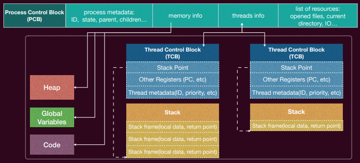
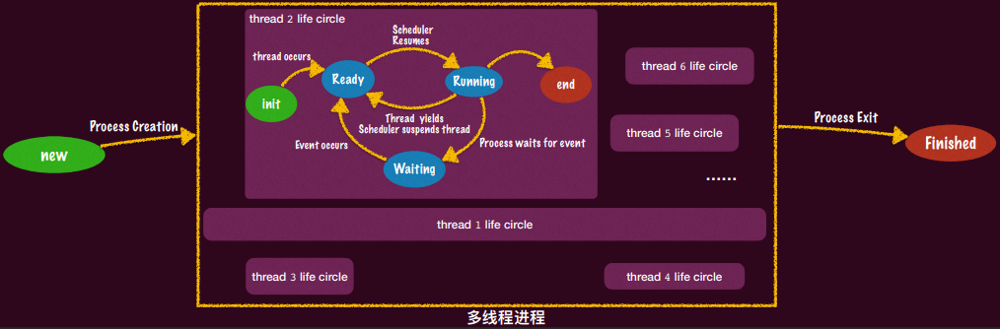

# 9. 进程管理

## 9.1 进程概述

1. **进程**的定义：拥有独立地址空间的运行实体， 可以包含一个或多个线程

2. **进程控制块（PCB）**

   

3. 进程树：pstree

4. 第一个进程 init

5. 进程的生命周期：

   

   - 终止之后的进程的“资源”会被操作系统回收，并**通知**其父进程其终止状态
     - PCB中父进程含有指针指向子进程PCB，如果进程终止之后连PCB也都被回收，那么该指针就会指向一个“已经”被释放的内存
     - 已终止但其PCB信息还没被回收的进程被称为“僵尸进程”
     - 父进程调用wait系统调用会得到子进程的退出通知（子进程退出前会阻塞父进程）和其退出状态，同时移除该子进程的PCB
     - 没有父进程的进程被称为“孤儿进程”

6. 进程最重要的三类系统调用：fork——进程的创建、execve——进程的改变、exit——进程的删除

## 9.2 fork

1. fork 的系统调用：通过做一份当前进程完整的复制（内存、寄存器现场）创建一个子进程
   - fork子进程返回 0，父进程返回子进程的 process ID

2. fork 的行为：
   - **复制状态机**：`fork` 会立即复制父进程的所有信息，包括每一个字节的内存和 PCB（进程控制块）里的信息。
   - **复制地址空间对象**：不仅地址空间的对象被复制，PCB 里的对象，如打开的文件描述符，也被一并复制。
     - **文件描述符**：父进程和子进程共享同样的文件描述符表，但在子进程和父进程中，这些文件描述符的偏移量等信息是独立的

## 9.3 execve

1. execve 的系统调用：在当前进程地址空间中加载并执行一个新的可执行文件的系统调用

   ```c
   #include <unistd.h>
   int execve(const char *pathname, char *const argv[], char *const envp[]);
   ```

   **pathname**: 要执行的可执行文件的路径
   **argv**: 程序执行所需的参数列表
   **envp**: 环境变量列表

2. execve 的行为：

   - **加载可执行文件**：将 `pathname` 指定的可执行文件加载到当前进程的地址空间中。这包括加载新的代码段和数据段
   - **重新初始化堆和栈**：新的可执行文件会重新初始化堆和栈
   - **修改 PCB（进程控制块）**：进程控制块中相关的内存映射也会随之改变
   - **设置 PC 寄存器**：将程序计数器（PC）寄存器设置为新可执行文件的入口点，该入口点最终会调用 `main` 函数
   - 在成功调用 `execve` 后，新的进程映像覆盖了调用进程映像，因此 `execve` 不会返回到调用进程。如果 `execve` 调用失败，则返回 -1，并设置 `errno` 以指示错误原因

3. **`execve` 不改变 PCB 中的文件描述符**

   当一个进程调用 `execve` 来执行新程序时，PCB 中已经打开的文件描述符将保持不变。这意味着，新加载的程序可以继续使用旧程序打开的文件描述符。这种行为对某些应用场景非常有用，例如：

   1. **终端共享**：在 shell 中启动的新进程可以继续使用相同的标准输入（stdin）、标准输出（stdout）和标准错误输出（stderr），从而在相同的终端中显示输出。
   2. **管道的实现**：利用 `fork` 和 `execve`，可以在进程之间创建管道，通过共享的文件描述符进行数据传递。

4. **管道的实现**：管道是特殊的文件，允许两个进程之间通过读写操作进行通信。在管道的实现中，会返回两个文件描述符，一个用于读，一个用于写。创建管道后，父进程和子进程会各自关闭不需要的文件描述符，从而实现单向通信。

5. **文件描述符泄漏**：如果父进程在执行 `execve` 之前打开了一个普通文件，而子进程通过 `execve` 执行新程序时，整个地址空间将被重置，这意味着文件描述符对应的变量将丢失，导致资源泄漏。在这种情况下，可以使用 `FD_CLOEXEC` 标志来防止文件描述符泄漏。

**写时复制 (Copy-On-Write, COW)**

1. **为什么需要 COW**

在传统的 `fork` 实现中，父进程的整个地址空间会被复制给子进程。这意味着所有内存，包括代码段、数据段和堆栈等，都要逐字节地复制。这种做法在许多情况下是低效的，因为父进程和子进程往往会立即调用 `execve`，加载一个新的程序，从而使得原来的内存复制变得没有意义。

为了提高效率，提出了写时复制技术。该技术允许父进程和子进程共享同一块物理内存，直到其中一个进程试图修改这块内存。

2. **COW 的实现**

   1. **共享物理内存**：当使用 `fork` 创建子进程时，父进程和子进程最初共享相同的物理内存页。内核会将这些共享的内存页标记为只读。

   2. **写时复制**：当父进程或子进程尝试写入共享的内存页时，会触发一个页面错误（page fault）。操作系统内核会捕捉到这个错误，并且为写入进程创建一个该内存页的副本。之后，写入操作在新创建的副本上完成，而原始内存页仍然保持只读状态，并继续被其他进程共享。

这种方式使得只有在真正需要写入时，才会进行内存复制，从而节省了不必要的内存复制操作。

假设有两个进程A和B，它们最初共享同一个物理内存页。当进程B尝试修改这页内存时，以下操作会发生：
1. 内核检测到进程B对只读内存页的写入操作，触发页面错误。
2. 内核为进程B分配一个新的物理内存页，并将原内存页的内容复制到新页中。
3. 内核更新进程B的页表，使其指向新的物理内存页。
4. 进程B完成写入操作，修改的是新内存页，而进程A仍然指向原来的只读内存页。

**COW 的优点**

1. **效率高**：避免了在 `fork` 时不必要的内存复制，节省了时间和内存资源。
2. **延迟复制**：只有在写入操作发生时才进行内存复制，最大化了资源利用率。
3. **简化进程创建**：结合 `fork` 和 `execve`，COW 提供了一种高效的进程创建和管理方式。

以下是一个简单的 `fork` 和 `COW` 机制的代码示例：
```c
#include <unistd.h>
#include <stdio.h>
#include <stdlib.h>

int main() {
    pid_t pid;
    int *x = (int *)malloc(sizeof(int));
    *x = 100;

    pid = fork();
    if (pid == -1) {
        perror("fork failed");
        exit(1);
    } else if (pid == 0) {
        // 子进程
        printf("Child process, x = %d\n", *x);
        *x = 200;
        printf("Child process after modification, x = %d\n", *x);
    } else {
        // 父进程
        printf("Parent process, x = %d\n", *x);
        wait(NULL);
        printf("Parent process after child modification, x = %d\n", *x);
    }
    free(x);
    return 0;
}
```
在这个示例中，父进程和子进程共享同一个动态分配的整数内存。由于使用了 COW 机制，只有在子进程尝试修改 `x` 时，才会触发内存页的复制。


## 9.4 exit

1. 进程退出机制：清理进程所占用的资源，包括代码区、堆、栈等。
   - **正常退出**：
     - **从 `main` 函数返回**：这是最常见的退出方式。`main` 函数的返回值表示进程的退出状态，0 表示成功退出，非 0 表示出现错误。
     - **调用标准库函数 `exit`**：这是 C 标准库提供的一个函数，用于正常退出进程，并执行一些清理工作。
     - **调用 `_exit` 函数**：这是一个更底层的函数，直接终止进程，不进行清理工作。
   - **异常退出**：
     - **调用 `abort`**：这是一个用于异常退出的函数，会生成一个 `SIGABRT` 信号终止进程，且不会执行清理工作。

2. **`exit()` 函数**：`void exit(int status)` 是 C 标准库函数，也是最常用的进程退出函数：

   - 调用 `atexit()` 注册的函数：`atexit()` 允许在程序终止时执行自定义的清理操作，最多可以注册 32 个函数，调用顺序与注册顺序相反。

   - 关闭所有打开的流（stdio）：这将导致写所有被缓冲的输出。

   - 移除所有的临时文件。

   - 最后调用 `_exit()` 函数终止进程。
   - 注意：`exit` 函数从不返回，因为进程在调用后就终止了。


3. **从 `main` 函数返回**：`main` 函数的返回值和调用 `exit()` 的传入参数 `int status` 是同样的语义：

   - 返回 0 表示函数符合预期终止。

   - 返回非 0 表示函数出现了错误终止。


4. **`_exit()` 函数**

   - 关闭属于该进程的所有文件描述符。

   - 将该进程的子进程移交给 `init` 进程接管。

   - 向该进程的父进程发送 `SIGCHLD` 信号，通知其已经终止。

   - 注意：`_exit()` 只会终止当前线程，但 libc 做了一层 wrapper，实际上调用 `exit_group()` 来关闭所有线程。直接调用 `syscall(SYS_exit, 0);` 可以绕过这个 wrapper。


5. **异常退出**`abort()` 系统调用会导致系统异常终止：

   - `atexit` 注册的函数不会调用。

   - IO 流不会关闭。

   - 其行为是产生一个 `SIGABRT` 信号发送给调用 `abort()` 的进程，然后该进程就会异常终止。

6. **信号（Signal）**

   - 通知进程发生某个事件。本质上是对中断（Interrupt）的模拟，使用户程序可以获知并处理某些事件
   - 提供了一种异步处理的手段，允许程序在收到信号后立即响应，而不是等待当前任务完成
   - 概念：
     - **中断（Interrupts/Exceptions）**：由硬件定义的中断和异常有一个中断向量表，用于处理器在发生中断时查找对应的中断处理程序。中断处理在内核态进行，并使用内核的中断栈
     - **信号（Signals）**：由内核定义的信号用于通知用户态进程某些事件。信号处理程序在用户态执行，并使用用户的信号栈

   - 信号的处理机制

     - **注册信号处理程序**：使用 `signal` 函数注册信号处理函数。信号处理函数在信号到达时被调用。

       ```c
       #include <signal.h>
       void handler(int signum) {
           // 信号处理逻辑
       }
       signal(SIGINT, handler);  // 注册处理 SIGINT 的信号处理函数
       ```

       - **SIG_IGN**：表示忽略该信号。
       - **SIG_DFL**：表示使用默认的信号处理程序。

     - **信号处理的流程**：

       - 当信号到达时，当前的执行被中断，转而执行信号处理函数。
       - 处理完信号后，返回继续执行被中断的程序。

   - **信号的应用**

     - **异步操作**：信号机制可以用于处理异步事件，例如子进程的终止（`SIGCHLD`），I/O 操作的完成（`SIGIO`）。

       - 例如，在信号处理函数中处理子进程的终止，而不是在主函数中阻塞等待：

         ```c
         void handler(int signum) {
             int status;
             wait(&status);  // 等待子进程终止
         }
         signal(SIGCHLD, handler);  // 注册处理 SIGCHLD 的信号处理函数
         ```

     - **进程间通信**：信号是一种进程间通信（IPC）的机制，除了信号外，还有消息传递、共享内存、管道等方式。

   - **信号处理的细节**

     - **默认行为**：如果没有设置自定义的信号处理函数，信号的默认行为包括终止进程、忽略信号、停止进程和继续进程等

     - **信号屏蔽**：可以使用 `sigprocmask` 函数来阻塞和解除阻塞某些信号，从而控制信号的处理时机
