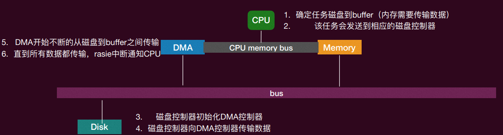
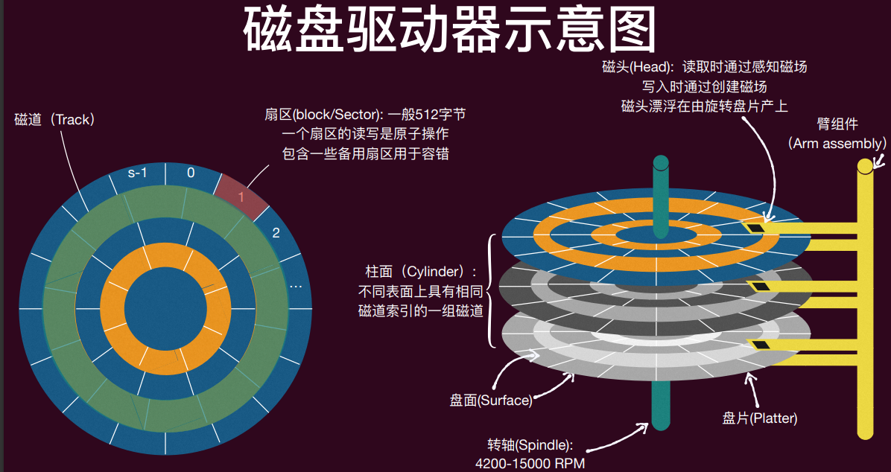

# 1. 并发

1、**阿姆达尔定律（Amdahl’s Law）**：定义并行加速比 $\text{speedup} = \frac{1-\text{thread excution time}}{n-\text{thread execution time}}$

（1）让程序中可以被并行化的指令部分的比例为 $p$，而程序不可并行化的部分为 $1-p$（注：不是所有逻辑都是可以并行化，如果存在前后依赖的话就难以并行化）

（2）在有 n 个并行执行流的情况下，程序的加速比（相比于单个执行流）为 $\text{speedup} = \frac{1}{1-p+\frac{p}{n}}$
	即使有无限多的CPU，受限于可以并行化的部分比例，也不可能无限加速

2、并发的基本单位是**线程**。线程：共享内存的执行流
（1）拥有独立的“上下文”和栈帧列表，共享全局变量、堆空间
（2）线程就是代表着程序的“执行”单位，操作系统可以随时运行、暂停、和恢复执行它
（3）有了线程，我们可以“线性的”写多个执行流，然后他们可以“并发”的执行，这个抽象使得我们更容易掌控并发

3、**原子性**：一个原子性的操作即是一个在其“更高”的层面上无法感知到它的实现是由多个部分组成的，一般来说，其具有两个属性：

- All or nothing： 一个原子性操作要么会按照预想那样一次全部执行完毕，要么一点也不做，不会给外界暴露中间态
- Isolation：一个原子性的操作共享变量时中途不会被其他操作干扰

4、**顺序性**：程序语句按照既定的顺序执行

- 不影响语义的前提下，指令是否按顺序执行并不重要，因为编译器回通过reorder instructions来优化程序

- 这些优化在单线程下没问题，但多线程下会出现很多问题

5、**顺序一致性模型（Sequential Consistency）**

- 不同核心看到的访存操作顺序完全一致，这个顺序称为**全局顺序**

- 在这个全局顺序中，每个核心自己的读写操作可见顺序必须与其程序顺序保持一致

## 1.1 互斥

1、**临界区**（critical section）：访问共享资源的一段代码，资源通常是一个变量或数据结构

2、**竞态条件**（race condition）：出现在多个执行线程大致同时进入临界区时，它们都试图更新共享的数据结构，导致非预期的结果
当程序含有一个或多个竞态条件，程序的输出会因运行而异，具体取决于哪些线程在何时运行，因此结果是不确定的（non-deterministic）

3、安全性（Safety）和活性（Liveness）

- **安全性**要求执行中的任何有限步骤内都保持这个性质

- **活性**要求只要在最终能满足要求即可，一个隐含的要求是执行中不能发生“不可挽回”的步骤

4、临界区的解决方案需满足的条件

- **互斥**（Mutual Exclusion）：临界区内最多只能有一个线程
- **行进**（Progress）：如果当前临界区内没有线程，并且有线程想要进入临界区，那么最终某个想要进入临界区的线程会进入该临界区（liveness）
- **有界等待**（bounded waiting）：如果某个线程想要进入临界区，那么其等待的期限有限，不可一直排队等待（Fairness / No starvation）
  - 如果这个上限没有被指定，那么这就是一个Liveness property，其最终会进入
  - 如果这个上限被指定具体数字，那么这就是一个Safety property
- **性能**（performance）：进入和退出该临界区的两个操作应该相对于在该临界区内做的计算而言尽可能的小
- **经验法则**：设计并发算法时优先考虑安全性

### 1.1.1 锁（Locks）

1、**锁**：变量，保存了锁在某一时刻的状态

- 可用的（available / unlocked / free）：没有线程持有锁
- 被占用的（acquired / locked / held）：一个线程持有锁，处于临界区

2、锁提供两个配对操作：

- `lock()` / `acquire()`：调用这两个函数尝试获取锁，如果锁可用则线程获得并进入临界区，否则不会返回（线程卡住）
- `unlock()` / `release()`：调用这两个函数锁变得可用，之前因获得锁操作失败卡在那的线程中的一个会进入临界区

#### 锁的实现

##### 关中断

- 单处理器系统中通过禁用中断来实现对临界区的独占访问。具体来说，当一个线程要进入临界区时，它会执行一条禁用中断的指令，这样就不会有其他任何中断（如I/O中断）打断当前线程的执行。这保证了线程在执行临界区代码时，不会被打断，从而实现了互斥。unlock()就是再次打开中断

- 存在的问题：

  - 如果临界区代码进入死循环，整个系统也会卡死

  - 中断关闭时间过长会导致很多重要的外界响应丢失（错过磁盘I/O的完成事件）

  - 关中断是特权指令，用户态的应用是无法执行的，只有操作系统有这个权限

  - 在多处理器系统中无效，因为每个处理器有独立的寄存器组，中断是每个处理器的内部状态

##### 通过软件（Lock标志）

- 使用一个标志表达此时锁的状态（如0和1）
- 这种方法有两个关键的假设：

  - 读取并测试变量是原子的：即flag == 1的操作是原子的
  - 设置变量是原子的：即flag = 1和flag = 0的操作是原子的
- 存在的问题：在单处理器系统中，这两个假设是合理的，但是在现代多处理器系统中，这些假设并不成立。这种方法会出现竞态条件的问题，具体来说，两个线程有可能同时发现flag为0，然后同时设置flag为1，从而同时进入临界区，这违背了互斥的要求。

##### 互斥的 test

- 每个线程使用不同的标志来判定是否进入临界区，从而避免多个线程同时进入临界区

  ```c
  // for thread 1
  void lock() { 
      while (flag == 0); // 自旋等待，直到flag为1
  }
  
  void unlock() { 
      flag = 0;  // 设置flag为0，表示释放锁
  }
  
  // for thread 2
  void lock() { 
      while (flag == 1); // 自旋等待，直到flag为0
  }
  
  void unlock() { 
      flag = 1;  // 设置flag为1，表示释放锁
  }
  ```

- 存在的问题：这种方法强制线程严格轮流进入临界区。例如，如果线程2始终不进入临界区，那么线程1最多只能进入一次临界区。这违背了 liveness 的性质，无法“行进”

##### Peterson 算法

- 主要思想：对“互斥test”的改进，除了测试 flag 以外，看看是否有别的线程进入临界区

- intents[]：一个数组，用于记录是否有其他线程要进入临界区。
  flag：全局变量，进行判定，当两个线程都有进入意图之后解决冲突

- ```c
  int intents[2] = {0, 0}; // 进入意图
  int flag = 0;  // 当前谁可以获得锁 (线程0或1)
  
  int self = i; //当前的线程ID，0，1中的一个
  
  void lock(int self) {  
      intents[self] = 1;  // 标记自己想要进入临界区、
      flag = self; //轮转到下一位
      while (intents[(self + 1) % 2] == 1 && (flag == self)); // 如果另一个线程也想进来，并且当前轮到自己，则等待
  }
  
  void unlock(int self) { 
      intents[self] = 0; // 标记自己不再想要进入临界区
  }
  ```

- 正确性分析：Peterson算法满足互斥、行进和有界等待三个条件。

  1. **互斥性（Mutual Exclusion）：**
     - 在任何时刻，最多只有一个线程可以进入临界区。因为只有一个线程能够使其条件`while (intents[(self + 1) % 2] == 1 && flag == self)`为false，从而跳出循环进入临界区。

  2. **进展性（Progress）：**
     - 如果没有线程在临界区，并且有线程想要进入临界区，则最终某个线程会进入临界区。

  3. **有界等待（Bounded Waiting）：**
     - 由于轮转机制，每个线程都有机会进入临界区，不会出现某个线程无限等待的情况。

- 优缺点

  - Peterson算法简单且有效，能够在软件层面实现互斥。

  - 只适用于两个线程的情况。在多线程环境下，算法需要扩展，复杂度会增加。
  - 在现代多处理器系统中，由于缓存一致性问题和编译器优化，Peterson算法可能无法保证正确性。

  在现代计算机体系结构下，由于多处理器以及乱序指令流的存在，需要硬件的支持，例如内存屏障（Memory Barrier），以确保内存操作的顺序性。典型的编译器和硬件平台提供了相应的指令来实现这一点。


### 1.1.2 硬件支持的锁

1. 在现代计算机系统中，由于多处理器环境的存在，软件实现的锁（如Peterson算法）在保证互斥性方面存在局限性。硬件支持的锁通过提供原子操作，可以更高效地实现互斥。

2. 原子的 Test-And-Set（TAS）指令

##### 自旋锁（Spin Lock）

```c
int flag = 0; // 锁的状态变量

void lock() {
    int expected;
    do {
        expected = 0;
        asm volatile (
            "lock cmpxchg %2, %1" // 使用原子的Test-And-Set指令
            : "+a" (expected)
            : "m" (flag),
              "r" (1)
            : "memory", "cc"
        );
    } while (expected != 0); // 如果锁已被占用，则继续自旋
}

void unlock() {
    asm volatile (
        "mov %1, %0" // 释放锁
        : "=m" (flag)
        : "r" (0)
        : "memory"
    );
}
```

- 尝试获取锁：

  - 线程通过 `cmpxchg` 指令尝试获取锁，如果 flag 为0，则设置为1并获得锁。

  - ```assembly
    "lock cmpxchg %2, %1"
    : "+a" (expected)
    : "m" (flag),
      "r" (1)
    : "memory", "cc"
    ```

    - `"lock cmpxchg %2, %1"`：`cmpxchg`是x86指令，用于比较并交换。`lock`前缀确保该指令在多处理器环境中是原子的。
      - `%2`：表示要比较的新值`1`。
      - `%1`：表示目标操作数`flag`。
    - `"+a" (expected)`：`+a`表示使用`eax`寄存器来存储`expected`的值，并且这个操作数是输入输出操作数（既是输入也是输出）。
    - `"m" (flag)`：`flag`是内存操作数。
    - `"r" (1)`：使用寄存器存储值`1`。
    - `: "memory", "cc"`：表示该指令会修改内存和条件码寄存器。

  - 如果 flag 不为0，则继续自旋等待。

- 释放锁：

  ```assembly
  "mov %1, %0"
  : "=m" (flag)
  : "r" (0)
  : "memory"
  ```

  - `"mov %1, %0"`：`mov`是x86指令，用于将值`0`移动到`flag`。
    - `%1`：表示源操作数`0`。
    - `%0`：表示目标操作数`flag`。
  - `"=m" (flag)`：`flag`是输出操作数，表示内存位置。
  - `"r" (0)`：使用寄存器存储值`0`。
  - `: "memory"`：表示该指令会修改内存。

- 优缺点：

  - 自旋锁在锁竞争激烈时可能导致大量的CPU资源浪费。

  - 需要硬件支持原子操作。

## 1.2 互斥：进阶

#### 排队自旋锁（Ticket Lock）

- 当一个线程在自旋等待（忙等待）时，它不一定能够最终进入临界区。因为如果一直有其他线程要进入临界区，并且这些其他线程一直被优先调度进入临界区，那这个线程就可能会一直等在那里（违背了有界等待）

- 解决方法：**排队自旋锁（Ticket Lock）**

- 核心思想：每个尝试进入临界区的线程都会拿一个“号”，然后按照顺序等待自己的“号”被叫到，这样可以确保所有线程按顺序进入临界区，避免长时间的忙等待。

- 实现代码：

  ```c
  typedef struct lock_ticket {
      int ticket; // 当前发放的最大票号
      int turn;   // 当前应该进入的票号
  } lock_t;
  
  lock_t flag;
  
  void lock_init() {
      flag.ticket = 0;
      flag.turn = 0;
  }
  
  // 加锁函数通过原子的“fetch_and_add”操作实现，该操作可以保证多个线程同时访问时的正确性。
  void lock() {
      int myturn = 1; 
      // atomic fetch-and-add
      // equal to myturn = __sync_fetch_and_add(&flag.ticket, 1);
      // 将1加到flag.ticket，并返回flag.ticket的“旧”值给myturn
      asm volatile (
          "lock xaddl %0, %1" 
          : "+r" (myturn), "+m" (flag.ticket) 
          : 
          : "memory", "cc"
      ); 
      while (flag.turn != myturn) 
          ; // spin
  }
  
  // 解锁函数通过原子的“fetch_and_add”操作更新flag.turn，允许下一个等待的线程进入临界区。
  void unlock() {
      int value = 1; 
      asm volatile (
          "lock xaddl %0, %1" 
          : "+r" (value),
          : "+m" (flag.turn) 
          : 
          : "memory", "cc"
      );
  }
  ```

- 适用于临界区较短的情况，如果临界区较长，仍然会导致性能问题

#### 更细粒度的锁

- 并不是所有线程都“彼此”需要互斥，我们应该给需要彼此互斥的线程集他们独有的“锁”，更细粒度的锁可以提高并发性能

- 不是用一把大锁来保护所有共享资源，对参数所指向的锁进行加锁和解锁操作

- 代码实现

  ```c
  typedef struct {
      int ticket; // 当前发放的最大票号
      int turn;   // 当前应该进入的票号
  } lock_t;
  
  void lock_init(lock_t *flag) {
      flag->ticket = 0;
      flag->turn = 0;
  }
  
  void lock(lock_t *flag) {
      int myturn = 1;
      // atomic fetch-and-add
      // equal to myturn = __sync_fetch_and_add(&flag->ticket, 1);
      // 将1加到flag.ticket，并返回flag.ticket的“旧”值给myturn
      asm volatile (
          "lock xaddl %0, %1"
          : "+r" (myturn), "+m" (flag->ticket)
          :
          : "memory", "cc"
      );
      while (flag->turn != myturn)
          ; // spin
  }
  
  void unlock(lock_t *flag) {
      int value = 1;
      asm volatile (
          "lock xaddl %0, %1"
          : "+r" (value),
          : "+m" (flag->turn)
          :
          : "memory", "cc"
      );
  }
  ```

### 1.2.1 在内核中实现自旋锁的问题

1. 内核中的自旋锁

   - 内核中有很多需要访问共享资源的情况，因此使用互斥锁的情况非常普遍
   - 内核可能会在各个部分用到自旋锁，除了系统调用程序外，还有中断处理程序中也可能用到

2. 问题：

   - 一个线程通过系统调用访问一个共享变量，并且内核在访问这个共享变量时加了锁。
   - 在这个过程中，一个中断发生了，CPU强制转向中断处理程序。
   - 中断处理程序也需要访问同一个共享变量，因此尝试获取锁，但是发现锁已经被持有了，于是进入自旋等待。
   - 中断处理程序的优先级通常很高，高于系统调用。因此，中断处理程序会一直等待一个不可能发生的事情（因为锁已经被持有，并且没有机会释放）。

3. 解决方法

   1. 错误的尝试：在自旋锁之前关中断，释放锁的时候开中断。如果在自旋之前就已经关中断了，解锁就打开中断就会破快在这次自旋之前的中断状态

   2. 需要保存自旋之前的中断状态，然后在解锁时恢复这个状态

      - 代码实现：

        ```c
        typedef struct {
            const char *name;
            int status;
            struct cpu *cpu;
        } spinlock_t;
        
        void spin_lock(spinlock_t *lk) {
            // Disable interrupts to avoid deadlock.
            push_off();
            // This is a deadlock.
            if (holding(lk)) {
                panic("acquire %s", lk->name);
            }
            // This our main body of spin lock.
            int got;
            do {
                got = atomic_xchg(&lk->status, LOCKED);
            } while (got != UNLOCKED);
            lk->cpu = mycpu;
        }
        
        void spin_unlock(spinlock_t *lk) {
            if (!holding(lk)) {
                panic("release %s", lk->name);
            }
            lk->cpu = NULL;
            atomic_xchg(&lk->status, UNLOCKED);
            pop_off();
        }
        
        void push_off(void) {
            // Record previous state of interrupt
            int old = ienabled();
        
            struct cpu *c = mycpu;
        
            // Disable the interrupt
            iset(false);
            
            if (c->noff == 0) {
                c->intena = old;
            }
            c->noff += 1;
        }
        
        void pop_off(void) {
            struct cpu *c = mycpu;
            // Never enable interrupt when holding a lock.
            if (ienabled()) {
                panic("pop_off - interruptible");
            }
            if (c->noff < 1) {
                panic("pop_off");
            }
            c->noff -= 1;
            if (c->noff == 0 && c->intena) {
                iset(true);
            }
        }
        ```

        - push_off函数：
          - 记录并关闭当前中断状态。
          - 记录关闭中断的次数，确保可以正确恢复。
        - pop_off函数：
          - 确保中断在锁释放前不会被重新启用。
          - 递减关闭中断的次数，并在计数为零时恢复之前的中断状态。

### 1.2.2 应用程序里的使用互斥锁问题

自旋锁本身存在的问题：性能问题：除了进入临界区的线程，其他处理器上的线程都在空转

- 如果临界区执行时间过长，其他线程浪费的CPU越多
- 如果发生中断将临界区的线程切出去了，计算资源浪费更加严重

#### 解决方案1：直接 yield

用 sched_yield() 让线程主动让出cpu，让其他线程获得CPU使用

```c
void yield_lock(spinlock_t *lk) {
    while (xchg(&lk->locked, 1)) {
        // 使用系统调用sched_yield()让出CPU
        syscall(SYS_yield); // 在抽象机器上等同于yield()
    }
}

void yield_unlock(spinlock_t *lk) {
    xchg(&lk->locked, 0);
}
```

- 问题：
  - yield操作只是暂时让出CPU，但线程仍然处于“就绪”状态，随时可以被再次调度。
  - 在锁竞争激烈的情况下，线程可能会反复被调度并让出CPU，导致大量不必要的上下文切换（context switches）

#### 解决方案2：互斥锁（mutex）和条件变量（condition variable）

用户使用和释放锁应该和OS调度程序配合，使用更高级的同步机制，如互斥锁（mutex）和条件变量（condition variable）。这些机制允许线程在无法获取锁时进入阻塞状态，而不是继续处于就绪状态，从而避免频繁的上下文切换。

- `mutex_lock(&lk)`：试图获得 lk，如果失败，利用系统调用阻塞该线程

- `mutex_unlock(&lk)`：释放锁，如果等待该锁的队列里有线程就利用系统调用选择一个唤醒

- 需要对一个锁维持一个与其相关的队列

- 代码一：

  ```c
  void mutex_lock(spinlock_t* lk) { 
      int got; 
      do { 
          got = atomic_xchg(lk->status, LOCKED); 
          if (got != UNLOCKED) { 
              // 将当前线程加入等待队列，并标记为阻塞，释放CPU 
              wait(lk->wait_list); 
          } else { 
              break; 
          } 
      } while (1); 
  }
  
  void mutex_unlock(spinlock_t* lk) { 
      atomic_xchg(lk->status, UNLOCKED); 
      if (!is_empty(lk->wait_list)) { 
          // 从等待队列中取出一个线程，标记为就绪 
          wakeup(lk->wait_list); 
      } 
  }
  ```

  在上述实现中，存在一个潜在的问题：唤醒操作可能丢失。例如，考虑如下的执行顺序：

  1. 线程1尝试获取锁，发现锁被持有，于是进入等待队列。
  2. 线程2释放锁，发现等待队列不为空，于是唤醒等待队列中的一个线程（此时线程1被唤醒）。
  3. 在线程1尚未获得CPU执行权之前，另一个线程3尝试获取锁并成功。
  4. 线程3再次释放锁，检查等待队列发现为空（因为线程1已经被唤醒但尚未执行），于是没有进行任何操作。

  这种情况下，线程1可能会错过唤醒信号，因为在它实际执行之前，等待队列已经被检查为空。这种情况会导致线程1永远处于阻塞状态，形成死锁。

- 对上述问题的解决方法：Linux提供了一种高效的用户态互斥锁机制——futex（Fast Userspace muTEX），可以解决上述问题。

  ```c
  #define UNLOCK 0
  #define ONE_HOLD 1
  #define WAITERS 2
  
  void mutex_lock(spinlock_t* lk) { 
      //return old value of state,
  	//and if lk == UNLOCK, set state = ONE_HOLD — uncontested!
      int c = cmpxchg(lk, UNLOCKED, ONE_HOLD); 
  
      if (c != UNLOCKED) { 
          //previous state is either ONE_HOLD or WAITERS
          do {  
              if (c == WAITERS || cmpxchg(lk, ONE_HOLD, WAITERS) != 0)  
                  // if previous state is either ONE_HOLD
  				// now it has one more waiter!
  				// AND it is possible the lock is released now!
                  futex_wait(lk, WAITERS); 
          } 
          // repeating check whether the lock is released!
          while ((c = cmpxchg(lk, UNLOCKED, WAITERS)) != 0);  
      }
      else {
          return; //the fast path lock!
  	}
  }
  
  void mutex_unlock(spinlock_t* lk){ 
      //state can only be ONE_HOLD or WAITERS
      if (atomic_dec(lk) != ONE_HOLD) { 
          //has more than one waiters
          lk = UNLOCKED; 
          futex_wake(lk); 
      } else {
          //No Waiters!
          return; //the fast path unlock!
  	}
  }
  ```

  - 正确性：
    - **互斥性**：
      - `mutex_lock`函数只会在成功获取锁后返回，确保只有一个线程可以进入临界区。
      - 获取锁的线程会将锁状态原子性地设置为`ONE_HOLD`，其他线程将锁状态设置为`WAITERS`，确保互斥访问。
    - **等待和唤醒**：
      - `futex_wait`确保了线程在等待时不会错过唤醒信号。
      - `futex_wake`确保至少有一个等待的线程能够被唤醒。

#### Posix 的实现方案

通过pthread库提供的函数来实现，这些函数包括初始化、加锁、解锁和销毁互斥锁。

```c
#include <pthread.h>

pthread_mutex_t mutex;
int pthread_mutex_init(pthread_mutex_t *restrict mutex, const pthread_mutexattr_t *restrict attr); // 初始化互斥锁
int pthread_mutex_lock(pthread_mutex_t *mutex); // 尝试获取互斥锁。如果互斥锁已经被其他线程持有，该函数会阻塞直到互斥锁可用。
int pthread_mutex_unlock(pthread_mutex_t *mutex); // 释放互斥锁。如果有其他线程在等待互斥锁，该函数会唤醒其中一个线程。
int pthread_mutex_destroy(pthread_mutex_t *mutex); // 毁互斥锁，释放其占用的资源。在互斥锁不再使用时调用。
```

### 1.2.3 并发数据结构

线程安全的数据结构（并发数据结构）：一个数据结构可以被多个线程并发的访问，在访问和更新该数据结构时上锁

```c
#include <pthread.h>

typedef struct __counter_t {
    int value;
    pthread_mutex_t lock;
} counter_t;

void init(counter_t *c) {
    c->value = 0;
    pthread_mutex_init(&c->lock, NULL);
}

void increment(counter_t *c) {
    pthread_mutex_lock(&c->lock);
    c->value++;
    pthread_mutex_unlock(&c->lock);
}

void decrement(counter_t *c) {
    pthread_mutex_lock(&c->lock);
    c->value--;
    pthread_mutex_unlock(&c->lock);
}

int get(counter_t *c) {
    pthread_mutex_lock(&c->lock);
    int rc = c->value;
    pthread_mutex_unlock(&c->lock);
    return rc;
}
```

**层次化锁**：分层锁的思想是使用多个锁来保护不同层次的资源，从而提高并发性。例如，可以使用局部锁来保护每个CPU的局部数据，使用全局锁来保护共享数据。

**层级化的并发解决方案**

- 硬件提供了基本的原子指令
- 操作系统提供的并发原语

- 库函数提供的并发控制API
- 用户使用这些原语构建正确和高效的并发程序


## 1.3 同步：基础

1、并发的困难：语句执行顺序不确定；两个线程同时进入临界区

2、同步：线程受控制，控制并发，使两个或两个以上随时间变化的量在变化过程中保持一定的相对关系

3、简单的互斥（使用锁）不能控制线程的执行顺序

### 1.3.1 生产者-消费者问题

1. **有界缓冲区**：一个或多个线程共享一个数据缓冲区问题，该缓冲区容量有上限

2. 线程分为：

   - **生产者**：生产数据。缓冲区有空位：放入数据
   - **消费者**：消费数据。缓冲区有数据：取走数据

3. 问题简化：生产=打印左括号；消费=打印右括号。缓冲区：括号的嵌套深度depth

4. **条件变量**：用于标记某个用于同步条件的变量

   - `cond_wait(cond_t *cv, mutex_t *lk)`：

     - 调用之前默认假设已经持有锁 `lk`。
     - 调用之后原子的阻塞线程并释放锁。
     - 被唤醒时重新获取锁 `lk`。

   - `cond_signal(cond_t *cv)`：

     - 唤醒一个等待在条件变量 `cv` 上的阻塞线程。
     - 如果没有线程阻塞在这个条件变量上，则什么也不做。

   - POSIX 规定了相应的 API

     - ```c
       #include <pthread.h> 
       
       pthread_cond_t cv; 
       int pthread_cond_init(pthread_cond_t *cv, NULL); 
       int pthread_cond_destroy(pthread_cond_t *cv); 
       int pthread_cond_wait(pthread_cond_t *cv, pthread_mutex_t *mutex); 
       int pthread_cond_signal(pthread_cond_t *cv);
       ```

   - 代码实现：

     ```c
     typedef struct conditional_variable { 
         unsigned value; 
     } cond_t;
     
     void cond_wait(cond_t *cv, mutex_t *lk) 
     { 
         int val = atomic_load(&cv->value); 
         mutex_unlock(lk); 
         futex_wait(&cv->value, val); 
         mutex_lock(lk); 
     }
     
     void cond_signal(cond_t *cv) 
     { 
         atomic_fetch_add(&cv->value, 1); 
         futex_wake(&cv->value); 
     }
     
     void cond_wait(cond_t *cv, mutex_t *lk) 
     { 
         int val = atomic_load(&cv->value); 
         mutex_unlock(lk); 
         futex_wait(&cv->value, val); 
         mutex_lock(lk); 
     }
     
     void cond_signal(cond_t *cv) 
     { 
         atomic_fetch_add(&cv->value, 1); 
         futex_wake(&cv->value); 
     }
     ```

5. **条件变量解决生产者-消费者问题**

   - 代码实现

     ```c
     cond_t cv_p = COND_INIT();   
     cond_t cv_c = COND_INIT();  
     mutex_t lk = MUTEX_INIT(); 
     
     void produce() { 
         while(1) { 
             mutex_lock(&lk); 
             if (!(depth < n)) { 
                 cond_wait(&cv_p, &lk); 
             } 
             printf("("); 
             depth++;  
             cond_signal(&cv_c); 
             mutex_unlock(&lk); 
         } 
     }
     
     void consume() { 
         while(1) { 
             mutex_lock(&lk); 
             if (!(depth > 0)) { 
                 cond_wait(&cv_c, &lk); 
             } 
             printf(")"); 
             depth--;  
             cond_signal(&cv_p); 
             mutex_unlock(&lk); 
         } 
     }
     ```

     - 生产者 `produce`：如果缓冲区满了，则等待 `cv_p`，否则生产数据并发信号唤醒消费者 `cv_c`。

     - 消费者 `consume`：如果缓冲区为空，则等待 `cv_c`，否则消费数据并发信号唤醒生产者 `cv_p`。

   - **问题**：考虑以下情况：一个生产者，两个消费者。当缓冲区为空时，两个消费者等待。当生产者生产数据并唤醒一个消费者时，另一个消费者可能会抢先进入临界区并消费数据。结果是唤醒的消费者在进入临界区时发现没有数据可消费，出现错误

6. **Hansen/Mesa语义**：由于调用Signal通知某个线程，和那个线程wait被唤醒不是原子的

   - 解决办法：唤醒后重新尝试判断条件是否满足，使用 while 循环来确保条件变量唤醒后重新检查条件

   - 代码实现

     ```c
     void produce() { 
         while(1) { 
             mutex_lock(&lk); 
             while (!(depth < n)) { 
                 cond_wait(&cv_p, &lk); 
             } 
             printf("("); 
             depth++;  
             cond_signal(&cv_c); 
             mutex_unlock(&lk); 
         } 
     }
     
     void consume() { 
         while(1) { 
             mutex_lock(&lk); 
             while (!(depth > 0)) { 
                 cond_wait(&cv_c, &lk); 
             } 
             printf(")"); 
             depth--;  
             cond_signal(&cv_p); 
             mutex_unlock(&lk); 
         } 
     }
     ```

7. **Hoare语义**：

   - `cond_signal` 和 `cond_wait` 之间是原子的。
   - 信号程序将互斥锁转移到被唤醒的程序，并阻塞自己，保证被唤醒线程所等待的条件是保持的。

8. **对比**：

   - Hansen/Mesa语义实现简单，不保证安全性。
   - Hoare语义实现复杂，保证安全性和条件的保持

9. 使用一个条件变量：

   ```c
   void produce() { 
       while(1) { 
           mutex_lock(&lk); 
           while (!(depth < n)) { 
               cond_wait(&cv, &lk); 
           } 
           printf("("); 
           depth++;  
           cond_signal(&cv); 
           mutex_unlock(&lk); 
       } 
   }
   
   void consume() { 
       while(1) { 
           mutex_lock(&lk); 
           while (!(depth > 0)) { 
               cond_wait(&cv, &lk); 
           } 
           printf(")"); 
           depth--;  
           cond_signal(&cv); 
           mutex_unlock(&lk); 
       } 
   }
   ```

   存在的问题：考虑以下情形：

   1. 有三个线程：消费者 $C_1$、消费者 $C_2$ 和生产者 $P_1$。
   2. $C_1$ 和 $C_2$ 首先依次进入临界区，发现数据为空，都会阻塞等待。
   3. 然后 $P_1$ 进入临界区，生产一个 item 后唤醒一个线程，例如 $C_1$。
   4. 在 $C_1$ 被唤醒之前，$P_1$ 再次进入临界区，发现没有空间（假设缓冲区为1），于是阻塞自己。
   5. 此时 $C_1$ 醒来并进入临界区，消费这个数据之后，试图唤醒其他线程，但唤醒谁没有保障（因为都是同一个条件变量）。
   6. 如果唤醒的是 $C_2$，那么 $C_2$ 进入临界区，发现数据为空，阻塞等待。然后 $P_1$ 尝试进入临界区，发现没有空间，也阻塞等待。这样所有线程都处于阻塞状态，没有人可以唤醒其他线程，导致死锁。

10. 解决方案：使用 `cond_broadcast`，一次唤醒所有线程，那些需要被正确唤醒的自然会醒来做相应的事情，而那些不该唤醒的线程会再度进入等待状态：

    ```c
    void produce() { 
        while(1) { 
            mutex_lock(&lk); 
            while (!(depth < n)) { 
                cond_wait(&cv, &lk); 
            } 
            printf("("); 
            depth++;  
            cond_broadcast(&cv); 
            mutex_unlock(&lk); 
        } 
    }
    
    void consume() { 
        while(1) { 
            mutex_lock(&lk); 
            while (!(depth > 0)) { 
                cond_wait(&cv, &lk); 
            } 
            printf(")"); 
            depth--;  
            cond_broadcast(&cv); 
            mutex_unlock(&lk); 
        } 
    }
    ```

11. **条件变量的使用经验法则**

    1. 除了条件变量外，还需要有共享的状态用于判定是否可以“生产”或“消费”。
    2. 使用互斥锁来保护共享状态以及条件变量的操作。
    3. 在执行 `wait/signal/broadcast` 时需要持有互斥锁。
    4. 每次从 `wait` 中唤醒后，要重新进行条件检查（使用 `while` 循环）。
    5. 针对不同的条件使用不同的条件变量，除非使用 `broadcast`。

### 1.3.2 条件变量的应用

1. **计算中的依赖关系**
   1. **计算依赖图**：
      - `wait` 和 `signal` 是非常强大的并发原语。
      - 可以利用 `wait` 和 `signal` 将程序算法并行化。
      - 通过定义计算图 `G = (V, E)`，其中 `V` 是计算事件集，`(u, v) ∈ E` 表示计算事件 `u` 依赖于计算事件 `v`。
      - `u` 和 `v` 只能串行执行，而没有依赖关系的节点可以并行计算。

   2. **并行化方案**：
      - 对于每个节点（线程），设置同步条件：只有当所有前置计算完成后，节点才能进行计算。
      - 完成计算后，对依赖该节点的节点进行 `signal` 或 `broadcast`。


2. **动态规划算法**

   1. **分析问题结构**：
      - 例如 [rod-cutting]：一个切割长度 + 剩余长度的最优解。
      - 递归定义问题的最优解：`rn = max(1 ≤ i ≤ n)(pi + rn−i)`。
      - 计算最优解值，通常使用自底向上的方法。

   2. **拓扑序与并行化**：

      - 在单线程下，计算子问题图的拓扑序，然后依次执行。

      - 在多线程情况下，可以并行执行所有这些线程，只需利用条件变量按照依赖图控制线程顺序。

3. **Edit Distance问题**

   1. **问题定义**：

      - 给定两个字符串，计算它们之间的编辑距离（有多相似）（最少的转化步骤，包括删除、插入和替换）。

      - 递归定义编辑距离：

        ```c
        dist(i, j) = i if j = 0
                     j if i = 0
                     min(dist(i, j − 1) + 1,
                         dist(i − 1, j) + 1,
                         dist(i − 1, j − 1) + I[A[i] = B[j]]) otherwise
        ```

   2. **并行化解决方案**：

      - 每条斜边的节点可以在上一轮斜边对应的节点完成后继续执行。

      - 考虑性能成本，线程太多会增加调度成本，线程太少并发度低。

4. **并发算法设计框架**

   - **通用框架**：

     - 生产者线程：负责调度，根据当前完成的计算节点和依赖关系，调度可以运行的线程，放入 ready 列表准备运行（线程池）。

     - 消费者线程：执行计算，结束后通知调度线程，告知条件可能发生变化，可以重新计算下一批可运行的线程。

   - **代码实现**：

     ```c
     void T_worker() { 
         while (1) { 
             consume().run(); 
         } 
     } 
     void T_scheduler() { 
         while (!jobs.empty()) { 
             for (auto j : jobs.find_ready()) { 
                 produce(j); 
             } 
         } 
     }
     ```

### 1.3.3 信号量

1. **信号量的基本概念**：信号量表示一个整数值变量，只能通过两个原子操作来改变这个变量的值：

   - `P(sem_t *sem)`：如果 `sem` 的值不是正数，则阻塞自己，否则将 `sem` 的值减1后继续运行。
   - `V(sem_t *sem)`：将信号量 `sem` 的值加1，如果有一个或多个线程阻塞在这个信号量上，选择一个线程唤醒。

2. POSIX 也定义了信号量的使用，提供以下API：

   ```c
   #include <semaphore.h> 
   sem_t sem; 
   int sem_init(sem_t *sem, int pshared, unsigned int value);  
   int sem_destroy(sem_t *sem); 
   int sem_wait(sem_t *sem); 
   int sem_post(sem_t *sem);
   ```

3. 信号量的一种实现：利用互斥锁和条件变量来实现信号量

   ```c
   typedef struct _sem_t { 
       int value; 
       pthread_cond_t cond; 
       pthread_mutex_t lock; 
   } sem_t; 
   
   void sem_init(sem_t *s, int value) { 
       s->value = value; 
       pthread_cond_init(&s->cond, NULL); 
       pthread_mutex_init(&s->lock, NULL); 
   }
   
   void sem_wait(sem_t *s) { 
       pthread_mutex_lock(&s->lock); 
       while (s->value <= 0) 
           pthread_cond_wait(&s->cond, &s->lock); 
   
       s->value--; 
       pthread_mutex_unlock(&s->lock); 
   }
   
   void sem_post(sem_t *s) { 
       pthread_mutex_lock(&s->lock); 
       s->value++; 
       pthread_cond_signal(&s->cond); 
       pthread_mutex_unlock(&s->lock); 
   }
   ```

4. 信号量的使用：

   - **互斥**：实现互斥锁（即二值信号量）：

     ```c
     sem_t sem; 
     sem_init(&sem, 0, 1); 
     
     void func() { 
         sem_wait(&sem); 
         // 临界区代码 
         sem_post(&sem); 
         // 剩余区代码 
     }
     ```

   - **顺序控制**：确保一个线程在另一个线程之后运行：

     ```c
     sem_t sem; 
     int main(int argc, char *argv[]) {  
         sem_init(&sem, 0, 0);     
         pthread_t c; 
         pthread_create(&c, NULL, child, NULL);  
         sem_wait(&sem);  
         do_something(); 
         return 0; 
     }
     
     void* child(void *arg) {  
         do_something();  
         sem_post(&sem); 
         return NULL; 
     }
     ```

5. **使用信号量+互斥锁的解决方案**：生产者和消费者分别使用两个信号量 `empty` 和 `full` 来表示缓冲区的状态：

   ```c
   sem_t mutex; 
   sem_init(sem_t &mutex, 0, 1); 
   sem_t empty; 
   sem_init(sem_t &empty, 0, MAX); 
   sem_t full; 
   sem_init(sem_t &full, 0, 0); 
   
   void produce() { 
       while(1) { 
           P(&empty); 
           P(&mutex); 
           produce_shared_buffer(); 
           V(&mutex); 
           V(&full); 
       } 
   }
   
   void consume() { 
       while(1) { 
           P(&full); 
           P(&mutex); 
           consume_shared_buffer(); 
           V(&mutex); 
           V(&empty); 
       } 
   }
   ```

6. **信号量的局限性**

   - 例如，针对复杂的同步问题，如打印鱼问题，信号量的V操作具有指向性，不太好表达“二选一”的逻辑。

   - 信号量记录的状态是整数形式，对于非整数的条件判定不太适用。

## 1.4 同步：进阶

1. 信号量可完成互斥锁的工作
2. 信号量完成某些线程控制
3. 泛化
4. 条件变量适用于同步条件，和互斥锁一起实现信号量

### 1.4.1 读者-写者问题

1. 问题定义：

   - 多个读者线程可以同时读取共享数据（读-读不需要互斥）
   - 只有一个写者线程可以修改共享数据（写-写互斥）
   - 写者线程写数据时，不能有任何读者线程读取数据（写-读互斥）

2. 读写锁（readers-writers lock）：允许多个读者同时读取数据，但每次只能有一个写者写入数据

3. 读写锁实现1：**读者优先**（Reader Preference）实现

   ```c
   typedef struct _rwlock_t { 
       sem_t lock;		// 保护自身锁状态的锁 
       sem_t rwlk; 	// 进入临界区获得锁 
       int readers; 	// 当前读者数量
   } rwlock_t;
   
   void rwlock_init(rwlock_t *rw) { 
       sem_init(&rw->lock, 0, 1);  
       sem_init(&rw->rwlk, 0, 1); 
       rw->readers = 0; 
   }
   
   void acquire_readlock(rwlock_t *rw) { 
       P(&rw->lock); 
       if (rw->readers == 0) { 
           // 此时临界区还没读者
           P(&rw->rwlk); 
       } 
       // rw-readers > 0 或 得到了rwlk
       rw->readers++; 
       V(&rw->lock); 
   }
   
   void release_readlock(rwlock_t *rw) { 
       P(&rw->lock); 
       rw->readers--; 
       if (rw->readers == 0) { 
           V(&rw->rwlk); 
       } 
       V(&rw->lock);  
   }
   
   void acquire_writelock(rwlock_t *rw) { 
       P(&rw->rwlk); 
   }
   
   void release_writelock(rwlock_t *rw) { 
       V(&rw->rwlk); 
   }
   ```

   问题：如果读者不断地进入临界区，那么写者就会一直被阻塞，导致“饿死”（starvation）

4. 读写锁的实现2：**写者优先**（Writer Preference）。如果有写者想要进入临界区，那么其应该阻止后来的读者尝试进入临界区

   ```c
   typedef struct _rwlock_t { 
       sem_t rlock; 	// 读操作时保护自身锁操作的锁
       sem_t wlock; 	// 写操作时保护自身锁操作的锁
       sem_t rwlk; 	// 进入临界区获得锁
       sem_t tryRead; 	// 读者进入之前先看等待写者
   
       int readers; 
       int writers; 	// 想要进入的写者
   } rwlock_t;
   
   void rwlock_init(rwlock_t *rw) { 
       sem_init(&rw->rlock, 0, 1);  
       sem_init(&rw->wlock, 0, 1);  
       sem_init(&rw->rwlk, 0, 1); 
       sem_init(&rw->tryRead, 0, 1); 
       rw->readers = 0; 
       rw->writers = 0; 
   }
   
   void acquire_readlock(rwlock_t *rw) { 
       P(&rw->tryRead); 
       P(&rw->rlock); 
       if (rw->readers == 0) { 
           P(&rw->rwlk); 
       } 
       rw->readers++; 
       V(&rw->rlock); 
       V(&rw->tryRead); 
   }
   
   void release_readlock(rwlock_t *rw) { 
       P(&rw->rlock); 
       rw->readers--; 
       if (rw->readers == 0) { 
           V(&rw->rwlk); 
       } 
       V(&rw->rlock);  
   }
   
   void acquire_writelock(rwlock_t *rw) { 
       P(&rw->wlock); 
       if (rw->writers == 0) { // 第一个写者
           P(&rw->tryRead); 
       } 
       rw->writers++; 
       V(&rw->wlock); 
       P(&rw->rwlk); 
   }
   
   void release_writelock(rwlock_t *rw) { 
       V(&rw->rwlk); 
       P(&rw->wlock); 
       rw->writers--; 
       if (rw->writers == 0) { 
           V(&rw->tryRead); 
       } 
       V(&rw->wlock); 
   }
   ```

   问题：只有等只有最后一个写者退出临界区，其才会释放 `tryRead`，后续读者才能进入

5. 读写锁的实现3：引入线程排队机制

   ```c
   typedef struct _rwlock_t { 
       sem_t rlock; 	// 读操作时保护自身锁操作的锁
       sem_t rwlk;  	// 进入临界区获得锁
       ticket_t queue; // 维持一个先进先出的队列
       int readers; 
   } rwlock_t;
   
   void rwlock_init(rwlock_t *rw) { 
       sem_init(&rw->rlock, 0, 1);  
       sem_init(&rw->rwlk, 0, 1); 
       lock_init(&rw->queue); 
       rw->readers = 0; 
   }
   
   void acquire_readlock(rwlock_t *rw) { 
       ticket_lock(&rw->queue); 
       P(&rw->rlock); 
       if (rw->readers == 0) { 
           P(&rw->rwlk); 
       } 
       rw->readers++; 
       V(&rw->rlock); 
       ticket_unlock(&rw->queue); 
   }
   
   void release_readlock(rwlock_t *rw) { 
       P(&rw->rlock); 
       rw->readers--; 
       if (rw->readers == 0) { 
           V(&rw->rwlk); 
       } 
       V(&rw->rlock);  
   }
   
   void acquire_writelock(rwlock_t *rw) { 
       ticket_lock(&rw->queue); 
       P(&rw->rwlk); 
       ticket_unlock(&rw->queue); 
   }
   
   void release_writelock(rwlock_t *rw) { 
       V(&rw->rwlk); 
   }
   ```

6. Posix 读写锁

### 1.4.2 哲学家就餐问题

1. 解决方案1（错误方案）：每个哲学家都先拿起自己左边的筷子，然后再拿起右边的筷子，再吃饭。
   - 如果所有哲学家同时拿起左边的筷子，然后等待右边的筷子，会导致死锁
2. 解决方案2：尝试拿不到时放下筷子
   - 运气不好的情况下，所有哲学家可能会同时放下筷子，又同时拿起左手的筷子，导致饿死
3. **死锁和饿死**：**死锁**（Deadlock）和**饿死**（Starvation）都属于活性（Liveness）问题。
   - 死锁是指多个线程形成一个等待环，一个线程的行进需要环内的另外一个线程做某个动作，导致所有线程都无法继续执行
   - 饿死是指一个线程在有限时间内无法进行
4. 解决方案2——改进：让每个线程睡眠（sleep）的时间随机，某些情况下不可靠
5. 解决方案3：在哲学家拿起筷子时就上锁。一次只能有一个哲学家吃饭，**并发度**不够

6. 解决方案3——改进：每次允许最多 N-1 个哲学家同时拿筷子，一定有一个能拿到两只筷子
7. 解决方案4：给筷子编号，哲学家总是先拿编号小的筷子，筷子的编号对应哲学家的编号，确保不会发生死锁

## 1.5 并发问题

### 1.5.1 原子性和顺序性bug

1. **原子性 bug**：**原子性违背**（Atomicity Violation，AV）是指在程序中某些操作本应被视为一个不可分割的整体，但由于并发的原因，这些操作在执行过程中被其他操作插入，导致程序的状态不一致
   - **ABA 问题：** 这是原子性违背的一个具体表现，指在一个操作中，某个值被修改为 A，然后被修改为 B，再次被修改回 A。在并发环境下，这种情况可能导致逻辑错误，因为系统误认为值从未改变过
   - 解决方法：确保从检查（check）到操作（operation）的整个过程是原子的，而不是仅仅部分操作是原子的
2. **顺序性 bug**：**顺序性违背**（Order Violation，OV）是指程序中某些操作的执行顺序不符合预期，导致逻辑错误。顺序性违背通常是由于缺乏必要的同步或者同步条件错误导致的。

### 1.5.2 死锁

1. **死锁**的定义：某个小组中的成员因为每个成员都在等待另一个成员（包括自己）采取行动，比如发送消息或释放锁，因此无法继续执行的状态

2. **Self-deadlock（A-A型死锁）**：一个线程在已经持有一把锁的情况下再次尝试获得这把锁

3. 更一般的死锁：每个线程都在等待其他线程所持有的锁

   - ABBA型死锁：线程1拿到了锁A，需要锁B，线程2拿到了锁B，需要锁A，这时两个线程都无法行进

4. 死锁的样例：等待某个条件变量看成是等待某个资源，而释放的那个线程看成是持有某个资源

#### 死锁产生的条件

- **互斥（Mutual Exclusion）**：系统中的资源不能同时被多个进程使用，即资源是互斥的
  - 在一些情况下，可以将互斥条件弱化为资源有限（Bounded Resources），即资源的共享线程数是有限的
- **持有并等待（Hold and Wait）**：进程已经持有至少一个资源，并且在等待获取其他资源，而这些资源被其他进程持有
- **非抢占性（No Preemption）**：资源不能被强制剥夺，资源只能由持有该资源的进程主动释放
- **循环等待（Circular Wait）**：存在一个进程集合 ${P_1, P_2, ..., P_n}$，其中 $P_1$ 等待 $P_2$ 持有的资源，$P_2$ 等待 $P_3$ 持有的资源，...，$P_n$ 等待 $P_1$ 持有的资源，形成一个闭环，即存在循环等待链

- 这四个条件是死锁发生的必要条件，但并不是说满足这些条件就一定会发生死锁。例如，如果系统中存在额外的进程能够释放资源，那么可以打破死锁循环，从而避免死锁

#### 处理死锁的方法

##### 死锁避免：必要条件的破坏

1. 互斥条件的破坏：引入无锁算法（RCU）或数据结构，尽量减少对互斥锁的使用

   - 使用无锁算法（如RCU（Read-Copy-Update））和基于硬件支持的原子操作（如CAS原子指令）
   - 无锁算法需要非常小心的指令顺序，容易出错

2. 持有并等待条件的破坏：要求进程在请求资源时一次性获取所有需要的资源，或者在不能满足请求时释放已持有的资源

   - 尝试1：要么能一次得到所有锁，要么什么锁也不获取

     - 不现实。需要线程提前知道需要哪些锁

     - 减少了一些并发度

   - 尝试2：如果此刻无法获得想要的锁，就释放其所有持有的锁

3. 非抢占性的破坏：允许系统强制剥夺资源

   - 并不是所有资源都可以直接抢占

4. 环形等待条件的破坏：强制进程按照规定的顺序请求资源。强制在锁在申请时按照规定的顺序来（Lock ordering）

##### 死锁避免：避免陷入不可挽回状态

1. 不可挽回事件的定义：一旦系统进入这种状态，最终将不可避免地导致死锁，即系统中的某些资源请求将无法满足，从而使得进程无法继续执行

2. 例子

   

3. 银行家算法：

   - **判断未来需求**：检查每个线程未来还需要的最大资源数（即最大资源需求数减去当前持有资源数）是否能够被系统当前剩余资源满足。如果所有线程的需求都不能被满足，则系统处于不可挽回的状态
   - **标记可满足线程**：对能够满足需求的线程，标记其为未来可满足状态，即其可以在当前状态下存在一个分配方式，使得资源可以全部分配给它并最终终止
   - **重复检查**：在上述步骤中标记的可满足线程将其资源释放后，更新系统状态，重复步骤 1 和 2，直到所有线程都可以终止，则系统处于可挽回的状态。否则，系统处于不可挽回的状态

##### 死锁检测并处理：检测锁申请环

- 死锁的动态侦测：深度优先算法，出现回边就是出现了环
- 更具体的实现：
  - 记录锁的acquire/release：每次锁的acquire（获取）和release（释放）操作都记录线程ID和锁名，动态构建锁的有向图，并在每次操作后检查该图是否有环。
  - 锁名唯一绑定：锁的名字可以用地址来唯一绑定（也可以是锁所在的文件和行），确保每把锁都有唯一标识。

# 2. 虚拟化

## 2.1 进程管理

### 2.1.1 进程和线程

1. **进程**的定义：拥有独立地址空间的运行实体， 可以包含一个或多个线程

2. **进程控制块（PCB）**

   

3. 进程树：pstree

4. 第一个进程 init

5. 进程的生命周期：

   

   - 终止之后的进程的“资源”会被操作系统回收，并**通知**其父进程其终止状态
     - PCB中父进程含有指针指向子进程PCB，如果进程终止之后连PCB也都被回收，那么该指针就会指向一个“已经”被释放的内存
     - 已终止但其PCB信息还没被回收的进程被称为“僵尸进程”
     - 父进程调用wait系统调用会得到子进程的退出通知（子进程退出前会阻塞父进程）和其退出状态，同时移除该子进程的PCB
     - 没有父进程的进程被称为“孤儿进程”

6. **上下文切换**

   - 进入另外入口前，CPU 需要保护现场，即当前CPU的⼀些寄存器的值（上下文）
     - PC 寄存器（CS、IP）、栈指针（SP、SS）、控制寄存器、 virtual address translation⼊⼝寄存器、其他⼀些数据寄存器
     - 这个“现场”将会保存在内核栈中（安全可靠！），等异常控制流处理完毕时，并再次调度这个执行流时，这个“现场”将会被弹出到CPU上，恢复之前的执⾏

### 2.1.2 fork

1. fork 的系统调用：通过做一份当前进程完整的复制（内存、寄存器现场）创建一个子进程
   - fork子进程返回 0，父进程返回子进程的 process ID

2. fork 的行为：
   - **复制状态机**：`fork` 会立即复制父进程的所有信息，包括每一个字节的内存和 PCB（进程控制块）里的信息。
   - **复制地址空间对象**：不仅地址空间的对象被复制，PCB 里的对象，如打开的文件描述符，也被一并复制。
     - **文件描述符**：父进程和子进程共享同样的文件描述符表，但在子进程和父进程中，这些文件描述符的偏移量等信息是独立的

### 2.1.3 execve

1. execve 的系统调用：在当前进程地址空间中加载并执行一个新的可执行文件的系统调用

   ```c
   #include <unistd.h>
   int execve(const char *pathname, char *const argv[], char *const envp[]);
   ```

   **pathname**: 要执行的可执行文件的路径
   **argv**: 程序执行所需的参数列表
   **envp**: 环境变量列表

2. execve 的行为：

   - **加载可执行文件**：将 `pathname` 指定的可执行文件加载到当前进程的地址空间中。这包括加载新的代码段和数据段
   - **重新初始化堆和栈**：新的可执行文件会重新初始化堆和栈
   - **修改 PCB（进程控制块）**：进程控制块中相关的内存映射也会随之改变
   - **设置 PC 寄存器**：将程序计数器（PC）寄存器设置为新可执行文件的入口点，该入口点最终会调用 `main` 函数
   - 在成功调用 `execve` 后，新的进程映像覆盖了调用进程映像，因此 `execve` 不会返回到调用进程。如果 `execve` 调用失败，则返回 -1，并设置 `errno` 以指示错误原因

3. **`execve` 不改变 PCB 中的文件描述符**

   当一个进程调用 `execve` 来执行新程序时，PCB 中已经打开的文件描述符将保持不变。这意味着，新加载的程序可以继续使用旧程序打开的文件描述符。这种行为对某些应用场景非常有用，例如：

   1. **终端共享**：在 shell 中启动的新进程可以继续使用相同的标准输入（stdin）、标准输出（stdout）和标准错误输出（stderr），从而在相同的终端中显示输出。
   2. **管道的实现**：利用 `fork` 和 `execve`，可以在进程之间创建管道，通过共享的文件描述符进行数据传递。

4. **管道的实现**：管道是特殊的文件，允许两个进程之间通过读写操作进行通信。在管道的实现中，会返回两个文件描述符，一个用于读，一个用于写。创建管道后，父进程和子进程会各自关闭不需要的文件描述符，从而实现单向通信。

5. **文件描述符泄漏**：如果父进程在执行 `execve` 之前打开了一个普通文件，而子进程通过 `execve` 执行新程序时，整个地址空间将被重置，这意味着文件描述符对应的变量将丢失，导致资源泄漏。在这种情况下，可以使用 `FD_CLOEXEC` 标志来防止文件描述符泄漏。

**写时复制 (Copy-On-Write, COW)**

1. **为什么需要 COW**

在传统的 `fork` 实现中，父进程的整个地址空间会被复制给子进程。这意味着所有内存，包括代码段、数据段和堆栈等，都要逐字节地复制。这种做法在许多情况下是低效的，因为父进程和子进程往往会立即调用 `execve`，加载一个新的程序，从而使得原来的内存复制变得没有意义。

为了提高效率，提出了写时复制技术。该技术允许父进程和子进程共享同一块物理内存，直到其中一个进程试图修改这块内存。

2. **COW 的实现**

   1. **共享物理内存**：当使用 `fork` 创建子进程时，父进程和子进程最初共享相同的物理内存页。内核会将这些共享的内存页标记为只读。

   2. **写时复制**：当父进程或子进程尝试写入共享的内存页时，会触发一个页面错误（page fault）。操作系统内核会捕捉到这个错误，并且为写入进程创建一个该内存页的副本。之后，写入操作在新创建的副本上完成，而原始内存页仍然保持只读状态，并继续被其他进程共享。

这种方式使得只有在真正需要写入时，才会进行内存复制，从而节省了不必要的内存复制操作。

假设有两个进程A和B，它们最初共享同一个物理内存页。当进程B尝试修改这页内存时，以下操作会发生：

1. 内核检测到进程B对只读内存页的写入操作，触发页面错误。
2. 内核为进程B分配一个新的物理内存页，并将原内存页的内容复制到新页中。
3. 内核更新进程B的页表，使其指向新的物理内存页。
4. 进程B完成写入操作，修改的是新内存页，而进程A仍然指向原来的只读内存页。

**COW 的优点**

1. **效率高**：避免了在 `fork` 时不必要的内存复制，节省了时间和内存资源。
2. **延迟复制**：只有在写入操作发生时才进行内存复制，最大化了资源利用率。
3. **简化进程创建**：结合 `fork` 和 `execve`，COW 提供了一种高效的进程创建和管理方式。

### 2.1.4 exit

1、进程退出机制：清理进程所占用的资源，包括代码区、堆、栈等。

- **正常退出**：
  - **从 `main` 函数返回**：这是最常见的退出方式。`main` 函数的返回值表示进程的退出状态，0 表示成功退出，非 0 表示出现错误。
  - **调用标准库函数 `exit`**：这是 C 标准库提供的一个函数，用于正常退出进程，并执行一些清理工作。
  - **调用 `_exit` 函数**：这是一个更底层的函数，直接终止进程，不进行清理工作。
- **异常退出**：
  - **调用 `abort`**：这是一个用于异常退出的函数，会生成一个 `SIGABRT` 信号终止进程，且不会执行清理工作。

2、**`exit()` 函数**：`void exit(int status)` 是 C 标准库函数，也是最常用的进程退出函数：

- 调用 `atexit()` 注册的函数：`atexit()` 允许在程序终止时执行自定义的清理操作，最多可以注册 32 个函数，调用顺序与注册顺序相反。

- 关闭所有打开的流（stdio）：这将导致写所有被缓冲的输出。

- 移除所有的临时文件。

- 最后调用 `_exit()` 函数终止进程。
- 注意：`exit` 函数从不返回，因为进程在调用后就终止了。

3、**从 `main` 函数返回**：`main` 函数的返回值和调用 `exit()` 的传入参数 `int status` 是同样的语义：

- 返回 0 表示函数符合预期终止。

- 返回非 0 表示函数出现了错误终止。

4、**`_exit()` 函数**

- 关闭属于该进程的所有文件描述符。

- 将该进程的子进程移交给 `init` 进程接管。

- 向该进程的父进程发送 `SIGCHLD` 信号，通知其已经终止。

- 注意：`_exit()` 只会终止当前线程，但 libc 做了一层 wrapper，实际上调用 `exit_group()` 来关闭所有线程。直接调用 `syscall(SYS_exit, 0);` 可以绕过这个 wrapper。

5、**异常退出**`abort()` 系统调用会导致系统异常终止：

- `atexit` 注册的函数不会调用。

- IO 流不会关闭。

- 其行为是产生一个 `SIGABRT` 信号发送给调用 `abort()` 的进程，然后该进程就会异常终止。

#### 信号（Signal）

- 通知进程发生某个事件。本质上是对中断（Interrupt）的模拟，使用户程序可以获知并处理某些事件

- 提供了一种异步处理的手段，允许程序在收到信号后立即响应，而不是等待当前任务完成

- 概念：

  - **中断（Interrupts/Exceptions）**：由硬件定义的中断和异常有一个中断向量表，用于处理器在发生中断时查找对应的中断处理程序。中断处理在内核态进行，并使用内核的中断栈
  - **信号（Signals）**：由内核定义的信号用于通知用户态进程某些事件。信号处理程序在用户态执行，并使用用户的信号栈

- 信号的处理机制

  - **注册信号处理程序**：使用 `signal` 函数注册信号处理函数。信号处理函数在信号到达时被调用。

    ```c
    #include <signal.h>
    void handler(int signum) {
        // 信号处理逻辑
    }
    signal(SIGINT, handler);  // 注册处理 SIGINT 的信号处理函数
    ```

    - **SIG_IGN**：表示忽略该信号。
    - **SIG_DFL**：表示使用默认的信号处理程序。

  - **信号处理的流程**：

    - 当信号到达时，当前的执行被中断，转而执行信号处理函数。
    - 处理完信号后，返回继续执行被中断的程序。

- **信号的应用**

  - **异步操作**：信号机制可以用于处理异步事件，例如子进程的终止（`SIGCHLD`），I/O 操作的完成（`SIGIO`）。

    - 例如，在信号处理函数中处理子进程的终止，而不是在主函数中阻塞等待：

      ```c
      void handler(int signum) {
          int status;
          wait(&status);  // 等待子进程终止
      }
      signal(SIGCHLD, handler);  // 注册处理 SIGCHLD 的信号处理函数
      ```

  - **进程间通信**：信号是一种进程间通信（IPC）的机制，除了信号外，还有消息传递、共享内存、管道等方式。

- **信号处理的细节**

  - **默认行为**：如果没有设置自定义的信号处理函数，信号的默认行为包括终止进程、忽略信号、停止进程和继续进程等

  - **信号屏蔽**：可以使用 `sigprocmask` 函数来阻塞和解除阻塞某些信号，从而控制信号的处理时机

## 2.2 调度

调度：为了满足既定目标，对计算任务进行资源分配的行为

调度策略：批处理任务的调度、交互性任务的调度、实时任务的调度

### 2.2.1 先来先服务（First Come First Serve, FCFS）

批处理任务的调度

- **描述**：按照任务到达系统（就绪）的先后顺序进行调度，也叫先进先出（First In First Out, FIFO）。
- **优点**：实现简单，每个任务按顺序执行。
- **缺点**：存在护航效应（convoy effect），即短运行时间的进程排在长运行时间的后面，导致平均等待时间过长。

### 2.2.2 时间片轮转调度（Round-Robin, RR）

- **固定时间片**：每个进程被分配一个固定的时间片（time slice），一般在10ms到100ms之间。如果一个进程在时间片内没有完成，就会被抢占，切换到下一个进程。

  **公平性**：所有进程按轮流顺序执行，确保每个进程都能公平地获得CPU时间。

  **响应时间**：由于进程定期被调度执行，所以交互性任务的响应时间较短。

- **缺点**：

  - 平均周转时间较长，并且有较高的overhead
  - 在运行既有 I/O 密集型任务又有计算密集型任务的情况下，当 I/O 密集型任务执行 I/O 操作时，它会让出处理器，这时即使 I/O 操作很快完成，也必须等待重新分配处理器，直到其他计算密集型任务用完他们完整的CPU切片

### 2.2.3 优先级调度

每个进程被赋予一个优先级数值，系统总是选择优先级最高的进程进行调度。优先级可以是静态的（在进程创建时确定并不再改变）或动态的（在进程执行过程中可以改变）。

- 优先级调度的问题：饿死（Starvation）
- 解决方案：老化（Aging）：随着时间的推移，进程的优先级逐渐增加，从而确保所有进程最终都能得到执行机会。动态改变优先级的策略，如：多级反馈队列

### 2.2.4 多级反馈队列（Multilevel Feedback Queue, MFQ）

- 一个进程可以在各个队列（代表不同优先级）之间移动

- **多个优先级队列**：每个队列有不同的优先级和时间片长度。

  **动态调整优先级**：进程可以在不同优先级的队列间移动，根据其CPU使用情况动态调整。

  **公平性和响应性**：高优先级队列时间片短，适合I/O密集型进程，低优先级队列时间片长，适合CPU密集型进程。

- CPU密集型进程将下沉到长时间片的优先级队列

  I/O 密集型进程将保持在高优先级队列中

- **可能存在饥饿问题**：低优先级队列中的CPU密集型进程可能永远无法被调度，需引入老化机制来解决。

### 2.2.4 优先级反转问题

在系统中高优先级任务被低优先级任务阻塞的现象。通常发生在多任务系统中，尤其是在任务需要访问共享资源（如锁）时。

优先权极限：每当一个任务获取一个锁时，该任务的优先级被提升到与该锁关联的优先级上限相同的优先级

优先级继承：当一个任务持有一个锁时，如果其他（更高优先级的）任务试图获取该锁，那么持有锁的任务的优先级将被提升到那个更高优先级的任务的优先级

## 2.3 内存管理

### 2.3.1 虚拟内存

虚拟内存是内存管理的重要抽象，它允许程序运行时使用虚拟地址而非物理地址。这种抽象提供了以下几个关键特性：

1. **虚拟地址空间**：每个应用程序有独立的虚拟地址空间，使其看起来像是独占整个内存。这增强了进程之间的隔离和保护。
2. **地址翻译**：虚拟地址由硬件（通常是**MMU**，Memory Management Unit）自动转换为物理地址。这个过程对应用程序是透明的，应用程序无需关心物理内存的位置和管理。

#### 地址翻译（Address Translation）

地址翻译是虚拟内存管理的核心过程。其基本思想是将虚拟地址映射到物理地址。具体过程如下：

1. **地址翻译函数**：地址翻译可以视作一个函数，它将进程ID（pid）和虚拟地址映射到物理地址。
   $$
   \text{physical address} = f(\text{pid}, \text{virtual address})
   $$

2. **MMU和地址翻译**：地址翻译由MMU执行。虚拟地址空间由操作系统配置，并启用虚拟内存机制。每个应用程序使用虚拟地址访问内存，MMU将其自动翻译为物理地址。

3. **保护**：不同进程的地址映射互不相交，这样可以防止进程之间的内存访问干扰。

4. **动态重定位**：进程在运行时可以被映射到不同的物理地址，而不需要重新编译。这种机制被称为动态重定位。

5. **数据共享**：不同的进程可以通过映射不同的虚拟地址到相同的物理地址来共享数据。

6. **连续空间假象**：虚拟地址空间中的连续地址可以映射到物理内存中的不连续区域，从而提供编程的方便性。

#### 地址翻译机制中的关键组件

1、**页表**：存储虚拟地址到物理地址的映射关系。

2、**TLB（Translation Lookaside Buffer）**：缓存最近使用的地址翻译结果，提高地址翻译速度。

3、**页表项（PTE, Page Table Entry）**：包含物理页号、保护位、有效位等信息，用于控制地址翻译和访问权限。

### 2.3.2 分页（Paging）

#### 基本概念

1. **页（Page）和帧（Frame）**：
   - **虚拟页（Virtual Page, VP）**：虚拟内存被划分成固定大小的块，称为页。
   - **物理帧（Physical Frame, PF）**：物理内存也被划分成同样大小的块，称为帧。
   - 任意虚拟页可以映射到任意物理页
2. **页表（Page Table）**：
   - 每个进程有一个页表，用于记录虚拟页到物理帧的映射关系。
   - 页表项（Page Table Entry, PTE）包含物理页号（Physical Page Number, PPN）及其他控制信息：
     - 有效位（Valid bit）：转换是否有效（支持稀疏空间）
     - 存在位（Present bit）：页面是否实际存储在内存中
     - 保护位（Protection bits）：页面是否可以被读取、写入或执行
     - 引用位（Reference bit）：页面是否已被访问
     - 脏（修改）位（Dirty/modified bit）：页面自被载入内存以来是否已被修改
   - **页表基址寄存器（PTBR, Page Table Base Register）**：
     - 存储页表的起始地址。
     - CPU在进行地址转换时，通过PTBR找到页表。
   - **共享**：
     - 通过将多个进程的虚拟页映射到相同的物理帧，可以实现进程间的内存共享。
     - 例如，共享代码段或数据段。
   - **保护**：
     - 通过在页表项中设置保护位，可以控制页的访问权限（如读、写、执行）。
     - 这样可以防止进程非法访问其他进程的内存。
3. **碎片问题**
   1. **内部碎片（Internal Fragmentation）**：
      - 由于页的大小固定，当分配的内存不足一页时，会产生内部碎片。
      - 内部碎片是指页内未被使用的部分。

   2. **外部碎片（External Fragmentation）**：分页机制没有外部碎片，因为页和帧的大小固定，且任意虚拟页可以映射到任意物理帧。

#### 地址转换过程

虚拟地址通常由两个部分组成：

- **虚拟页号（Virtual Page Number, VPN）**：表示虚拟页。
- **页内偏移（Offset）**：表示页内的具体位置。

物理地址由物理页号（Physical Frame Number, PFN）和页内偏移组成。

地址转换过程如下：

1. 从虚拟地址中提取虚拟页号和页内偏移。
2. 在页表中查找虚拟页号对应的物理帧号。
3. 组合物理帧号和页内偏移，得到物理地址。

#### 页表结构

1. **单级页表（Single-level Page Table）**：
   - 页表是一个线性数组，每个数组元素是一个页表项。
   - 优点：结构简单，容易实现。
   - 缺点：对于大地址空间，页表会非常大，占用大量内存。

2. **多级页表（Multi-level Page Table）**：
   - 将页表分为多个层级，每级页表是一个页表页。
   - 顶层页表存储指向下一级页表的指针，以此类推，直到底层页表存储实际的物理帧号。
   - 优点：可以减少页表占用的内存，支持稀疏地址空间。
   - 缺点：地址转换需要多次内存访问，增加了时间开销。

3. **倒排页表（Inverted Page Table）**：
   - 采用一个全局页表，每个物理帧对应一个页表项。
   - 每个页表项包含使用该物理帧的进程ID和虚拟页号。
   - 优点：节省内存，适用于大地址空间。
   - 缺点：查找速度慢，需要使用哈希表加速查找。

#### 页表优化

1. **TLB（Translation Lookaside Buffer）**：
   - TLB是一种高速缓存，用于存储最近使用的页表项。
   - 当地址转换时，首先在TLB中查找，如果命中，则直接使用TLB中的结果；如果未命中，则访问页表，并将结果加载到TLB中。
   - TLB提高了地址转换的速度，但需要处理TLB未命中的情况。

2. **页表页（Page Table Page）**：
   - 页表存储在物理内存中，每个页表页包含多个页表项。
   - 多级页表中的每级页表页占用一个物理帧。

### 2.3.3 TLB

#### TLB 的基本概念

1. **TLB 的作用**：
   - 由于每次地址转换都需要访问页表，而访问内存速度较慢，因此通过缓存最近使用的页表项来加速地址转换。
   - 当CPU需要转换虚拟地址时，首先在TLB中查找，如果找到对应的物理地址（称为TLB命中），则直接应用转换（fast path），否则，如果TLB未命中，则在页表中查找映射（页表遍历），并更新TLB（slow path）

2. **一个典型的TLB缓存的项包括**：
   - 页号及其对应的帧号
   - 有效位：条目是否有有效的转换
   - 保护位：页面的访问方式
   - 脏（修改）位：页面是否已被修改

#### TLB的性能优化

##### 局部性原理（Principle of Locality）

- 利用指令和数据引用的局部性

  - 时间局部性：某个数据被访问后，不久的将来可能会再次被访问。

  - 空间局部性：某个数据被访问后，其邻近的数据也可能会被访问。

- TLB的大小一般在64到1024个条目之间，具体大小取决于硬件实现。

  - 存储最可能被多的选中的地址翻译才能高效发挥TLB的作用

  - 支持某些条目可以固定下来以便永久快速访问

##### 有效访问时间（EAT, Effective Access Time）

- EAT是衡量TLB性能的指标，计算公式为：
  $$
  \text{EAT} = (\epsilon + t)\alpha + (\epsilon + 2t) (1 - \alpha)
  $$
  其中：

  - $\epsilon$：TLB查找时间。
  - $t$：内存访问时间。
  - $\alpha$​：TLB命中率：在TLB中找到页号的百分比

##### 处理TLB Miss

1. **TLB的替换策略**：当TLB已满且发生TLB未命中时，需要替换某个TLB条目。常见的替换策略包括：

   - 先进先出（FIFO）：最早进入TLB的条目最先被替换。

   - 最近最少使用（LRU）：最近最少被使用的条目最先被替换。

   - 随机替换：随机选择一个条目进行替换。

2. **谁来处理TLB miss？**

   - **硬件处理TLB未命中（如x86架构）**：

     - 当TLB未命中时，硬件自动进行页表查找，将结果加载到TLB。

     - 优点：处理迅速，对操作系统透明。

   - **软件处理TLB未命中（如MIPS架构）**：

     - 当TLB未命中时，硬件引发异常，操作系统处理TLB未命中。

     - 优点：灵活性高，可以实现复杂的替换策略。

##### TLB一致性

- 在上下文切换时，TLB中的条目可能失效，需要保证TLB的一致性：

  - 清空TLB：上下文切换时清空TLB中的所有条目。

  - 带标记的TLB：每个TLB条目带有一个地址空间标识符（ASID），区分不同进程的地址空间。

### 2.2.4 帧替换算法

#### FIFO

替换最老的页面：使用一个FIFO队列来跟踪页面的老化（aging）程度

Belady异常：增加帧数反而可能会降低命中率（帧数越少，缺页异常越少）

- Belady's Anomaly会发生在任何页面替换算法中（比如随机替换），只要它不遵循“栈算法”属性（stack algorithm property）
  - 栈算法属性确保当页面帧数量增加时，先前存在的页面集合始终是当页面帧更多时存在的页面集合的子集。换句话说，随着页面帧数的增加，先前存在的页面应始终保留在内存中
- 之后的LRU（最近最少使用）和Optimal（最佳）算法始终遵循栈算法属性，因此它们永远不会受到Belady's Anomaly的影响

#### Optimal（MIN）

替换那些在最长时间内不会被使用的页面

#### LRU

替换那些在最长时间内没有被使用的页面：基于局部性原理

为了跟踪哪些页面最近最少被使用（将每个页面的最后一次使用时间与之关联），操作系统必须在每次内存引用时进行一些计时工作

- 计数器实现
  - 每个页面都有一个对应的计数器项
  - 每次页面被引用时，通过硬件将时钟寄存器的值复制到计数器中
  - 当需要更换页面时，查看计数器以找到最小的值

#### 近似 LRU

通过引用位来近似 LRU（即二次机会算法，Second Chance）：寻找一个在最近的时钟周期内没有被引用的老页面

系统中每个页面有一个引用位（R）。

- 每当引用页面（即读取或写入），引用位被设置为1（由硬件完成）

- 如果要被替换的页面：

  - R = 1：将引用位设置为0；将其放在FIFO队列的末尾；并检查下一个页面。

  - R = 0：替换它。

- 如果所有页面都被引用，那么第二次机会等于FIFO。

#### 二次机会算法

高效替代Second Chance算法：时钟算法

将所有页面帧以时钟形式放在一个循环列表中（避免在队列上移动页面）

发生缺页异常时，检查当前指向的页面。

采取的操作取决于R位的值：R = 0：驱逐该页面；R = 1：将R=0并将指针向前移

#### N次机会时钟算法

给每个页面N次机会

操作系统为每个页面保持一个计数器：计数扫过的次数

发生页面错误时，操作系统检查使用位：

- 1：清除使用位并清除计数器（在最后一次扫过时被使用）
- 0：增加计数器；如果计数=N，则替换页面

这意味着时钟指针需要扫过N次而页面没有被使用后才会替换该页面

#### NRU 算法（Not Recently Used）

通过两个状态位—引用位和修改位来近似LRU（即Not Recently Used，NRU算法）：为那些被修改的页面赋予更高的优先级以减少I/O负担（增强的第二次机会）

- (0, 0)：既不是最近使用的也没有被修改过（最适合替换）
- (0, 1)：不是最近使用的但被修改过（不太理想，需要在替换前写出）
- (1, 0)：最近被使用但是干净的（但可能会很快再次被使用）
- (1, 1)：最近被使用且被修改过（可能会很快再次被使用，并且需要在替换前写出）
- 从最低编号的非空类中随机移除一个页面（可能需要多次在循环队列中搜索）

#### 老化算法 Aging

通过额外的引用位来近似LRU（即Aging算法）：保持一个软件计数器来追踪每个页面被引用的次数，并替换计数最小的页面

每个页面关联一个软件计数器

在每个时钟中断时

- 对每个页面的计数器进行右移1位操作（类似于时间/2）
- 并将R位添加到最左边（类似于新引入的刷新了时间）

较大的值表示最近使用的页面：选择01110111页面进行替换，而不是11000100页面

# 3. 持久化

## 3.1 设备管理

### 3.1.1 驱动程序

1、**硬件抽象**：

- 操作系统创建分层的存储视图，允许底层实现容易更改。
- 设备驱动程序负责管理I/O设备的代码，内核中的错误通常来源于设备驱动程序。

2、**设备抽象**：设备驱动程序通常分为上半部分和下半部分。

- 上半部分：处理系统调用，启动I/O操作
- 下半部分：作为中断例程运行，处理输入或输出。

### 3.1.2 DMA

数据传输控制方式

- **程序控制I/O**：

  - 由CPU直接控制，通过`in/out`或`load/store`指令传输数据。

  - 优点是硬件简单，易于编程，但消耗大量CPU周期。

- **直接内存访问（DMA）**：控制器可以直接访问内存和总线，在内存和设备之间传输数据，减少CPU的负担。



### 3.1.3 磁盘原理

1、磁盘结构



2、地址模式
（1）传统上，磁盘地址采用C/H/S（Cylinder/Head/Sector）模式。
（2）现代磁盘使用逻辑块地址（LBA），以线性方式对扇区进行编号，从0开始。

#### 磁盘读写的步骤

1、磁头移动到适当的磁道： 寻道（seek）、稳定（settle）

2、启用适当的磁头

3、等待扇区出现在磁头下：旋转延迟（rotational latency）

4、读取/写入扇区：传输时间

磁盘访问时间：$T_{I/O} = T_{seek} + T_{rotation} + T_{transfer}$

磁盘传输速率：$R_{I/O}=\frac{Size_{transfer}}{T_{I/O}}$​

#### 缓存和优化

磁道偏移（Track Skew）：确保在跨越磁道边界时能够正确处理顺序读取

- 从一个磁道切换到另一个磁道时，磁盘需要时间重新定位磁头
- 如果没有这样的偏移，磁头会被移动到下一个磁道，但所需的下一个数据块已经旋转到磁头后面了（得重新转一圈才能读到）

多区域（Multi-Zoned） 磁盘驱动器： 外部磁道比内部磁道有更多的扇区

- 磁盘被组织成多个区域，每个区域是表面上一组连续的磁道
- 每个区域的每条磁道的扇区数相同

缓存（磁道缓冲区）：一些小容量的内存（8 到 16 MB），用于存储从磁盘读取或写入到磁盘的数据

- 读取扇区时，会读取该磁道上的所有扇区
- 写入时，有两种写入策略：当数据被放入缓存时（写回，write back）或数据实际写入磁盘后（直写，write through）才确认写入
- 缓冲区在磁盘的逻辑板上

#### 磁头调度

1. **先到先服务（FCFS）**：
   - 按照请求到达的顺序处理。
   - 优点是公平，但可能导致较长的寻道时间 。

2. **最短寻道时间优先（SSTF）**：
   - 优先处理与当前磁头位置最近的请求，最小化寻道时间。
   - 可能导致“饥饿”问题，即某些请求长时间得不到处理 。

3. **电梯算法（扫描算法 SCAN）**：
   - 磁头像电梯一样从磁盘一端移动到另一端，再反向移动，依次处理请求。
   - 改进版包括F-SCAN和C-SCAN，分别用于冻结队列和只单向扫描 。

4. **Shortest Positioning Time First (SPTF)**
   - 同时考虑寻道时间和旋转时间
   - 假设当前磁头位置在第30扇区（内轨），有两个请求需要处理：一个在第16扇区（中间），另一个在第8扇区（外轨）。
     - 如果寻道时间远高于旋转延迟，最短寻道时间优先（SSTF）会是一个好的选择，此时处理第16扇区的请求。
     - 但如果寻道速度比旋转快得多，那么处理第8扇区的请求会更优，因为这样总的定位时间（包括旋转延迟）更短。

## 3.2 文件系统

### 3.2.1 硬链接（Hard Link）

- **定义**：在目录中创建另一个名称，并将其指向原始文件的相同 inode 号。
- **特点**：
  - 文件没有被复制，只是有两个名称（两个绝对路径）都指向同一个文件。
  - 硬链接本质上是 inode 号的别名。
  - 每个 inode 有一个引用计数（链接计数器），删除链接时，引用计数减一；如果计数达到 0，目标文件将被删除。
  - 硬链接不能链接到另一个文件系统上的文件，因为 inode 号只在一个文件系统内是唯一的。
  - 不允许链接到目录，这防止了在目录层次结构中创建循环，避免了父目录的不明确性（例如，如果多个父目录有指向同一子目录的链接，那么该目录中的 “..” 指向什么？）。

### 3.2.2 软链接（Soft or Symbolic Link）

- **定义**：创建一种不同类型的文件（链接类型），它包含目标文件路径的别名。
- **特点**：
  - 软链接可以链接到目录，或跨文件系统链接。
  - 当需要解析路径名时，符号链接被解析，找到目标文件的名称，并使用新名称打开。
  - 目标可以是另一个符号链接（递归解析）。
  - 比硬链接效率低。
  - 当删除符号链接时，目标文件保持不变；当目标文件被删除时，会产生引用悬空（dangling reference），即该链接指向一个已不存在的路径名。

### 3.2.3 多级索引

多级索引是为了解决大文件的数据块管理问题而设计的一种文件系统索引方法。它通过间接指针将索引块中的指针指向另一个由指针组成的数据块，每个指针再指向实际的数据块。这种结构使得索引具有更高的灵活性和可扩展性。

#### 特点

- **间接指针**：可以将索引块中的指针指向一个由指针组成的数据块，这些指针再指向实际的数据块。
- **索引块结构**：一个索引块中可以包含固定数量的直接指针（指向数据块）和固定数量的间接指针。
- **树状结构**：索引的结构形成一个非平衡树，适用于大小不同的文件。
- **支持不同文件大小**：多级索引对于小文件和大文件都能很好地支持。
- **常见级数**：一般有2级和3级的间接指针。

#### 实例说明

假设数据块大小为4KB，一个表项为4字节，一个索引块包含15个指针。

- **前12个指针**：直接指向数据块（12 * 4KB = 48KB）。
- **第13个指针**：指向单级间接数据块（4KB * 1024 = 4MB）。
- **第14个指针**：指向双级间接数据块（4MB * 1024 = 4GB）。
- **第15个指针**：指向三级间接数据块（4GB * 1024 = 4TB）。

#### 多级索引示例

1. 直接指：前12个指针直接指向12个数据块，每个数据块4KB，总共48KB。
2. 单级间接指针：第13个指针指向一个间接块，间接块包含指向数据块的指针。总共可以索引4MB的数据。
3. 双级间接指针：第14个指针指向一个双级间接块，该块包含指向单级间接块的指针。总共可以索引4GB的数据。
4. 三级间接指针：第15个指针指向一个三级间接块，该块包含指向双级间接块的指针。总共可以索引4TB的数据。

#### 优点

- **灵活性**：可以支持非常大的文件，同时不会浪费空间。
- **扩展性**：文件大小增加时，可以通过增加间接指针层次来管理更多的数据块。
- **效率**：对于小文件，可以直接使用直接指针，对于大文件，间接指针提供了灵活的扩展性。

#### 缺点

- **复杂性**：多级索引结构较为复杂，管理和实现上需要更多的逻辑。
- **性能开销**：访问深层次的间接指针需要更多的访问操作，可能会影响性能。

### 3.2.5 日志

用于文件系统的数据保护机制，其主要目的是确保文件系统的一致性和可靠性，尤其是在系统崩溃或电源故障时

#### 基本概念

- **事务（Transaction）**：文件系统的更新操作被当作一个事务进行管理。事务包含所有需要一起提交到磁盘的操作。
- **预写日志（Write-ahead Logging）**：在覆盖结构之前，先写一个小日志（存储在磁盘上），描述将要做的事情。这一思路借鉴自数据库系统。

#### 日志结构

日志文件系统通过记录事务的开始和结束来管理文件更新：

1. **事务开始（Transaction Begin, TxB）**：记录事务的开始，包括事务标识符和其他相关信息。
2. **待处理更新**：将 inode、位图和数据块的具体更新写入日志。
3. **事务结束（Transaction End, TxE）**：记录事务的结束。

#### 日志的工作流程

1. **写入日志**：
   - 将 inode、位图和数据块的更新写入日志。
   - 等待所有这些写入操作完成。
   - 写入 TxE 块，将日志标记为安全状态。
2. **更新磁盘**：
   - 将 inode、位图和数据块写入它们的最终磁盘位置（检查点）。
   - 释放已被检查点记录的事务占用的日志空间。

#### 崩溃恢复

当需要从崩溃中恢复时，文件系统会扫描日志并查找已提交到磁盘的事务：

- **在日志提交之前崩溃**：忽略待处理的更新。
- **在日志提交之后但在检查点之前崩溃**：按顺序重放已提交的事务（重做日志）。尽管可能会有写冗余，但这种情况并不频繁。

#### 有限日志（Bounded Log）

日志被视为循环数据结构（bounded buffer），反复重用。一旦事务被检查点记录，释放它在日志中占用的空间。用一个日志超级块记录哪些事务尚未被检查点记录。

#### 元数据和数据日志记录

- 元数据日志记录：
  - 用户数据不写入日志（更常见）。
  - 先记录元数据日志，然后写入数据块。这确保一致性，但文件可能包含垃圾数据。
  - 更好的做法是先写入数据块，然后记录元数据日志，确保指针不会指向垃圾数据。
- 数据日志记录：数据被写入两次（到日志和实际数据块），代价较高。