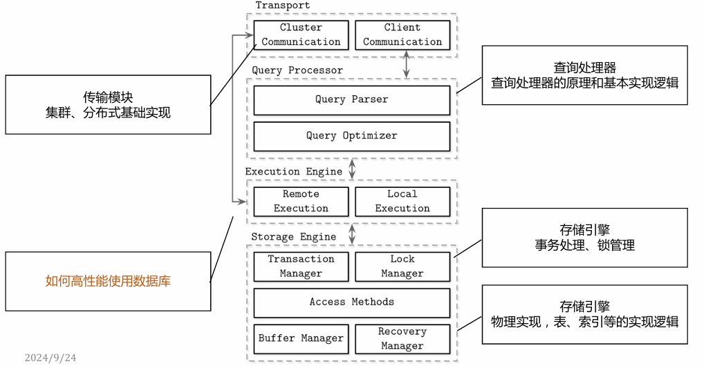

# 1导论

## 数据库课程的基本主线

存储和一致性

- SQL 已经不是最主要的了（不是不重要，而是不是最重要的）
- 所有数据库最大的差异来源于存储格式、索引数据结构、数据一致性保障
- 核心的逻辑和技术实现

选项和权衡点

- 选择和平衡，成为不同数据库设计理念的巨大分野
- 为可用是否可以/怎么牺牲一致性；为读取是否可以/怎么牺牲写入性能，反过来呢？

扩展和分布式：解决扩展性和搞可用性的唯一方式，目前是分布式系统