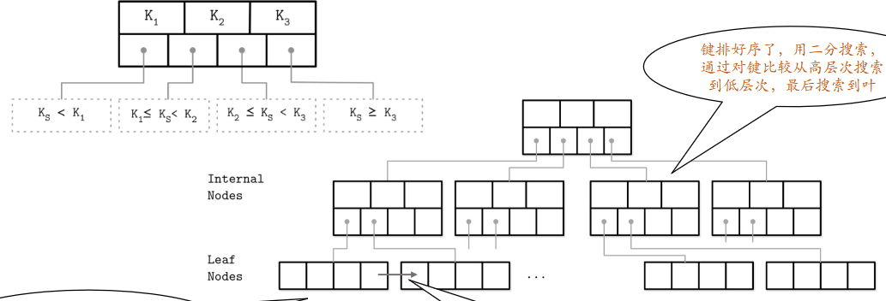

# 3 索引结构、实现及使用

## 什么是索引？

数据库管理系统（DBMS）中的排序数据结构，主要用于快速查询和更新数据库表中的数据。

索引效率的核心：使用高效数据结构（如树）。


## 树结构及其优化

### 二分搜索树（BST）

**二分搜索树的基本结构**

- **节点属性：**
  1. 一个键（key）
  2. 一个值（value）
  3. 两个指针，分别指向左子节点和右子节点。
  
- **树的根节点：**每棵二分搜索树有且只有一个根节点。

**二分搜索树的性质**

- **有序性：**
  - 任意节点的键值大于其左子树所有节点的键值。
  - 任意节点的键值小于其右子树所有节点的键值。
  
- **高效查找：**
  - 沿着左指针不断遍历，可以找到树中最小的键。
  - 沿着右指针不断遍历，可以找到树中最大的键。

**树的平衡性**

- 在最理想情况下，二分搜索树的查找时间复杂度为 $O(\log N)$，即树的高度为对数级。
- **平衡性的重要性：**如果二分搜索树发生不平衡（即某一侧子树远高于另一侧），树的高度会退化为线性，导致查找时间复杂度退化为 $O(N)$

**二分搜索树的优化：平衡操作**

- 为什么需要平衡

  - 不平衡的树会形成一种“病态”（pathological tree），比如只有左节点的链式结构。

  - 平衡的目标是通过操作，使树的左右子树高度接近，从而在每次遍历时将搜索空间平均减少一半。


- 如何实现平衡：旋转（Rotation）操作
  - 在插入或删除节点后，重新调整树的结构。
  - 通过单旋转或双旋转操作，使子树重新平衡。
    - 如果插入一个节点导致树左侧比右侧高得多，通过右旋转（Right Rotation）将某些节点移到右侧，达到平衡状态。
    - 反之，通过左旋转（Left Rotation）处理右侧过高的情况。

### 基于磁盘存储的树

**基于磁盘存储树的特点**

磁盘存储相比内存存储，存在以下限制：

- **数据访问的随机性**：磁盘的随机访问速度较慢，特别是传统的机械硬盘（HDD）。
- **寻道成本**：每次数据访问都伴随磁盘寻道操作，寻道时间是性能瓶颈。
- **数据块大小**：磁盘操作以“块”（block）为单位，每次读写会涉及多个数据项。

因此，树结构在磁盘环境下的设计目标包括：

1. **高扇出（High Fanout）**：每个节点中存储多个键和指针，以减少树的高度，从而减少磁盘访问次数。
2. **低树高（Low Tree Height）**：控制树的高度，使得从根节点到叶节点的路径较短，避免频繁寻道。

**HDD和SSD的存储差异**

- **HDD的特点**：

  - 随机 I/O 与顺序 I/O 的性能差异较大。

  - 需要重点优化顺序访问，减少随机访问。

- **SSD的特点**：

  - 顺序和随机 I/O 性能差异较小。

  - 数据预取、读取连续页以及并行访问对性能影响更大。

**树结构的分页技术**

分页（Paging）是基于磁盘存储优化的一项重要技术，旨在减少磁盘 I/O 操作

- **分页二分树（Paged Binary Tree）**：

  - 每个节点对应磁盘中的一个页（Page）

  - 页内的数据通过二分搜索进行查找

  - 高扇出和低树高是分页树的重要优化策略。

- **磁盘的最小存储单元**：

  - 页（Page）：典型大小为 2KB 至 16KB

  - 块（Block）：由多个页组成，通常包含 64 至 512 个页

**磁盘存储树的实现目标**

为了在磁盘存储中高效运行，树结构的设计遵循以下原则：

1. **提高扇出**：
   - 每个节点存储尽可能多的键，以充分利用磁盘的存储块大小。
   - 高扇出能显著减少树的高度，降低磁盘寻道次数。
2. **优化页组织技术**：
   - 节点内容与磁盘页内容一一对应。
   - 页中的数据通过排序结构存储，支持快速二分查找。
3. **减少随机访问**：优化顺序 I/O 访问模式，通过预取和分块减少磁盘访问开销。

**SSD特性下的特殊设计**

- 页与块的关系：
  - 页是最小的可写单元，而块是最小的可擦除单元。
  - 页的随机读写性能较高，但删除操作涉及整个块的重写。
- 闪存转换层（FTL，Flash Translation Layer）：
  - 页地址需要映射到实际的物理存储位置。
  - 垃圾回收（Garbage Collection）和迁移操作会影响树的性能。

**树结构与逻辑图的实现差异**

- 逻辑图：描述树结构的层级关系，关注树的组织方式。
- 实现结构图：结合磁盘存储特点，具体实现节点和页之间的映射关系。

在实际数据库系统中，基于磁盘存储的树通常采用B树或其改进型B+树，以进一步优化性能


## B 树

### B 树结构



B-Tree（B+Tree）结构的目标：B树构建了一个快速导航和定位搜索项的层次结构，达到这个目标需要高扇出，低树高

支持快速插入、删除和查找，保持对数复杂度。

每个节点最多 N 个键和 N+1 个指向节点的指针

节点容量和实际持有键的数量之间的关系叫占用率

页组织技术，一个节点就是一个Page

键：索引条目（index entry）、分隔符（separator key）、分割单元（divider cell）

键排好序了，用⼆分搜索，通过对键比较从⾼层次搜索到低层次，最后搜索到叶

B 树的本质特点是自下而上构建，随着叶节点数量的增加，内部节点的数量和树的高度也将增加

### B 树查找算法

从根节点到叶节点的单向遍历：从根节点上执行二分搜索算法，将要搜索的 K，与存储在根节点中的 $K_n$ 进行比较，直到找到大于 K 的第一个分隔键，这样定位了一个要搜索的子树，顺着相应指针继续相同的搜索过程，直到目标叶节点，找到数据主文件指针

进行范围扫描时，迭代从找到的最近的键值开始，顺着同级指针继续移动，直到达到范围的末尾

算法复杂度从两个角度讨论：（一般记为 $\log M$，原因如下）

- 块传输：对数基于 N（每个节点的键数，也就是容量）。从根节点每往下走一层，节点个数增加 K倍，并跟随一个子指针可以将搜索空间减少至 1/N。所以，在查找期间最多寻址 $\log_k M$ （M是B树中键的总数）个页来查找一个搜索 key。块传输的数量等于树的高度 H
- 比较次数：对数基是 2，⼆分搜索完成，每次比较，搜索空间减半，复杂度是 $\log_2 M$

块中键数量的设计：最佳页大小，依赖设备的 K，保存 k-2k 个键，k+1-2k+1 个指向子节点的指针


## B+ 树

### 我们的定义

一棵 m 阶的 B+ 树有以下特征：

- B+ 树是⼀种自平衡、有序的 m 路树，用于搜索、顺序访问、插入和删除，其中 m 是树的扇出
- 完全平衡的，即每个叶节点在树中的深度相同
- 除根之外的每个节点⾄少是半满的，$\frac{m}{2}-1≤ \#\text{keys}≤m-1$，下限不用取整
- 每个具有 k 个键的内部节点都有 k+1 个非空子节点
- 所有叶结点包含全部关键字及指向相应记录的指针，叶结点中将关键字按大小顺序排列并且相邻叶结点按大小顺序相互链接起来
- 所有分支结点(可视为索引的索引)中仅包含它的各个子结点（即下⼀级的索引块）中关键字的最大值及指向其子结点的指针

### B+ 树的节点插入和分裂

- 当一个叶节点由于新键值的插入而导致溢出时，会执行以下操作：
  1. 查找目标叶节点：利用 B 树查找算法，定位要插入的目标叶节点。
  2. 插入新键：
     - 如果目标叶节点有空闲空间，则直接插入，流程结束。
     - 如果目标叶节点没有足够的空间，发生节点溢出，必须先分裂节点。
  3. 分裂节点：
     - 分裂操作会分配一个新节点。
     - 将原节点中从 $\lceil \frac{m-1}{2} \rceil$ 位置开始的所有元素移动到新节点。分裂点之后的所有元素被传输到新创建的兄弟节点。
     - **新节点的第一个键值会作为分裂点被提升到父节点**，用于更新父节点的索引。
  4. 调整指针：保持新分裂的兄弟节点之间的顺序链接，方便范围查询操作。

- 当非叶节点因为新增指针超出容量（即子节点数超过m）时，会执行以下操作：
  1. 分裂非叶节点：
     - 分裂点的下标为 $\lceil \frac{m-1}{2} \rceil$
     - 将分裂点之后的所有键值和指针移动到新节点。
     - **分裂点的键值被提升到父节点**，以更新更高一级的索引。
  2. 递归分裂：
     - 如果父节点本身已满，则分裂操作会递归上传至根节点。
     - 根节点的分裂可能导致树的高度增加。
     - B+树的构建遵循“自下而上”的方式，因此分裂操作是从叶节点逐层向上递归的。

### B 树的节点删除和合并

- 定位要删除的目标节点：利用B树查找算法，定位包含目标键值的叶节点。
- 删除目标键值：
  - 如果删除后节点仍然满足最低占用率要求，则直接完成操作。
  - 如果删除后节点的键值个数低于最低占用率（通常是 $\lceil \frac{m-1}{2} \rceil $），则需要进行后续的调整操作，包括从兄弟节点借元素或节点合并。

- 当节点中的键值数量低于最低占用率，但其相邻兄弟节点有足够的冗余键值时，可以从兄弟节点借用元素：
  1. 借元素操作：
     - 从兄弟节点借出一个键值，将其移动到当前节点。
     - 同时更新父节点中的分隔键，以维持索引的正确性。
  2. 保持平衡：借用操作不会改变树的高度，能够快速恢复节点的平衡状态。

- 如果相邻兄弟节点没有多余的键值可供借用，则需要合并当前节点与兄弟节点：
  
  - 将当前节点的所有键值和指针合并到兄弟节点中。
  
    - 删除父节点中指向当前节点的指针以及相应的分隔键。
  
    - 如果父节点因此也不满足占用率，则需要继续向上递归处理，可能最终导致根节点的删除。
  
  - 合并操作会减少树的节点数量，有时还会降低树的高度。

- 根节点的特殊性：
  - 如果根节点因删除导致键值为空，则根节点会被删除，并将子节点提升为新的根节点。
  - 此操作会减少树的高度，但仍然保持 B+ 树的平衡性。

## 索引的功能与问题

### 功能

1. 全键值查找：
   索引允许直接通过索引查找到匹配完整键值的记录，例如：`WHERE x = 123`

2. 键值范围查找：
   索引支持范围查询，可以高效地处理范围条件，例如：`WHERE 45 < x < 123`

3. 键前缀查找：
   对于字符串类型的键，索引支持通过前缀匹配的查询，例如：`WHERE x LIKE 'J%'`

4. 结合索引的多种能力
   通过对索引进行优化，可以支持复杂条件组合和排序需求。

### 索引存在的问题

1. 磁盘空间的开销：索引是数据库中的附加数据结构，需要额外的存储空间。对于大规模数据表，索引可能会显著增加磁盘空间的使用。

2. 处理的开销
   索引的维护需要计算资源：

   - 数据插入、更新、删除时，需要更新对应的索引结构，尤其对于 B+ 树这样的动态平衡树，操作更复杂。
   - 大量索引可能影响数据库性能，因为每次修改都需要同步调整索引。

3. 不同数据库对索引的优化实现
   例如：

   - MyISAM 存储引擎使用前缀压缩来减少索引的存储空间。

   - InnoDB 存储引擎则不压缩索引，但它根据主键值引用行。

     不同存储引擎的索引实现方式会影响性能和存储效率。

4. 索引可能降低查询效率

   - 如果查询涉及的数据行占表中的大部分，索引会导致过多的磁盘访问开销，反而不如全表扫描高效。
   - 特定情况下（例如函数查询），即使有索引，数据库也可能无法使用索引。

### 关键思考

1. 索引设计的合理性
   索引是否能真正提升查询效率，取决于索引的设计是否符合实际需求。
   - 如果表中大部分查询只涉及少量数据行，索引才是高效的选择。
   - 如果需要访问表中的大部分数据行，则索引作用有限。
2. 复合键索引的使用：在复合索引中，索引按照定义时字段的顺序起作用，因此要根据查询的特点优化字段顺序。
3. 如何让索引更高效
   - 针对查询模式设计索引。
   - 合理选择存储引擎，权衡索引性能与存储开销。
   - 避免过度索引，保持索引结构简洁。

## 其它索引类型

1. 哈希索引（Hash Index）
   - 结构特点：
     - 哈希索引根据哈希函数生成的值进行数据存储和查找。
     - 典型结构包括链式哈希表、直接定址法、除留余数法等。
   - 优点：查询速度非常快，可以在 O(1) 时间复杂度内完成单个键的查找。
   - 局限性：
     - **碰撞问题**：不同的键可能通过哈希函数映射到同一个哈希值，导致冲突。解决方法包括闭散列（开放定址）和开散列（链表处理）。
     - **不支持范围查找**：由于哈希索引本质上是无序的，只能用来处理等值查询。
   - 应用场景：适合精确匹配查询，如用户 ID 查找。

2. 位图索引（Bitmap Index）

   - 结构特点：
     - 位图索引使用二进制位（0 和 1）来表示键值是否存在于某一记录中。
     - 适用于基数较低的字段（例如性别或布尔值）。

   - 优点：对于大量临时查询的聚合场景，能有效减少计算量。

   - 局限性：不适合高基数字段（例如用户 ID）。

   - 应用场景：数据仓库中的多维分析和聚合查询。

   - 示例场景： 表 T 包含字段 gender, location, agegroup，支持查询：

     ```sql
     SELECT COUNT(*)
     FROM T
     WHERE gender = 'M' AND location IN (1, 10, 30) AND agegroup = '41 and over';
     ```

     位图索引可以快速筛选数据，通过位运算完成条件组合。

3. 位图联结索引（Bitmap Join Index）

   - 结构特点：
     - 将一个表的列与另一个表的列进行联结，并对联结结果建立索引。
     - 实际上是对索引结构中的数据进行逆规范化。

   - 优点：能加速跨表查询和聚合操作。

   - 应用场景：对复杂联结条件优化性能。

   - 示例： 两个表 `Emp(empid, deptno)` 和 `Dept(deptno, dname)`，查询部门为 'SALES' 的员工：

     ```sql
     SELECT emp.*
     FROM emp, dept
     WHERE emp.deptno = dept.deptno AND dept.dname = 'SALES';
     ```

     位图联结索引可以显著减少联结的计算开销。

4. 函数索引（Function-Based Index）

   - 结构特点：对字段的函数值进行索引，允许查询时使用函数条件。

   - 优点：适合在特定场景下处理复杂查询条件。

   - 应用场景：
     - 不区分大小写的查询。
     - 布尔类型字段的选择性优化。

   - 示例： 创建一个函数索引来处理不区分大小写的查询：

     ```sql
     CREATE INDEX emp_upper_idx ON emp(UPPER(ename));
     SELECT * FROM emp WHERE UPPER(ename) = 'KING';
     ```

   - 高级用法：对某些字段值加条件，比如只对状态为 'ACTIVE' 的项目名字建立唯一索引：

     ```sql
     CREATE UNIQUE INDEX active_project_must_be_unique
     ON projects(CASE WHEN status = 'ACTIVE' THEN name END);
     ```

## 索引使用的典型问题

### 函数和类型转换对索引的影响

某些检索条件会使索引无法发挥作用。例如：`WHERE f(indexed_col) = 'some value'`

日期函数和隐式类型转换会使索引失效：

```sql
WHERE date_entered = TO_DATE('18-JUN-1815', 'DD-MON-YYYY');
WHERE TRUNC(date_entered) = TO_DATE('18-JUN-1815', 'DD-MON-YYYY');
```

对字符串进行函数操作：

```sql
WHERE substr(name, 3, 1) = 'R';
```

### 索引与外键

系统常常自动对表的外键字段添加索引。

优点：加速外键约束的操作，例如关联数据的查找。

潜在问题：并非所有情况下都需要自动生成的索引，可能会引入多余的索引，导致空间浪费。

### 同一个字段存在多个索引

系统可能因为不同需求对同一个字段创建多个索引，尤其是外键字段。例如：

表 `Order_Details`：

```sql
CREATE INDEX index1 ON Order_Details (Order_id, article_id);
CREATE INDEX index2 ON Order_Details (article_id, Order_id);
```

当不需要 `article_id` 单独构建索引时，会引入冗余索引。

### 系统生成键的影响

使用系统生成的键可能导致索引创建时的资源竞争：一个专用表保存“下一个值”，并通过加锁更新可能导致并发性低。

解决方案：

- 反向键索引（Reverse Index）：将键值反转存储以减少冲突。
- 哈希索引（Hash Indexing）：通过哈希函数生成键值以分散资源竞争。

### 为什么没有使用我的索引？

- 常见情况：

  - 情况1：谓词中未使用索引字段的最前列。例如：`SELECT * FROM T WHERE Y = 5;`

    假设索引定义为 `T(X, Y)`，这种查询不会使用索引。

  - 情况2：查询语句为 `SELECT COUNT(*) FROM T`，即使 T 上有索引，优化器仍可能选择全表扫描。

  - 情况3：对有索引的列进行函数查询：`SELECT * FROM T WHERE f(indexed_col) = value;`

  - 情况4：隐式函数查询。

- 可能更糟的情况：

  - 情况5：使用索引反而导致查询更慢。
  - 情况6：统计信息不准确，导致优化器无法正确选择索引。

- 总结： 索引未被使用的主要原因可能是：

  - “不能使用索引”：索引无法满足查询条件。
  - “不该使用索引”：使用索引会降低效率。
