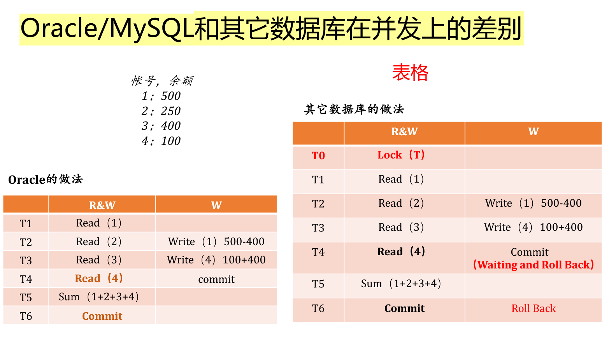
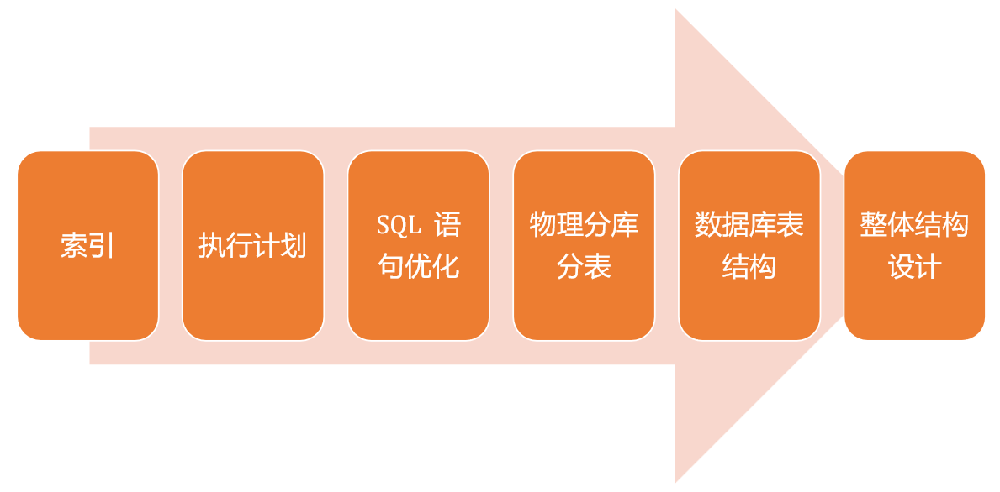
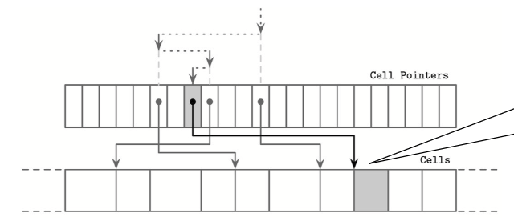
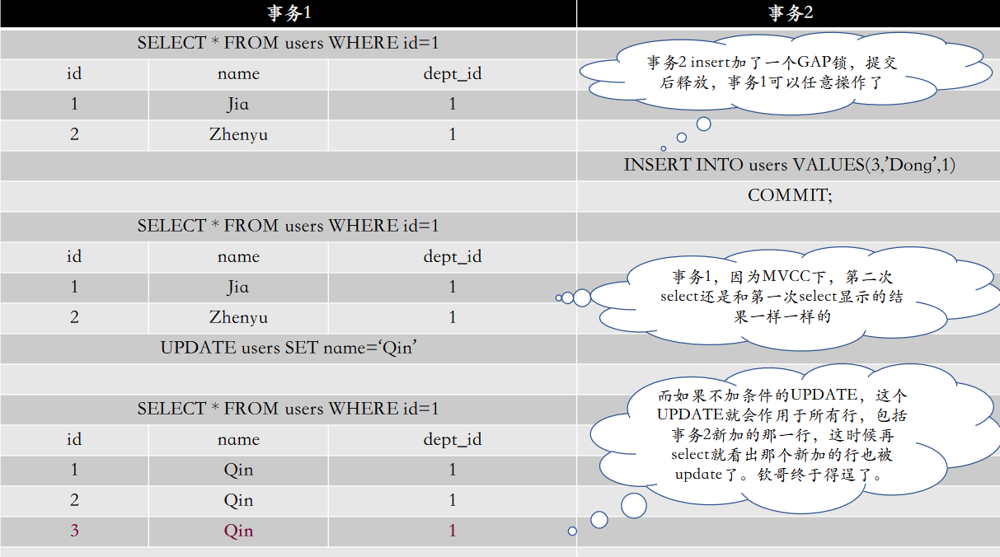
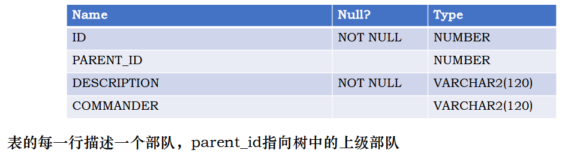
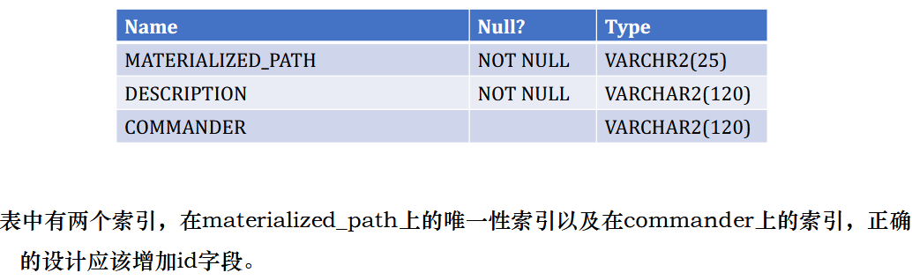
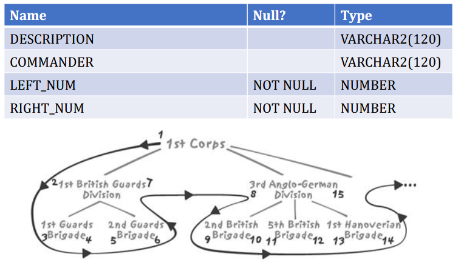
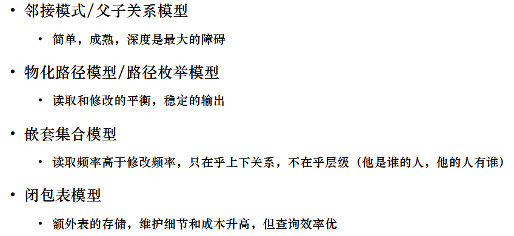

3~4道左右的不定项选择

结合背景和可能会有涉及到选择题选项的一些简答题

一整道 sql 编程（查错、填空、完整手写）

最后一题送分

# 1 导论

# 2 开发成功数据库应用的要点

## 锁机制

> 不会考 Oracle 的锁机制，但是我们会问大家一些关于锁的问题，就是我们不会针对特定的数据库系统去问锁的机制，但是可能会去问大家像一些**行级锁**或者说**表级锁**这样一些概念。

不同的数据库，实现锁机制是不一样的

Oracle 实现的锁机制：只有修改才加行级锁、Read绝对不会对数据加锁、Writer 不会阻塞 Reader、读写器绝对不会阻塞写入器

**行级锁**：它允许多个事务同时访问同一个表，但只能操作不同的行，从而实现更高的并发性能

特点：

- 粒度细：仅锁定目标行，不会影响同一表的其他行。
- 并发性高：多个事务可以同时操作不同的行，适用于高并发场景。
- 适用场景：事务只需要对少量行的数据进行操作时，行间锁可以最大限度地减少锁的竞争。

优点：提高并发性能：只限制特定行的访问。减少锁冲突：其他事务仍然可以操作未锁定的行。

缺点：开销较大：由于需要管理大量的行锁，可能会增加锁管理的开销。死锁风险：多个事务对不同的行加锁时，如果相互等待，可能导致死锁。

```sql
-- 假设有一个表 users，包含字段 id 和 name
BEGIN TRANSACTION;
-- 对 id=1 的行加锁
UPDATE users SET name = 'Alice' WHERE id = 1;
```

在上述操作中，事务会对 `id=1` 的行加锁，其他事务在锁释放前无法修改该行

**表级锁**：对整个表进行的锁定。它限制其他事务对该表的访问（如读取或修改）

特点：

- 粒度粗：锁定整个表，影响表中所有的行。
- 并发性低：其他事务无法对同一表进行任何数据操作，直到锁被释放。
- 适用场景：事务需要操作表中大量数据时，表间锁可以简化锁管理。

优点：简化锁管理：只需要对整张表加锁，不需要跟踪每一行的锁状态。避免死锁：由于整个表被加锁，避免了多个事务间的锁冲突。

缺点：并发性能较低：在锁定期间，其他事务对该表的所有操作都会被阻塞。影响范围大：即使只操作几行，也会限制对整个表的访问。

```sql
-- 假设有一个表 users
BEGIN TRANSACTION;
-- 对整个表加锁
LOCK TABLE users IN EXCLUSIVE MODE;
```

在上述操作中，事务对 `users` 表加了排他锁，其他事务在锁释放前无法读取或修改该表

> 可以把这个案例稍微看一看，然后到考场上也许会涉及到一个就这样并发的，就像一个表格的题目，让大家填到底在什么情况下会是一个什么样的结果。



**题型：某件事情是否一定会造成某个结果？回答：不知道，看情况**

## 整体层面的性能优化考虑

> 不会去考那种解答题，让大家一定要把所有的都列出来，但是会问大家有哪些可能的优化的方向，然后大家总归这几点里面肯定是要答到一些

1、CPU 负载高，IO 负载低：内存不够；磁盘性能差（磁盘问题、raid 设计不好、raid 降级）；SQL 的问题；并发锁机制的问题；事务设计问题；大量小数据 IO；大量的全表扫描

2、IO 负载高，CPU 负载低：大量小的 IO 执行写操作；Autocommit，产生大量小 IO；大量大的 IO 执行写操作；SQL 的问题；IO/PS 磁盘限定一个每秒最大 IO 次数

3、IO 和 CPU 负载都高：硬件不够；SQL 存在问题

## SQL 优化的方向



# 3 索引结构、实现及使用

> 除了讲 MySQL InnoDB 的部分，和特定的数据库查询引擎对应的索引的部分其他都可能会考

## 什么是索引？

数据库管理系统（DBMS）中的排序数据结构，主要用于快速查询和更新数据库表中的数据。

索引效率的核心：使用高效数据结构（如树）。

## 基于磁盘存储的树

**基于磁盘存储树的特点**

磁盘存储相比内存存储，存在以下限制：

- **数据访问的随机性**：磁盘的随机访问速度较慢，特别是传统的机械硬盘（HDD）。
- **寻道成本**：每次数据访问都伴随磁盘寻道操作，寻道时间是性能瓶颈。
- **数据块大小**：磁盘操作以“块”（block）为单位，每次读写会涉及多个数据项。

因此，树结构在磁盘环境下的设计目标包括：

1. **高扇出（High Fanout）**：每个节点中存储多个键和指针，以减少树的高度，从而减少磁盘访问次数。
2. **低树高（Low Tree Height）**：控制树的高度，使得从根节点到叶节点的路径较短，避免频繁寻道。

**HDD和SSD的存储差异**

- **HDD的特点**：

  - 随机 I/O 与顺序 I/O 的性能差异较大。

  - 需要重点优化顺序访问，减少随机访问。

- **SSD的特点**：

  - 顺序和随机 I/O 性能差异较小。

  - 数据预取、读取连续页以及并行访问对性能影响更大。

**树结构的分页技术**

分页（Paging）是基于磁盘存储优化的一项重要技术，旨在减少磁盘 I/O 操作

- **分页二分树（Paged Binary Tree）**：

  - 每个节点对应磁盘中的一个页（Page）

  - 页内的数据通过二分搜索进行查找

  - 高扇出和低树高是分页树的重要优化策略。

- **磁盘的最小存储单元**：

  - 页（Page）：典型大小为 2KB 至 16KB

  - 块（Block）：由多个页组成，通常包含 64 至 512 个页

**磁盘存储树的实现目标**

为了在磁盘存储中高效运行，树结构的设计遵循以下原则：

1. **提高扇出**：
   - 每个节点存储尽可能多的键，以充分利用磁盘的存储块大小。
   - 高扇出能显著减少树的高度，降低磁盘寻道次数。
2. **优化页组织技术**：
   - 节点内容与磁盘页内容一一对应。
   - 页中的数据通过排序结构存储，支持快速二分查找。
3. **减少随机访问**：优化顺序 I/O 访问模式，通过预取和分块减少磁盘访问开销。

**SSD特性下的特殊设计**

- 页与块的关系：
  - 页是最小的可写单元，而块是最小的可擦除单元。
  - 页的随机读写性能较高，但删除操作涉及整个块的重写。
- 闪存转换层（FTL，Flash Translation Layer）：
  - 页地址需要映射到实际的物理存储位置。
  - 垃圾回收（Garbage Collection）和迁移操作会影响树的性能。

**树结构与逻辑图的实现差异**

- 逻辑图：描述树结构的层级关系，关注树的组织方式。
- 实现结构图：结合磁盘存储特点，具体实现节点和页之间的映射关系。

在实际数据库系统中，基于磁盘存储的树通常采用B树或其改进型B+树，以进一步优化性能

## B+ 树

### 我们的定义

一棵 m 阶的 B+ 树有以下特征：

- B+ 树是⼀种自平衡、有序的 m 路树，用于搜索、顺序访问、插⼊和删除，其中 m 是树的扇出
- 完全平衡的，即每个叶节点在树中的深度相同
- 除根之外的每个节点⾄少是半满的，$\frac{m}{2}-1≤ \#\text{keys}≤m-1$，下限不用取整
- 每个具有 k 个键的内部节点都有 k+1 个非空子节点
- 所有叶结点包含全部关键字及指向相应记录的指针，叶结点中将关键字按大小顺序排列并且相邻叶结点按大小顺序相互链接起来
- 所有分支结点(可视为索引的索引)中仅包含它的各个子结点（即下⼀级的索引块）中关键字的最大值及指向其子结点的指针

### B+ 树的节点插入和分裂

- 当一个叶节点由于新键值的插入而导致溢出时，会执行以下操作：
  1. 查找目标叶节点：利用 B 树查找算法，定位要插入的目标叶节点。
  2. 插入新键：
     - 如果目标叶节点有空闲空间，则直接插入，流程结束。
     - 如果目标叶节点没有足够的空间，发生节点溢出，必须先分裂节点。
  3. 分裂节点：
     - 分裂操作会分配一个新节点。
     - 将原节点中从 $\lceil \frac{m-1}{2} \rceil$ 位置开始的所有元素移动到新节点。分裂点之后的所有元素被传输到新创建的兄弟节点。
     - **新节点的第一个键值会作为分裂点被提升到父节点**，用于更新父节点的索引。
  4. 调整指针：保持新分裂的兄弟节点之间的顺序链接，方便范围查询操作。

- 当非叶节点因为新增指针超出容量（即子节点数超过m）时，会执行以下操作：
  1. 分裂非叶节点：
     - 分裂点的下标为 $\lceil \frac{m-1}{2} \rceil$
     - 将分裂点之后的所有键值和指针移动到新节点。
     - **分裂点的键值被提升到父节点**，以更新更高一级的索引。
  2. 递归分裂：
     - 如果父节点本身已满，则分裂操作会递归上传至根节点。
     - 根节点的分裂可能导致树的高度增加。
     - B+树的构建遵循“自下而上”的方式，因此分裂操作是从叶节点逐层向上递归的。

### B 树的节点删除和合并

- 定位要删除的目标节点：利用B树查找算法，定位包含目标键值的叶节点。
- 删除目标键值：
  - 如果删除后节点仍然满足最低占用率要求，则直接完成操作。
  - 如果删除后节点的键值个数低于最低占用率（通常是 $\lceil \frac{m-1}{2} \rceil $），则需要进行后续的调整操作，包括从兄弟节点借元素或节点合并。

- 当节点中的键值数量低于最低占用率，但其相邻兄弟节点有足够的冗余键值时，可以从兄弟节点借用元素：
  1. 借元素操作：
     - 从兄弟节点借出一个键值，将其移动到当前节点。
     - 同时更新父节点中的分隔键，以维持索引的正确性。
  2. 保持平衡：借用操作不会改变树的高度，能够快速恢复节点的平衡状态。

- 如果相邻兄弟节点没有多余的键值可供借用，则需要合并当前节点与兄弟节点：

  - 将当前节点的所有键值和指针合并到兄弟节点中。

    - 删除父节点中指向当前节点的指针以及相应的分隔键。

    - 如果父节点因此也不满足占用率，则需要继续向上递归处理，可能最终导致根节点的删除。

  - 合并操作会减少树的节点数量，有时还会降低树的高度。

- 根节点的特殊性：
  - 如果根节点因删除导致键值为空，则根节点会被删除，并将子节点提升为新的根节点。
  - 此操作会减少树的高度，但仍然保持 B+ 树的平衡性。

## B+ 树索引能做什么？

1. 全键值查找：索引允许直接通过索引查找到匹配完整键值的记录，例如：`WHERE x = 123`

2. 键值范围查找：索引支持范围查询，可以高效地处理范围条件，例如：`WHERE 45 < x < 123`

3. 键前缀查找：对于字符串类型的键，索引支持通过前缀匹配的查询，例如：`WHERE x LIKE 'J%'`

4. 结合索引的多种能力通过对索引进行优化，可以支持复杂条件组合和排序需求。

不同的存储引擎使用了不同的方式，优点和问题

## 索引存在的问题

1. 磁盘空间的开销：索引是数据库中的附加数据结构，需要额外的存储空间。对于大规模数据表，索引可能会显著增加磁盘空间的使用。

2. 处理的开销
   索引的维护需要计算资源：

   - 数据插入、更新、删除时，需要更新对应的索引结构，尤其对于 B+ 树这样的动态平衡树，操作更复杂。
   - 大量索引可能影响数据库性能，因为每次修改都需要同步调整索引。

3. 不同数据库对索引的优化实现
   例如：

   - **MyISAM 存储引擎使用前缀压缩来减少索引的存储空间。**

   - **InnoDB 存储引擎则不压缩索引，但它根据主键值引用行。**

     **不同存储引擎的索引实现方式会影响性能和存储效率。**

4. 索引可能降低查询效率

   - 如果查询涉及的数据行占表中的大部分，索引会导致过多的磁盘访问开销，反而不如全表扫描高效。
   - 特定情况下（例如函数查询），即使有索引，数据库也可能无法使用索引。

### 关键思考

1. 索引设计的合理性
   索引是否能真正提升查询效率，取决于索引的设计是否符合实际需求。
   - 如果表中大部分查询只涉及少量数据行，索引才是高效的选择。
   - 如果需要访问表中的大部分数据行，则索引作用有限。
2. 复合键索引的使用：在复合索引中，索引按照定义时字段的顺序起作用，因此要根据查询的特点优化字段顺序。
3. 如何让索引更高效
   - 针对查询模式设计索引。
   - 合理选择存储引擎，权衡索引性能与存储开销。
   - 避免过度索引，保持索引结构简洁。

## 其它索引类型（不会全考）

1. 哈希索引（Hash Index）

   - 结构特点：
     - 哈希索引根据哈希函数生成的值进行数据存储和查找。
     - 典型结构包括链式哈希表、直接定址法、除留余数法等。
   - 优点：查询速度非常快，可以在 O(1) 时间复杂度内完成单个键的查找。
   - 局限性：
     - **碰撞问题**：不同的键可能通过哈希函数映射到同一个哈希值，导致冲突。解决方法包括闭散列（开放定址）和开散列（链表处理）。
     - **不支持范围查找**：由于哈希索引本质上是无序的，只能用来处理等值查询。
   - 应用场景：适合精确匹配查询，如用户 ID 查找。

2. 位图索引（Bitmap Index）

   - 结构特点：

     - 位图索引使用二进制位（0 和 1）来表示键值是否存在于某一记录中。
     - 适用于基数较低的字段（例如性别或布尔值）。

   - 优点：对于大量临时查询的聚合场景，能有效减少计算量。

   - 局限性：不适合高基数字段（例如用户 ID）。

   - 应用场景：数据仓库中的多维分析和聚合查询。

   - 示例场景： 表 T 包含字段 gender, location, agegroup，支持查询：

     ```sql
     SELECT COUNT(*)
     FROM T
     WHERE gender = 'M' AND location IN (1, 10, 30) AND agegroup = '41 and over';
     ```

     位图索引可以快速筛选数据，通过位运算完成条件组合。

3. 位图联结索引（Bitmap Join Index）

   - 结构特点：

     - 将一个表的列与另一个表的列进行联结，并对联结结果建立索引。
     - 实际上是对索引结构中的数据进行逆规范化。

   - 优点：能加速跨表查询和聚合操作。

   - 应用场景：对复杂联结条件优化性能。

   - 示例： 两个表 `Emp(empid, deptno)` 和 `Dept(deptno, dname)`，查询部门为 'SALES' 的员工：

     ```sql
     SELECT emp.*
     FROM emp, dept
     WHERE emp.deptno = dept.deptno AND dept.dname = 'SALES';
     ```

     位图联结索引可以显著减少联结的计算开销。

4. 函数索引（Function-Based Index）

   - 结构特点：对字段的函数值进行索引，允许查询时使用函数条件。

   - 优点：适合在特定场景下处理复杂查询条件。

   - 应用场景：

     - 不区分大小写的查询。
     - 布尔类型字段的选择性优化。

   - 示例： 创建一个函数索引来处理不区分大小写的查询：

     ```sql
     CREATE INDEX emp_upper_idx ON emp(UPPER(ename));
     SELECT * FROM emp WHERE UPPER(ename) = 'KING';
     ```

   - 高级用法：对某些字段值加条件，比如只对状态为 'ACTIVE' 的项目名字建立唯一索引：

     ```sql
     CREATE UNIQUE INDEX active_project_must_be_unique
     ON projects(CASE WHEN status = 'ACTIVE' THEN name END);
     ```

## 索引使用的典型问题

### 函数和类型转换对索引的影响

某些检索条件会使索引无法发挥作用。例如：`WHERE f(indexed_col) = 'some value'`

日期函数和隐式类型转换会使索引失效：

```sql
WHERE date_entered = TO_DATE('18-JUN-1815', 'DD-MON-YYYY');
WHERE TRUNC(date_entered) = TO_DATE('18-JUN-1815', 'DD-MON-YYYY');
```

对字符串进行函数操作：

```sql
WHERE substr(name, 3, 1) = 'R';
```

### 索引与外键

系统常常自动对表的外键字段添加索引。

优点：加速外键约束的操作，例如关联数据的查找。

潜在问题：并非所有情况下都需要自动生成的索引，可能会引入多余的索引，导致空间浪费。

### 同一个字段存在多个索引

系统可能因为不同需求对同一个字段创建多个索引，尤其是外键字段。例如：

表 `Order_Details`：

```sql
CREATE INDEX index1 ON Order_Details (Order_id, article_id);
CREATE INDEX index2 ON Order_Details (article_id, Order_id);
```

当不需要 `article_id` 单独构建索引时，会引入冗余索引。

### 系统生成键的影响

使用系统生成的键可能导致索引创建时的资源竞争：一个专用表保存“下一个值”，并通过加锁更新可能导致并发性低。

解决方案：

- 反向键索引（Reverse Index）：将键值反转存储以减少冲突。
- 哈希索引（Hash Indexing）：通过哈希函数生成键值以分散资源竞争。

### 为什么没有使用我的索引？

- 常见情况：

  - 情况1：谓词中未使用索引字段的最前列。例如：`SELECT * FROM T WHERE Y = 5;`

    假设索引定义为 `T(X, Y)`，这种查询不会使用索引。

  - 情况2：查询语句为 `SELECT COUNT(*) FROM T`，即使 T 上有索引，优化器仍可能选择全表扫描。

  - 情况3：对有索引的列进行函数查询：`SELECT * FROM T WHERE f(indexed_col) = value;`

  - 情况4：隐式函数查询。

- 可能更糟的情况：

  - 情况5：使用索引反而导致查询更慢。
  - 情况6：统计信息不准确，导致优化器无法正确选择索引。

- 总结： 索引未被使用的主要原因可能是：

  - “不能使用索引”：索引无法满足查询条件。
  - “不该使用索引”：使用索引会降低效率。


# 4 B+ 树结构的物理实现

## 数据库文件物理组织形式通用原理

### 页（Page）的基本概念与组织原则

**确定寻址方式**

数据库文件被分为相同大小的页（Page）或块（Block），可以是单个块或连续块的组合。

使用固定大小的页有以下优点：简化读取和写入访问；按页写入时，从内存写到磁盘更高效

**数据存储结构的两种类型**

原地更新（In-place update）：数据直接在原位置更新。

仅追加（Append-only）：数据以追加的形式存储，避免直接覆盖已有数据。

这两种方式通常都是按照页组织。

**数据库表结构的特点**

数据库的表结构（Schema）一般是固定的，定义了字段的数量、顺序和类型。

固定表结构的好处：减少存储需求；使用位置标识符代替字段名，优化访问效率。

**变长字段的管理**

变长字段会引入复杂性：例如读取 `name` 字段，需要先读取 `last_name_length`，计算变长字段的偏移量，再读取对应内容。

**查找表的使用**

数据文件通常在头部、尾部或单独文件中包含“查找表”。记录起始偏移量。

在整个数据表文件中，构建一个查找表能显著提升定位效率。

### 页的定长和变长结构（Slotted Page）

定长记录页：

- 页大小通常为 4-16k。
- 示例：B 树索引的叶节点包含键-值对，非叶节点包含键-指针对。
- [BAYER72] 提出的定长数据记录页的组织方式：每个页是一连串的三元组（k：key；v：value；p：pointer）。
- 缺点：插入操作可能导致大量移动；无法有效支持变长数据。

### 管理变长数据（删除/修改）

变长记录管理的核心问题：删除记录后，需要回收已释放的空间。将大小为 n 的记录插入到原本由大小为 m 的记录占据的空间时，可能会导致以下两种情况：空间多余（浪费）；空间不足（无法插入）。

Freeblock 机制：页头部包含一个 Freeblock 数据结构，用于记录页的可用空间和空闲块的信息：

- 页头指针指向第一个空闲块。
- 空闲块的信息包括其起始地址和可用字节数。

空闲块的分配策略：

- 首次适配优先（First-Fit Priority）：在空闲块列表中，优先找到第一个适配的空闲块。
  缺点：可能导致碎片化。
- 最佳适配优先（Best-Fit Priority）：寻找剩余空间最小的空闲块进行分配。
  优点：减少碎片浪费，但增加了查找开销。

页内的碎片整理操作：

- 移动记录数据，填补因删除而产生的空洞。
- 更新指针数组中的偏移量。

当页面中碎片过多时，可能会触发页的重写操作：整理和压缩碎片，释放更多的连续空间用于插入新记录。

动态布局

- 页中的记录位置是动态分配的，外部系统只能通过页 ID 引用数据。
- 页的具体存储布局（如偏移量和长度）由页内部决定，动态布局允许高效管理变长记录。

### 页头（Page Header）的用途

> 举例子

**页头**保存有关可用于页定位、维护和优化的信息

包含信息：页类型和布局版本；记录的数量；空闲空间的起始和结束偏移量；其他实现相关的元数据

**Magic Numbers**：在页头中使用特殊的多字节常数值，称为Magic Number，用于：

- 标识这是一个有效的页
- 指定页的类型或版本
- 验证页加载和对齐的正确性

### 同级指针（Sibling Links）与最右指针（Rightmost Pointers）

**同级指针**

同级指针是连接同一层相邻节点的指针，用于简化同层节点之间的遍历和操作。如果没有同级指针，重新定位相邻节点时需要通过父节点来进行，这会增加访问开销。

优点：

- 快速遍历：无需回溯到父节点，显著减少查询时间

- 简化操作：同级指针可以直接定位目标节点，从而提升效率

缺点：

- 额外开销：每个节点需要存储一个指向同级节点的指针，这会增加空间消耗
- 维护复杂性：在节点分裂或合并时，需要同时更新同级指针，增加了实现的复杂性

**最右指针**

在B+树的节点设计中，节点的键与指针数目通常满足关系：指针数 = 键数 + 1。

最右指针是节点中“额外”的指针，用于指向当前节点范围之外更大的子节点或分支。

最右指针通常单独存放，与其他键值对分开。例如，在SQLite中，最右指针直接存储在页节点的头部。

作用：

- 当节点发生分裂，分裂后的新节点需要将其最右指针重新分配。在B+树中，如果一个键K被分裂并追加到父节点，其对应的指针会指向分裂后的新节点，同时更新原节点的最右指针。
- 假设一个节点中有键值K1, K2, K3，对应的指针为P1, P2, P3, P4：指针P1到P3分别指向当前节点范围内的子树。指针P4（最右指针）指向范围K3以上的子树。

当一个节点分裂时，需要重新分配最右指针以确保新的节点结构正确。

示例：如果键`K4`分裂后被追加到父节点，新生成的指针需要替代原节点的最右指针，并指向新节点。

在某些设计中，为了减少额外的指针存储需求，可以尝试将高键（High Key）与最右指针的功能统一，但这可能增加树的复杂性。

## B+ 树结构的静态与动态实现

### 静态实现

二进制表示：在B+树中，键和值首先需要被转换为二进制形式表示。

页结构

页头：存储关于页内容和布局的元数据，包括：页的类型（叶节点或非叶节点）等

指针设计：

- 键与指针在节点内成对存储，用于指向子节点。非叶节点的指针数量比键多1，形成 `N+1` 结构。
- 高键：在节点分裂时使用，用于标识分裂后的上限键值范围。

**溢出页**：当节点中包含变长值，且这些值过大以致无法完全存储在页内时，使用溢出页存储超出部分。

### 动态实现

#### 二分搜索（Binary Search）

原理：在节点内部，通过二分搜索定位键值的位置。输入为一个排序的键数组和搜索键，返回键的位置或插入点。

实现：使用间接指针辅助二分搜索。灰色部分为要搜索的数据，虚线表示通过指针的二分搜索，实线表示指针跟随的访问动作。



#### 分裂与合并

分裂：当节点满时，从叶节点向上递归分裂。分裂后，将一个键值提升至父节点，分配新的指针。

合并：当节点的数据量过少时，从叶节点向上递归合并。合并时，需要一条从叶节点到根节点的完整路径，以便返回父节点进行更新。

实现细节：分裂和合并需要额外的栈结构来存储节点路径，便于操作完成后更新结构。

#### 再平衡（Rebalancing）

> 放在插入删除中考

频繁的分裂和合并会导致性能下降、节点利用率低下、树层数增加。

再平衡通过延迟分裂操作来提高平均节点利用率。

#### 右侧追加（Right-Only Appends）

在自增主键索引的场景下，插入操作始终发生在最右侧叶节点。

批量加载：自下而上地构建树，逐层写入，适用于数据批量插入。

## 数据维护

### 压缩

压缩的实现粒度：

- 文件级压缩：对整个数据库文件进行压缩。
- 页级压缩：针对每个页单独压缩。


- 记录级压缩：对每条记录单独压缩。

根据具体应用场景权衡以下指标：

- 压缩比：数据压缩后的存储效率。
- 性能：压缩和解压缩的速度。
- 内存开销：压缩算法需要的内存资源。

### 维护

填空（Null）或删除偏移量

- 垃圾收集在事务完成后回收“ghost record”（幽灵记录）所占用的空间。

- 页头中保留的偏移量列表可以标识这些空洞，便于后续插入时复用。

碎片化单元格（fragmented）需要被碎片整理

- 重写页面：将页面的有效数据移动到一个连续的区域，更新页头中的偏移量以反映新的数据位置。
- 合并碎片：在整理过程中，释放无用空间，重新组织记录顺序。

## 数据库存储与扩展

> 基本的概念、有哪些类型、优缺点、是解决什么问题的

### 分区

分区的目的：提高并发性和并行性，增强系统架构的可伸缩性；在处理大表时，分区有助于更高效地备份和恢复；解决数据量巨大或高并发导致的性能瓶颈。

分区的实现方式：

- **循环分区**：数据按照循环分布到各分区，独立于数据内容。保证磁盘I/O的均衡分布，适用于不依赖字段值的场景。
- 数据驱动分区：根据一个或多个字段中的值来定义分区
  - **哈希分区**：根据字段值的哈希值进行分区。适合数据分布较为均匀的场景。
  - **范围分区/键值分区**：根据字段值的范围进行分区。常用于时间序列数据，例如按年份、月份划分数据。
  - **列表分区**：根据字段的枚举值分区，例如将不同地区的数据分配到特定分区。

分区表的底层实现原理：

- 分区表： 由多个相关的底层表实现，每个分区对应一个独立的底层表。

- 分区的索引：

  - 每个底层表都有独立的索引。

  - 分区层负责统一调用底层索引。

- 操作逻辑：

  - SELECT： 分区层打开并锁定所有底层表，根据优化器过滤部分分区，再访问引擎接口。

  - INSERT： 确定目标分区后，将数据写入对应的底层表。

  - UPDATE/DELETE： 根据分区键选择分区，完成操作后更新或删除数据。

分区的局限性：

- 当分区键为 `NULL` 时，可能导致分区过滤失效
- 如果查询条件中未包含分区键，分区优势可能丧失。
- 打开并锁定所有底层表的操作会增加成本，尤其是范围分区
- 分区的定义和调整需要额外的维护开销

### 分表

把一张表按一定的规则分解成 N 个具有独立存储空间的实体表

系统读写时需要根据定义好的规则得到对应的字表明，然后操作它

分表后，每个子表的数据量减少，从而提高查询和写入效率。将数据分布到多个表中，降低单表的并发压力和磁盘I/O负载。

**分区与分表的区别与联系**

| **特性**       | **分区**                                       | **分表**                       |
| -------------- | ---------------------------------------------- | ------------------------------ |
| **逻辑视图**   | 表的逻辑结构保持不变，底层数据分成多个物理区块 | 将表拆分为多个独立的物理表     |
| **访问量需求** | 适合访问量不大但数据量大的场景                 | 适合访问量和数据量都很大的场景 |
| **数据库支持** | 一般不需要业务逻辑参与，数据库层实现           | 需要业务逻辑支持，如数据路由   |
| **分布式扩展** | 仅限于单数据库内                               | 可以扩展到多个数据库           |

### 分库

为突破单节点数据库服务器的 I/O 能力限制，解决数据库扩展性问题

分库的实现方式：

- 垂直拆分：将不存在关联关系或者不需要join的表可以放在不同的数据库不同的服务器中
- 水平拆分：按照规则划分，一般水平分库是在垂直分库之后的
- 读写分离：对于时效性不高的数据，可以通过读写分离缓解数据库压力

数据库存储的性能优化

- I/O 瓶颈：

  - 热点数据过多时，可通过分库或垂直分表缓解数据缓存不足问题。

  - 网络 I/O 瓶颈时，可采用分库策略减少连接数。

- CPU 瓶颈：
  - 对于 SQL 查询效率问题：优化 SQL；构建合理的索引
  - 单表数据量过大时，可通过水平分表减少扫描行数

分区和分表的常见问题与解决方案

2. 事务支持：

- 分库分表后，事务需要通过分布式事务协调机制来保证一致性。
- 解决方案包括：
  - TCC（Try-Confirm-Cancel）柔性事务。
  - 使用第三方数据库中间件（如Mycat、TDDL）。


# 5 事务处理与恢复

## 事务处理（有可能）

**ACID 原则**：

- 原子性（Atomicity）：事务的本质要求。
  - 事务的本质是多个操作合并为一个步骤，操作包括**读取**和**写入数据记录**
  - 事务中的所有操作要么全部成功执行，要么全部不执行，任何部分的失败都必须回滚到初始状态
- 一致性（Consistency）：数据完整的本质要求
  - 唯一一个可以由开发者控制而不是完全依赖数据库自身保证的属性
  - 在事务开始和结束时，数据库的状态必须是完整且正确的
- 隔离性（Isolation）：并发的本质要求
  - 并发执行的事务相互独立，不会互相影响
  - 并发事务执行时，一个事务的中间状态对其他事务不可见，只有当事务提交后，其他事务才能看到结果
- 持久性（Durability）：数据库系统的本质要求。一旦事务提交成功，数据的修改就会被永久保留，即使系统崩溃或出现故障也不会丢失

**事务管理组件**：

- 事务管理器：协调、调度和跟踪事务的各个步骤
- 锁管理器：保护对资源的访问，防止能可能破坏数据完整性的并发访问
- 页缓存：充当持久性存储（磁盘）和存储引擎其余部分之间的中介
- 日志管理器：记录已应用在缓存页上的操作（日志条目），以便撤销已中止的事务所作出的更改
- 分布式事务协调：在分布式或多分区的环境下，协调跨多个节点的事务执行，确保分布式事务的一致性和完整性。

## 缓冲区管理

### 双层存储体系

1. 页缓存（Page Cache）/ 虚拟磁盘（Virtual Disk）：当内存中没有页副本可用时，读取虚拟磁盘会访问物理存储
2. 操作概述
   - Page In（换入）：将磁盘上的页面加载到内存中的过程
   - Flush（刷写）：将内存中的脏页（被修改过的页面）刷写回磁盘
   - Evict（换出）：将内存中不再需要的页面换出，腾出空间给其他页面

### 缓冲区管理的功能

1. **在内存中保留被缓存的页的内容**：页缓存会将数据库中被频繁访问的页面保留在内存中，减少对磁盘的直接访问，提高访问效率。

2. **把对磁盘页的修改缓冲起来，并且修改的是缓存版本**：修改操作首先应用于内存中的缓存页，而不会立即刷写回磁盘。这样可以避免频繁的磁盘I/O操作。

3. **当被请求的页不在内存中且可用空间足够时，页缓存会换入并返回缓存的版本**：如果请求的页面不在内存中，且内存中有足够的空间，页缓存会将该页面从磁盘加载到内存中，并返回缓存版本供事务使用。

4. **如果请求的页在缓存中，则直接返回缓存的版本**：如果请求的页面已经在缓存中，系统会直接返回缓存页，避免磁盘访问。

5. **如果可用空间不足以放下新页，则换出其他页，被换出的页的内容会刷写回磁盘**：当内存空间不足时，页缓存会选择某些页面换出到磁盘。如果这些页面是**脏页**（被修改过），需要在换出前将其内容刷写回磁盘，确保数据一致性

### 缓存的语义

缓存的修改同步是单向的：缓存提供了对磁盘访问的抽象，将逻辑写操作与物理写操作分离。这使得数据的修改可以首先应用于缓存，而不必立即同步到磁盘。

页缓存的作用：页缓存使我们可以将某些数据结构（例如树的部分结构）保留在内存中，而无需修改算法本身或在内存中物化对象。替换磁盘访问为对页缓存的调用即可实现更高效的数据访问。

请求页的基本步骤：

1. 检查该页是否已被缓存。如果页在缓存中，直接返回缓存的页

2. 如果页不在缓存中，页缓存会将逻辑地址或页 ID 转化为物理地址，加载到内存中，并返回给请求方
3. 一旦返回，存有缓存页内容的缓冲区就被称为**被引用的**
4. 用完页面后，调用方将其归还给页缓存或解除引用
5. 如果希望某些页不被页缓存换出，可以将其**固定**。固定的页会始终保留在内存中，不参与缓存的换出过程
6. 如果某些页被修改，标记为**脏页**，脏页表示内容与磁盘不同步，换出时必须将其刷写到磁盘

### 缓存的回收

保持缓存填满的状态并不总是最优的选择，因为当新页面需要加载时，系统必须换出其他页面，可能导致性能下降。

- 推迟刷写：减少磁盘访问次数，降低中断率
- 提早刷写：让页能被快速换出
- 选择要换出的页：以最优顺序进行刷写
- 保持缓存大小：确保缓存大小在内存范围内
- 避免数据丢失：尽量确保数据在持久存储中得到同步

换出的设计逻辑

1. 检查该页是否与磁盘同步（即已刷写过，或者从未修改过）
2. 检查该页是否被固定或引用。如果可以直接换出，则立即将其换出
3. 脏页需要先刷写到磁盘，然后再换出
   - 每次换出页都刷写磁盘可能导致性能下降，解决方案是：**独立后台进程循环刷写**（例如 PostgreSQL 的后台刷写器）。
4. 如果该页被其他线程使用，则无法换出
   - 如果数据库崩溃，所有未刷写的数据都会丢失。为了解决这一问题，系统使用**检查点进程（Checkpoint Process）和预写日志（WAL）**与页缓存系统配合工作。当数据刷写到磁盘后，WAL 日志可以被丢弃，确保持久性。

### 技术1：在缓存中锁定页

原因：

1. **堆文件的随机性和 B+ 树结构的差异**  
   - 堆文件的随机性导致数据访问没有明显的规律。  
   - B+树结构在业务调用逻辑上存在差异：  
     - B+ 树越靠近顶部越窄，因此**层次较高的节点在大多数读取中会被命中**。  
     - 同时，分裂与合并操作最终也会传播到较高层次的节点。  
2. **频繁的子树结构变化可以一起处理**  
   - 多次删除导致节点合并，随后写入操作又导致分裂。  
   - 不同子树的合并和分裂操作，共同传播到上层结构。  

**锁定页**：  

- 将“大概率会被用到的页”锁定（Pin），减少磁盘访问次数并提高性能。  
- 锁定页的优势：  仅通过**内存中的应用更改**，将操作缓冲到一起，**只做一次磁盘写入**即可，无须多次刷写磁盘，减少磁盘I/O次数。  
- **与页置换策略的关系**：在锁定页的过程中，会涉及到页的置换策略。通过将热点页锁定，可以避免频繁地将重要的页面换出。

### 技术2：页置换策略选择（了解）

**FIFO**：对于 B+ 树等数据结构，FIFO 策略可能不适用，因为它无法区分热点页和冷门页。

**LRU（最长时间未使用策略）**：

- 在 FIFO 的基础上，重复访问时将页面放回队列尾部。
- 仍然无法准确识别“频繁访问的页”。
- 大量一次性操作会冲刷缓存，导致缓存污染问题。

**LRU 的优化**：

- 2Q 的 LRU（双队列 LRU，k=2）：将后续访问的页面移入第二个“热队列”，区分“最近访问”和“经常访问”的页面。

- LRU-K：通过跟踪最近K次访问，识别频繁被使用的页，并使用此信息估计下一次访问的时间。

**CLOCK 算法**

- 将页面的引用和访问位保存在环形缓冲中
- 如果访问位为 1 且页面未被引用，修改为 0，检查下一页；如果访问位为 0，则作为换出候选页
- 优点：算法简单，基于CAS比较-置换，无需额外加锁。易于理解和实现。
- 缺点：CLOCK 算法仍然依赖“最近使用时间”，而非“使用频率”作为预测因子

**LFU 和 TinyLFU（最小使用频率策略）**：

- 以使用频率替代“最近使用时间”，追踪页引用事件代替页换入事件
- 核心机制：
- - 频率直方图：维护一个紧凑的缓存访问历史记录。
  - 三层队列结构：
    - 入场队列：新加入元素，使用LRU。
    - 考察队列：维护即将被换出的元素。
    - 保护队列：将需要保留的元素放入队列，优先保护。
- TinyLFU 不是选择要换出哪些元素，而是选择要保留的元素，提高缓存命中率。

**页置换策略的选择与权衡**：减少中断率。简单易实现。降低额外访问的开销。

## 恢复

### Buffer Pool 和 Disk 协同机制

1. 数据库系统需要 Buffer Pool（缓冲池）和 Disk（磁盘）双存储机制进行协同工作，以保证事务的正确性和性能。
   - 对于一个已经提交的事务，即便数据库发生崩溃，事务的更改也不应该丢失
   - 简单方法：在事务提交完成之前，把该事务涉及的所有页面都刷新到磁盘
     - 问题 1：刷写完整的数据页非常浪费，例如，如果只修改了一个字节，却需要刷写整个 16K 页面。 
     - 问题 2：随机 I/O 的刷新效率不高。 

2. 解决方案：使用 Redo 日志  
   - 记录日志：代替直接刷新数据页，将页面的修改操作记录为 Redo 日志。 
   - Redo 日志的优势：  
     - 占用空间小：记录的只是具体修改操作。
     - 顺序写入磁盘：顺序 I/O 比随机 I/O 效率更高

### Redo 日志的设计与格式

#### Redo 日志的设计

- 设计目标：记录事务对数据库物理上的修改，确保数据在崩溃后能够恢复
- 使用顺序写入的方式代替随机 I/O，提高性能

- 静态结构：
  - Redo记录的结构：包含日志类型（Type）、表空间ID（Space ID）、页ID（Page number）和数据内容（Data）
    - MLOG_1BYTE：页面某个偏移量处写入1个字节的数据
      MLOG_2BYTE：页面某个偏移量处写入2个字节的数据
      MLOG_4BYTE：页面某个偏移量处写入4个字节的数据
      MLOG_8BYTE：页面某个偏移量处写入8个字节的数据
      MLOG_WRITE_STRING：页面某个偏移量处写入字节序列的数据
  - Redo日志页的大小：结构和普通数据页类似，通常比正常数据页更大，以便提高写入效率。例如 MySQL 中 Redo 日志的页大小为 512K
  - 日志组织形式：Redo 日志采用顺序组织，有利于快速刷写磁盘
- 动态结构：
  - 事务的原子性保证：通过将多个操作打包成一组不可分割的 Mini-Transaction（MTR）
  - 日志刷写机制：Redo 日志也是双存储结构，拥有独立的 Buffer Pool，以实现快速顺序写入
  - 循环使用：Redo 日志文件采用循环写入方式，容量有限，依赖于 checkpoint 机制来管理刷写状态

#### Redo 日志的格式

- **基础格式**：

  | 字段            | 描述                    |
  | --------------- | ----------------------- |
  | **Type**        | 日志类型，如 MLOG_1BYTE |
  | **Space ID**    | 表空间 ID               |
  | **Page number** | 页 ID                   |
  | **Offset**      | 数据的偏移量            |
  | **Len**         | 数据的长度（可选）      |
  | **Data**        | 日志的具体内容          |

- **常见的日志类型**：

  - 物理层面日志：
    - `MLOG_1BYTE`：在指定位置写入 1 字节。
    - `MLOG_8BYTE`：写入 8 字节。
    - `MLOG_COMP_REC_INSERT`：紧凑行格式记录的插入。
  - 逻辑层面日志：`MLOG_COMP_LIST_START_DELETE` 和 `MLOG_COMP_LIST_END_DELETE`：用于批量删除记录，减少日志条数。

#### 复杂格式与优化

一条 SQL 语句可能修改数据库的多个位置，这些位置包括：数据页面、聚簇索引页面、二级索引页面
此外，还需要更新：File Header、Page Header、Page Directory

面对这种多层次的修改，Redo 日志有两种记录方式：

- 方案 1：在每个修改的地方都记录一条 Redo 日志。这种方法细化到每个位置的具体修改，但可能产生大量的日志，影响性能
- 方案 2：记录从第一个被修改的字节到最后一个被修改的字节之间的所有数据，将其作为一条物理 Redo 日志。这种方式减少了日志的条数，但日志的内容更大，写入数据量较多

是否有另一种记录日志的可能？只记录操作，而不记录物理变化：

1. 物理层面的记录：记录具体位置的物理修改，如某个偏移量的数据更改。
2. 逻辑层面的记录：仅记录操作本身，崩溃恢复时重新执行操作。
3. 混合模式：记录页面插入一条记录的物理要素，但不涉及 Page 系统值的细节。Redo 日志的本质是调用恢复函数的参数组

为了确保数据的唯一性，Redo 日志在记录时需要：

- 对于 聚簇索引：使用主键（PK）列数来唯一标识记录。
- 对于 二级索引：包括索引列数和主键列数。

此外，还需记录字段的存储信息：

- 字段所占存储空间的大小（无论是固定长度还是可变长度）
- 准确记录字段长度

在某些情况下，单独记录每个操作的 Redo 日志效率较低。例如：删除操作：删除索引列值在某个区间范围内的所有记录时，如果每删除一条记录就写一条 Redo 日志，性能会很差

优化方案：使用特殊的 Redo 日志类型，减少日志条数：
    `MLOG_COMP_LIST_START_DELETE`：表示从某条记录开始删除页面中的一系列紧凑行格式的记录。
    `MLOG_COMP_LIST_END_DELETE`：表示删除操作结束，配合 START_DELETE 使用。

针对不同操作的具体日志类型：

- `MLOG_REC_INSERT`：表示插入一条 非紧凑行格式 的记录。
- `MLOG_COMP_REC_INSERT`：表示插入一条 紧凑行格式 的记录。
- `MLOG_COMP_PAGE_CREATE`：表示创建一个存储紧凑行格式记录的页面。
- `MLOG_COMP_REC_DELETE`：表示删除一条紧凑行格式记录。
- `MLOG_COMP_LIST_START_DELETE` 和 `MLOG_COMP_LIST_END_DELETE`：配合使用，用于批量删除紧凑行格式记录。
- `MLOG_ZIP_PAGE_COMPRESS`：表示压缩一个数据页（类型对应十进制数字 51）。

#### Mini-Transaction（MTR）（不考？）

将一组操作打包成一个整体进行写入

特点：不可分割性。一组操作要么全部成功，要么全部失败，确保操作的原子性

Mini-Transaction 将多页操作整合成一个不可分割的单元。操作写入日志 时，添加特殊类型的 Redo 日志，确保事务组的完整性

- `MLOG_MULTI_REC_END`：结构简单，仅包含一个 `type` 字段（对应十进制数字 31）。系统在恢复时，解析到 `MLOG_MULTI_REC_END` 时，才认为解析到了一组完整的 Redo 日志。如果恢复过程中没有解析到 `MLOG_MULTI_REC_END`，那么之前的 Redo 日志将被直接丢弃，确保完整性

如果一个 Mini-Transaction 中只有一条日志，仍然会被写入日志，并且会添加 `MLOG_MULTI_REC_END` 类型标识

#### Redo 日志的刷盘与缓冲

- Buffer Pool：Redo 日志先写入内存的 Redo Log Buffer Pool，顺序写入，速度最快
- 刷盘时机：
  - Redo Log Buffer 空间不足（达到 50% 阈值）
  - 事务提交时
  - 脏页刷回磁盘时
  - 定时刷盘（如 1 秒刷新一次）
  - 正常关闭服务器
- 硬盘中日志文件：
  - 硬盘中的日志文件分为多个 **512K Block**
  - 日志文件采用**循环写入**，配合 **checkpoint** 机制管理日志状态

### Check Point（检查点）

作用：

- 确定当前系统可以覆盖的日志范围：通过检查点，数据库能够知道哪些操作已经安全地写入数据文件，哪些操作尚未完成
- 减少恢复时间：在发生崩溃时，数据库不必从 Redo 日志的开头开始恢复，而是从最近的 Check Point 开始恢复，极大提高恢复效率

步骤：

1. 计算当前系统可以被覆盖的 Redo 日志对应的 LSN（Log Sequence Number）最大值。

   LSN：日志序列号，是单调递增的全局标识，用于标记日志的位置。

2. 将计算出的信息写入日志文件的管理信息中，记录 Check Point 操作。

Check Point 操作与后台脏页刷写操作是两个并行的操作。当修改页面非常频繁，导致 LSN 快速增长时，数据库需要执行 Check Point 操作，同时触发后台线程刷脏页到磁盘。

- 同步检查点（Sync Checkpoint）：将所有的脏页同步刷写到磁盘，确保磁盘上的数据与内存中的数据完全一致
  缺点：执行时需要暂停所有操作，性能开销较大。

- 模糊检查点（Fuzzy Checkpoint）：部分刷写脏页，不强制一次性刷写所有内容
  在日志中使用特殊标记（如 begin_checkpoint 和 end_checkpoint），记录哪些脏页信息和事务表内容已刷写

### 恢复的过程

1. **确定恢复起点**：选取最近的 checkpoint_lsn
2. **扫描日志**：按顺序恢复操作，确保日志中修改的页面按时间顺序重建
3. **优化**：对同一页面的修改日志批量恢复，减少随机 I/O

### Undo 日志

Undo 日志 是数据库系统中用于保障事务原子性的重要机制。当发生事务回滚或者崩溃恢复时，Undo 日志可以撤销未提交事务的操作，恢复数据到一致状态

基本原理：

- 回滚操作：
  - 对每一条记录进行改动时，数据库都会将修改前的信息记录到 Undo 日志中
  - 如果需要回滚，数据库可以通过 Undo 日志将数据恢复到修改之前的状态
- 针对不同类型的操作：

  - `INSERT`：记录被插入记录的主键，回滚时删除这条记录
  - `DELETE`：记录被删除的完整内容，回滚时重新插入这条记录
  - `UPDATE`：记录被更新的旧值，回滚时恢复旧值

### 预写日志（WAL）

预写日志（Write-Ahead Log，WAL），也称为提交日志（Commit Log），在允许页缓存将页面修改缓存在内存的同时，保证数据库系统的持久性语义

在将受操作影响的缓存页同步到磁盘之前，系统需要先将操作持久化到日志，即：先写日志，再修改页的内容。

当数据库发生崩溃时，系统可以通过重放日志恢复内存中丢失的更改，保证事务的持久性

WAL 采用追加写的方式，已写入的内容是不可变的，而新日志数据被顺序追加到日志尾部

WAL 会保存事务完成的记录，只有当事务的提交记录完成刷盘后，才被视为“已提交”

### Redo 与 Undo 日志的比较

| **对比维度**     | **Redo 日志**                          | **Undo 日志**                          |
| ---------------- | -------------------------------------- | -------------------------------------- |
| **作用**         | 重做操作，保障事务的持久性             | 回滚操作，保障事务的原子性             |
| **记录内容**     | 修改后的数据（物理修改）（后像）       | 修改前的数据（前像）                   |
| **应用时机**     | 数据崩溃恢复时，重做已提交事务的修改   | 事务失败或需要回滚时，撤销未提交的修改 |
| **记录结构**     | 物理层面的修改（例如偏移量和修改内容） | 链表形式串联操作前的状态，支持回滚     |
| **存储位置**     | Redo Log 文件与 Log Buffer             | 回滚段（Rollback Segment）与 Undo Log  |
| **对并发的支持** | 保证数据修改持久化，便于崩溃恢复       | 提供历史数据，支持 MVCC                |

### Steal 和 Force 策略（概念题）

Steal 策略：允许未提交事务修改过的脏页在事务提交前被写回磁盘。数据库可以偷走事务还未提交的修改内容，提前将这些内容写入磁盘

No-Steal 策略：不允许未提交事务修改过的脏页被写回磁盘

Force 策略：在事务提交之前，将所有事务修改过的页面（脏页）强制刷写到磁盘

No-Force 策略：即使事务提交，事务修改的脏页也可以暂时留在内存中，不强制刷写到磁盘

> 表格不考

| **组合策略**            | **恢复需求**          | **特点**                       |
| ----------------------- | --------------------- | ------------------------------ |
| **Steal + Force**       | **Undo / No-Redo**    | 恢复最简单，但提交性能较差。   |
| **Steal + No-Force**    | **Undo + Redo**       | **常用**，性能与恢复需求平衡。 |
| **No-Steal + Force**    | **No-Undo / No-Redo** | 性能最差，恢复最简单。         |
| **No-Steal + No-Force** | **Redo / No-Undo**    | 理论可行，但实际中不可用。     |

## 并发控制

### 事务管理器与锁管理器

事务管理器：负责协调、调度和跟踪事务的各个步骤，确保事务可以按照 ACID 原则正确执行。管理事务的生命周期，包括：开始事务、执行事务、提交事务、回滚事务

锁管理器：用于保护对资源的访问，防止并发访问可能破坏数据完整性。通过加锁来协调多个事务对数据的访问，保证事务之间的隔离性

### 并发控制的基本机制

#### 乐观并发控制（OCC）

允许多个事务执行并发的读取和写入，最后确定其执行结果能否被串行化，事务不会被阻塞，而是保留历史操作，并在提交前检查这些历史操作是否存在冲突的可能

#### 多版本并发控制（MVCC）

允许一条记录同时存在多个时间戳的版本，通过这种方式保证事务独到的是数据库过去某个时刻的一致视图。 MVCC 可以是用验证技术来实现（只允许多个更新或事务提交中的某一个获胜，也可以采用无锁机制或者基于二段锁机制

#### 悲观并发控制（PCC）

严格管理和授权对共享资源的访问。基于锁的实现要求事务维护数据库记录上的锁，以防止其他事务修改被加锁的记录或访问当前事务正在修改的记录，直到锁被释放位置，或者不加锁，通过事务调度，维护读取与写入的操作列表以限制事务的执行。悲观的调度可能导致死锁

### 事务隔离级别

并发问题：（背）

- **脏读**（Dirty Read）：**一个事务读取到另外一个事务修改但未提交的数据**

- **不可重复读**（Non-Repeatable Read）：在当执行 SELECT 操作时没有获得读锁或 SELECT 操作执行完后马上释放了读锁；另外一个事务对数据进行了更新，读到了不同的结果

  **读到了其他事务已提交的数据（update）**

- **幻读**（Phantom Read）：同一事务中多次查询结果中出现了新增或删除的记录

  - 当事务 1 两次执行''SELECT ... WHERE''检索一定范围内数据的操作中间，事务 2 在这个表中创建了(如[[INSERT]])了一行新数据，，这条新数据正好满足事务 1 的“WHERE”子句

不可重复读与幻读都是读到其他事务已提交的数据，但是它们针对点不同

- 不可重复读：update
- 幻读：delete，insert

**这个表格必考**

| **隔离级别** | **脏读** | **不可重复读** | **幻读** |
| ------------ | -------- | -------------- | -------- |
| **未提交读** | 可能     | 可能           | 可能     |
| **已提交读** | 不可能   | 可能           | 可能     |
| **可重复读** | 不可能   | 不可能         | **可能** |
| **可串行化** | 不可能   | 不可能         | 不可能   |

#### 未提交读（Read Uncommitted）

最低的隔离级别

如果一个事务已经开始写数据，则另外一个事务则不允许同时进行写操作，但允许其他事务读此行数据

可能发生脏读、不可重复读和幻读

```
事务 1                               	  事务 2  
SELECT dept_id FROM users WHERE id=1  
/* 结果是 1 */  
										UPDATE users SET dept_id=2 WHERE id=1  
										/* 未提交 */  
SELECT dept_id FROM users WHERE id=1  
/* 结果是 2（脏读）*/  
ROLLBACK;  
```

#### 已提交读（Read Committed）

读取数据的事务允许其他事务继续访问该行数据，但是未提交的写事务将会禁止其他事务访问该行，会对该写锁一直保持直到到事务提交

解决了脏读，但仍可能发生不可重复读和幻读

脏读解决：

```
事务 1                                  事务 2  
SELECT dept_id FROM users WHERE id=1  
/* 结果是 1 */  
										UPDATE users SET dept_id=2 WHERE id=1  
										/* 未提交，持有锁*/  
SELECT dept_id FROM users WHERE id=1  
/* 事务 1 等待 */  
										ROLLBACK;  
SELECT dept_id FROM users WHERE id=1  
/* 结果仍是 1 */  
```

不可重复读问题：

```
事务 1                                  事务 2  
SELECT dept_id FROM users WHERE id=1  
/* 结果是 1 */  
										UPDATE users SET dept_id=2 WHERE id=1  
										COMMIT;  
SELECT dept_id FROM users WHERE id=1  
COMMIT;  
/* 结果是 2（不可重复读）*/  
```

#### 可重复读（Repeatable Read）

> 可重复读能否避免幻读？唯一一个会涉及到数据库特性的一个问题

介于已提交读和可串行化之间的一种隔离级别

在同一事务中，对同一数据多次读取的结果是一致的，其他事务无法修改当前事务正在读取的数据。

在 InnoDB 中，会在每行数据后添加两个额外的隐藏的值来实现 MVCC，这两个值一个记录这行数据何时被创建，另外一个记录这行数据何时过期（或者被删除）。 在实际操作中，存储的并不是时间，而是事务的版本号，每开启一个新事务，事务的版本号就会递增

MVCC 的操作规则：

- SELECT（快照读）：读取**创建版本号** ≤ 当前事务版本号的数据。忽略**删除版本号** ≤ 当前事务版本号的数据
- INSERT：保存当前事务的版本号为数据行的**创建版本号**
- DELETE：保存当前事务的版本号为数据行的**删除版本号**
- UPDATE：插入一条新记录，保存当前事务的版本号为**创建版本号**；同时，将旧数据的**删除版本号**设置为当前事务的版本号

**快照读**：select

**当前读**：对于会对数据修改的操作（update、insert、delete）都是采用当前读的模式。在执行这几个操作时会读取最新的记录，即使是别的事务提交的数据也可以查询到

假设表 `users` 数据如下：  

| id   | name   | dept_id |
| ---- | ------ | ------- |
| 1    | Jia    | 1       |
| 2    | Zhenyu | 1       |

**事务 1**（当前事务）：  

```
SELECT * FROM users WHERE dept_id=1;
-- 结果：返回两条数据：Jia 和 Zhenyu
UPDATE users SET name=‘Qin’ WHERE dept_id=1
```

这时表格变为：

| id   | name | dept_id |
| ---- | ---- | ------- |
| 1    | Qin  | 1       |
| 2    | Qin  | 1       |

如果此时开始**事务 2**（并发事务）：  

```
UPDATE users SET dept_id=2 WHERE id=1;
★Waiting; --事务2⼀定要等事务1提交之后才会完成
```

**事务 1** 再次读取：  

```
SELECT * FROM users WHERE dept_id=1;
-- 结果：返回两条数据：Qin 和 Qin
COMMIT;
```

在可重复度的隔离级别下：事务 1 在 `update` 后，对该数据加锁，事务 2 无法插入新的数据，这样事务 1 在 `update` 前后数据保持一致，避免了幻读、

原理：Next-Key 锁与 Gap 锁

- **Gap 锁**：锁定索引中的一个区间（间隙），但不包括索引中的记录。防止其他事务在被锁定的索引区间内插入新记录
- **Next-Key 锁**：是行锁（Record Lock）和间隙锁（Gap Lock）的组合，锁定一个索引记录及其前面的间隙



只要在一个事务中，第二次 select 多出了 row 就算幻读，所以在这个场景下，是算出现幻读的

理论上，可重复读无法避免幻读

> 给大家一个数据表，根据数据表，然后去讲一下这个东西在这个情况下有哪些读写的情况

#### 可串行化（Serializable）

高的隔离级别

要求在选定对象上的读锁和写锁保持直到事务结束后才能释放，所以能防住上诉所有问题，但因为是串行化的，所以效率较低


# 6 数据库设计

> 只要了解这三种模型是什么，然后他们有什么样的特点，以及你怎么样去面向这三种情况去写你的那些产品语句就可以

## 邻接模型

邻接模型是一种树状结构的建模方法，其中表的每一行描述一个节点（如部队），并通过 `parent_id` 字段指向其父节点，从而体现层次关系。模型的关键是通过自引用关系实现父子节点的关联。



**优点**：

- 表结构简单：每一行代表一个节点，`parent_id` 字段明确树的父子关系。
- 使用方便：通过递归查询可以遍历树。

**问题**：

- **深度处理复杂**：需要递归操作来访问树的各层级，导致查询效率较低。
- **层级不固定**：在深度未知或动态变化的情况下，写查询可能较为繁琐。
- **性能瓶颈**：自引用的递归查询对数据库的性能要求较高，尤其在大数据量时，效率低下。

## 物化路径模型

物化路径模型是一种通过记录每个节点路径的字符串形式，表示树状结构的方法。路径通常由节点的标识组成，并以分隔符分隔。通过这种方式，树的层级关系可以直接由路径信息推导，而无需递归查询。



物化路径模型的特点

1. **优点**：
   - 查询简单：可以通过字符串匹配轻松查询某节点的所有子节点或某节点的祖先路径。
   - 性能优良：在大多数情况下，不需要递归操作。
   - 灵活性高：路径信息直接体现层级关系，便于操作。
2. **缺点**：
   - 修改复杂：当树的层级发生变动时，需要更新所有受影响节点的路径。
   - 冗余存储：路径可能变得很长，占用较多存储空间。


## 嵌套集合模型

嵌套集合模型是一种通过定义节点的左右边界 (`left_num` 和 `right_num`) 来表示树状结构的建模方法。每个节点的后代的 `left_num` 和 `right_num` 都在该节点的范围内，从而体现层次结构。



嵌套集合模型的特点

1. **优点**：
   - 查询效率高：可以通过边界值快速定位某节点的后代或祖先节点。
   - 适合读取频率高的场景：读取性能优于递归模型。
2. **缺点**：
   - 修改复杂：插入、删除节点时需要调整大量记录的边界值。
   - 不适合频繁修改的场景：更新操作成本较高。




# 7 SQL 优化

## SQL 优化的基础

> 除了子查询全考

### 关系代数

关系代数：表达式的等价变换

关系（表）、关系操作

关系代数表达式可以通过等价变换优化执行路径

关系代数提供了一种形式化的方法，使得 SQL 查询可以转化为标准的关系表达式，再通过优化器选择最优路径来执行查询。

作用：使关系型数据库具备科学基础

- 关系型数据库管理系统（RDBMS）的操作不需要关心实现细节

- 理论支持数据库的设计，提供普遍规则

### SQL 与查询优化器

**查询优化器的工作原理**

优化器借助关系理论提供的语义无误的原始查询，进行有效的等价变换，生成不同的关系代数表示，并在这些表示中选择执行成本最低的路径。

优化器根据数据库的实际实现情况，对理论上等价的不同方案进行权衡，以找到最优执行路径。最终输出可能的最优查询执行方案，即成本最低的关系代数表达式。

目标：将一个SQL查询优化为更高效的执行方案，尽可能减少计算资源的使用。

#### 基于规则的优化器和算法

通过匹配关系代数表达式中的局部结构，根据规则替换部分操作。

局限性：

- 规则选择：需要决定哪些规则应用、应用顺序。
- 效果评估：难以评估优化后性能的提升。
- 通用性下降：规则具有较大的适配范围局限性。

一般固定规则的优先级由人工设定，存在一定限制。

#### 基于成本的优化器和算法

不重复地遍历所有不同的关系代数表示，枚举功能。

每⼀次变化都使用了不同的规则，应用了某种规则后还可以使用其他规则，直到所有变化都被穷尽，只要可以计算出所有可能的变化，就可以得到最优方案

**基于成本优化器的实现**

- Volcano 模型：提供了一套用于SQL解析和执行的接口，支持SQL查询的解析和执行任务
  - 优点：流行性高，许多Apache项目都使用它完成SQL解析与执行。
    缺点：文档不足，学习和理解门槛较高。

- 实现基础知识
  - **贪心算法：**快速选择局部最优解。
    **动态规划：**系统性枚举所有可能执行路径，从中选取最优解。
    **广度优先搜索：**遍历所有可能的代数表达式变化。
    **启发式算法：**利用启发规则减少搜索空间，提高优化效率。

## 数据的基本访问方式

### 优化的主要方向：连接

连接查询是 SQL 优化的关键环节

优化器的目标是减少连接的I/O成本和CPU成本，从而提高查询效率

**驱动表和被驱动表**

**驱动表**是连接查询的起点，被驱动表需要与驱动表进行匹配。

驱动表通常只访问一次，而被驱动表的访问次数取决于驱动表结果集的大小。

### 嵌套循环连接（Nested-Loop Join）

工作原理：对驱动表中的每一条记录，扫描被驱动表，找出满足条件的记录。

驱动表只访问一次，被驱动表可能多次访问，具体次数取决于对驱动表执行单表查询后的结果集中的记录条数

使用索引加速连接：

- 被驱动表有索引：被驱动表的每一次访问都会利用索引定位所需的数据块，从而减少磁盘I/O
- 多个条件查询时：优化器会选择一个最优索引进行查询，因此尽量设计覆盖主要查询条件的复合索引。

- 避免全表扫描：尽量不要使用 `SELECT *`，而是明确需要查询的列。


### 基于块的连接优化（Block Nested-Loop Join）

块嵌套循环连接通过减少被驱动表的访问次数来优化查询性能

工作方式：将驱动表的部分记录加载到 `join buffer` 中，一次性访问被驱动表进行匹配

`join buffer` 的大小通常有限（例如256KB），过大的驱动表可能会导致效率下降

如果被驱动表很大且被多次访问，优先考虑使用索引，而不是依赖 `join buffer`

## 查询成本分析

### 什么是“成本”

I/O成本：数据库从磁盘加载数据到内存的过程，涉及“物理读写”。物理读取一个页面的默认成本设为1.0。

CPU成本：检测记录是否满足查询条件，以及对结果集的排序。默认逻辑读取成本设为0.2。

### 基于成本的优化步骤

1. 根据搜索条件，找出所有可能使用的索引

2. 计算全表扫描的代价：公式：`页面数量 = Data_length / 页面大小`

3. 计算使用不同索引的代价

   - 示例：

     ```
     SELECT *
     FROM single_table
     WHERE
     	key1 IN ('a', 'b', 'c') AND
     	key2 > 10 AND key2 < 1000 AND
     	key3 > key2 AND
     	key_part1 LIKE '%hello%' AND
     	common_field = '123';
     ```

     `Row = 9693，Data_length = 1589248`，页面大小为 `16KB`：页面数量 = 1589248 / 16 / 1024 = 97
     I/O 成本：`97 × 1.0 + 1.1 = 98.1`
     CPU 成本：`9693 × 0.2 + 1.0 = 1936.6`
     总成本：`98.1 + 1936.6 = 2037.7`
     `使用 uk_key2 的成本 = 134.1`，`使用 idx_key1 的成本 = 168.1`。

### 两表连接的成本分析

连接查询的总成本 = 单次访问驱动表的成本 + (驱动表扇出值 × 单次被驱动表的成本)

优化器会根据驱动表的扇出值预测和单表访问成本，选择总成本最低的方案。

多表连接：可选路径的数量呈指数增长，复杂度较高。

### 调节成本常数

调节系统变量可以优化连接顺序和连接深度

不考虑连接顺序时，可以使用启发式规则或调节变量约束深度


## 查询优化的关键技术

### 查询优化器的作用

实现关系代数的化简和优化。根据实际的数据库物理特性选择最优的执行路径。

**关键影响因素**：

- 存储设备的特性：
  - 顺序读取与随机读取的性能差异
  - 存储设备的吞吐量对执行性能的影响
- 存储结构的基本特征：
  - 列式存储和行式存储的差异
  - 是否存在列分区或分片等结构优化
- 元数据和预计算结果：包括索引和物化视图等
- 聚合和计算单元的特性：
  - 单线程与并发处理的效率对比
  - 分布式架构的优势
  - 硬件加速对性能的提升作用

### SQL 的执行顺序

SQL的主要任务：说明需要完成的目标（声明性语言）

优化器的主要任务：决定如何实现目标，生成高效的执行计划

执行流程：

- 语法检查：检查SQL语句的语法是否正确。
- 解析：将SQL语句解析为关系代数的表达式。
- 执行计划生成：由查询优化器生成基于关系代数优化后的执行路径。
- 执行引擎：按照优化器生成的计划执行查询。
- 存储引擎：负责从底层存储设备中提取数据，完成最终的查询结果。

### 优化器的自动条件化解

1. 移除不必要的括号：去掉多余的嵌套，减少解析器的额外工作量，使查询结构更简单

   ```
   SELECT * FROM (t1, (t2, t3)) WHERE t1.a = t2.a AND t2.b = t3.b;
   SELECT * FROM t1, t2, t3 WHERE t1.a = t2.a AND t2.b = t3.b;
   ```

2. 常量传递：在查询条件中，将常量表达式进行直接替换

   - 对于涉及 OR 操作符的表达式，优化器无法进行常量传递

   ```
   a = 5 AND b > a;
   a = 5 AND b > 5;
   ```

3. 移除无用的条件：去掉无效或不可能为真的条件

   ```
   (a < 1 AND b = b) OR (a = 6 OR 5 != 5);
   a < 1 OR a = 6;
   ```

4. 表达式计算

   ```
   a = 5 + 1;
   a = 6;
   ```

   - 对于某些复杂表达式，如 `-a < -8`，优化器不会进行化简。原因可能涉及数据类型、溢出问题或平台实现差异

5. 合并 HAVING 子句和 WHERE 子句：当查询中没有聚合函数（如 `SUM`、`MAX`）或 `GROUP BY` 子句时，`HAVING` 和 `WHERE` 子句可以合并

6. 常量表检查：

   - 如果表中只有一条记录，则优化器直接将表替换为常量计算
   - 应用场景：使用主键或者唯一的二级索引键的等值查询

## 使用 SQL 需要考虑的因素

### 数据总量

SQL 查询性能的关键在于必须访问的数据总量。如果访问数据量过大，查询效率会显著下降。

在没有清楚的目标容量之前，很难准确断定查询执行的效率

### 查询条件

过滤条件（`WHERE` 子句）的效率可能受多种因素影响，如过滤条件、主要SQL语句、庞大的数据量对查询的影响等

当SQL中包含多个嵌套查询或视图时，`WHERE` 子句可能会重复出现。

### 结果集大小

查询结果集的大小直接影响用户体验

结果集大小本身对查询效率的影响有限，真正关键的是访问数据的范围

需要确保查询响应时间与结果数量成比例

### 表的数量

SQL 查询中的表数量越多，性能受影响越大

随着表数量的增加，连接的复杂度呈指数增长，这给优化器的选择带来了挑战

如果一个查询需要连接过多的表（如超过5个），应重新审视设计，避免复杂查询造成的性能瓶颈

如果视图返回的数据远多于上层查询需要的数据，会导致性能问题。当视图返回的数据远多于上级查询所需要的时候，就放弃使用该视图

### 并发用户数

在高并发场景下，SQL 查询需要考虑多个用户同时访问同一资源时可能带来的资源争用问题

- 数据块访问争用（Block-Access Contention）：多用户竞争访问相同的数据块，导致性能下降。
- 阻塞（Locking）：事务中的锁机制可能造成访问延迟。
- 闩定（Latching）：多线程争用共享资源时的短期锁，可能导致响应时间变长。

- 一致性要求：保证读取的一致性


## 查询的过滤条件（小问答题，不复杂）

过滤条件可以存在于多个 SQL 语句的组成部分中，包括以下场景：

- WHERE 子句：用于直接过滤满足特定条件的数据。
- HAVING 子句：通常用于过滤聚合结果。
- JOIN 过滤条件：在表连接中，限制连接条件以减少无关数据的匹配。
- SELECT 过滤条件：对返回的列内容进行进一步筛选。

好过滤条件的特点：

1. 清晰目标：明确需要的数据是什么，来自哪些表。
2. 有效过滤：条件能够尽可能过滤掉不必要的数据，减少数据传输量。

不良过滤条件的危害：

- 无效条件会导致大量无用数据进入查询过程，浪费资源。
- 条件复杂度过高时，优化器可能无法有效简化或选择最佳执行路径。

高效过滤条件的重要性：高效过滤条件是查询的主要驱动力，直接决定查询性能。

**进一步优化过滤条件**

- 非关联子查询：不依赖外层查询，独立执行。

- 嵌套子查询：通过进一步嵌套的方式，将复杂逻辑分解为多个简单的步骤


## SQL 优化的其它问题

### Where 子句的比较运算符

#### 比较运算符的自动转化

比较运算符用于 `WHERE` 子句中，对数据进行过滤和筛选。优化器会尝试将一些比较操作转化为更高效的等价形式。

```
a = 1000
a = 500 + 500
a - 500 = 500
```

对于 `a = 500 + 500`，优化器可以自动将其转化为 `a = 1000`。

但是对于 `a - 500 = 500`，优化器无法转化，因为这是一个减法操作，而非单纯的比较操作。

在全表扫描时，比较操作的优化可以显著提高性能，而复杂的数学运算（如减法）则可能降低优化器的效率。

#### 不同形式的比较语句对性能的影响

```
CREATE TABLE t AS SELECT * FROM dba_objects;
INSERT INTO t SELECT * FROM t;
```

统计2019年4月20日这一天每个用户下的对象个数。以下是三种查询方式：

1. 直接使用范围比较条件，效率较高

   ```
   SELECT COUNT(*) 
   FROM t
   WHERE created >= TO_DATE('2019-04-20 00:00:00', 'yyyy-mm-dd hh24:mi:ss')
     AND created < TO_DATE('2019-04-21 00:00:00', 'yyyy-mm-dd hh24:mi:ss')
   GROUP BY owner;
   ```

2. 通过 `TO_CHAR` 转换日期后进行比较，性能较低，因为转换操作会对每一行数据执行

   ```
   SELECT COUNT(*) 
   FROM t
   WHERE TO_CHAR(created, 'yyyy-mm-dd') = '2019-04-20'
   GROUP BY owner;
   ```

3. 使用 `TO_CHAR` 转换后加范围比较，同样会降低性能

   ```
   SELECT COUNT(*) 
   FROM t
   WHERE TO_CHAR(created, 'yyyy-mm-dd hh24:mi:ss') >= '2019-04-20 00:00:00'
     AND TO_CHAR(created, 'yyyy-mm-dd hh24:mi:ss') <= '2019-04-20 23:59:59'
   GROUP BY owner;
   ```

#### 比较运算符的转化规则

1. `ANY` 的转化：

   ```sql
   sales_qty > ANY (:in_qty1, :in_qty2)
   sales_qty > :in_qty1 OR sales_qty > :in_qty2
   ```

2. `ALL` 的转化：

   ```sql
   sales_qty > ALL (:in_qty1, :in_qty2)
   sales_qty > :in_qty1 AND sales_qty > :in_qty2
   ```

3. 范围比较的转化：

   ```sql
   sales_qty BETWEEN 100 AND 200
   sales_qty >= 100 AND sales_qty <= 200
   ```

4. NOT 的转化：

   ```sql
   NOT (sal < 30000 OR comm IS NULL)
   sal >= 30000 AND comm IS NOT NULL
   ```

5. 子查询的转化：

   ```sql
   NOT deptno = (SELECT deptno FROM emp WHERE empno = 9527)
   deptno <> (SELECT deptno FROM emp WHERE empno = 9527)
   ```


### 大数据量查询的优化

越快剔除不需要的数据，查询的后续阶段必须处理的数据量就越少，查询效率就越高。

早期过滤条件的应用可以有效减少数据的处理量，从而提高整体查询性能。

```
SELECT …
FROM A, B, C, D, E1
WHERE (condition on E1)
  AND (join and other conditions)
UNION
SELECT …
FROM A, B, C, D, E2
WHERE (condition on E2)
  AND (join and other conditions);
```

```
SELECT …
FROM A, B, C, D,
  (SELECT …
   FROM E1
   WHERE (condition on E1)
   UNION
   SELECT …
   FROM E2
   WHERE (condition on E2)
  ) E
WHERE (joins and other conditions);
```

第一种写法：如果主查询中表 `A` 到 `D` 的数据量较大，多个独立查询执行时会增加IO和计算负担。

第二种写法：子查询结果先被优化，减少了主查询中需要处理的数据量。更适合在大数据量场景中使用


### 将子查询转换为 JOIN

适用条件：

- 子查询不包含聚合函数。
- 子查询的条件选择是单一的，而非复杂的多条件组合。

```
SELECT payment 
FROM salary 
WHERE rank = (
  SELECT rank 
  FROM ranks 
  WHERE title = (
    SELECT title 
    FROM jobs 
    WHERE employee = '…'
  )
);
```

优化：

```
SELECT payment 
FROM salary, ranks, jobs
WHERE salary.rank = ranks.rank
  AND ranks.title = jobs.title
  AND jobs.employee = '…';
```

原查询包含两层嵌套子查询：第一层从 `jobs` 表查询 `title`。第二层基于第一层结果，从 `ranks` 表查询 `rank`。

通过 `JOIN` 将子查询重写为扁平化的连接查询：将 `salary`、`ranks` 和 `jobs` 表通过外键关系直接连接。数据库优化器可以选择最佳的连接路径，利用索引提升查询性能。


### 查询不存在的内容

使用 LEFT OUTER JOIN 与 NULL 检查


### 将聚合子查询转换为 JOIN 或内嵌视图


### 非关联子查询优化

将非关联子查询转换为内嵌视图