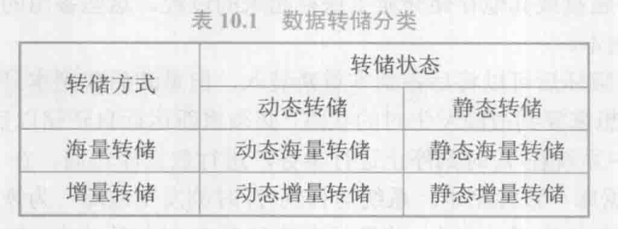

# 第十章 事物的基本概念

## 10.1 事物的基本概念

1. 事务：用户定义的一个数据库操作序列，不可分割的工作单位，是**恢复和并发控制的基本单位**

2. 事物和程序的差别：

   - 在关系数据库中，一个事务可以是一条 SQL 语句，一组 SQL 语句或整个程序
   - 一个程序通常包含多个事务

3. 定义事物：

   ```
   BEGIN TRANSACTION; # 显式开始事务
   COMMIT; # 事务正常结束
   ROLLBACK; # 事务回滚到开始时的状态
   ```

4. 事物的 ACID 特性：

   - 原子性：事务是数据库的逻辑工作单位
   - 一致性：事务执行的结果必须是使数据库从一个一致性状态变到另一个一致性状态
   - 隔离性：一个事务的执行不能被其他事务干扰
   - 持续性：一个事务一旦提交，它对数据库中数据的改变就应该是永久性的

故障恢复可以保证事务的原子性和持续性
并发控制可以保证事务的一致性和隔离性

## 10.2 数据库恢复概述

数据库管理系统必须具有把数据库从错误状态恢复到某一已知的正确状态的功能

恢复子系统是数据库管理系统的一个重要组成部分

恢复技术是衡量系统优劣的重要指标

## 10.3 故障的种类

1. **事物内部的故障**
   - 通过事物程序本身发现
   - 非预期的，不能由应用程序处理
   - 事务故障的恢复：事务撤消
2. **系统故障（软故障）**：造成系统停止运转的任何事件，使系统要重新启动
   - 一些尚未完成的事务的结果可能已送入物理数据库，造成数据库可能处于不正确状态
     - 恢复策略：系统重新启动时，恢复程序让所有非正常终止的事务回滚，强行撤消（UNDO）所有未完成事务
   - 有些已完成的事务可能有一部分甚至全部留在缓冲区，尚未写回到磁盘上的物理数据库中，系统故障使得这些事务对数据库的修改部分或全部丢失
     - 恢复策略：系统重新启动时，恢复程序需要重做（REDO）所有已提交的事务
3. **介质故障（硬故障）**：外存故障。磁盘损坏、磁头碰撞、瞬时强磁场干扰。破坏数据库或部分数据库，并影响正在存取这部分数据的所有事务
4. **计算机病毒**：人为的故障或破坏，可以繁殖和传播，造成对计算机系统包括数据库的危害

恢复操作的基本原理：冗余。利用存储在系统别处的冗余数据来重建数据库中已被破坏或不正确
的那部分数据

## 10.4 恢复的实现技术

### 10.4.1 数据转储

1. 转储：数据库管理员定期地将整个数据库复制到磁带、磁盘或其他存储介质上保存起来的过程
2. 备用的数据文本称为**后备副本**或后援副本
3. 重装后备副本只能将数据库恢复到转储时的状态
4. 要想恢复到故障发生时的状态，必须重新运行自转储以后的所有更新事务

静态转储：
（1）在系统中无运行事务时进行的转储操作，转储期间不允许对数据库的任何存取、修改活动
（2）缺点：降低了数据库的可用性

动态转储：转储操作与用户事务并发进行，转储期间允许对数据库进行存取或修改
（1）不用等待正在运行的用户事务结束，不影响新事物的运行
（2）不能保证副本中的数据正确有效



### 10.4.2 登记日志文件

1. 日志文件：记录事务对数据库的更新操作的文件
2. 日志文件的格式：
   - 以记录为单位的日志文件
     - 日志文件中的一个日志记录 (log record)包含
       - 各个事务的开始标记(BEGIN TRANSACTION)
         各个事务的结束标记(COMMIT或ROLLBACK)
         各个事务的所有更新操作
     - 以记录为单位的日志文件，每条日志记录的内容
       - 事务标识（标明是哪个事务）
         操作类型（插入、删除或修改）
         操作对象（记录内部标识）
         更新前数据的旧值（对插入操作而言，此项为空值）
         更新后数据的新值（对删除操作而言, 此项为空值）
   - 以数据块为单位的日志文件
     - 事务标识
       被更新的数据

3. 日志的作用
   （1）事务故障恢复和系统故障恢复必须用日志文件。
   （2）在动态转储方式中必须建立日志文件，后备副本和日志文件结合起来才能有效地恢复数据库。
   （3）在静态转储方式中，也可以建立日志文件
4. 登记日志文件：
   （1）登记的次序严格按并发事务执行的时间次序
   （2）必须先写日志文件，后写数据库

## 10.5 恢复策略

### 10.5.1 事务故障的恢复

事务故障：事务在运行至正常终止点前被终止

恢复方法：由恢复子系统利用日志文件撤消（UNDO）此事务已对数据库进行的修改

事务故障的恢复由系统自动完成，对用户是透明的，不需要用户干预

事务故障的恢复步骤：
（1）反向扫描文件日志（即从最后向前扫描日志文件），查找该事务的更新操作
（2）对该事务的每一条更新操作执行逆操作，即将日志记录中“更新前的值” 写入数据库
（3）继续反向扫描日志文件，查找该事务的其他更新操作，并做同样处理
（4）如此处理下去，直至读到此事务的开始标记，事务故障恢复就完成了

### 10.5.2 系统故障的恢复

 恢复方法：Undo 故障发生时未完成的事务；Redo 已完成的事务

恢复步骤：
（1）正向扫描日志文件
（2）对撤销(UNDO)队列事务进行撤销(UNDO)处理
（3）对重做(REDO)队列事务进行重做(REDO)处理

### 10.5.3 介质故障处理

介质故障的恢复的工作：重装数据库、重做已完成的事务（需要数据库管理员介入）

恢复步骤：
（1）装入最新的后备数据库副本(离故障发生时刻最近的转储副本) ，使数据库恢复到最近一次转储时的一致性状态
（2）装入有关的日志文件副本(转储结束时刻的日志文件副本) ，重做已完成的事务

## 10.6 具有检查点的恢复技术

具有检查点（checkpoint）的恢复技术：在日志文件中增加检查点记录；增加重新开始文件；恢复子系统在登录日志文件期间动态地维护日志

检查点记录的内容：建立检查点时刻所有正在执行的事务清单；这些事务最近一个日志记录的地址

重新开始文件的内容：记录各个检查点记录在日志文件中的地址

动态维护日志文件的方法：周期性地执行如下操作：建立检查点，保存数据库状态

利用检查点的恢复步骤：
（1）从重新开始文件中找到最后一个检查点记录在日志文件中的地址，由该地址在日志文件中找到最后一个检查点记录
（2）从检查点开始正向扫描日志文件，直到日志文件结束

## 10.7 数据库镜像

数据库管理系统自动把整个数据库或其中的关键数据复制到另一个磁盘上
数据库管理系统自动保证镜像数据与主数据的一致性
每当主数据库更新时，数据库管理系统自动把更新后的数据复制过去