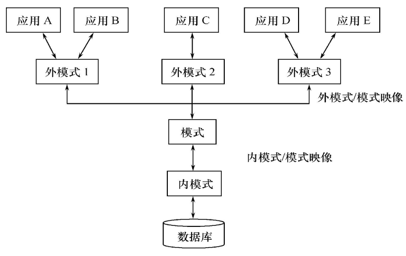

# 第 1 章 绪论

## 1.1 数据库系统概述

### 1.1.1 数据库的四个基本概念

#### 数据（data）

具有一定**语义**含义、可被记录的已知信息

数据（计算机世界） & 信息（现实世界）：数据是信息的载体，信息是数据的内涵

数据的特性：
（1）表现多样性
（2）可构造性
（3）挥发性 / 持久性
（4）私有性 / 共享性
（5）“量”

#### 数据库（DataBase，DB）

数据库：长期储存在计算机内、有组织的、可共享的大量数据的集合

数据库中的数据特点：
（1）永久存储
（2）有组织
	· 按一定的数据模型组织、描述和储存
	· 统一组织、集中存储
	· 较小的数据冗余度
	· 较高的数据独立性
（3）可共享

#### 数据库管理系统（DataBase Management System，DBMS）

位于用户（应用程序）与数据库（操作系统）之间的一层数据管理软件，用于管理数据库的大型系统软件

区别于其它计算机软件系统的特点
· 能对持久性数据进行管理
· 能对大量数据进行有效存取
· 可实现数据共享（众多用户可使用同一数据）

作用：科学地组织和存储数据、高效地获取和维护数据

功能：
（1）数据定义
（2）数据组织、存储、管理
（3）数据操纵
（4）数据库的事务管理和运行管理
（5）数据库的建立和维护功能
（6）其他功能

##### 数据库子语言

数据子语言（data sub_language）
· 数据定义语言：数据模式的定义、数据存取方法的选择
· 数据操纵语言：数据的操纵（查询、增删改）
· 数据控制语言：数据完整性、安全性的定义与检查；并发控制、故障恢复

使用方式：
（1）交互式命令语言：终端上即时操作；以命令行交互方式或批处理方式独立运行
（2）宿主型语言：被嵌入到某种**宿主语言**中

#### 数据库系统（DataBase System，DBS）

##### 数据库系统与数据库应用系统

数据库系统（DBS）：由数据库、数据库管理系统、数据库管理员、支撑系统运行所必须的系统软件和硬件平台组成的存储、管理、处理和维护数据的系统

数据库应用系统（Database Application System）是由数据库系统、应用开发工具、应用系统、数据库用户组成的计算机系统

统称为“数据库系统”

构成：数据库、数据库管理系统、数据库管理员 DBA

##### 数据库用户（Database User）

规划、设计、建立、访问、管理、维护数据库的人员

三类：
（1）数据库管理员：数据库的规划、设计、建立、管理、维护、监视的专职人员
（2）应用开发人员
（3）最终用户：通过应用系统访问使用数据库的人员

数据库管理员（DataBase Administrator，DBA）

数据库应用系统（DataBase Application System）

### 1.1.2 数据管理技术的产生和发展

数据管理：对数据进行分类、组织、编码、存储、检索和维护，是数据处理的中心问题
数据处理：对各种数据进行收集、存储、加工和传播的一系列活动的总和

数据管理技术的发展动力：应用需求的推动、计算机硬件的发展、计算机软件的发展

数据管理技术的发展过程：
（1）人工管理阶段（20世纪50年代中之前）
（2）文件系统阶段（20世纪50年代末--60年代中）
（3）数据库系统阶段（20世纪60年代末--现在）

数据库系统的发展历史：
（1）层次/网状数据库
（2）关系数据库
（3）关系数据库系统扩展
（4）新型数据管理系统

### 1.1.3 数据库系统的特点

#### 数据结构化

数据模型

#### 数据的共享性高，冗余度低且易扩充

数据共享

数据冗余

数据一致性

#### 数据独立性高

数据独立性：数据与应用程序的互不依赖性

物理独立性
逻辑独立性

#### 数据由数据库管理系统统一管理和控制

数据库管理系统提供的数据控制功能：
（1）数据的安全性保护
（2）数据的完整性检查
（3）并发控制
（4）数据库恢复

## 1.2 数据模型

 数据模型是对现实世界数据特征的抽象，是数据库系统的核心和基础

### 1.2.1 两类数据模型

#### 概念模型

按用户的观点对数据和信息建模。数据库设计

#### 逻辑模型和物理模型

逻辑模型：按计算机系统的观点对数据建模。用于DBMS实现

物理模型：对数据最底层的抽象，描述数据在系统内部的表示方式和存取方法

将现实世界抽象为信息世界，再将信息世界转换为机器世界

### 1.2.2 概念模型

#### 信息世界中的基本概念

（1）实体：客观存在并可相互区别的事物
（2）属性：实体具有的某一特性
（3）联系：现实世界中事物内部以及事物之间的联系，在信息世界中反映为实体（型）内部的联系和实体（型）之间的联系
（4）实体型：用实体名及其所有属性名的集合来抽象和刻画同类实体
（5）实体值：一个实体的所有属性值的集合
（6）实体集：同一类型实体的集合
（7）码：唯一标识实体的属性集

#### 实体之间的联系

概念模型的表示方法：实体-联系方法（E-R方法 / **E-R模型**）

实体之间的联系有‘一对一、一对多、多对多’等多种类型，联系的函数关系

### 1.2.3 数据模型的组成要素

#### 数据结构

描述数据库的组成对象，以及对象之间的联系。是划分不同类型数据模型的依据

#### 数据操作

查询、更新（包括插入、删除、修改）

#### 数据的完整性约束条件

一组完整性规则的集合

完整性规则：给定的数据模型中数据及其联系所具有的制约和依存规则

### 1.2.4 常用数据模型

格式化模型
— 层次模型
— 网状模型

关系模型

对象模型
— 面向对象数据模型
— 对象关系数据模型

### 1.2.7 关系模型

#### 基本概念

关系：一个关系对应通常说的一张表
元组：表中的一行即为一个元组
属性：表中的一列即为一个属性，给每一个属性起一个名称即属性名
主码：也称码键。表中的某个属性组，它可以唯一确定一个元组
域：是一组具有相同数据类型的值的集合。属性的取值范
围来自某个域。
分量：元组中的一个属性值。
关系模式：对关系的描述：关系名（属性1，属性2，…，属性n）

#### 数据操纵和完整性约束

#### 关系模型的优缺点

## 1.3 数据库系统的结构

### 1.3.1 数据库系统模式的概念

型：对某一类数据的结构和属性的说明
值：型的一个具体赋值

模式：数据库逻辑结构和特征的描述
实例：反映数据库某一时刻的状态，是模式的一个具体值

### 1.3.2 数据库系统的三级模式

模式（也称‘逻辑模式’）：数据库中全体数据的逻辑结构和特征的描述。数据库系统模式结构的中间层

外模式：对数据库用户（包括应用程序员和最终用户）使用的局部数据的逻辑结构和特征的描述

内模式：数据物理结构和存储方式的描述

### 1.3.3 数据库的二级映像与数据独立性

#### 外模式／模式映像

模式：描述数据的全局逻辑结构
外模式：数据的局部逻辑结构

#### 模式／内模式映像

模式／内模式映象定义了数据全局逻辑结构与存储结构之间的对应关系

#### 数据库的二级映像

保证了数据库外模式的稳定性
从底层保证了应用程序的稳定性，除非应用需求本身发生变化，否则应用程序一般不需要修改

## 1.4 数据库系统的组成

（1）硬件平台及数据库

（2）软件

（3）人员

- 数据库管理员
- 系统分析员和数据库设计人员
- 应用程序员
- 用户