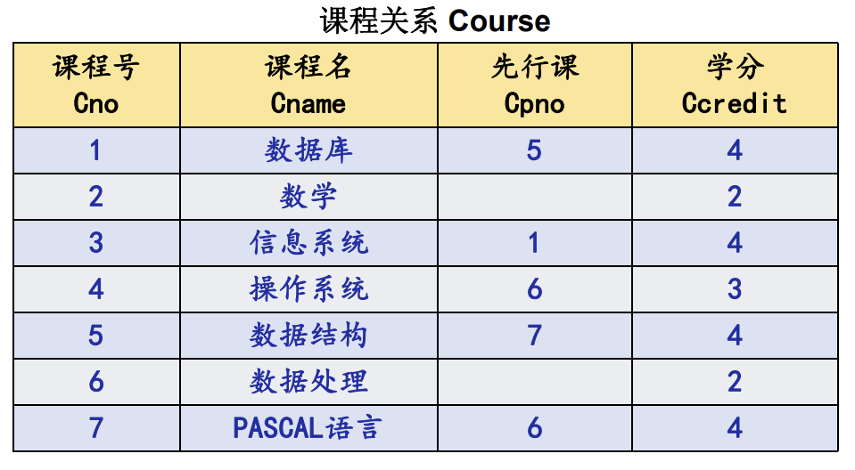
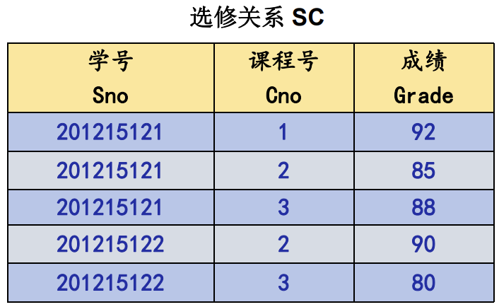
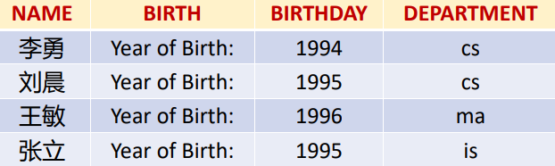
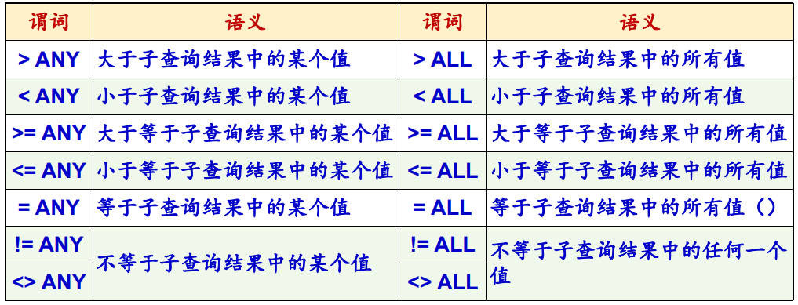

# 第三章 关系数据库标准语言 SQL

## 3.1 SQL 概述

### 3.1.1 SQL 的产生和发展

### 3.1.2 SQL 的特点

SQL是一个通用的、功能极强的关系数据库语言

- 综合统一
  - 可以独立完成数据库生命周期中的全部活动
- 高度非过程化
  - SQL只要提出“做什么”，无须了解存取路径。存取路径的选择以及SQL的操作过程由系统自动完成。
- 面向集合的操作方式
  - 操作对象、查找结果可以是元组的集合
  - 一次插入、删除、更新操作的对象可以是元组的集合
- 以同一种语法结构提供两种使用方法
  - 独立用于联机交互
  - 嵌入到高级语言
- 语言简洁，易学易用
  - 数据定义：CREATE，DROP，ALTER
  - 数据查询：SELECT
  - 数据操作：INSERT，UPDATE，DELETE
  - 数据控制：GRANT，REVOKE

### 3.1.3 SQL 的基本概念


- 基本表
  - 本身独立存在的表
  - 一个关系对应一个基本表
  - 一个（或多个）基本表对应一个存储文件
  - 一个表可以带若干索引
- 存储文件
  - 逻辑结构组成了关系数据库的内模式
  - 物理结构对用户是隐蔽的
- 视图
  - 从一个或几个基本表导出的表
  - 数据库中只存放视图的定义而不存放视图对应的数据
  - 视图是一个虚表
  - 用户可以在视图上再定义视图


## 3.2 学生-课程数据库

学生关系 Student、课程关系 Course、选修关系 SC







## 3.3 数据定义

SQL 的数据定义功能：模式定义、表定义、视图和索引的定义


- 一个关系数据库管理系统的实例（Instance）中可以建立多个数据库
- 一个数据库中可以建立多个模式
- 一个模式下通常包括多个表、视图和索引等数据库对象

### 3.3.1 模式的定义和删除

**1、定义模式**

定义模式实际上定义了一个命名空间，在这个空间中可以定义该模式包含的数据库对象，例如基本表、视
图、索引等。

在 CREATE SCHEMA 中可以接受 CREATE TABLE，CREATE VIEW 和 GRANT 子句。

```
CREATE SCHEMA <模式名> AUTHORIZATION <用户名> [<表定义子句>| <视图定义子句>|<授权定义子句>]
```

**2、删除模式**

```
DROP SCHEMA <模式名> <CASCADE|RESTRICT>
```

- CASCADE（级联）：删除模式的同时把该模式中所有的数据库对象全部删除
- RESTRICT（限制）：如果该模式中定义了下属的数据库对象（如表、视图等），则拒绝该删除语句的执行；仅当该模式中没有任何下属的对象时才能执行。

### 3.3.2 基本表的定义、删除与修改

**1、定义基本表**

```
CREATE TABLE <表名>
	(<列名> <数据类型>[ <列级完整性约束条件> ]
	[,<列名> <数据类型>[ <列级完整性约束条件>] ] 
	…
	[,<表级完整性约束条件> ] );
```

- <表名>：所要定义的基本表的名字
- <列名>：组成该表的各个属性（列）
- <列级完整性约束条件>：涉及相应属性列的完整性约束条件
- <表级完整性约束条件>：涉及一个或多个属性列的完整性约束条件
- 如果完整性约束条件涉及到该表的多个属性列，则必须定义在表级上，否则既可以定义在列级也可以定义在表级。

例：

```sql
CREATE TABLE
    Course (
        Cno CHAR(4) PRIMARY KEY,    /*Cno 是主码*/
        Cname CHAR(40) NOT NULL,    /*Cname 不能取空值*/
        Cpno CHAR(4),
        Ccredit SMALLINT,
        FOREIGN KEY (Cpno) REFERENCES Course (Cno) /*Cpno 是外码，被参照表是 Course，被参照列是 Cno*/
    );
```

**2、数据类型**

SQL 中域的概念用数据类型来实现，定义表的属性时需要指明其数据类型及长度 


**3、模式与表**

**4、修改基本表**

```
ALTER TABLE <表名>
	[ ADD[COLUMN] <新列名> <数据类型> [ 完整性约束 ] ]
	[ ADD <表级完整性约束>]
	[ DROP [ COLUMN ] <列名> [CASCADE| RESTRICT] ]
	[ DROP CONSTRAINT<完整性约束名>[ RESTRICT | CASCADE ] ]
	[ALTER COLUMN <列名><数据类型> ] ;
```

- <表名>是要修改的基本表
- `ADD` 子句用于增加新列、新的列级完整性约束条件和新的表级完整性约束条件
- `DROP COLUMN` 子句用于删除表中的列
  - 如果指定了 `CASCADE` 短语，则自动删除引用了该列的其他对象
  - 如果指定了 `RESTRICT` 短语，则如果该列被其他对象引用，关系数据库管理系统将拒绝删除该列
- `DROP CONSTRAINT` 子句用于删除指定的完整性约束条件
- `ALTER COLUMN` 子句用于修改原有的列定义，包括修改列名和数据类型

**5、删除基本表**

```
DROP TABLE <表名>［RESTRICT| CASCADE］;
```

- RESTRICT：删除表是有限制的
  - 欲删除的基本表不能被其他表的约束所引用
  - 如果存在依赖该表的对象，则此表不能被删除
- CASCADE：删除该表没有限制。在删除基本表的同时，相关的依赖对象一起删除

### 3.3.3 索引的建立与删除

建立索引的目的：加快查询速度

- 由数据库管理员或表的拥有者建立
- 由关系数据库管理系统自动完成维
- 关系数据库管理系统自动使用合适的索引作为存取路径，用户不必也不能显式地选择索引

关系数据库管理系统中常见索引：顺序文件上的索引、B+树索引、散列（hash）索引、位图索引

**1、建立索引**

```
CREATE [UNIQUE] [CLUSTER] INDEX <索引名>
ON <表名>(<列名>[<次序>][,<列名>[<次序>] ]…);
```

- <表名>：要建索引的基本表的名字
- 索引：可以建立在该表的一列或多列上，各列名之间用逗号分隔
- <次序>：指定索引值的排列次序，升序：ASC，降序：DESC。缺省值：ASC
- UNIQUE：此索引的每一个索引值只对应唯一的数据记录
- CLUSTER：表示要建立的索引是聚簇索引

**2、修改索引**

重新命名：`ALTER INDEX <旧索引名> RENAME TO <新索引名>`

**3、删除索引**

```
DROP INDEX <索引名>;
```

### 3.3.4 数据字典

数据字典是关系数据库管理系统内部的一组系统表，它记录了数据库中所有定义信息

关系数据库管理系统在执行SQL的数据定义语句时，实际上就是在更新数据字典表中的相应信息


## 3.4 数据查询

```
SELECT * | colname { , colname ... } 	//目标子句
FROM tablename { , tablename ... }		//范围子句
[ WHERE search_condition ]				//条件子句
[ GROUP BY colname { , colname ... }	//分组子句
[ HAVING group_condition ] ]			//分组查询子句
[ ORDER BY colname [ ASC | DESC ]		//排序输出子句
{ , colname [ ASC | DESC ] ... } ];
```

- 基本映像语句的组成
  - 目标子句：`SELECT [distinct] column-name-list | expressions |`
    - 定义生成结果表时目标列的投影方式
  - 范围子句： FROM tablename { , tablenam ... }
    - 指定操作对象（被访问的表）
  - 条件子句： WHERE search_condition
    - 用于定义查询条件（即结果表中的元组 必须满足的条件）

### 3.4.1 单表查询

**1、选择表中的若干列**：投影运算

（1）查询指定列：在 `SELECT 子句 <目标列表达式>` 中指定要查询的属性列

```SQL
SELECT Sno, Sname
FROM Student;
```

（2）查询全部列

```sql
SELECT * FROM Student
```

（3）查询经过计算的值

- SELECT 子句的 <目标列表达式> 不仅可以为表中的列，也可以是：
  - 算术表达式
  - 字符串常量、函数

- 使用列别名改变查询结果的列标题

  ```sql
  SELECT
      Sname NAME,
      'Year of Birth:' BIRTH,
      2014 - Sage BIRTHDAY,
      LOWER(Sdept) DEPARTMENT
  FROM
      Student;
  ```

  

**2、选择表中的若干元组**

（1）消除取值重复的行：指定DISTINCT关键词，去掉表中重复的行

（2）查询满足条件的元组


- 比较大小

- 确定范围

- 确定集合：`IN <值表>`，`NOT IN <值表>`

- 字符匹配：`[ NOT ] LIKE ‘<匹配串>’ [ ESCAPE ‘<换码字符>’ ]`

  - 匹配串为固定字符串

  - 匹配串为含通配符的字符串

  - 使用换码字符将通配符转义为普通字符：ESCAPE '＼' 表示“＼”为换码字

    查询以"DB_"开头，且倒数第3个字符为 i的课程的详细情况：

    ```sql
    SELECT *
    FROM Course
    WHERE Cname LIKE 'DB\_%i_ _' ESCAPE;
    ```

- 涉及空值的查询

- 多重条件查询
  - 逻辑运算符：AND 和 OR 来连接多个查询条件
    - AND 的优先级高于 OR
    - 可以用括号改变优先级

**3、ORDER BY 子句**

- 可以按一个或多个列排序
- 升序：ASC；降序：DESC；缺省值为升序
- 对于空值，排序时显示的次序由具体系统实现来决定

**4、聚集函数**

- `COUNT(*)`：统计元组个数
- `COUNT([DISTINCT|ALL] <列名>`：统计一列中值的个数
- `SUM([DISTINCT|ALL] <列名>`：计算一列值的总和（此列必须为数值型）
- `AVG([DISTINCT|ALL] <列名>`：计算一列值的平均值（此列必须为数值型）
- `MAX([DISTINCT|ALL] <列名>`：求一列值中的最大值
- `MIN([DISTINCT|ALL] <列名>`：求一列值中的最小值

在使用聚集函数对一个集合中的元素进行统计计算时，将忽略其中的‘空’值元素

在调用 SUM，AVG，MAX，MIN聚集函数时，将首先剔除掉集合中取值为‘空’的元素，然后再进行统计计算

**5、GROUP BY 子句**

- 如果未对查询结果分组，聚集函数将作用于整个查询结果
- 对查询结果分组后，聚集函数将分别作用于每个组
- 按指定的一列或多列值分组，值相等的为一组

聚集函数的使用：只能用在 SELECT 子句 或 HAVING 子句中

HAVING 短语与 WHERE 子句区别：

- 作用对象不同
- WHERE 子句作用于基表或视图，从中选择满足条件的元组
- HAVING 短语作用于组，从中选择满足条件的组

### 3.4.2 连接查询

- 连接查询：同时涉及两个或两个以上的表的查询
- 连接条件或连接谓词：用来连接两个表的条件。
  -  `[<表名1>.]<列名1> <比较运算符> [<表名2>.]<列名2>`
  - `[<表名1>.]<列名1> BETWEEN [<表名2>.]<列名2> AND [<表名2>.]<列名3>`
- 连接字段：连接谓词中的列名称

**1、等值与非等值连接查询**

等值连接：连接运算符为 =

- **嵌套循环法**：

  - 首先在表1中找到第一个元组，然后从头开始扫描表2，逐一查找满足连接件的元组，找到后就将表1中的第一个元组与该元组拼接起来，形成结果表中一个元组

  - 表2全部查找完后，再找表1中第二个元组，然后再从头开始扫描表2，逐一查找满足连接条件的元组，找到后就将表1中的第二个元组与该元组拼接起来，形成结果表中一个元组

  - 重复上述操作，直到表1中的全部元组都处理完毕

- **索引连接**：
  - 如果在其中一张表的连接字段上建有索引，那么可以用‘索引连接’加快连接操作的执行速度
  - 假设在表2中，连接字段上建有索引，那么基于连接字段的连接操作执行过程如下：
    - 对表1中的每个元组，依次根据其连接字段值查询表2的索引，从中找到满足条件的元组，找到后就将表1中的第一个元组与该元组拼接起来，形成结果表中一个元组
- **排序合并法**：常用于“等值连接”
  - 首先按连接字段对表1和表2排序
  - 对表1的第一个元组，从头开始扫描表2，顺序查找满足连接条件的元组，找到后就将表1中的第一个元组与该元组拼接起来，形成结果表中一个元组。当遇到表2中第一条大于表1连接字段值的元组时，对表2的查询不再继续

一条SQL语句可以同时完成选择和连接查询，这时WHERE子句是由**连接谓词**和**选择谓词**组成的复合条件

**2、自身连接**：一个表与其自己进行连接

- 需要给表起别名以示区别
- 参与连接的两张表有不同的表名（或别名），但所有相应列的列名都是相同的，因此必须通过<表名>.<列名>的方式指定需访问的列

**3、外连接**：以指定表为连接主体，将主体表中不满足连接条件的元组一并输出

- 左外连接：列出左边表中所有的元组
- 右外连接：列出右边表中所有的元组

**4、多表连接**：两个以上的表进行连接

### 3.4.3 嵌套查询

- 子查询的限制：不能使用ORDER BY子句

- 有些嵌套查询可以用连接运算替代

- 不相关子查询：子查询的查询条件不依赖于父查询。由里向外，逐层处理

  相关子查询：……依赖于父查询。由外向里，嵌套循环

**1、带有 IN 谓词的子查询**

例：查询选修了课程名为“信息系统”的学生学号和姓名

```sql
SELECT Sno, Sname
FROM Student				/*最后在Student表中取出选修了3号课程的学生的Sno和Sname*/
WHEREB Sno IN (
        SELECT Sno 			/*然后在SC表中找出选修了3号课程的学生学号*/
        FROM SC
        WHERE Cno IN (
                SELECT Cno 	/*首先在Course表中找出“信息系统”的课程号，为3号*/
                FROM Course
                WHERE Cname = '信息系统'
            )
    );
```

用表连接查询 替 IN谓词 + 子查询

```sql
SELECT
    Student.Sno,
    Student.Sname
FROM
    Student,
    SC,
    Course
WHERE
    Student.Sno = SC.Sno
    AND SC.Cno = Course.Cno
    AND Course.Cname = '信息系统';
```

**2、带有比较运算符的子查询**

**3、带有 ANY（SOME）或 ALL 谓词的子查询**



**4、带有 EXISTS 谓词的子查询**

- EXISTS 谓词

  - 存在量词 $\exists$

  - 带有 EXISTS 谓词的子查询不返回任何数据，只产生逻辑真值“true”或逻辑假值“false”
    - 若内层查询结果非空，则外层的 WHERE 子句返回真值
    - 若内层查询结果为空，则外层的 WHERE 子句返回假值

  - 由 EXISTS 引出的子查询，其目标列表达式通常都用 * 

- NOT EXISTS 谓词
  - 若内层查询结果非空，则外层的 WHERE 子句返回假值
  - 若内层查询结果为空，则外层的 WHERE 子句返回真值
- 不同形式的查询间的替换：所有带IN谓词、比较运算符、ANY和ALL谓词的子查询都能用带EXISTS谓词的子查询等价替换
- 用 EXISTS / NOT EXISTS 实现全称量词：转化为等价的关系：$(\forall x) P ≡ ¬(\exist x(¬ P))$

例：查询至少选修了学生201215122选修的全部课程的学生号码


### 3.4.4 集合查询

1. **并操作** UNION
   - UNION：将多个查询结果合并起来时，系统自动去掉重复元组
   - UNION ALL：将多个查询结果合并起来时，保留重复元组

2. **交操作 INTERSECT**

3. **差操作 EXCEPT**

### 3.4.5 基于派生表的查询

子查询生成的临时派生表（Derived Table）成为主查询的查询对象

### 3.4.6 SELECT 语句的一般格式


## 3.5 数据更新

### 3.5.1 插入数据

1. **插入元组**

   ```
   INSERT
   INTO <表名> [(<属性列1>[,<属性列2 >…)]
   VALUES (<常量1> [,<常量2>]… );
   ```

2. **插入子查询结果**

   ```
   INSERT 
   INTO <表名> [(<属性列1> [,<属性列2>… )]
   子查询;
   ```

### 3.5.2 修改数据

```
UPDATE <表名>
SET <列名> = <表达式> [ , <列名> = <表达式> ] …
[WHERE <条件>] ;
```

1. 修改某个元组的值
2. 修改多个元组的值
3. 带子查询的修改语句

### 3.5.3 删除数据

```
UPDATE <表名>
SET <列名> = <表达式> [ , <列名> = <表达式> ] …
[WHERE <条件>] ;
```

1. 删除某个元组的值
2. 删除多个元组的值
3. 带子查询的删除语句


## 3.6 空值的处理

1. 空值的产生
2. 空值的判断：用 IS NULL 或 IS NOT NULL 来表示
3. 空值的约束条件
   - 有 NOT NULL 约束条件的不能取空值
   - 主码（primary key）属性不能取空值
   - UNIQUE 唯一性约束：当属性值非空时，其值在表中具有唯一性
4. 空值的算术运算、比较运算和逻辑运算
   - 空值与另一个值（包括另一个空值）的算术运算的结果为空值
   - 空值与另一个值（包括另一个空值）的比较运算的结果为UNKNOWN
   - 有UNKNOWN后，传统二值（TRUE，FALSE）逻辑就扩展成了三值逻辑
   - 空值参与比较运算的结果为逻辑假FALSE


## 3.7 视图

视图的特点：虚表，是从一个或几个基本表（或视图）导出的表

### 3.7.1 定义视图

1. 建立视图

   ```
   CREATE VIEW <视图名> [(<列名> [,<列名>]...)]
   AS <子查询> 
   [WITH CHECK OPTION];
   ```

   - WITH CHECK OPTION：对视图进行UPDATE，INSERT和DELETE操作时要保证更新、插入或删除的行满足视图定义中的谓词条件
   - 子查询可以是任意的SELECT语句
   - 组成视图的属性列名：全部省略 或 全部指定
   - 关系数据库管理系统执行CREATE VIEW语句时只是把视图定义存入数据字典，并不执行其中的SELECT语句
   - 若一个视图是从单个基本表导出的，并且只是去掉了基本表的某些行和某些列，但保留了主码，我们称这类视图为**行列子集视图**

2. 删除视图

   ```
   DROP VIEW <视图名> [CASCADE];
   ```

### 3.7.2 查询视图

关系数据库管理系统实现视图查询的方法：**视图消解法**

### 3.7.3 更新视图

### 3.7.4 视图的作用

1. 简化用户的操作
2. 使用户能以多种角度看待同一数据
3. 对重构数据库提供了一定程度的逻辑独立性
4. 对机密数据提供安全保护
5. 更清晰地表达查询

