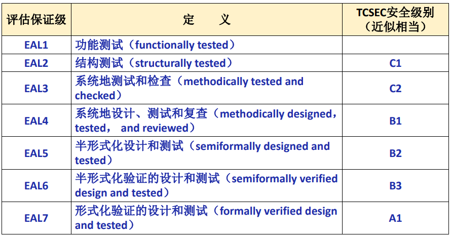
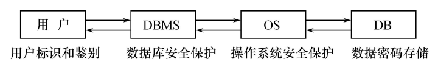
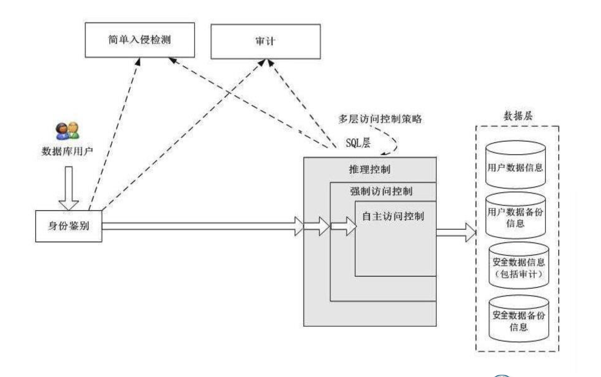
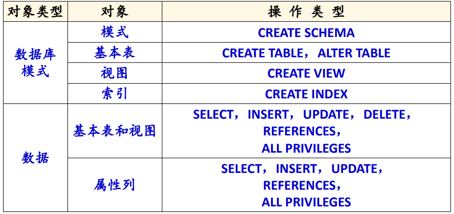
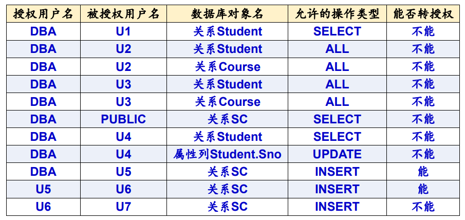
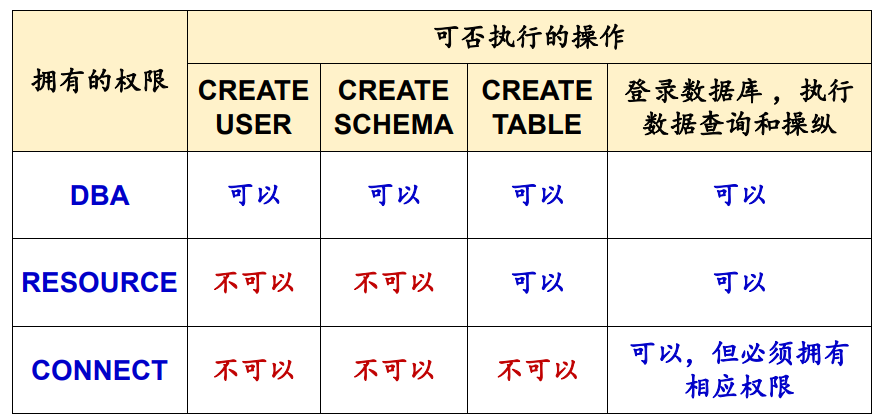

# 第四章 数据库安全性

## 4.1 数据库安全性概述

数据库的安全性是指保护数据库以防止不合法使用所造成的数据泄露、更改或破坏

### 4.1.1 数据库的不安全因素

1. 非授权用户对数据库的恶意存取和破坏
2. 数据库中重要或敏感的数据被泄露
3. 安全环境的脆弱性

### 4.1.2 安全标准简介

TCSEC：安全性级别划分


CC：



## 4.2 数据库安全性控制

计算机系统的安全模型：



数据库管理系统安全性控制模型：



存取控制的流程：

- 首先，数据库管理系统对提出SQL访问请求的数据库用户进行身份鉴别，防止不可信用户使用系统。
- 然后，在SQL处理层进行自主存取控制和强制存取控制，进一步可以进行推理控制。
- 还可以对用户访问行为和系统关键操作进行审计，对异常用户行为进行简单入侵检测

### 4.2.1 用户身份鉴别

1. 用户标识：由用户名和用户标识号组成

2. 方法：
   - 静态口令鉴别
   - 动态口令鉴别
   - 生物特征鉴别
   - 智能卡鉴别

### 4.2.2 存取控制

1. 存取控制机制包括**定义用户权限**和**合法权限检查**

   - 定义用户权限，并将用户权限登记到数据字典中
     - 用户对某一数据对象的操作权力称为**权限**
     - DBMS 提供适当的语言来定义用户权限，存放在数据字典中，称做**安全规则或授权规则**

   - 合法权限检查
     - 用户发出存取数据库操作请求
     - DBMS 查找数据字典，进行合法权限检查

2. 定义用户权限和合法权限检查机制一起组成了数据库管理系统的**存取控制子系统**

3. **C2** 级的数据库管理系统支持：**自主存取控制（DAC）**
   - 用户对不同的数据对象有不同的存取权限
   - 不同的用户对同一对象也有不同的权限
   - 用户还可将其拥有的存取权限转授给其他用户
4. **B1** 级的数据库管理系统支持：**强制存取控制（MAC）**
   - 每一个数据对象被标以一定的密级
   - 每一个用户也被授予某一个级别的许可证
   - 对于任意一个对象，只有具有合法许可证的用户才可以存取

### 4.2.3 自主存取控制方法

1. 通过 SQL 的 GRANT 语句 和 REVOKE 语句 实现
2. 用户权限的组成要素：数据库对象 + 操作类型
3. 定义存取权限称为**授权**



### 4.2.4 授权：授予与收回

1. GRANT 语句：将对指定操作对象的指定操作权限授予指定的用户

   ```
   GRANT <权限> [, <权限>] ... 
   ON <对象类型> <对象名> [, <对象类型> <对象名>]…
   TO <用户> [, <用户>] ... 
   [WITH GRANT OPTION];
   ```

   - 授权用户：数据库管理员、数据库对象的创建者、拥有该权限的用户

   - 被授权用户：一个或多个具体用户、一个或多个用户组、PUBLIC

   - WITH GRANT OPTION 子句：被授权用户可以将接受到的权限再授予其他用户，否则，被授权用户不能把接受到的权限再转授给其他用户

   - 传播权限

     

2. REVOKE 语句：收回授予的权限

   ```
   REVOKE <权限> [, <权限>] ...
   ON <对象类型> <对象名> [, <对象类型> <对象名>]…
   FROM <用户> [, <用户>] ... [CASCADE | RESTRIC
   ```

3. 创建数据库模式的权限

   - CREATE USER 语句格式：`CREATE USER <username> [WITH] [DBA | RESOURCE | CONNECT];`
   - 只有系统的超级用户才有权创建一个新的数据库用户
   - 新创建的数据库用户，可以被授予以下三种权限之一
     - CONNECT
       - 如没有指定创建的新用户的权限，默认该用户拥有CONNECT权限
       - 拥有CONNECT权限的用户不能创建新用户，不能创建模式，也不能创建基本表，只能登录数据库
     - RESOURCE
       - 拥有RESOURCE权限的用户能创建基本表和视图，成为所创建对象的属主
       - 但不能创建模式，不能创建新的用户
     - DBA
       - 拥有DBA权限的用户是系统中的超级用户，可以创建新的用户、创建模式、创建基本表和视图等
       - DBA拥有对所有数据库对象的存取权限，还可以把这些权限授予一般用户

   

### 4.2.5 数据库角色

1. 数据库角色：被命名的一组与数据库操作相关的权限

   - 角色是权限的集合
   - 可以为一组具有相同权限的用户创建一个角色
   - 简化授权的过程

2. 角色的创建：`CREATE ROLE <角色名>;`

3. 给角色授权：

   ```
   GRANT <权限> [, <权限>]…
   ON <对象类型> <对象名>
   TO <角色> [, <角色>]
   ```

4. 将一个角色授予其他的角色或用户：

   ```
   GRANT <角色1> [, <角色2>] …
   TO <角色3> [, <用户1>] …
   [ WITH ADMIN OPTION ] ;
   ```

5. 角色权限的收回

   ```
   REVOKE <权限> [, <权限>]…
   ON <对象类型> <对象名>
   FROM <角色> [, <角色>]
   ```

### 4.2.6 强制存取控制方法

1. 在强制存取控制中，数据库管理系统所管理的全部实体被分为**主体**和**客体**两大类

   - 主体是系统中的活动实体
     - 数据库管理系统所管理的实际用户
     - 代表用户的各进程
   - 客体是系统中的被动实体，受主体操纵：文件、基本表、索引、视图

2. 方法：**敏感度标记**

   - 对于主体和客体，DBMS 为它们每个实例（值）指派一个敏感度标记
   - 分级：绝密（TS）、机密（S）、可信（C）、公开（P）

3. 主体的敏感度标记称为**许可证级别**

   客体的敏感度标记称为**密级**

4. 规则
   - （下读）仅当主体的许可证级别大于或等于客体的密级时，该主体才能读取相应的客体
   - （上写）仅当主体的许可证级别小于或等于客体的密级时，该主体才能写相应的客体
5. DAC + MAC

## 4.3 视图机制

把要保密的数据对无权存取这些数据的用户隐藏起来，对数据提供一定程度的安全保护 

间接地实现支持存取谓词的用户权限定义

## 4.4 审计

1. 定义：
   - 启用一个专用的审计日志（Audit Log）将用户对数据库的所有操作记录在上面
   - 审计员利用审计日志监控数据库中的各种行为，找出非法存取数据的人、时间和内容
   - C2以上安全级别的DBMS必须具有审计功能
2. 审计功能的可选性
   - 审计很费时间和空间
   - DBA可以根据应用对安全性的要求，灵活地打开或关闭审计功能
   - 审计功能主要用于安全性要求较高的部门

3. 审计事件
   - 服务器事件
   - 系统权限
   - 语句事件
   - 模式对象事件
4. 审计功能
   - 基本功能：提供多种审计查阅方式
   - 多套审计规则：一般在数据库初始化时设定
   - 提供审计分析和报表功能
   - 审计日志管理功能
   - 提供查询审计设置及审计记录信息的专门视图

5. 审计级别
   - 用户级审计
   - 系统级审计
6. 审计语句
   - AUDIT语句：设置审计功能
   - NOAUDIT语句：取消审计功能

## 4.5 数据加密

1. 防止数据库中数据在存储和传输中失密的有效手段
2. 根据一定的算法将原始数据—明文（Plain text）变换为不可直接识别的格式—密文（Cipher text）
3. 方法
   - 存储加密：透明存储加密、非透明存储加密
   - 传输加密：链路加密、端到端加密

## 4.6 其他安全性保护

推理控制、隐蔽信道、数据隐私保护