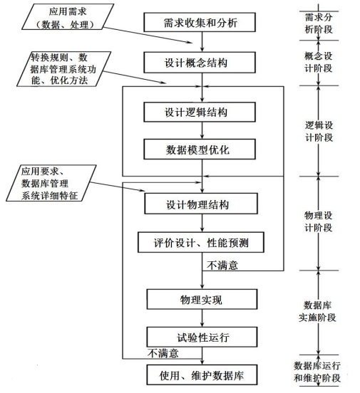
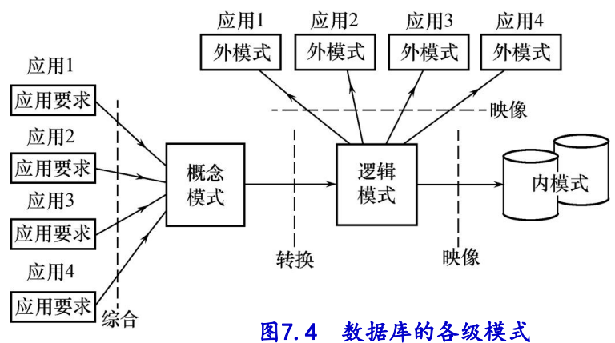

# 第七章 数据库设计

## 7.1 数据库设计概述

数据库设计的特点：
	三分技术，七分管理，十二分基础数据
	结构设计与行为设计相结合

数据库设计方法
	New Orleans 方法
	E-R 模型方法
	3NF 方法
	OOP 方法
	UML 方法

数据库设计的基本步骤（数据库分析的 6 个阶段）

数据库的各级模式

## 7.2 需求分析

- 需求分析：收集用户对数据库的信息要求、处理要求、安全性与完整性要求
- 数据字典：是关于数据库中数据的描述，即元数据，不是数据本身。包括数据项、数据结构、数据流、数据存储结构、处理过程。

## 7.3 概念结构设计

- E-R 图
  - 属性必须是不可分的数据项，不能包含其他属性。
  - 属性不能与其他实体具有联系，即 E-R 图中所表示的联系是实体之间的联系。

## 7.4 逻辑结构设计

- 逻辑结构设计：E-R 图转换为关系模型，即数据库的表
  - 一个 1:1 联系可以转换为一个独立的关系模式，也可以与任意一端对应的关系模式合并
  - 一个 1:n 联系可以转换为一个独立的关系模式，也可以与 n 端对应的关系模式合并
  - 一个 m:n 联系转换为一个关系模式（本质是多对多关系需要单独开一个表来维护）
  - 三个或三个以上实体间的一个多元联系转换为一个关系模式
  - 具有相同码的关系模式可合并
- 设计用户子模式（视图）

- 关系模式的分解（重要，如果问到能还原即可）

  - 水平分解
    - 分解后表的属性不变，但是存储的数据变了
    - 把关系的元祖分为若干子集合

  - 垂直分解
    - 分解后表的属性变了
    - 把属性分为若干子集合，形成若干子关系模式