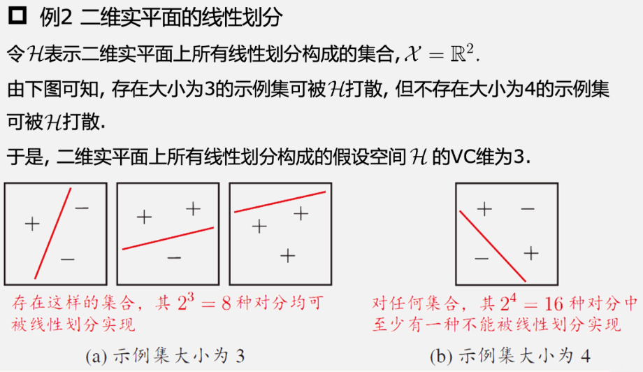

# 12 计算学习理论

## 12.1 基础知识

样例集：独立同分布样本，仅考虑二分类问题 $D=\{(\boldsymbol{x}_1,y_1),(\boldsymbol{x}_2,y_2),\cdots,(\boldsymbol{x}_m,y_m)\}$，$\boldsymbol{x}_i\in\mathcal{X}$，$y_i\in\mathcal{Y}=\{-1,+1\}$

$h$ 为从 $\mathcal{X}$ 到 $\mathcal{Y}$ 的一个映射

泛化误差：分类器的期望误差 $E(h;\mathcal{D})=P_x\thicksim\mathcal{D}(h(\boldsymbol{x})\neq y)$

经验误差：分类器在给定样例集上的平均误差 $\hat{E}(h;\mathcal{D})=\frac1m\sum_{i=1}^m\mathbb{I}(h(\boldsymbol{x}_i)\neq y_i)$

由于 $D$ 是 $\mathcal{D}$ 的独立同分布采样，因此 $h$ 的经验误差的期望等于其泛化误差。在上下文明确时，将 $E(h;\mathcal{D})$ 和 $\hat{E}(h;\mathcal{D})$ 分别简记为 $E(h)$ 和 $\hat{E}(h)$

误差参数 $\epsilon$：令 $\epsilon$ 为 $E(h)$ 的上限，即 $E(h)\leq\epsilon$，我们通常用  $\epsilon$ 表示预先设定的学得模型所应满足的误差要求

一致性：若 $h$ 在数据集 $D$ 上的经验误差为 0，则称 $h$ 与 $D$ 一致，否则不一致

不合：对于任意两个映射 $h_1,h_2\in\mathcal{X}\to\mathcal{Y}$，通过“不合”度量它们的差别： $d(h_1,h_2)=P_{x\thicksim\mathcal{D}}(h_1(\boldsymbol{x})\neq h_2(\boldsymbol{x}))$

## 什么是“学习”

概念：概念是从样本空间 $\chi$ 到标记空间 $y$ 的映射，它决定示例 $x$ 的真实标记 $y$

- 目标概念：如果对任何样例 $(x,y)$ 均有 $c(x)=y$ 成立，则称 $c$ 为目标概念
- 概念类：所有我们希望学得的目标概念所构成的集合称为“概念类”，用符号 $c$ 表示

假设空间：给定学习算法 $\mathcal{L}$，它所考虑的所有可能概念的集合，用符号 $\mathcal{H}$ 表示

- 由于学习算法事先并不知道概念类的真实存在，因此 $\mathcal{H}$ 和 $\mathcal{C}$ 通常是不同
  的，学习算法会把自认为可能的目标概念集中起来构成 $\mathcal{H}$
- 对于 $h\in\mathcal{H}$，由于并不能确定它是否真是目标概念，因此称为“假设”。显然，$h$ 也是从样本空间 $\chi$ 到标记空间 $y$ 的映射
- 学习过程可以视为 $\mathcal{L}$ 在 $\mathcal{H}$ 中进行的搜索过程

可分的与不可分的：

- 可分的：若目标概念 $c\in\mathcal{H}$，即 $\mathcal{H}$ 中存在假设能将所有的示例完全正确分开（按照与真实标记一致的方式），则称该问题对学习算法 $\mathcal{L}$ 是“可分的”，也称“一致的”

- 不可分的：若目标概念 $c\notin\mathcal{H}$，则 $\mathcal{H}$ 中不存在任何假设能将所有的示例完全正确分开，则称该问题对学习算法是“不可分的”，也称“不一致的”

对于给定训练集 $D$，我们希望基于学习算法 $\mathcal{L}$ 学得的模型所对应的假设 $h$ 尽可能接近目标概念 $c$

机器学习过程受到很多因素的制约

- 获得的训练集 $D$ 往往仅包含有限数量的样例，因此通常会存在一些 $D$ 在上“等效”的假设，学习算法无法区别这些假设
- 从分布 $\mathcal{D}$ 采样得到 $D$ 的过程有一定的偶然性，即便对同样大小的不同训练集，学得结果也可能有所不同

## 12.2 PAC 学习

概率近似正确（PAC）：以较大概率学得误差满足预设上限的模型

令 $\delta$ 表示置信度，上述要求形式化为：

**PAC 辨识**：对 $0<\epsilon$，$\delta<1$，所有 $c\in\mathcal{C}$ 和分布 $\mathcal{D}$，若存在学习算法 $\mathcal{L}$，其输出假设 $h\in\mathcal{H}$ 满足 $P(E(h)\leq\epsilon)\geq1-\delta$，则称学习算法 $\mathcal{L}$ 能从假设空间 $\mathcal{H}$ 中 PAC 辨识概念类 $\mathcal{C}$ 

**PAC 可学习**：令 $m$ 表示从分布 $\mathcal{D}$ 中独立同分布采样得到的样例数目，$0<\epsilon,\delta<1$，对所有分布 $\mathcal{D}$，若存在学习算法 $\mathcal{L}$ 和多项式函数 $\text{poly}(\cdot,\cdot,\cdot,\cdot)$，使得对于任何 $m \geq \text{poly}(1/\epsilon,1/\delta,size(\boldsymbol{x}),size(c))$，$\mathcal{L}$ 能从假设空间 $\mathcal{H}$ 中 PAC 辨识概念类 $\mathcal{C}$，则称概念类 $\mathcal{C}$ 对假设空间 $\mathcal{H}$ 而言是PAC 可学习的，有时也简称概念类 $\mathcal{C}$ 是PAC可学习的

**PAC 学习算法**：若学习算法 $\mathcal{L}$ 使概念类 $\mathcal{C}$ 为 PAC 可学习的，且 $\mathcal{L}$ 的运行时间也是多项式函数 $\text{poly}(1/\epsilon,1/\delta,size(\boldsymbol{x}),size(c))$，则称概念类 $\mathcal{C}$ 是高效 PAC 可学习的，称 $\mathcal{L}$ 为概念类 $\mathcal{C}$ 的 PAC 学习算法

**样本复杂度**：满足 PAC 学习算法 $\mathcal{L}$ 所需的 $m \geq \text{poly}(1/\epsilon,1/\delta,size(\boldsymbol{x}),size(c))$ 中最小的 $m$，称为学习算法 $\mathcal{L}$ 的样本复杂度

PAC 学习的意义：把对复杂算法的时间复杂度的分析转为对样本复杂度的分析

假设空间 $\mathcal{H}$ 的复杂度是影响可学习性的重要因素之一：$\mathcal{H}$ 越大，其包含任意目标概念的可能性越大，但从中找到某个具体概念的难度也越大。$\mathcal{H}$ 有限时，称 $\mathcal{H}$ 为有限假设空间

恰 PAC 可学习：假设空间 $\mathcal{H}$ 包含了学习算法 $\mathcal{L}$ 所有可能输出的假设，在 PAC 学习中假设空间与概念类完全相同，即 $\mathcal{H}=\mathcal{C}$

## 12.3 有限假设空间

### 12.3.1 可分情形

目标概念 $c$ 属于假设空间 $\mathcal{H}$，即 $c\in\mathcal{H}$。给定包含 $m$ 个样例的训练集 $D$，找出满足误差参数的假设：

由于 $c$ 存在于假设空间 $\mathcal{H}$ 中，因此任何在训练集 $D$ 上出现标记错误的假设肯定不是目标概念 $c$

保留与 $D$ 一致的假设，剔除与 $D$ 不一致的假设

若训练集 $D$ 足够大，则可不断借助 $D$ 中的样例剔除不一致的假设，直到 $\mathcal{H}$ 中仅剩下一个假设为止，这个假设就是目标概念 $c$

训练集 $D$ 的规模使得学习算法 $\mathcal{L}$ 以概率 $1-\delta$ 找到目标假设的 $\epsilon$ 近似，则

$$
m\geq\dfrac{1}{\epsilon}\left(\ln|\mathcal{H}|+\ln\dfrac{1}{\delta}\right)
$$
可分情况下的有限假设空间 $H$ 都是 PAC 可学习的，输出假设 $h$ 的泛化误差随样例数目的增多而收敛到 0，收敛速率为 $O(\frac1m)$

### 12.3.2 不可分情形

目标概念 $c$ 不属于假设空间 $\mathcal{H}$

若 $\mathcal{H}$ 为有限假设空间，$0 < \delta < 1$，则对任意 $h \in \mathcal{H}$，有
$$
P\left(|E(h)-\hat{E}(h)|\leq\sqrt{\frac{\ln|\mathcal{H}|+\ln(2/\delta)}{2m}}\right)\geq1-\delta
$$
经验风险最小化原则：令 $h$ 表示学习算法 $\mathcal{L}$ 输出的假设，若 $h$ 满足 $\hat E(h)=\min_{h'\in\mathcal H}\hat E(h')$，则称 $\mathcal{L}$ 为满足经验风险最小化原则的算法

**不可知 PAC 学习**：令 $m$ 表示从分布 $\mathcal{D}$ 中独立同分布采样得到的样例数目，$0<\epsilon,\delta<1$，对所有分布 $\mathcal{D}$，若存在学习算法 $\mathcal{L}$ 和多项式函数 $\text{poly}(\cdot,\cdot,\cdot,\cdot)$，使得对于任何 $m \geq \text{poly}(1/\epsilon,1/\delta,size(\boldsymbol{x}),size(c))$，$\mathcal{L}$ 能从假设空间 $\mathcal{H}$ 中输出满足下式的假设
$$
P(E(h)-\min_{h'\in\mathcal{H}}E(h')\leq\epsilon)\geq1-\delta
$$
则称假设空间 $\mathcal{H}$ ​是不可知 PAC 可学习的

## 12.4 VC 维

给定假设空间 $\mathcal{H}$ 和示例集 $D=\{\boldsymbol x_1,\boldsymbol{x}_2,\cdots,\boldsymbol{x}_m\}$，$\mathcal{H}$ 中每个假设 $h$ 都能对 $D$ 中示例赋予标记，标记结果可表示为 $h|_D=\{(h(\boldsymbol{x}_1),h(\boldsymbol{x}_2),\cdots,h(\boldsymbol{x}_m))\}$

随着 $m$ 的增大，$\mathcal{H}$ 中所有假设对 $D$ 中的示例所能赋予标记的可能结果数也增大

**增长函数**：
$$
\prod_{\mathcal{H}}(m)=\max_{\{\boldsymbol{x}_1,\boldsymbol{x}_2,\cdot,\boldsymbol{x}_m\}\subseteq\mathcal{H}}|\{(h(\boldsymbol{x}_1),h(\boldsymbol{x}_2),\cdots,h(\boldsymbol{x}_m))|h\in\mathcal{H}\}|
$$
利用增长函数来估计经验误差与泛化误差之间的关系：对假设空间 $\mathcal{H}$，$m\in\mathbb{N}$，$0<\epsilon<1$ 和任意 $h\in\mathcal{H}$ 有
$$
P(|E(h)-\hat{E}(h)|>\epsilon)\leq4\prod_{\mathcal{H}}(2m)\exp(-\frac{m\epsilon^2}{8})
$$
对分：对二分类问题来说，$\mathcal{H}$ 中的假设对 $D$ 中示例赋予标记的每种可能结果称为对 $D$ 的 一 种对分

打散：假设空间 $\mathcal{H}$ 能实现示例集上的所有对分

VC 维：假设空间 $\mathcal{H}$ 的 VC 维生能被 $\mathcal{H}$ 打散的最大示例集的大小

VC维与增长函数之间的定量关系：Sauer 引理

若假设空间 $\mathcal{H}$ 的 VC 维为 $d$，则对任意 $m\in\mathbb{N}$ 有 $\prod_{\mathcal{H}}\left(m\right)\leq\sum_{i=0}^{d}\binom{m}{i}$

由 Sauer 引理可以计算出增长函数的上界：若假设空间 $\mathcal{H}$ 的 VC 维为 $d$，则对任意整数 $m\geq d$ 有 $\prod_{\mathcal{H}}(m)\leq\left(\frac{e\cdot m}{d}\right)^d$

基于 VC 维的泛化误差界：若假设空间 $\mathcal{H}$ 的 VC 维为 $d$，则对任意 $m>d$，$0<\delta<1$ 和 $h\in\mathcal{H}$ 有 $P\left(|E(h)-\hat{E}(h)|\leq\sqrt{\frac{8d\ln\frac{2em}{d}+8\ln\frac{4}{\delta}}{m}}\right)\geq1-\delta$

上式的泛化误差界只与样例数目 m 有关，收敛速率为 $O\left(\frac{1}{\sqrt{m}}\right)$

上式的泛化误差界与数据分布 $\mathcal{D}$ 及样例集 $D$ 无关

因此，基于 VC 维的泛化误差界**分布无关**且**数据独立**

任何 VC 维有限的假设空间 $\mathcal{H}$ 都是（不可知）PAC 可学习的

## 12.5 Rademacher 复杂度

给定训练集 $D=\{(\boldsymbol{x}_1,y_1),(\boldsymbol{x}_2,y_2),\cdots,(\boldsymbol{x}_m,y_m)\}$，则假设 $h$ 的经验误差为 $\hat{E}(h)=\frac{1}{2}-\frac{1}{2m}\sum_{i=1}^{m}y_ih(\boldsymbol{x}_i)$

其中 $\frac 1m\sum _{i= 1}^my_ih( x_i) $ 体现了预测值 $h( x_i)$ 与样例真实标记 $y_i$ 之间的一致性

若对于所有的 $i\in \{ 1, 2, \cdots , m\}$，都有 $h( \boldsymbol{x}_i) = y_i$，则 $\frac 1m\sum _{i= 1}^my_ih( \boldsymbol{x}_i)$ 取最大值 1

经验误差最小的假设是 $\arg\max_{h\in\mathcal{H}}\frac{1}{m}\sum_{i=1}^{m}y_{i}h(\boldsymbol{x}_{i})$

**Rademacher 复杂度**：

- 函数空间 $\mathcal{F}$ 关于 $Z$ 的经验 Rademacher 复杂度：
  $$
  \hat{R}_Z(\mathcal{F})=\mathbb{E}_\sigma\left[\sup_{f\in\mathcal{F}}\frac{1}{m}\sum_{i=1}^m\sigma_if(\boldsymbol{z}_i)\right]
  $$
  

  - 其中 $\mathcal{F}:\mathcal{Z}\to\mathbb{R}$ 为实值函数空间，$Z=\{z_1,z_2,\cdots,z_m\}$，其中 $z_i\in\mathcal{Z}$

  - 经验 Rademacher 复杂度衡量了函数空间 $\mathcal{F}$ 与随机噪声在集合 $Z$ 中的相关性

- 函数空间 $\mathcal{F}$ 关于 $Z$ 上分布 $\mathcal{D}$ 的经验 Rademacher 复杂度
  $$
  R_m(\mathcal{F})=\mathbb{E}_{Z\subseteq\mathcal{Z}:|Z|=m}\left[\hat{R}_Z(\mathcal{F})\right]
  $$
  

  - 基于 Rademacher 复杂度可得关于函数空间 $\mathcal{F}$ 的泛化误差界

**定理 12.5**：对实值函数空间 $\mathcal{F}:\mathcal{Z}\to[0,1]$，根据分布 $\mathcal{D}$ 从 $\mathcal{Z}$ 中独立同分布采样得到示例 $Z=\{z_1,z_2,\cdots,z_m\},z_i\in\mathcal{Z},0<\delta<1$，对任意 $f\in\mathcal{F}$，以至少 $1-\delta$ 的概率有
$$
\begin{aligned}&\mathbb{E}[f(z)]\leq\frac{1}{m}\sum_{i=1}^{m}f(z_{i})+2R_{m}(\mathcal{F})+\sqrt{\frac{\ln(1/\delta)}{2m}}\\&\mathbb{E}[f(z)]\leq\frac{1}{m}\sum_{i=1}^{m}f(z_{i})+2\hat{R}_{Z}(\mathcal{F})+3\sqrt{\frac{\ln(2/\delta)}{2m}}\end{aligned}
$$
**定理 12.6**：基于 Rademacher 复杂度的泛化误差界：对假设空间 $\mathcal{H}:\mathcal{X}\to\{-1,+1\}$，根据分布 $\mathcal{D}$ 从 $\mathcal{X}$ 中独立同分布采样得到示例集 $D=\{\boldsymbol{x}_1,\boldsymbol{x}_2,\cdots,\boldsymbol{x}_m\}$，$\boldsymbol{x}_i\in\mathcal{X}$，$0>\delta<1$，对任意 $h\in\mathcal{H}$，以至少 $1-\delta$ 的概率有
$$
\begin{gathered}E(h)\leq\hat{E}(h)+R_{m}(\mathcal{H})+\sqrt{\frac{\operatorname{ln}(1/\delta)}{2m}},\\E(h)\leq\hat{E}(h)+\hat{R}_{D}(\mathcal{H})+3\sqrt{\frac{\ln(2/\delta)}{2m}}.\end{gathered}
$$
Rademacher 复杂度与增长函数之间的关系：**定理 12.7**

假设空间 $\mathcal{H}$ 的 Rademacher 复杂度为 $R_m(\mathcal{H})$ 与增长函数 $\prod_{\mathcal{H}}(m)$ 满足：

$$
R_m(\mathcal{H})\leq\sqrt{\frac{2\ln\prod_{\mathcal{H}}(m)}{m}}
$$
由定理 12.6、定理 12.7、推论 12.2 可得：

$$
E(h)\leq\hat{E}(h)+\sqrt{\frac{2d\ln\frac{em}{d}}{m}}+\sqrt{\frac{\ln(1/\delta)}{2m}}
$$

## 12.6 稳定性

给定 $D=\{\boldsymbol{z}_1=(\boldsymbol{x}_1,y_1),\boldsymbol{z}_2=(\boldsymbol{x}_2,y_2),\cdots,\boldsymbol{z}_m=(\boldsymbol{x}_m,y_m)\}$，$\boldsymbol{x}_i\in\mathcal{X}$ 是来自分布 $\mathcal{D}$ 的独立同分布示例，$y_i\in \{ - 1, + 1\}$。对假设空间 $\mathcal{H} : \mathcal{X} \to \{ - 1, + 1\}$ 和学习算法 $\mathcal{L}$，令 $\mathcal{L}_D\in\mathcal{H}$ 表示基于训练集 $D$ 从假设空间 $\mathcal{H}$ 中学得的假设

- $D^{\setminus i}$ 表示移除 $D$ 中第 $i$ 个样例得到的集合：$D^{\setminus i}=\{\boldsymbol{z}_1,\boldsymbol{z}_2,\cdots,\boldsymbol{z}_{i-1},\boldsymbol{z}_{i+1},\cdots,\boldsymbol{z}_m\}$
- 替换 $D$ 中 第 $i$ 个样例得到的集合 $D^i=\{\boldsymbol{z}_1,\boldsymbol{z}_2,\cdots,\boldsymbol{z}_{i-1},\boldsymbol{z}_i',\boldsymbol{z}_{i+1},\cdots,\boldsymbol{z}_m\}$

其中 $z_i^\prime=(x_i^{\prime}$，$y_i^{\prime})$，$x_i^{\prime}$ 服从分布 $\mathcal{D}$ 并独立于 $D$

损失函数：$\ell(\mathcal{L}_D(\boldsymbol{x}),y):\mathcal{Y}\times\mathcal{Y}\longmapsto\mathbb{R}^+$刻画假设 $\mathcal{L}_D$ 的预测标记 $\mathcal{L}_D(x)$ 与真实标记 $y$ 之间的差别，简记为 $\ell(\mathcal{L}_D,\boldsymbol{z})$

- 泛化损失：$\ell(\mathcal{L},D)=\mathbb{E}_{x\in\mathcal{X},z=(\boldsymbol{x},y)}[\ell(\mathcal{L}_{D},\boldsymbol{z})]$

- 经验损失：$\hat\ell(\mathcal L,D)=\frac{1}{m}\sum_{i=1}^{m}\ell(\mathcal L_{D},\boldsymbol{z}_{i})$
- 留一损失：$\ell_{loo}(\mathcal{L},D)=\frac{1}{m}\sum_{i=1}^{m}\ell(\mathcal{L}_{D^{\setminus i}},z_{i})$

**算法的均匀稳定性**：对任何 $x\in\mathcal{X}$，$\boldsymbol{z}=(\boldsymbol{x},y)$，若学习算法 $\mathcal{L}$ 满足 $|\ell(\mathcal{L}_D,\boldsymbol{z})-\ell(\mathcal{L}_{D^{\setminus i}},\boldsymbol{z})|\leq\beta,i=1,2,\cdots,m$ 则称 $\mathcal{L}$ 关于损失函数 $\ell$ 满足 $\beta$ - 均匀稳定性

若算法 $\mathcal{L}$ 关于损失函数 $\ell$ 满足 $\beta$ - 均匀稳定性，则有
$$
\begin{aligned}
|\ell(\mathcal{L}_{D},z)-\ell(\mathcal{L}_{D^{i}},z)|
&\leq |\ell(\mathcal{L}_{D},z)-\ell(\mathcal{L}_{D^{\setminus i}},z)|+|\ell(\mathcal{L}_{D^{i}},z)-\ell(\mathcal{L}_{D^{\setminus i}},z)| \\
&\leq 2\beta\end{aligned}
$$
若损失函数 $\ell$ 有界，对所有 $D$ 和 $\boldsymbol z=(\boldsymbol{x},y)$ 有 $0\leq\ell(\mathcal{L}_D,\boldsymbol{z})\leq M$，则有

**定理 12.8**

给定从分布 $\mathcal{D}$ 上独立同分布采样得到的大小为 $m$ 的示例集 $D$，若学习算法 $\mathcal{L}$ 满足关于损失函数 $\ell$ 的 $\beta$ - 均匀稳定性，且损失函数 $\ell$ 的上界为 $M$，同时 $0<\delta<1$，则对任意 $m\geq1$，以至少 $1-\delta$ 的概率有
$$
\ell(\mathcal{L},\mathcal{D})\leq\hat{\ell}(\mathcal{L},D)+2\beta+(4m\beta+M)\sqrt{\frac{\ln(1/\delta)}{2m}}\\
\ell(\mathcal{L},\mathcal{D})\leq\ell_{loo}(\mathcal{L},D)+\beta+(4m\beta+M)\sqrt{\frac{\ln(1/\delta)}{2m}}
$$

- 经验损失与泛化损失之间差别的收敛率为 $\beta\sqrt{m}$
  若 $\beta = O( \frac 1m)$ 则可保证收敛率为 $O(\frac1{\sqrt{m}})$
- 该收敛率与基于 VC 维和 Rademacher 复杂度得到的收敛率一致

