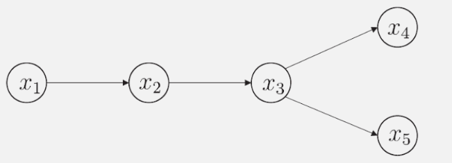
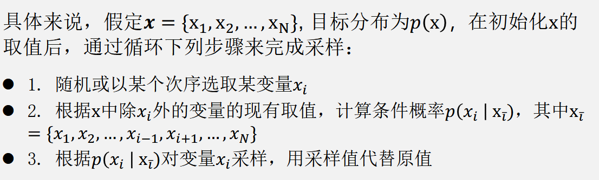
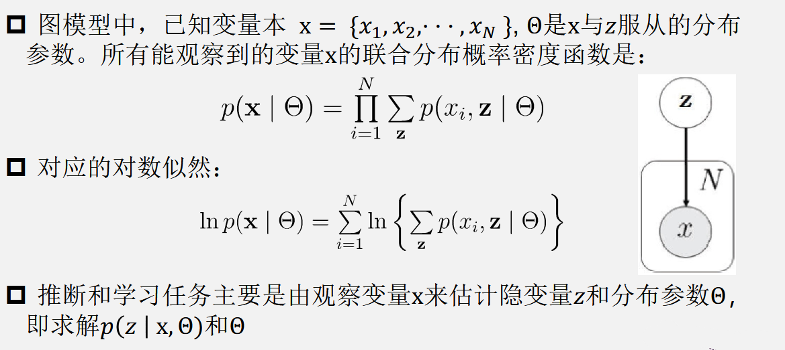

# 14 概率图模型

## 14.1 隐马尔可夫模型（HMM）

状态变量： $\{y_1,y_2,...,y_n\}$，不可被观测

观测变量：$\{x_1,x_2,...,x_n\}$，表示第 i 时刻观测值集合

t 时刻的状态 $y_t$ 仅依赖于 t-1 时刻的状态 $y_{y-1}$ 

所有变量的联合概率分布为
$$
P(x_1,y_1,\ldots,x_n,y_n)=P(y_1)P(x_1\mid y_1)\prod_{i=2}^nP(y_i\mid y_{i-1})P(x_i\mid y_i)
$$
确定一个 HMM 需要三组参数 $\lambda=[A,B,\pi]$

- 状态转移概率：模型在各个状态间转换的概率
- 输出观测概率：模型根据当前状态获得各个观测值的概率
- 初始状态概率：模型在初始时刻各个状态出现的概率

通过指定状态空间 $\gamma$，观测空间 $\chi$ 和上述三组参数，就能确定一个隐马尔可夫模型。给定 $\lambda=[A,B,\pi]$，它按如下过程产生观测序列：
  1. 设置 t = 1，并根据初始状态 $\pi$ 选择初始状态 $y_1$
 2. 根据状态 $y_t$ 和输出观测概率 B 选择观测变量取值 $x_t$
 3. 根据状态 $y_t$ 和状态转移矩阵 A 转移模型状态，即确定 $y_t+1$
 4. 若 t< n，设置 t = t+1，并转到（2）步，否则停止

## 14.2 马尔可夫随机场（MRF）

极大团：对于图中结点的一个子集，若其中任意两结点间都有边连接，则称该结点子集为一个“团”。若一个团中加入另外任何一个结点都不再形成团，则称该团为“极大团”

多个变量之间的连续分布可基于团分解为多个因子的乘积，每个因子只与一个团相关

## 14.3 条件随机场

条件随机场对多个变量给定相应观测值后的条件概率进行建模

链式条件随机场（CRF）

特征函数

## 14.4 学习与推断

假设图模型所对应的变量集 $\mathbf{x}=\{x_1,x_2,\cdots,x_n\}$ 能分为 $\mathbf{X}_F$ 和 $\mathbf{X}_E$ 两个不相交的变量集，推断问题的目标就是计算边际概率 $p( \mathbf{x} _F)$ 或者条件概率$p(\mathbf{x}_F \mid \mathbf{x}_E)$。同时，由条件概率定义容易有
$$
P(\mathbf{x}_F\mid\mathbf{x}_E)=\frac{P(\mathbf{x}_E,\mathbf{x}_F)}{P(\mathbf{x}_E)}=\frac{P(\mathbf{x}_E,\mathbf{x}_F)}{\sum_{\mathbf{x}_F}P(\mathbf{x}_E,\mathbf{x}_F)}
$$
其中，联合概率 $P(\mathbf{x}_E,\mathbf{x}_F)$ 可基于图模型获得，所以推断问题的关键就在于如何高效计算边际分布，即 $P(\mathbf{x}_E)=\sum_{\mathbf{x}_F}P(\mathbf{x}_E,\mathbf{x}_F)$

### 14.4.1 变量消去

计算边缘概率 $P(x_5)$
$$
\begin{aligned}
P(x_{5})&=\sum_{x_{4}}\sum_{x_{3}}\sum_{x_{2}}\sum_{x_{1}}P(x_{1},x_{2},x_{3},x_{4},x_{5})\\&=\sum_{x_4}\sum_{x_3}\sum_{x_2}\sum_{x_1}P(x_1)P(x_2\mid x_1)P(x_3\mid x_2)P(x_4\mid x_3)P(x_5\mid x_3) \\
&=\sum_{x_3}P(x_5\mid x_3)\sum_{x_4}P(x_4\mid x_3)\sum_{x_2}P(x_3\mid x_2)\sum_{x_1}P(x_1)P(x_2\mid x_1)\\
&=\sum_{x_3}P(x_5\mid x_3)\sum_{x_4}P(x_4\mid x_3)\sum_{x_2}P(x_3\mid x_2)m_{12}(x_2) \\
&=\sum_{x_{3}}P(x_{5}\mid x_{3})\sum_{x_{4}}P(x_{4}\mid x_{3})m_{23}(x_{3})\\&=\sum_{x_{3}}P(x_{5}\mid x_{3})m_{23}(x_{3})\sum_{x_{4}}P(x_{4}\mid x_{3})\\&=\sum_{x_{3}}P(x_{5}\mid x_{3})m_{23}(x_{3})m_{43}(x_{3})\\&=m_{35}(x_{5})
\end{aligned}
$$

### 14.4.2 信念传播

一个结点仅在接收到来自其它所有结点的消息后才能向另一个结点发送消息，且结点的边际分布正比于它所接收的消息的乘积：$P(x_i)\propto\prod_{k\in n(i)}m_{ki}(x_i)$

## 14.5 近似推断

### 14.5.1 MCMC 采样

给定连续变量 $x\in X$ 的概率密度函数 $p(x)$，$x$ 在区间 $A$ 中的概率为：$P(A)=\int_Ap(x)dx$

若有函数 $f{:}X\to\mathbb{R}$，可计算 $f(x)$ 的期望：$p(f)=\mathbb{E}_p\left[f(X)\right]=\int_xf(x)p(x)dx$

MCMC 先构造出服从 $p$ 分布的独立同分布随机变量 $x_1,x_2,...,x_{\mathbb{N}}$，再得到无偏估计：$\tilde{p}(f)=\frac1N\sum_{i=1}^Nf(x_i)$

通过“构造平稳分布为 $p$ 的马尔可夫链”来产生样本

假定马尔可夫链 $T$ 的状态转移概率为 $T( x^{\prime } \mid  x)$，t 时刻状态的分布为 $p( x^t)$，则若在某个时刻马尔可夫链满足平稳条件：
$$
p(\mathbf{x}^t)T(\mathbf{x}^{t-1}\mid\mathbf{x}^t)=p(\mathbf{x}^{t-1})T(\mathbf{x}^t\mid\mathbf{x}^{t-1})
$$
则 $p(x)$ 是该马尔可夫链的平稳分布，且马尔可夫链在满足该条件时已经收敛到平稳状态

#### MH 算法

算法每次根据上一轮采样结果 $x^t-1$ 来采样获得候选状态样本 $\mathrm x^*$，但这个样本会以一定概率被拒绝

若从状态 $\mathrm x^{t-1}$ 到状态 $\mathrm x^*$ 的转移概率为 $Q(\mathrm x^* \mid \mathrm x^{t-1})A(\mathrm x^* \mid \mathrm x^{t-1})$，$\mathrm x^*$ 最终收敛到平稳状态，则：
$$
p(\mathbf{x}^{t-1})Q(\mathbf{x}^*\mid\mathbf{x}^{t-1})A(\mathbf{x}^*\mid\mathbf{x}^{t-1})=p(\mathbf{x}^*)Q(\mathbf{x}^{t-1}\mid\mathbf{x}^*)A(\mathbf{x}^{t-1}\mid\mathbf{x}^*)
$$

为达到平稳状态，只需将接受率设置为：
$$
A(\mathbf{x}^*\mid\mathbf{x}^{t-1})=\min\left(1,\frac{p(\mathbf{x}^*)Q(\mathbf{x}^{t-1}\mid\mathbf{x}^*)}{p(\mathbf{x}^{t-1})Q(\mathbf{x}^*\mid\mathbf{x}^{t-1})}\right)
$$

#### 吉布斯采样 - MH 算法的特例

### 14.5.2 变分推断

## 14.6 话题模型 - 隐狄里克雷分配模
型（LDA）

有向图模型，非监督产生式模型，利用海量数据发现文档集合中隐含的语义
