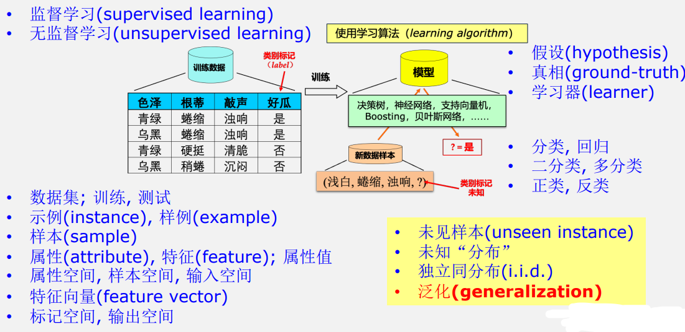
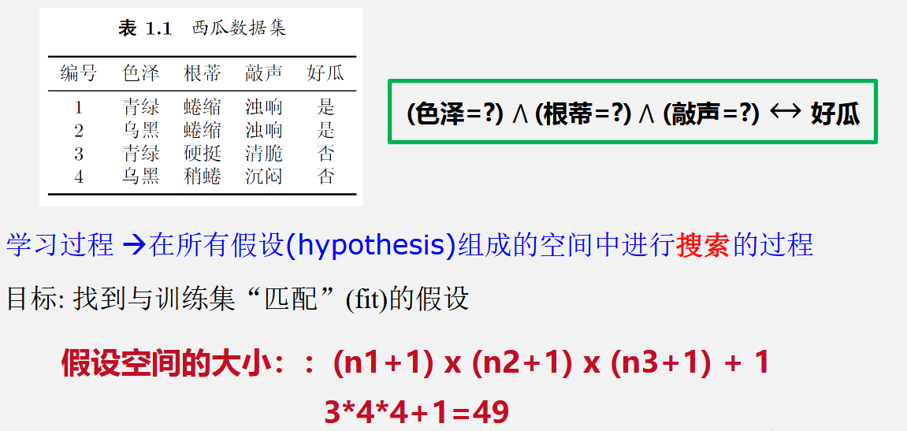

# 第一章 绪论

## 1.1 引言

机器学习致力于研究如何通过计算的手段，利用经验来改善系统自身的性能，从而在计算机上从数据中产生“模型”，用于对新的情况给出判断。

## 1.2 基本术语

模型适用于新样本的能力为泛化能力

## 1.3 假设空间

概念学习：从训练数据中学得概念

版本空间：与训练集一致的假设集合

## 1.4 归纳偏好

NFL定理：一个算法 a 若在某些问题上比另一个算法 b 好，必然存在另一些问题，b 比 a 好

