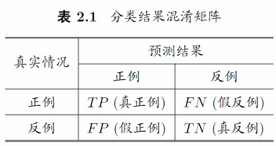
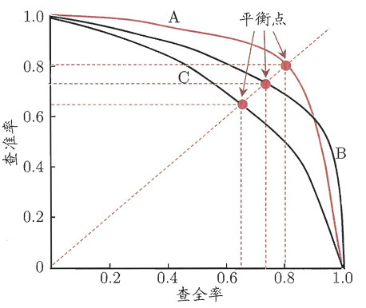
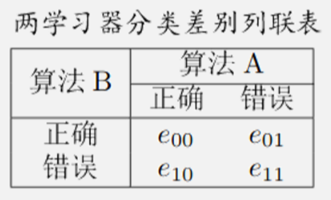
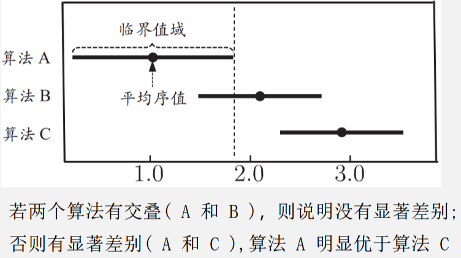
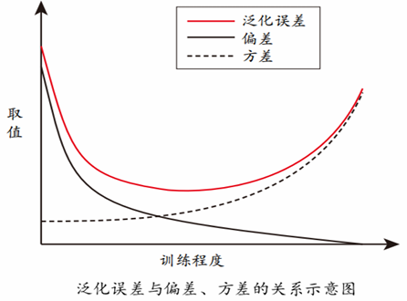

# 第二章 模型评估与选择

## 2.1 经验误差与过拟合

经验误差：在训练集上的误差，亦称“训练误差”
测试误差：在测试集上的误差
泛化误差：在训练集外的所有“未来”样本上的误差

**过拟合**：将训练样本本身的特点当做所有样本的一般性质，导致泛化性能下降

- 优化目标加正则项
- early stop

**欠拟合**：对训练样本的一般性质尚未学好

- 决策树：拓展分支
- 神经网络：增加训练轮数

## 2.2 评估方法

我们假设测试集是从样本真实分布中独立采样获得，将测试集上的“测试误差”作为泛化误差的近似，所以测试集要和训练集中的样本尽量**互斥**

### 2.2.1 留出法

直接将数据集划分为两个互斥集合
保持训练/测试集数据分布一致性（分层采样）
多次随机划分、重复实验取平均值（100次随机划分）
测试集不能太大、不能太小（1/5~1/3）

### 2.2.2 交叉验证法

将数据集分层采样划分为 k 个大小相似的互斥子集，每次用 k-1 个子集的并集作为训练集，余下的子集作为测试集，最终返回 k 个测试结果的均值，k 最常用的取值是10

假设数据集 D 包含 m 个样本，若令 k = m ，则得到留一法：

- 不受随机样本划分方式的影响
- 结果往往比较准确
- 当数据集比较大时，计算开销难以忍受

### 2.2.3 自助法

自助采样：给定包含 m 个样本的数据集 D，我们对它采样产生数据集 $D'$，每次随机从 D 中挑选一个样本，将其拷贝放入 $D’$，然后再将该样本放回初始数据集 D 中，使得该样本在下次采样时仍有可能被采到；该过程重复执行 m 次后，我们就得到了包含 m 个样本的数据集 $D'$

- 实际模型与预期模型都使用 m 个训练样本
- 约有1/3的样本没在训练集中出现（$\lim_{m \rightarrow \infin} \left( 1-\frac{1}{m} \right) = \frac{1}{e} \approx 0.368$）
- 从初始数据集中产生多个不同的训练集，对集成学习有很大的好处
- 自助法在数据集较小、难以有效划分训练/测试集时很有用；由于改变了数据集分布可能引入估计偏差，在数据量足够时，留出法和交叉验证法更常用

### 2.2.4 调参与最终模型

算法的参数：一般由人工设定，亦称“超参数”
模型的参数：一般由学习确定

调参过程相似：先产生若干模型，然后基于某种评估方法进行选择

参数调得好不好对性能往往对最终性能有关键影响

区别：训练集 vs. 测试集 vs. 验证集 (validation set)

算法参数选定后，要用“训练集+验证集”重新训练最终模型

## 2.3 性能度量

衡量模型泛化能力的评价标准，反映了**任务需求**

在预测任务中，给定样例集 $D=\{(\boldsymbol{x}_1,y_1),(\boldsymbol{x}_2,y_2),\ldots,(\boldsymbol{x}_m,y_m)\}$，其中 $y_i$ 是示例 $\boldsymbol x_i$ 的真实标记. 要评估学习器 $f$ 的性能，就要把学习器预测结果 $f(\boldsymbol x)$ 与真实标记  $y$ 进行比较.

回归任务最常用的性能度量是“均方误差”（mean squared error）

$$
E(f;D)=\frac1m\sum_{i=1}^m\left(f\left(\boldsymbol{x}_i\right)-y_i\right)^2
$$
更一般的，对于数据分布 $\mathcal{D}$ 和概率密度函数 $p(\cdot)$，均方误差可描述为

$$
E(f;\mathcal{D})=\int_{\boldsymbol{x}\sim\mathcal{D}}(f\left(\boldsymbol{x}\right)-y)^2p(\boldsymbol{x})\mathrm{d}\boldsymbol{x}
$$

###  2.3.1 错误率与精度

错误率：分错样本占样本总数的比例
精度：分对样本占样本总数的比例

### 2.3.2 查准率、查全率与 F1

对于二分类问题，可将样例根据其真实类别与学习器预测类别的组合划分为真正例、假正例、真反例、假反例四种情形，令 TP、FP 、TN 、FN 分别表示其对应的样例数，则显然有 TP + FP + TN + FN = 样例总数

分类结果的“混淆矩阵"表所示

查准率 $P = \frac{TP}{TP+FP}$，查全率 $R = \frac{TP}{TP+FN}$

根据学习器的预测结果按正例可能性大小对样例进行排序，并逐个把样本作为正例进行预测，则可以得到查准率-查全率曲线，简称“P-R曲线”

- 平衡点（BEP）是曲线上“查准率=查全率”时的取值，可用来用于度量P-R曲线有交叉的分类器性能高低

- 学习器 A 优于学习器 B 优于学习器 C

F1 度量：$F1= \frac{2 \times P \times R}{P + R} = \frac{2 \times TP}{\text{样例总数}+TP-TN}$

- 若对查准率/查全率有不同偏好：$F_\beta=\frac{(1+\beta^2)\times P\times R}{(\beta^2\times P)+R}$
  - 1$\beta > 1$ 时查全率有更大影响，$\beta < 1$ 时查准率有更大影响

在 n 个二分类混淆矩阵上综合考察查准率和查全率：

先在各混淆矩阵上分别计算出查准率和查全率，再计算平均值，这样就得到“宏查准率”（macro-P）、 “宏查全率”（macro-R），以及相应的“宏F1”（macro-F1）
$$
\text{macro-}P=\frac{1}{n}\sum_{i=1}^{n}P_{i}\\
\text{macro-}R=\frac{1}{n}\sum_{i=1}^{n}R_{i}\\
\text{macro-}F1=\frac{2\times\text{macro-}P\times\text{macro-}R}{\text{macro-}P+\text{macro-}R}
$$
还可先将各混淆矩阵的对应元素进行平均，得到 $TP$、$FP$、$TN$、$FN$ 的平均值，分别记为 $\overline{TP}$、$\overline{FP}$、$\overline{TN}$、$\overline{FN}$，再基于这些平均值计算出“微查准率”（micro-P）、“微查全率”（micro-R）和“微$F1$”（micro-F1）：

$$
\text{micro-}P= \frac {\overline {TP}}{\overline {TP}+ \overline {FP}} \\

\text{micro-}R= \frac {\overline {TP}}{\overline {TP}+ \overline {FN}} \\
\text{micro-}F1= \frac {2\times \mathrm{micro- }P\times \mathrm{micro- }R}{\mathrm{micro- }P+ \mathrm{micro- }R}
$$

### 2.3.3 ROC 与 AUC

根据学习器的预测结果对样例排序，并逐个作为正例进行预测，以“假正例率”（FPR）为横轴，“真正例率”（TPR）为纵轴可得到 ROC 曲线，全称“受试者工作特征”
$$
\mathrm{TPR}=\frac{TP}{TP+FN}\\
\mathrm{FPR}=\frac{FP}{TN+FP}
$$
ROC 图的绘制：给 定 $m^+$ 个正例和 $m^{-}$ 个负例，根据学习器预测结果对样例进行排序，将分类阈值设为每个样例的预测值，当前标记点坐标为 $(x,y)$，当前若为真正例，则对应标记点的坐标为 $(x,y+1/m^+)$；当前若为假正例，则对应标记点的坐标为 $(x+1/m^-,y)$，然后用线段连接相邻点

若某个学习器的 ROC 曲线被另一个学习器的曲线“包住”，则后者性能优于前者；否则如果曲线交叉，可以根据 ROC 曲线下面积大小进行比较，也即 AUC 值
$$
\mathrm{AUC}=\frac12\sum_{i=1}^{m-1}(x_{i+1}-x_i)\cdot(y_i+y_{i+1})
$$

### 2.3.4 代价敏感错误率与代价曲线

为权衡不同类型错误所造成的不同损失，可为错误赋予“非均等代价“（unequal cost）。在非均等代价下，不再最小化错误次数，而是最小化“总体代价”

代价曲线

- 横轴：是取值为[0,1]的正例概率代价 
  $$
  P(+)cost=\frac{p\times cost_{01}}{p\times cost_{01}+(1-p)\times cost_{10}}
  $$
  
- 纵轴：是取值为[0,1]的归一化代价
  $$
  cost_{norm}=\frac{\mathrm{FNR}\times p\times cost_{01}+\mathrm{FPR}\times(1-p)\times cost_{10}}{p\times cost_{01}+(1-p)\times cost_{10}}
  $$
  

代价曲线图的绘制

- ROC曲线上每个点对应了代价曲线上的一条线段
- 设ROC曲线上点的坐标为(FPR,TPR),则可相应计算出FNR=1-TPR
- 然后在代价平面上绘制一条从(0,FPR)到(1,FNR)的线段，线段下的面积即表示了该条件下的期望总体代价
- 如此将ROC曲线上的每个点转化为代价平面上的一条线段，然后取所有线段的下界，围成的面积即为所有条件下学习器的期望总体代价

## 2.4 比较检验

两学习器比较

- 交叉验证 t 检验 (基于成对 t 检验)
  - k 折交叉验证；5×2 交叉验证
- McNemar检验 (基于列联表，卡方检验)
- 多学习器比较：Friedman + Nemenyi
  - Friedman检验 (基于序值，F检验; 判断”是否都相同”)
  - Nemenyi后续检验 (基于序值，进一步判断两两差别)

### 2.4.1 假设检验

### 2.4.2 交叉验证方检验

对两个学习器 $A$ 和 $B$，若 $k$ 折交叉验证得到的测试错误率分别为 $\hat{\epsilon}_{1}^{A},\hat{\epsilon}_{2}^{A},\cdots,\hat{\epsilon}_{k}^{A}$ 和 $\hat{\epsilon}_1^{B},\hat{\epsilon}_{2}^{B},\cdots,\hat{\epsilon}_{k}^{B}$，可用 $k$ 折交叉验证“成对 $t$ 检验”进行比较检验。

若两个学习器的性能相同，则他们使用相同的训练/测试集得到的测试错误率应相同，即 $\epsilon_i^A=\epsilon_i^B$

先对每对结果求差，$\Delta_i=\epsilon_i^A-\epsilon_i^B$，若两个学习器性能相同，则差值应该为 0，继而用 $\Delta_1,...,\Delta_k$ 来对“学习器 $A$ 与 $B$ 性能相同”这个假设做 $t$ 检验。

假设检验的前提是测试错误率为泛化错误率的独立采样，然而由于样本有限，使用交叉验证导致训练集重叠，测试错误率并不独立，从而过高估计假设成立的概率，为缓解这一问题，可采用“5×2 交叉验证”法

所谓 5×2 折交叉验证就是做 5 次二折交叉验证，每次二折交叉验证之前将数据打乱，使得 5 次交叉验证中的数据划分不重复。为缓解测试数据错误率的非独立性，仅计算第一次 2 折交叉验证结果的平均值 $\mu=0.5(\Delta_1^1+\Delta_1^2)$ 和每次二折实验计算得到的方差
$$
\begin{aligned}
&\sigma_{i}^{2}=\left(\Delta_{i}^{1}-\frac{\Delta_{i}^{1}+\Delta_{i}^{2}}{2}\right)^{2}+\:\left(\Delta_{i}^{2}-\frac{\Delta_{i}^{1}+\Delta_{i}^{2}}{2}\right)^{2}
\end{aligned}
$$
则变量
$$
\tau_t=\frac{\mu}{\sqrt{0.2\sum_{i=1}^5\sigma_i^2}}
$$
服从自由度为 5 的 t 分布

###  2.4.3 McNemar 检验

对于二分类问题，留出法不仅可以估计出学习器 𝐴 和 𝐵 的测试错误率，还能获得两学习器分类结果的差别，如下表所示：

假设两学习器性能相同 $e_{01}=e_{10}$，则 $|e_{01}-e_{10}|$ 应服从正态分布，McNemar 检验考虑变量

$$
\tau_{\chi^2}=\frac{(|e_{01}-e_{10}|-1)^2}{e_{01}+e_{10}}
$$
服从自由度为 1 的 $\chi^2$ 分布

### 2.4.4 Friedman检验与 Nemenyi 后续检验

在一组数据集上对多个算法进行比较

假定用 $D_1,D_2,D_3,D_4$ 四个数据集对算法 $A,B,C$ 进行比较。先使用留出法或者交叉验证法得到每个算法在每个数据集上的测试结果，然后在每个数据集上根据性能由好到坏排序，并赋序值1，2，...；若算法性能相同则平分序值，继而得到每个算法的平均序值 $r_{i}$

得到表格如下所示，由平均序值进行Friedman检验来判断这些算法是否性能都相同

则变量：
$$
\tau_{\chi^2}=\frac{12N}{k(k+1)}\left(\sum_{i=1}^kr_i^2-\frac{k(k+1)^2}{4}\right)
$$
服从自由度为 $k-1$ 的 $\chi^2$ 分布，其中 $N$，$k$ 表示数据集和算法数目

算法的性能显著不同，可用 Nemenyi 后续检验进一步区分算法

Nemenyi 检验计算平均序值差别的临界阈值
$$
CD=q_{\alpha}\sqrt{\frac{k(k+1)}{6N}}
$$
如果两个算法的平均序值之差超出了临界阈值 𝐶𝐷，则以相应的置信度拒绝“两个算法性能相同”这一假设

根据上例的序值结果可绘制如下 Friedman 检验图
横轴为平均序值，每个算法圆点为其平均序值，线段为临界阈值的大小

## 2.5 偏差与方差

泛化性能是由学习算法的能力、数据的充分性以及学习任务本身的难度共同决定
$$
E(f;D)=bias^2\left(\boldsymbol{x}\right)+var\left(\boldsymbol{x}\right)+\varepsilon^2
$$
泛化误差可分解为偏差、方差与噪声之和

- 偏差——学习算法本身的拟合能力
- 方差度——数据扰动所造成的影响
- 噪声——学习问题本身的难度

在训练不足时，学习器拟合能力不强，训练数据的扰动不足以使学习器的拟合能力产生显著变化，此时偏差主导泛化错误率

随着训练程度加深，学习器拟合能力逐渐增强，方差逐渐主导泛化错误率

训练充足后，学习器的拟合能力非常强，训练数据的轻微扰动都会导致学习器的显著变化，若训练数据自身非全局特性被学到则会发生过拟合

