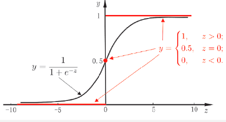
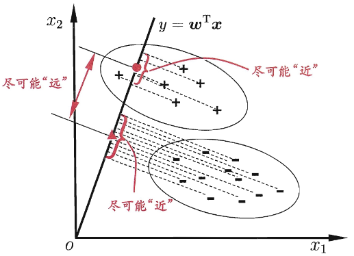

# 第三章 线性模型

## 3.1 基本形式

线性模型试图学得一个通过属性的线性组合来进行预测的函数
$$
f(x)=w_1x_1+w_2x_2+\ldots+w_dx_d+b
$$
$x=(x_1,x_2,...,x_d)$ 是由属性描述的示例，其中 $x_i$ 是 $x$ 在第 $i$ 个属性上的取值

向量形式：$f( x) = w^\text{T}x+ b$，$w= ( w_1, w_2, . . . , w_d)$

 ## 3.2 线性回归

给定数据集 $D=\{(x_1,y_1),(x_2,y_2),...,(x_m,y_m)\}$，其中 $x_i=(x_{i1};x_{i2};...;x_{id}),y_i\in\mathbb{R}$

线性回归的目的：学得一个线性模型以尽可能准确地预测实值输出标记。

单一属性的线性回归目标：$f(x_i)=wx_i+b$，使得 $f(x_i)\simeq y_i $

参数/模型估计：**最小二乘法**

令均方误差最小化，有
$$
\begin{aligned}
(w^*,b^*)& =\arg\min_{(w,b)}\sum_{i=1}^{m}\left(f\left(x_{i}\right)-y_{i}\right)^{2} \\
&=\arg\min_{(w,b)}\sum_{i=1}^m(y_i-wx_i-b)^2
\end{aligned}
$$
求解 $w$ 和 $b$ 使 $E_(w,b)=\sum_{i=1}^m(y_i-wx_i-b)^2$ 最小化的过程，称为线性回归模型的最小二乘“参数估计”。我们可将 $E_{(w,b)}$ 分别对 $w$ 和 $b$ 求导，得到：
$$
\begin{aligned}
\frac{\partial E_{(w,b)}}{\partial w}&=2\left(w\sum_{i=1}^mx_i^2-\sum_{i=1}^m\left(y_i-b\right)x_i\right) \\
\frac{\partial E_{(w,b)}}{\partial b}&=2\left(mb-\sum_{i=1}^m\left(y_i-wx_i\right)\right)
\end{aligned}
$$
令导数为 0，得到闭式解
$$
\begin{align*}
w=\frac{\sum_{i=1}^m y_i(x_i-\bar{x})}{\sum_{i=1}^mx_i^2\frac{1}{m}\left(\sum_{i=1}^mx_i\right)^2} \\

b=\frac{1}{m}\sum_{i=1}^m(y_i-wx_i)
\end{align*}
$$
其中 $\bar{x}=\frac1m\sum_{i=1}^mx_i$ 为 x 的均值

### 多元线性回归

多元线性回归目标：$f(x_i)=w^\mathrm{T} x_i+b$，使得 $f(x_i)\simeq y_i $

把 $w$ 和 $b$ 吸收入向量形式 $\widehat{w}=(w,b)$，数据集表示为
$$
\mathbf{X}=\begin{pmatrix}x_{11}&x_{12}&\cdots&x_{1d}&1\\x_{21}&x_{22}&\cdots&x_{2d}&1\\\vdots&\vdots&\ddots&\vdots&\vdots\\x_{m1}&x_{m2}&\cdots&x_{md}&1\end{pmatrix}=\begin{pmatrix}\boldsymbol{x}_1^\mathrm{T}&1\\\boldsymbol{x}_2^\mathrm{T}&1\\\vdots&\vdots\\\boldsymbol{x}_m^\mathrm{T}&1\end{pmatrix}\:\boldsymbol{y}=(y_1;y_2;\ldots;y_m)
$$
$\hat{\boldsymbol{w}}^*=\arg\min_{\hat{w}}\left(\boldsymbol{y}-\mathbf{X}\hat{\boldsymbol{w}}\right)^\mathrm{T}\left(\boldsymbol{y}-\mathbf{X}\hat{\boldsymbol{w}}\right)$

令 $E_{\hat{w}}=\left(\boldsymbol{y}-\mathbf{X}\hat{\boldsymbol{w}}\right)^\mathrm{T}\left(\boldsymbol{y}-\mathbf{X}\hat{\boldsymbol{w}}\right)$，对 $\hat{\boldsymbol{w}}$ 求导得到 $\frac{\partial E_{\hat{\boldsymbol{w}}}}{\partial\hat{\boldsymbol{w}}}=2\mathbf{X}^\mathrm{T}\left(\mathbf{X}\hat{\boldsymbol{w}}-\boldsymbol{y}\right)$

令上式为零可得 $\hat{\boldsymbol{w}}$ 最优解的闭式解

- $\mathbf{X}^{\mathrm{T}}\mathbf{X}$ 是满秩矩阵或正定矩阵，则 $\hat{\boldsymbol{w}}^{*}=\left(\mathbf{X}^{\mathrm{T}}\mathbf{X}\right)^{-1}\mathbf{X}^{\mathrm{T}}\boldsymbol{y}$

  其中 $(\mathbf{X}^{\mathrm{T}}\mathbf{X})^{-1}$ 是 $\mathbf{X}^{\mathrm{T}}\mathbf{X}$ 的逆矩阵，线性回归模型为 $f\left(\hat{\boldsymbol{x}}_i\right)=\hat{\boldsymbol{x}}_i^\mathrm{T}\left(\mathbf{X}^\mathrm{T}\mathbf{X}\right)^{-1}\mathbf{X}^\mathrm{T}y$

- $\mathbf{X}^{\mathrm{T}}\mathbf{X}$ 不是满秩矩阵，则可解出多个 $\hat{\boldsymbol{w}}$
  - 根据归纳偏好选择解（1.4）
  - 引入正则化（6.4，11.4）

若令 $\ln y=w^\mathrm{T}x+b$，则得到对数线性回归。实际是在用 $e^{w^\mathrm{T}x+b}$ 逼近 y

广义线性模型：考虑单调可微的**联系函数** $g(·)$，$y=g^{-1}\left(w^\mathrm{T}x+b\right)$

（对数线性回归是广义线性模型的特例）

## 3.3 对数几率回归

线性回归模型产生的实值输出 $z=\boldsymbol{w}^\mathrm{T}\boldsymbol{x}+b$，期望输出 $y \in \{0, 1\}$

需要找 z 和 y 的联系函数

理想的“单位阶跃函数”：常用、单调可微、任意阶可导
$$
y=\begin{cases}&0,&z<0;\\&0.5,&z=0;\\&1,&z>0,&\end{cases}
$$
若预测值 z 大于 0 则判为正例，小于 0 反例，0 可以任意判别

理想函数不连续，需要找到替代：对数几率函数：
$$
y=\frac{1}{1+e^{-z}}
$$

以对率函数为联系函数：$y=\frac{1}{1+e^{-z}}$ 变为 $y=\frac{1}{1+e^{-(\boldsymbol{w}^\mathrm{T}\boldsymbol{x}+b)}}$

即：$\ln\frac{y}{1-y}=\boldsymbol{w}^\mathrm{T}\boldsymbol{x}+b$

若将 y 视为样本 x 作为正例的可能性，则 1-y 是其反例可能性，两者的比值 $\frac{y}{1-y}$ 称为**几率**，反映了 x 作为正例的相对可能性，**对数几率**：$\ln \frac{y}{1-y}$

对数几率回归：无需事先假设数据分布；可得到“类别”的近似概率预测；可直接应用现有数值优化算法求取最优解

### 极大似然法

若将 y 看作类后验概率估计 $p\left(y=1\mid x\right)$ ，则：
$$
\ln\frac{y}{1-y}=w^\mathrm{T}x+b \Rightarrow \mathrm{ln}\frac{p\left(y=1\mid\boldsymbol{x}\right)}{p\left(y=0\mid\boldsymbol{x}\right)}=\boldsymbol{w}^\mathrm{T}\boldsymbol{x}+b
$$
因此：
$$
p(y=1\mid\boldsymbol{x})=\frac{e^{\boldsymbol{w}^\mathrm{T}\boldsymbol{x}+b}}{1+e^{\boldsymbol{w}^\mathrm{T}\boldsymbol{x}+b}}\\
p(y=0\mid\boldsymbol{x})=\frac{1}{1+e^{\boldsymbol{w}^\mathrm{T}\boldsymbol{x}+b}}
$$
用极大似然法估计 $\boldsymbol{w}$ 和 b，给定数据集 $\{(\boldsymbol{x}_i,y_i)\}_{i=1}^m$，最大对数似然函数：
$$
\ell(\boldsymbol{w},b)=\sum_{i=1}^m\ln p(y_i\mid\boldsymbol{x}_i;\boldsymbol{w},b)
$$
即令每个样本属于其真实标记的概率越大越好

转化为最小化负对数似然函数求解：

令 $\boldsymbol{\beta}=(\boldsymbol{w};b)$ ,$\hat{x}=(\boldsymbol{x};1)$，则 $\boldsymbol w^\mathrm{T}x+b$ 可简写为 $\beta^\mathrm{T}\hat{x}$

再令  $p_1\left ( \hat{\boldsymbol{x}} _i; \boldsymbol{\beta }\right ) = p\left ( y= 1\mid \hat{\boldsymbol{x}} ; \boldsymbol{\beta }\right ) = \frac {e^{\boldsymbol{w}^\mathrm{T} x+ b}}{1+ e^{\boldsymbol{w}^\mathrm{T} x+ b}}$，$p_{0}\left(\hat{\boldsymbol{x}}_{i};\boldsymbol{\beta}\right)=p\left(y=0\mid\hat{\boldsymbol{x}};\boldsymbol{\beta}\right)=1-p_{1}\left(\hat{\boldsymbol{x}}_{i};\boldsymbol{\beta}\right)=\frac{1}{1+e^{\boldsymbol{w}^\mathrm{T}\boldsymbol{x}+b}}$

则似然项可重写为 $p\left(y_{i}\mid\boldsymbol{x}_{i};\boldsymbol{w}_{i},b\right)=y_{i}p_{1}\left(\hat{\boldsymbol{x}}_{i};\boldsymbol{\beta}\right)+\left(1-y_{i}\right)p_{0}\left(\hat{\boldsymbol{x}}_{i};\boldsymbol{\beta}\right)$

于是，最大化似然函数等价形式为最小化：
$$
\ell\left(\boldsymbol{\beta}\right)=\sum_{i=1}^{m}\left(-y_{i}\boldsymbol{\beta}^{\mathrm{T}}\hat{\boldsymbol{x}}_{i}+\ln\left(1+e^{\beta^{\mathrm{T}}\hat{\boldsymbol{x}}_{i}}\right)\right)
$$
求解得：$\boldsymbol{\beta}^{*}=\arg\min_{\boldsymbol{\beta}}\ell\left(\boldsymbol{\beta}\right)$

牛顿法第 t+1 轮迭代解的更新公式（高阶可导连续凸函数，梯度下降法/牛顿法）
$$
\boldsymbol{\beta}^{t+1}=\boldsymbol{\beta}^t-\left(\frac{\partial^2\ell\left(\boldsymbol{\beta}\right)}{\partial\boldsymbol{\beta}\partial\boldsymbol{\beta}^\mathrm{T}}\right)^{-1}\frac{\partial\ell\left(\boldsymbol{\beta}\right)}{\partial\boldsymbol{\beta}}
$$
其中关于 𝛽 的一阶、二阶导数分别为
$$
\frac{\partial\ell\left(\boldsymbol{\beta}\right)}{\partial\boldsymbol{\beta}}=-\sum_{i=1}^{m}\hat{\boldsymbol{x}}_{i}\left(y_{i}-p_{1}\left(\hat{\boldsymbol{x}}_{i};\boldsymbol{\beta}\right)\right) \\
\frac{\partial^{2}\left(\boldsymbol{\beta}\right)}{\partial\boldsymbol{\beta}\partial\boldsymbol{\beta}^{\mathrm{T}}}=\sum_{i=1}^{m}\hat{\boldsymbol{x}}_{i}\hat{\boldsymbol{x}}_{i}^{\mathrm{T}}p_{1}\left(\hat{\boldsymbol{x}}_{i};\boldsymbol{\beta}\right)\left(1-p_{1}\left(\hat{\boldsymbol{x}}_{i};\boldsymbol{\beta}\right)\right)
$$

## 3.4 线性判别分析

线性判别分析（LDA）：给定训练样例集，设法将样例投影到一条直线上，使得同类样例的投影点尽可能接近、异类样例的投影点尽可能远离；在对新样本进行分类时，将其投影到同样的这条直线上，再根据投影点的位置来确定新样本的类别

由于将样例投影到一条直线（低维空间），因此也被视为一种“监督降维”技术 

给定数据集 $\left \{ ( \boldsymbol{x}_i, y_i) \right \} _{i= 1}^m$，

第 $i$ 类示例的集合 $X_i$，第 $i$ 类示例的均值向量 $\mu_i$，第 $i$ 类示例的协方差矩阵 $\Sigma_i$

两类样本的中心在直线上的投影：$\boldsymbol w^\mathrm{T}\boldsymbol{\mu}_0$和$\boldsymbol w^\mathrm{T}\boldsymbol{\mu}_1$，两类样本的协方差：$w^\mathrm{T} \Sigma _0\boldsymbol{w}$和$w^\mathrm{T}\Sigma_1\boldsymbol{w}$

同类样例的投影点尽可能接近$\to$ $w^\mathrm{T} \Sigma _0w+ w^\mathrm{T} \Sigma _1w$尽可能小

异类样例的投影点尽可能远离 $\to$ $\| w^\mathrm{T} \mu _0- w^\mathrm{T} \mu _1\| _2^2$ 尽可能大

于是，最大化
$$
J=\frac{\left\|\boldsymbol{w}^\mathrm{T}\boldsymbol{\mu}_0-\boldsymbol{w}^\mathrm{T}\boldsymbol{\mu}_1\right\|_2^2}{\boldsymbol{w}^\mathrm{T}\boldsymbol{\Sigma}_0\boldsymbol{w}+\boldsymbol{w}^\mathrm{T}\boldsymbol{\Sigma}_1\boldsymbol{w}}=\frac{\boldsymbol{w}^\mathrm{T}\left(\boldsymbol{\mu}_0-\boldsymbol{\mu}_1\right)\left(\boldsymbol{\mu}_0-\boldsymbol{\mu}_1\right)^\mathrm{T}\boldsymbol{w}}{\boldsymbol{w}^\mathrm{T}\left(\boldsymbol{\Sigma}_0+\boldsymbol{\Sigma}_1\right)\boldsymbol{w}}
$$
定义类内散度矩阵 
$$
\begin{aligned}\mathbf{S}_{w}&=\Sigma_0+\Sigma_1\\&=\sum_{x\in X_{0}}\left(\boldsymbol{x}-\boldsymbol{\mu}_{0}\right)\left(\boldsymbol{x}-\boldsymbol{\mu}_{0}\right)^{\mathrm{T}}+\sum_{x\in X_{1}}\left(\boldsymbol{x}-\boldsymbol{\mu}_{1}\right)\left(\boldsymbol{x}-\boldsymbol{\mu}_{1}\right)^{\mathrm{T}}\end{aligned}
$$
类间散度矩阵
$$
\mathbf{S}_b=\left(\boldsymbol{\mu}_0-\boldsymbol{\mu}_1\right)\left(\boldsymbol{\mu}_0-\boldsymbol{\mu}_1\right)^\mathrm{T}
$$
**LDA 的目标：最大化广义瑞利商**：$\boxed{J=\frac{\boldsymbol{w}^\mathrm{T}\mathrm{S}_b\boldsymbol{w}}{\boldsymbol{w}^\mathrm{T}\mathrm{S}_w\boldsymbol{w}}}$，其中 w 成倍缩放不影响 J 值，仅考虑方向

**求解思路**：

令 $w^\mathrm{T}\mathbf{S}_w\boldsymbol{w}=1$，最大化广义瑞利商等价形式为 $\min_w-w^\mathrm{T}\mathrm{S}_bw$，$\mathrm{s.t.~}w^\mathrm{T}\mathbf{S}_w\boldsymbol{w}=1$

运用拉格朗日乘子法，有 $\mathbf{S}_bw=\lambda\mathbf{S}_w\boldsymbol{w}$

由 $\mathbf{S}_b=\left(\boldsymbol{\mu}_0-\boldsymbol{\mu}_1\right)\left(\boldsymbol{\mu}_0-\boldsymbol{\mu}_1\right)^\mathrm{T}$ 有 $\mathbf{S} _b\boldsymbol{w}= \left ( \boldsymbol{\mu }_0- \boldsymbol{\mu }_1\right ) \left ( \boldsymbol{\mu }_0- \boldsymbol{\mu }_1\right ) ^\mathrm{T} \boldsymbol{w}$

注意到 $(\mu_0-\boldsymbol{\mu}_1)^\mathrm{T}\boldsymbol{w}$ 是标量，令其等于 $\lambda$

于是 $\boldsymbol{w}= \mathbf{S} _w^{- 1}\left ( \boldsymbol{\mu }_0- \boldsymbol{\mu }_1\right )$

实践中通常是进行奇异值分解 $\mathbf{S}_w=\mathbf{U\Sigma V}^\mathrm{T}$，然后 $\mathbf{S} _w^{- 1}= \mathbf{V} \mathbf{\Sigma } ^{- 1}\mathbf{U} ^\mathrm{T}$

**推广到多类**：

假定有 N 个类

- 全局散度矩阵：

$$
\mathbf{S}_t=\mathbf{S}_b+\mathbf{S}_w=\sum_{i=1}^m\left(\boldsymbol{x}_i-\boldsymbol{\mu}\right)\left(\boldsymbol{x}_i-\boldsymbol{\mu}\right)^T
$$

- 类内散度矩阵：

$$
\mathbf{S}_w=\sum_{i=1}^N\mathbf{S}_{w_i}
\\
\mathbf{S}_{w_i}=\sum_{x\in X_i}\left(\boldsymbol{x}\boldsymbol{\mu}_i\right)\left(\boldsymbol{x}-\boldsymbol{\mu}_i\right)^T
$$

- 类间散度矩阵：

$$
\mathbf{S}_b=\mathbf{S}_t-\mathbf{S}_w=\sum_{i=1}^Nm_i\left(\boldsymbol{\mu}_i-\boldsymbol{\mu}\right)\left(\boldsymbol{\mu}_i-\boldsymbol{\mu}\right)^T
$$

多分类 LDA 有多种实现方法：采用 $\mathbf{S}_b$，$\mathbf{S}_w$，$\mathbf{S}_t$ 中的任何两个

优化目标：$\max_{\mathbf{W}}\frac{\mathrm{tr}\left(\mathbf{W}^\mathrm{T}\mathbf{S}_b\mathbf{W}\right)}{\mathrm{tr}\left(\mathbf{W}^\mathrm{T}\mathbf{S}_w\mathbf{W}\right)} \Rightarrow \mathbf{S}_b\mathbf{W}=\lambda\mathbf{S}_w\mathbf{W}$

W 的闭式解是 $S_w^{-1}\mathrm{S}_b$ 的 $d^\prime(\leq N-1)$ 个最大非零广义特征值对应的特征向量组成的矩阵

多分类 LDA 将样本投影到 d′ 维空间， d′ 通常远小于数据原有的属性数 d，因此 LDA 也被视为一种监督降维技术

## 3.5 多分类学习

利用二分类学习器解决多分类问题

- 对问题进行拆分，为拆出的每个二分类任务训练一个分类器
- 对于每个分类器的预测结果进行集成以获得最终的多分类结果

拆分策略：一对一（OvO）；一对其余（OvR）；多对多（MvM）

### 一对一（OvO）

给定数据集 $D=\{(\boldsymbol{x}_1,y_1),(\boldsymbol{x}_2,y_2),\ldots,(\boldsymbol{x}_m,y_m)\}$，$y_i\in\{C_1,C_2,\ldots,C_N\}$

- 拆分阶段：OvO 将这 N 个类别两两配对，产生 N(N-1)/2 个二类任务，即有 N(N-1)/2 个二类任务学习分类器

- 测试阶段：新样本提交给所有分类器预测，产生 N(N-1)/2 个分类结果，投票产生最终分类结果，被预测最多的类别为最终类别

### 一对其余（OvR）

- 拆分阶段：每次将一个类的样例作为正例、所有其他类的样例作为反例来训练 N 个分类器

- 测试阶段：新样本提交给所有分类器预测，N 个分类结果，比较各分类器预测置信度，置信度最大的类别作为最终类别

OvO 训练 N(N-1)/2 个分类器，存储开销和测试时间大；OvR 训练 N 个分类器，存储开销和测试时间小
OvO 训练只用两个类的样例，训练时间短；OvR 训练用到全部训练样例，训练时间长

预测性能取决于具体数据分布，多数情况下两者差不多

### 多对多（MvM）

每次次将若干个类作为正类，若干个其他类作为反类

常见方法：纠错输出码（ECOC）

编码：对 N 个类别做 M 次划分，每次划分将一部分类别划为正类，一部分划为反类，从而形成一个二分类训练集；这样一共产生 M 个训练集，可训练出 M 个分类器

解码：M 个分类器分别对测试样本进行预测，这些预测标记组成一个编码。将这个预测编码与每个类别各自的编码进行比较，返回其中距离最小的类别作为最终预测结果

ECOC 编码对分类器错误有一定容忍和修正能力，编码越长、纠错能力越强

对同等长度的编码，理论上来说，任意两个类别之间的编码距离越远，则纠错能力越强

## 3.6 类别不平衡问题

**类别不平衡**指分类任务中不同类别的训练样例数目差别很大的情况

基本思路： 

若 $\frac{y}{1-y} >1$ 则预测为正例 $\Rightarrow$ 若 $\frac{y}{1-y} > \frac{m^+}{m^-}$ 则预测为正例

基本策略：再缩放 $\frac{y^{\prime}}{1-y^{\prime}}=\frac{y}{1-y}\times\frac{m^-}{m^+}$

然而，精确估计 m-/m+ 通常很困难

常见类别不平衡学习方法：

- 过采样：增加一些正例使正反例数目接近（SMOTE）
- 欠采样：去除一些反例使正反例数目接近（EasyEnsemble）
- 阈值移动

各任务下（回归、分类）各个模型优化的目标

- 最小二乘法：最小化均方误差
- 对数几率回归：最大化样本分布似然
- 线性判别分析：投影空间内最小（大）化类内（间）散度

参数的优化方法

- 最小二乘法：线性代数
- 对数几率回归：凸优化梯度下降、牛顿法
- 线性判别分析：矩阵论、广义瑞利商

