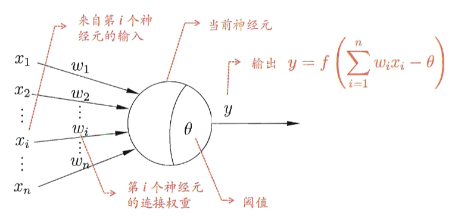
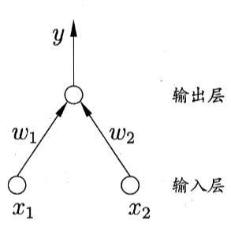
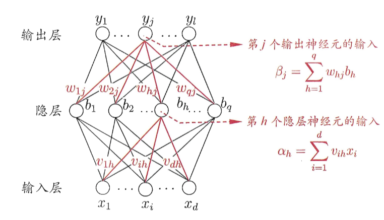

# 5 神经网络

## 5.1 神经元模型

激活函数

想激活函数是阶跃函数，0表示抑制神经元，1表示激活神经元

阶跃函数具有不连续、不光滑等不好的性质，常用的是 Sigmoid 函数：$\mathrm{sigmoid}(x)=\frac{1}{1+e^{-x}}$

## 5.2 感知机与多层网络

感知机由两层神经元组成，输入层接受外界输入信号传递给输出层，输入层接受外界输入信号传递给输出层

感知机能够容易地实现逻辑与、或、非运算

- 与：$x_1\wedge x_2$，令 $w_1=w_2=1$，$\theta=2$，则 $y=f(1\cdot x_{1}+1\cdot x_{2}-0.5)$，仅在 $x_1=x_2=1$ 时，$y=1$
- 或：$x_1\vee x_2$，令 $w_1=w_2=1$，$\theta=0.5$，则 $y=f(1\cdot x_{1}+1\cdot x_{2}-0.5)$，仅在 $x_1=1$ 或 $x_2=1$ 时，$y=1$

- 非：$\lnot x_1$，令 $w_1=-0.6$，$w_2=0$，$\theta=-0.5$，则 $x_1=1$ 时，$y=0$；当 $x_2=0$ 时，$y=1$

给定训练数据集，权重 $w_i\left(i=1,2,...,n\right)$ 与阈值 $\theta$ 可以通过学习得到

感知机学习规则：对训练样例（x，y），若当前感知机的输出为 $\widehat{y}$，则感知机权重调整规则为：
$$
w_i\leftarrow w_i+\Delta w_i
\\
\Delta w_i=\eta(y-\hat{y})x_i
$$
其中 $\eta\in(0,1)$ 称为学习率

若感知机对训练样例（x，y）预测正确，则感知机不发生变化；否则根据错误程度进行权重的调整

感知机学习能力：

- 若两类模式线性可分，则感知机的学习过程一定会收敛；否则感知机的学习过程将会发生震荡
- 单层感知机的学习能力非常有限，只能解决线性可分问题
- 与、或、非问题线性可分，异或问题不是线性可分的

非线性可分问题，用**多层感知机**求解

输出层与输入层之间的一层神经元，被称之为隐层或**隐含层**，隐含层和输出层神经元都是具有激活函数的功能神经元

多层网络：

- **前馈网络**：神经元之间不存在同层连接也不存在跨层连接
- 隐层和输出层神经元亦称“功能单元”
- 多层前馈网络有强大的表示能力

## 5.3 误差逆传播算法（BP）

给定训练集 $D=\{(x_1,y_1),(x_2,y_2),\ldots,(x_m,y_m)\},x_i\in\mathbb{R}^d,y_i\in\mathbb{R}^l$
输入：d 维特征向量；输出：l 个输出值

隐层：假定使用 q 个隐层神经元；假定功能单元均使用 Sigmoid 函数

对于训练例 $(x_k,y_k)$，假定网络的实际输出为 $\hat{y}_k=(\hat{y}_1^k,\hat{y}_2^k,\ldots,\hat{y}_l^k)$，即 $\hat{y}_j^k=f(\beta_j-\theta_j)$，则网络在 $(x_k,y_k)$ 上的均方误差为：
$$
E_k=\frac{1}{2}\sum_{j=1}^l(\hat{y}_j^k-y_j^k)^2
$$
需通过学习确定的参数数目：$(d+l+1)q+l$

BP 是一个迭代学习算法，在迭代的每一轮中采用广义感知机学习规则，任意参数 v 的更新估计式为 $v\leftarrow v+\Delta v$

BP 算法基于**梯度下降**策略，以目标的负梯度方向对参数进行调整

以 $w_{hj}$ 为例，对误差 $E_k$，给定学习率 $\eta$，有
$$
\Delta w_{hj}=-\eta\frac{\partial E_k}{\partial w_{hj}}
$$
注意到 $w_{hj}$ 先影响到 $\beta_j$，再影响到 $\hat{y}^k_j$，然后才影响到 $E_k$，有
$$
\textbf{链式法则：}\boxed{\frac{\partial E_k}{\partial w_{hj}}=\frac{\partial E_k}{\partial\hat{y}_j^k}\cdot\frac{\partial\hat{y}_j^k}{\partial\beta_j}\cdot\frac{\partial\beta_j}{\partial w_{hj}}}
$$
因为 $\frac{\partial E_k}{\partial\hat{y}_j^k} = (\hat{y}^k_j - y^k_j)$，$\frac{\partial\beta_j}{\partial w_{hj}} = b_h$，$\frac{\partial\hat{y}_j^k}{\partial\beta_j} = \hat{y}_j^k(1-\hat{y}_j^k)$

令 $g_{j}=-\frac{\partial E_{k}}{\partial\hat{y}_{j}^{k}}\cdot\frac{\partial\hat{y}_{j}^{k}}{\partial\beta_{j}}=\hat{y}_j^k(1-\hat{y}_j^k)(y_j^k-\hat{y}_j^k)$，于是 $\Delta w_{hj}=-\eta\frac{\partial E_{k}}{\partial w_{hj}}=\eta g_{j}b_{h}$

类似有 $\Delta\theta_{j}=-\eta g_{j}$，$\Delta v_{ih}=\eta e_{h}x_{i}$，$\Delta\gamma_{h}=-\eta e_{h}$

其中：
$$
\begin{aligned}e_{h}&=-\frac{\partial E_{k}}{\partial b_{h}}\cdot\frac{\partial b_{h}}{\partial\alpha_{h}}\\&=-\sum_{j=1}^{l}\frac{\partial E_{k}}{\partial\beta_{j}}\cdot\frac{\partial\beta_{j}}{\partial b_{h}}f^{\prime}(\alpha_{h}-\gamma_{h})=\sum_{j=1}^{l}w_{hj}g_{j}f^{\prime}(\alpha_{h}-\gamma_{h})=b_{h}(1-b_{h})\sum_{j=1}^{l}w_{hj}g_{j}\end{aligned}
$$
学习率 $\eta\in(0,1)$ 不能太大、不能太小

| 标准 BP 算法                             | 累积 BP 算法                                         |
| ---------------------------------------- | :--------------------------------------------------- |
| 每次针对单个训练样例更新权值与阈值       | 参数更新频繁，不同样例可能抵消，需要多次迭代         |
| 其优化目标是最小化整个训练集上的累计误差 | 读取整个训练集一遍才对参数进行更新，参数更新频率较低 |

累计误差下降到一定程度后，进一步下降会非常缓慢，这时标准 BP 算法往往会获得较好的解，尤其当训练集非常大时效果更明显

缓解过拟合：

- 早停：
  - 若训练误差连续 a 轮的变化小于 b，则停止训练
  - 使用验证集：若训练误差降低、验证误差升高，则停止训练
- 正则化：在误差目标函数中增加一项描述网络复杂度

## 5.4 全局最小与局部极小

神经网络的训练过程可看作一个参数寻优过程：在参数空间中，寻找一组最优参数使得误差最小

存在多个“局部极小”，有一个“全局最小”

跳出局部极小的常见策略：

- 以多组**不同参数值**初始化多个神经网络，按标准方法训练后，取其中误差最小的解作为最终参数
- 使用**模拟退火**技术，在每一步都以一定的概率接受比当前解更差的结果
- 使用**随机梯度下降**，即便陷入局部极小点，它计算出的梯度仍可能不为零
- **遗传算法**

## 5.5 其他常见神经网络

### 5.5.1 RBF 网络

RBF（径向基函数）网络：单隐层前馈神经网络。

使用**径向基函数**作为隐层神经元激活函数，例如高斯径向基函数：$\rho(\boldsymbol{x},\boldsymbol{c}_i)=e^{-\beta_i\|\boldsymbol{x}-\boldsymbol{c}_i\|^2}$

输出层是隐层神经元输出的线性组合 $\varphi(\boldsymbol{x})=\sum_{i=1}^qw_i\rho(\boldsymbol{x},\boldsymbol{c}_i)$

训练过程：确定神经元中心，常用的方式包括随机采样、聚类等；利用 BP 算法等确定参数

### 5.5.2 ART网络

竞争学习：无监督学习策略，网络的输出神经元相互竞争，每一时刻仅有一个神经元被激活，他神经元
的状态被抑制

ART网络由**比较层**、**识别层**、**识别阈值**和**重置模块**构成

- 比较层负责接收输入样本，并将其传送给识别层神经元
- 识别层每个神经元对应一个模式类, 神经元的数目可在训练过程中动态增长以增加新的模式类

四步骤：1 匹配、2 比较、3 搜索、4 学习（胜者通吃）

ART网络性能依赖于识别阈值：

- 识别阈值高，输入样本得到较精细分类
- 识别阈值低，输入样本产生较粗略分类

ART网络的优势

- 解决“可塑性-稳定性窘境”。可塑性：神经网络要有学习新知识的能力；稳定性：神经网络在学习新知识时要保持对旧知识的记忆
- 可以增量学习或在线学习

### 5.5.3 SOM 网络

SOM 网络：竞争型的无监督神经网络，将高维数据映射到低维空间，高维空间中相似的样本点映射到网络输出层中邻近神经元。每个神经元拥有一个权向量。目的是为每个输出层神经元找到合适的权向量以保持拓扑结构

### 5.5.4 级联相关网络

构造性神经网络：将网络的结构也当做学习的目标之一，希望在训练过程中找到适合数据的网络结构

### 5.5.5 Elman 网络

递归神经网络：网络中可以有环形结构，可让使一些神经元的输出反馈回来作为输入

### 5.5.6 Boltzmann 机

为网络定义一个“能量”，能量最小化时网络达到理想状态，而网络的训练就是在最小化这个能量函数

### 5.5.7 Hopfield 网络

反馈型神经网络

## 5.6 深度学习