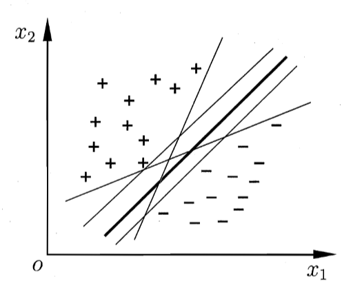
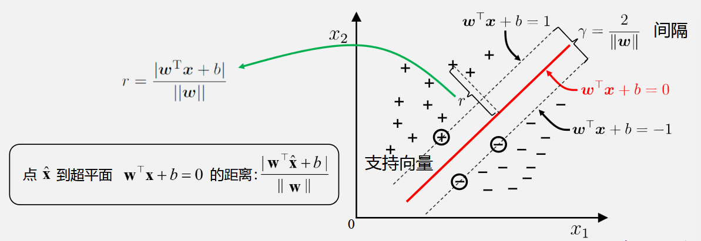
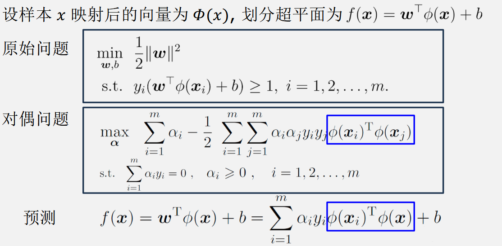

# 6 支持向量机

## 6.1 间隔与支持向量

将训练样本分开的超平面选择正中间，鲁棒性最好，泛化能力最强

超平面方程：$\boldsymbol{w}^\mathrm{T}\boldsymbol{x}+b=0$

其中 $\boldsymbol{w}=(w_1;w_2;\ldots;w_d)$ 为法向量，决定了超平面的方向；$b$ 为位移项，决定了超平面与原点之间的距离。间隔 $\gamma=\frac{2}{||\boldsymbol{w}||}$

最大间隔: 寻找参数 𝒘 和 𝑏，使得 𝛾 最大，即**支持向量机（SVM）**的基本型
$$
\begin{aligned}
\min_{\boldsymbol{w},b}&\frac{1}{2}\|\boldsymbol{w}\|^{2}\\
\mathrm{s.t.}\quad &y_{i}(\boldsymbol{w}^{\top}\boldsymbol{x}_{i}+b)\geq1,i=1,2,\ldots,m
\end{aligned}
$$

## 6.2 对偶问题

使用拉格朗日乘子法

第一步：引入拉格朗日乘子 $\alpha_i \geq 0$，得到拉格朗日函数：
$$
L(\boldsymbol{w},b,\boldsymbol{\alpha})=\frac{1}{2}\|\boldsymbol{w}\|^2+\sum_{i=1}^m\alpha_i\left(1-y_i(\boldsymbol{w}^\mathrm{T}\boldsymbol{x}_i+b)\right), \quad \boldsymbol{\alpha}=(\alpha_1;\alpha_2;\ldots;\alpha_m)
$$
第二步：令 $L(\boldsymbol{w},b,\boldsymbol{\alpha})$ 对 $\boldsymbol{w}$ 和 $b$ 的偏导为零可得：
$$
\boldsymbol{w}=\sum_{i=1}^m\alpha_iy_i\boldsymbol{x}_i \quad \quad 0=\sum_{i=1}^m\alpha_iy_i
$$
第三步：代入拉格朗日函数可得**对偶问题**：
$$
\begin{aligned}
\max_{\boldsymbol{\alpha}} \quad &\sum_{i=1}^m\alpha_i-\frac{1}{2}\sum_{i=1}^m\sum_{j=1}^m\alpha_i\alpha_jy_iy_j\boldsymbol{x}_i^\mathrm{T}\boldsymbol{x}_j\\
\mathrm{s.t.}\quad & \sum_{i=1}^m\alpha_iy_i=0,\quad  \alpha_i\geqslant0,\quad i=1,2,\ldots,m
\end{aligned}
$$
最终模型：$f(\boldsymbol{x})=\boldsymbol{w}^\top\boldsymbol{x}+b=\sum_{i=1}^m\alpha_iy_i\boldsymbol{x}_i^\top\boldsymbol{x}+b$

满足 KKT 条件：
$$
\left.\left.\left.\left\{\begin{array}{l}\alpha_i\geq0\\1-y_if(\boldsymbol{x}_i)\leq0\\\alpha_i\left(1-y_if(\boldsymbol{x}_i)\right)=0\end{array}\right.\right.\right.\right.
$$
必有 $\alpha_i=0$ 或 $y_i f(\boldsymbol{x}_i) =1$

解的稀疏性：训练完成后，最终模型仅与支持向量有关

求解对偶问题方法：**SMO**

基本思路：不断执行如下两个步骤直至收敛

- 第一步：选取一对需更新的变量 $\alpha_i$ 和 $\alpha_j$

- 二步：固定 $\alpha_i$ 和 $\alpha_j$ 以外的参数，求解对偶问题更新 $\alpha_i$ 和 $\alpha_j$

仅考虑 $\alpha_i$ 和 $\alpha_j$ 时，对偶问题的约束 $0=\sum_{i=1}^m\alpha_iy_i$ 变为 $\alpha_iy_i+\alpha_jy_j=c$，$\alpha_i\geqslant0$，$\alpha_j\geqslant0$。其中 $c=-\sum_{k\neq i,j}\alpha_ky_k$ 是使 $0=\sum_{i=1}^m\alpha_iy_i$ 成立的常数 

用 $\alpha_iy_i+\alpha_jy_j=c$ 消去对偶问题中的 $\alpha_j$ 有闭式解

对任意支持向量 $(\boldsymbol{x}_s,y_s)$ 有 $y_sf(\boldsymbol{x}_s)=1$，即 $y_s\left(\sum_{i\in S}\alpha_iy_i\boldsymbol{x}_i^\mathrm{T}\boldsymbol{x}_s+b\right)=1$，由此可以解出 b

为提高鲁棒性，通常使用所有支持向量求解的平均值 $b=\frac{1}{|S|}\sum_{s\in S}\left(y_s-\sum_{i\in S}\alpha_iy_i\boldsymbol{x}_i^\mathrm{T}\boldsymbol{x}_s\right)$

## 6.3 核函数

若不存在一个能正确划分两类样本的超平面，则将样本从原始空间映射到一个更高维的特征空间，使样本在这个特征空间内线性可分

基本思路：设计核函数 $\kappa(\boldsymbol{x}_i,\boldsymbol{x}_j)=\phi(\boldsymbol{x}_i)^\mathrm{T}\phi(\boldsymbol{x}_j)$

Mercer 定理：若一个对称函数所对应的核矩阵半正定，则它就能作为核函数来使用

## 6.4 软间隔与正则化

很难确定合适的核函数，使训练样本在特征空间中线性可分

硬间隔：要求所有样本均满足约束

软间隔：允许在一些样本不满足约束

基本思路：最大化间隔的同时，让不满足约束 $y_i(\boldsymbol{w}^\mathrm{T}\boldsymbol{x}_i+b)\geqslant1$ 的样本尽可能少

优化目标：
$$
\min_{\boldsymbol{w},b}\frac{1}{2}\|\boldsymbol{w}\|^2+C\sum_{i=1}^m\ell_{0/1}\left(y_i\left(\boldsymbol{w}^\mathrm{T}\boldsymbol{x}_i+b\right)-1\right)
$$
其中 $C>0$ 是一个常数，$\ell_{0/1}$ 是“0/1损失函数”

$$\ell_{0/1}(z)=\begin{cases}1,&\text{if}z<0;\\0,&\text{otherwise.}\end{cases}$$

$\ell_{0/1}$ 不易直接求解，使用替代损失函数

- hinge 损失：$\ell_{hinge}(z)=\max(0,1-z)$
- 指数损失：$\ell_{exp}(z)=\exp(-z)$
- 对率损失：$\ell_{log}(z)=\log(1+\exp(-z))$

若采用 hinge 损失，则原始问题变为
$$
\min_{\boldsymbol{w},b}\frac{1}{2}\|\boldsymbol{w}\|^2+C\sum_{i=1}^m\max\left(0,1-y_i\left(\boldsymbol{w}^\mathrm{T}\boldsymbol{x}_i+b\right)\right)
$$
引入“松弛变量” $\xi_{i}$：
$$
\begin{aligned}
\min_{\boldsymbol{w},b,\xi_{i}} \quad &\frac{1}{2}\|\boldsymbol{w}\|^{2}+C\sum_{i=1}^{m}\xi_{i}\\
\mathrm{s.t.}\quad &y_{i}(\boldsymbol{w}^{\mathrm{T}}\boldsymbol{x}_{i}+b)\geqslant1-\xi_{i},\xi_{i}\geqslant0,i=1,2,\ldots,m
\end{aligned}
$$
对偶问题变为：
$$
\begin{aligned}
\max_{\alpha} \quad &\sum_{i=1}^{m}\alpha_{i}-\frac{1}{2}\sum_{i=1}^{m}\sum_{j=1}^{m}\alpha_{i}\alpha_{j}y_{i}y_{j}\boldsymbol{x}_{i}^{\mathrm{T}}\boldsymbol{x}_{j} \\
\mathrm{s.t.} \quad &\sum_{i=1}^{m}\alpha_{i}y_{i}=0,\quad0\leqslant\alpha_{i}\leqslant C,\quad i=1,2,\ldots,m
\end{aligned}
$$

### 正则化

优化机器学习模型性能，引入正则化项来限制模型的复杂性，从而减少过拟合、增强模型的鲁棒性

从数学角度来看，正则化是在优化目标中加入一个惩罚项，该惩罚项随着模型复杂度的增加而增大。

统计学习模型（例如 SVM）的更一般形式
$$
\min_f \quad \Omega(f)+C\sum_{i=1}^m\ell(f(\boldsymbol{x}_i),y_i)
$$
$\Omega(f)$：结构风险-描述模型本身的某些性质；$\ell(f(\boldsymbol{x}_i),y_i)$：经验风险-描述模型与训练数据的契合程度

$\Omega(f)$ 正则化项

正则化引入了一种归纳偏好（Inductive Bias），即对模型的某些性质（如稀疏性、平滑性等）施加限制，以引导优化过程。

**软间隔 SVM 中的正则化**
$$
\min_{\mathbf{w},\xi} \quad \frac{1}{2}\|\mathbf{w}\|_2^2+C\sum_i\xi_i
$$

- $ \frac{1}{2} \|\mathbf{w}\|_2^2 $ 是正则化项，控制模型复杂度。
-  $ C \sum_{i} \xi_i $ 是经验风险，衡量约束违反程度。

- $ C $ 是超参数，用于权衡正则化项与经验风险。

## 6.5 支持向量回归

基本思路：允许模型输出与实际输出间存在 $2ε$ 的差别

落入 $2ε$ 间隔带的样本不计算损失，从而使得模型获得稀疏性

ε-不敏感损失函数
$$
\ell_\epsilon(z)=\begin{cases}0&\mathrm{if~}|z|\leq\epsilon\\|z|-\epsilon&\mathrm{otherwise}&\end{cases}
$$
原始问题：
$$
\begin{aligned}
\operatorname*{min}_{\boldsymbol{w},b,\xi_{i},\hat{\xi}_{i}} \quad &\frac{1}{2}\|\boldsymbol{w}\|^2+C\sum_{i=1}^m(\xi_i+\hat{\xi}_i)\\
\mathrm{s.t.} \quad &f(\boldsymbol{x}_i)-y_i\leqslant\epsilon+\xi_i \\
&y_{i}-f(\boldsymbol{x}_{i})\leqslant\epsilon+\hat{\xi}_{i} \\
&\xi_{i}\geqslant0,\hat{\xi}_{i}\geqslant0,i=1,2,\ldots,m
\end{aligned}
$$
对偶问题：
$$
\begin{aligned}
\max_{\alpha,\hat{\alpha}} \quad &\sum_{i=1}^{m}y_{i}(\hat{\alpha}_{i}-\alpha_{i})-\epsilon(\hat{\alpha}_{i}+\alpha_{i})-\frac{1}{2}\sum_{i=1}^{m}\sum_{j=1}^{m}(\hat{\alpha}_{i}-\alpha_{i})(\hat{\alpha}_{j}-\alpha_{j})\boldsymbol{x}_{i}^{\mathrm{T}}\boldsymbol{x}_{j} \\
\mathrm{s.t.}\quad&\sum_{i=1}^{m}(\hat{\alpha}_{i}-\alpha_{i})=0, \quad  0\leqslant\alpha_{i},\hat{\alpha}_{i}\leqslant C
\end{aligned}
$$
预测
$$
f(\boldsymbol{x})=\sum_{i=1}^m(\hat{\alpha}_i-\alpha_i)\boldsymbol{x}_i^\mathrm{T}\boldsymbol{x}+b
$$

## 6.6 核方法

核方法的核心是**核技巧（Kernel Trick）**，它允许在不显式计算高维映射的情况下，直接通过核函数进行计算。

假设样本数据为 $$\mathbf{x}$$，通过映射函数 $$\Phi(\cdot)$$ 将其从原始空间映射到高维特征空间：

$$
\Phi: \mathbf{x} \mapsto \Phi(\mathbf{x})
$$

在高维特征空间中，学习模型常涉及到样本点之间的内积：

$$
\langle \Phi(\mathbf{x}_i), \Phi(\mathbf{x}_j) \rangle
$$

核方法引入核函数 $$K(\mathbf{x}_i, \mathbf{x}_j)$$，直接计算上述内积而无需显式地构造映射：

$$
K(\mathbf{x}_i, \mathbf{x}_j) = \langle \Phi(\mathbf{x}_i), \Phi(\mathbf{x}_j) \rangle
$$

这样，核函数不仅节省了计算资源，还能处理无限维的特征映射。

### 核函数的性质

核函数 $$K(\mathbf{x}_i, \mathbf{x}_j)$$ 是一个对称的函数，其输出值可以看作样本 $$\mathbf{x}_i$$ 和 $$\mathbf{x}_j$$ 在高维特征空间中的相似度。

根据 Mercer 定理，一个函数 $$K(\mathbf{x}_i, \mathbf{x}_j)$$ 可以作为核函数使用，当且仅当它对应的核矩阵是半正定的。

几种常见的核函数：
- **线性核**：$$K(\mathbf{x}_i, \mathbf{x}_j) = \mathbf{x}_i^\top \mathbf{x}_j$$
- **多项式核**：$$K(\mathbf{x}_i, \mathbf{x}_j) = (\mathbf{x}_i^\top \mathbf{x}_j + c)^d$$
- **高斯核（RBF 核）**：$$K(\mathbf{x}_i, \mathbf{x}_j) = \exp\left(-\frac{\|\mathbf{x}_i - \mathbf{x}_j\|^2}{2\sigma^2}\right)$$
- **Sigmoid 核**：$$K(\mathbf{x}_i, \mathbf{x}_j) = \tanh(a \mathbf{x}_i^\top \mathbf{x}_j + b)$$

如果 $$\kappa_1$$ 和 $$\kappa_2$$ 是核函数，则以下形式也是核函数：
- $$\kappa_1 + \kappa_2$$
- $$\gamma_1 \kappa_1 + \gamma_2 \kappa_2$$ （$$\gamma_1, \gamma_2 > 0$$）
- $$\kappa_1 \cdot \kappa_2$$
- 对任意函数 $$g(\mathbf{x})$$，$$g(\mathbf{x}) \kappa_1$$ 也是核函数。

### 核方法在支持向量机（SVM）中的应用

在核化 SVM 中，优化问题从显式特征空间转化为核函数的形式：
- **原始问题**：

$$
\min_{\mathbf{w}, b} \, \frac{1}{2} \|\mathbf{w}\|^2 + C \sum_{i=1}^n \xi_i
$$

- **对偶问题**（用核函数表达）：

$$
\max_{\alpha} \, \sum_{i=1}^n \alpha_i - \frac{1}{2} \sum_{i,j=1}^n \alpha_i \alpha_j y_i y_j K(\mathbf{x}_i, \mathbf{x}_j)
$$

核函数在此避免了显式计算高维映射 $$\Phi(\mathbf{x})$$，同时支持处理无限维的映射。

基于核方法可以得到许多传统线性模型的“核化版本”。例如：
- **核化 LDA（KLDA）**：将样本映射到高维空间后，在该空间中执行线性判别分析。
- **核化 PCA（KPCA）**：在高维空间中进行主成分分析。