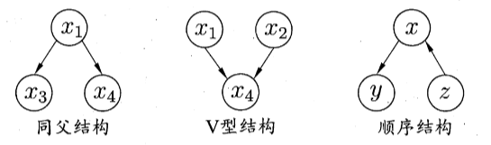

# 7 贝叶斯分类器

## 7.1 贝叶斯决策论

概率框架下实施决策的基本理论

给定 N 个类别（$\mathcal{Y}=\{c_{1},c_{2},\ldots,c_{N}\}$），令 $ \lambda_{ij} $ 代表将属于第 $ j $ 类的样本误分类为第 $ i $ 类所产生的损失

基于后验概率将样本 x 分到第 i 类的条件风险为
$$
R(c_i\mid x)=\sum_{j=1}^N\lambda_{ij}P(c_j\mid x)
$$
贝叶斯判定准则旨在最小化条件风险：
$$
h^*(\boldsymbol{x})=\underset{c\in\mathcal{Y}}{\operatorname*{\operatorname*{\arg\min}}}R(c\mid\boldsymbol{x})
$$

- 对每个样本 $ x $，计算所有可能类别的条件风险 $ R(c_i \mid x) $，选择使条件风险最小的类别作为分类结果。
- 贝叶斯最优分类器：$ h^* $
- **贝叶斯风险**：贝叶斯最优分类器在总体上最小化的风险称为贝叶斯风险，它是分类器性能的理论上限，即 $1-R(h^*)$

**贝叶斯决策准则的意义**

- **最优性**：贝叶斯最优分类器能实现理论上的最优分类，即即便在真实数据分布下，性能也无法超过它。
- **应用价值**：
  - 在实际中，后验概率 $ P(c \mid x) $ 通常需要通过有限样本近似估计
  - 贝叶斯决策准则为构建分类器提供了指导方向

后验概率 $ P(c \mid x) $ 在现实中通常难以直接获得

两种基本策略：

- **判别式模型**：直接对后验概率 $ P(c \mid x) $ 进行建模，或直接找到类别 $ c $ 和样本 $ x $ 之间的决策边界
  代表模型：决策树、BP 神经网络、支持向量机（SVM）
- **生成式模型**：先对样本 $ x $ 和类别 $ c $ 的联合概率分布 $ P(x, c) $ 建模，再由此推导出后验概率 $ P(c \mid x) $​
  代表模型：朴素贝叶斯分类器、贝叶斯网络、隐马尔可夫模型（HMM）

**贝叶斯定理**：
$$
P(c \mid x)=\frac{P(x \mid c)P(c)}{P(x)}
$$

- **先验概率**：$P(c)$，样本空间中各类样本所占的比例，可通过各类样本出现的频率估计
- **似然**：$P(x \mid c)$，也称类条件概率，是主要困难
- **证据**：$P(x)$，是归一化因子，与类别无关

## 7.2 极大似然估计

先假设某种概率分布形式，再基于训练样例对参数进行估计

假定 $P(x \mid c)$ 具有确定的概率分布形式，且被参数 $\theta_c$ 唯一确定，则任务就是利用训练集 D 来估计参数 $\theta_c$，$P(x \mid c)$ 记为 $P(x \mid \theta_c)$ 

$\theta_c$ 对于训练集 D 中第 c 类样本组成的集合 $D_c$ 的似然为
$$
P(D_c\mid\theta_c)=\prod_{x\in D_c}P(x\mid\theta_c)
$$
通常使用对数似然
$$
LL(\theta_c)=\log P(D_c\mid\theta_c)=\sum_{x\in D_c}\log P(x\mid\theta_c)
$$
极大似然估计公式
$$
\hat{\theta}_c=\underset{\theta_c}{\operatorname*{\operatorname*{\arg\max}}}LL(\theta_c)
$$
估计结果的准确性严重依赖于所假设的概率分布形式是否符合潜在的真实分布

## 7.3 朴素贝叶斯分类器

直接估计 $ P(x \mid c) $ 难以实现，原因在于：

1. 组合爆炸：样本空间随着属性数量的增加呈指数级增长
2. 样本稀疏：有限的训练数据难以覆盖所有可能的样本组合

解决方案：假设样本的各个属性在类别条件下是相互独立的，即**属性条件独立性假设**。根据这一假设：
$$
P(c\mid\boldsymbol{x})=\frac{P(c)P(\boldsymbol{x}\mid c)}{P(\boldsymbol{x})}=\frac{P(c)}{P(\boldsymbol{x})}\prod_{i=1}^dP(x_i\mid c)
$$

其中，$ d $ 是属性的数量，$ x_i $ 是样本 $ x $ 在第 $ i $​ 个属性上的取值。

贝叶斯判定准则：分类时选择后验概率最大的类别 $ c $：朴素贝叶斯分类器的表达式
$$
h_{nb}(\boldsymbol{x})=\arg\max_{c\in\mathcal{Y}}P(c)\prod_{i=1}^dP(x_i\mid c)
$$
**朴素贝叶斯分类器的实现**

令 $D_c$ 表示训练集 D 中第 c 类样本组成的集合，假设有充足的独立同分布样本

1. 估计先验概率 $ P(c) $：
   $$
   P(c) = \frac{ \mid D_c \mid }{ \mid D \mid }
   $$

​	其中，$  \mid D_c \mid  $ 是类别 $ c $ 的样本数量，$  \mid D \mid  $ 是训练集样本总数。

2. 估计类条件概率 $ P(x_i \mid c) $：

   - 对于**离散属性**：
     
     $$
     P(x_i \mid c) = \frac{ \mid D_{c,x_i} \mid }{ \mid D_c \mid }
     $$
     $  \mid D_{c,x_i} \mid  $ 是类别 $ c $ 中第 $ i $ 个属性取值为 $ x_i $ 的样本数。

   - 对于**连续属性**：假设服从正态分布：
     
     $$
     p(x_i\mid c)=\frac{1}{\sqrt{2\pi}\sigma_{c,i}}\exp\left(-\frac{(x_i-\mu_{c,i})^2}{2\sigma_{c,i}^2}\right)
     $$
     其中 $ \mu_{c,i} $ 和 $ \sigma_{c,i}^2 $ 分别为类别 $ c $ 中属性 $ x_i $ 的均值和方差，可通过极大似然估计计算。

**拉普拉斯修正**

在实际中，如果某个属性值未在训练集中出现，直接计算类条件概率会得到 $ P(x_i \mid c) = 0 $，这会导致后验概率也为 0。为了避免这一问题，引入**拉普拉斯修正**：
$$
\begin{aligned}
\hat{P}(c)&=\frac{ \mid D_{c} \mid +1}{ \mid D \mid +N} \\
\hat{P}(x_{i}\mid c)&=\frac{ \mid D_{c,x_{i}} \mid +1}{ \mid D_{c} \mid +N_{i}}
\end{aligned}
$$
令 N 表示训练集 D 中可能的类别数，其中 $ N_i $ 是第 $ i $ 个属性可能的取值数。

拉普拉斯修正假设数据分布均匀，为小样本问题提供了一种有效的平滑处理。

**朴素贝叶斯分类器的优势与不足**

**优势**

1. **计算效率高**：仅需统计样本频率，计算简单。
2. **对小样本数据有效**：适合样本较少的任务。
3. **鲁棒性强**：对无关属性和部分缺失数据有较好的适应性。

**不足**

1. **属性条件独立性假设不成立**：现实中，属性通常不是完全独立的，这会影响模型的性能。
2. **对连续属性的分布假设敏感**：如果假设的分布形式与实际分布差异较大，模型表现可能较差。

## 7.4 半朴素贝叶斯分类器

朴素贝叶斯分类器引入的属性条件独立性假设在现实中往往不成立。例如，某些属性之间可能存在强相关性（如天气和湿度）

为了解决这个问题，**半朴素贝叶斯分类器**被提出，它在考虑属性依赖性的同时，尽量保持模型的简单性。

最常用策略：**独依赖估计（ODE）**：假设每个属性最多依赖于一个其他属性（称为“父属性”）。类条件概率公式从朴素贝叶斯的独立性假设扩展为：
$$
P(c\mid\boldsymbol{x})\propto P(c)\prod_{i=1}^dP(x_i\mid c,pa_i)
$$
其中，$ pa_i $ 是属性 $ x_i $ 的“父属性”

关键问题：如何确定每个属性的父属性

常见方法：

1. SPODE：假设所有属性都依赖于同一属性，称为“超父”，然后通过交叉验证等模型选择方法来确定超父属性

2. TAN：以属性间的条件”互信息”为边的权重，构建完全图，再利用最大带权生成树算法，仅保留强相关属性间的依赖性

   实现步骤：

   - 计算任意两个属性之间的**条件互信息**：
     $$
     I(x_i,x_j\mid y)=\sum_{x_i,x_j;c\in\mathcal{Y}}P(x_i,x_j\mid c)\log\frac{P(x_i,x_j\mid c)}{P(x_i\mid c)P(x_j\mid c)}
     $$

   - 以属性为节点，互信息为边的权重，构建一个完全图

   - 构建此完全图的最大带权生成树，挑选根变量，将边设为有向

   - 加入类别节点 y，增加从 y 到每个属性的有向边

3. AODE：尝试将每个属性轮流作为超父构建 SPODE 模型。集成多个 SPODE 模型，将它们的输出进行平均，得到最终预测
   $$
   P(c\mid\boldsymbol{x}) \propto \sum_{\begin{array}{c}i=1 \mid D_{x_i} \mid \geqslant m^{\prime}\end{array}}^dP(c,x_i)\prod_{j=1}^dP(x_j\mid c,x_i)
   $$
   其中 $D_{x_{j}}$是在第 $i$ 个属性上取值为 $x_i$ 的样本的集合，$m'$ 为阈值常数
   $$
   \begin{aligned}
   \hat{P}(c,x_{i})&=\frac{ \mid D_{c,x_{i}} \mid +1}{ \mid D \mid +N_{i}} \\
   \hat{P}(x_{j}\mid c,x_{i})&=\frac{ \mid D_{c,x_{i},x_{j}} \mid +1}{ \mid D_{c,x_{i}} \mid +N_{j}}
   \end{aligned}
   $$
   N 表示训练集 D 中可能的类别数，$ N_i $ 是第 $ i $ 个属性可能的取值数；$D_{c,x_i,x_j}$ 表示类别为 $c$ 且在第 $i$ 和第 $j$ 个属性上取值分别为 $x_i$ 和 $y_i$ 的样本集合

**高阶依赖**

能否进一步提升模型性能，通过考虑属性间的高阶依赖关系？如将 ODE 扩展为 $ k $-DE（k-Dependent Estimator），即每个属性最多依赖 $ k $ 个其他属性。

困难：
1. 随着 $ k $ 增加，估计所需的样本数呈指数级增长。
2. 如果训练样本不足，高阶联合概率的估计会非常不稳定。

## 7.5 贝叶斯网

贝叶斯网（Bayesian Network, 又称信念网）是一种**概率图模型**，通过一个**有向无环图（DAG）**来表示随机变量之间的条件依赖关系，并结合**条件概率表（CPT）**来定量描述这些关系。

一个贝叶斯网 $B$ 由结构 $G$ 和参数 $\Theta$ 两部分构成，即 $B=\langle G,\Theta\rangle$。网络结构 $G$ 是一个有向无环图，其每个结点对应于一个属性，若两个属性有直接依赖关系，则它们由一条边连接起来；参数 $\Theta$ 定量描述这种依赖关系，假设属性 $x_i$ 在 $G$ 中的父结点集为 $\pi_i$，则 $\Theta$ 包含了每个属性的条件概率表 $\theta_{x_i \mid \pi_i}=P_B(x_i\mid\pi_i)$

### 7.5.1 结构

贝叶斯网假设给定一个节点的父节点集合时，该节点与其他非后裔节点条件独立。

$B=\langle G,\Theta\rangle$ 将属性 $x_1,x_2,\ldots,x_d$ 的联合概率分布定义为
$$
P_B(x_1,x_2,\ldots,x_d)=\prod_{i=1}^dP_B(x_i\mid\pi_i)=\prod_{i=1}^d\theta_{x_i \mid \pi_i}
$$
**三变量间的典型依赖关系**

- 同父结构：给定父节点 $x_1$，$x_3$ 与 $x_4$ 条件独立
- V 型结构：给定 $x_4$，$x_1$ 与 $x_2$ 必不独立；若 $x_4$ 完全未知，$x_1$ 与 $x_2$ 互相独立
- 顺序结构：给定 $x$，$y$ 与 $z$ 条件独立

**条件独立性分析**

贝叶斯网中，条件独立性是通过**有向分离（D-separation）**来分析的。

D-separation 的步骤：先将有向图转变为无向图，即 V 型结构父结点相连、有向边变成无向边，由此产生的无向图称为**道德图**

先剪枝，仅保留有向图中 x, y, z 及其祖先结点，若 x 和 y 能在图上被 z 分入两个连通分支，则有 $x\perp y\mid\mathbf{z}$

得到条件独立性关系之后，估计出条件概率表，就得到了最终网络

### 7.5.2 学习

当贝叶斯网的结构未知时，结构学习的目标是通过数据确定节点之间的依赖关系。这是一个 NP 难问题，常见方法有评分函数法：利用评分函数评估候选结构与数据的拟合度，选择得分最优的结构。例如：最小描述长度（MDL）、赤池信息准则（AIC）、贝叶斯信息准则（BIC）。

### 7.5.3 推断

推断：基于已知属性变量的观测值，推测其他属性变量的取值。已知属性变量的观测值称为“证据”

- 精确推断：直接根据贝叶斯网定义的联合概率分布来精确计算后验概率
- 近似推断：降低精度要求，在有限时间内求得近似解

常见做法：

1. **吉布斯采样**

   - 随机产生一个与证据 $E = e$ 一致的样本 $q^0$ 作为初始点

   - 进行 T 次采样，每次采样中逐个考察每个非证据变量：假定所有其他属性取当前值，推断出采样概率，然后根据该概率采样

   - 假定经过 T 次采样得到与“查询目标” q 一致的样本共有 $n_q$ 个，则可近似估算出后验概率
     $$
     P(\mathbf{Q}=\mathbf{q}\mid\mathbf{E}=\mathbf{e})\simeq\frac{n_q}{T}
     $$

2. **变分推断**

## 7.6 EM 算法

在实际应用中，很多问题涉及**未观测变量**（**隐变量**，Latent Variables）。

EM 算法是一种迭代优化方法，旨在处理含有隐变量的极大似然估计问题。它通过交替执行以下两个步骤来优化参数：

- **E 步**（期望步）：基于当前参数值估计隐变量的期望。
- **M 步**（最大化步）：在 E 步结果的基础上，最大化对数似然函数，更新模型参数。

令 $\mathbf{X}$ 表示已观测变量集，$\mathbf{Z}$ 表示隐变量集，$\Theta$ 表示模型参数。若欲对 $\Theta$ 做极大似然估计，则应最大化对数似然

$$
LL(\Theta\mid\mathbf{X},\mathbf{Z})=\ln P(\mathbf{X},\mathbf{Z}\mid\Theta)
$$
由于隐变量 $$ \mathbf{Z} $$ 未观测，无法直接计算 $$ P(\mathbf{X} \mid \Theta) $$。但可以将其分解为：
$$
LL(\Theta\mid\mathbf{X},\mathbf{Z})=\ln P(\mathbf{X},\mathbf{Z}\mid\Theta)=\ln \sum_{\mathbf{Z}} P(\mathbf{X}, \mathbf{Z} \mid \Theta)
$$
直接优化该式通常很困难，因此引入 EM 算法。

迭代步骤：以初始值 $\Theta^0$ 为起点， 

- E 步：计算隐变量的**后验分布** $$ P(\mathbf{Z} \mid \mathbf{X}, \Theta^{t}) $$，并基于该分布计算完整数据对数似然的期望（称为 **Q 函数**）：

$$
Q(\Theta \mid \Theta^{t}) = \mathbb{E}_{\mathbf{Z} \mid \mathbf{X}, \Theta^{t}} [\ln P(\mathbf{X}, \mathbf{Z})]
$$
​	这里，$$ \Theta^{t} $$ 是当前的参数估计。

- M 步：通过最大化 **Q 函数** 来更新参数：

$$
\Theta^{t+1} = \arg\max_{\Theta} Q(\Theta \mid \Theta^{t})
$$

- 上述 E 步和 M 步交替执行，直至参数 $$ \Theta $$ 收敛