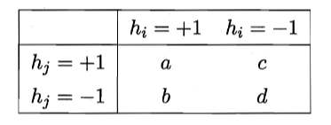

# 8 集成学习

## 8.1 个体与集成

集成学习的核心思想是将多个学习器组合起来解决问题，以实现比单一学习器更好的性能

## 8.2 Boosting

通过串行地生成基学习器，逐步纠正前一轮学习器的错误，将多个基学习器按权重线性组合为最终的强学习器

### 代表算法：AdaBoost

基本思想：

1. 根据样本权重分布训练基学习器
2. 为每个基学习器分配权重，使其贡献与其准确性成正比
3. 根据当前基学习器的错误率调整样本权重分布，以便后续基学习器重点关注难以分类的样本

设训练数据集为：$D = \{(x_1, y_1), (x_2, y_2), \dots, (x_N, y_N)\}$。其中：$ x_i $ 是第 $ i $ 个样本的特征向量；$ y_i \in \{-1, +1\} $ 是样本的类别标签。

目标是构造一个强学习器 $ H(x) $，将多个弱学习器 $ h_t(x) $​ 线性组合：
$$
H(x) = \sum_{t=1}^T \alpha_t h_t(x)
$$
其中：$ T $ 是基学习器的总数；$ \alpha_t $ 是基学习器的权重

在 AdaBoost 中，目标是最小化指数损失函数：
$$
\ell_{\exp}(H\mid\mathcal{D})=\mathbb{E}_{\boldsymbol{x}\sim\mathcal{D}}[e^{-f(\boldsymbol{x})H(\boldsymbol{x})}]
$$
若 $H(x)$ 能令指数损失函数最小化，则上式对 $H(x)$ 的偏导值为 0，即
$$
\frac{\partial\ell_{\exp}(H\mid\mathcal{D})}{\partial H(\boldsymbol{x})}=-e^{-H(\boldsymbol{x})}P(f(\boldsymbol{x})=1\mid\boldsymbol{x})+e^{H(\boldsymbol{x})}P(f(\boldsymbol{x})=-1\mid\boldsymbol{x})=0
$$
因此有
$$
\begin{aligned}
H(\boldsymbol{x})&=\frac{1}{2}\ln\frac{P(f(x)=1\mid\boldsymbol{x})}{P(f(x)=-1\mid\boldsymbol{x})} \\
\\
\mathrm{sign}\left(H\left(\boldsymbol{x}\right)\right)
&=\mathrm{sign}\left(\frac{1}{2}\ln\frac{P(f(x)=1\mid\boldsymbol{x})}{P(f(x)=-1\mid\boldsymbol{x})}\right)\\
&=\begin{cases}1,&P(f(x)=1\mid\boldsymbol{x})>P(f(x)=-1\mid\boldsymbol{x})\\
-1,&P(f(x)=1\mid\boldsymbol{x})<P(f(x)=-1\mid\boldsymbol{x})&\end{cases}\\&=\arg\max_{y\in\{-1,1\}}P(f(x)=y\mid\boldsymbol{x})
\end{aligned}
$$
$\mathrm{sign}\left(H\left(\boldsymbol{x}\right)\right)$ 达到贝叶斯最优错误率，说明指数损失函数是分类任务原来 0/1 损失函数的一致的替代函数

当基分类器 $h_t$ 基于分布 $\mathcal{D}_t$ 产生后，该基分类器的权重 $\alpha_t$ 应使得 $\alpha_th_t$ 最小化指数损失函数

$$
\begin{aligned}\ell_{\exp}\left(\alpha_{t}h_{t}\mid\mathcal{D}_{t}\right)&=\mathbb{E}_{\boldsymbol{x}\sim\mathcal{D}_{t}}\left[e^{-f(\boldsymbol{x})\alpha_{t}h_{t}(\boldsymbol{x})}\right]\\&=\mathbb{E}_{\boldsymbol{x}\sim\mathcal{D}_{t}}\left[e^{-\alpha_{t}}\mathbb{I}\left(f\left(\boldsymbol{x}\right)=h_{t}\left(\boldsymbol{x}\right)\right)+e^{\alpha_{t}}\mathbb{I}\left(f\left(\boldsymbol{x}\right)\neq h_{t}\left(\boldsymbol{x}\right)\right)\right]\\&=e^{-\alpha_{t}}P_{\boldsymbol{x}\sim\mathcal{D}_{t}}\left(f\left(\boldsymbol{x}\right)=h_{t}\left(\boldsymbol{x}\right)\right)+e^{\alpha_{t}}P_{\boldsymbol{x}\sim\mathcal{D}_{t}}\left(f\left(\boldsymbol{x}\right)\neq h_{t}\left(\boldsymbol{x}\right)\right)\\&=e^{-\alpha_{t}}\left(1-\epsilon_{t}\right)+e^{\alpha_{t}}\epsilon_{t}
\end{aligned}
$$
其中 $\epsilon_{t}=P_{\boldsymbol{x}\sim\mathcal{D}_{t}}\left(h_{t}(\boldsymbol{x})\neq f(\boldsymbol{x})\right)$

令指数损失函数的导数为 0，即
$$
\frac{\partial\ell_{\exp}(\alpha_th_t\mid\mathcal{D}_t)}{\partial\alpha_t}=-e^{-\alpha_t}(1-\epsilon_t)+e^{\alpha_t}\epsilon_t=0\\ 
\alpha_t=\frac12\mathrm{ln}\biggl(\frac{1-\epsilon_t}{\epsilon_t}\biggr)
$$
在获得 $H_{t-1}$ 之后的样本分布进行调整，使得下一轮的基学习器 $h_t$ 能纠正 $H_{t-1}$ 的一些错误，理想的 $h_t$ 能纠正全部错误

$$
\begin{aligned}\ell_{\exp}(H_{t-1}+h_{t}\mid\mathcal{D})&=\mathbb{E}_{\boldsymbol{x}\sim\mathcal{D}}[e^{-f(\boldsymbol{x})(H_{t-1}(\boldsymbol{x})+h_t(\boldsymbol{x}))}]\\&=\mathbb{E}_{\boldsymbol{x}\sim\mathcal{D}}[e^{-f(\boldsymbol{x})H_{t-1}(\boldsymbol{x})}e^{-f(\boldsymbol{x})h_t(\boldsymbol{x})}]\end{aligned}
$$
泰勒展开近似为
$$
\begin{aligned}\ell_{\exp}(H_{t-1}+h_{t}\mid\mathcal{D})&\simeq\mathbb{E}_{\boldsymbol{x}\sim\mathcal{D}}\left[e^{-f(\boldsymbol{x})H_{t-1}(\boldsymbol{x})}\left(1-f(\boldsymbol{x})h_t(\boldsymbol{x})+\frac{f^2(\boldsymbol{x})h_t^2(\boldsymbol{x})}2\right)\right]\\&=\mathbb{E}_{\boldsymbol{x}\sim\mathcal{D}}\left[e^{-f(\boldsymbol{x})H_{t-1}(\boldsymbol{x})}\left(1-f(\boldsymbol{x})h_t(\boldsymbol{x})+\frac12\right)\right]\end{aligned}
$$
于是，理想的基学习器：
$$
\begin{aligned}h_t(\boldsymbol{x})&=\arg\min_h\ell_{\exp}(H_{t-1}+h\mid\mathcal{D})\\&=\arg\min_{h}\mathbb{E}_{\boldsymbol{x}\sim\mathcal{D}}\left[e^{-f(\boldsymbol{x})H_{t-1}(\boldsymbol{x})}\left(1-f(\boldsymbol{x})h(\boldsymbol{x})+\frac{1}{2}\right)\right]\\&=\arg\max_{h}\mathbb{E}_{\boldsymbol{x}\sim\mathcal{D}}\left[e^{-f(\boldsymbol{x})H_{t-1}(\boldsymbol{x})}f(\boldsymbol{x})h(\boldsymbol{x})\right]\\&=\arg\max_h\mathbb{E}_{\boldsymbol{x}\sim\mathcal{D}}\left[\frac{e^{-f(\boldsymbol{x})H_{t-1}(\boldsymbol{x})}}{\mathbb{E}_{\boldsymbol{x}\sim\mathcal{D}}[e^{-f(\boldsymbol{x})H_{t-1}(\boldsymbol{x})}]}f(\boldsymbol{x})h(\boldsymbol{x})\right]\end{aligned}
$$
注意到 $\mathbb{E}_{\boldsymbol{x}\sim\mathcal{D}}[e^{-f(\boldsymbol{x})H_{t-1}(\boldsymbol{x})}]$ 是一个常数，令 $\mathcal{D}_t$ 表示一个分布：
$$
\mathcal{D}_t(\boldsymbol{x})=\frac{\mathcal{D}(\boldsymbol{x})e^{-f(\boldsymbol{x})H_{t-1}(\boldsymbol{x})}}{\mathbb{E}_{\boldsymbol{x}\sim\mathcal{D}}[e^{-f(\boldsymbol{x})H_{t-1}(\boldsymbol{x})}]}
$$
根据数学期望的定义，这等价于令：
$$
\begin{aligned}h_t(\boldsymbol{x})&=\arg\max_h\mathbb{E}_{\boldsymbol{x}\sim\mathcal{D}}\left[\frac{e^{-f(\boldsymbol{x})H_{t-1}(\boldsymbol{x})}}{\mathbb{E}_{\boldsymbol{x}\sim\mathcal{D}}[e^{-f(\boldsymbol{x})H_{t-1}(\boldsymbol{x})}]}f(\boldsymbol{x})h(\boldsymbol{x})\right]\\&=\arg\max_h\mathbb{E}_{\boldsymbol{x}\sim\mathcal{D}_t}\left[f(\boldsymbol{x})h(\boldsymbol{x})\right]\end{aligned}
$$
由 $f(x),h(x)\in\{-1,+1\}$ 有
$$
f(\boldsymbol{x})h(\boldsymbol{x})=1-2\mathbb{I}\left(f(\boldsymbol{x})\neq h(\boldsymbol{x})\right)
$$
则理想的基学习器
$$
h_t(\boldsymbol{x})=\arg\min_h\mathbb{E}_{\boldsymbol{x}\sim\mathcal{D}_t}\left[\mathbb{I}\left(f(\boldsymbol{x})\neq h(\boldsymbol{x})\right)\right]
$$
最终的样本分布更新公式
$$
\begin{aligned}\mathcal{D}_{t+1}\left(\boldsymbol{x}\right)&=\frac{\mathcal{D}\left(\boldsymbol{x}\right)e^{-f\left(\boldsymbol{x}\right)H_t\left(\boldsymbol{x}\right)}}{\mathbb{E}_{\boldsymbol{x}\sim\mathcal{D}}\left[e^{-f\left(\boldsymbol{x}\right)H_t\left(\boldsymbol{x}\right)}\right]}\\&=\frac{\mathcal{D}\left(\boldsymbol{x}\right)e^{-f(\boldsymbol{x})H_{t-1}(\boldsymbol{x})}e^{-f(\boldsymbol{x})\alpha_{t}h_{t}(\boldsymbol{x})}}{\mathbb{E}_{\boldsymbol{x}\sim\mathcal{D}}\left[e^{-f(\boldsymbol{x})H_{t}(\boldsymbol{x})}\right]}\\&=\mathcal{D}_t\left(\boldsymbol{x}\right)\cdot e^{-f(\boldsymbol{x})\alpha_th_t(\boldsymbol{x})}\frac{\mathbb{E}_{\boldsymbol{x}\sim\mathcal{D}}\left[e^{-f(\boldsymbol{x})H_{t-1}(\boldsymbol{x})}\right]}{\mathbb{E}_{\boldsymbol{x}\sim\mathcal{D}}\left[e^{-f(\boldsymbol{x})H_t(\boldsymbol{x})}\right]}\end{aligned}
$$

## 8.3 Bagging 与随机森林

### 8.3.1 Bagging

用自助采样法对训练样本采样，使基学习器尽可能具有较大的差异

算法特点：

- 时间复杂度低
- 验证集用来进行**包外估计**

$H^{oob}(x)$ 表示对样本 $x$ 的包外预测，即仅考虑那些未使用样本 $x$ 训练的基学习器在 $x$ 上的预测：
$$
H^{oob}(\boldsymbol{x})=\arg\max_{y\in\mathcal{Y}}\sum_{t=1}^T\mathbb{I}(h_t(\boldsymbol{x})=y)\cdot\mathbb{I}(\boldsymbol{x}\notin D_t)
$$
Bagging 泛化误差的包外估计为：

$$
\epsilon^{oob}=\frac{1}{|D|}\sum_{(\boldsymbol{x},y)\in D}\mathbb{I}(H^{oob}(\boldsymbol{x})\neq y)
$$

Bagging 降低方差，在不剪枝的决策树、神经网络等易受样本影响的学习器上效果更好

### 8.3.2 随机森林

在 Bagging 的基础上，增加了属性选择的随机性。每次节点划分时，从当前属性集合中随机选择一个子集，然后在该子集中选择最优划分属性。

## 8.4 结合策略

集成学习的结合策略（Combination Strategies）是将多个基学习器的输出结果进行集成，从而提升模型整体性能的关键步骤。结合策略因任务类型（分类或回归）和基学习器的输出形式（类标记、类概率或数值型输出）不同而有所差异。

### 8.4.1 平均法

平均法主要用于回归任务，将多个基学习器的数值型输出 $h_i(x)$ 进行平均

**简单平均法**：将所有基学习器的输出直接取平均：$H(\boldsymbol{x})=\frac{1}{T}\sum_{i=1}^Th_i(\boldsymbol{x})$

**加权平均法**：为每个基学习器分配权重，根据权重加权平均：$H(\boldsymbol{x})=\sum_{i=1}^Tw_ih_i(\boldsymbol{x})$，其中 $w_i$ 是个体学习器 $h_i$ 的权重，通常要求 $w_i\geqslant0$，$\sum_{i=1}^Tw_i=1$

### 8.4.2 投票法

**绝对多数投票法**：所有基学习器的投票中，得票数超过半数的类别作为最终输出。适用于二分类或类别数量较少的多分类任务。
$$
\left.\left.\left.H\left(\boldsymbol{x}\right)=\left\{\begin{array}{ll}c_j,&\quad\mathrm{if}\quad\sum_{i=1}^Th_i^j\left(\boldsymbol{x}\right)>0.5\sum_{k=1}^N\sum_{i=1}^Th_i^k\left(\boldsymbol{x}\right)\\\mathrm{reject},&\quad\mathrm{otherwise}.\end{array}\right.\right.\right.\right.
$$
**相对多数投票法**：选取得票数最多的类别作为最终输出。不要求得票数超过半数。
$$
H(\boldsymbol{x})=c_{\arg\max_j\sum_{i=1}^Th_i^j(\boldsymbol{x})}
$$
**加权投票法**：为每个基学习器分配权重，根据权重加权投票。通常基学习器的权重与其准确率或性能成正比：
$$
H(\boldsymbol{x})=c_{\arg\max_{j}\sum_{i=1}^{T}w_{i}h_{i}^{j}(\boldsymbol{x})}  \quad w_i\geqslant0, \quad \sum_{i=1}^Tw_i=1
$$
投票策略的两种类型

- 硬投票（Hard Voting）：基学习器输出类标记 $h_i^j(\boldsymbol{x})\in\{0,1\}$，直接进行投票
- 软投票（Soft Voting）：基学习器输出类别的概率分布 $h_i^j(\boldsymbol{x})\in[0,1]$，根据概率加权投票

对一些能在预测出类别标记的同时产生分类置信度的学习器，其分类置信度可转化为类概率使用

若基学习器的类型不同，可将类概率输出转化为类标记输出，然后再投票

### 8.4.3 学习法

学习法是通过一个次级学习器来学习如何结合基学习器的输出

典型方法：**Stacking**：将初级学习器的输出类概率作为次级学习器的输入

## 8.5 多样性

### 8.5.1 误差-分歧分解

$E=\overline{E}-\overline{A}$

个体学习器准确性越高、多样性越大，则集成越好

### 8.5.2 多样性度量

给定数据集 $D=\{(\boldsymbol{x}_1,y_1),(\boldsymbol{x}_2,y_2),\ldots,(\boldsymbol{x}_m,y_m)\}$，对二分类任务，$y_i\in\{-1,+1\}$，分类器 $h_i$ 与 $h_j$ 的预测结果列联表为

其中，$a$ 表示 $h_i$ 与 $h_j$ 均预测为正类的样本数目；$b$、$c$、$d$ 含义由此类推；$a+b+c+d=m$

- **不合度量**：$dis_{ij}=\frac{b+c}{m}$

- **相关系数**：$\rho_{ij}=\frac{ad-bc}{\sqrt{(a+b)(a+c)(c+d)(b+d)}}$
- **Q-统计量**：$Q_{ij}=\frac{ad-bc}{ad+bc}$，$|Q_{ij}|\geq|\rho_{ij}|$
- **$\kappa$-统计量**：$\kappa=\frac{p_1-p_2}{1-p_2}$，$p_{1}=\frac{a+d}{m}$，$p_2=\frac{(a+b)(a+c)+(c+d)(b+d)}{m^2}$

### 8.5.3 多样性增强

- 数据样本扰动

  - Adaboost 使用 重要性采样、Bagging 使用自助采样

  - 注意：对“不稳定基学习器”(如决策树、神经网络等) 很有效
    不适用于“稳定基学习器”（如线性分类器、SVM、朴素贝叶斯等）

- 输入属性扰动：随机子空间
- 输出表示扰动：输出标记随机翻转、分类转回归、ECOC
  - 翻转法：随机改变一些训练样本的标记
  - 输出调制法：将分类输出转化为回归输出后构建个体学习器
  - 将原任务拆解为多个可同时求解的子任务：ECOC 法，利用纠错输出码将多分类任务拆解为一系列二分
    类任务来训练基学习器
- 算法参数扰动
  - 随机设置不同的参数：神经网络
  - 对参数较少的算法，可通过将其学习过程中某些环节用其他类似方式代替，从而达到扰动的目的：决策树

