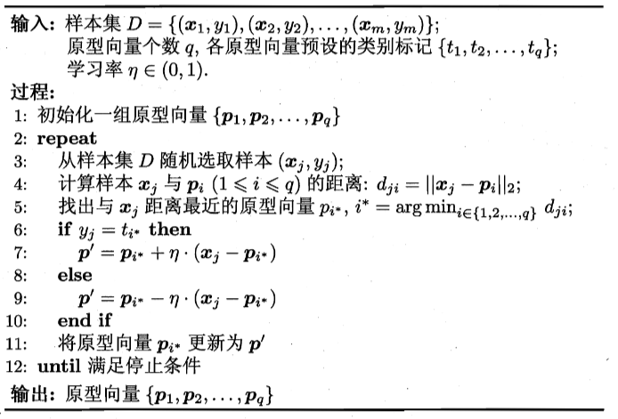

# 9 聚类

## 9.1 聚类任务

将数据样本划分为若干个通常不相交的“簇”（cluster）

假定样本集 $D=\{x_1,x_2,...,x_m\}$ 包含 $m$ 个无标记样本，每个样本 $x_i$ $=(x_{i1};x_{i2};...;x_{in})$ 是一个 $n$ 维的特征向量，聚类算法将样本集 $D$ 划分成 $k$ 个不相交的簇 $\{C_l|l=1,2,...,k\}$。其中 $C_{l^{\prime}}\cap_{l^{\prime}\neq l}C_l=\emptyset$，且 $D$
$=\mathcal{U}_{l=1}^kC_l$ 

相应地，用 $\lambda_j\in\{1,2,...,k\}$ 表示样本 $x_j$ 的“簇标记”（即cluster label），即 $x_j\in C_{\lambda_j}$。

聚类的结果可用包含 $m$ 个元素的簇标记向量 $\lambda=\{\lambda_1;\lambda_2;...,\lambda_m\}$ 表示


## 9.2 性能度量

外部指标：将聚类结果与某个“参考模型”进行比较：Jaccard 系数，FM 指数，Rand 指数

内部指标：直接考察聚类结果而不用任何参考模型：DB 指数，Dunn 指数

基本想法：簇内相似度高，且簇间相似度低

### 外部指标

对数据集 $D=\{x_1,x_2,...,x_m\}$，假定通过聚类得到的簇划分为 $C= \{ C_1, C_2, . . . , C_k\}$，参考模型给出的簇划分为 $C^*=\{C_1^*,C_2^*,...,C_s^*\}$。相应地，令 $\lambda$ 与 $\lambda^*$ 分别表示与 $C$ 和 $C^*$ 对应的簇标记向量

我们将样本两两配对考虑，定义
$$
\begin{aligned}
a=|SS|,\quad SS&=\{(x_i,x_j)|\lambda_i=\lambda_j,\lambda_i^*=\lambda_j^*,i<j\}\\
b=|SD|,\quad SD&=\{(x_i,x_j)|\lambda_i=\lambda_j,\lambda_i^*\neq\lambda_j^*,i<j\}\\
c=|DS|,\quad DS&=\{(x_i,x_j)|\lambda_i\neq\lambda_j,\lambda_i^*=\lambda_j^*,i<j\}\\
d=|DD|,\quad DD&=\{(x_i,x_j)|\lambda_i\neq\lambda_j,\lambda_i^*\neq\lambda_j^*,i<j\}
\end{aligned}
$$

- Jaccard 系数：$\mathrm{JC}=\frac{a}{a+b+c}$
- FM 指数：$\mathrm{FMI}=\sqrt{\frac{a}{a+b}\cdot\frac{a}{a+c}}$
- Rand 指数：$\mathrm{RI}=\frac{2(a+d)}{m(m-1)}$

$[0,1]$ 区间内，越大越好

### 内部指标

通过聚类得到的簇划分为 $C= \{ C_1, C_2, . . . , C_k\}$

簇 C 内样本间的平均距离、最远距离；簇 $C_i$ 与簇 $C_j$ 最近样本间的距离；簇 $C_i$ 与簇 $C_j$ 中心点间的距离
$$
\begin{aligned}
\operatorname{avg}(C)&=\frac{2}{|C|(|C|-1)}\sum_{1\leqslant i<j\leqslant|C|}\mathrm{dist}(\boldsymbol{x}_{i},\boldsymbol{x}_{j})\\
\mathrm{diam}(C)&=\max_{1\leqslant i<j\leqslant|C|}\mathrm{dist}(\boldsymbol{x}_{i},\boldsymbol{x}_{j})\\
d_{\min}(C_{i},C_{j})&=\min_{\boldsymbol{x}_{i}\in C_{i},\boldsymbol{x}_{j}\in C_{j}}\mathrm{dist}(\boldsymbol{x}_{i},\boldsymbol{x}_{j})\\
d_{\mathrm{cen}}(C_i,C_j)&=\mathrm{dist}(\boldsymbol{\mu}_i,\boldsymbol{\mu}_j)
\end{aligned}
$$
DB 指数（越小越好）
$$
\mathrm{DBI}=\frac{1}{k}\sum_{i=1}^{k}\max_{j\neq i}\left(\frac{\arg(C_{i})+\arg(C_{j})}{d_{\mathrm{cen}}(\boldsymbol{\mu}_{i},\boldsymbol{\mu}_{j})}\right)
$$
Dunn 指数（越大越好）
$$
\mathrm{DI}=\min_{1\leqslant i\leqslant k}\left\{\min_{j\neq i}\left(\frac{d_{\min}(C_i,C_j)}{\max_{1\leqslant l\leqslant k}\operatorname{diam}(C_l)}\right)\right\}
$$

## 9.3 距离计算

闵可夫斯基距离
$$
\mathrm{dist}_{\mathrm{mk}}(\boldsymbol{x}_i,\boldsymbol{x}_j)=\left(\sum_{u=1}^n|x_{iu}-x_{ju}|^p\right)^{\frac{1}{p}}
$$
p = 2：欧氏距离
$$
\mathrm{dist}_{\mathrm{ed}}(\boldsymbol{x}_i,\boldsymbol{x}_j)=||\boldsymbol{x}_i-\boldsymbol{x}_j||_2=\sqrt{\sum_{u=1}^n\left|x_{iu}-x_{ju}\right|^2}
$$
p = 2：曼哈顿距离
$$
\operatorname{dist}_{\text{man}}(\boldsymbol{x}_i,\boldsymbol{x}_j)=||\boldsymbol{x}_i-\boldsymbol{x}_j||_1=\sum_{u=1}^n|x_{iu}-x_{ju}|
$$

- 连续属性：在定义域上有无穷多个可能的取值
- 离散属性：在定义域上是有限个可能的取值
- 有序属性
- 无序属性

对无序属性，可使用 VDM 

令 $m_{u,a}$ 表示属性 $u$ 上取值为 $a$ 的样本数，$m_{u,a,i}$ 表示在第 $i$ 个样本簇中在属性 $u$ 上取值为 $a$ 的样本数，$k$ 为样本簇数，则属性 $u$ 上两个离散值 $a$ 与 $b$ 之间的 VDM 距离为：
$$
\mathrm{VDM}_p\left(a,b\right)=\sum_{i=1}^k\left|\frac{m_{u,a,i}}{m_{u,a}}-\frac{m_{u,b,i}}{m_{u,b}}\right|^p
$$
对混合属性，可使用 MinkovDM
$$
\mathrm{MinkovDM}_p(\boldsymbol{x}_i,\boldsymbol{x}_j)=\left(\sum_{u=1}^{n_c}|x_{iu}-x_{ju}|^p+\sum_{u=n_c+1}^n\mathrm{VDM}_p(x_{iu},x_{ju})\right)^{\frac{1}{p}}
$$
加权距离（样本中不同属性的重要性不同时）：
$$
\mathrm{dist}_{\mathrm{wmk}}(\boldsymbol{x}_i,\boldsymbol{x}_j)=\begin{pmatrix}w_1\cdot|x_{i1}-x_{j1}|^p+\ldots+w_n\cdot|x_{in}-x_{jn}|^p\end{pmatrix}^{\frac{1}{p}} \quad \omega_i\geq0,\quad \sum_{i=1}^n\omega_i=1
$$


## 9.4 原型聚类

假设：聚类结构能通过一组原型刻画
过程：先对原型初始化，然后对原型进行迭代更新求解

### 9.4.1 k 均值算法

给定数据集 $D=\{x_1,x_2,...,x_m\}$，k 均值算法针对聚类所得簇划分 $D=\{x_1,x_2,...,x_m\}$ 最小化平方误差
$$
E=\sum_{i=1}^k\sum_{x\in C_i}\|x-\mu_i\|_2^2
$$

其中，$\mu_i$ 是簇 $C_i$ 的均值向量

$E$ 值在一定程度上刻画了簇内样本围绕簇均值向量的紧密程度，$E$ 值越小，则簇内样本相似度越高

每个簇以该簇中所有样本点的“均值”表示

算法流程（迭代优化）：

```
Step1: 随机选取k个样本点作为簇中心
Step2: 将其他样本点根据其与簇中心的距离，划分给最近的簇
Step3: 更新各簇的均值向量，将其作为新的簇中心
Step4: 若所有簇中心未发生改变，则停止；否则执行Step2
```

### 9.4.2 学习向量量化（LVQ）

LVQ 假设数据样本带有类别标记，学习过程中利用样本的这些监督信息来辅助聚类

给定样本集 $D=\{(x_1,y_1),(x_2,y_2),\ldots,(x_m,y_m)\}$，每个样本 $x_j$ 是由 $n$ 个属性描述的特征向量 $(x_j1;x_{j2};\ldots;x_{jn}),y_j\in\mathcal{Y}$ 是样本 $x_j$ 的类别标记。LVQ 的目标是学得一组 $n$ 维原型向量 $\{p_1,p_2,\ldots,p_q\}$，每个原型向量代表一个聚类簇，簇标记 $t_i\in\mathcal{Y}$



### 9.4.3 高斯混合聚类（GMM）

用概率模型来表达聚类原型：

多元高斯分布的定义：对 n 维样本空间中的随机向量 x , 若 x 服从高斯分布，则其概率密度函数为
$$
p(\boldsymbol{x})=\frac{1}{(2\pi)^{\frac{n}{2}}|\boldsymbol{\Sigma}|^{\frac{1}{2}}}e^{-\frac{1}{2}(\boldsymbol{x}-\boldsymbol{\mu})^{\mathrm{T}}\boldsymbol{\Sigma}^{-1}(\boldsymbol{x}-\boldsymbol{\mu})}
$$
其中 $\boldsymbol{\mu}$ 是 $n$ 维均值向量，Σ 是 $n\times n$ 的协方差矩阵

高斯混合分布的定义：
$$
p_{\mathcal{M}}(\boldsymbol{x})=\sum_{i=1}^k\alpha_i\cdotp(\boldsymbol{x}\mid\boldsymbol{\mu}_i,\boldsymbol{\Sigma}_i)
$$
该分布共由 $k$ 个混合成分组成，每个混合成分对应一个高斯分布。其中 $\mu_i$ 与 $\Sigma_i$ 是第 $i$ 个高斯混合成分的参数，而 $\alpha_i>0$ 为相应的“混合系数”，$\sum_{i=1}^k\alpha_i=1$

假设样本的生成过程由高斯混合分布给出：

首先，根据 $\alpha_1,\alpha_2,...,\alpha_k$ 定义的先验分布选择高斯混合成分，其中 $\alpha_i$ 为选择第 $i$ 个混合成分的概率，然后，根据被选择的混合成分的概率密度函数进行采样，从而生成相应的样本

样本$\boldsymbol{x}_j$由第$i$个高斯混合成分生成的后验概率为：
$$
\begin{aligned}&p_{\mathcal{M}}(z_{j}=i\mid\boldsymbol{x}_{j})=\frac{P(z_{j}=i)\cdot p_{\mathcal{M}}(\boldsymbol{x}_{j}\mid z_{j}=i)}{p_{\mathcal{M}}(\boldsymbol{x}_{j})}=\frac{\alpha_{i}\cdot p(\boldsymbol{x}_{j}\mid\boldsymbol{\mu}_{i},\boldsymbol{\Sigma}_{i})}{\sum_{l=1}^{k}\alpha_{l}\cdot p(\boldsymbol{x}_{j}\mid\boldsymbol{\mu}_{l},\boldsymbol{\Sigma}_{l})}
\end{aligned}
$$
简记为 $\gamma_{ji}\:(i=1,2,\ldots,k)$

参数估计可采用极大似然法，考虑最大化对数似然
$$
LL(D)=\ln\left(\prod_{j=1}^{m}p_{\mathcal{M}}(x_{j})\right)=\sum_{j=1}^{m}\ln\left(\sum_{i=1}^{k}\alpha_{i}\cdotp(x_{j}\mid\boldsymbol{\mu}_{i},\boldsymbol{\Sigma}_{i})\right)
$$
EM 算法：

- E 步：根据当前参数计算每个样本属于每个高斯成分的后验概率
- M 步：更新模型参数

$$
\begin{aligned}
\frac{\partial LL(D)}{\partial\mu_i}=0 \quad \longrightarrow \quad &\mu_i=\frac{\sum_{j=1}^m\gamma_{ji}x_j}{\sum_{j=1}^m\gamma_{ji}}\\
\frac{\partial LL(D)}{\partial\Sigma_i}=0\quad\longrightarrow\quad &\Sigma_i=\frac{\sum_{j=1}^m\gamma_{ji}(x_j-\mu_i)(x_j-\mu_i)^T}{\sum_{j=1}^m\gamma_{ji}}\\
\text{拉格朗日乘子法}\quad\longrightarrow\quad &\alpha_i=\frac{1}{m}\sum_{j=1}^m\gamma_{ji}
\end{aligned}
$$


## 9.5 密度聚类 - DBSCAN 算法

从样本密度的角度考察样本的连接性，使密度相连的样本归结到一个簇，更符合直观认知

基于一组“邻域”参数（$\epsilon$，$MinPts$）来刻画样本分布的紧密程度

基本概念：

- $\epsilon$ 邻域：样本的 $\epsilon$ 邻域包含与该样本距离不大于 $\epsilon$ 的其他样本
- 核心对象：样本的 $\epsilon$ 邻域至少包含 MinPts 个样本
- 密度直达：样本 j：位于样本 i 的 $\epsilon$ 邻域中，且样本 i 是核心对象
- 密度可达：样本序列 i，j，...，k 中每一个样本都由前一个样本密度直达
- 密度相连：样本 i 和 j：均由 k 密度可达
- 簇：由密度可达关系导出的最大密度相连样本集合


## 9.6 层次聚类 - AGNES 算法

在不同层次对数据集进行划分，从而形成树形的聚类结构

AGNES算法（自底向上的层次聚类算法）：首先，将样本中的每一个样本看做一个初始聚类簇，然
后在算法运行的每一步中找出距离最近的两个聚类簇进行合并，该过程不断重复，直到达到预设的聚类簇的个数。
$$
\begin{aligned}&\text{最小距离:}\quad d_{\min}(C_{i},C_{j})=\min_{\boldsymbol{x}\in C_{i},\boldsymbol{z}\in C_{j}}\mathrm{dist}(\boldsymbol{x},\boldsymbol{z})\\
&\text{最大距离:}\quad d_{\max}(C_i,C_j)=\max_{\boldsymbol{x}\in C_i,\boldsymbol{z}\in C_j}\mathrm{dist}(\boldsymbol{x},\boldsymbol{z})\\
&\text{平均距离:}\quad d_{\mathrm{avg}}(C_{i},C_{j})=\frac{1}{|C_{i}||C_{j}|}\sum_{\boldsymbol{x}\in C_{i}}\sum_{\boldsymbol{z}\in C_{j}}\mathrm{dist}(\boldsymbol{x},\boldsymbol{z})\end{aligned}
$$
