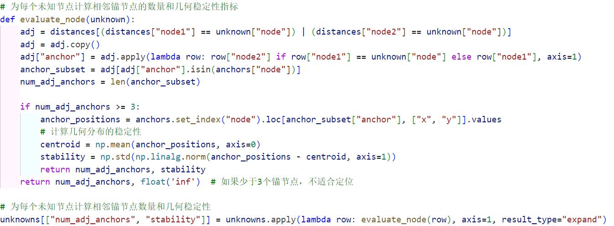
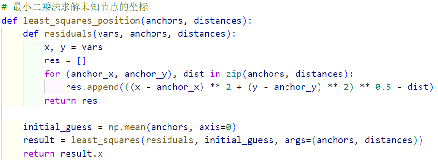
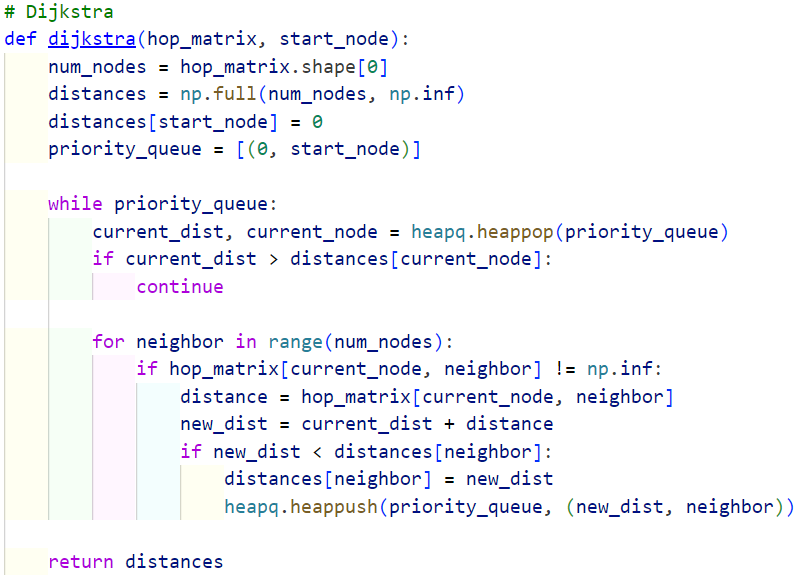
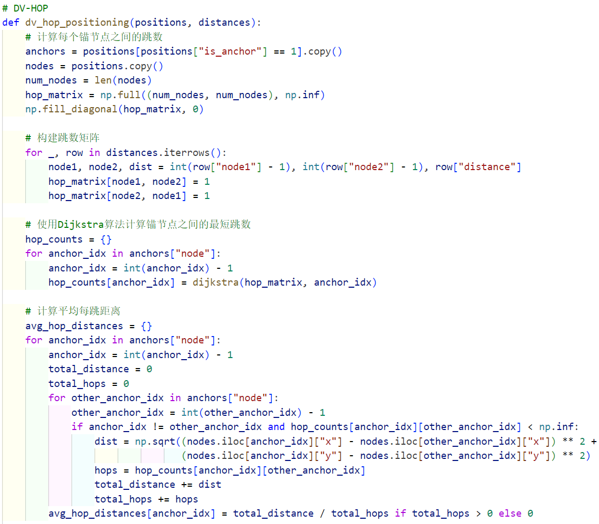
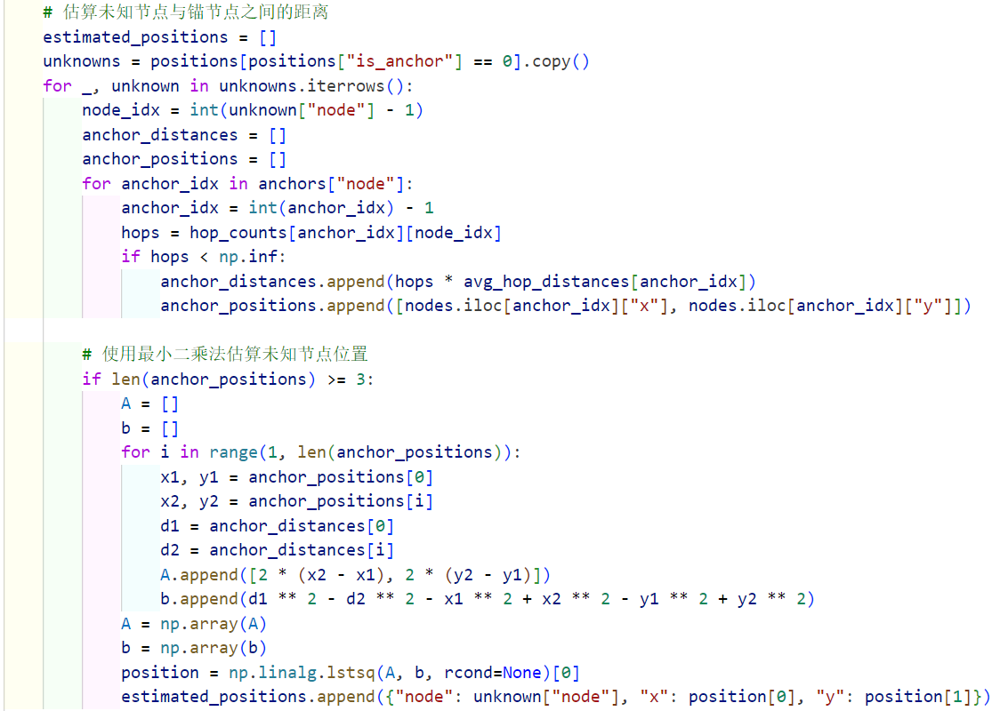

# 物联网应用软件开发实验1实验报告

## 实验内容

本实验的目标是使用两种无线传感器网络定位算法——迭代多边定位算法和DV-HOP定位算法，来估算网络中未知节点的位置，并比较两种方法在不同误差环境下的表现。实验数据由节点位置和邻接矩阵组成，分别包含锚节点和未知节点。我们通过 Python 实现了这两种算法。


## 代码实现过程

### 迭代多边定位算法

迭代多边定位算法的基本思想是通过逐步将未知节点定位并将其转化为锚节点，进而帮助定位其他未知节点。这个算法的实现过程包括以下几个核心步骤：

1. **加载节点位置和距离信息**： 首先，从文件中加载所有节点的位置数据和邻接矩阵数据。这些数据包括节点的编号、坐标以及是否为锚节点的标志（1表示锚节点，0表示待定位节点）。节点位置数据和邻接矩阵数据是后续定位计算的基础。

2. **节点评价与选择**： 在每次迭代中，我们需要选择一个合适的未知节点进行定位。为了提高定位精度，我们通过以下标准来评估未知节点：

   - **相邻锚节点数量**：只有与至少3个锚节点相邻的未知节点才有可能被定位。因此，我们首先计算每个未知节点与现有锚节点的相邻数量。

   - **几何分布稳定性**：在满足相邻锚节点数量要求的前提下，我们进一步计算锚节点的几何分布稳定性。几何稳定性是通过计算相邻锚节点相对于其质心的标准差来衡量的，标准差越小表示锚节点分布越均匀，从而使得定位精度更高。

     

   根据上述两个标准，我们对所有未知节点进行排序，优先选择相邻锚节点数量多且几何分布稳定的节点进行定位。这样可以保证定位过程中误差的累积尽可能小。

3. **最小二乘法定位**： 对于选定的未知节点，我们使用最小二乘法来估算其位置与锚节点之间的距离误差。

   - **定义误差函数**：误差函数的定义是每个锚节点的实际距离与估算距离之间的差值。使用`scipy.optimize` 中的 `least_squares`函数，我们可以最小化这个误差函数，从而得到未知节点的最优估算位置。

   - **初始猜测值**：为了进行优化，我们使用与该未知节点相邻锚节点的平均位置作为初始猜测值，以加速收敛过程。

     

4. **更新锚节点集合**： 定位成功后，我们将该未知节点的坐标加入锚节点集合中，使其可以作为锚节点辅助其他未知节点的定位。这个步骤的作用是使得定位过程逐步扩展，增加定位成功的节点数量。

5. **迭代过程**： 重复上述步骤，逐步定位每一个符合条件的未知节点，直到无法再定位更多的节点为止。在每次迭代中，都会对未知节点集合进行更新，以确保定位过程的有效性和准确性。

在代码实现中，我们对节点选择策略进行了优化，不仅考虑相邻锚节点的数量，还引入了几何分布稳定性的评估。这种策略的好处在于，它可以确保用于定位的锚节点分布尽可能均匀，从而减少几何误差带来的不稳定性。具体来说，稳定性通过相邻锚节点相对于质心的标准差来衡量，标准差越小，说明锚节点分布越均匀，定位的可靠性也越高。

此外，为了提高计算效率，我们采用了一些加速策略。例如，在每次迭代中，我们仅更新新增的锚节点集合，而不是重新计算所有锚节点的信息。这种优化策略有效地减少了不必要的计算开销，从而提高了整体算法的效率。

**运行结果**：

```
RMSE for 5% error: 0.8647
RMSE for 10% error: 21.2841
```

通过实验，我们观察到在5%误差条件下，迭代多边定位算法的定位精度较高，RMSE值较小，表明估算的未知节点位置接近真实位置。然而，在10%误差条件下，算法的表现明显下降，定位误差显著增大。这说明该算法对于距离测量误差较为敏感，随着误差增大，定位精度会显著降低。因此，在应用迭代多边定位算法时，距离测量的精度对于最终的定位效果至关重要。


### DV-HOP定位算法

DV-HOP定位算法是一种经典的分布式无线传感器网络定位方法，主要适用于距离测量存在较大误差的场景。其基本思想是利用跳数信息来估算未知节点与锚节点之间的距离，进而定位未知节点。代码实现过程包括以下几个步骤：

1. **跳数计算**：

   - **构建跳数矩阵**：首先，使用邻接矩阵数据构建节点之间的跳数矩阵。在初始状态下，跳数矩阵中的所有节点之间的距离被设为无穷大（表示节点之间不可达），而节点自身到自身的跳数为0。通过遍历邻接矩阵，将相邻节点之间的距离设为1，表示它们之间直接相连。

   - **使用Dijkstra算法计算最短跳数**：接下来，我们为每个锚节点使用Dijkstra算法计算到其他所有节点的最短跳数。Dijkstra算法是一种经典的最短路径算法，利用优先级队列的特性逐步更新节点的最短路径，直到遍历完所有节点。通过Dijkstra算法，能够有效地确定每个锚节点到其他节点的最小跳数。

     

2. **计算平均每跳距离**：

   - **平均每跳距离的估算**：在获得所有锚节点之间的最短跳数后，我们计算每个锚节点的平均每跳距离。具体来说，平均每跳距离是通过将锚节点之间的物理距离累加并除以跳数得到的。这样，我们可以将跳数信息转换为物理距离，用于后续未知节点的位置估算。
   - **计算逻辑**：对于每个锚节点，我们遍历所有其他锚节点，计算它们之间的欧氏距离，并累加所有距离和跳数。最终，使用物理距离总和除以跳数总和得到平均每跳距离。这一步的核心是通过跳数信息来推断节点之间的物理距离，以避免直接测量物理距离时可能出现的误差累积。

   

3. **未知节点定位**：

   - **估算未知节点与锚节点之间的距离**：对于每个未知节点，我们根据锚节点与未知节点之间的跳数以及平均每跳距离来估算它与锚节点的物理距离。跳数乘以平均每跳距离即为未知节点到锚节点的估算距离。
   - **最小二乘法求解未知节点位置**：在获得未知节点到锚节点的估算距离后，我们使用最小二乘法来估算未知节点的位置。首先，选取至少三个锚节点，并建立对应的线性方程组，方程组的形式为每对锚节点之间的距离差异。然后，通过`np.linalg.lstsq`函数求解方程组，得到未知节点的坐标估计值。

   

4. **保存定位结果**：定位完成后，我们将所有估算得到的未知节点的位置存储到文件中，以便后续分析和比较。

**运行结果**：

```
RMSE: 9.8307
```

DV-HOP定位算法通过跳数和平均每跳距离来推断未知节点的位置，避免了直接测量物理距离时的误差传播，因此在较大的测量误差环境中表现得较为稳定。尽管其精度不如迭代多边定位算法在低误差条件下的表现，但由于其对测量误差的鲁棒性，在高误差环境下展现了较好的性能。这使得DV-HOP算法在测距设备精度有限或噪声较大的场景中具有重要的应用价值。

通过对两种算法的比较，我们可以得出结论，DV-HOP算法更适用于节点之间物理距离测量误差较大的场景，而迭代多边定位算法在测距误差较小时能够提供更高的定位精度。因此，选择具体算法时应根据实际环境的测量精度需求进行权衡。


## 实验结果与误差计算

在误差计算中，我们采用了均方根误差（RMSE）来评估定位精度。RMSE的计算公式如下：
$$
𝑅𝑀𝑆𝐸=\sqrt{\frac{1}{N}\sum_{i=1}^{N}(𝑥_𝑖^′−𝑥_𝑖 )^2 +(𝑦_𝑖^′−𝑦_𝑖 )^2 )}
$$

- **迭代多边定位算法**在 5% 误差条件下表现出较高的精度，RMSE 为 0.8647，但在 10% 误差条件下误差明显增大，达到 21.2841。由于迭代多边定位算法是通过取 N 和圆的交点进行定位，扰动将改变两点间的距离，使得用于定位的部分圆半径不正确，出现定位不准确或定位点不合实际的情况。
- **DV-HOP 算法**的 RMSE 为 9.8307，介于迭代多边定位算法在 5% 和 10% 误差之间。

通过将两种算法的定位结果进行比较，我们可以看到，在误差较小时，迭代多边定位算法能够更好地精确估算未知节点的位置，但当误差较大时，其精度会显著下降。而 DV-HOP 算法由于使用跳数和平均每跳距离来估算位置，对测量误差的敏感度较低，因此在高误差环境中表现相对稳定。


## 结论

通过本次实验，我们发现迭代多边定位算法在低误差条件下表现更好，但在误差较大时性能下降明显。而 DV-HOP 算法定位精度不如迭代多边定位算法在误差较小时的表现。

这种差异主要源于两种算法对误差处理方式的不同：迭代多边定位算法依赖于较精确的距离测量，而DV-HOP算法通过跳数和平均每跳距离来估算距离，对距离测量误差相对不敏感。因此，选择合适的定位算法应依据具体应用环境中误差的大小和网络结构的特性。对于需要精确定位的应用场景，迭代多边定位算法更加适合，但需要保证距离测量的精度。而对于噪声较大或无法进行精确距离测量的场景，DV-HOP算法由于其鲁棒性较强，是一个更加稳妥的选择。