# 3 词法分析

## 3.1 词法分析器的作用

- 读入字符流，组成词素，输出词法单元序列
- 过滤空白、换行、制表符、注释等
- 将词素添加到符号表中
- 在逻辑上独立于语法分析，但是通常和语法分析器处于同一趟中

### 3.1.1 词法分析和语法分析

把编译过程的分析部分分为词法分析和语法分析的原因

1. 简化编译器的设计
2. 提高编译器的效率
3. 增强编译器的可移植性

### 3.1.2 词法单元、模式和词素

- 词法单元：包含单元名（Token-name）和可选的属性值（attributevalue）。单元名是表示某种词法单位抽象符号。语法分析器通过单元名即可确定词法单元序列的结构。
- 词素：源程序中的字符序列，它和某类词法单元的模式匹配，被词法分析器识别为该词法单元的实例。
- 模式：一个词法单元的词素可能具有的形式

### 3.1.3 词法单元的属性

一个模式匹配多个词素时，必须通过属性来传递附加的信息。属性值将被用于语义分析、代码生成等阶段。

不同的目的需要不同的属性。因此，属性值通常是一个结构化数据。

一个表舒服的属性值是一个指向符号表中该标识符对应条目的指针

### 3.1.4 词法错误

## 3.2 词法单元的规约

### 3.2.1 串和语言

- **字母表**：一个有限的符号集合。典型的字母表包括字母、数位和标点符

- **串**：字母表中符号组成的一个有穷序列、
  - 串 $s$ 的长度 $|s|$
  - 空串 $ε$，长度为 $0$ 的串
- **语言**：给定字母表上一个任意的可数的串的集合

- 和串有关的术语:

  - **前缀**：从串的尾部删除0个或多个符号后得到的串

  - **后缀**：从串的开始处删除0个或多个符号后得到的串

  - **子串**：删除串的某个前缀和某个后缀得到的串

  - **真前缀、真后缀、真子串**：既不等于原串，也不等于空串的前缀、后缀、子串

  - **子序列**：从原串中删除0个或者多个符号后得到的串

- 串的运算
  - 连接：x 和 y 的连接时把 y 附加到 x 的后面形成的串，记作 xy
  - 指数运算（幂运算）：$s^0 = ε，s^1 = s，s^i=s^{i-1}s$

### 3.2.2 语言上的运算

- L 和 M 的并：$L \bigcup M = \{ s | s \in L \or s \in M \}$
- L 和 M 的连接：$L  M = \{ st | s \in L \and t \in M \}$
- L 的 Kleene 闭包：将 L 连接 0 次或多次后得到的串集，$L^* = \bigcup_{i=0}^{\infin} L^i$，$L^0 = \{ ε \}$，$L^i = L^{i-1}L$
- L 的正闭包：与 L 的 Kleene 闭包基本相同，但不包含 $L^0$，$L^+ = \bigcup_{i=1}^{\infin} L^i$

### 3.2.3 正则表达式

可以描述所有通过对某个字母表上的符号应用运算符而得到的语言。其定义的集合叫做**正则集合**

每个**正则表达式** $r$ 可以描述一个**语言** $L(r)$，也即其定义的正则集合

- 基本部分：
  - $ε$ 是一个正则表达式，$L(ε)={ε}$
  - 如果 $a$ 是 $Σ$ 上的一个符号，那么 **a** 是正则表达式，$L($**a**$)=\{a \}$
- 归纳步骤：
  - 选择：$(r) | (s)$，$L((r) | (s))=L(r) U L(s)$
  - 连接：$(r)(s)$，$L((r)(s))=L(r)L(s)$
  - 闭包：$(r)^*$，$L((r)^*)=(L(r))^*$
  - 括号：$(r)$，$L((r))=L(r)$\
- 运算的优先级：$* > 连接符 > |$
  - $(a)|((b)*(c))$ 可以改写为 $a|b*c$

**正则表达式的性质**

等价性：如果两个正则表达式 r 和 s 表示同样的语言，则 $r=s$

代数定律：

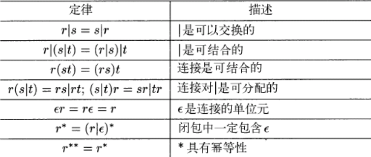

### 3.2.4 正则定义

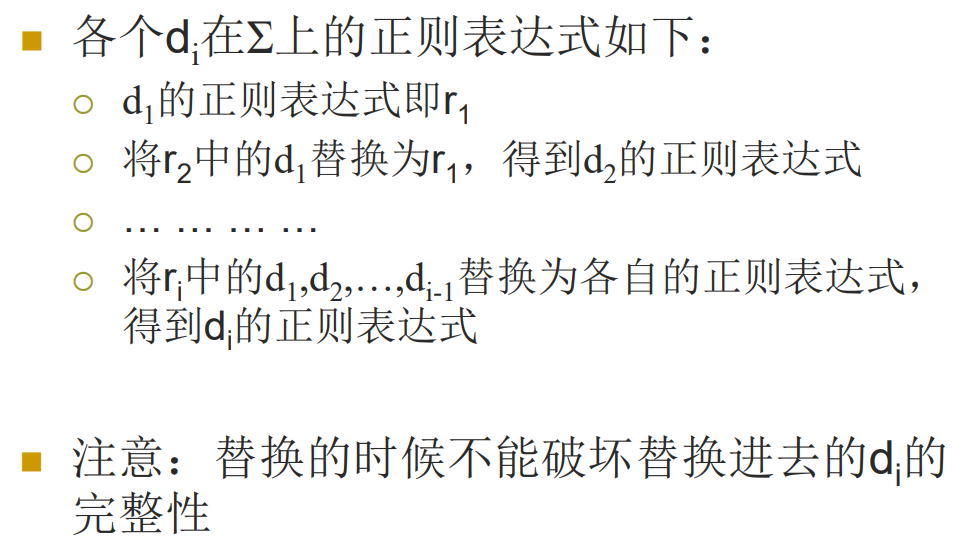

### 3.2.5 正则表达式的扩展

基本运算符：并 连接 闭包

扩展运算符

- 一个或多个：r+ , 等价于 rr*
- 零个或一个： r?，等价于 ε|r
- 字符类 [abc] 等价于 a|b|c， [a-z] 等价于 a|b|…|z

## 3.3 词法单元的识别

词法分析器要求能够检查输入字符串，在**前缀**中找出和某个模式匹配的词素

- 首先通过正则定义来描述各种词法单元的模式
- 定义ws → (blank | tab | newline)+ 来消除空白
  - 词法分析器识别到这个模式时，不返回词法单元，继续识别其它模式

### 3.3.1 状态转换图

**状态转换图**是词法分析器的重要组件之一。可以将正则表达式转换成状态转换图

- 状态：表示在识别词素的过程中可能出现的情况
  - 状态看作是已处理部分的总结
  - 某些状态为接受状态或最终状态，表明已经找到词素。用双层的圈表示一个接受状态
  - 加上*的接受状态表示最后读入的符号不在词素中
  - 开始状态（初始状态）：用start边表示
- 边：从一个状态指向另一个状态；边的标号是一个或者多个符号
  - 如果当前符号为 s，下一个输入符号为 a，就沿着从 s 离开，标号为 a 的边到达下一个状态

### 3.3.2 保留字和标识符的识别

在符号表中预先填写保留字，并指明它们不是普通标识符。为关键字/保留字建立单独的状态转换图。并设定保留字的优先级高于标识符

## 3.4 有穷自动机

不确定的有穷自动机（NFA）：一个符号标记离开同一状态的多条边。可以有边的标号是 $ε$

确定的有穷状态自动机（DFA）：对于每个状态和字母表中的每个字符，有且仅有一条离开该状态、以该符合为标号的边。没有标记为 $ε$ 的边

### 3.4.1 不确定的有穷自动机

NFA 由以下几部分组成：

- 一个有穷的状态集合 $S$
- 一个输入符号集合 $Σ$
- 转换函数对于每个状态和 $Σ ∪ \{ε\}$ 中的符号，给出相应的后继状态集合
- 一个状态 $S_0$ 被指定为开始状态/初始状态
- $S$ 的一个子集 $F$ 被指定为接受状态

### 3.4.2 转换表

NFA可以表示为一个转换表，表的各行对应于状态，各列对应于输入符号和 ε，表中的元素表示给定状态在给定输入下的后继状态

### 3.4.3 自动机中输入字符串的接受

一个 NFA 接受输入字符串 x，当且仅当对应的转换图中存在一条从开始状态到某个接受状态的路径，使得该路径中各条边上的标号组成符号串 x （路径中可能包含 $ε$ 边）

只要存在从开始状态到接受状态的路径，符号串就认为被 NFA 接受

由一个NFA A定义（接受）的语言是从开始状态到某个接受状态的所有路径上的符号串集合，称为 L(A)

### 3.4.4 确定的有穷状态机

一个NFA被称为DFA，如果

- 没有 ε 之上的转换动作
- 对于每个状态 s 和每个输入符号 a，有且只有一条标号为 a 的边

可以高效判断一个串能否被一个DFA接受

每个 NFA 都有一个等价的 DFA，即它们接受同样的语言

## 3.5 从正则表达式到自动机

### 3.5.1 从 NFA 到 DFA 的转换

**子集构造法**

基本思想： DFA 每个状态 → NFA 一个状态集

输入：一个 NFA N

输出：一个接受相同语言的 DFA D

s 表示 N 中的单个状态，T 代表 N 的一个状态集

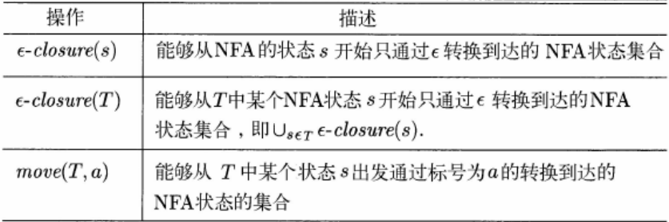

D 的开始状态是 $ε-closure(s_0)$，D 的接受状态是所有至少包含了 N 的一个接受状态的状态集合。

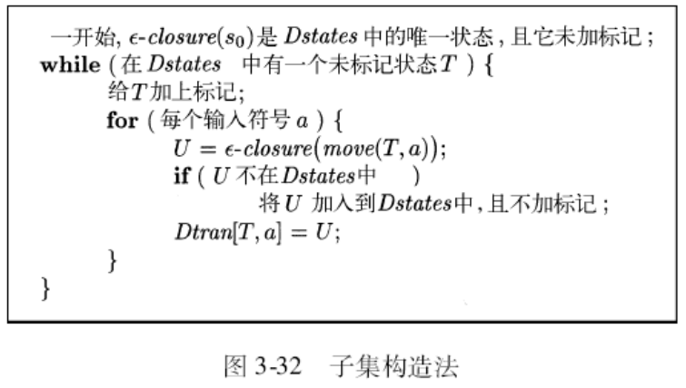

对 NFA 的任何状态集合 $ε-closure(T)$ 的计算

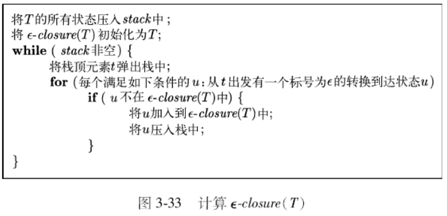

### 3.5.2 从正则表达式构造 NFA

输入：字母表 $Σ$ 上的一个正则表达式 $r$

输出：一个接受 $L(r)$ 的 NFA N

- 基本思想：

  - 根据正则表达式的递归定义，按照正则表达式的结构递归地构造出相应的 NFA

  - 算法分成两个部分：
    - 基本规则处理 $ε$ 和单符号的情况
      - 对于每个正则表达式的运算，建立构造相应 NFA 的方法

- 基本规则：

  - 表达式 $ε$：

    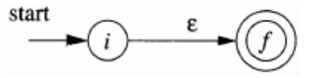

  - 表达式 a：

    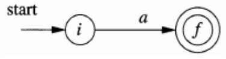

- 归纳规则：

  - 正则表达式 s 和 t 的 NFA 分别是 N(s) 和 N(t)

  - $r=s|t$， r 的 NFA N(r)

    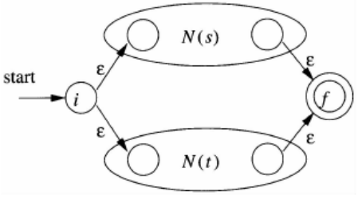

  - 正则表达式 $r=st$， N(r)

    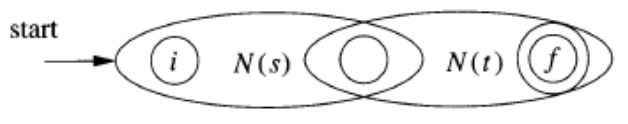

  - 正则表达式 $r=s^*$, N(r)

    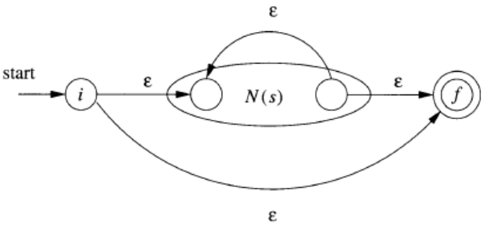

### 3.5.3 最小化一个 DFA 的状态数

DFA化简：状态数最小化

等价的 DFA 可能具有不同的状态个数

任何正则语言都有一个唯一的（不计同构）状态数目最少的 DFA

原理：将一个 DFA 的状态集合分划成多个组，每个组中的各状态之间相互不可区分，然后将每个组中的状态合并成状态最少 DFA 的一个状态

可区分的定义：

- 如果分别从状态 s 和状态 t 出发，沿着标号为 x 的路径到达的两个状态只有一个是接受状态，称为 x 区分状态 s 和 t
- 如果存在能够区分 s 和 t 的串，那么它们就是可区分的

**最小化算法**

1. 设置初始分划 $\Pi= \{S-F,F\}$

2. 迭代，不断分划：

   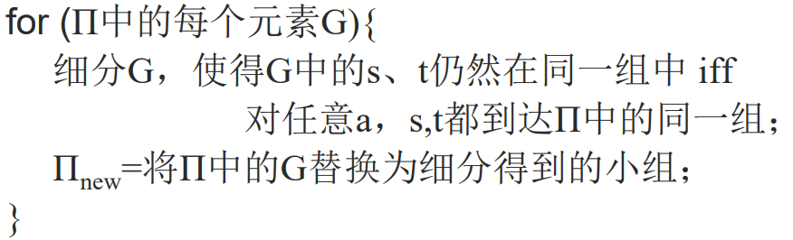

3. 如果 $\Pi_{new} ==\Pi$，令 $\Pi_{final} ==\Pi$，转步骤4；否则 $\Pi==\Pi_{new}$，转步骤2；
4. 在 $\Pi_{final}$ 的每个组中选择一个状态作代表，作为最小 DFA 的状态
   - 开始状态就是中包含原开始状态的组的代表
   - 接受状态就是包含了原接受状态的组的代表
   - 转化关系构造：如果 s 是中 G 的代表，而 s 在 a 上的转换到达 t，而 t 所在组的代表为 r，那么最小 DFA 中有从 s 到 r 的、在 a 上的转换

## 3.6 词法分析器生成工具的设计

### 3.6.1 生成的词法分析器的结构

基于词法单元的词法结构图或其它描述，手工编写代码扫描输入中的每个词素，并返回识别到的词法单元信息

使用词法分析器生成工具（如 lex / flex），给出描述词素的模式，利用工具编译为具有词法分析器功能的代码，高效且简单

