# 4 语法分析

## 4.1 引言

文法：用于描述程序设计语言语法的表示方法，能够自然地描述程序设计语言
构造的层次化语法结构

语法分析器：

- 输入：词法分析器输出的词法单元序列
- 输出：语法树表示
- 语法分析器功能：
  - 验证输入源程序的合法性，输出良构程序的语法结构
  - 对于病构的程序，能够报告语法错误，进行错误恢复

- 语法分析器的类型：通用型、自顶向下（LL文法）、自底向上（LR文法）

代表性文法：

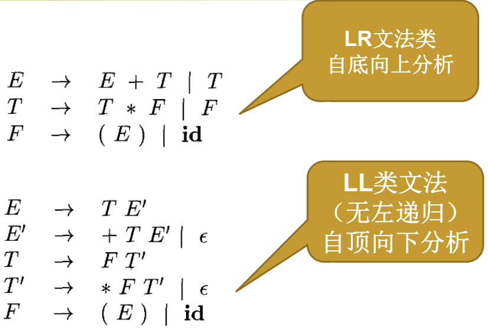

## 4.2 上下文无关文法（CFG）

### 4.2.1 上下文无关文法的定义

一个 CFG 由以下几个部分构成：

- **终结符号**：组成串的基本符号，与“词法单元名字”同义
- **非终结符号**
  - 语法变量，表示特定串的集合
  - 给出了语言的层次结构，这种层次结构是语法分析和翻译的关键
- 一个**开始符号**：某个特定的非终结符号，其表示的串集合是这个文法生成的语言
- 一组**产生式**
  - 描述将终结符号和非终结符号组合成串的方法
  - 产生式左部（头）是一个非终结符号
  - 符号 “→”
  - 一个由零个或多个终结符号与非终结符号组成的产生式右部（体）

### 4.2.2 符号表示约定

终结符号：

- 字母表里排在前面的小写字母：a、b、c
- 运算符：+、*
- 标点符号
- 数字：0-9

非终结符：

- 字母表里排在前面的大写字母：A、B、C
- 字母 S，通常表示开始符号
- 小写、斜体的名字：expr、stmt

文法符号：字母表里排在后面的大写字母（X、Y、Z）

终结符号串：字母表里排在后面的小写字母（u、v、...、z）

文法符号串：α、β…

不同可选体：α~1~、α~2~、α~3~

### 4.2.3 推导

产生式又可称为重写规则

推导：

- 将待处理的串中的某个非终结符号替换为这个非终结符号的某个产生式的体
- 从开始符号出发，不断进行上面的替换，就可以得到文法的不同句型

推导的一般性定义：

如果 $A\to\gamma$ 是一个产生式，那么 $\alpha AB\Rightarrow\alpha\gamma B$

经过零步或者多步推导出：$\overset{\star}{\operatorname*{\Longrightarrow}}$

- 对于任何串 $\alpha,\alpha\Rightarrow\alpha$，并且
- 如果 $\alpha\overset{\star}{\operatorname*{\Longrightarrow}}\beta$ 且 $\beta\overset{\star}{\operatorname*{\Longrightarrow}}\gamma$，那么 $\alpha\overset{\star}{\operatorname*{\Longrightarrow}}\gamma$

经过一步或者多步推导出：$\overset{+}{\operatorname*{\Longrightarrow}}$

- $\alpha\overset{\star}{\operatorname*{\Longrightarrow}}\beta$ 且 $\alpha$ 不等于 $\beta$ 等价于 $\alpha\overset{+}{\operatorname*{\Longrightarrow}}\beta$

句型：如果S $\overset{\star}{\operatorname*{\Longrightarrow}}$ α，那么 α 就是文法的一个句型。可能既包含非终结符，又包含终结符号；可以是空串

句子：文法的句子就是不包含非终结符号的句型

语言：文法 G 的语言就是 G 的句子的集合，记为 L(G)。ω 在 L(G) 中当且仅当 ω 是 G 的句子，即 S $\overset{\star}{\operatorname*{\Longrightarrow}}$ ω

非终结符号的替换顺序

- 最左推导：总是选择每个句型的最左非终结符号。记作 $\underset{lm}{\operatorname{\Longrightarrow}}$
- 最右推导：总是选择最右边的非终结符号。记作 $\underset{rm}{\operatorname{\Longrightarrow}}$

### 4.2.4 语法分析树和推导

推导的图形表示形式
根结点的标号是文法的开始符号
每个叶子结点的标号是非终结符号、终结符号或ε
每个内部节点的标号是非终结符号
每个内部结点表示某个产生式的一次应用
内部结点的标号为产生式头，结点的子结点从左到右是产生式的体

有时允许树的根不是开始符号（对应于某个短语）
树的叶子组成的序列是根的文法符号的句型
一棵分析树可对应多个推导序列，但是分析树和最左（右）推导序列之间具有一一对应关系

### 4.2.5 二义性

如果一个文法可以为一个句子生成多棵不同的语法分析树，则该文法为二义性文法

### 4.2.6 验证文法生成的语言

基本步骤：
首先证明L(G) $\subseteq$ L：G生成的每个串都在 L 中
然后证明 L $\subseteq$ L(G)：L的每个串都能由 G 生成
一般使用数学归纳法
证明 L(G) $\subseteq$ L：按照推导序列长度进行数学归纳
证明 L $\subseteq$ L(G)：按照符号串的长度来构造推导序列

### 4.2.7 上下文无关文法和正则表达式

每个正则语言都是一个上下文无关语言，但是反之不成立


## 4.3 设计文法

### 4.3.1 词法分析和语法分析

在进行高效的语法分析之前，需要对文法做以下处理：消除二义性、消除左递归、提取左公因子

### 4.3.2 消除二义性

基本思想: 在一个 then 和一个 else 之间出现的语句必须是“已匹配的”。也就是说 then 和 else 中间的语句不能以一个尚未匹配的 then 结尾

### 4.3.3 消除左递归

**消除立即左递归**（如果存在 $A→ Aα$，则称为立即左递归）：

假设非终结符号 A 存在立即左递归的情形，假设以 A 为左部的规则有 $A\to A\alpha_1\mid A\alpha_2\mid\cdots\mid A\alpha_m\mid \beta_1\mid\beta_2\mid\cdots\mid\beta_n$

首先对 A 产生式分组（所有 $\alpha_i$ 不等于 $\varepsilon$，$\beta_i$ 不以 A 开头）

$A\to\boxed{A\alpha_1\mid A\alpha_2\mid\cdots\mid A\alpha_m} \mid \boxed{\beta_1\mid\beta_2\mid\cdots\mid\beta_n}$

可以替换为：

$A\to\beta_1A' \mid \beta_2A' \mid \cdots \mid \beta_nA'$

$A^{\prime}{\rightarrow}\alpha_{1}A^{\prime} \mid \alpha_{2}A^{\prime} \mid \cdots \mid \alpha_{m}A^{\prime} \mid \epsilon$

**消除多步左递归**

输入：没有环和 ε 产生式的文法 G

输出：等价的无左递归的文法

步骤：
将文法的非终结符号任意排序为 $A_1, A_2, ...,A_n$

```
for i=1 to n do {
	for j = 1 to i-1 do {
		A_i → A_j y 替换为 A_i → x_1 y | x_2 y | ...
		其中 A_j  → x_1 y | x_2 y | ... 是以 A_j 为左部的所有产生式
	}
	消除 A_i 的立即左递归
}	
```

### 4.3.4 提取左公因子

输入：文法 G
输出：一个等价的提取了左公因子的文法

方法：对于每个非终结符号 A，找出它的两个或多个可选项之间的最长公共前缀 $\alpha$，且 $a\neq\varepsilon$，那么将 A 所有的产生式 $A{\to}\alpha\beta_1\mid\alpha\beta_2\mid...\mid\alpha\beta_n\mid\gamma $

替换为
$A{\operatorname*{\longrightarrow}}\alpha A^{\prime}\mid\gamma$
$A^{\prime}{\to}\beta_1\mid\beta_2\mid...\mid\beta_n$

### 4.3.5 非上下文无关语言的构造

通常用上下文无关文法描述其基本结构，不能用文法描述的特性在语义分析阶段完成。原因是上下文文法具有高效的处理算法。


## 4.4 自顶向下分析技术

### 4.4.1 递归下降分析

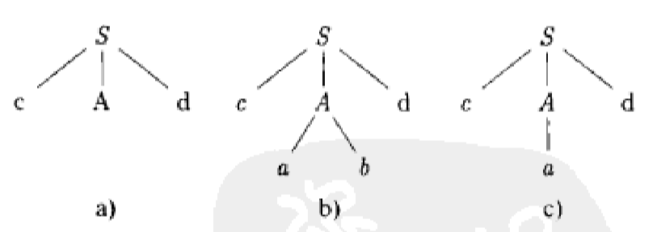

可能需要回溯，或者说，可能需要重复扫描输入

### 4.4.2 FIRST 和 FOLLOW

$FIRST(α)$ 是从串 $α$ 推导得到的串的**首符号的集合**，其中 $α$ 是一个由终结符号和非终结符号组成的文法符号串。如果 $\alpha \overset{\star}{\operatorname*{\Longrightarrow}}ε$，则 $ε$ 也包含在 $FIRST(α)$ 中。

**FIRST 函数的计算规则**：

1. **单个符号**：
   - 如果 $X$ 是一个终结符号，则 $FIRST(X) = {X}$。
   - 如果 $X$ 是非终结符号，且 $X → a...$ 是产生式，则将 $a$ 加入 $FIRST(X)$。
   - 如果 $X → ε$ 是产生式，则将 $ε$ 加入 $FIRST(X)$。

2. **文法符号串**：设 $α = X_1 X_2...X_n$，依次计算：
   - 将 FIRST($X_1$) 中的非 $ε$ 元素加入 $FIRST(α)$。
   - 如果 $ε ∈ FIRST(X_1)$，则加入 $FIRST(X_2)$ 中的非 $ε$ 元素，依次类推。
   - 如果所有 $X_i$ 的 $FIRST(X_i)$ 都包含 $ε$，那么将 $ε$ 加入 $FIRST(α)$。

对于文法：$E → TE'$   $E' → +TE' | ε$   $T → FT'$   $T' → *FT' | ε$   $F → (E) | id$

其部分计算如下：`FIRST(F) = {(, id}`	`FIRST(E') = {+, ε}`	`FIRST(T') = {*, ε}`


$FOLLOW(A)$ 是**所有可能出现在某些句型中紧跟在非终结符号 $A$ 后面的终结符号的集合**。

**FOLLOW 函数的计算规则**：

1. 如果 $S$ 是开始符号，则 $$ ∈ FOLLOW(S)$。 
   （$$$ 表示输入串的结束符号）
2. 如果存在产生式 $A → αBβ$：
   - 则 $FIRST(β)$ 中的所有非 $ε$ 符号都属于 $FOLLOW(B)$。
   - 如果 $ε ∈ FIRST(β)$，则 $FOLLOW(A)$ 中的所有符号都属于 $FOLLOW(B)$。
3. 如果存在产生式 $A → αB$，或者 $A → αBβ$ 且 $ε ∈ FIRST(β)$：
   - 则 $FOLLOW(A)$ 中的所有符号都属于 $FOLLOW(B)$。

对于上述文法：

`FOLLOW(E) = \{ ), \}`

`FOLLOW(E') = { ), }`

`FOLLOW(T) = {+, ), }`

`FOLLOW(T') = {+, ), }`

`FOLLOW(F) = {*, +, ), }`

在自顶向下分析中，通过查看输入串的下一个符号，可以确定选择哪一条产生式：若下一个输入符号 $a ∈ FIRST(α)$，则选择产生式 $A → α$。

若 $α$ 能够推导出 $ε$，且当前符号属于 $FOLLOW(A)$，也可选择 $A → α$。

通过计算 $FIRST$ 和 $FOLLOW$ 集合，可以为 LL(1) 文法构造预测分析表，从而实现不回溯的语法分析。


### 4.4.3 LL(1) 文法

定义：第一个 L 表示自左向右扫描，第二个 L 指产生最左推导，而 1 则表示向前看一个输入符号

性质：对于任意非终结符号 $A$ 的两个产生式 $A → α$ 和 $A → β$，满足：

1. $FIRST(α) ∩ FIRST(β) = ∅$，即 $α$ 和 $β$ 的首符号集合没有交集。
2. 如果 $ε ∈ FIRST(β)$，则 $FIRST(α) ∩ FOLLOW(A) = ∅$。

可以利用不回溯的确定性的预测分析技术，因为只需要检查当前输入符号就可以为一个非终结符号选择正确的产生式


预测分析表是一个二维表，表示文法的非终结符号和输入符号之间的关系。表的每个条目 $M[A, a]$ 决定了当前输入符号为 $a$ 时，非终结符号 $A$ 应使用的产生式。

**构造预测分析表的步骤**

对于每个产生式 $A → α$，计算 $FIRST(α)$：
- 如果 $a ∈ FIRST(α)$ 且 $a ≠ ε$，则在表中填入 `M[A, a] = A → α`
- 如果 $ε ∈ FIRST(α)$，则计算 $FOLLOW(A)$：对于 $b ∈ FOLLOW(A)$，填入 `M[A, b] = A → α`
- 如果 $ε ∈ FIRST(α)$ 且 $\$ ∈ FOLLOW(A)$，则填入 `M[A, \$] = A → α`

若没有合适的产生式，则在对应的表格条目中标注为 Error。


文法：$E → TE'$	$E' → +TE' | ε$	$T → FT'$	$T' → *FT' | ε$	$F → (E) | id$

`FIRST(E) = {(, id}`	`FIRST(E') = {+, ε}`	`FIRST(T) = {(, id}`	`FIRST(T') = {*, ε}`	`FIRST(F) = {(, id}`

`FOLLOW(E) = {), $}`	`FOLLOW(E') = {), $}`	`FOLLOW(T) = {+, ), $}`	`FOLLOW(T') = {+, ), $}`	`FOLLOW(F) = {*, +, ), $}`

根据以上规则填表：

1. $E → TE'$：`FIRST(TE') = {(, id}`：将 `M[E, (]` 和 `M[E, id]` 填入 `E → TE'`。

2. $E' → +TE$：`FIRST(+TE') = {+}`：将 `M[E', +]` 填入 `E' → +TE'`。

3. $E' → ε$：`ε ∈ FIRST(E')` 且 `FOLLOW(E') = {), $}`：将 `M[E', )]` 和 `M[E', $]` 填入 `E' → ε`。

4. $T → FT'$：`FIRST(FT') = {(, id}`：将 `M[T, (]` 和 `M[T, id]` 填入 `T → FT'`。

5. $T' → *FT'$：`FIRST(*FT') = {∗}`：将 `M[T', *]` 填入 `T' → *FT'`。

6. $T' → ε$：`ε ∈ FIRST(T')` 且 `FOLLOW(T') = {+, ), $}`：将 `M[T', +]`，`M[T', )]` 和 `M[T', $]` 填入 `T' → ε`。

7. $F → (E)$：`FIRST((E)) = {(`：将 `M[F, (]` 填入 `F → (E)`。

8. $F → id$：`FIRST(id) = {id}`：将 `M[F, id]` 填入 `F → id`。


**最终表**：

| 非终结符号 | (       | )      | id      | +         | *         | $      |
| ---------- | ------- | ------ | ------- | --------- | --------- | ------ |
| E          | E → TE' |        | E → TE' |           |           |        |
| E'         |         | E' → ε |         | E' → +TE' |           | E' → ε |
| T          | T → FT' |        | T → FT' |           |           |        |
| T'         |         | T' → ε |         | T' → ε    | T' → *FT' | T' → ε |
| F          | F → (E) |        | F → id  |           |           |        |

**预测分析过程**

利用预测分析表，分析输入串的过程如下：
1. 初始化栈，栈底为 `$`，其上为开始符号 `S`。
2. 每次查看栈顶符号和当前输入符号：
   - 如果匹配，弹出栈顶，移动输入指针。
   - 如果栈顶是非终结符号，则根据预测分析表 `M[A, a]` 查找对应的产生式，将产生式右部替换栈顶。
   - 如果表中对应项为 `Error`，报告语法错误。
3. 如果栈顶为 `$` 且输入也为 `$`，分析成功结束。

### 4.4.4 非递归的预测分析

概念：使用一个栈来存储当前的推导状态，避免了递归函数调用的复杂性。通过栈和预测分析表的配合，能够高效地实现自顶向下的语法分析

- 栈的作用：用于存放当前还需要解析的文法符号串。栈顶符号是下一个需要解析的符号。预测分析的动作总是针对栈顶符号进行的
- 输入缓冲区：保存待分析的输入串，使用一个输入指针指向当前需要处理的输入符号
- 控制逻辑：根据栈顶符号和当前输入符号的组合，从预测分析表中找到需要使用的产生式。根据产生式进行展开或匹配操作。

过程

- 初始化
  - 将栈初始化为：`[$, S]`，其中 `$` 表示输入的结束标志，`S` 是文法的开始符号。
  - 输入缓冲区为：`w$`，其中 `w` 是待分析的输入串，`$` 是结束标志。

- 分析过程
  - 匹配动作：如果栈顶是终结符号 `X` 且 `X` 与当前输入符号 `a` 匹配：从栈中弹出 `X`。输入指针向前移动一个符号。
  - 展开动作：如果栈顶是非终结符号 `A`：查找预测分析表 `M[A, a]`：
    - 若找到产生式 `A → α`，弹出 `A`，并将 `α` 的符号逆序压入栈。
    - 若对应表项为 `Error`，报告语法错误。
  - 接受动作：如果栈顶符号和当前输入符号均为 `$`，分析成功结束。
  - 错误处理：其他情况报告语法错误，停止分析。

**算法**：

输入：一个输入串 `w`，文法 `G` 的预测分析表 `M`。  
输出：若 `w ∈ L(G)`，输出 `w` 的一个最左推导；否则报告错误。

步骤：
```
1. 初始化：栈：[$, S]。输入缓冲区：w$。
2. 主循环：
   - while 栈非空：
     - 取栈顶符号 X 和当前输入符号 a。
     - 根据以下规则执行操作：
       1. 如果 X = a = $，接受分析成功，结束。
       2. 如果 X 是终结符号且 X = a：
          - 弹出 X。
          - 输入指针向前移动。
       3. 如果 X 是非终结符号：
          - 查找预测分析表 M[X, a]：
            - 如果 M[X, a] = A → α，弹出 X，并将 α 的符号逆序压入栈。
            - 如果 M[X, a] = Error，报告错误，结束。
       4. 如果 X ≠ a，报告错误，结束。
```

### 4.4.5 预测分析中的错误恢复


## 4.5 自底向上的语法分析

### 4.5.1 归约

自底向上的语法分析是将一个串 w 归约为文法符号的过程，在每一步的归约中，一个与某产生式体相匹配的特定子串被替换为该产生式头部的非终结符号，一次归约实质上是一个推导的反向操作

### 4.5.2 句柄剪枝

句柄：和某个产生式体相匹配的子串，对它的归约代表了相应的最右推导的一个反向步骤

```
最右推导序列：
E => E + T => T + T => T + F * id => T + F => T + id => T + id * id => id + id * id

句柄剪枝（反向）：
id + id * id => T + id * id => T + F => T + F * id => T + T => E + T => E
```

性质
唯一性：对于无二义性的文法，每个最右句型有且仅有一个句柄
句柄与规约顺序：按照句柄剪枝顺序进行规约，可以确保得到正确的语法树

### 4.5.3 移入-归约语法分析技术

定义：移入-归约语法分析是一种自底向上的语法分析技术，通过从输入串逐步构造语法分析树的叶节点到根节点，完成语法分析。

移入：将输入符号移动到栈顶。
归约：根据文法产生式，将栈顶的符号串替换为非终结符号。


初始化

    栈：初始化为 [$]，$ 表示栈底。
    输入：输入缓冲区为待分析的符号串加结束标记 $，例如：id+id*$。

分析过程

    根据栈顶的符号和输入符号，决定移入或归约操作：
        移入：将当前输入符号移入栈，并将输入指针向前移动。
        归约：若栈顶符号串是某个产生式的右部，则用产生式的左部替换栈顶符号串。
    若栈中只剩下 [$, S]，且输入符号为 $，则分析成功，输入串被接受。
    若无法移入或归约，则报告语法错误。

主要操作：

移入（Shift）：

    将当前输入符号移到栈顶。
    输入指针向前移动。
    栈的内容扩展，但未进行语法结构识别。

归约（Reduce）：

    检查栈顶的符号串是否匹配某个产生式的右部。
    若匹配，将匹配的符号串替换为产生式的左部。
    实质是语法分析树的逆向构造：从叶节点逐步归约到根节点。

接受（Accept）：当栈中只剩下 `[$, S]` 且输入符号为 $ 时，分析结束，串被接受。

报错（Error）：若栈顶符号和输入符号不匹配，且无法找到产生式进行归约，则报错。

```
文法：
E → E + T | T
T → T * F | F
F → (E) | id

输入串：
id + id * id
```

| 步骤 | 栈内容         | 输入        | 操作             |
| ---- | -------------- | ----------- | ---------------- |
| 1    | `$`            | `id+id*id$` | 初始状态         |
| 2    | `$ id`         | `+id*id$`   | 移入 `id`        |
| 3    | `$ F`          | `+id*id$`   | 归约 `F → id`    |
| 4    | `$ T`          | `+id*id$`   | 归约 `T → F`     |
| 5    | `$ E`          | `+id*id$`   | 归约 `E → T`     |
| 6    | `$ E +`        | `id*id$`    | 移入 `+`         |
| 7    | `$ E + id`     | `*id$`      | 移入 `id`        |
| 8    | `$ E + F`      | `*id$`      | 归约 `F → id`    |
| 9    | `$ E + T`      | `*id$`      | 归约 `T → F`     |
| 10   | `$ E + T *`    | `id$`       | 移入 `*`         |
| 11   | `$ E + T * id` | `$`         | 移入 `id`        |
| 12   | `$ E + T * F`  | `$`         | 归约 `F → id`    |
| 13   | `$ E + T`      | `$`         | 归约 `T → T * F` |
| 14   | `$ E`          | `$`         | 归约 `E → E + T` |
| 15   | `$`            | `$`         | 接受             |

### 4.5.4 移入-归约语法分析中的冲突

移入-归约冲突：既可以移入当前输入符号，又可以归约栈顶句柄。
归约-归约冲突：多个产生式的右部同时匹配栈顶符号串。


## 4.6 LR 语法分析技术

LR(k) 语法分析概念：L 表示最左扫描，R 表示反向构造出最右推导。k 表示最多向前看 k 个符号

### 4.6.1 为什么使用 LR 语法分析器


### 4.6.2 项和 LR(0) 自动机

LR 语法分析器试图用一些状态来表明我们在移进归约语法分析过程中所处的位置，从而做出移入-归约决定

LR(0) 项：一个产生式的扩展形式，使用一个点 `.` 表示分析过程中的当前位置：如 A → α.β 表示已经看到了 α，接下来期望看到 β。特殊情况：`A → α.` 表示可以对 `α` 进行归约为 `A`。

规范 LR(0) 项集提供构建 LR(0) 自动机的基础，LR(0) 自动机中每个状态代表了LR(0)项集族中的一个项集

增广文法：增加新的开始符号和对应的产生式（如 S' → S）

CLOSURE 函数：对于某个项集 I，将项 A → α.Bβ 中的 B 的所有产生式 B → γ 加入项集。重复以上步骤，直到没有新项为止

- 内核项：初始项S’ →.S、以及所有点不在最左边的项

- 非内核项：除了S’ →.S之外、点在最左边的项


GOTO 函数：表示在状态转换中，从项集 I 根据文法符号 X 转移到新的项集。对于 A → α.Xβ，移动点后得到 A → αX.β，然后计算其闭包。

LR(0)项集规范族

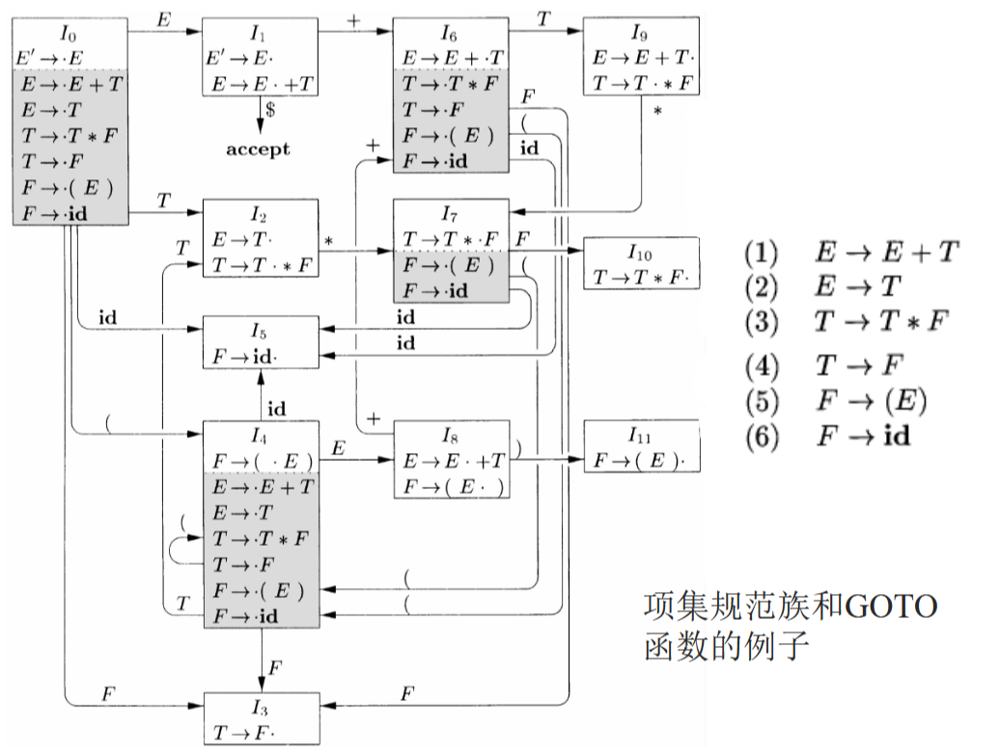

### 4.6.3 LR 语法分析算法

**LR(0)自动机作用**

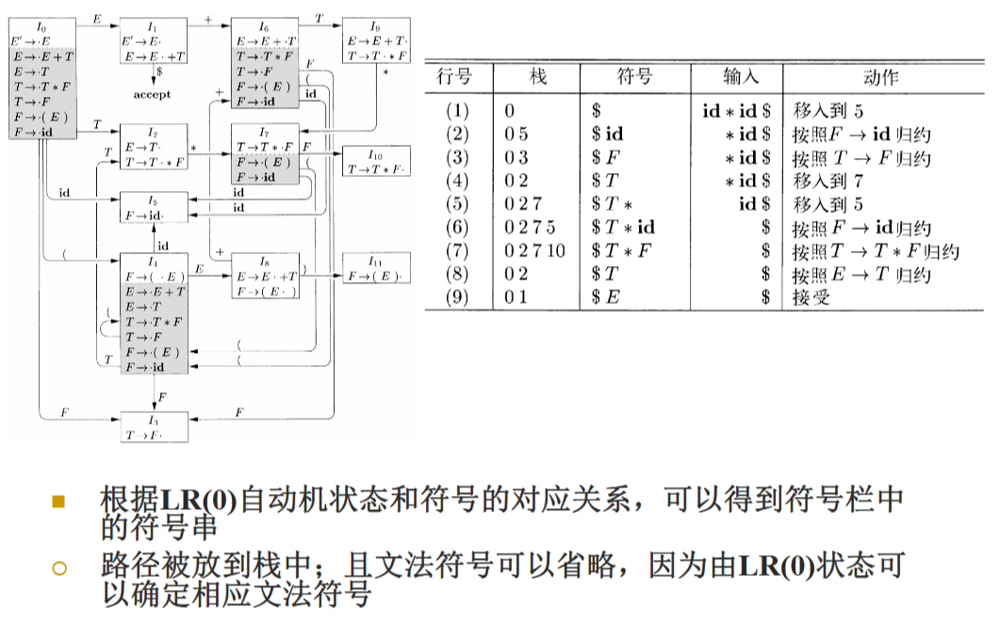

**LR语法分析器的结构**

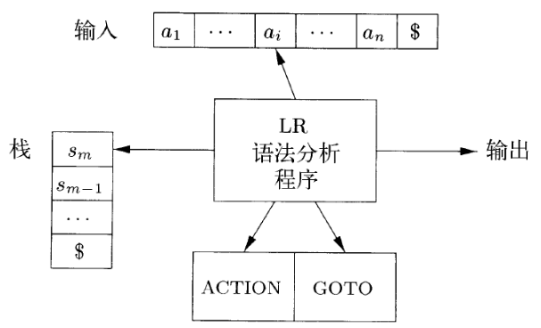

ACTION 表：指示在当前状态下对输入符号采取的动作：

- 移入：将输入符号移入栈，进入新状态。
- 归约：根据某个产生式进行归约。
- 接受：分析成功完成。
- 报错：输入串不符合文法。

GOTO 表：指示当前状态在遇到非终结符号后转移到的状态

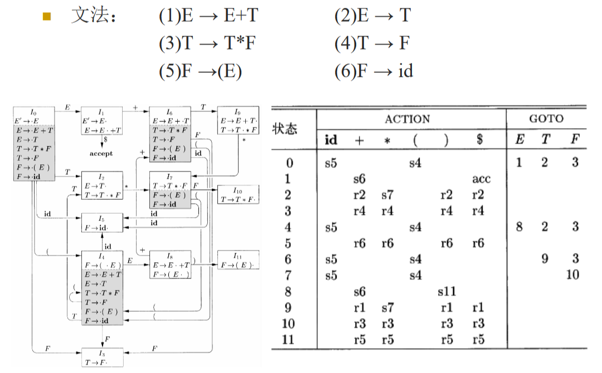

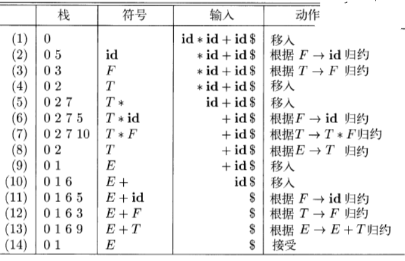

### 4.6.4 构造 SLR 语法分析表

SLR 分析表由两部分组成：

1. **ACTION 表**：用于处理移入、归约、接受或错误。
2. **GOTO 表**：处理状态间的转移。

**构造步骤**

1. **初始化**：构造文法的增广文法。构造 LR(0) 项集族和 GOTO 图。
2. **填充表项**：
   - 移入项：若状态 `I` 中的某个项 `A → α . a β`，并且 `a` 是一个终结符号，则在 `ACTION[I, a]` 中填入 `Shift` 操作，将状态转移到 `GOTO(I, a)`。
   - 归约项：若状态 `I` 中有 `A → α .`，且 `A ≠ S'`，则对于 FOLLOW(A) 中的每个符号 `a`，在 `ACTION[I, a]` 中填入 `Reduce A → α`。
   - 接受项：若状态 `I` 中包含 `S' → S .`，并且输入符号为 `$`，则在 `ACTION[I, $]` 中填入 `Accept`。
   - GOTO 表：若 `GOTO(I, X) = J`，则在 `GOTO[I, X]` 中填入状态 `J`。
3. **处理冲突**：SLR 分析依赖 FOLLOW 集，当 FOLLOW 集信息不足时可能导致错误。

SLR 分析通过栈和输入缓冲区协同工作。

1. **初始化**：栈初始化为 `[0]`（状态栈）。输入缓冲区为输入串加结束标志 `$`。
2. **分析动作**：
   - 根据当前栈顶状态 `s` 和输入符号 `a` 查找 `ACTION[s, a]`：
     1. 移入：将 `a` 压入栈，移动输入指针到下一个符号。将 `GOTO(s, a)` 中的状态压入状态栈。
     2. 归约：使用产生式 `A → α` 归约：弹出 `2 × |α|` 个栈顶符号。将 `A` 压入符号栈。根据 GOTO 表查找下一个状态，压入状态栈。
     3. 接受：输入串分析成功。
     4. 报错：进入错误处理程序。

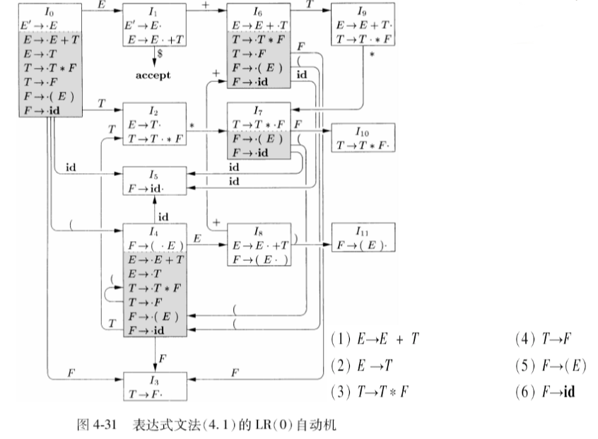

### 4.6.5 可行前缀

可行前缀是输入串的一个前缀，其特点是能够通过特定的分析器状态与栈的符号匹配，从而推进语法分析过程

若串 w 是文法的某个句子的一部分（或整句），并且在某个分析步骤中，w 能够通过栈的内容和输入缓冲区保持语法的正确性，则 w 为可行前缀。

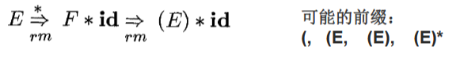

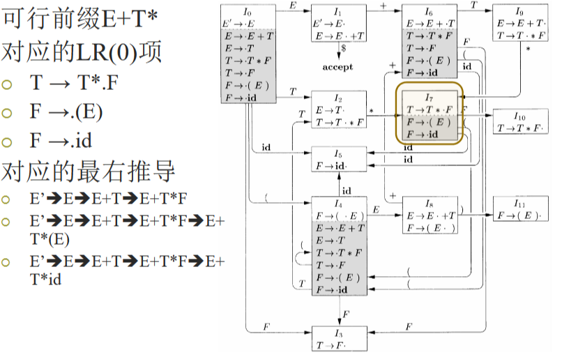

## 4.7 更强大的 LR 语法分析器

### 4.7.1 规范 LR(1) 项

一个 **规范 LR(1) 项** 是一个三元组 `([A → α · β], a)`，表示：

1. **产生式** `A → αβ`：描述分析器当前处理的文法规则。
2. **点的位置** `·`：指示当前分析到的位置，`α` 表示已经匹配的部分，`β` 表示尚未匹配的部分。
3. **向前看符号** `a`：是一个终结符号，表示当前项在特定上下文下适用，确保语法分析器在归约时不会出错。

如果点位于产生式的右端，如 `A → α ·`，且向前看符号是 `a`，则表示分析器可以在输入符号为 `a` 时归约产生式 `A → α`。

如果点在产生式中间，如 `A → α · X β`，表示分析器期望匹配 `X`。

**表示形式**

`[A → α · β, a]`：

- `A`：产生式的左部。
- `α`：点之前的符号，表示已匹配的部分。
- `β`：点之后的符号，表示待匹配的部分。
- `a`：向前看符号，帮助分析器选择正确的操作。

### 4.7.2 构造 LR(1) 项集

**增广文法**：在原文法的基础上添加新的开始符号 `S'`，增加产生式 `S' → S`，确保整个文法的唯一性和简化性。

**初始化**：从项 `[S' → · S, $]` 开始，构造第一个项集。

**CLOSURE 操作**：对于一个项集 `I`，如果项 `[A → α · Bβ, a]` 中存在非终结符号 `B`，则将所有形式为 `[B → · γ, b]` 的项加入项集中，其中：`b ∈ FIRST(βa)`，是从 `β` 和 `a` 推导出来的符号集合。重复以上操作，直到项集不再增长。

**GOTO 操作**：表示状态转换，从项集 `I` 根据符号 `X` 生成新的项集 `J`：将 `I` 中所有 `[A → α · X β, a]` 的点移过符号 `X`，得到 `[A → α X · β, a]`。对新生成的项集执行 CLOSURE 操作。

**规范 LR(1) 项集族的构造**

构造项集族：使用 CLOSURE 和 GOTO 操作，从初始项集开始生成所有可能的项集。每个项集表示一个分析器状态。

规范 LR(1) 自动机：每个项集作为一个状态。GOTO 函数的结果形成状态间的转换。初始状态为 `CLOSURE([S' → · S, $])`。接受状态为包含项 `[S' → S ·, $]` 的状态。


### 4.7.3 规范 LR(1) 语法分析表

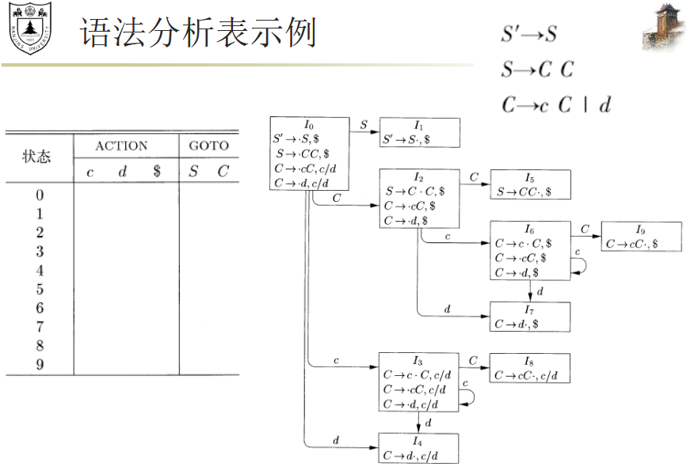

### 4.7.4 构造 LALR 语法分析表

将LR(1)项集中具有相同核心的项集合并为一个项集

项集核心是指LR(1)项集中第一个分量的集合

被合并项集的GOTO目标显然也可以被合并

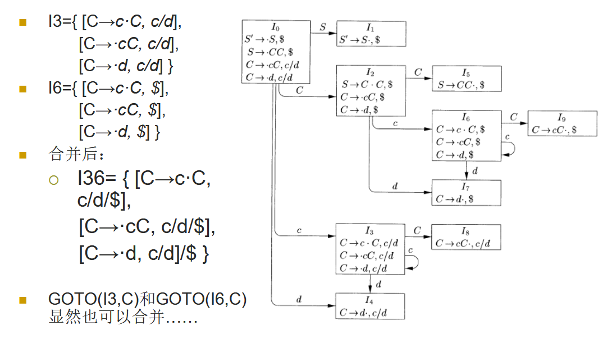

### 4.7.5 高效构造 LALR 语法分析表的方法

朴素方法

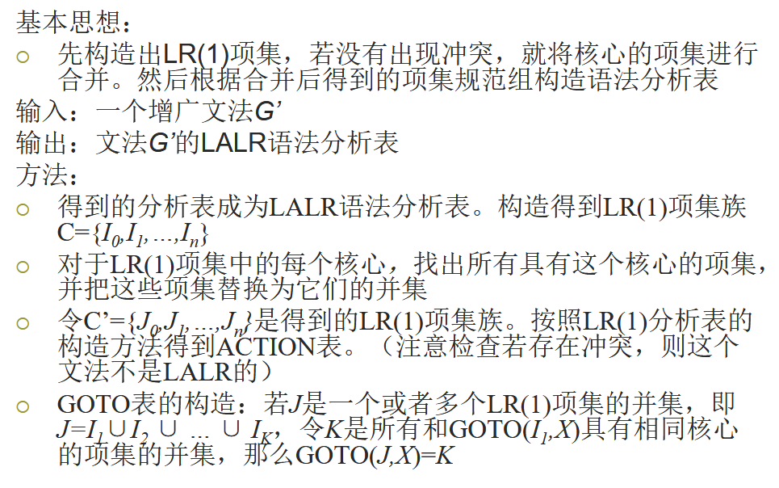

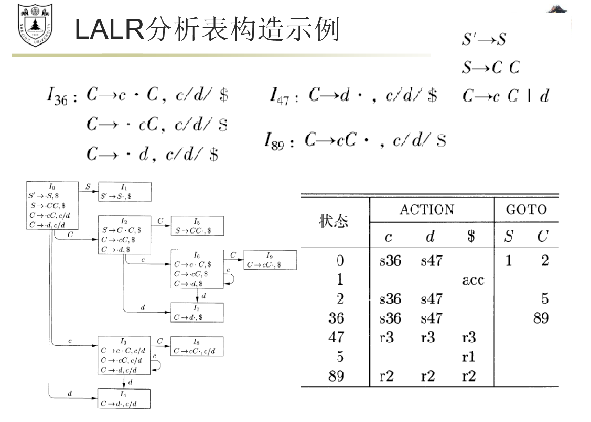

## 4.8 使用二义性文法

可以通过消除二义性规则来保证每个句子只有一棵语法分析树

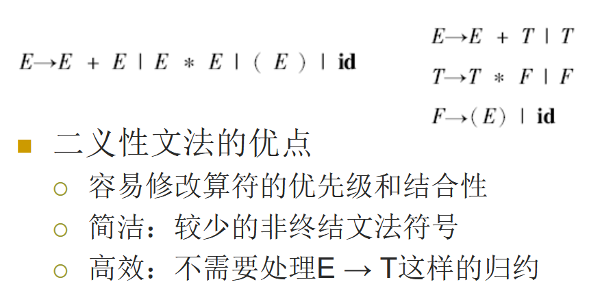

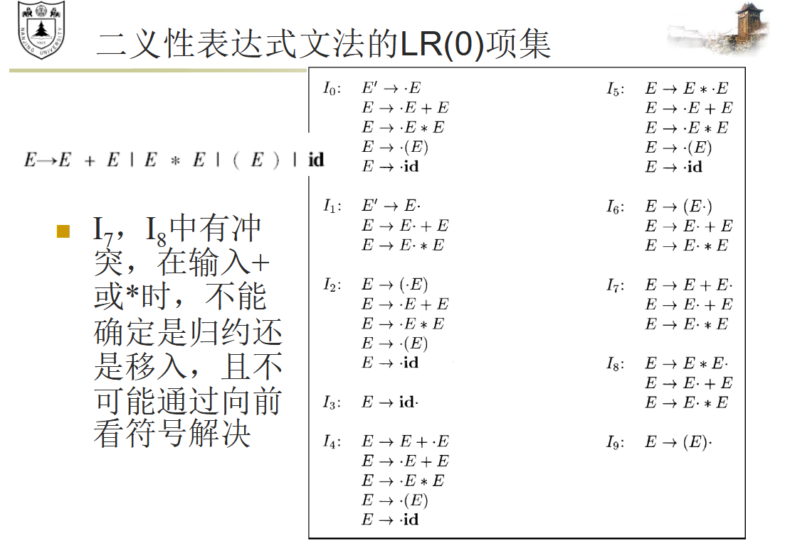

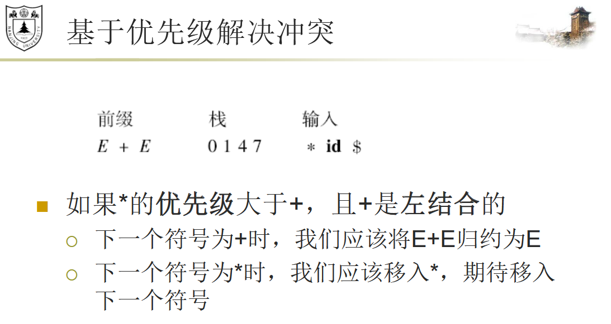

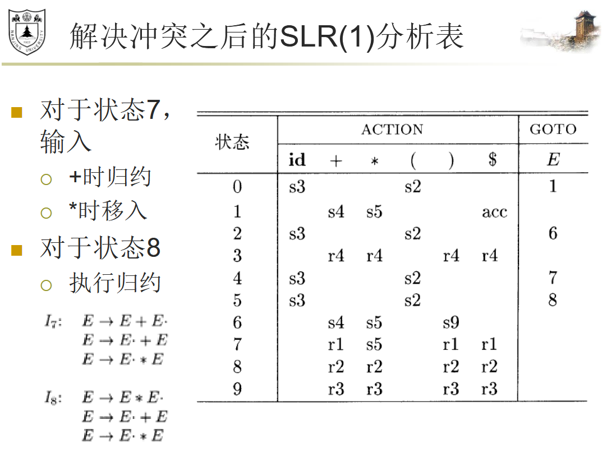

## 4.9 语法分析器生成工具

