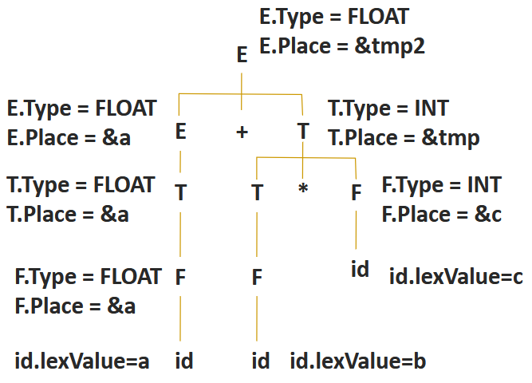
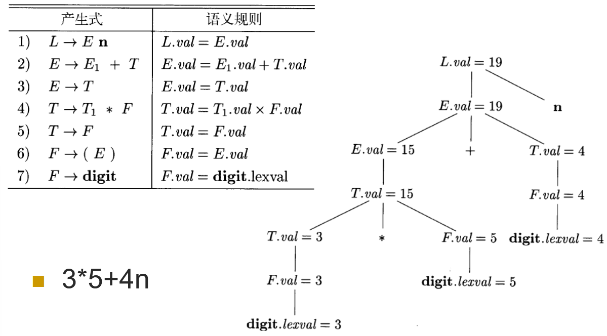
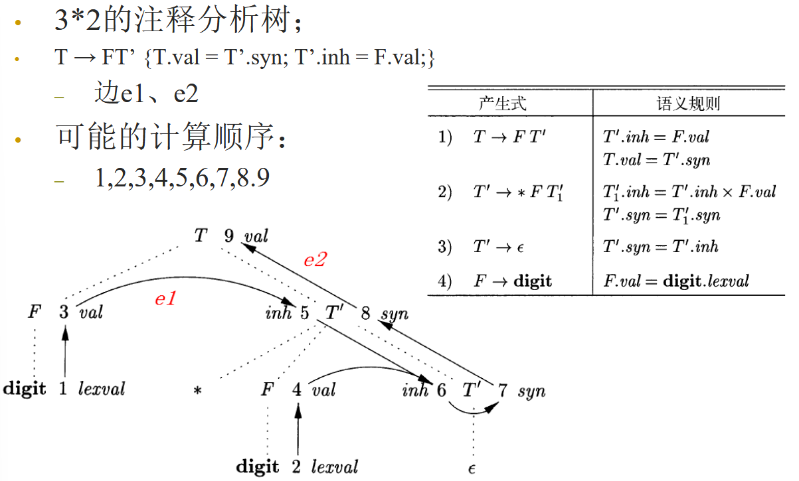
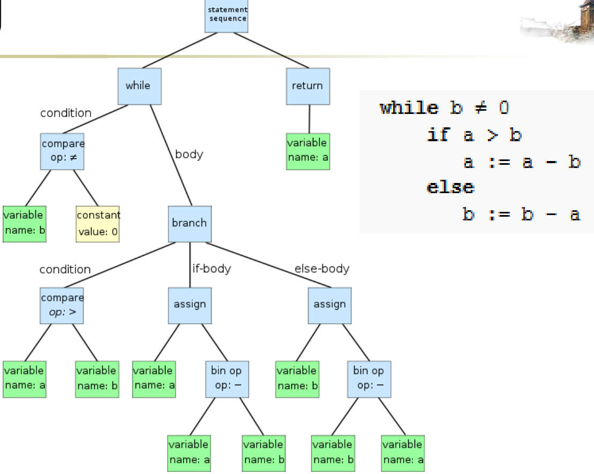
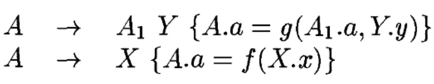
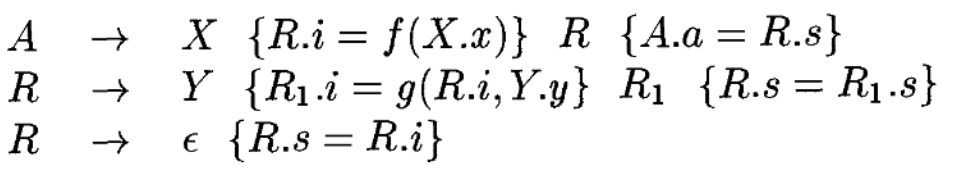
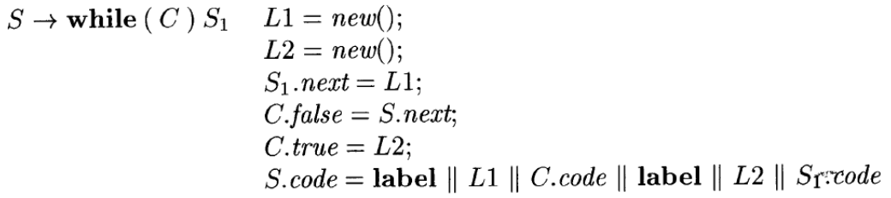
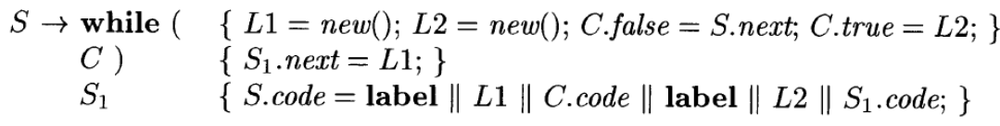

# 5 语法制导的翻译

使用上下文无关文法引导语言的翻译

## 5.1 语法制导定义（SDD）

将文法符号和某些属性相关联，并通过语义规则来描述如何计算属性的值

对于文法符号 X 和属性 a，用 X.a 表示分析树中的某个标号为 X 的结点的值

一个分析树结点和它的分支对应于一个产生式规则，而对应的语义规则确定了这些结点上的属性的取值

### 5.1.1 继承属性和综合属性

语法分析树以及属性值：

综合属性：在分析树结点 N 上的非终结符号 A 的属性值由 N 对应的产生式所关联的语义规则来定义。通过 N 的子结点或 N 本身的属性值来定义

继承属性：结点 N 的属性值由 N 的父结点所关联的语义规则来定义。依赖于 N 的父结点、N 本身和 N 的兄弟结点上的属性值

不允许 N 的继承属性通过 N 的子结点上的属性来定义，但是允许 N 的综合属性依赖于 N 本身的继承属性
终结符号有综合属性（由词法分析获得），但是没有继承属性

**S 属性的 SDD**：只包含综合属性的 SDD，在其中每个语义规则都根据产生式体中的属性值来计算头部非终结符号的属性值

没有副作用的 SDD 称为属性文法

**L 属性的 SDD**

### 5.1.2 在语义分析树的结点上对 SDD 求值

注释语法分析树：包含了各个结点的各属性值的语法分析树

## 5.2 SDD 的求值顺序

### 5.2.1 依赖图

描述了某棵特定的分析树上各个属性实例之间的信息流（计算顺序）

### 5.2.2 属性求值的顺序

各个属性的值需要按照依赖图的拓扑顺序计算

如果依赖图中存在环，则属性计算无法进行

### 5.2.3 S 属性的定义

每个属性都是综合属性
都是根据子构造的属性计算出父构造的属性
在依赖图中，总是通过子结点的属性值来计算父结点的属性值。可以和自顶向下、自底向上的语法分析过程一起计算

### 5.2.4 L 属性的定义

每个属性

- 要么是综合属性

- 要么是继承属性，且产生式 $A → X_1 X_2…X_n$ 中计算 $X_i.a$​ 的规则只能使用
  - A 的继承属性
  - Xi 左边的文法符号 Xj 的继承属性或综合属性
  - Xi 自身的继承或综合属性，且这些属性之间的依赖关系不形成环

特点：依赖图的边继承属性从左到右，从上到下，综合属性从下到上

### 5.2.5 具有受控副作用的语义规则

受控的副作用：不会对属性求值产生约束，即可以按照任何拓扑顺序求值，不会影响最终结果；或者对求值过程添加简单的约束

## 5.3 语法制导翻译的应用

### 5.3.1 抽象语法树的构造

### 5.3.2 类型的结构

## 5.4 语法制导的翻译方案（SDT）

### 5.4.1 后缀翻译方案

后缀 SDT：所有动作都在产生式最右端的 SDT

### 5.4.2 后缀 SDT 的语法分析栈实现

可以在 LR 语法分析的过程中实现

- 归约时执行相应的语义动作
- 定义用于记录各文法符号的属性的 union 结构
- 栈中的每个文法符号（或者说状态）都附带一个这样的 union 类型的值
- 在按照产生式 A → XYZ 归约时，Z 的属性可以在栈顶找到，Y 的属性可以在下一个位置找到，X 的属
  性可以在再下一个位置找到

### 5.4.3 产生式内部带有语义动作的 SDT

动作左边的所有符号（以及动作）处理完成后，就立刻执行这个动作

B → X{a}Y：自底向上分析时，在 X 出现在栈顶时执行动作 a；自顶向下分析时，在试图展开 Y 或者在输入中检测到 Y 的时刻执行 a

对于一般的SDT，可以先建立分析树（语义动作作为虚拟的结点），然后进行前序遍历并执行动作

### 5.4.4 从 SDT 中消除左递归

### 5.4.5 L 属性定义的 SDT

将 L 属性的 SDD 转换为 SDT：

- 将每个语义规则看作是一个赋值语义动作，将赋值语义动作放到相应产生式的适当位置
- 计算 A 的继承属性的动作插入到产生式体中对应的 A 的左边：如果A的继承属性之间具有依赖关系，则需要对计算动作进行排序
- 计算产生式头的综合属性的动作在产生式的最右边

## 5.5 实现 L 属性的 SDD

使用递归下降的语法分析器：每个非终结符号对应一个函数，函数的参数接受继承属性，返回值包含了综合属性

在函数体中，首先选择适当的产生式，使用局部变量来保存属性。对于产生式体中的终结符号，读入符号并获取其（经词法分析得到的）综合属性；对于非终结符号，使用适当的方式调用相应函数，并记录返回值

### 5.5.1 在递归下降语法分析过程中进行翻译

### 5.5.2 边扫描边生成代码

可以逐步生成属性的各个部分，并增量式添加到最终的属性值中

存在一个主属性，且主属性是综合属性
在各产生式中，主属性是通过产生式体中各个非终结符号的主属性连接（并置）得到的，同时还会连接一些其它的元素
各非终结符号的主属性的连接顺序和它在产生式体中的顺序相同