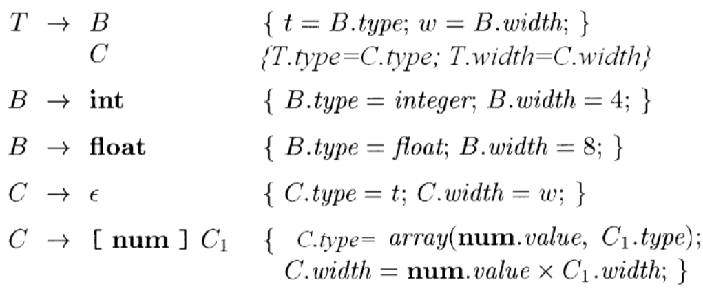
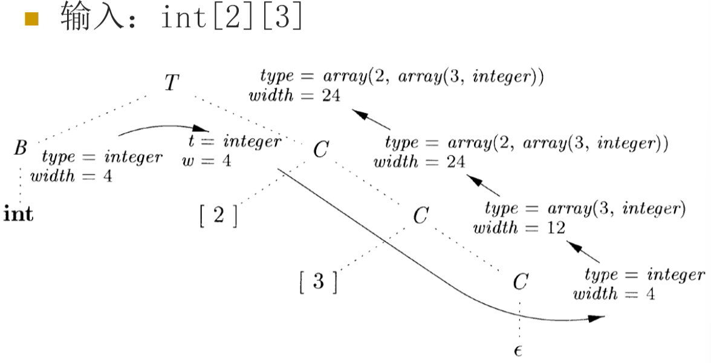
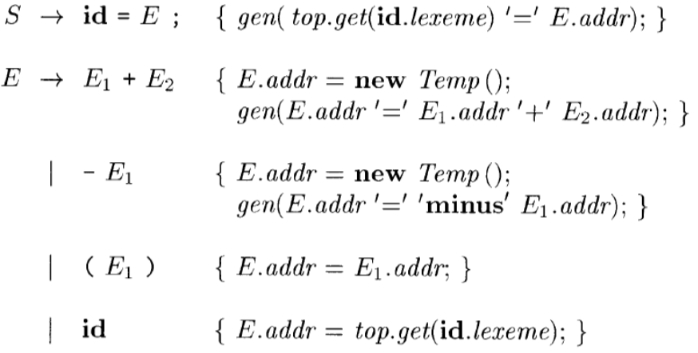
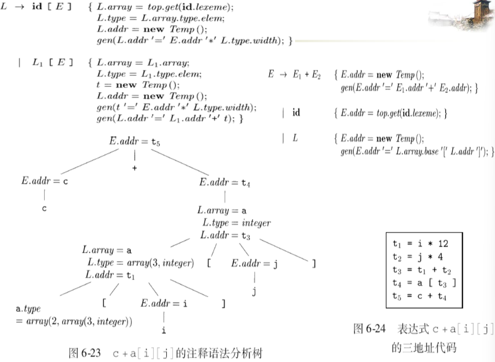
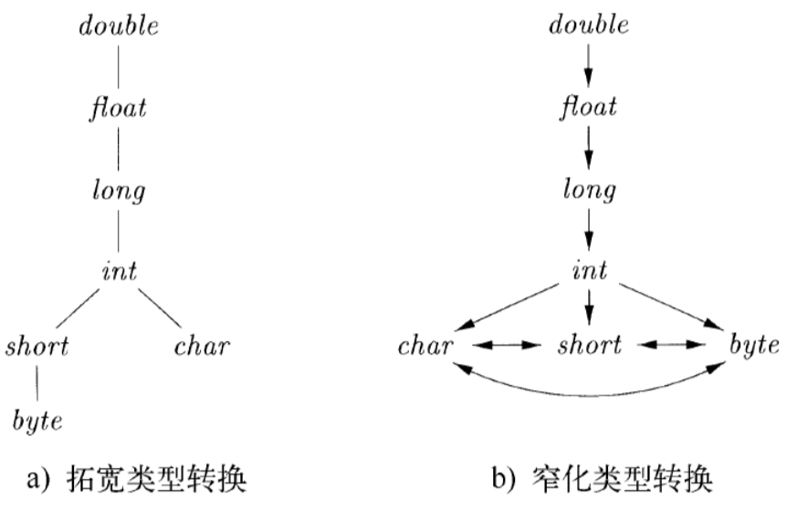
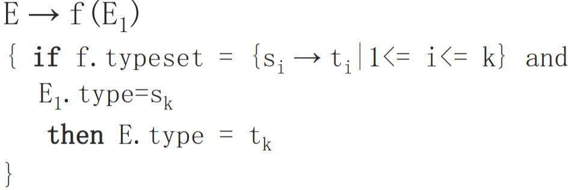
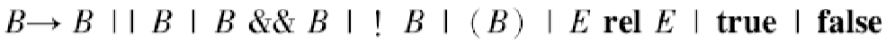
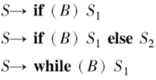
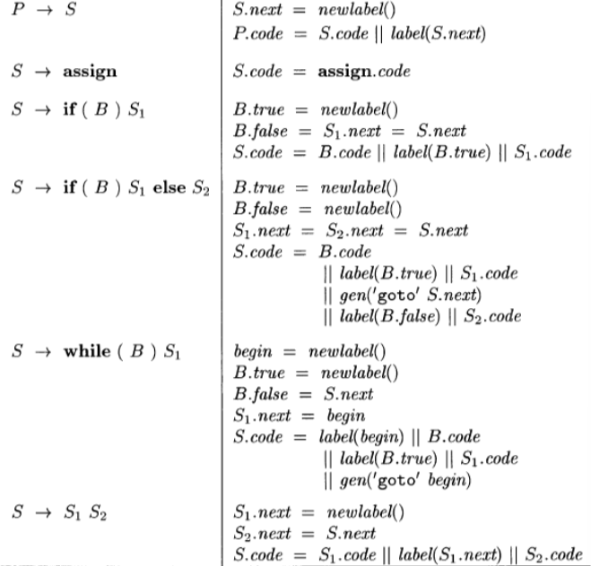
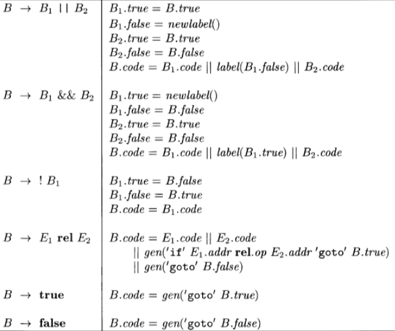

# 6 中间代码生成

## 6.1 语法树的变体

### 6.1.1 表达式的有向无环图（DAG）

语法树中，公共子表达式每出现一次，就有一个对应的子树；DAG 能指出表达式中的公共子表达式，更简洁地表示表达式

### 6.1.2 构造 DAG 的值编码方式

## 6.2 三地址代码

每条指令右侧最多有一个运算符

### 6.2.1 地址和指令

地址的形式：允许的运算分量

- 名字：源程序中的名字作为三地址代码的地址
- 常量：源程序中出现或生成的常量
- 编译器生成的临时变量

指令集合：

- 运算/赋值指令：x=y op z，x = op y
- 复制指令：x=y
- 无条件转移指令：goto L
- 条件转移指令：if x goto L if False x goto L
- 条件转移指令：if x relop y goto L
- 过程调用/返回：param x1 //设置参数，call p, n //调用子过程p，n为参数个数，y=call p 函数调用，ruturn y 返回指令
- 带下标的复制指令：x=y[i] x[i]=y，i 表示离开数组位置第i个字节，而不是数组的第 i 个元素

- 地址/指针赋值指令：x=&y x=*y *x=y

### 6.2.2 四元式表示

格式（字段）： op arg1 arg2 result

- op：运算符的内部编码
- arg1,arg2,result 是地址
- x=y+z  —— + y z x

### 6.2.3 三元式表示

三个字段：op arg1 arg2

使用三元式的位置来引用三元式的运算结果

x[i]=y需要拆分为两个三元式，求x[i]的地址，然后再赋值

问题：在优化时经常需要移动/删除/添加三元式，导致三元式的移动

**间接三元式**：包含了一个指向三元式的指针的列表，我们可以对这个列表进行操作，完成优化功能；操作时不需要修改三元式中的参数

### 6.2.4 静态单赋值形式（SSA）

SSA 中的所有赋值都是针对不同名的变量

对于同一个变量在不同路径中定值的情况，可以使用 $φ$ 函数来合并不同的定值

## 6.3 类型和声明

类型检查：利用一组规则来检查运算分量的类型和运算符的预期类型是否匹配

类型信息的用途：查错、确定名字需要的内存空间、计算数组元素的地址、类型转换、选择正确的运算符

确定名字的类型+变量的存储空间布局（相对地址）

### 6.3.1 类型表达式

类型表达式：

- 基本类型，类名，类型构造算子作用于类型
- 函数类型构造算子→ ：参数类型→结果类型
- 笛卡尔积：s $\times$ t

- 可以包含取值为类型表达式的变量

### 6.3.2 类型等价

结构等价：相同的基本类型 / 相同的构造算子作用于结构等价的类型而得到的 / 一个类型是另一个类型表达式的名字

名等价：类型名仅仅代表其自身

### 6.3.3 声明

### 6.3.4 局部变量名的存储布局

变量的类型可以确定变量需要的内存，可变大小的数据结构只需要考虑指针

函数的局部变量总是分配在连续的区间，因此给每个变量分配一个相对于这个区间开始处的相对地址

变量的类型信息保存在符号表中

类型的宽度：该类型的一个对象所需的存储单元的数量

计算类型和宽度的 SDT

### 6.3.5 声明的序列

变量 offset 记录当前可用的相对地址，每“分配”一个变量，offset 的值增加相应的值

### 6.3.6 记录和类中的字段

为每个记录创建单独的符号表

- 首先创建一个新的符号表，压到栈顶
- 然后处理对应于字段声明的D，字段都被加入到新符号表中
- 最后根据栈顶的符号表构造出record类型表达式；符号表出栈

## 6.4 表达式的翻译

### 6.4.1 表达式中的运算

属性 code 表示代码
addr 表示存放表达式结果的地址（临时变量）
new Temp() 可以生成一个临时变量
gen(…) 生成一个指令

### 6.4.2 增量翻译

### 6.4.3 数组元素的寻址

假设每个数组元素宽度是 w，那么数组 A 的第 i 个元素的开始地址为 base+i*w，base 是 A[0] 的相对地址

A\[i1][i2] 表示第 $i_1$ 行第 $i_2$ 个元素。假设一行的宽度是 $w_1$，同一行中每个元素的宽度是 $w_2$， A\[i1][i2] 的相对地址是 base+$i_1*w_1+i_2*w_2$

k 维数组推广……

根据第 j 维上的数组元素的个数 nj 和该数组每个元素的宽度 w 进行计算的，如二维数组 A\[i1][i2] 的地址 base+(i1\*n2+i2)*w

k 维数组推广……

比如一维数组编号 low,low+1,…,high，此时base是A[low]的相对地址。计算A[i]的地址变成base+(i-low)*w

预先计算技术：改写成i\*w+c的形式，其中c=base-low\*w可以在编译时刻预先计算出来，计算A[i]的相对地址只要计算i*w再加上c就可以了

按行存放、按列存放

### 6.4.4 数组引用的翻译

核心是确定数组引用的地址

非终结符号 L 生成一个数组名字加上一个下标表达式序列 L → L[E] | id[E]

- L.addr 指示一个临时变量，计算数组引用的偏移量
- L.array 是一个指向数组名字对应的符号表条目的指针，L.array.base 为该数组的基地址
- L.type 是 L 生成的子数组的类型，对于任何数组类型 t，其宽度由 t.width 给出，t.elem 给出其数组元素的类型

c+a\[2][3]

## 6.5 类型检查

给每一个组成部分赋予一个类型表达式，通过一组逻辑规则来表示这些类型表达式必须满足的条件

### 6.5.1 类型检查规则

类型综合：根据子表达式的类型构造出表达式的类型

- if f 的类型为s → t且x的类型为s then f(x)的类型为t

类型推导：根据语言结构的使用方式来确定该结构的类型

- if f(x) 是一个表达式 then 对于某些类型α,β；f的类型为α → β且x的类型为α

### 6.5.2 类型转换

编译器自动完成的转换为隐式转换，程序员用代码指定的转换为显式转换

### 6.5.3 函数和运算符的重载

查看参数来解决函数重载问题

## 6.6 控制流

if-else 语句，while 语句，布尔表达式

布尔表达式：语句中改变控制流的条件表达式

- 改变控制流。布尔表达式的值由程序到达的某个位置隐含地指出
- 计算逻辑值。可以使用带有逻辑运算符的三地址指令进行求值

### 6.6.1 布尔表达式

引入新的非终结符号 B 表示布尔表达式

布尔运算符：&&，||，!

关系表达式 E1 rel E2

关系运算符：<、<=、=、!=、>、>=

其中布尔运算符&&和||是左结合的，优先级||最低，其次是 &&，！最高

### 6.6.2 短路代码

短路代码中，布尔运算符 &&、 ||、 !被翻译成跳转指令。由跳转位置隐含的指出布尔表达式的值

### 6.6.3 控制流语句

语句及文法：

B 和 S 有综合属性 code，表示翻译得到的三地址代码

B 的继承属性 true 和 false，S 的继承属性 next，表示跳转的位置

### 6.6.4 布尔表达式的控制流翻译

### 6.6.5 避免生成冗余的 goto 指令

**利用“穿越”修改布尔表达式的语义规则**

## 6.7 回填

某些跳转指令应该跳转到哪里

### 6.7.1 使用回填技术的一趟式目标代码生成

生成跳转指令时暂时不指定跳转目标标号，而是使用列表记录这些不完整的指令，等知道正确的目标时再填写目标标号，每个列表中的指令都指向同一个目标

### 6.7.2 布尔表达式的回填

引入两个综合属性

- truelist: 包含跳转指令（位置）的列表，这些指令在取值true时执行
- falselist：包含跳转指令（位置）的列表，这些指令在取值false时执行

辅助函数

- Makelist(i)：创建一个只包含i的列表
- Merge(p1,p2)：将p1和p2指向的列表合并
- Backpatch(p,i)：将i作为目标标号插入到p所指列表中的各指令中

### 6.7.3 控制转移语句

nextlist：nextlist中的跳转指令的目标应该是S执行完毕之后紧接着执行的下一条指令的位置，考虑S是while语句、if语句的子语句时，分别应该跳转到哪里

### 6.7.4 break、continue、goto 语句

方法：(break语句)

- 跟踪外围语句S，
- 生成一个跳转指令坯
- 将这个指令坯的位置加入到S的nextlist中

跟踪的方法

- 在符号表中设置break条目，令其指向外围语句
- 在符号表中设置指向S的nextlist的指针，然后把这个指令坯的位置直接加入到nextlist中