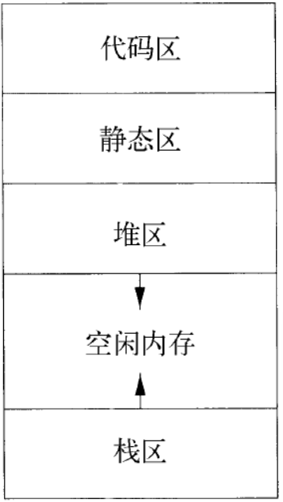
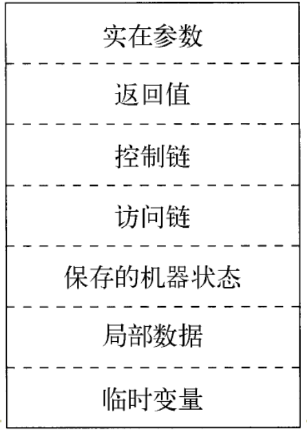
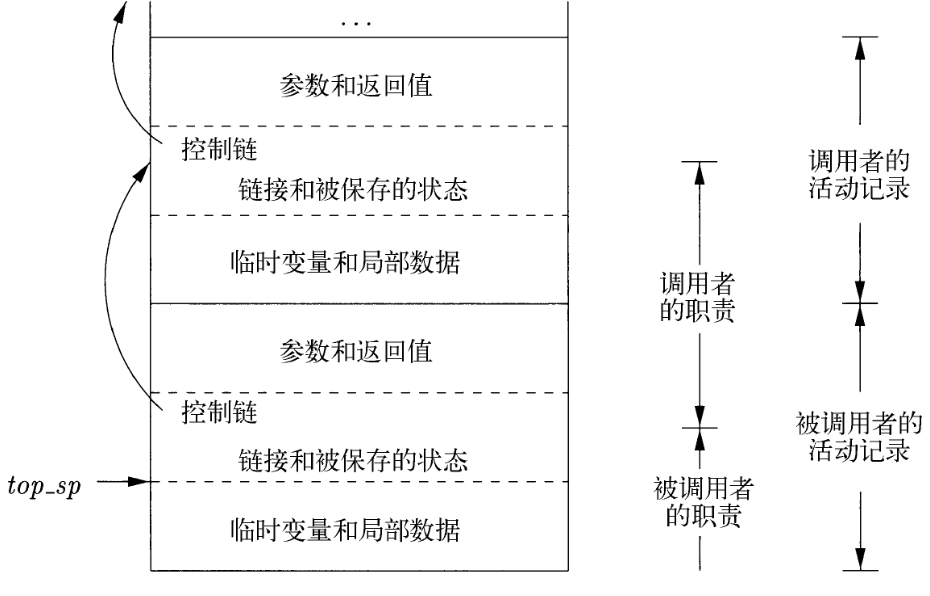
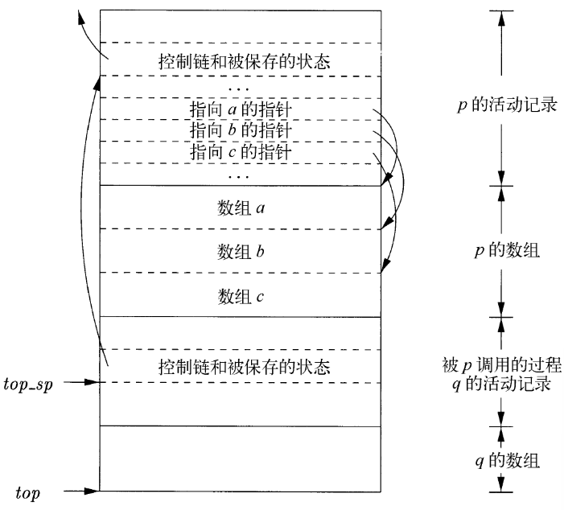
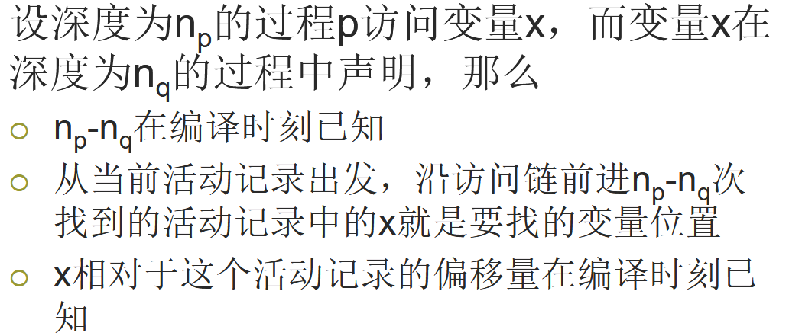
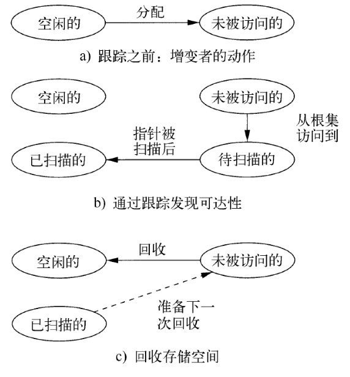

# 7 运行时环境

## 7.1 存储组织

目标程序的代码放置在代码区

静态区、堆区、栈区分别放置不同类型生命期的数据值

静态分配：全局变量，编译器在编译时刻就可以做出存储分配决定

动态分配：

- 栈式存储：和过程的调用/返回同步进行分配和回收，值的生命期和过程生命期相同
- 堆存储：数据对象比创建它的过程调用更长寿。手工回收、垃圾回收机制

## 7.2 空间的栈式分配

### 7.2.1 活动树

过程调用（过程活动）在时间上总是嵌套的，后调用的先返回，因此用栈式分配来分配过程活动所需内存空间

程序运行的所有过程活动可以用树表示：每个结点对应于一个过程活动，根结点对应于 main 过程的活动。过程 p 的某次活动对应的结点的所有子结点：此次活动所调用的各个过程活动（从左向右，表示调用的先后顺序）

### 7.2.2 活动记录

过程调用和返回由控制栈进行管理，每个活跃的活动对应于栈中的一个活动记录，活动记录按照活动的开始时间，从栈底到栈顶排列

### 7.2.3 调用代码序列

**调用代码序列**为活动记录分配空间，填写记录信息

**返回代码序列**恢复机器状态，使调用者继续运行

调用代码序列会分割到调用者和被调用者中（把代码尽可能放在被调用者中）

调用者和被调用者之间传递的值放在被调用者活动记录的开始位置

固定长度的项放在中间位置（控制链、访问链、机器状态字段）

早期不知道大小的项在活动记录尾部

栈顶指针（top_sp）通常指向固定长度字段的末端

### 7.2.4 栈中的变长数据

如果数据对象的生命期局限于过程活动的生命期，就可以分配在运行时刻栈中（变长数组）

## 7.3 栈中非局部数据的访问

### 7.3.1 没有嵌套过程时的数据访问

全局变量：在静态区，地址在编译时刻可知

函数的局部变量：相对地址已知，且存放在当前活动记录内，top_sp指针加上相对地址即可访问

### 7.3.2 和嵌套过程相关的问题

如果过程 A 的声明中包含了过程 B 的声明，那么 B 可以使用在 A 中声明的变量

当 B 的代码运行时，如果它使用的是 A中 的变量。那么这个变量指向运行栈中最上层的同名变量

不能通过嵌套层次直接得到A的活动记录的相对位置，必须通过访问链访问

### 7.3.4 嵌套深度

不内嵌于任何其他过程中的过程，嵌套深度为 1

嵌套在深度为i的过程中的过程，深度为 i+1

### 7.3.5 访问链

如果过程 p 在声明时嵌套在过程 q 的声明中，那么 p 的活动记录中的访问链指向最上层的 q 的活动记录

从栈顶活动记录开始，访问链形成了一个链路，嵌套深度沿着链路逐一递减

### 7.3.6 处理访问链

p 的深度大于 q：根据作用域规则，p 必然在 q 中直接定义；那么 p 的访问链指向当前活动记录

递归调用（p=q）：新活动记录的访问链等于当前记录的访问链

p 的深度小于等于 q 的深度：此时必然有过程 r，p 直接在 r 中定义，而 q 嵌套在 r中；p 的访问链指向栈最高的 r 的活动记录

### 7.3.7 过程型参数的访问链

在传递过程指针参数时，过程型参数中不仅包含过程的代码指针，还包括正确的访问链

### 7.3.8 显示表

数组 d，为每个嵌套深度保留一个指针

指针 d[i] 指向栈中最高的、嵌套深度为 i 的活动记录。
如果程序 p 中访问嵌套深度为 i 的过程 q 中声明的变量 x，那么 d[i] 直接指向相应的（必然是 q 的）活动记录

## 7.4 堆管理

### 7.4.1 存储管理器

分配：为每个内存请求分配一段连续的、适当大小的堆空间

回收：把被回收的空间返回空闲空间缓冲池，以满足其他内存需求

### 7.4.4 碎片整理

随着程序分配/回收内存，堆区逐渐被割裂成为若干空闲存储块（窗口，hole）和已用存储块的交错。分配一块内存时，通常是把一个窗口的一部分分配出去，其余部分成为更小的块。回收时，被释放的存储块被放回缓冲池。通常要把连续的窗口接合成为更大的窗口

**Best-Fit**：总是将请求的内存分配在满足请求的最小的窗口中

**First-Fit**：总是将对象放置在第一个能够容纳请求的窗口中。较好的数据局
部性（同一时间段内的生成的对象经常被分配在连续的空间内）

**使用容器的堆管理方法**：设定不同大小的空闲块规格，相同规格的块放在同一容器中

**管理和接合空闲空间**

当回收一个块时，可以把这个块和相邻的块接合起来，构成更大的块

支持相邻块接合的数据结构：

- 边界标记：在每一块存储块的两端，分别设置一个free/used位；相邻的位置上存放字节总数
- 双重链接的、嵌入式的空闲块列表：列表的指针存放在空闲块中、用双向指针的方式记录了有哪些空闲块

### 7.4.5 人工回收请求

内存泄露：未能删除不可能再被引用的数据

悬空指针引用：引用已被删除的数据

空指针访问/数组越界访问

**正确的编程模式**：

1. 对象所有者
2. 引用计数：每个动态分配的对象附上一个计数：记录有多少个指针指向这个对象
3. 基于区域的分配

## 7.5 垃圾回收概述

### 7.5.1 垃圾回收器的设计目标

基本要求：语言必须是类型安全的：保证回收器能够知道数据元素是否为一个指向某内存块的指针（类型不安全的语言：C，C++）

性能目标

- 总体运行时间：不显著增加应用程序的总运行时间
- 空间使用：最大限度地利用可用内存
- 停顿时间：当垃圾回收机制启动时，可能引起应用程序的停顿。这个停顿应该比较短
- 程序局部性：改善空间局部性和时间局部性

### 7.5.2 可达性

**可达性**：一个存储块可以被程序访问到

**根集**：不需要指针解引用就可以直接访问的数据

可达性：根集的成员都是可达的；对于任意一个对象，如果指向它的一个指针被保存在可达对象的某字段中、或数组元素中，那么这个对象也是可达的

改变可达对象集合的操作：

- 对象分配：返回一个指向新存储块的引用
- 参数传递/返回值：对象引用从实在参数传递到形式参数，从返回值传递给调用者
- 引用赋值：u=v；v 的引用被复制到 u 中，u 中原来的引用丢失。可能使得u原来指向的对象变得不可达，并且递归地使得更多对象变得不可达
- 过程返回：活动记录出栈，局部变量消失，根集变小；可能使得一些对象变得不可达

### 7.5.3 引用计数的垃圾回收器

对象分配：引用计数设为1
参数传递：引用计数加1
引用赋值：u=v：u 指向的对象引用减 1、v 指向的对象引用加 1
过程返回：局部变量指向对象的引用计数减1
可达性的传递丢失：如果一个对象的引用计数为 0，在删除对象之前，此对象中各个指针所指对象的引用计数减 1

## 7.6 基于跟踪的垃圾回收

### 7.6.1 标记-清扫式垃圾回收

标记：从根集开始，跟踪并标记出所有可达对象；

清扫：遍历整个堆区，释放不可达对象

### 7.6.2 基本抽象

每个存储块处于四种状态之一：空闲、未被访问、待扫描、已扫描

对存储块的操作会改变存储块的状态

### 7.6.3 标记-清扫式垃圾回收的优化

用一个列表记录所有已经分配的对象，不可达对象等于已分配对象减去可达对象

### 7.6.4 标记并压缩的垃圾回收器

对可达对象进行重定位可以消除存储碎片

把可达对象移动到堆区的一端，另一端则是空闲空间，空闲空间合并成单一块，分配内存时高效率

### 7.6.5 复制回收器

堆空间被分为两个半空间，应用程序在某个半空间内分配存储，当充满这个半空间时，开始垃圾回收

回收时，可达对象被拷贝到另一个半空间

回收完成后，两个半空间角色对调