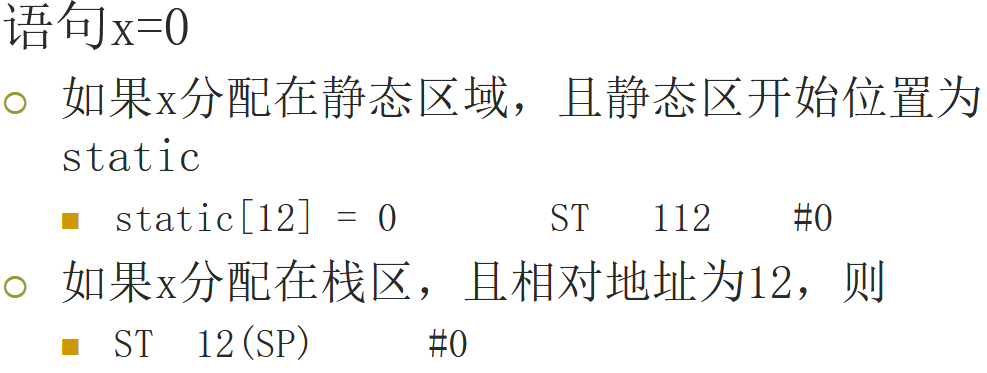
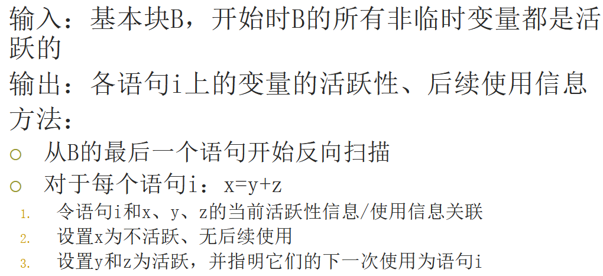
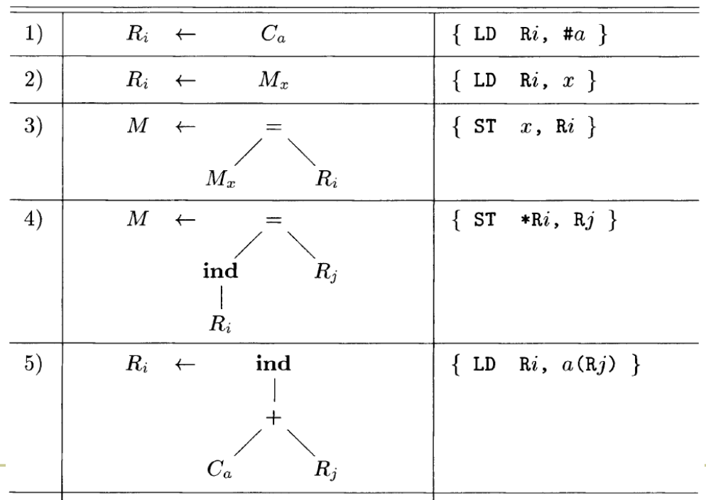
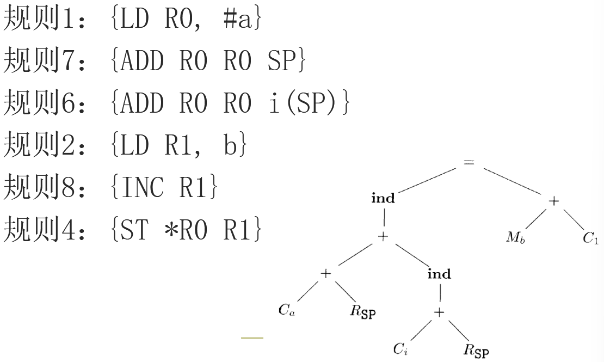

# 8 代码生成

## 8.1 代码生成器设计中的问题

正确性、易于实现、测试和维护

输入 IR 的选择：四元式、三元式、字节代码、堆栈机代码、后缀表示、抽象语法树、DAG、…

目标程序：RISC、CISC、可重定向代码、汇编语言

指令选择：影响因素：IR 层次、指令集特性、目标代码质量

寄存器分配和指派

求值顺序


## 8.2 目标语言

### 8.2.1 一个简单的目标机模型

三地址

- 加载：LD dst, addr。把地址 addr 中的内容加载到 dst 所指寄存器
- 保存：ST x, r。把寄存器 r 中的内容保存到 x 中
- 计算：OP dst, src1, src2。把 src1 和 scr2 中的值运算后将结果存放到 dst 中
- 无条件跳转：BR L。控制流转向标号L的指令
- 条件跳转：Bcond r, L。对 r 中的值进行测试，如果为真则转向 L

寻址模式：

- 变量 x：指向分配 x 的内存位置
- a(r)：地址是 a 的左值加上 r 中的值

- constant(r)：寄存器中内容加上前面的常数即其地址
- *r：寄存器r的内容为其地址
- *constant(r)：r 中内容加上常量所指地址中存放的值为其地址
- 常量#constant

### 8.2.2 程序和指令的代价

假设：每个指令有固定的代价，设定为 1 加上运算分量寻址模式的代价

- LD R0, R1；代价为1
- LD R0, M；代价是2
- LD R1, *100(R2)；代价为2


## 8.3 目标代码中的地址

### 8.3.1 静态分配

活动记录的大小和布局由符号表决定，每个过程静态地分配一个数据区域，开始位置用 staticArea 表示

过程调用时，在活动记录中存放返回地址；过程调用结束后，控制权返回

```
// call callee的实现：
ST callee.staticArea, #here+20 //存放返回地址
BR callee.codeArea
// callee中的语句return
BR *callee.staticArea
```

### 8.3.2 栈分配

活动记录的位置存放在寄存器中，通过相对于寄存器中值的偏移量来访问

寄存器SP指向栈顶，第一个过程（main）初始化栈区

```
// 过程调用指令序列
DD SP, SP, #caller.recordSize 	//增加栈指针
ST 0(SP), #here+16 				//保存返回地址
BR callee.codeArea 				//转移到被调用者
// 过程返回指令序列
BR *0(SP) 						//被调用者执行，返回调用者
SUP SP, SP, #caller.recordSize 	//调用者减少栈指针值
```

### 8.3.3 名字的运行时刻地址

在三地址语句中使用名字（实际上是指向符号表条目）来引用变量 （相对地址）




## 8.4 基本块和流图

中间代码的流图表示法：

- 中间代码划分成为基本块
  - 控制流只能从第一个指令进入
  - 除基本块的最后一个指令外，控制流不会跳转/停机
- 结点：基本块
- 边：指明了基本块的执行顺序

### 8.4.1 基本块

确定基本块的首指令：

- 第一个三地址指令
- 任意一个条件或无条件转移指令的目标指令
- 紧跟在一个条件/无条件转移指令之后的指令

每个首指令对应于一个基本块：从首指令开始到下一个首指令

### 8.4.2 后续使用信息

如果当前某个变量存放于一个寄存器中，之后不会再被使用 ----> 寄存器可被分派给别的变量

变量值的**使用**：假设三地址语句 i 向 x 赋值，如果另一语句j的一个运算分量为 x，且从 i 开始有一条没有对 x 进行赋值的路径到达 j，那么 j 就使用了 i 处计算得到的 x 的值，称 x 在语句 i 后的程序点上**活跃**，即在程序执行完语句 i 的时刻，x中存放的值将被后面的语句使用

不活跃是指变量中存放的值不会被使用，而不是变量不会被使用

确定基本块中的活跃性、后续使用：



### 8.4.3 流图

两个顶点 B 和 C 之间有一条有向边当且仅当基本块 C 的第一个指令可能在 B 的最后一个指令之后执行

从 B 的结尾指令是一条跳转到 C 的开头的条件/无条件语句

在原来的序列中，C 紧跟在 B 之后，且 B 的结尾不是无条件跳转语句

B 是 C 的前驱，C 是 B 的后继

入口和出口结点

### 8.4.4 流图的表示方式


### 8.4.5 循环

循环 L 是一个结点集合，存在一个循环入口（loop entry）结点，是唯一的、前驱可以在循环 L 之外的结点，到达其余结点的路径必然先经过这个入口结点，其余结点都存在到达入口结点的非空路径，且路径都在 L 中


## 8.5 基本块的优化

### 8.5.1 基本块的 DAG 表示

每个变量有对应的 DAG 的结点，代表初始值

每个语句 s 有一个相关的结点 N，代表计算得到的值

- N 的子结点对应于（其运算分量当前值的）其它语句
- 结点 N 的标号是 s 的运算符
- N 和一组变量关联，表示 s 是在此基本块内最晚对它们定值的语句

输出结点：结点对应的变量在基本块出口处活跃

从 DAG，我们可以知道各个变量最后的值和初始值的关系

DAG 作用：

- 消除局部公共子表达式
- 消除死代码
- 对语句重新排序
- 对运算分量的顺序进行重排

### 8.5.2 局部公共子表达式

建立某个结点 M 之前，首先检查是否存在一个结点 N，它和 M 具有相同的运算符和子结点（顺序也相同）

### 8.5.3 消除死代码

在DAG上消除没有附加活跃变量的根结点（没有父结点的结点），即消除死代码

### 8.5.4 代数恒等式的使用

消除计算步骤：x+0=0+x=x 

强度消减：$x^2 =x*x  $

常量合并：2*3.14可以用6.28替换

条件表达式和算术表达式

结合律

### 8.5.5 数组引用的表示

从数组取值的运算 x=a[i] 对应于 =[] 的结点

对数组赋值（例如 a[j]=y）的运算对应于 []= 的结点，没有关联的变量、且杀死所有依赖于 a 的变量

### 8.5.6 指针赋值和过程调用

通过（全局/局部）指针分析部分解决这个问题

过程调用也必须安全地假设它：使用了可访问范围内的所有变量；修改了可访问范围内的所有变量

### 8.5.7 从 DAG 到基本块

每个结点构造一个三地址语句，计算对应的值，结果应该尽量赋给一个活跃的变量

如果结点有多个关联的变量，则需要用复制语句进行赋值

重组时应该注意求值的顺序：

- 指令的顺序必须遵守DAG中结点的顺序
- 对数组的赋值必须跟在所有原来在它之前的赋值/求值操作之后
- 对数组元素的求值必须跟在所有原来在它之前的赋值指令之后
- 对变量的使用必须跟在所有原来在它之前的过程调用和指针间接赋值之后
- 任何过程调用或者指针间接赋值必须跟在原来在它之前的变量求值之后

总的来说，我们必须保证：如果两个指令之间可能相互影响，那么他们的顺序就不应该改变


## 8.6 一个简单的代码生成器

寄存器的使用方法：执行运算时，运算分量必须放在寄存器中；用于临时变量；存放全局的值；进行运行时刻管理（比如：栈顶指针）

### 8.6.1 寄存器贺地址描述符

用一个基本数据结构：

- 寄存器描述符：跟踪各个寄存器都存放了哪些变量的当前值
- 地址描述符：某个变量的当前值存放在哪个或哪些位置(包括内存位置和寄存器）上

### 8.6.2 代码生成算法

**运算的机器指令**

- 调用getReg(x=y+z)，为x,y,z选择寄存器Rx, Ry, Rz
- 查Ry的寄存器描述符，如果y不在Ry中则生成指令：LD Ry y’ (y’表示存放y值的当前位置)
- 生成指令ADD Rx, Ry, Rz

**复制语句的机器指令**

- getReg(x=y)总是为x和y选择相同的寄存器
- 如果y不在Ry中，生成机器指令LD Ry, y

**基本块的收尾处理**： 如果变量x在出口处活跃，且x现在不在内存，那么生成指令ST x, Rx

**管理寄存器和地址描述符**

- 处理普通指令时生成LD R x：R的寄存器描述符只包含x；x的地址描述符中R作为新位置加入到x的位置集合中。从任何不同于x的变量的地址描述符中删除R
- ST x, R：修改x的地址描述符，包含自己的内存位置
- ADD Rx, Ry, Rz：Rx的寄存器描述符只包含x；x的地址描述符只包含Rx（不包含x的内存位置！）。从任何不同于x的变量的地址描述符中删除Rx。

- 处理x=y时：如果生成LD Ry y，按照第一个规则处理；把x加入到Ry的寄存器描述符中（Ry存放了x和y的当前值）。修改x的地址描述符，使它只包含Ry

### 8.6.3 函数 getReg 的设计

x = y + z 指令，为运算分量y分配寄存器

- 如果已经在某个寄存器中，不需要进行处理，选择这个寄存器

- 如果不在寄存器中，且有空闲寄存器，选择一个空闲寄存器

- 如果不在寄存器中，且没有空闲寄存器：寻找一个寄存器R，假设已经有某个变量v在R中了（R的寄存器描述符中包含了v）
  - 如果v的地址描述符表明还可以在别的地方找到v，DONE
  - v就是x（即结果），且x不是运算分量之一，DONE
  - 如果v在此之后不会被使用，DONE
  - 生成保存指令ST v R（溢出操作）并修改v的地址描述符，如果R中存放了多个变量的值，那么需要生成多条ST指令（选尽可能少ST的）

为x选择寄存器Rx（基本方法和把y从内存LD时一样）：如果y在指令I之后不再使用，且Ry仅仅保存了y的值，那么Ry同时也可以作为Rx


## 8.7 窥孔优化

使用一个滑动窗口（窥孔）来检查目标指令，在窥孔内实现优化

### 8.7.1 消除冗余的加载和保存指令


### 8.7.2 消除不可达代码


### 8.7.3 控制流优化


### 8.7.4 代数化简和强度消减


### 8.7.5 使用机器特有的指令

INC，DEC，…


## 8.8 寄存器分配和指派

### 8.8.1 全局寄存器分配

在循环中频繁使用的值存放在固定寄存器

分配固定多个寄存器来存放内部循环中最活跃的值

### 8.8.2 使用计数

通过使用计数的方法来估算把一个变量放到寄存器中会带来多大好处，然后根据这个估算来分配寄存器

在循环L中把一个寄存器分配给x所得到的好处大约：
$$
\sum_B = use(x,B)+2*live(x,B)
$$
B是L中的的基本块，use(x,B)是x在B中被定值之前就被引用的次数。如果x在B的出口处活跃并在B中被赋予一个值，则live(x,B)的取值为1，否则取值为0


## 8.9 通过树重写来选择指令

### 8.9.1 树翻译方案



### 8.9.2 通过覆盖一个输入树来生成代码


