# 9 机器无关优化

## 9.1 优化的主要来源

### 9.1.1 冗余的原因

源程序中的冗余

高级程序设计语言编程的副产品

### 9.1.2 例子：快速排序

### 9.1.3 保持语义不变的转换

公共子表达式消除、复制传播、死代码消除、常量折叠

### 9.1.4 全局公共子表达式

公共子表达式：如果表达式 E 在某次出现之前必然已经被计算过，且 E 的分量在该次计算之后一直没有被改变

如果上一次 E 的值赋给了 x，且 x 的值至今没有被修改过，那么我们就可以使用 x，而不需要计算 E

### 9.1.5 复制传播

形如 u=v 的复制语句使得语句后面的程序点上，u 的值等于 v 的值

如果在某个位置上 u 一定等于 v，那么可以把 u 替换为 v

有时可以彻底消除对 u 的使用，从而消除对 u 的赋值语句

### 9.1.6 死代码消除

如果一个变量在某个程序点上的值可能会在之后被使用，那么这个变量在这个点上活跃；否则这个变量就是死的

### 9.1.7 代码移动

循环不变表达式：循环的同一次运行的不同迭代中，表达式的值不变

把循环不变表达式移动到循环入口之前计算可以提高效率

### 9.1.8 归纳变量和强度消减

归纳变量：每次对 x 的赋值都使得 x 的值增加 c。可以把对 x 的赋值改成增量操作

## 9.2 数据流分析简介

### 9.2.1 数据流抽象

**程序点**：三地址语句之前或之后的位置

- 基本块内部：一个语句之后的程序点等于下一个语句之前的程序点

- 如果流图中有 $B_{1}$ 到 $B_{2}$ 的边，那么 $B_2$ 的第一个语句之前的点可能紧跟在 $B_{1}$ 的最后语句之后的点后面执行

从 $p_1$ 到 $p_2$ 的执行路径：$p_1$, $p_2, \ldots$, $p_n$

- 要么 p$_\mathrm{i}$ 是一个语句之前的点，且 p$_\mathrm{i+1}$是该语句之后的点
- 要么 p$_\mathrm{i}$ 是某个基本块的结尾，且 p$_\mathrm{i+1}$是该基本块的某个后继的开头

出现在某个程序点的程序状态：在某个运行时刻，当指令指针指向这个程序点时，各个变量和动态内存中存放的值。指令指针可能多次指向同一个程序点。因此一个程序点可能对应多个程序状态

数据流分析把可能出现在某个程序点上的程序状态集合总结为一些特性

### 9.2.2 数据流分析模式

数据流值：某个程序点所有可能的状态集合的抽象表示
和某个程序点关联的数据流值：程序运行中经过这个点时必然满足的这个条件

域：所有可能的数据流值的集合

IN[s] 和OUT[s]

基于语句语义的约束（传递函数）：IN[s]=fs(OUT[s]) ；OUT[s]=fs(IN[s]) 

基于控制流的约束 IN[si+1 ]=OUT[si 

### 9.2.3 基本块上的数据流模式

### 9.2.4 到达定值

到达定值：如果存在一条从定值 d 后面的程序点到达某个点p的路径，且这条路径上 d 没有被杀死，那么定值 d 到达 p

杀死：路径上对 x 的其他定值杀死了之前对 x 的定值

应用：循环不变式外提、常量折叠

**语句/基本块的传递方程**

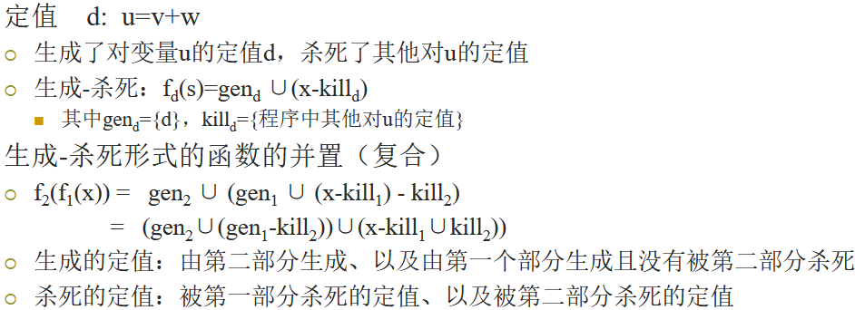

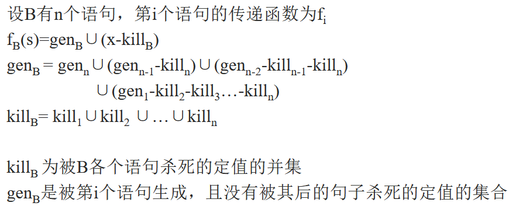

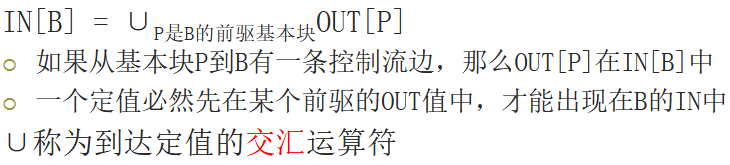

**控制流方程**

ENTRY基本块的传递函数是常函数：OUT[ENTRY] = 空集

其他基本块：

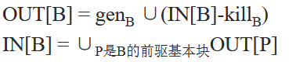

迭代解法

- 首先求出各基本块的 gen 和 kill
- 令所有的 OUT[B] 都是空集，然后不停迭代，得到最小不动点的解

### 9.2.5 活跃变量分析

x 在 p 上的值是否会在某条从 p 出发的路径中使用

一个变量 x 在 p 上活跃，当且仅当存在一条从 p 点开始的路径，该路径的末端使用了 x，且路径上没有对 x 进行覆盖

基本块的传递函数仍然是生成-杀死形式，但是从OUT值计算出IN值（逆向）

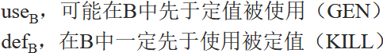

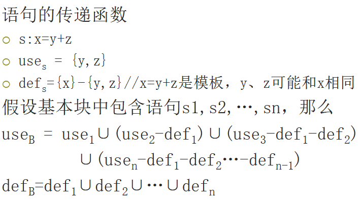

任何变量在程序出口处不再活跃：IN[EXIT] = 空集

对于所有不等于EXIT的基本块：

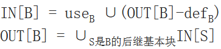

### 9.2.6 可用表达式

x+y 在 p 点可用的条件：从流图入口结点到达 p 的每条路径都对 x+y 求值，且在最后一次求值之后再没有对 x 或者 y 赋值

生成-杀死：

- 杀死：基本块对 x 或 y 赋值，且没有重新计算 x+y，那么它杀死了 x+y
- 生成：基本块求值 x+y，且之后没有对 x 或者 y 赋值，那么它生成了 x+y

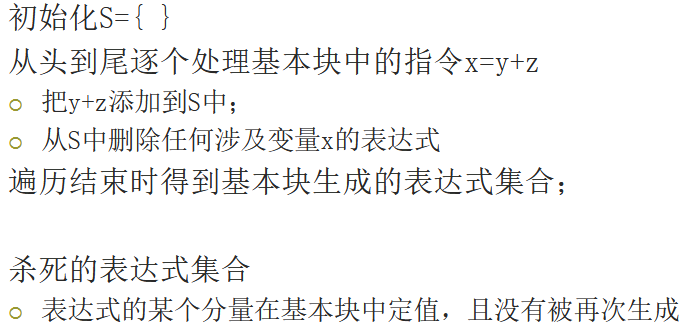

**可用表达式的数据流方程**

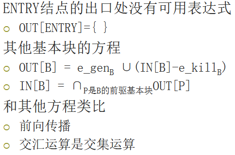

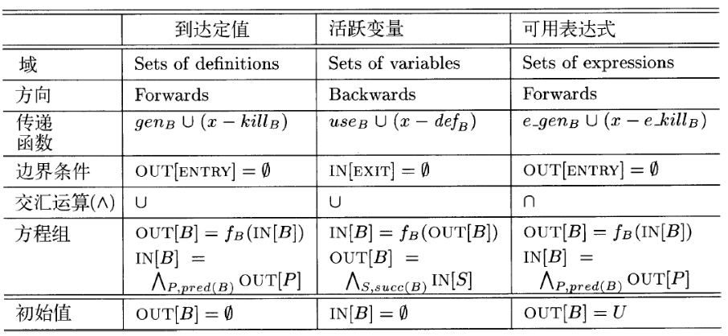

## 9.3 数据流分析基础

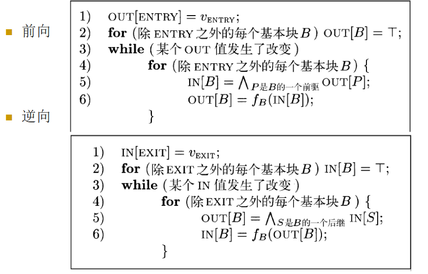

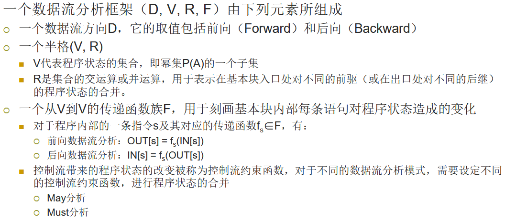

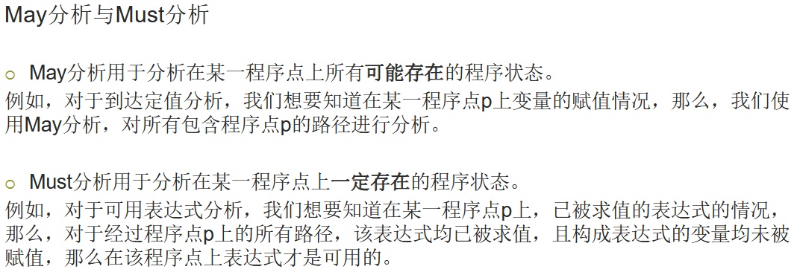

## 9.4 常量传播

所有符合该变量类型的常量值

NAC（Not-A-Constant）表示当前变量不是一个常量值。这代表该变量在到达程序点 p 的不同的路径上的值不同，或是被赋予了一个输入变量的值

UNDEF，表示未定义的值。在到达程序点 p 的不同路径上存在至少一条路径未对变量的值进行定义

## 9.5 流图中的循环

### 9.5.1 支配结点

如果每一条从入口结点到达 n 的路径都经过 d，我们就说 d 支配 n，记为 d dom n

**支配结点树**

直接支配结点：从入口结点到达 n 的任何路径（不含 n）中，它是路径中最后一个支配 n 的结点

### 9.5.2 深度优先排序

先访问一个结点，然后遍历该结点的最右子结点，再遍历这个子结点左边的子结点，依此类推

**深度优先生成树（DFST）**

### 9.5.3 深度优先生成树中的边

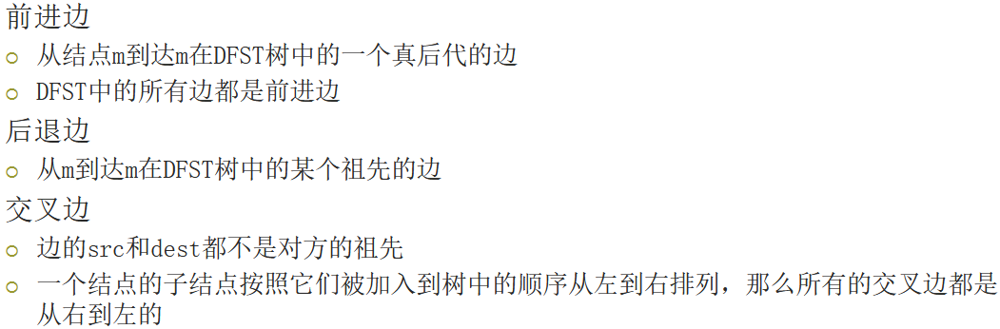

### 9.5.4 回边和可归约性

### 9.5.5 流图的深度

一个流图，相对于一棵 DFST 的深度：各条无环路径上后退边数中的最大值

### 9.5.6 自然循环

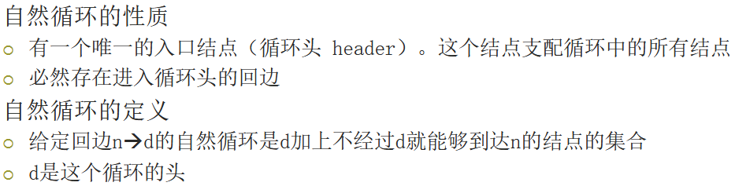

**自然循环构造算法**

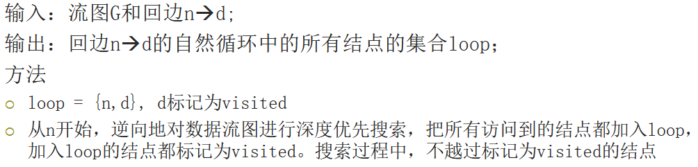

**自然循环的性质**

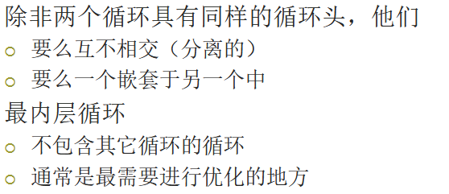