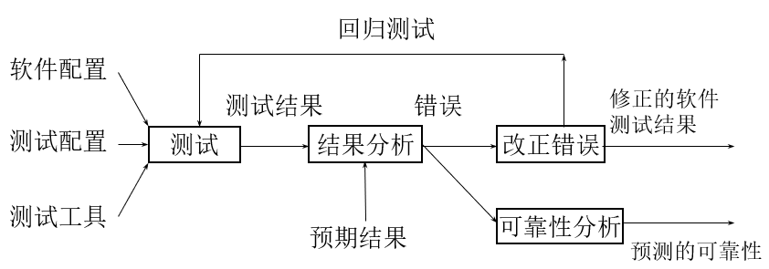

# 第一章 软件测试概论

## 1.1 软件缺陷与管理

软件缺陷：
（1）软件未达到产品说明书中已经标明的功能；
（2）软件出现了产品说明书中指明不会出现的错误；
（3）软件未达到产品说明书中虽未指出但应当达到的目标； 
（4）软件功能超出了产品说明书中指明的范围；
（5）软件测试人员认为软件难以理解、不易使用，或者最终用户认为该软件使用效果不良。

软件缺陷管理：缺陷预防、**缺陷发现（软件测试的目的）**、缺陷记录和报告、缺陷分类和跟踪、缺陷处理、缺陷预测

## 1.2 软件质量

软件测试的核心目的：度量和提高软件质量

软件质量：一个包含多个属性的，可度量的多维度的量，其中有些属性比另外一些属性重要。根据软件质量的度量方式可以分为**静态质量属性**和**动态质量属性**。

- **静态质量属性**是指实际代码和相关文档的质量，包括代码的结构化、可维护性、可测试性，文档的完整性和可读性
- **动态质量属性**是指软件使用过程中质量属性，包括软件的可靠性、正确性、完备性、可用性、可维护性、可信性和性能等。

## 1.3 软件测试的定义、性质及相关概念

1. 软件测试的定义

软件测试的定义：8 个

定义8：软件测试以寻找软件错误、增强软件正确性和满意度等为目标，对软件进行测试设计、生成、执行、结果记录和分析维护等活动，在此过程中坚持预防性为主、充分进行风险分析、尽量使用工具等原则，以提高测试活动的科学性、有效性和经济性。

2. 软件测试的性质

（1）存在性或永不过时性
（2）不完全性或抽样性
（3）证错不证对性
（4）检错保质性
（6）测试效果评判准则

3. 软件测试的相关概念

（1）软件测试的对象：软件开发过程中所产生的需求规格说明、概要设计规格说明、详细设计规格说明以及源程序都是软件测试的对象。

（2）测试用例：为特定的目的而设计的一组测试输入、执行条件和预期的结果；测试用例是执行测试的最小实体。

（3）测试步骤：测试步骤详细规定了如何设置、执行、评估特定的测试用例。

4. 软件测试涉及的关键问题：
   （1）测试由谁来执行         （2）测试什么
   （3）什么时候进行测试     （4）怎样进行测试

## 1.4 软件测试的目标

软件生命周期：一个软件生命周期包括制定计划、需求分析定义、软件设计、程序编码、软件测试、软件运行、软件维护、软件停用等 8 个阶段。 

软件测试在软件生命周期中横跨两个阶段：
（1）第一个阶段：单元测试阶段，即在每个模块编写出以后所做的必要测试
（2）第二个阶段：综合测试阶段，即在完成单元测试后进行的测试，如集成测试、系统测试、验收测试

## 1.5 软件测试的意义和重要性

- 开发方：尽早发现和改正软件中潜在的错误，避免最终给开发方自己造成直接和间接的损失
- 用户：适当的测试是用户对是否接受软件系统的依据

## 1.6 软件测试的 20 条原则

（1）尽早地和及时地测试
（2）测试用例应当由测试数据和与之对应的预期结果这两部分组成
（3）在程序提交测试后，应当由专门的测试人员进行测试
（4）测试用例应包括合理的输入条件和不合理的输入条件
（5）严格执行测试计划，排除测试的随意性
（6）充分注意测试当中的群体现象
（7）应对每一个测试结果做全面的检查
（8）保存测试计划、测试用例、出错统计和最终分析报告，为维护工作提供充分的资料
（9）进行风险分析，确定计划风险
（10）制定测试策略
（11）使用测试清单
（12）使用测试工具
（13）度量测试有效性
（14）不断进行培训
（15）宣传测试思想
（16）软件测试是一种服务
（17）软件测试是一项极富创造性、极具智力挑战性的工作
（18）选择一种合适的方法
（19）增量和分级测试
（20）分析缺陷趋势和模式

测试停止的依据：
（1）测试超过了预定时间，则停止测试。
（2）执行了所有的测试用例，但并没有发现故障，则停止测试。 
（3）使用特定的测试用例设计方案作为判断测试停止的基础。 
（4）正面指出停止测试的具体要求，即停止测试的标准可定义为查出某一预订数目的故障。 
（5）根据单位时间内查出故障的数量决定是否停止测试。 

## 1.7 软件测试的分类

- 按照软件测试用例的设计方法：白盒测试法和黑盒测试法

- 按照软件测试的策略和过程：单元测试、集成测试、系统测试、验证测试和确认测试
- 按照被测试软件的开发方法和应用环境的不同：面向对象软件的测试、面向方面的软件测试、面向服务的软件测试、构件软件测试、Web应用软件测试、普适计算环境下的软件测试、云测试、物联网环境下的软件测试、并行软件测试、嵌入式软件测试、高可信软件测试、人工智能测试，区块链软件测试，云宇宙测试
- 按照不同的测试技术：组合测试、蜕变测试、变异测试、演化测试...

- 按照软件不同特性和方面测试：负载测试、压力测试、性能测试、安全性测试...

## 1.8 软件测试的过程及策略模型

1. 软件测试基本信息流模型

（1）软件配置：测试对象，它包括软件需求规格说明、软件设计说明、和被测试的源程序清单
（2）测试配置：包括测试计划，测试用例，测试驱动程序，实际上，在整个软件工程中，测试配置只是软件配置的一个子集
（3）测试工具：为提高软件测试效率，可使用测试工具支持测试。其作用就是为测试的实施提供某种服务，以减轻人们完成测试任务中的手工劳动。

2. 软件测试在开发模型中的位置

- 大棒开发法
- 边写边改法
- 瀑布模型
- 快速原型模型
- 螺旋模型

- 敏捷方法

3. 软件测试过程及策略模型

（1）V 模型

（2）W 模型

（3）H 模型

（4）X 模型

软件开发与软件测试的关系

- 测试与开发各阶段的关系
- 测试在开发阶段的作用
- 测试与开发的并行性

## 1.9 软件测试的职业

测试员应具备的素质：

- 探索精神
- 故障排除能手
- 不懈努力
- 创造性
- 追求完美
- 判断准确
- 老练稳重
- 说服力

## 1.10 软件测试的学术研究

1、研究针对各类具体软件的测试方法

2、软件测试的基本方法

## 1.11 软件测试的工具

- **测试管理工具**：用于管理测试的整个工作过程以及过程中产生的各种相关文档、数据、记录和报告等。常用的管理工具有TestDirector和TestManager等
- **自动化功能测试工具**：用于自动化执行功能测试脚本，一般采用基于录制回放的机制，通过录制操作过程，产生基本的测试脚本，然后在脚本编辑器中进一步完善测试脚本，在通过回放脚本的方式执行测试脚本的步骤，从而实现功能测试的自动化。常用的测试自动化工具有QTP(Quick Test Professional), Rational Robot, TestCoplete等。
- **性能测试工具**：用于性能测试过程中的通信协议模拟、并发用户模拟及性能参数监控等方面的测试工具，如LoadRunner，SilkPerformer等。
- **单元测试工具**：用于单元测试的测试框架，这些测试工具提供单元测试的一些接口，管理单元测试的执行，例如XUnit系列、MSTest等。
- **白盒测试工具**：用于测试程序内部逻辑和错误的测试工具，又可以细分为代码标准检查工具、代码效率检查工具和内存泄露检查工具等，如TEST、AQTime和BundsChecker等。
- **测试用例设计工具**：用于辅助测试用例的设计或测试数据生成的工具，一般常用的有CTE XL、AETG和PICT等。
- 测试工具还可以根据收费方式分为商业测试工具、开源测试工具和免费测试工具。

## 1.12 软件测试的管理

- **时间维**：**全过程管理**，对软件测试项目的全过程进行控制，具体包括：测试计划管理，测试设计管理，测试执行管理，测试结果管理等。
- **空间维**：**全方位管理**，对与软件质量有关的关键因素实施全方位管理，具体包括：缺陷管理、文档管理、配置管理、评审管理、质量管理和回归管理等。
- **组织维**：**人员管理**，构建从测试人员、测试小组到测试机构的多层次的组织管理模式。

## 1.13 软件测试的过去、现在和未来

（1）1950年：面向调试

（2）1960年：面向演示

（3）1970年：面向破坏

（4）1980年：面向评价

（5）1990年：面向预防

（6）2000年：软件测试职业、教育、研究逐渐兴起

# 思考题

1 什么是软件质量

2 什么是软件缺陷，它具有哪些危害，如何管理？

3 什么是软件测试

4 测试的普遍观

5 软件测试的种类

6 软件测试的关键问题是什么？

7 软件测试的对象是什么？

8 软件测试的停止准则有哪些？

9 软件测试的目的和意义

10 软件测试的原则

11 软件测试在软件工程中的位置（在若干开发模型中）

12 软件测试的过程

13 软件测试的研究

14 软件测试作为一种职业和作为一门科学

15 软件测试的工具

16 软件测试的管理

17 软件测试的历史

18 软件测试的标准