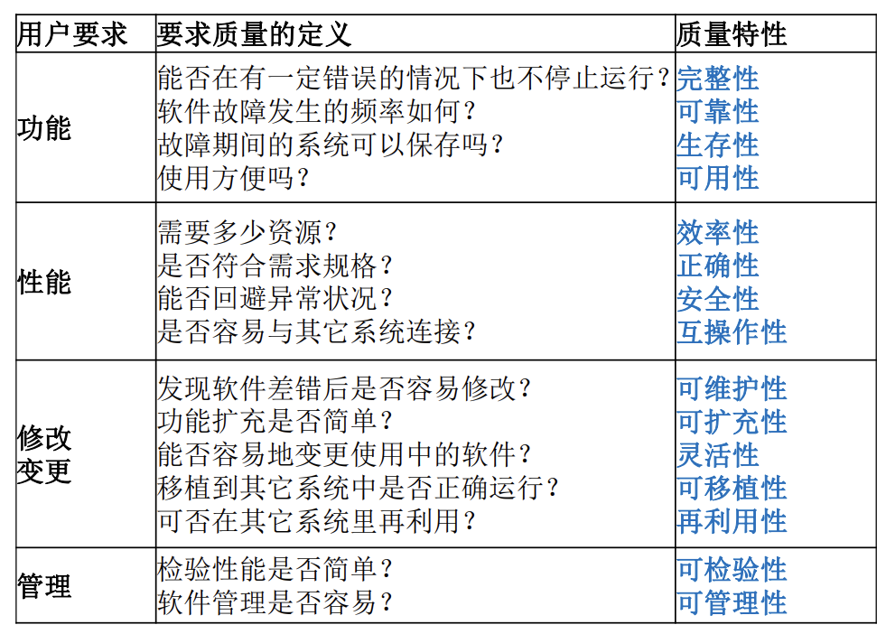

# 2 软件测试课程基础

## 2.1 软件、智能化软件

### 2.1.1 软件定义

软件：计算机程序、规程以及可能的相关文档和运行计算机系统需要的数据。

### 2.1.2 软件特征

- 软件是开发产生的，而不是用传统方法制造。

- 软件不会像硬件一样有磨损。
- 很多软件不能通过已有构件组装，只能自己定义。

### 2.1.3 软件简史

### 2.1.4 软件的分类

系统软件、应用软件、Web应用软件、工程和科学软件、嵌入式软件、产品线软件、人工智能软件

### 2.1.5 软件的未来

知识将由工业社会中的非独立性生产要素变成独立性生产要素；知识将超越资本，成为推动社会发展的重要资源。

知识是未来的“生产资料”，而软件作为知识的载体，将改变所有产业，并成为所有行业运行的基础设施。

## 2.2 软件新形式

- 多核和并发系统：突破单核的性能瓶颈
- 中间件：连接软件组件和应用的计算机软件，聚焦于消除信息孤岛，推动无边界信息流
- 分布式系统：采用更多的普通计算机组成分布式集群对外提供服务

- Agent：一种特定环境下具有社会交互性和智能性的计算机系统
- 信息物理融合系统：将物理设备联网，是连接到互联网上，让物理设备具有计算、通信、精确控制、远程协调和自治等五大功能
- 移动应用软件：运行在智能手机、平板电脑等智能终端上的应用程序
- 网构软件：面向网络环境
- 人工智能软件：是人工智能与软件的结合，使用人工智能的方法开发软件或软件提供人工智能方面的功能
  - 基于知识的软件：知件
  - 基于机器学习的软件：学件

## 2.3 软件质量

### 2.3.1 软件质量需求的背景

### 2.3.2 软件质量的定义和内容

1、定义：软件产品满足规定和隐含需求能力有关的所有特征和所有特性的总和

2、软件质量的内容：

- 从用户的角度看，质量就是满足客户的需求

- 从开发团队的角度看，质量就是与需求说明保持一致

- 从企业管理者的角度看，质量就是客户是否愿意购买

产品质量：人们实践产物的属性和行为

过程质量：人们产生产品的过程的好坏（由关注结果向关注过程控制的转变；由被动检验向主动管理的转变）

在商业过程中有关的质量内容：培训、成品制作、宣传、发布、客户、风险、成本、业务等

3、软件质量特性

- 软件质量特性与用户要求

  

- 3A 特性：可说明性、有效性、易用性

- RUP 软件质量的三个维度：功能、可靠性、性能

### 2.3.4 软件质量模型

软件质量模型是影响软件软件质量的特性及其之间关系的集合，是用来描述质量需求以及对质量进行评价的理论基础，能帮助人们区分各质量因素对软件质量影响程度

- 软件产品质量模型：McCall 模型，Boehm 模型，ISO 9126 / 25010 模型
- 软件过程质量模型：软件能力成熟度模型 CMM (Capability Maturity Model)，国际标准过程模型 ISO 9000，软件过程改进和能力决断 SPICE (Software Process Improvement and Capability Determination

## 2.4 软件测试中 bug 的 PIE 模型

PIE 模型是软件测试中的一个概念模型，用于描述软件缺陷（Bug）从产生到被观测到的整个过程。PIE 分别代表 Fault（缺陷）、Error（错误）和 Failure（失效）。

- Fault：软件中存在的静态错误
- Error：由于Fault导致的内部状态的错误
- Failure：不满于规格说明，用户可见的外部错误

PIE模型中，要观测到一个Failure，需要经过三个步骤：

1. Execution（执行）：软件的执行必须能够到达含有 Fault 的代码
2. Infection（感染）：触发了错误的中间状态（Error）
3. Propagation（传播）：错误的中间状态必须可以传播到最后的输出使得可以被观测到（Failure）

在实际的软件测试中，即使存在 Fault，也不一定能够观测到 Failure，因为可能不满足上述三个条件。测试的目的之一就是通过设计和执行测试用例，尽可能地触发和观测到这些 Failure，以便在软件发布前修复这些缺陷。

## 2.5 软件缺陷及其管理

### 2.5.1 软件缺陷的术语

程序员犯的一个或多个（错误 error），最后变成程序中的（故障 fault 或 bug）或 （缺陷 defect），当我们执行程序的时候，就会发现观察到的行为 （特征 feature）与软件规格说明书中预期的行为之间的（差异 variance），这就导致了（矛盾 inconsistency）、 （软件失效 failure）或（异常 anomaly）等各种（毛病 incident）和（问题 problem）

### 2.5.2 软件缺陷的定义

（1）软件未达到产品说明书中已经标明的功能
（2）软件出现了产品说明书中指明不会出现的错误
（3）软件未达到产品说明书中虽未指出但应当达到的目标；
（4）软件功能超出了产品说明书中指明的范围
（5）软件测试人员认为软件难以理解、不易使用，或者最终用户认为该软件使用效果不良

### 2.5.3 软件缺陷的类型

（1）功能、特性没有实现或部分实现
（2）设计不合理，存在缺陷
（3）实际结果和预期结果不一致
（4）运行出错，包括运行中断、系统崩溃、界面混乱
（5）数据结果不正确、精度不够
（6）用户不能接受的其他问题，如存取时间过长、界面不美观

### 2.5.4 软件缺陷产生的原因

项目期限的压力、产品的复杂度、沟通不良、开发人员的疲劳、压力或受到干扰、缺乏足够的知识、技能和经验、不了解客户的需求、0缺乏动力

### 2.5.5 软件缺陷的管理

缺陷预防、**缺陷发现（软件测试的目的）**、缺陷记录和报告、缺陷分类和跟踪、缺陷处理、缺陷预测

## 2.6 验证与确认（V & V）

### 2.6.1 什么是验证和确认

验证（Verification）：

- 检验软件是否已正确地实现了产品规格书所定义的系统功能和特性
- 提供证据来表明软件相关产品与所有生命周期活动的要求相一致
- 验证为判断每一阶段生命周期活动是否已经完成，及能否启动下一个生命周期活动建立了一个新的基准

确认（Validation）：

- 包含一系列保证所生产的软件能够追溯到用户需求的活动。
- 确认过程要提供证据，来表明软件已经满足客户需求，并解决了相应的问题
- 一个更准确的说法是“有效性确认”

验证的目的是保证产品在生产的每个流程都能满足规范和项目的特定需求

确认的目的是试图去证实我们开发的工程产品是否是客户所期望的那样

### 2.6.2 区别

|          | 验证（Verification）                                   | 确认（Validation）                               |
| -------- | ------------------------------------------------------ | ------------------------------------------------ |
| 代码     | 静态的验证文档、设计、代码的过程。通常情况下不运行代码 | 动态的测试实际产品的方法。通常情况下需要运行代码 |
| 检查项目 | 检查软件是否符合特定规范                               | 检查软件是否符合了客户的要求                     |
| 参与单位 | 一般由 QA（Quality Assessment）团队完成                | 一般需要测试部门的参与                           |
| 常用方法 | 同行评审（审查、走查）、桌面检查                       | 单元测试、集成测试、系统测试、验收测试           |
| 用法     | 常被用作发现较底层错误的方法                           | 常被用作发现较高层错误的方法                     |

### 2.6.3 模型

**V 模型**

一种可以反映 V&V活动与需求分析和 设计之间关系的模型。

**W 模型**

基于 V&V 原理的 W 模型实际上就是存在两个“V”，一个是实际的软件开发过程，另一个则是与软件开发工程相对应的测试过程。

# 思考题

1、什么是软件？

2、列举并评论若干身边的软件

3、软件有哪些类型？

4、软件未来发展趋势如何？

5、软件质量包含哪些因素？有哪些质量模型？

6、简述PIE模型

7、根据PIE模型，我们应该如何设计测试？

8、缺陷产生的原因有哪些？

9、缺陷管理包括那些内容？

10、V&V 的区别和联系如何？

11、软件有哪些新的形式？

12、智能化软件的主要特征是什么？有哪些熟悉的这类软件？