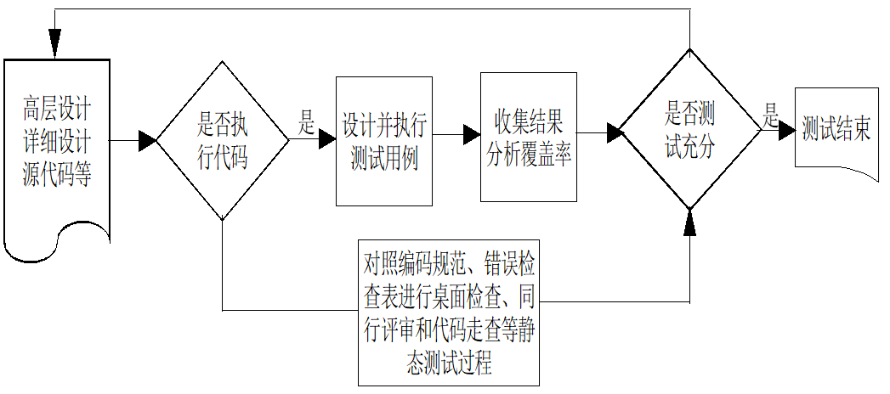
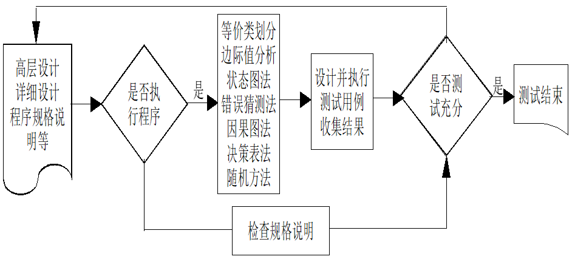
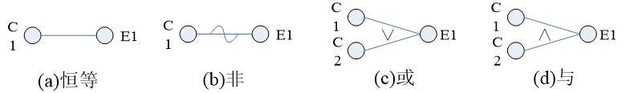

# 3 白盒测试和黑盒测试

## 3.1 白盒测试

1、概念：把测试对象看成一个打开的盒子，允许软件测试员利用程序内部的逻辑结构及有关信息，设计或选择测试用例，对程序所有逻辑路径和条件分支等结构成分进行测试

2、目标：

- 静态白盒测试：代码审查、走查
- 动态白盒测试：运行待测试软件 

3、原理

4、方法

5、优缺点

- 优点：尽早发现问题；有助于优化代码
- 缺点：需要了解代码和内部结构，有较高的门槛，需要对目标系统、测试工具、编程语言和建模等具备丰富经验的测试人员

## 3.2 静态白盒测试

1、概念

静态白盒测试是一些评审过程，可以使几个程序员之间一个简单的会议，对软件的设计和编码进行详细和严格的审查，这些评审过程有以下**四个特征**：

- 发现问题。针对设计和代码，检查错误和遗漏，所有的批评都是对事不对人
- 遵循一定的规则。例如，指定审查的代码量，会议时间和每个参会人员的责任等
- 准备工作。评审会效果取决于参会人员的会前准备工作，每个人都要为会议作出贡献。很多问题都是在会前准备发现的，而不是在会议上
- 会议报告。评审团要求就发现的问题写一个书面报告：多少问题，问题在哪里

静态白盒测试通过各种评审，除了可以发现问题还有以下**四个作用**：

- 交流沟通的作用。通过评审会，程序员之间可以相互学习，项目经理可以了解项目进度，黑盒测试人员可能会得到一些有用信息，有利于进行黑盒测试
- 提高编码和文档质量。程序的代码和相关的文档被同行和专家仔细阅读和评审，这对程序员是一个很大的压力，这使得他们在写程序及文档时会非常认真
- 建立团队友谊。评审会使得大家相互了解对方的工作技能和难度，互相理解和尊重
- 寻求解决方案。对于一些棘手的问题，评审会的讨论有可能提供部分解决思路

2、方法

（1）同行评审

（2）代码审查

（3）代码走查

（4）桌面检查

3、编码标准和指南

（1）可靠性要求

（2）可读性和可维护性要求

（3）可移植性要求

## 3.3 动态白盒测试

使用动态白盒测试，主要对模块进行如下的测试：

- 对程序模块的所有独立的执行路径至少执行一次
- 对所有的逻辑判定，取值为“真”与取值为“假”的两种情况都能至少测试一次
- 在循环的边界与运行界限内执行循环体
- 测试内部数据结构的有效性

白盒测试的测试用例设计：语句覆盖、判定覆盖、条件覆盖、判定/条件覆盖、条件组合覆盖、路径覆盖、LCSAJ覆盖、修改决策条件测试（MC/DC）、数据流测试

逻辑覆盖：测试数据执行（或叫覆盖）程序逻辑的程度

### 3.3.1 语句覆盖

为了暴露程序中的错误，至少每个语句应该执行一次。语句覆盖的含义是，选择足够多的测试数据，使被测程序中每个语句至少执行一次。

可执行语句包括：赋值语句、循环和选择语句、过程和函数调用语带初始化变量声明语句和堆中的可变存储的动态分配语句

普通的变量声明语句被认为是不可执行语句

### 3.3.2 判定覆盖

判定覆盖就是设计若干测试用例，运行所测程序，使得程序中每个判断的取真分支和取假分支至少经历一次。判定覆盖又称为分支覆盖。

### 3.3.3 条件覆盖

条件覆盖就是设计若干个测试用例，运行所测程序，使得程序中每个判断条件的可能取值至少执行一次。

### 3.3.4 判定-条件覆盖

判定-条件覆盖就是设计足够的测试用例，使得判断中每个条件的所有可能取值至少执行一次，同时每个判断的所有可能判断结果至少执行一次。换言之，即是要求各个判断的所有可能的条件取值组合至少执行一次。

判定-条件覆盖也有缺陷。从表面上来看，它测试了所有条件的取值。但事实并非如此。因为往往某些条件掩盖了另一些条件。  

### 3.3.5 条件组合覆盖

条件组合覆盖就是设计足够的测试用例，运行所测程序，使得每个判断的所有可能的条件取值组合至少执行一次

### 3.3.6 修改决策条件测试（MCDC）

设计测试用例让每个条件变量独立改变判定语句的真假值

这种测试方法的优点是：保证每个变量真假值出现一次、整个判定表达式出现真假值、让每个变量独立影响判定表达式的真假值、测试用例最好的情况下规模为 n+1，最差情况下测试用例规模为 2n，而条件组合覆盖需要 2^n^ 条测试用例，因此修改决策条件测试（MC/DC）是最实用的一种测试方法。

### 3.3.7 路径覆盖测试

路径测试就是设计足够的测试用例，覆盖程序中所有可能的路径。

基本路径覆盖：基本路径测试就是这样一种测试方法，它是在程序控制流图的基础上，通过分析控制构造的环境复杂性，导出基本可执行路径集合，从而设计测试用例的方法。设计出的测试用例要保证在测试中程序的每一个可执行语句至少执行一次。

主要步骤如下：
（1）以详细设计或源代码作为基础，导出程序的控制流图
（2）计算得到的控制流G的环路复杂性
（3）确定线性无关的基本路径集
（4）生成测试用例，确保基本路径集中每条路径的执行。

图形矩阵：图形矩阵是在基本路径测试中起辅助作用的软件工具，利用它可以实现自动地确定一个基本路径集。一个图形矩阵是一个方阵，其行/列数等于控制流图中的结点数。每行和每列依次对一个被标记的结点，矩阵元素对应到结点间的连接（即边）。

### 3.3.8 线性代码序列跳转测试（LCSAJ testing） 

线性代码序列跳转测试主要关注程序控制流的跳转，一个线性代码序列跳转表示为一个三元组：线性代码起点行数s、线性代码终点行数e和控制流跳转点的代码行数j，即 （s, e, j）

测试用例用来执行覆盖每个线性代码序列跳转，每个测试用例可以描述为三个部分：测试输入、被该测试用例执行的线性代码序列跳转、预期输出

由于线性代码序列跳转测试的对象是线性代码序列跳转，所以线性代码序列跳转测试的覆盖率度量为：

$$
\text{LCSAJ} = \frac{执行过的线性代码序列跳转个数}{所有的线性代码序列跳转个数} \times 100 \%
$$

### 3.3.9 数据流测试

程序中变量的出现分为两类：定义、使用

- 定义：变量被赋予新值
- 谓词使用：变量出现在 while...do... 或 if...then...else 等分支语句的为此部分
- 计算使用：变量出现在赋值语句的右边，或者出现在输出语句中

定义引用对：一个变量的定义引用对是程序控制流图中一段连接该变量定义和使用的一天简单路径。简单路径是指程序控制流图中没有不必要的（冗余）路径

所有定义覆盖（all-definitions）：设计测试用例执行所有变量定义点到某些使用点（计算使用或者谓词使用）的路径

所有计算使用覆盖（all-c-uses）：设计测试用例执行每个变量定义点到其每个计算使用点的路径

所有谓词使用覆盖（all-p-uses）：设计测试用例执行每个变量定义点到其每个谓词使用点的路径

所有使用覆盖（all-uses）：设计测试用例执行每个变量定义点到其每个使用点（计算使用或者谓词使用）的路径

所有定义使用对覆盖（all-du-paths）：设计测试用例执行所有变量定义点到每个使用点（计算使用或者谓词使用）的路径

## 3.4 黑盒测试

黑盒测试：在完全不考虑程序的内部结构和处理过程的前提下，在程序接口进行的测试，它只检查程序功能是否能按照规格说明书的规定正常使用，程序是否能适当地接受输入数据产生正确的输出信息，并且保持外部信息的完整性。因此，又称为功能测试或数据驱动。

黑盒测试主要为发现以下几类错误：
（1）是否有不正确和遗漏了的功能？
（2）在接口上，输入是否正确地接受，是否输出正确的结果？
（3）是否有数据结构错误或外部信息访问错误？
（4）性能上是否满足要求？
（5）是否初始化或终止性错误？

静态黑盒测试：对软件规格说明书的审查

动态黑盒测试：等价类划分、边界值分析、因果图分析、错误猜测、状态转换测试、语法测试

黑盒测试流程

优缺点：

- 优点：可以将测试工程师的精力主要集中在根据功能需求来设计测试用例，验证软件是否按照预期要求工作
- 缺点：不能保证代码和路径等结构覆盖率

### 3.4.1 等价类划分

1、概念

等价类：某个输入域的集合，在这个集合中每个输入条件都是等效的

把所有可能输入的数据划分成若干等价类，假定每类中的一个典型值在测试中的作用与这类中所有其他值的作用相同。然后可以从每个等价类中只取一组数据作为代表性数据用于测试，以便发现程序中的错误

2、目标

3、原理：等价类的划分有两种不同情况：
（1）合理等价类：输入数据满足程序模块的输入数据规范，是有意义的输入数据集合。使用合理等价类构造测试用例，主要检测程序模块是否实现了设计规格规定的功能和性能
（2）不合理等价类：输入数据不满足程序模块的输入数据规范，是无意义的输入数据集合。使用不合理等价类构造测试用例，主要检测程序模块是否能够拒绝无效数据输入，被测试对象在运行初始条件不具备时的可靠性如何

4、方法
（1）如果输入条件规定了取值范围，或值的个数，则可以确定一个有效等价类和两个无效等价类
（2）如果输入条件规定输入值的集合，或者是规定了“必须如何”的条件，则可确立一个有效等价类和一个无效等价类
（3）如果输入条件是一个布尔量，则可以确定一个有效的等价类和一个无效的等价类
（4）如果规定了数据的一组值，而且程序要对每个输入值分别进行处理。这时可为每一个输入值确定一个有效等价类，此外针对这组值确定一个无效等价类，它是所有不允许的输入值的集合
（5）如果规定了输入数据必须遵守的规则，则可以确立一个有效等价类（符合规则）和若干个无效等价类（从不同角度违反规则）
（6）如果确知，已划分的等价类中各元素，在程序中的处理方式是不同的，则应将此等价类进一步划分为更小的等价类

5、等价类划分的实施步骤

- 第一步：划分等价类。划分等价类的依据是被测对象的功能说明/接口定义，构造如下表格。表格中的各等价类给予编号。
- 第二步：设计测试用例：
  - 为每个等价类规定一个唯一的编号
  - 设计一个测试用例，使之尽可能的覆盖尚未被覆盖的多个有效等价类。重复这一步，直到所有的有效等价类都被覆盖为止
  - 设计一个测试用例，使它覆盖一个而且只覆盖一个尚未被覆盖的无效等价类，重复该步骤，直至所有不合理等价类覆盖完毕

6、优缺点

- 优点：在有明确的条件和限制情况下，利用等价类划分技术可以设计出完备的测试，避免盲目或随机选取输入数据的不完整性和覆盖的不稳定性，减少不必要的测试用例
- 缺点：只考虑原子条件的输入输出，条件直接的相互关系可能被忽略，如果考虑它们之间的关系，代价又会非常高

### 3.4.2 边界值分析

使用边界值分析方法设计测试用例时，首先应该确定边界情况。通常输入等价类与输出等价类的边界，就是应该着重测试边界情况。应当选取正好等于、刚刚大于，或刚刚小于边界的值作为测试数据，而不是选取等价类的典型值或任意值作为测试数据。

选择测试用例的原则：
（1）如果输入条件规定了值的范围，则应取刚达到这个范围的边界的值，以及刚刚超越这个范围边界的值作为测试输入数据
（2）如果输入条件规定了值的个数，则用最大个数、最小个数、比最大个数多1，比最小个数少1的数作为测试数据
（3）根据规格说明的每个输出条件。使用前面的原则 1
（4）根据规格说明的每个输出条件。使用前面的原则 2
（5）如果程序的规格说明给出的输入域或输出域是有序集合（如有序表，顺序文件等），则应选取集合的第一个元素和最后一个元素作为测试用例
（6）如果程序中使用了一个内部数据结构，则应当选择这个内部数据结构的边界上的值作为测试用例
（7）分析规格说明，找出其他可能的边界条件

### 3.4.3 判定表

等价划分法和边界值分析法都只孤立地考虑各个输入数据的测试功效，而没有考虑多个输入数据的组合效应，可能会遗漏了输入数据易于出错的组合情况。

选择输入组合的一个有效途径是利用判定表或判定树为工具，列出输入数据各种组合与程序应作的动作（及相应的输出结果）之间的对应关系，然后为判定表的每一列至少设计一个测试用例。 

### 3.4.4 因果图法

1、因果图的适用范围

要检查输入条件的组合不是一件容易的事情，即使把所有输入条件划分成等价类，它们之间的组合情况也相当多。因此必须考虑使用一种适合于描述对于多种条件的组合，相应产生多个动作的形式来考虑设计测试用例，这就需要利用因果图。因果图方法最终生成的就是判定表。它适合于检查程序输入条件的各种组合情况

2、用因果图法生成测试用例的基本步骤

- 分析软件规格说明描述中，哪些是原因（即输入条件或输入条件的等价类），哪些是结果（即输出条件），并给每个原因和结果赋予一个标识符
- 分析软件规格说明描述中的语义，找出原因和结果之间，原因与原因之间对应的关系。根据这些关系，画出因果图
- 由于语或环境限制，有些原因和原因之间，原因和结果之间的组合情况不可能出现。为表明这些特殊的情况，在因果图上用一些记号标明约束或限制条件
- 把因果图转换成判定表
  - 选择结果
  - 根据因果图查找能够得到这个结果的原因组合，以及不产生这个结果的原因组合
  - 在决策表中为每一个原因组合以及引起这个结果的状态加一列
  - 检查决策表条目是否出现冗余，如果是，则删除哪些冗余的条目
- 把判定表的每一列拿出来作为依据，设计测试用例

3、在因果图中出现的基本符号

通常在因果图中用 $C_i$ 表示原因，用 $E_i$ 表示结果，其基本符号如下图所示。主要的原因和结果之间的关系有：

- 恒等：表示原因和结果之间一对一的对应关系。若原因出现，则结果出现。若原因不出现，则结果也不出现
- 非：表示原因和结果之间的一种否定关系。若原因出现，则结果不出现。若原因不出现，反而结果出现
- 或（∨）：表示若几个原因中有一个出现，则结果出现，只有当这几个原因都不出现时，结果才不出现
- 与（∧）：表示若几个原因都出现，则结果才出现。表示若几个原因中有一个不出现，结果就不出现

### 3.4.5 状态转换测试

1、概念：根据测试对象的规格说明，将测试对象抽象为一个状态转换图，根据状态转换图设计测试用例系统检测状态转换过程中可能存在的问题

2、原理：

状态转换模型：状态、转换、事件、动作和它们之间的关系，状态是互不相交的、可识的且数量有限的；事件由输入产生，可导致状态之间发生转换，转换可以回到其起始状态；转换过程中产生动作或输出

3、方法：

设计测试用例执行状态图中的转换 。一个测试用例可以执行多个转换。对于每个测试用例要指定：软件的起始状态、软件的输入、预期输出和预期的最终状态。对于该测试用例执行的每个转换要指定以下信息：起点状态、触发状态转换的事件、预期的状态转换发生时的动作和预期的下一个状态 。测试用例可以用来测试软件 有效的转换，也可以测试那些无法推测的转换。

对于状态转换测试 同样可以定义测试强度和完成准则：

- 每个状态至少执行
- 每个状态转换至少执行
- 所有不符合规格说明的状态转换都已检查

对于一些要求比较高的应用程序 可能还需要声明以下状态转换测试准则：

- 所有的状态和输入的组合
- 所有状态转换的组合
- 所有状态的任意顺序的所有转换 也可以是重复的或连续的

覆盖对象是状态转化模型中的单个转换或多个转换的序列。对于单个转换，转换覆盖率是测试中执行的有效转换占所有转换的百分比 亦称 0-覆盖率切换（0-switch） 。对于 n 个转换序列， 转换覆盖率是测试中执行的有效 n 转换占所有 转换的百分比 亦称 $n - 1$ -切换覆盖率（n-1-switch） 。状态转换覆盖测试统称 k-切换覆盖（k-switch，$k \geq 0$）

### 3.4.6 语法测试

1、目标

语法测试主要针对 3 种类型的错误：软件不识别正确的串；软件接收不正确的串；软件在接收一个串时崩溃

2、方法

- 识别目标语言或格式
- 形式化地定义语言语法
- 通过覆盖输入语言的 BNF 语法图测试正常条件
- 通过执行非法数据测试异常条件

通过对下面的策略进行相应的改造为语法测试生成测试用例

- 每次产生一个错误，同时保持输入串的其他部分正确
- 一旦为单个错误定义了一组完整的测试用例，那么对两个错误的组合也同样处理，然后三个错误的组合等等
- 每次只关注一个层次，同时尽可能保持更高和更低层次真情

### 3.4.7 黑盒测试策略

对软件进行黑盒测试，一定要结合被测试软件的特点，选择性地使用以上方法，并将它们有机地结合起来。

例如按照待测试软件的输入输出条件进行等价类划分，通过在等价类中选择测试用例，可以首先将无限的测试域变为有限，同时等价类划分也是边界值分析方法的基础。应用边界值分析可以找出一些容易发现错误的测试输入，这一点在人们在实践中经常得到验证。如果要考虑输入条件的相互作用，就考虑组合测试等相关技术

应用错误猜测方法，结合测试人员的直觉和经验选择一些测试用例可以作为重要的补充。如果软件的功能规格说明中含有输入条件的组合情况，就应使用因果图分析方法；如果其中有非常明显的状态转换特征，就应采用状态转换测试方法 ；如果输入具有严格的语法，可以采用语法测试

在实际测试过程中，往往先进行静态白盒测试，然后进行动态白盒测试方法；或者将这两个方面结合在一起使用，例如在静态白盒测试过程中设计动态测试用例，或者说在设计动态测试用例的过程中可以进静态白盒测试，这样可以设计出更具针对性的白盒测试用例。 

在黑盒测试基础上增加白盒测试可以有效提高软件质量。 

# 思考题

简述白盒静态测试的4个特征、4个功能和4种形式

简述白盒动态测试的9个逻辑覆盖层级和相互关系

简述黑盒测试的6种方法，黑盒测试的最优策略是什么？