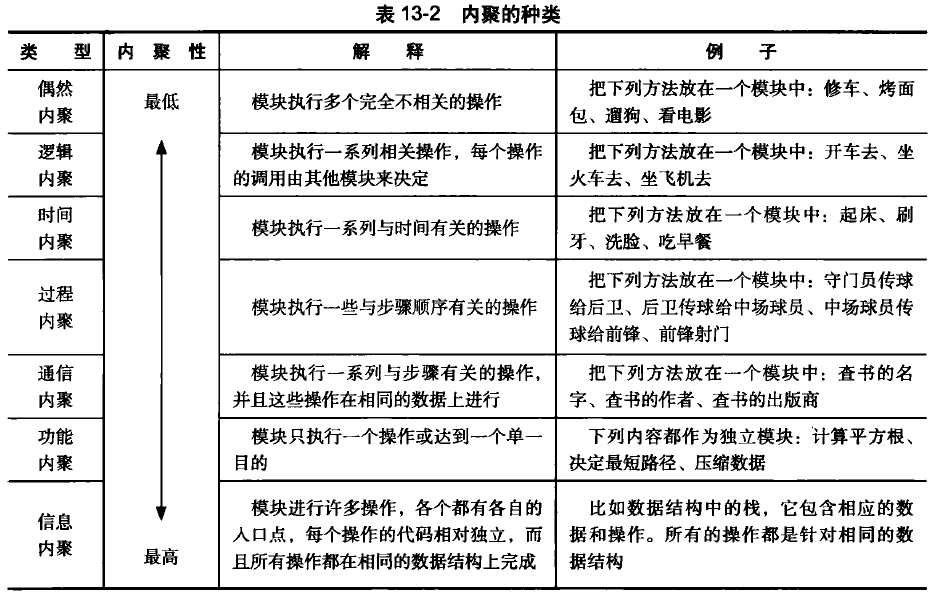

# 第13章 详细设计中的模块化与信息隐藏

## 13.1 模块化与信息隐藏思想

### 13.1.1 设计质量

### 13.1.2 模块化与信息隐藏思想的动机

### 13.1.3 模块化与信息隐藏思想的发展

## 13.2 模块化

### 13.2.1 分解与模块化

高内聚和低耦合原则：每个模块的内部有最大的关联，而模块之间有最小的关联

KWIC

### 13.2.2 结构化设计中的耦合

1. 耦合：两个模块之间的关系的复杂程度

2. 耦合根据其耦合性由高到低分为几个级别：模块耦合性越高，模块的划分越差，越不利于软件的变更和重用。1、2、3不可接受，4、5可以被接受，6最理想

   

### 13.2.3 结构化设计中的内聚

1. 一个模块内部的联系的紧密性
2. 内聚性越高越好，越低越不易实现变更和复用

### 13.2.4 回顾： MSCS 系统设计中的模块化思想

1. 低耦合处理
   - 软件体系结构的分层设计：不同层的模块之间仅能通过程序调用与数据传递实现交互，不能共享数据
   - 软件体系结构的逻辑包设计：依据功能的特点将三个层次进一步划分为更小的包，实现接口最小化
   - 软件体系结构的物理包设计：将不同包的重复内容独立为单独的包以消除重复
   - 详细设计中对象创建者的选择：如果两个对象A 、B 间已有比较高的耦合度了，那么使用 A 创建 B 或者反之，就不会带来额外的耦合度
   - 详细设计中使用控制风格：解除界面与逻辑对象的直接耦合
2. 高内聚处理
   - 软件体系结构的分层设计：三个层次都是高内聚的，一个处理交互任务，一个处理业务逻辑，一个处理数据持久化
   - 软件体系结构的逻辑包设计：将三个层次进一步划分为更小的包
   - 详细设计中抽象类的职责：要求状态与方法紧密联系
   - 详细设计中使用控制风格：控制风格分离了控制逻辑，可以实现业务逻辑对象的高内聚（功能内聚）

## 13.3 信息隐藏

### 13.3.1 抽象与信息隐藏

1. 每个模块都隐藏一个重要的设计决策——职责。职责体现为模块对外的一份契约，并且在这份契约之下隐藏的只有这个模块知道的决策或者说秘密，决策实现的细节仅自己知道。 
2. 模块的信息隐藏：模块的秘密（容易变更的地⽅）：根据需求分配的职责、内部实现机制。
3. 按决策抽象的信息隐藏 vs 算法分解
   - 可修改性：按决策抽象之后，所有的决策秘密都只限于一个模块，所以一旦发生变更也只会孤立在一个模块的内部。而按算法分解，则可能会涉及多个方面。
   - 独立开发：按算法分解必须先设计好所有的数据结构，建立复杂、准确的描述，然后才能并行开发，因为各个模块都共享数据结构。而按决策抽象则只需要定义好各个模块的接口，就可以进行独立的开发，描述也相对简单。
   - 可理解性：按算法分解必须看到整体才能完全理解，而按决策抽象则不需要。

### 13.3.2 信息与隐藏

模块的秘密：

- 根据需求分配的职责
- 内部实现机制

隐藏独立变化的系统细节；分隔不一致变化的模块；只暴露出不容易变化的接口

### 13.3.3 模块说明

1. 模块的主要秘密
2. 模块的次要秘密
3. 模块的角色
4. 模块的对外接口

### 13.3.4 回顾：MSCS 系统设计中的信息思想

- 软件体系结构设计的分层设计：经验表明软件系统的界面是最经常变化的，其次是业务逻辑，最稳定的是业务数据。这就是分层风格建立 Prensentation 、Logic 和Data 三个层次的原因，它们体现了决策变化的划分类型，它们之间的依赖关系符合各自的稳定性。
- 软件体系结构设计的物理包设计：消除重复可以避免重复耦合，同时可以避免同一个设计决策出现在多个地方
- 软件体系结构设计的物理包设计：建立独立的安全包、通信包和数据库连接包，是为了封装各自的设计决策
- 软件体系结构设计与详细设计：严格要求定义模块与类的接口，可以方便开发，更是为了实现信息隐藏。
- 详细设计中使用控制风格：专门用控制器对象封装关于业务逻辑的设计决策，而不是将其拆散分布到整个对象网络中去