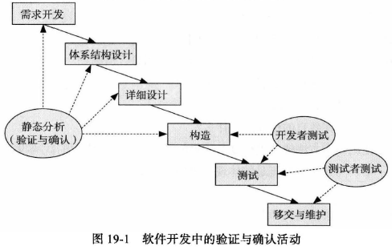
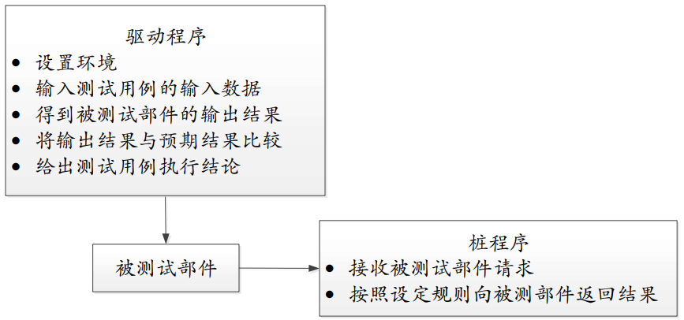
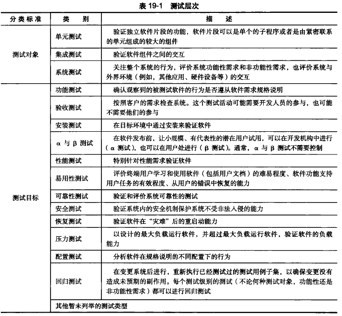
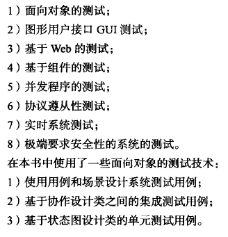
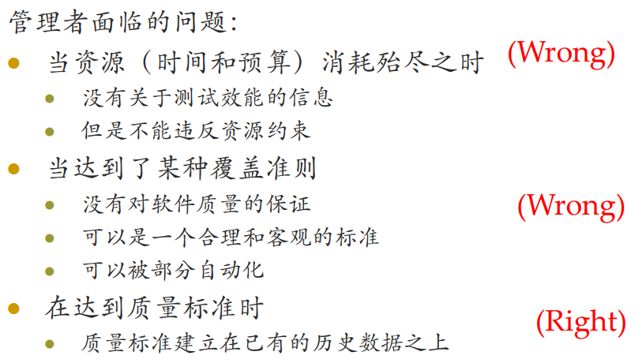

# 第19章 软件测试

## 19.1 引言

### 19.1.1 验证与确认（V & V）

1. 验证：检查开发者是否正确地使用技术建立系统，确保系统能够在预期的环境中按照技术要求正确地运行
2. 确认：检查开发者是否建立了正确的系统，确保最终产品符合规格

3. 两种手段：**静态分析**与**动态测试**
   - 静态测试：在软件能够运行之前，依据开发文档、模型或者其他各种可用制品（例如原型），完成验证与确认任务的方法。**评审**是最为常用的静态分析手段。
   - 动态测试：就是**软件测试**，它在软件能够运行时，考察软件的运行时表现（例如，输人／输出、性能、可靠性等），完成验证与确认任务的方法

### 19.1.2 软件测试的目标

1. 向开发者和用户展示软件满足了需求，表明软件产品是一个合格的产品
   - 有效性测试：使用用户希望的方式来测试软件系统，发现系统的缺陷并进行改进
2. 找出软件中的缺陷和不足
   - 缺陷测试：在软件测试中具有更大的重要性，目标是发现缺陷，只有发现了缺陷的测试才是成功的测试

### 19.1.3 测试用例

软件测试的中心工作就是设计有效的输入数据，观察软件运行结果，并与预期结果进行比较

### 19.1.4 桩与驱动

桩程序是被测试部件的交互环境，它扮演被测试部件需要调用的其他系统部件

驱动程序负责创建被测试部件的执行环境，并驱动和监控被测试部件执行测试用例的过程，判定测试用例的执行结果

### 19.1.5 缺陷、错误与失败

- 缺陷：系统代码中存在的不正确的地方
- 错误：如果系统执行到缺陷代码，就可能使得执行结果不符合预期且无法预测，表现出来不稳定状态就称为错误
- 失败：错误的发生会使得软件的功能失效
- 缺陷 → 错误 → 失败

## 19.2 测试层次

### 19.2.1 测试层次的划分

### 19.2.2 单元测试

1. 在过程化编程中，一个单元就是一个函数与过程；在面向对象编程中，一个单元就是类的一个方法。

2. 单元测试集中检验软件设计中最小单元——模块

### 19.2.3 集成测试（组装测试）

对程序模块一次性或采用增量方式组装起来，对系统的接口进行正确性检验的测试工作

1. 自顶向下组装法

2. 自底向上组装法

### 19.2.4 系统测试

1. 系统测试关注不符合需求的缺陷和需求自身的内在缺陷
2. 分为功能测试、非功能性测试、验收测试、安装测试等。在软件测试阶段，完全由软件测试人员控制和执行的主要是功能测试和非功能性测试
3. 关注整个系统的行为，所以不依赖于桩程序和驱动程序
4. 系统测试的功能测试计划以需求规格说明文档或用例文档为基础，主要使用随机测试和基于规格的测试技术设计功能测试用例。在测试非功能性需求时需要使用针对非功能需求的特定测试技术进行测试计划和测试用例设计

## 19.3 测试技术

### 19.3.1 测试用例的选择

测试用例的选择：用最少的用例发现最多的缺陷

### 19.3.2 随机测试

基于软件工程师直觉和经验，从所有可能的输入值中选择输入子集，建立测试用例

### 19.3.3 基于规格的技术——黑盒测试方法

将测试对象作为一个黑盒子，完全基于输入和输出数据来判断测试对象的正确性

测试方法：

1. **等价类划分**：把程序的输入域划分成若干部分（子集），然后从每一个子集中选取少数具有代表性的数据作为测试用例。在该子集合中，各个输入数据对于揭露程序中的错误都是等效的
   - 有效等价类：对于程序的规格说明来说是合理的、有意义的输入数据构成的集合。可检验程序是否实现了规格说明中所规定的功能和性能
   - 无效等价类：对于程序的规格说明来说是不合理的、无意义的输入数据构成的集合。可检验程序是否规避了各种错误与异常
   - 有助于等价类划分的启发式规则：
     - 若规定了输入数据的个数，则类似地可以划分出一个有效的等价类和两个无效的等价类
     - 若规定了输入值的范围，则要划分出一个有效的等价类（输入值在此范围），两个无效的等价类（输入值小于最小值或大于最大值）
     - 若规定了输入数据的一组值，而且程序对不同输入值做不同的处理，则每个允许的输入值是一个有效的等价类，此外还有一个无效的等价类（任意一个不允许的输入值）
     - 若规定了输入数据必须遵循的规则，则可以划分出一个有效的等价类（符合规则）和若干个无效的等价类（从不同角度违反规则）
     - 若规定了输入数据为整型，则可以划分出正整数、零和负整数三个有效的等价类；
     - 若程序的处理对象是表格，则应该使用空表，以及含一项或多项的表
2. **边界值分析**：对等价类划分方法的补充。针对边界情况设计测试用例，可以发现更多的缺陷
3. **决策表**：由条件声明、行动声明、规则选项和行动选项四个象限组成的表格，用于测试以复杂逻辑判断为规格的测试对象

4. **状态转换**：专门针对复杂测试对象。
   - 先为测试对象建立状态图，描述测试对象的状态集合、输入集合和输入导致的状态转换集合
   - 以状态图为基础，可以建立测试对象的状态转换表。状态转换表的每一行都应该被设计为测试用例
   - 状态转换包含有效转换和无效转换，只有在复杂情况和可靠性要求较高的情况下才会为无效转换设计测试用例

### 19.3.4 基于代码的技术一一白盒测试方法

将测试对象看作透明的，按照测试对象内部的程序结构来设计测试用例进行测试工作

1. **语句覆盖**：确保被测试对象的每一行程序代码都至少执行一次

2. **条件覆盖**：确保程序中每个判断的每个结果都至少满足一次

   - 判定覆盖：选取足够多的测试数据，使被测试程序中不仅每个语句至少执行一次，而且每个判定的每种可能的结果都至少执行一次

   - 判定/条件覆盖：判定表达式中的每个条件都取到各种可能的结果，而且每个判定表达式也都取到各种可能的结果
   - 条件组合覆盖：选取足够多的测试数据，使得判定表达式中条件的各种可能组合都至少出现一次

3. **路径覆盖**：确保程序中每条独立的执行路径都至少执行一次

### 19.3.5 特定测试技术

## 19.4 测试活动

1. 测试计划：

   - 明确软件测试的工作范围、资源与成本、基本策略、进度安排等
   - 明确标明测试的对象、测试的级别、测试的顺序、每个测试对象所应用的测试策略以及测试环境

2. 测试设计：

   - 进一步明确需要被测试的对象，为被测对象设计测试用例集合
   - 测试用例的设计要综合考虑测试层次、被测对象特点和软件测试的目标，选择合适的测试技术

3. 测试执行：选择测试工具、搭建测试环境、装载测试用例、执行测试用例、记录测试结果

   - 如何决定何时停止测试：

   

   - 测试用例日志

   - 缺陷报告

5. 测试评价
   - 多数情况下，“成功”表示软件按期望运行，并且没有重大的非期望结果。
   - 当测试结果特别重要时，需要召集一个正式的评审委员会来评价这些结果
   - 测试评价完成之后，要发布测试报告

## 19.5 测试度量

1. 缺陷数据 + 测试覆盖率

2. 缺陷度量：分类汇总在软件测试中发现的缺陷
   - 系统需求缺陷、设计缺陷和编码缺陷
   - 严重需求、一般缺陷和无影响缺陷

3. 测试覆盖率
   - 需求覆盖率 =被测试的需求数量 /需求总数
   - 模块覆盖率 =被测试的模块数量 /模块总数
   - 代码覆盖率 =被测试的代码行 /代码行数总数

4. 越是复杂的系统，测试覆盖率越低

- 测试与排错（调试）的区别：

  - 测试是从已知的条件出发，使用预先定义的方法，并且有预期的测试结果。排错往往是从未知的初
    始条件（错误的性质，位置和范围）出发

  - 测试能够而且应该事先安排，事先设计和制定测试日程表，而排错的方法和所需的时间都不能事先确定

  - 测试是暴露程序员的过失，相反排错是帮助程序员纠正错误

  - 测试应该是可预测的、机械的、强制的、严格的；排错要求随机应变、联想、实验、智力和自主

  - 测试的设计和实现在很大程度上可以忽略被测试对象的详细设计，但是没有详细设计的知识，排错是不可能的

  - 测试能由非程序员来做，而排错相反

  - 测试已经建立了它的理论基础，在理论上人们已知道，它能做什么和不能做什么，但是到目前为止，排错还没有一个经得起检验的理论方法

- 排错（调试）：

  - 排错是把一个软件错误的现象与其原因联系起来的人的思维过程，对这个过程人们还没有深入的了解

  - 虽然排错能够也应该是一个有条理的过程，它现在仍然具有很大的技巧成分，并且心理因素在排错过程占有一定的位置

  - 软件工程师在分析测试结果时，看到的往往是软件错误的征兆，错误的内部原因与错误的外部表现可能没有明显的关系

  - 排错三要素：分析、直觉、运气

  - 方法：
    - 原始方法：跟踪、插入打印语句。
    - 原因消除法：归纳法，演绎法
    - 回溯法：从源程序中出现征兆的语句开始往回追踪。
    - 排错方面最后的格言是：所有的办法都不行的时候，请别人来帮忙

- 测试信息流

  - 输入信息：
    - 软件配置：需求说明，设计说明，源程序清单等
    - 测试配置：测试计划和方案
  - 输出信息：
    - 测试结果
    - 可靠性预测：
      - 可能可靠（软件可靠性是可以接受的）
      - 所进行的测试尚不足以发现严重错误
      - 不可靠

## 19.6 项目实践

