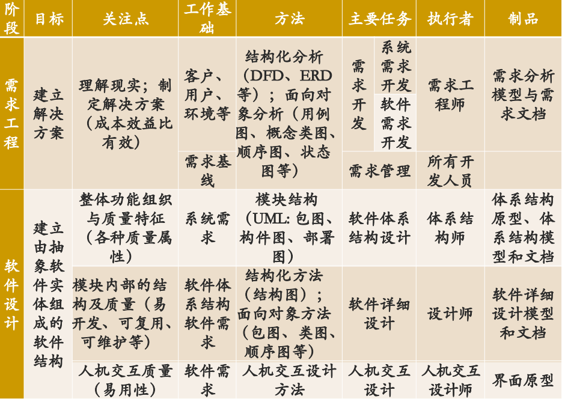
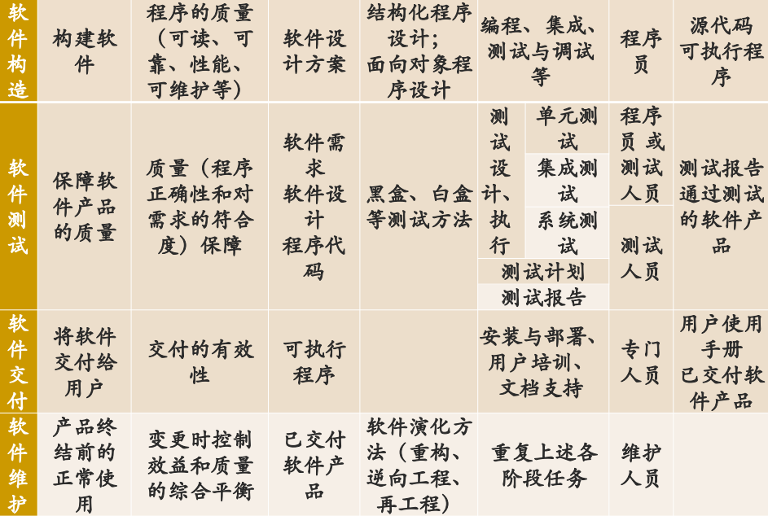
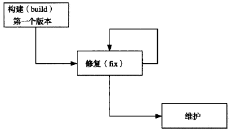
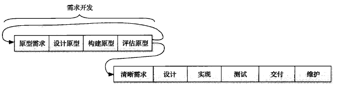

# 第22章 软件开发过程模型

## 22.1 软件开发的典型阶段

## 22.2 软件生命周期模型

人们将软件从**生产到报废**的生命周期分割为不同阶段，每段阶段有明确的典型输入/输出、主要活动和执行人，各个阶段形成明确、连续的顺次过程，这些阶段划分就被称为软件生命周期模型。

## 22.3 软件过程模型

软件过程模型在生命周期模型的基础则进一步详细说明各个阶段的任务、活动、对象及其组织、控制过程

### 22.3.1 构建－修复模型

1. 背景与动机：最早也是最自然产生的软件开发模型。对软件开发活动没有任何规划和组织，完全依靠开发人员个人能力进行软件开发
2. 缺点：
   - 没有对开发工作进行规范和组织
   - 没有分析需求的真实性
   - 没有考虑软件结构的质量
   - 没有考虑测试和程序的可维护性
3. 适用性：软件规模很小的软件

### 22.3.2 瀑布模型

1. 背景与动机：按照软件生命周期模型将软件开发活动组织为需求开发、软件设计、软件实现、软件测试、软件交付和软件维护等活动，并且规定了它们自上而下、相互邻接的次序
2. 优点：为软件开发活动定义了清晰的阶段划分（包括了输入/输出、主要工作及其关注点），这让开发者能够以关注点分离的方式更好地进行那些复杂度超越个人能力的软件项目的开发活动
3. 缺点：
   - 对文档的过高的期望具有局限性
   - 对开发活动的线性顺序假设具有局限性
   2. 客户、用户的参与具有局限性：成功的项目开发需要客户、用户从始至终的参与，而不仅仅是一个阶段。
   3. 里程碑粒度具有局限性：里程碑粒度过粗，基本丧失了“早发现缺陷早修复”这一思想
4. 适用性：比较成熟，没有技术难点的软件

### 23.3.3 增量迭代模型（需求驱动）

1. 背景与动机：迭代式、渐进交付和并行开发共同促使了增量迭代模型的产生和普及
2. 描述：在项目开始时，通过系统需求开发和核心体系结构设计活动完成项目对前景和范围的界定，然后再将后续开发活动组织为多个迭代、并行的瀑布式开发模型。需求驱动。少量的不确定性和影响不大的需求变更通过迭代的方式加以解决 
3. 优点：
   - 迭代式开发更加符合软件开发的实践情况，具有更好的适用性
   2. 并行开发可以帮助缩短软件产品的开发时间
   3. 渐进交付可以加强用户反馈，降低开发风险

4. 缺点：
   - 由于各个构件是逐渐并入已有的软件体系结构中的，所以加入构件必须不破坏已构造好的系统部分，这需要软件具备开放式的体系结构。
   2. 增量交付模型需要一个完备、清晰的项目前景和范围以进行并发开发规划，但是在一些不稳定的领域，不确定性太多或者需求变化非常频繁，很难在项目开始就确定前景和范围。
5. 适用性：适用于大规模软件系统的开发

### 23.3.4 演化模型

1. 描述：将软件开发活动组织为多个迭代、并行的瀑布式开发活动。演化模型能够更好地应对需求变更，更适用于需求变更比较频繁或不确定性较多的领域。

2. 优点：
   - **使用了迭代式开发，具有更好的适用性**，尤其是其演化式迭代安排能够适用于那些需求变更比较频繁或不确定性较多的软件系统的开发
   - 并行开发可以帮助**缩短**软件产品的开发时间
   - 渐进交付可以**加强用户反馈**，降低开发风险
3. 缺点：

   - 无法在项目早期阶段建立项目范围，所以项目的整体计划、进度调度、尤其是商务协商事宜无法准确把握
   - 后续迭代的开发活动是在前导迭代基础上进行修改和扩展的，这容易让后续迭代忽略设分析与设计工作，蜕变为构建-修复方式。
4. 适用性：不稳定领域的大规模软件系统开发

### 23.3.5 原型模型

1. 背景与动机：原型模型将需求开发活动展开为抛弃式原型开发活动和演化式原型开发活动。原型模型在整体安排迭代的情况下，强调“**抛弃式原型**”的演化模型。抛弃式原型解决对未来知识的局限性产生的**不确定性**，将未来置于现在进行推敲。
   - 演化式原型：在迭代中构建，是系统的核心，并不断扩充，最终成为真正的软件产品
   - 抛弃式原型：通过模拟“未来”的产品，将“未来”的知识置于“现在” 进行推敲，解决不确定性。
2. 优点：
   - 对原型方法的使用加强了与客户、用户的交流，可以让最终产品取得更好的满意度
   2. 适用于非常新颖的领域
3. 缺点
   - 原型方法能够解决风险，但是自身也能带来新的风险，例如原型开发的成本较高，可能会耗尽项目的费用和时间
   - 实践中，很多项目负责人不舍得抛弃“抛弃式原型”，使得质量较差的代码进入了最终产品，导致了最终产品的低质量
4. 适用性：有大量不确定的新颖领域进行开发活动组织

### 23.3.6 螺旋模型

1. 背景与动机：尽早解决比较高的风险，如果有些问题实在无法解决，那么早发现比项目结束时再发现要好，至少损失要小得多。迭代与瀑布的结合

2. 螺旋模型是风险驱动的，完全按照风险解决的方式组织软件开发活动。
   - 确定目标、解决方案和约束
   - 评估方案，发现风险
   - 寻找风险解决方法
   - 落实风险解决方案
   - 计划下一个迭代

3. 自内向外，螺旋模型有4次风险解决迭代，分别解决了几个高风险的阶段的问题
   - 解决系统需求开发中的风险，尤其是产品概念设计风险，得到一个确定的产品前景和范围
   - 解决软件需求开发中的风险，得到清晰的软件需求
   - 解决软件体系结构设计中的技术风险，构建高质量的核心体系结构原型
   - 解决详细设计和实现中的关键技术风险，建立一个可实现的高质量软件结构。

4. 优点：可以降低风险，减少项目因风险造成的损失

5. 缺点：
   - 风险解决需要使用原型手段，也就会存在原型自身带来的风险，这一点与原型模型相同
   - 模型过于复杂，不利于管理者依据其组织软件开发活动

5. 适用性：高风险的大规模软件系统开发

### 23.3.7 Rational 统一过程（RUP模型）

1. 背景与动机：总结和借鉴传统上的各种有效经验，建立最佳实践方法的集合，并提供有效的过程定制手段，允许开发者根据特定的需要定制一个有效的过程模型
2. 核心实践方法：
   - 迭代式开发
   2. 管理需求，重视需求工程中除了需求开发之外的需求管理活动
   3. 使用基于组件的体系结构，它帮助建立一个可维护、易开发、易复用的软件体系结构
   4. 可视化建模，利用UML进行建模
   5. 验证软件质量，尽早和持续地开展验证，以尽早发现缺陷，降低风险和成本
   6. 控制软件变更，适应1990s以后需求变更越来越重要的事实

3. RUP 裁剪
   - 确定本项目需要哪些工作流
   - 确定每个工作流需要哪些制品
   - 确定 4 个阶段之间如何演进，决定每个阶段要哪些工作流，每个工作流执行到什么程度，制品有哪些
   - 确定每个阶段内的迭代计划
   - 规划工作流的组织

4. 优点：

   - 吸收和借鉴了传统上的最佳实践方法，尤其是其核心的6个实践方法，能够保证软件开发过程的组织是基本有效和合理的
   - RUP依据其定制机制的不同，可以适用于小型项目，也可以适用于大型项目的开发，适用面广泛
   - RUP有一套软件工程工具的支持，这可以帮助RUP的有效实施
5. 缺点：
   - 没有考虑交付之后的软件维护问题
   - 裁剪和配置工作不是一个简单的任务，无法保证每个项目都能定制一个有效的RUP过程。
6. 适用：RUP是重量级过程，能够胜任大型软件团队开发大型项目时的活动组织。但RUP经过裁剪和定制，也可以变为轻量级过程，也能够胜任小团队的开发活动组织。

### 23.3.8 敏捷过程

1. 敏捷原则
2. 极限编程（XP）
3. 特点
4. 适用性：快速变化或者时间压力较大的项目