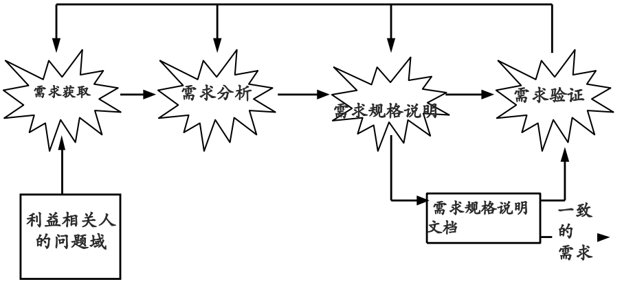

[TOC]

# 第五章 软件需求基础

## 5.1 引言

1、需求分析几点说明

2、软件需求分析实现以下几个目标：
（1）软件系统的数据流程图与数据结构，系统逻辑模型
（2）详细的功能说明确定设计限定条件，性能要求
（3）密切与用户的联系，使用户明确自己的任务

3、软件需求分析包括的工作：
（1）问题的认识：与用户联系，确定总策略
（2）评价与综合：评价数据流程和数据结构的优缺点、修改
（3）建立需求说明书：软件需求说明书包含软件功能、性能、接口、有效性 和逻辑模型的描述
（4）复审

4、软件需求分析人员应该具备的特征

## 5.2 需求工程的内容

**软件建立的依据**：单纯的软件系统是不能解决问题的，它只有和现实世界之间形成有效互动才能实现问题的解决

### 5.2.1 需求工程简介

**需求工程**：所有需求处理活动的总和。它收集信息、分析问题、整合观点、记录需求并验证其正确性，最终描述出软件被应用后与其环境互动形成的期望效应。

三个**主要任务**：

- 需求工程必须说明软件系统将被应用的应用环境及其目标，说明用来达成这些目标的软件功能，也即要同时说明软件需要“做什么”和“为什么”需要做。
- 需求工程必须将目标和功能反映到软件系统当中，映射为可行的软件行为，并对软件行为进行准确的规格说明。
- 现实世界是不断变化的世界，因此需求工程还需要妥善处理目标和功能随着时间演化的变动情况。

### 5.2.2 需求工程活动

需求要逐步进行验证，越早发现bug所付出的代价越少。
需求工程活动包括需求开发和需求管理两部分。

**需求开发过程模型**

### 5.2.3 需求获取

需求获取：从人、文档或者环境当中获取需求的过程，要利用各种方法和技术来“发现”需求

1、目标分析：根据问题确定目标；通过分析利害关系人确定目标

2、用户需求获取：面谈、集体获取方法、头脑风暴、原型

需求获取的常见困难：
（1）用户和开发人员的背景不同，立场不同——消除默认知识
（2）普通用户缺乏概括性、综合性的表述能力——专业的需求人员
（3）用户存在认知困境——原型
（4）用户越俎代庖——协商
（5）缺乏用户参与——为用户参与提供方便

### 5.2.4 需求分析

1、边界分析：定义项目的范围，系统边界的定义要保证系统能够和周围环境形成有效的互动

2、需求建模：系统用例图通常被用来定义系统的边界，建模是为展现和解释信息而进行的抽象描述活动，常用的技术包括类图、顺序图、状态图等建模技术

### 5.2.5 需求规格说明

在系统用户之间交流需求信息；要简洁、精确、一致和易于理解

1、定制文档模版
2、编写文档

### 5.2.6 需求验证

需求规格说明文档至少要满足下面几个标准：
（1）文档内每条需求都正确、准确的反映了用户的意图
（2）文档记录的需求集在整体上具有完整性和一致性
（3）文档的组织方式和需求的书写方式具有可读性和可修改性

验证的方法：同级评审、原型、模拟

### 5.2.7 需求管理

保证需求作用的持续、稳定和有效发挥：在需求开发活动之后，设计、测试、实现等后续的软件系统开发活动都需要以围绕需求开展工作
进行变更控制：纳入和实现合理的变更请求，拒绝不合理的变更请求，控制变更的成本和影响范围

## 5.3 需求基础

### 5.3.1 需求

需求的定义：
（1）用户为了解决问题或达到某些目标所需要的条件或能力
（2）系统或系统部件为了满足合同、标准、规范或其它正式文档所规定的要求而需要具备的条件或能力
（3）对1或2中的一个条件或一种能力的一种文档化表述

### 5.3.2 需求的层次性

期望：发生在多个抽象层次上。针对整个组织或业务 / 针对具体任务 / 针对用户与系统一次交互

1、业务需求

系统建立的战略出发点，表现为高层次的目标（Objective），它描述了组织为什么要开发系统
为了满足用户的业务需求，需求工程师需要描述系统高层次的解决方案，定义系统应该具备的特性（Feature）
参与各方必须要对高层次的解决方案达成一致，以建立一个共同的前景（Vision）
特性说明了系统为用户提供的各项功能，它限定了系统的范围（Scope）

2、用户需求

执行实际工作的用户对系统所能完成的具体任务的期望，描述了系统能够帮助用户做些什么

- 直接用户
- 间接用户

对所有的用户需求，都应该有充分的问题域知识作为背景支持特性

- 模糊、不清晰
- 多特性混杂
- 多逻辑混杂

补充问题域知识： 对所有的用户需求，都应该有充分的问题域知识作为背景支持

3、系统级需求

用户对系统行为的期望，每个系统级需求反映了一次外界与系统的交互行为，或者系统的一个实现细节描述了开发人员需要实现什么

将用户需求转化为系统需求的过程是一个复杂的过程

- 首先需要分析问题领域及其特性，从中发现问题域和计算机系统的共享知识，建立系统的知识模型；
- 然后将用户需求部署到系统模型当中，即定义系列的系统行为，让它们联合起来实现用户需求，每一个系统行为即为一个系统需求。
- 该过程就是需求工程当中最为重要的需求分析活动，又称
  建模与分析活动。

从功能需求的层次性看需求开发

### 5.3.3 结合层次性的需求开发

### 5.3.4 区分需求、问题域与规格说明

需求：是一种期望，源自现实又高于现实，需求是多变和可调整的，项目可以依据实际情况调整需求的实现程度。

问题域：现实世界运行规律的一种反映；需求的产生地，也是需求的解决地。最终的软件产品要在现实中部署，它能够部分影响问题域，但不能任意改变现实。软件开发必须尊重问题域，不能因为技术原因妄自修改现实世界的实际情况。

规格说明：软件产品的方案描述，它以软件产品的运行机制为主要内容。它不是需求但实现需求，不是问题域但需要与问题域互动。规格说明要以关注对外交互的方式描述软件解决方案，它既需要从软件产品的角度而不是用户的角度进行描述，又不能太多地涉及软件产品的内部构造机制。

## 5.4 需求分类

### 5.4.1 需求谱系

### 5.4.2 软件需求的分类

1、功能需求：和系统主要工作相关的需求，即在不考虑物理约束的情况下，用户希望系统所能够执行的活动，这些活动可以帮助用户完成任务。功能需求主要表现为系统和环境之间的行为交互。

2、性能需求：系统整体或系统组成部分应该拥有的性能特征，例如CPU使用率、内存使用率等。

- 速度：系统完成任务的时间
- 容量：系统所能存储的数据量
- 吞吐量：系统在连续的时间内完成的事务数量
- 负载：系统可以承载的并发工作量
- 实时性：严格的实时要求。

3、质量属性：系统完成工作的质量，即系统需要在一个“好的程度”上实现功能需求，例如可靠性程度、可维护性程度等。

- 可靠性：在规格时间间隔内和规定条件下，系统或部件执行所要求能力的能力
- 可用性：软件系统在投入使用时可操作和可访问的程度或能实现其指定系统功能的概率
- 安全性：软件阻止对其程序和数据进行未授权访问的能力，未授权的访问可能是有意，也可能是无意的。
- 可维护性：软件系统或部件能修改以排除故障、改进性能或其他属性或适应变更了的环境的容易程度
- 可移植性(Portability)：系统或部件能从一种硬件或软件环境转换至另外一种环境的特性。
- 易用性(Usability)：与用户使用软件所花费的努力及其对使用的评价相关的特性。

4、对外接口：系统和环境中其他系统之间需要建立的接口，包括硬件接口、软件接口、数据库接口等等。

5、约束：进行系统构造时需要遵守的约束，例如编程语言、硬件设施等

6、数据需求：功能需求的补充。数据需求是需要在数据库、文件或者其他介质中存储的数据描述
