# 软件工程与计算2期末

[TOC]

# 传统软件工程方法

## 1 需求分析

### 1.1 需求工程基础

#### 1.1.1 需求的层次性

- 期望：发生在多个抽象层次上。针对整个组织或业务 / 针对具体任务 / 针对用户与系统一次交互

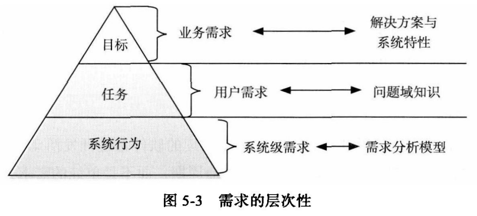

1. **业务需求**——来自现实
   - 系统建立的战略出发点，表现为高层次的目标（Objective），它描述了组织为什么要开发系统
   - 为了满足用户的业务需求，需求工程师需要描述系统高层次的解决方案，定义系统应该具备的特性（Feature）
   - 参与各方必须要对高层次的解决方案达成一致，以建立一个共同的前景（Vision）
   - 特性说明了系统为用户提供的各项功能，它限定了系统的范围（Scope）

2. **用户需求**——来自现实

   - 执行实际工作的用户对系统所能完成的具体任务的期望，描述了系统能够帮助用户做些什么

     - 直接用户

     - 间接用户

   - 对所有的用户需求，都应该有充分的问题域知识作为背景支持特性

   - 特点：

     - 模糊、不清晰

     - 多特性混杂

     - 多逻辑混杂

3. **系统级需求**——来自软件

   - 用户对系统行为的期望，每个系统级需求反映了一次外界与系统的交互行为，或者系统的一个实现细节描述了开发人员需要实现什么

   - 将用户需求转化为系统需求的过程是一个复杂的过程

     - 首先需要分析问题领域及其特性，从中发现问题域和计算机系统的共享知识，建立系统的知识模型；

     - 然后将用户需求部署到系统模型当中，即定义系列的系统行为，让它们联合起来实现用户需求，每一个系统行为即为一个系统需求。

     - 该过程就是需求工程当中最为重要的需求分析活动，又称建模与分析活动。

- 从功能需求的层次性看需求开发

#### 1.1.2 需求、问题域和规格说明

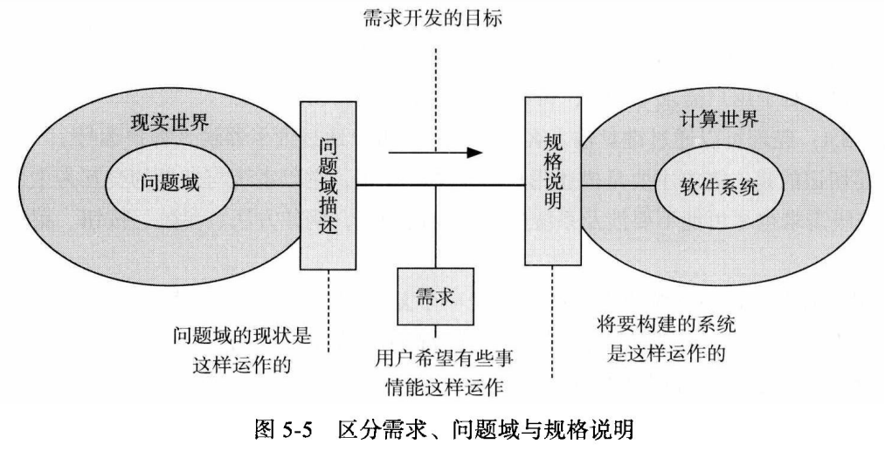

- **需求**：是一种期望，源自现实又高于现实，需求是多变和可调整的，项目可以依据实际情况调整需求的实现程度。

- **问题域**：现实世界运行规律的一种反映；需求的产生地，也是需求的解决地。最终的软件产品要在现实中部署，它能够部分影响问题域，但不能任意改变现实。软件开发必须尊重问题域，不能因为技术原因妄自修改现实世界的实际情况。

- **规格说明**：软件产品的方案描述，它以软件产品的运行机制为主要内容。它不是需求但实现需求，不是问题域但需要与问题域互动。规格说明要以关注对外交互的方式描述软件解决方案，它既需要从软件产品的角度而不是用户的角度进行描述，又不能太多地涉及软件产品的内部构造机制。

#### 1.1.3 需求谱系与分类

1. 需求谱系如下：

   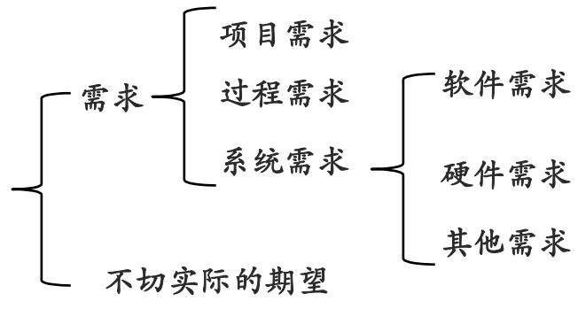

   - 项目需求：成本、时间等
   - 过程需求：分工合作、方法、工具等
   - 系统需求

   - 不切实际的期望

2. 软件需求的分类

   1. **功能需求**：和系统主要工作相关的需求，即在不考虑物理约束的情况下，用户希望系统所能够执行的活动，这些活动可以帮助用户完成任务。功能需求主要表现为系统和环境之间的行为交互。

   2. **性能需求**：系统整体或系统组成部分应该拥有的性能特征，例如CPU使用率、内存使用率等。

      - 速度：系统完成任务的时间

      - 容量：系统所能存储的数据量

      - 吞吐量：系统在连续的时间内完成的事务数量

      - 负载：系统可以承载的并发工作量

      - 实时性：严格的实时要求。

   3. **质量属性**：系统完成工作的质量，即系统需要在一个“好的程度”上实现功能需求，例如可靠性程度、可维护性程度等。

      - 可靠性：在规格时间间隔内和规定条件下，系统或部件执行所要求能力的能力

      - 可用性：软件系统在投入使用时可操作和可访问的程度或能实现其指定系统功能的概率

      - 安全性：软件阻止对其程序和数据进行未授权访问的能力，未授权的访问可能是有意，也可能是无意的。

      - 可维护性：软件系统或部件能修改以排除故障、改进性能或其他属性或适应变更了的环境的容易程度

      - 可移植性（Portability）：系统或部件能从一种硬件或软件环境转换至另外一种环境的特性。

      - 易用性（Usability）：与用户使用软件所花费的努力及其对使用的评价相关的特性。

   4. **对外接口**：系统和环境中其他系统之间需要建立的接口，包括硬件接口、软件接口、数据库接口等等。

   5. **约束**：进行系统构造时需要遵守的约束，例如编程语言、硬件设施等

   6. **数据需求**：功能需求的补充。数据需求是需要在数据库、文件或者其他介质中存储的数据描述

示例：

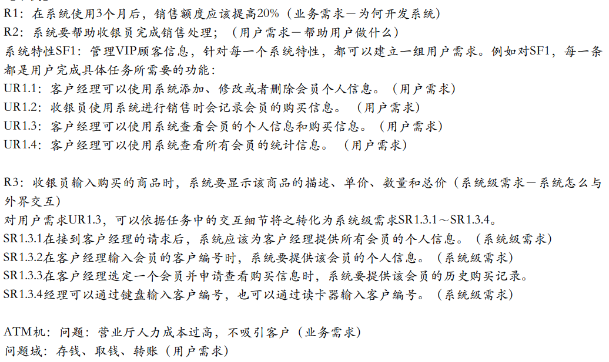

### 1.2 需求分析的目标与任务

需求分析的任务：
（1）建立分析模型，达成开发者和用户对需求信息的共同理解
（2）依据共同的理解，发挥 创造性，创建软件系统解决方案

### 1.3 结构化分析方法（SA）

- SA 方法采用“抽象”和“分解”两个基本手段， 用抽象模型的概念，按照软件内部数据传递、变 换关系，由顶向下逐层分解，直到找到满足功能 需要的所有可实现的软件元素为止。

- SA 方法采用“分解”的方式来理解一个复杂系统， “分解”需要有描述手段，数据流程图就是作为 描述信息流程和分解的手段而引入的。

- 结构化分析思想

  - 自顶向下分解
  - 各种图（三种不容类型的图，都实现结构化思想）
    - 数据流图
    - 实体关系图

- 结构化分析的简单过程

  

#### 1.3.1 数据流图（DFD）

（1）数据流图将系统看做是过程的集合，其中一些由人来执行，另一些由软件系统来执行
（2）过程的执行就是对数据的处理：它接收输入，进行数据转换，输出结果
（3）数据流图主要是展示了数据在通过系统如何进行了变化
（4）可能需要和软件系统外的实体尤其是人进行交互
（5）数据的变化包括：被转换、被存储、被分布

表示法：

| DeMarco-Yourdon                                              | Gane-Sarson                                                  |
| ------------------------------------------------------------ | ------------------------------------------------------------ |
|  |  |

1、基本元素：

- 外部实体
  - 数据的产生或者消耗者
  - 数据必须是从一个地方来到另一个地方去
  - 外部实体是待构建软件系统之外的人、组织、设备或者其他软件系统，它们不受系统控制，开发者不能以任何方式操纵它们。
- 过程
  - 施加于数据的动作或者行为，它使得数据发生变化，包括被转换、被存储或者被分布
  - 将数据从输入转换到输出
- 数据流：数据的运动，它是系统与其环境之间或者系统内两个过程之间的通信形式
- 数据存储：软件系统需要在内部收集、保存，以供日后使用的数据集合

2、语法规则

（1）过程是对数据的处理，必须有输入，也必须有输出，输入数据集应该和输出数据集存在差异
（2）数据流是必须和过程产生关联的，它要么是过程的数据输入，要么是过程的数据输出
（3）所有的对象都应该有一个可以唯一标示自己的名称

3、分层结构

- 上下文图

  - 系统功能的最高抽象。上下文图仅存在一个过程，表示整个系统
  - 适合于描述系统的应用环境、定义系统的边界

- 0层图

  - 0层图通常被用作整个系统的功能概图。

    - 为了概述整个系统的功能，建立0层图时需要分析需求获取的信息，归纳出系统的主要功能
    - 将系统的主要功能描述为几个比较高层的抽象过程，并在0层图中加以标书
    - 有部分重要的数据存储会在0层图中得到表述

- N层图

  - 父过程：被分解的过程

  2. 子图：分解后产生的揭示更多细节的图

  3. 原始DFD图：所有过程无法再次分解的图。

  4. 子图的接口流：父过程的输入输出，往往从空白的区域引出。

  5. 子图中过程的编号需要用父过程中的编号作为前缀。

  6. 注意：低于0层图的子图上通常不显示外部实体

- 过程分解的平衡原则

#### 1.3.2 实体关系图（ERD）

![image-20240612224306798]（./期末复习/image-20240612224306798.png）

1. 独立于处理检查数据对象
2. 关注数据域（数据说明）
3. 指示数据对象如何相互关联
4. 能够弥补**过程建模在数据说明方面的缺陷**，是描述数据的定义、结构和关系等特性的技术。

1、实体关系图的组成元素

>实体是需要在系统中收集和存储的现实世界事物的类别描述。

1. 实体并不是孤立存在的，相互交互相互影响
2. 参与关系的每个实体都针对关系拥有最大基数和最小基数
3. 最大基数：对关系中任意的其他实体实例，该实体可能参与关系的最大数量。最大基数为1，表示为One，否则为Many
4. 最小基数：对关系中任意的其他实体实例，该实体可能参与关系的最小数量。实体在关系中的最小基数被标记为Optional，最小基数为1时，实体在关系中的最小基数被标记为mandatory

2、Data Objects and Attributes 属性

1. 数据对象包含一组作为对象的方面、质量、特征或描述符的属性
2. 属性可以对尸体进行描述的特征。

3、Relationship 关系

1. 连通性
   + 系统必须记住的事实，不能或不能计算或推导出来
   + 关系的几个实例可以存在
   + 实体可以以多种方式关联

4、建立实体关系图的步骤

1. 第1级-对所有数据对象（实体）及其相互之间的“连接”建模
2. 第2级-对所有实体和关系建模
3. 第3级-对所有实体、关系和属性建模，以提供进一步的深度

键（Key）：实体的⼀个或者多个属性能够唯⼀确定和标示每个实例，这些属性或者属性 组合就被称为实体的标示符，或者键（Key）

### 1.4 信息结构表示方法

#### 1.4.1 分层框图

（1）把信息用多层方框按照树形结构组织起来。
（2）在结构的顶层，用一个方框代表整个结构。
（3）下面各层由表示不同信息类别的方框组成，它们可以看成是上一层方框的子集。
（4）在该图的最低一层，每个框包含单独的数据实体

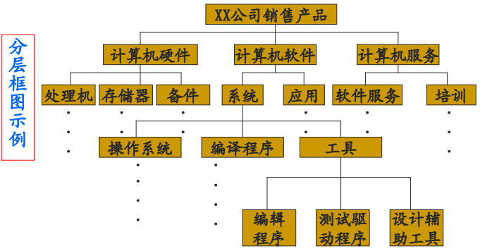

#### 1.4.2 Warnier 图

把信息表示成一种树形数据结构。可以规定某些信息种类或信息量是重复性的，也可以说明在某一种类中信息是有条件出现的

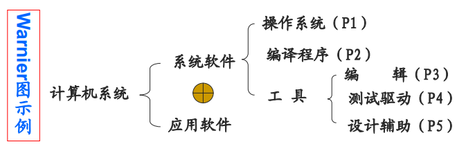

## 2 软件设计 - 软件设计基础

### 2.1 软件设计分层

1. 一种是分为软件体系结构设计和软件详细设计
2. 另一种是分为高层设计、中层设计和低层设计
   - 高层设计：基于反映软件高层抽象的构件设计，描述系统的高层结构、关注点和设计决策
     - 部件：承载了系统主要的计算与状态，包括处理与数据
     2. 连接件：承载部件之间的交互，是连接的抽象表示
     3. 部件与连接件都是抽象的类型定义（就像类定义），它们的实例（就像类的对象实例）组织构成软件系统的整体结构，配置将它们的实例连接起来
     4. 连接件是一个与部件平等的单位

     4. 配置：定义了部件和连接件之间的关联⽅式，将它们组织称系统的总体结构

     5. 敏捷视点
   - 中层设计：更加关注组成构件的模块的设计、导入/导出、过程之间调用关系或者类之间的写作
     - 模块划分隐藏一些程序片段（数据结构+算法）的细节，暴露接口于外界
     - 模块化的目标：完全独立性

     - 模块化的问题与困难
     - 中层设计总结— — 设计目标：模块化；信息隐藏；OO原则

     - 中低层设计的问题：
       - 过于依赖细节：连接与依赖，接口与实现
       - 忽略的关键因素:
         - 无法有效抽象部件的整体特性
         - 总体结构质量属性
   - 低层设计：深入模块和类的内部，关注具体的数据结构、算法、类型、语句和控制结构等
     - 基本的语言单位（类型与语句），组织起来，建立高质量的数据结构+算法
     - 常见设计场景：数组的使用，链表的使用，内存的使用，遍历算法，递归算法
     - 经典场景：堆栈，队列，树，排序算法，查找算法 ...
     - 数据结构与算法审美：
       - 简洁、结构清晰，坚固（可靠、⾼效、易读）
       - 数据结构与算法课程

     - 低层设计的本质：屏蔽程序中复杂数据结构与算法的实现细节

     - 代码设计：对一个方法/函数的内部代码进行设计

     - 模块划分：将系统分成简单片段；名字和使用方法称为模块的抽象与接口；模块内部的程序片段为精化与实现

### 2.2 设计过程的主要活动

1. 分析设计出发点：了解系统的主要性功能需求和非功能性需求、了解整个项目的环境、人员等限制条件

2. 建立候选方案

3. 生成最终方案

建立多种候选设计方案，经过决策形成设计原型和文档作为最终方案

4. 评价：检查软件设计是否满足需求和约束

### 2.3 设计方法与模型

1. **方法**：

   - 结构化设计：采取自下向上和逐步求精的思想，按照功能对系统进行分解
   - 面向对象设计：源自于数据抽象和职责驱动，利用封装、继承、多态等方法，提高软件的可扩展性和可复用性
   - 以数据为中心设计：开始于系统操纵的数据结构而不是它所表现的功能
   - 基于构件的设计：重点在于构件的提供、开发和继承，以提高系统的可复用性
   - 形式化方法设计：通过数学方法来对复杂系统进行建模

2. **模型**：

   - 静态模型：通过**快照**的方式对**系统中时间不变的属性**进行描述。通常描述的是状态，而不是行为
   - 动态模型：描述**系统行为和状态转移**

   1. 在结构化设计中
      - 静态模型：实体关系图
      - 动态模型：数据流图和结构图（Structure Chart）
   2. 在面向对象设计中
      - 静态模型：类图、对象图、构件图、部署图
      - 动态模型：交互图（顺序图和通信图）、状态图、活动图

### 2.4 软件设计描述

软件设计描述相关的重要概念及其关系：

- 软件设计描述是由一个或多个设计视图（design view）组成的
- 每一个设计视图都是从一个设计视角（design viewpoint）出发的
- 设计视角必须符合在需求（requirement）中反映出来的涉众（stakeholder）的设计关注点（design concern）
- 每一个设计视图都是用设计语言中的设计元素（design element）来描述的
- 所有的设计元素组成了设计语言（design language）
- 每一个设计元素是由设计实体（design entity）、设计属性（design attribute）、设计关系（design relationship）和设计限制条件（design constraint）组成的
- 软件设计图（diagram）就是由设计语言和一些设计附加信息（design overlay）组成的
- 每一个设计视图，都应该有具体的设计理由

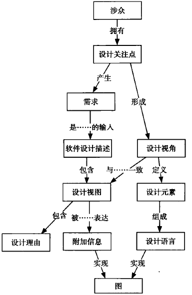

#### 2.4.1 设计视图和设计图

逻辑设计视角的设计视图、组合设计视角的设计视图、信息视角的设计视图、接口视角的设计视图、结构视角的设计视图和依赖视角的设计视图等

#### 2.4.2 设计视角和设计关注

## 3 概要设计

### 3.1 软件概要设计的目标与基本任务

1. 软件设计是把软件需求变为软件的具体方案
2. 软件设计包括两个阶段：概要设计和详细设计
3. 概要设计根据软件需求所确定的信息流程或信息结构，导出软件的总体表示——软件结构或程序过程

### 3.2 软件设计方法

- 结构化程序设计：结构化程序设计的基础建立在三种能够构成结构化程序的逻辑构造（顺序，选择，重复）上

- 面向数据的设计方法

  - 面向数据流的设计

    - 面向数据流的设计方法把信息流映射成软件结构

    - 信息流的类型决定了映射的方法

    - 信息流有两种类型：变换流、事务流

      - 变换流：信息沿输入通路进入系统，同时由外部形式变换成内部形式。进入系统的信息通过变换中心，经过加工处理以后再沿着输出通路变换成外部形式离开系统
      - 事务流：数据沿着接收通路把外部世界的信息转换成一个事务项，然后，计算该事务项的值，根据它的值激励起多条活动通路中的一条数据流。发出多条通路的信息流中枢被称为“事务中心”

    - 变换型分析：

      1. 复查基本系统模型

      2. 复查并精化数据流图

      3. 确定数据流图具有变换特性还是事务特性

      4. 确定输入流和输出流的边界，从而孤立出变换中心

      5. 完成“第一级分解”

         

      6.  完成“第二级分解”

         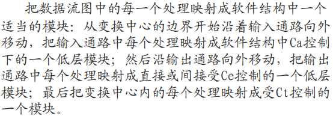

      7. 使用设计度量和启发式规则对得到的软件结构进一步精化

    - 事务型分析

      1. 复查基本系统模型
      2. 复查并精化数据流图
      3. 确定数据流图具有变换特性还是事务特性
      4. 确定事务中心和每个活动通路的流程特征
      5. 把数据流图映射成一个适合于事务处理的软件结构
      6. 对事务中心的结构和每个活动通路的结构进行分解、合并和改进
      7. 使用设计度量和启发式规则对得到的软件结构进一步精化

  - 面向数据结构的设计：用信息结构导出程序过程

    1. 分析数据结构的特性
    2. 用一些基本类型来描述数据
    3. 把数据结构表示映射成软件的控制层次
    4. 利用一组规则改进软件的层次结构
    5. 最后得到软件的过程性描述

  - Jackson 方法和 Jackson 图

    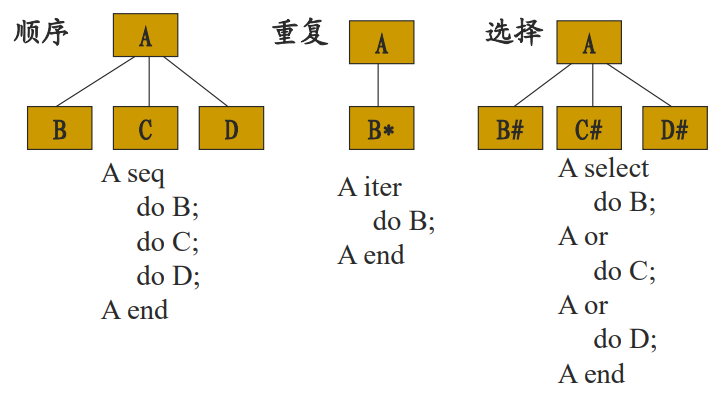

### 3.3 软件设计的基本原理

1. **模块**：过程、函数、子程序、宏、modula等

2. **模块化**：软件被划分成独立命名和可独立访问的被称作模块的构件，每个模块完成一个子功能

   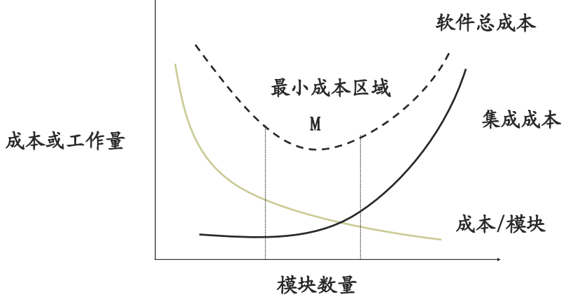

3. 实现模块化的手段
   - **抽象**：
   - **信息隐蔽**：一个模块内包含的信息（过程和数据）对于不需要这些信息的模块来说，是不可访问的
   - 抽象就是接口，隐藏就是实现上的设计决策
   - 每个模块都承担一定的责任，对外是契约，契约之下隐藏设计决策和决策细节

4. **模块独立性**
   - 开发具有独立功能而且和其它模块之间没有过多的相互作用的模块
   - 意义：功能分割，简化接口，易于多人合作开发同一软件、独立的模块易于测试和维护

5. 模块独立程度的衡量标准

   - 耦合性：对一个软件结构内不同模块间互连程度的度量

     - 无任何连接
     - 数据耦合
     - 控制耦合
     - 公共环境耦合
     - 内容耦合

     

   - 内聚性：标志一个模块内各个处理元素彼此结合的紧密程度，理想的内聚模块只做一件事情

     

   - 高内聚、低耦合

6. 模块独立性原则对指导设计的意义？

### 3.4 软件结构优化准则

1. **软件结构**：指出了由需求分析隐含地确定的某一问题的软件解法的各个元素（称之为模块）之间的相互控制关系
2. 软件结构的度量和术语
   - 深度：表示控制的层数
   - 宽度：表示控制（同一层次）总跨度
   - 扇出数：指由一模块直接控制的其他模块的数目
   - 扇入数：指有多少个模块直接控制一个给定的模块
   - 上级模块
   - 下级模块

3. **模块的影响范围**：该模块中一个判断所影响的所有其它模块

4. **模块的控制范围**：该模块本身以及所有直接或间接从属于它的模块

5. **软件结构设计的优化准则**？

   - 改进软件结构，提高模块独立性

   - 模块规模应该适中
   - 大模块分解不充分；小模块使用开销大，接口复杂
   - 尽量减少高扇出结构的数目，随着深度的增加争取更多的扇入
   - 扇出过大意味着模块过分复杂，需要控制和协调过多的下级模块。一般来说，顶层扇出高，中间扇出少，低层高扇入
   - 模块的作用范围保持在该模块的控制范围内
   - 力争降低模块接口的复杂程度
   - 设计单入口单出口的模块
   - 模块的功能应该可以预测

## 4 详细设计

### 4.1 详细设计的目标基本任务

使用结构化构造（即用顺序、选择和重复三种程序结构）表示程序过程，降低程序的复杂性，从而提高可靠性、易测试性和易维护性。

### 4.2 图形设计工具，会画

#### 4.2.1 流程图

方框表示处理步；菱形表示逻辑判断；箭头表示控制流

#### 4.2.2 方块图（N-S 图）

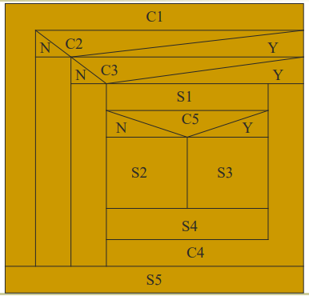

#### 4.2.3 PAD 图

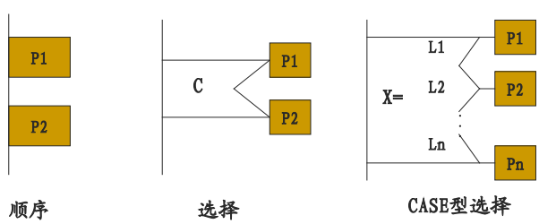

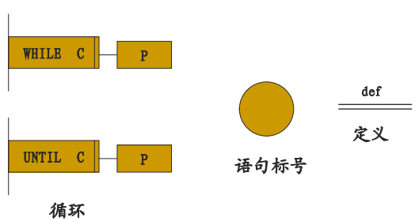

## 5 代码设计

### 5.1 设计可靠代码

#### 5.1.1 契约式设计（断言式设计）

基本思想：如果一个函数或方法，在前置条件满足的情况下开始执行，完成后能够满足后置条件，那么这个函数或方法就是正确、可靠的

两种常见的编程方式：异常与断言

1. **异常**方式：在代码开始执行时，检查前置条件是否满足，如果不满足就抛出异常。在代码执行完之后，再检查后置条件是否满足，不满足也抛出异常。
2. **断言**方式：`assert Expression1( : Expression2) `
   - Expression1 是一个布尔表达式，在契约式设计中可以将其设置为前置条件或者后置条件
   - Expression2 是一个值，各种常见类型都可以
   - 如果 Expression1 为 true，断言不影响程序执行
     如果 Expression1 为 false，断言抛出 AssertionError 异常，如果存在 Expression2 就使用它作为参数构造 AssertionError
3. 比较

#### 5.1.2 防御式编程

基本思想：在一个方法与其他方法、操作系统、硬件等外界环境交互时，不能确保外界都是正确的，所以要在外界发生错误时，保护方法内部不受损害。

1. 防御式编程往往会带来比较冗余和复杂的代码，但是会**有效地提高程序的抗干扰能力和回复能力**，有利于人机交互。
2. 和契约式没有本质的区别，编程⽅式：异常与断⾔，关注点不同
   1. 契约式偏向于避免问题
   2. 防御式偏向于问题发生后进行保护

### 5.2 模型辅助设计复杂代码

代码设计常用的模型手段包括：决策表（decision table）、伪代码和程序流程图（program flow chart）

#### 5.2.1 决策表

一种决策逻辑的表示方法，用于描述复杂决策逻辑

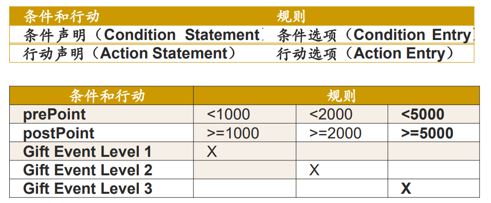

条件声明是进行决策时需要参考的变量列表。条件选项是那些变量可能的取值。动作声明是决策后可能采取的动作。动作选项表明那些动作会在怎样的条件下发生。

#### 5.2.2 伪代码

- 叙述上采用了编程语言的三种控制结构：顺序、条件决策和循环
- 使用了一些类似于编程语言关键字的词语来表明叙述的逻辑
- 在格式上，使用和编程语言相同的缩进方式来表明程序逻辑结构
- 尽量使用简短语句以利于理解，只使用名词和动词，避免使用容易产生歧义的形容词和副词

#### 5.2.3 程序流程图

圆角矩形表示开始和结束；倾斜矩形表示输入和输出；矩形表示顺序处理步骤；菱形表示控制结构的决策分支

### 5.3 单元测试用例开发

#### 5.3.1 为方法开发测试用例

为方法开发测试用例主要使用两种线索：**方法的规格**；**方法代码的逻辑结构**

- 根据第一种线索，可以使用基于规格的测试技术开发测试用例。等价类划分和边界值分析是开发单元测试用例常用的黑盒测试方法
- 根据第二种线索，可以使用基于代码的测试技术开发测试用例。对关键、复杂的代码使用路径覆盖，对复杂代码使用分支覆盖，简单情况使用语句覆盖

#### 5.3.2 使用Mock Object测试类方法

有些类方法调用了其他类的方法，这时的测试工作就需要创建桩程序，以将被测试方法独立出来。使用Mock Objcect可以创建桩程序，完成测试工作。

#### 5.3.3 为类开发测试用例

在复杂类中，常常有着多变的状态，每次一个方法的执行改变了类状态时，都会给其他方法带来影响，也就是说复杂类的多个方法间是互相依赖的。

所以，除了测试类的每一个方法之外，还要测试类不同方法之间的互相影响情况。

我们使用状态图来辅助我们分析，通过状态图生成测试用例线索表，最后生成一个测试用例

## 6 软件测试

### 6.1 测试完备性的含义

？

### 6.2 动态测试方法（必考）

#### 6.2.1 白盒法

将测试对象看作透明的，按照测试对象内部的程序结构来设计测试用例进行测试工作

1. **语句覆盖**：确保被测试对象的每一行程序代码都至少执行一次

2. **条件覆盖**：确保程序中每个判断的每个结果都至少满足一次

   - 判定覆盖：选取足够多的测试数据，使被测试程序中不仅每个语句至少执行一次，而且每个判定的每种可能的结果都至少执行一次

   - 判定/条件覆盖：判定表达式中的每个条件都取到各种可能的结果，而且每个判定表达式也都取到各种可能的结果
   - 条件组合覆盖：选取足够多的测试数据，使得判定表达式中条件的各种可能组合都至少出现一次

3. **路径覆盖**：确保程序中每条独立的执行路径都至少执行一次

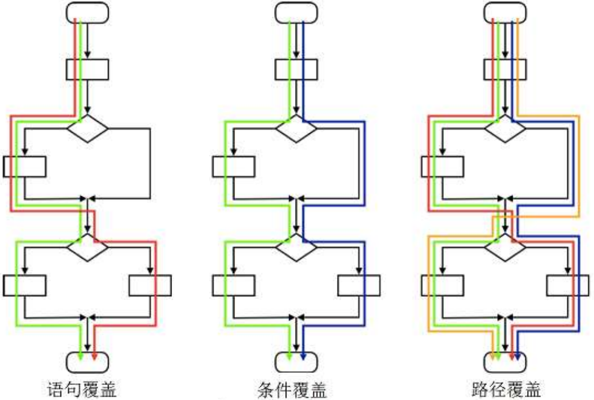

#### 6.2.2 黑盒法

将测试对象作为一个黑盒子，完全基于输入和输出数据来判断测试对象的正确性

测试方法：

1. **等价类划分**：把程序的输入域划分成若干部分（子集），然后从每一个子集中选取少数具有代表性的数据作为测试用例。在该子集合中，各个输入数据对于揭露程序中的错误都是等效的
   - 有效等价类：对于程序的规格说明来说是合理的、有意义的输入数据构成的集合。可检验程序是否实现了规格说明中所规定的功能和性能
   - 无效等价类：对于程序的规格说明来说是不合理的、无意义的输入数据构成的集合。可检验程序是否规避了各种错误与异常
   - 有助于等价类划分的启发式规则：
     - 若规定了输入数据的个数，则类似地可以划分出一个有效的等价类和两个无效的等价类
     - 若规定了输入值的范围，则要划分出一个有效的等价类（输入值在此范围），两个无效的等价类（输入值小于最小值或大于最大值）
     - 若规定了输入数据的一组值，而且程序对不同输入值做不同的处理，则每个允许的输入值是一个有效的等价类，此外还有一个无效的等价类（任意一个不允许的输入值）
     - 若规定了输入数据必须遵循的规则，则可以划分出一个有效的等价类（符合规则）和若干个无效的等价类（从不同角度违反规则）
     - 若规定了输入数据为整型，则可以划分出正整数、零和负整数三个有效的等价类；
     - 若程序的处理对象是表格，则应该使用空表，以及含一项或多项的表
2. **边界值分析**：对等价类划分方法的补充。针对边界情况设计测试用例，可以发现更多的缺陷
3. **决策表**：由条件声明、行动声明、规则选项和行动选项四个象限组成的表格，用于测试以复杂逻辑判断为规格的测试对象

4. **状态转换**：专门针对复杂测试对象。
   - 先为测试对象建立状态图，描述测试对象的状态集合、输入集合和输入导致的状态转换集合
   - 以状态图为基础，可以建立测试对象的状态转换表。状态转换表的每一行都应该被设计为测试用例
   - 状态转换包含有效转换和无效转换，只有在复杂情况和可靠性要求较高的情况下才会为无效转换设计测试用例

### 6.3 测试用例的设计

1. 如上：等价类划分、边界值分析

2. 错误推测？

3. 逻辑覆盖以及各种覆盖之间的区别：
   - 语句覆盖：选取足够多的测试数据，使被测试程序中每个语句至少执行一次
   - 判定覆盖：选取足够多的测试数据，使被测试程序中不仅每个语句至少执行一次，而且每个判定的每种可能的结果都至少执行一次
   - 条件覆盖：选取足够多的测试数据，使被测试程序中不仅每个语句至少执行一次，而且每个判定表达式中的每个条件都取到各种可能的结果
   - 判定/条件覆盖：判定表达式中的每个条件都取到各种可能的结果，而且每个判定表达式也都取到各种可能的结果
   - 条件组合覆盖：选取足够多的测试数据，使得判定表达式中条件的各种可能组合都至少出现一次
   - 路径覆盖：选取足够多的测试数据，使得程序的每条可能路径都至少执行一次（若程序图中有环，则每个环至少经过一次）

4. 用白盒法、黑盒法设计测试用例：参考作业

## 7 软件维护

### 7.1 软件维护的类型

- 完善性维护：满足用户新的需求、增加软件功能
- 适应性维护：使软件能适应新的环境
- 修正性维护：排除软件产品中遗留缺陷
- 预防性维护：让软件产品在将来可维护，提升可维护性

### 7.2 软件维护技术

#### 7.2.1 遗留软件

- 没有使用价值，直接丢弃
- 还有使用价值，但维护的成本效益比低于新开发一个软件系统的成本效益比，则冻结遗留软件，将其作为一个新的更大系统的组成部分进行使用
- 遗留软件的成本效益比高于新开发一个软件系统的成本效益比，且该遗留软件仍然具备较好的可维护性，则逆向工程遗留软件并继续维护一段时间
- 遗留软件的成本效益比高于新开发一个软件系统的成本效益比，且该遗留软件已经不具备可维护性，则修改系统使其获得新生（即再工程该系统），然后继续维护再造后的系统。

#### 7.2.2 逆向工程

- 分析目标系统，标识系统的部件及其交互关系，并且使用其它形式或者更高层的抽象创建系统表现的过程
- 抽取软件系统的需求与设计而隐藏实现细节，然后在需求与设计的层次上描述软件系统，以建立对系统更加准确和清晰的理解

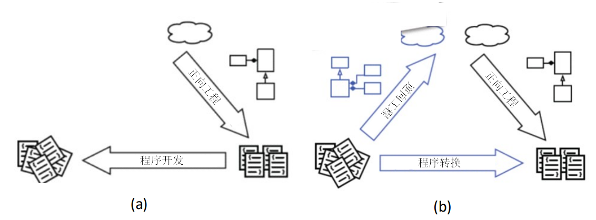

### 7.2.3 再工程

- 对遗留软件系统进行分析和重新开发，以便进一步利用新技术来改善系统或促进现存系统的再利用

- 再工程的活动：改进人们对软件的理解；改进软件自身，通常是提高其可维护性、可复用性和可演化性
  - 具体活动：重新文档化；重组系统的结构；将系统转换为更新的编程语言；修改数据的结构组织

# 面向对象软件工程方法

## 8 面向对象的需求分析

### 8.1 面向对象的分析方法

从问题领域到需求，结构视角出发自底向上的分析？

系统是对象的集合，这些对象之间相互协作，共同完成系统的任务，以功能和数据为基础

### 8.2 UML 需求建模

#### 8.2.1 用例与用例描述

1. **用例**：在系统和外部对象的交互当中所执行的行为序列的描述，包括各种不同的序列和错误的序列，它们能够联合提供一种有价值的服务
2. 用例描述了在不同条件下系统对某一用户的请求的响应。根据用户的请求和请求时的系统条件,系统将执行不同的行为序列, 每一个行为序列被称为一个场景。一个用例是多个场景的集合。

#### 8.2.2 用例图

1. 基本元素：
   - 用例：水平的椭圆
   - 参与者：小人
   - 关系
   - 系统边界：矩形框

2. 用例图的建立
   - 进行目标分析与确定解决方向
   - 寻找参与者
   - 寻找用例
   - 细化用例
     - 不要将粒度细化得过小，不要将用例细化为单个操作
     - 不要将同一个业务目标细化为不同用例
     - 不要将没有业务价值的内容作为用例

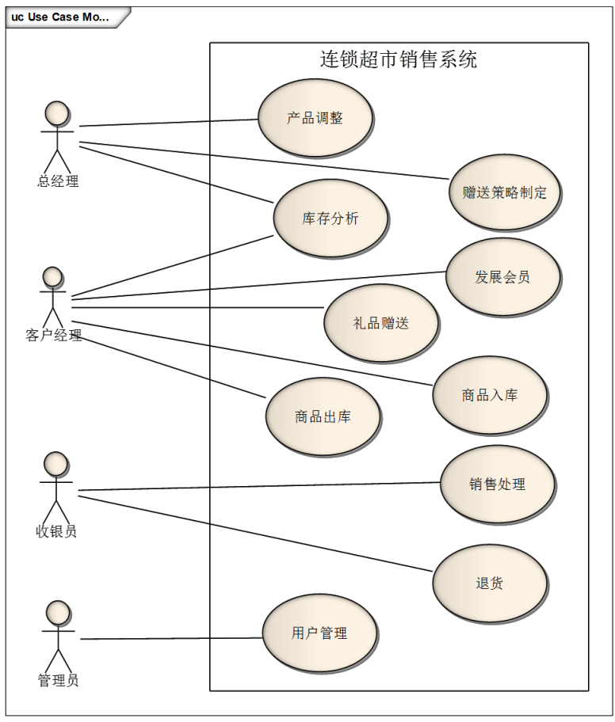

#### 8.2.3 概念类图（领域模型）

1. 类图是面向对象分析方法的核心：描述类（对象）和这些类（对象）之间的关系
2. 关注系统与外界的交互，而不是软件系统的内部构造机制，不会出现类型、方法、可见性等复杂的软件构造细节

3. 基本元素

   - 对象
     - 标识符
     - 状态
     - 行为

   - 类：对象是类的实例。名称、属性、行为方法

   - 链接：描述了对象之间的物理或业务联系

   - 关联：对象之间链接的抽象、聚合与组合

   - 继承：子类是父类的**特化**，父类是子类的**泛化**

4. 建立概念类图

   - 对每个用例文本描述，尤其是场景描述，建立局部的概念类图
     - 根据用例的文本描述，识别候选类
       - 发现软件系统与外界交互时可能涉及的对象与类，它们就是候选类
       - 行为分析、名词分析、CRC 等很多种方法都可以用来分析用例文本描述
     - 筛选候选类，确定概念类
       - 依据系统的需求
       - 该类的对象实例的状态与行为是否完全必要
     - 识别关联
     - 识别重要属性

   - 将所有用例产生的局部概念类图进行合并，建立软件系统的整体概念类图

6. 关系线：

   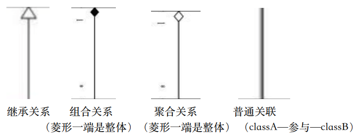

#### 8.2.4 顺序图

步骤：1）确定上下文环境；2）根据用例描述找到交互对象；3）按照⽤例描述中的流程顺序逐步添加消息

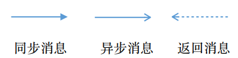

1. 顺序图

2. 系统顺序图

#### 8.2.5 状态图

- 概念

  - 状态：⼀组观察到的情况，在⼀个给定的时间描述系统⾏为 

  - 状态转换：从⼀个状态到另⼀个状态的转移 

  - 事件：导致系统表现出可预测⾏为的事件 

  - 活动：作为产⽣转换的结果⽽发⽣的过程

- 建立状态图：
  - 确定上下文环境
  - 识别状态
  - 建立状态转换
  - 补充详细信息，完善状态图

## 9 面向对象的设计

### 9.1 软件体系结构

#### 9.1.1 体系结构抽象与实现、部件、连接件和配置

1. 软件体系结构 = {部件(Component)，连接件(Connector)，配置(Configuration)}

   - “部件”是软件体系结构的基本组成单位之一，承载系统的主要功能，包括处理与数据

   - “连接件”是软件体系结构的另一个基本组成单位，定义了部件间的交互，是连接的抽象表示

   - “配置”是对“形式”的发展，定义了“部件”以及“连接件”之间的关联方式，将它们组织成系统的总体结构

​	一个软件系统的体系结构规定了系统的计算部件和部件之间的交互

2. 区分物理与逻辑：高层 vs 低层、抽象 vs 实践、逻辑是更加高层的视角

   1. **模块**

      - 逻辑：一个模块调用另一个模块
        物理实现：

        - 基本：接口调用

        - 需要传递数据对象怎么办？

      - 逻辑：一个模块给另一个模块传递数据流
        物理实现：读写共享数据、pipe…

   2. **物理实现的载体**
      - 低层：基本类型+基本控制结构
      - 中层：OO编程语言机制
        - 类声明、实例创建与撤销、实例⽣命期管理
        - 类权限控制机制
        - 复杂机制：继承…
      - 高层：导⼊导出和名称匹配

   3. **导入导出机制**

   4. **抽象 vs 实现**

      1. 建筑设计

      2. 函数式组织

      3. 体系结构设计

      4. 软件实施机制

3. 高层抽象：

   1. **部件**是计算和状态的聚合
   2. **连接件**是组件之间的关系的聚合

   - 软件体系结构设计：部件、连接件、配置
   - 软件详细设计：过程、调用；类；协作；模块、导入 / 到处
   - 软件底层设计：类型、语句；数据结构、算法

   **理解高层抽象**：

   - 连接件是一个与部件平等的单位
   - 部件与连接件是比类、模块等软件单位更高层次的

   1. **部件**

      - 可以分为**原始**（Primitive）和**复合**（Composite）两种类型
      - 原始类型的部件可以直接被实现为相应的软件实现机制

      - 复合部件则由**更细粒度**的**部件和连接件**组成，复合部件通过局部配置将其内部的部件和连接件连接起来，构成一个整体

   2. **连接件**

      - 也可以分为**原始**（Primitive）和**复合**（Composite）两种类型

      - 原始类型的连接件可以直接被实现为相应的软件实现机制
      - 复合连接件则由更细粒度的**部件和连接件**组成，复合连接件通过局部配置将其内部的部件和连接件连接起来，构成⼀个整体

   3. **配置**
      - 一种将部件和连接件整合起来，构成系统整体结构，达到系统的整体结构的机制
   4. 高层抽象的好处：
      - 直观、便于理解
      - 验证正确性
      - 关注度分离，降低复杂度

#### 9.1.2 体系结构风格

**主程序 / 子程序**

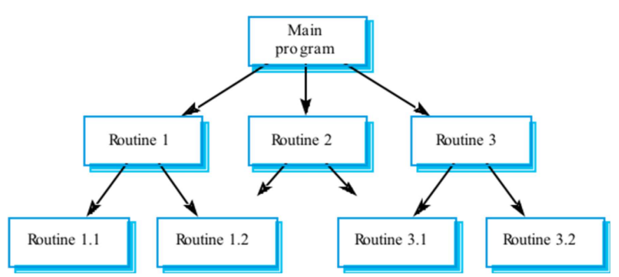

主程序：系统的控制器，负责调度各子程序的执行
子程序：局部的控制器，负责调度其子子程序的执行

1. 设计决策与约束
   - 基于声明-使用(程序调用)关系建立连接件，以层次分解的方式建立系统部件，共同组成层次结构。
   - 每⼀个上层部件可以“使用”下层部件，但下层部件不能“使用”上层部件，即不允许逆方向调用。(层次性分解，基于定义使用关系)
   - 系统应该是**单线程**执行。主程序部件拥有初的执行控制权，并在“使用”中将控制权转移给下层子程序。
   - 子程序只能够通过上层转移来获得控制权，可以在执行中将控制权转交给下层的子程序，并在自身执行完成之后必须将控制权还交给上层部件。

2. 实现
   - 主要实现机制：模块实现。
   - 功能分解
   - 集中控制
   - 每个构件⼀个模块实现：主要是**单向依赖**
   - 使用utility或tools等基础模块

3. 效果：
   - 优点：
     - 流程清晰，易于理解（符合分解和分治的思想）
     - 强控制性（容易保证正确性）
   - 缺点：
     - 程序调用是一种强耦合的连接方式，非常依赖交互方的接口规格，这会使得系统难 以修改和复用
     - 程序调用的连接方式限制了各部件之间的数据交互，可能会使得不同部件使用隐含的共享数据交流，产生不必要的公共耦合，进而破坏它的“正确性”控制能力。

4. 应用

**9.3.2 面向对象式**

1. 设计决策与约束
   - 依照对数据的使用情况，用信息内聚的标准，为系统建立对象部件。每个对象部件基于内部数据提供对外服务接口，并隐藏内部数据的表示
   - 基于方法调用（Method Invocation）机制建立连接件，将对象部件连接起来
   - 每个对象负责维护其自身数据的一致性与完整性，并以此为基础对外提供“正确”的服务
   - 每个对象都是一个自治单位，不同对象之间是平级的，没有主次、从属、层次、分解等关系
2. 实现
   - 主要实现机制：模块实现
   - 任务分解
   - （委托式）分散式控制
   - 每个构件一个模块实现
     - 使用接口将双向依赖转换为单向依赖
     - 将每个构件分割为多个模块，以保证单向依赖
     - 每个模块内部可以是基于面向对象方法，也可以基于结构化 
   - 使用utility或tools等基础模块
3. 效果
   - 优点：
     - 内部实现的可修改性
     - 易开发、易理解、易复用的结构组织
   - 缺点：
     - 接口的耦合性
     - 标识（Identity）的耦合性
     - 副作用
4. 应用

**分层**

1. 设计决策与约束

   - 从最底层到最高层，部件的抽象层次逐渐提升。每个下层为邻接上层提供服务，每个上层将邻接下层作为基础设施使用。也就是说，在程序调用机制中上层调用下层。
   - 两个层次之间的连接要遵守特定的交互协议，该交互协议应该是成熟、稳定和标准化的。也就是说，只要遵守交互协议，不同部件实例之间是可以互相替换
   - 两个层次之间的连接要遵守特定的交互协议，该交互协议应该是成熟、稳定和标准化的。也就是说，只要遵守交互协议，不同部件实例之间是可以互相替换的
   - 跨层次的连接是禁止的，不允许第 I 层直接调用 I+N（N>1）层的服务
   - 逆向的连接是禁止的，不允许第 I 层调用第 J（J<I）层的服务

2. 实现

   - 关注点分离（每层逐次抽象）

   2. 层间接口使用固定协议（固定控制）
   3. 每层一或多个模块实现
      1. 单向依赖
      2. 层间数据传递建立专门模块
   4. 使用utility或tools等基础模块

3. 效果

   - 优点：
     - 设计机制清晰，易于理解
     - 支持并行开发
     - 更好的可复用性与内部可修改性
   - 缺点：
     - 交互协议难以修改
     - 性能损失
     - 难以确定层次数量和粒度

4. 应用

**MVC（模型-视图-控制）**

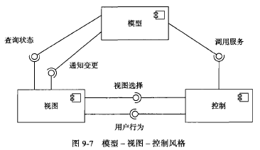

1. 设计决策和约束

   - 模型、视图、控制是分别是关于业务逻辑、表现和控制的三种不同内容抽象
   - 如果视图需要持续地显示某个数据的状态，那么它首先需要在模型中注册对该数据的兴趣。如果该数据状态发生了变更，模型会主动通知视图，然后再由视图查询数据的更新情况
   - 视图只能使用模型的数据查询服务，只有控制部件可以调用可能修
     改模型状态的程序
   - 用户行为虽然由视图发起，但是必须转交给控制部件处理。对接收到的用户行为， 控制部件可能会执行两种处理中的一种或两种：调用模型的服务，执行业务逻辑；提供下一个业务展现
   - 模型部件相对独立，既不依赖于视图，也不依赖于控制。虽然模型与视图之间存在一个“通知变更”的连接，但该连接的交互协议是非常稳定的，可以认为是非常弱的依赖

2. 实现

   - 需要为模型、视图和控制的每个部件实例建立模块实现，各模块间存在导入 / 导出关系，程序调用连接件不需要显式的实现

3. 效果

   - 优点：
     - 易开发性
     - 视图和控制的可修改性
     - 适宜于网络系统开发的特征

   - 缺点
     - 复杂性
     - 模型修改困难

4. 应用

#### 9.1.3 体系结构设计过程与原型构建

1. 体系结构设计过程：
   - 分析关键需求和项目约束
   2. 选择体系结构风格
   3. 进行软件体系结构逻辑（抽象）设计
   4. 依赖逻辑设计进行软件体系结构物理（实现）设计
   5. 完善软件体系结构设计
   6. 定义构件接口
   7. 迭代过程 3-6
2. 体系结构的原型构建
   - 包的创建：包是用于将系统组织成层次结构的机制，可以根据构件的设计来创建项目的包
   - 重要文件的创建：可选数据：文件系统、文件配置、文件
   - 定义构件之间的接口：
     - 根据分配的需求确定模块对外接口，如逻辑层接口根据界⾯的需求得到，数据层接口根据逻辑层调⽤得到
       根据刺激与响应确定接口，依据详细规格明确接口内容（数据、返回值） 
       （1）通常情况下，VIEW的required接口可以直接作为相应Logic的Provided
       （2）通常情况下，LOGIC的required接口需要分解为同层模块和不同Data的Provided
       （3）Data⼀般没有层间依赖，接口通常来⾃于上⼀层的相应模块
   - 关键需求的实现：
     - 实现一些关键**功能需求**
     2. 对原型的**非功能性指标**进行估算和验证。如果出现不符合非功能性需求和项目约束的情况，我们还需要重新对体系结构设计进行调整

### 9.2 详细设计方法

#### 9.2.1 面向对象设计方法

1. 职责与静态模型
   - 抽象对象的职责：类的职责主要由两部分组成：属性职责和方法职责。属
     性主要表示对象的状态，方法主要表示对象的行为。
   - 抽象类之间的关系：关系强弱：依赖＜关联＜聚合＜组合＜继承
   - 添加辅助类：接口类、记录类（数据类）、启动类、控制器类、实现数据类型的类、容器类
2. 协作与动态模型
   - 抽象对象之间的协作

     - 两种方法：
       - 从小到大，将对象的小职责聚合形成大职责
       - 从大到小，将大职责分配给各个小对象

     - 顺序图表示对象之间的协作：对象本身 + 对象之间的消息流

     - 消息种类：同步消息、异步消息、同步消息返回
     - 状态图表示软件的动态模型
   2. 明确对象的创建
   3. 选择合适的控制风格：
      - 集中式：做决策的往往只有一个对象，由这个对象决定怎么来分配职责，怎么来实现大的职责
      - 委托式：做出决策的对象不止一个
      - 分散式：无明确的控制对象

#### 9.2.2 面向对象方法下的模块化

1. 面向对象中的模块：类

   类之间的联系：

   - 模块化希望各个模块之间尽可能相互独立——低耦合
   - 在方法调用方面，两个类的方法之间存在的耦合关系与结构化方法基本一致：内容耦合、重复耦合和公共耦合是不允许的；控制耦合与印记耦合是可以接受的；数据耦合是最好的。
   - **关联**：如果某个类关联另一个类，那么它就持有另一个类的引用，则这个类所有的对象都具有向另一个类的对象发送消息的能力。（访问耦合）
   - **继承**：子类可以访问父类的成员方法和成员变量。（继承耦合）

2. 耦合

   - 访问耦合

     - 分析：

       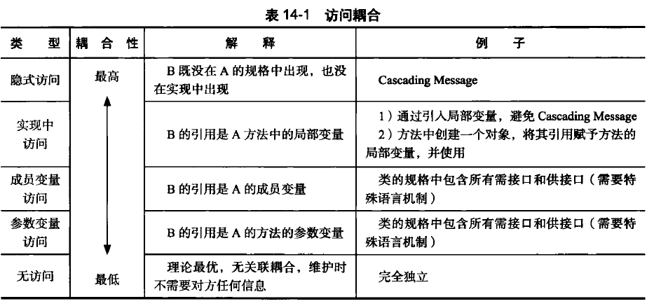

     - 降低访问耦合的方法

       - 针对接口编程

       2. 接口最小化 / **接口分离原则**：将一个统一的接口匹配为多个更独立的接口

       3. 访问耦合的合理范围／**迪米特法则**

          

   - 继承耦合

     - 分析：

       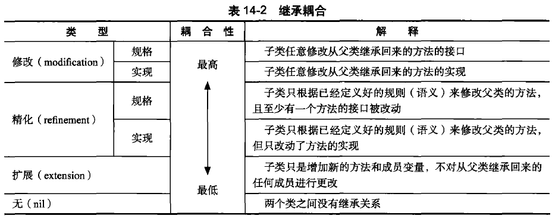

     - 降低继承耦合的方法
       - Liskov 替换原则：子类型必须能够替换掉基类型而起同样的作用
       2. 使用组合替代继承

3. 内聚
   - 面向对象中的内聚
     - 方法的内聚、类的内聚、子类与父类的继承内聚
     - 方法内聚和结构化中的函数内聚一致，主要是体现方法实现时语旬之间的内聚性。内聚性由高到低分为：功能内聚、通信内聚、过程内聚、时间内聚、逻辑内聚、偶然内聚。
     - 类的内聚主要是衡量类的成员变量和方法之间的内聚。类既应该是信息内聚的，又应该是功能内聚的。
     - 继承内聚考虑的则是继承树中类之间的内聚。如果这些类只是为了代码重用将无关的类放入继承树中，则类之间的继承内聚性就比较低。如果类之间具有很好的概念上的联系，则类之间的继承内聚性比较高。
   - 提高内聚的方法
     - 集中信息与行为
     2. 单一职责原则

#### 9.2.3 面向对象方法下的信息隐藏

1. 职责封装
   - 类的职责：类与对象的职责来源于需求。类就应该通过接口对外表现它直接和间接承载的需求，而隐藏类内部的构造机理
   - 封装的含义：
     - 将数据和行为同时包含在类中
     - 分离对外接口与内部实现
       - 接口的内容
         - 对象之间交互的消息（方法名）
         - 消息中的参数
         - 消息返回结果的类型
         - 与状态无关的不变量
         - 需要处理的异常
   - 封装实现细节：
     - 封装数据和行为
     2. 封装内部结构
     3. 封装其他对象的引用
     4. 封装类型信息
     5. 封装潜在变更

2. 为变更而设计

   1. 封装变更／**开闭原则（OCP）**：好的设计应该对“扩展”开放，对”修改“关闭

      - 在发生变更时，好的设计只需要添加新的代码而不需要修改原有的代码，就能够实现变更。

      - 利用**抽象**与**多态**

        - 多态

          - 语义：不同类型的值能够通过统一的接口来操纵

          2. 实现

             

          3. 使用多态实现开闭原则

             - 对于新增加的需求，可以将其实现代码组织为一个新类型，并将新类型与程序中某个原有类型联合起来建立多态机制
             - 对于已有需求的变更，可以将变更后需求的实现代码组织为一个新类型，并将类型与其原类型联合起来建立多态机制

   2. **依赖倒置原则（DIP）**

      - 抽象不应该依赖于细节，细节应该依赖于抽象。因为抽象是稳定的，细节是不稳定的

      - 高层模块不应该依赖于低层模块，而是双方都依赖于抽象。因为抽象是稳定的，而高层模块和低层模块都可能是不稳定的

      - 实现：

        

        - 利用 DIP 减少耦合
        2. 利用DIP 实现 OCP

#### 9.2.4 设计模式

1. **可修改性及其基本实现机制**

   1. 可修改性包含着几个方面的质量
      - （狭义）可修改性（对已有实现的修改）
      - 可扩展性（对新的实现的扩展）
      - 灵活性（对实现的动态配置）

   2. 实现可修改性需要将接口与实现分离

      - 通过接口和实现该接口的类完成接口与实现的分离

      - 通过子类继承父类，将父类的接口和子类的实现相分离

      - 继承关系（A＋B）可能使得灵活性下降，因为父类接口的变化会影响子类，这时可以通过组合关系来解决

   - 利用抽象类机制实现可修改性和可扩展性：只要方法的接口保持不变，方法的实现代码是比较容易修改的，不会产生连锁反应。通过简单修改创建新类的代码，就可以相当容易地做到扩展新的需求（不用修改大量与类方法调用相关的代码。
   - 利用委托机制实现灵活性：继承的缺陷：一旦一个对象被创建完成，它的类型就无法改变，这使得单纯利用继承机制无法实现灵活性（类型的动态改变）。利用组合（委托）机制可以解决这个问题

2. **策略模式**

   - 设计分析
     - 首先，可以把上下文和策略分割为不同的类。每个类实现不同的职责，上下文Context类负责满足需求，它除了包含策略信息之外可能还有其他需求职责，而策略类Strategy只负责复杂策略的实现。
     - 其次，上下文类和策略类之间的关系用组合比继承更加合适。组合使得：心上下文类和策略类之间的耦合性会很低；策略类的接口和实现的修改都相对比较容易；如果是继承关系，则上下文类只能在行为的n 种实现里面选一种（对象创建时就选定了策略），而如果是组合关系，上下文类则可以维护一个策略队列，实现n 选多，从而达到动态的配置。
     - 最后，各种策略则在具体策略类(ConcreteStrategy)中提供，上下文类拥有统一的策略接口。由于策略和上下文独立，策略的增减、策略实现的修改都不会影响上下文和使用上下文的客户。当出现新的促销策略或现有的促销策略发生变化时，只需要实现新的具体策略类（实现策略的接口），由客户使用。
   - 解决方案：参与者与协作、应用场景、应用注意点

3. **抽象工厂模式**

   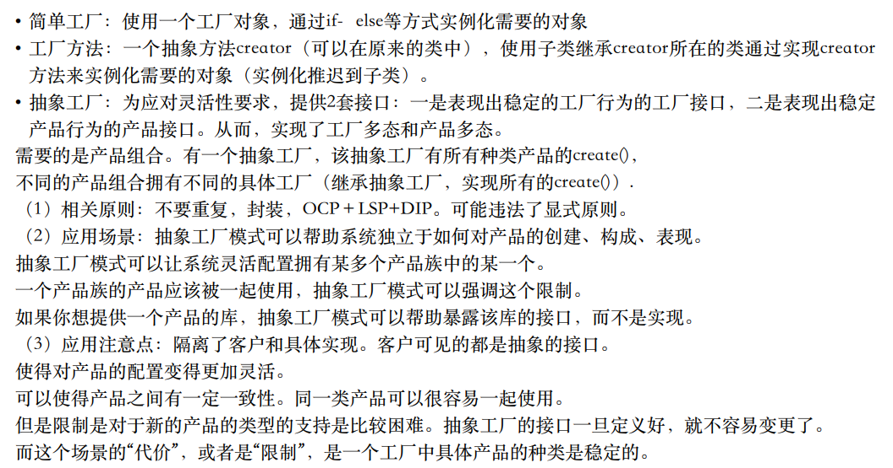

3. **单件模式**

   

4. **迭代器模式**

   

## 10 软件开发过程模型

### 10.1 软件生命周期模型

人们将软件从**生产到报废**的生命周期分割为不同阶段，每段阶段有明确的典型输入/输出、主要活动和执行人，各个阶段形成明确、连续的顺次过程，这些阶段划分就被称为软件生命周期模型。

### 10.2 软件过程模型

软件过程模型在生命周期模型的基础则进一步详细说明各个阶段的任务、活动、对象及其组织、控制过程

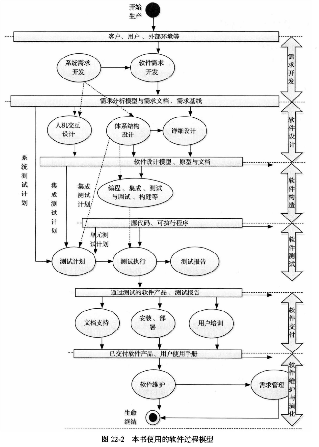

#### 10.2.1 构建-修复模型

1. 背景与动机：最早也是最自然产生的软件开发模型。对软件开发活动没有任何规划和组织，完全依靠开发人员个人能力进行软件开发
2. 缺点：
   - 没有对开发工作进行规范和组织
   - 没有分析需求的真实性
   - 没有考虑软件结构的质量
   - 没有考虑测试和程序的可维护性
3. 适用性：软件规模很小的软件

#### 10.2.2 瀑布模型

1. 背景与动机：按照软件生命周期模型将软件开发活动组织为需求开发、软件设计、软件实现、软件测试、软件交付和软件维护等活动，并且规定了它们自上而下、相互邻接的次序

2. 优点：为软件开发活动定义了清晰的阶段划分（包括了输入/输出、主要工作及其关注点），这让开发者能够以关注点分离的方式更好地进行那些复杂度超越个人能力的软件项目的开发活动

3. 缺点：

   - 对文档的过高的期望具有局限性
   - 对开发活动的线性顺序假设具有局限性

   2. 客户、用户的参与具有局限性：成功的项目开发需要客户、用户从始至终的参与，而不仅仅是一个阶段。
   3. 里程碑粒度具有局限性：里程碑粒度过粗，基本丧失了“早发现缺陷早修复”这一思想

4. 适用性：比较成熟，没有技术难点的软件

#### 10.2.3 增量迭代模型

1. 背景与动机：迭代式、渐进交付和并行开发共同促使了增量迭代模型的产生和普及

2. 描述：在项目开始时，通过系统需求开发和核心体系结构设计活动完成项目对前景和范围的界定，然后再将后续开发活动组织为多个迭代、并行的瀑布式开发模型。需求驱动。少量的不确定性和影响不大的需求变更通过迭代的方式加以解决 

3. 优点：

   - 迭代式开发更加符合软件开发的实践情况，具有更好的适用性

   2. 并行开发可以帮助缩短软件产品的开发时间
   3. 渐进交付可以加强用户反馈，降低开发风险

4. 缺点：

   - 由于各个构件是逐渐并入已有的软件体系结构中的，所以加入构件必须不破坏已构造好的系统部分，这需要软件具备开放式的体系结构。

   2. 增量交付模型需要一个完备、清晰的项目前景和范围以进行并发开发规划，但是在一些不稳定的领域，不确定性太多或者需求变化非常频繁，很难在项目开始就确定前景和范围。

5. 适用性：适用于大规模软件系统的开发

#### 10.2.4 演化模型

1. 描述：将软件开发活动组织为多个迭代、并行的瀑布式开发活动。演化模型能够更好地应对需求变更，更适用于需求变更比较频繁或不确定性较多的领域。

2. 优点：
   - **使用了迭代式开发，具有更好的适用性**，尤其是其演化式迭代安排能够适用于那些需求变更比较频繁或不确定性较多的软件系统的开发
   - 并行开发可以帮助**缩短**软件产品的开发时间
   - 渐进交付可以**加强用户反馈**，降低开发风险
3. 缺点：

   - 无法在项目早期阶段建立项目范围，所以项目的整体计划、进度调度、尤其是商务协商事宜无法准确把握
   - 后续迭代的开发活动是在前导迭代基础上进行修改和扩展的，这容易让后续迭代忽略设分析与设计工作，蜕变为构建-修复方式。
4. 适用性：不稳定领域的大规模软件系统开发

#### 10.2.5 原型模型

1. 背景与动机：原型模型将需求开发活动展开为抛弃式原型开发活动和演化式原型开发活动。原型模型在整体安排迭代的情况下，强调“**抛弃式原型**”的演化模型。抛弃式原型解决对未来知识的局限性产生的**不确定性**，将未来置于现在进行推敲。

   - 演化式原型：在迭代中构建，是系统的核心，并不断扩充，最终成为真正的软件产品
   - 抛弃式原型：通过模拟“未来”的产品，将“未来”的知识置于“现在” 进行推敲，解决不确定性。

2. 优点：

   - 对原型方法的使用加强了与客户、用户的交流，可以让最终产品取得更好的满意度

   2. 适用于非常新颖的领域

3. 缺点

   - 原型方法能够解决风险，但是自身也能带来新的风险，例如原型开发的成本较高，可能会耗尽项目的费用和时间
   - 实践中，很多项目负责人不舍得抛弃“抛弃式原型”，使得质量较差的代码进入了最终产品，导致了最终产品的低质量

4. 适用性：有大量不确定的新颖领域进行开发活动组织

#### 10.2.6 螺旋模型

1. 背景与动机：尽早解决比较高的风险，如果有些问题实在无法解决，那么早发现比项目结束时再发现要好，至少损失要小得多。迭代与瀑布的结合

2. 螺旋模型是风险驱动的，完全按照风险解决的方式组织软件开发活动。
   - 确定目标、解决方案和约束
   - 评估方案，发现风险
   - 寻找风险解决方法
   - 落实风险解决方案
   - 计划下一个迭代

3. 自内向外，螺旋模型有4次风险解决迭代，分别解决了几个高风险的阶段的问题
   - 解决系统需求开发中的风险，尤其是产品概念设计风险，得到一个确定的产品前景和范围
   - 解决软件需求开发中的风险，得到清晰的软件需求
   - 解决软件体系结构设计中的技术风险，构建高质量的核心体系结构原型
   - 解决详细设计和实现中的关键技术风险，建立一个可实现的高质量软件结构。

4. 优点：可以降低风险，减少项目因风险造成的损失

5. 缺点：
   - 风险解决需要使用原型手段，也就会存在原型自身带来的风险，这一点与原型模型相同
   - 模型过于复杂，不利于管理者依据其组织软件开发活动

6. 适用性：高风险的大规模软件系统开发

#### 10.2.7 Rational 统一过程（RUP模型）

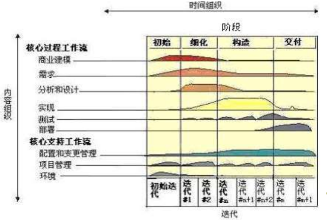

1. 背景与动机：总结和借鉴传统上的各种有效经验，建立最佳实践方法的集合，并提供有效的过程定制手段，允许开发者根据特定的需要定制一个有效的过程模型

2. 核心实践方法：

   - 迭代式开发

   2. 管理需求，重视需求工程中除了需求开发之外的需求管理活动
   3. 使用基于组件的体系结构，它帮助建立一个可维护、易开发、易复用的软件体系结构
   4. 可视化建模，利用UML进行建模
   5. 验证软件质量，尽早和持续地开展验证，以尽早发现缺陷，降低风险和成本
   6. 控制软件变更，适应1990s以后需求变更越来越重要的事实

3. RUP 裁剪

   - 确定本项目需要哪些工作流
   - 确定每个工作流需要哪些制品
   - 确定 4 个阶段之间如何演进，决定每个阶段要哪些工作流，每个工作流执行到什么程度，制品有哪些
   - 确定每个阶段内的迭代计划
   - 规划工作流的组织

4. 优点：

   - 吸收和借鉴了传统上的最佳实践方法，尤其是其核心的6个实践方法，能够保证软件开发过程的组织是基本有效和合理的
   - RUP依据其定制机制的不同，可以适用于小型项目，也可以适用于大型项目的开发，适用面广泛
   - RUP有一套软件工程工具的支持，这可以帮助RUP的有效实施

5. 缺点：

   - 没有考虑交付之后的软件维护问题
   - 裁剪和配置工作不是一个简单的任务，无法保证每个项目都能定制一个有效的RUP过程。

6. 适用：RUP是重量级过程，能够胜任大型软件团队开发大型项目时的活动组织。但RUP经过裁剪和定制，也可以变为轻量级过程，也能够胜任小团队的开发活动组织。

#### 10.2.8 敏捷过程

1. 敏捷原则
2. 极限编程（XP）
3. 特点
4. 适用性：快速变化或者时间压力较大的项目