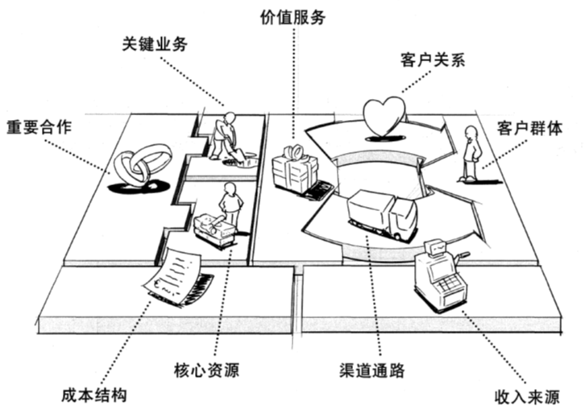

# 1 导论

## 什么是软件？- 从组成成分的角度看软件

- 程序+文档
- 算法+数据结构
- 数据元素之间的逻辑结构与物理结构
- 有穷明确可行的指令集+计算平台
- 编译器+操作系统，或操作系统+硬件

从问题求解的角度看软件：软件是对客观事物的深度抽象与建模，且同时包含了对复杂客观世界的问题空间与解空间的具体描述

需求 – 问题域 – 商业模式，服务 – 解系统 – 需求工程

## 商业模式

定义：**一个商业模式描述的是一个组织创造、传递以及获得价值的基本原理，其本质在于价值的流动**

价值创造与流动过程：

- 企业或组织通过提出的产品或服务主张某种价值（问题解决），并寻找到愿意为该价值主张的“付费”的客户群体。
- 价值主张传导到客户需要建立渠道通路并维持客户关系
- 价值主张往往需要“上游”的核心资源和关键合作（成本来源）

将商业模式引入软件设计的必要性：

- **软件的核心价值与本质性工作**在于帮助企业内组织机构、业务流程、利益获取与分配的各种问题，最终实现价值创造与降本增效
- 新技术与相应的社会变革导致商业模式大量“以旧换新”，从面向确定的已有业务转向以“人”为核心的新业务

需求设计需要融合商业模式设计：需求开发需引入可以简明描述和运用的商业模式分析，并将软件思维与商业模式思维融合

- **通过建模分析工具全面、系统、准确地刻画问题域：为后续目标、任务、交互的逐层转化以及相应的归约描述、验证、管理服务**
- 追求“设计思维” ：以人为根本，构建功能性与情感意义兼具的创意
- 更好地做到以“人”为中心的设计，平衡用户、技术、商业三者的关系，实现企业或组织的可持续发展
- 应对愈发成熟的信息科技加速下沉到更多业务领域所带来的挑战与机遇

## 商业模式画布概览

从左到右实现价值的构建、主张与传递

- 左侧构建价值，产生成本，代表理性
- 右侧主张价值，获取收益，代表感性

围绕商业模式的基本活动

- 画布：基本模型与工具
- 类型：利用画布分析常见的商业模式
- 设计：商业模式的构建手段
- 战略：商业模式的环境、评估、规划、管理
- 流程：完整的商业模式设计流程

## 问题域与解系统

问题域：

- 问题的产生地：当现实的状况与人们期望的状况产生差距时，就产生了问题。
- 要解决问题，就需要改变现实当中某些实体的状态或改变实体状态变化的演进顺序，使其达到期望的状态或演进顺序。
- 这些实体和状态构成了问题解决的基本范围，称为该问题的问题域

解系统：

- 软件系统通过影响问题域，能够帮助人们解决问题，称为解系统
- 问题域是自治的，它有自己的运行规律，而且这些规律不会因解系统的引入而发生改变

软件解决问题的基础：模拟与共享

- 软件系统能够与问题域进行交互和相互影响的原因在于，软件系统中的某些部分对问题域中的某些部分的具有模拟特性
  - 软件系统当中含有问题域某些部分的模型（或模拟），常见的模型包括数据模型、对象模型、处理模型等。 
  - 问题域中的某些信息能够和模型中的信息建立映射关系 
- 这些通过映射建立的共同知识，就是问题域和解系统之间的共享现象
- 最后将解系统的模型操纵与计算结果用于指导现实世界的问题解决

## 需求

需求的四个基本概念：问题域、需求、解系统、需求规格说明

需求（要求，问题域端）

需求规格说明（解系统端）

- 数据：现实世界的模型
- 功能：对模型的操作，将结果反馈回现实世界，（辅助）解决问题
  - 过程式分析：以功能分解为核心
  - 面向对象分析：以封装的数据与对数据的操作为核心

需求的定义：

（1）用户为了解决问题或达到某些目标所需要的条件或能力；
（2）系统或系统部件为了满足合同、标准、规范或其它正式文档所规定的要求而需要具备的条件或能力；
（3）对（1）或（2）中的一个条件或一种能力的一种文档化表述。

需求的重要性

## 需求工程活动的困难性

问题域、目标、任务、交互的相互转化（广义的设计）是创造性的活动

编程与设计方面的能力不能直接用于需求分析

文档撰写、功能验证、基线管理需要丰富的开发与管理经验

**当前需求的重要性**

需求专家尚未意识到敏捷开发带来的颠覆式变革

需求依然是沟通客观世界与计算机世界的唯一渠道

主流开发方式变化使需求开发与管理愈发困难