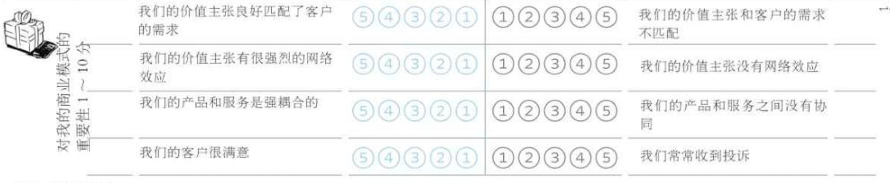
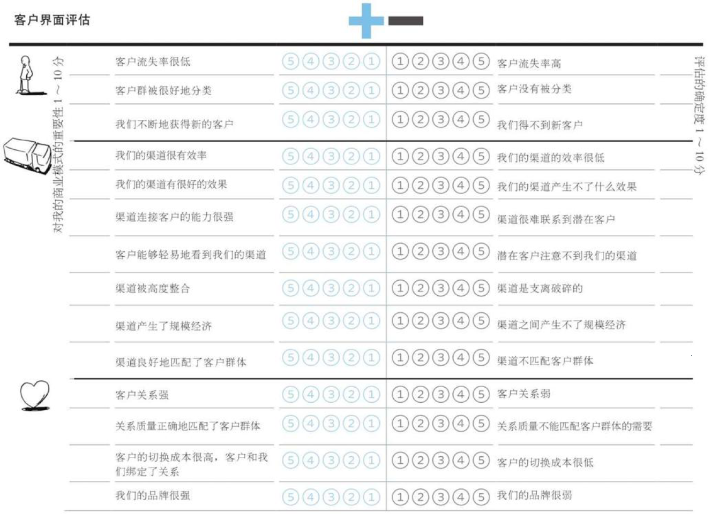
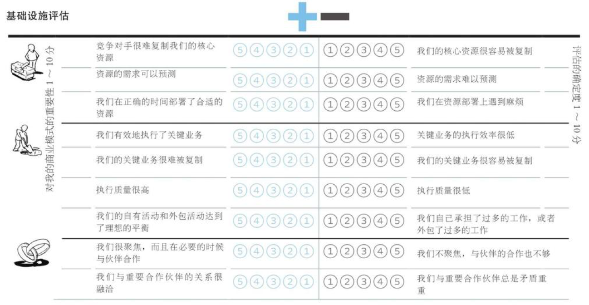
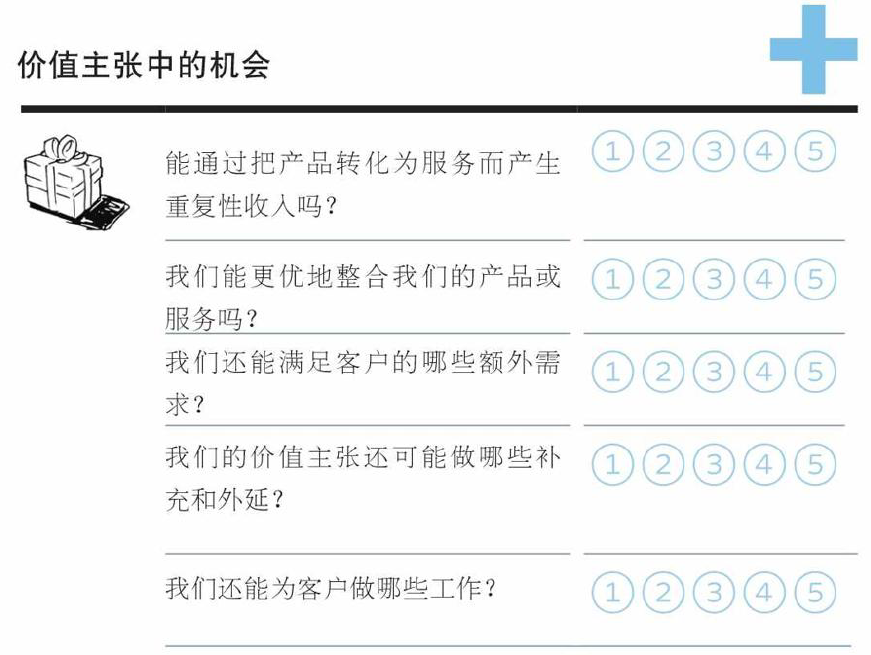
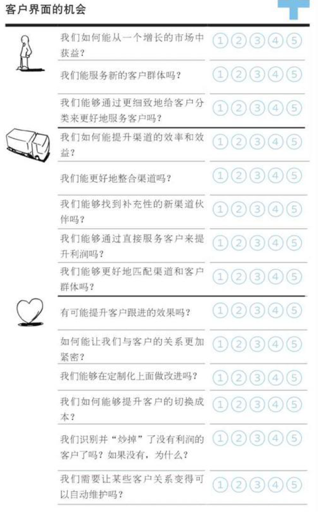
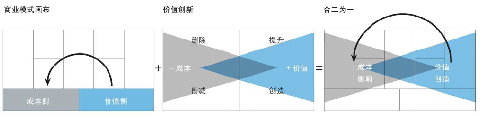
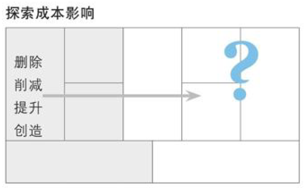

# 4 商业模式战略

## 商业模式环境：背景、设计动力和限制

商业模式的演进（创新）注定是复杂的、不确定的，甚至颠覆性的

市场影响力、行业影响力、关键趋势和宏观经济影响这四个方面的分析为商业模式创新提供了设计空间

- 使用模型构建来展开设计（竞品）
- 通过场景进行对未来的探索（聚焦）

### 市场影响力

**市场问题**

- 从客户和供给的角度识别出驱动和改变你的市场的关键问题
- 影响客户环境的关键问题有哪些？哪些改变正在发生？市场将走向何处？

**市场分类**

- 识别主要的市场群体，描述他们的兴趣点，尝试发现新的群体
- 哪些是最重要的客户群体？哪个群体的增长潜力最大？哪些群体在缩小？哪些边缘群体值得留意？

**需求和诉求**

- 列举市场需求并分析这些需求被满足的程度
- 客户需要什么？没有被满足的客户需求里哪个最值得关注？客户真正想要搞定什么？哪些需求在增加？哪些在减少？

**切换成本**

- 客户转投竞争对手（比如你自己），需要改变哪些方面
- 哪些东西将客户捆绑在一家供应商和它的服务上？哪些切换成本阻止客户转投竞争对手？客户容易找到并采购类似的服务吗？品牌有多重要？

**收入影响力**

- 识别与收入吸引力和定价能力相关的因素
- 客户真正愿意花钱买的是什么？利润中最大的一块从哪里获得？客户能够轻易地找到并购买更便宜的产品和服务吗？

### 关键趋势

**技术趋势**

- 威胁和推动发展当前商业模式的技术趋势
- 你的市场内外的主要技术趋势有哪些？哪些技术代表了重要的机会或者颠覆性的威胁？哪些新兴技术是边缘客户正在逐步采用的？

**行业管理趋势**

- 影响（你的）商业模式的管理规定和管理趋势
- 哪些管理趋势会影响你的市场？哪些规则会影响你的商业模式？哪些管理规定和税费会影响客户需求？

**社会和文化趋势**

- 可能影响（你的）商业模式的社会趋势
- 描述关键社会趋势。文化或社会价值观上的哪些变化会影响你的商业模式？哪些趋势会影响购买者的行为？

**社会经济趋势**

- 总结和你的商业模式有关的主要社会经济趋势
- 关键的人口统计学趋势有哪些？你的市场中收入和财富的分布有哪些特征？描述你所处市场的消费特征。城镇人口相对于农村人口的比例如何？

### 行业影响力

**主流竞争对手**

- 识别它们以及它们的相对优势
- 谁是我们的竞争对手？哪些是我们这个领域的主流玩家？他们的竞争优势或劣势是什么？描述他们的主要产品和服务。他们聚焦哪些客户群体？他们的成本结构如何？他们对我们的客户群体、收益来源和利润有多大影响？

**挑战者**

- 新出现的玩家以及它们商业模式的不同
- 谁是你所处市场的新进入者？他们之间有什么不同？他们有什么竞争优势或劣势？他们必须克服哪些障碍？他们的价值主张是什么？他们聚焦哪些客户群体？他们的成本结构是什么样的？他们对我们的客户群体、收益来源和利润有多大程度的影响？

**替代产品和服务**

- （包括其它市场和行业在内的）替代产品与服务
- 哪些产品和服务能够替代我们的产品和服务？它们的成本与我们相差多少？客户要切换到这些替代品有多容易？这些替代产品起源于何种商业模式传统？

**供应商与价值链上的其他厂商**

- 当前价值链上的关键玩家与新兴玩家
- 谁是你的行业价值链中的关键玩家？你的商业模式在多大程度上依赖其他这些玩家？有边缘玩家在涌现吗？哪个的利润最高？

**利益相关者**

- 哪些人会影响你的组织和商业模式

- 哪些利益相关者会影响你的商业模式？股东的影响力如何？员工呢？政府呢？游说者昵？

### 宏观经济影响

**全球市场情况**

- 从宏观经济角度总结当前整体情况
- 经济处于爆发期吗？描述总体市场情绪，GDP增长率是多少？失业率有多高？

**资本市场**

- 与你的资本需求相关的当前资本市场情况
- 资本市场处于什么状态？在你所处的市场中，获得投资有多容易？现在就能获得种子资本、创业资本、众筹、市场资本或者贷款吗？获取这些投资的成本有多高？

**大宗商品和其他资源**

- 关注你的商业模式所需的资源价格与趋势
- 描述你的业务必备的大宗商品和其他资源的当前市场状态。执行你的商业模式所需的资源有多么容易获取？成本如何？价格走向如何？

**经济基础设施**

- 你的业务市场的经济基础设施
- 你所处市场的（公共）基础设施有多优良？你如何评价交通、贸易、学校质量，以及连接供应商和客户的便利度？个人和企业的税费有多高？对商业组织的公共服务有多好？你如何评价这里的生活质量？

## 评估商业模式

### 定期**评估商业模式**：“年度体检”

一项重要的管理活动，让一个组织评估它的市场地位的健康程度，并做出相应的调整

是商业模式不断进步的基石，或触发一次颠覆性的商业模式创新

商业模式环境 - 由外到内的影响；评估商业模式 - 由内到外的分析

两种评估类型：

- 某商业模式的总体评估，以及相应的未来战略
- 商业模式优势、劣势、机会和威胁（Strength, Weakness, Opportunity, Threat，SWOT）的检查清单

### 对商业模式每个模块进行 SWOT 评估

#### 评估优势 & 劣势

传统 SWOT 分析与商业模式画布结合

- 画布的存在帮助聚焦 SWOT 分析，避免模糊，实现聚焦
- 按照价值主张、成本/收入、基础设施（KR+KA+KP）、客户界面（CS+CH+CR）四类展开评估

SWOT 问了四个简单的大问题。前两个——你的组织的优势和劣势是什么？内部评估你的组织。后两个——你的组织的机会有哪些，面临的潜在威胁又有哪些？在所处的环境下评估你的组织的位置。在这四个问题中，两个识别有利的领域（优势和机会），另两个识别有害的领域。

##### 价值主张（价值观 vs. 性价比）

网络效应：各项价值主张之间相互联系，相互促进

- 产品与服务的强耦合：
  以服务为主的，服务中使用的产品和环境能否满足服务的需要
  以产品为主的，服务能否有效支持产品传递和售后
- 价值观如何构建：客户洞察

##### 成本/收入

是否利润高成本低、收入/成本可预期、收益是否稳定&多样化&可持续、收入账期是否合理、客户需要与定价机制是否合理、运营效率&能否扩大规模后受益

##### 客户界面

客户细分：客户忠诚度、客户分类（洞察）、持续获客与获客成本
渠道通路：效率、效果、连接能力、易于接触、是否整合、规模经济、匹配
客户关系：品牌、匹配、切换成本 - 强渠道或服务难以替代

客户连接、分类、拉新的质量；渠道的效率、效果、曝光度&匹配度、是否整合且产生规模经济；产品品牌、是否良好匹配客户、切换成本是否较高

##### 基础设施

核心资源的排他性、可预测性、时效性；关键业务的独特性与完成质量；自身是否聚焦且能与重要合作伙伴展开良好合作

#### 评估威胁

对价值主张的威胁（可替代性）

对成本/收入的威胁（利润的威胁、是否单一、缩水、无法预测、无法支撑）

对基础设施的威胁（供应不足、干扰、合作关系波动）

客户界面上的威胁（市场竞争、渠道威胁、客户关系恶化）

#### 评估机会

价值主张中的机会（整合、服务化与拓展）

- VP：产品与服务能否整合，产品能否服务化？
- 价值主张的补充和外延？
- 满足客户的额外需求或其它可做的工作？

成本/收入中的机会（可重复、交叉销售、开源节流）

- R$：重复性收入代替一次性收入（会员自动续费）、寻找额外买单元素与交叉销售的机会（套餐与B站影视）、新的收益来源（B站会员购、花火平台、线下授权火锅+烧烤）、能否提价（共享单车与瑞幸的涨价）
  - 交叉销售，通过客户关系管理发现现有顾客的多种需求，并通过满足其需求而销售多种相关服务或产品的一种新兴营销方式
- C\$：成本削减（全要素生产率：劳动、资本、原材料、能源等所有生产要素，决定不同经济体增长差异）

基础设施中的机会（强化核心、减轻负担、转让闲置）

- KR：核心资源的降本、外包、强化、转让（降本增效、技术壁垒、技术转让，可口可乐灌装厂的自营与外包）
- KA：标准化、IT技术带来的整体效率提升（海尔设计团队的微服务化，实体产业的互联网化，机构组织的扁平化）
- KP：外包与核心业务聚焦、交叉销售与更好的客户连接、价值主张补充（荣耀的剥离与米家化、联名款）

客户界面的机会（增长的市场、客户细分、渠道优化与去中间商，客户关系加强与取舍）

- CS：找到增长的市场并从中获利、服务新客户群体或更细致的已有客户分类（不断涌现的社交类产品 – 青藤之恋）
- CH：渠道的效率、效益、整合，补充性的渠道伙伴，去中间商、渠道客户匹配（腾讯与京东，PDD与B站，淘宝直播）
- CR：加强与客户的关系并提升客户跟进的效果（华为19年近20%的盈利增长）、进一步定制化或可自动维护（字节系产品：自动化地信息流定制）、提升切换成本（苹果生态：靠手机 => 靠Mac）、是否抛弃没有利润的客户以及原因（发掘潜力或果断抛弃，字节跳动=>抖音集团与旗下汽水音乐）

## 蓝海战略

**蓝海战略**：通过根本性的差异化来创造全新的行业，而不是模仿现有商业模式在当前行业中竞争

- 价值创新：不是在传统的绩效指标下超越对手，而是创造新的、未充分竞争的市场空间
- 画布的可视化效果为蓝海战略带来“全局化”的视角
- 通常还与开拓未被开发的客户群体相结合

蓝海战略的“四项行动架构”（增加价值，减少成本）

- 行业中哪些理所当然的要素应被删除
- 哪些要素应被大幅消减至行业标准以下
- 哪些要素应该被大幅调整到行业标准之上
- 哪些行业中从未提供的要素是应该被创造出来的

### 整合蓝海战略框架和商业模式画布

商业模式右半部关注价值、聚焦客户，左半部分关注成本和基础设施。右侧的改变回对左半部分产生影响

蓝海战略强调在增加价值的同时减少成本，通过删除和消减低价值产品或服务来降低成本，通过提升和创造对成本影响弱的高价值功能或服务来实现

二者的整合使得使用“四项行动架构”分析时能够更好地识别这些行动对商业模式其它模块的影响

### 通过四项行动架构探究你的画布

|  |  |  |
| ------------------------------------------------------------ | ------------------------------------------------------------ | ------------------------------------------------------------ |
| 哪些活动、资源和合作伙伴关系的成本最高？                     | 哪些低价值的功能或者服务可以被删除或消减？                   | 你可以聚焦哪些新的客户群体，哪些客户群体可以消减或删除？     |
| 如果消减或删除这些成本项，会发生什么？                       | 可以通过新增或加强哪些功能或服务来产生有价值的客户新体验？   | 新的客户群体真正希望你帮他们完成哪些工作？                   |
| 在删减或消除代价高昂的KR、KA或KP后，如何利用低成本的元素来代替它们创造价值 | 价值主张的改变对成本有何影响？                               | 这些客户倾向于何种联络方式，他们期望与你建立何种关系？       |
|                                                              | 价值主张的改变如何改变商业模式客户侧内容？                   | 服务新客户群体对成本有何影响？                               |

### 辩证地对待蓝海战略：必要性与风险

蓝海战略的必要性：

- 当一个专注于特定领域的公司一家独大时，会为了继续扩大规模而使用非常规手段消灭竞争，利用垄断优势剥削上下游，恶化口碑

- 之后会出现戴维斯双杀：利润率翻倍但股价不涨（没有发展预期），每股收益与市盈率下降
- 在中国会出现优秀人才大规模离开，用户体验下降导致口碑大规模恶化
- 在某个领域取得绝对优势后，无法通过开拓新的赛道满足企业继续成长的压力，导致采用非常规手段争抢和压榨领域内达到上限的利润和资源，最终自我毁灭（内卷化）

（错误的）蓝海战略的风险：空心化、外部潮流与形势变更

- 人类兴趣三年一小变五年一大变（**过于探索客户 – 偏离**）
- （供应链）经济全球化带来的蝴蝶效应（**过于探索成本 – 外包异常**）
- 在一个有限的时间段内，产品与服务过于聚焦某个明星品类（**过于探索客户与价值主张**），过于迷信利润率（**过于探索成本**）
  - 导致“护城河”性质的业务、后续发展的持续动力、或用户信赖的基础丧失

## 管理多种商业模式

组织的艰巨任务：如何在实施和管理新商业模式的同时维持现有的商业模式

- 将新商业模式剥离成一个独立的实体，或者成立独立的业务单元，或维持现状
- 拆分商业模式：基础服务、客户关系、新业务

衡量是否拆分的双变量：两种模式冲突的严重程度；战略上的相似性
